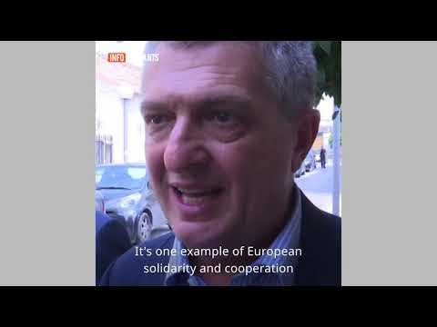

### AYS Daily Digest 5/2/20: “NGOs are like bloodsuckers”\- Greek Migration Minister

**\(Legal Centre Lesvos\)**
### Featured
### Greece

On Tuesday, 4 February, the Greek Migration and Asylum Ministry delivered to Parliament their amendment requiring all NGOs with an operational mandate encompassing migrants, refugees and asylum seekers to register with the authorities, informing them of their level of membership and number of employees\. Describing the NGOs on the Aegean islands on the popular radio station Protothema, Deputy Migration Minister Giorgos Koumoutsakos said [‘these organisations sprang like mushrooms after the rain\. Some behave like bloodsuckers”](https://www.dailysabah.com/europe/2020/02/05/greece-orders-all-ngos-to-register-in-aegean-islands) \. Later that day during an interview with Thema FM, the minister further denounced these NGOs, accusing them of cooperating with human traffickers, citing the shore rescue operations that many organisations run, claiming that [“the dark roots of this interest networks must be brought to light’\.](https://www.keeptalkinggreece.com/2020/02/05/greece-ngos-leeches-alternate-migration-minister/)

Koumoutsakos has previously been quoted, accusing these NGOs of abusing the volatile situation to [‘tap EU funding’](https://www.dailysabah.com/europe/2020/02/05/greece-orders-all-ngos-to-register-in-aegean-islands) and he even implied that the recent protests regarding the inhumane living conditions at Camp Moria were incited by these organisations\.

Responding to the proposed increased securitisation of humanitarian organisations, [Tim Röhn](https://www.welt.de/debatte/kommentare/article205621787/Fluechtlinge-Griechenlands-neues-NGO-Gesetz-ist-eine-Schande.html?fbclid=IwAR3SUxJxGW8d81xr9QQ4cAY-Iu1BNcBzXgskhgj3HvfG5gZxnDpwqpF6DYs) argued that it was only because of the work of these local NGOs who set up across the Islands to supply tents, distribute food and buy clothes for toddlers that there had been so few deaths on the Aegean\. He believes that much of the problem would have been solved ‘if the authorities had been able and willing to fulfill their humanitarian obligations’ since the beginning of the crisis\.

Yesterday, calls by Kostas Moutzouris, Regional Governor of North Aegean, to declare a state of emergency on Lesvos in the wake of the recent unrest by both camp and local residents was rejected by the Greek government\.

Reflecting on the protest and unrest on Moria, Greek Migration Minister Notis Mitarakis described these protests as ‘intimidation tactics’, stating that ‘this kind of abusive and aggressive behaviour does not equal the granting of asylum’\. Mitarakis claimed that in the wake of the unrest that ‘the Greek authorities are stepping up security and safeguards, as well as investigating the possibility of some people inciting such incidents’ possibly referring to the comments made by Deputy Minister Komoutasakos that sought to implicate NGOs working within the region\.

In addition to protests amongst camp residents, the island of Lesvos has seen an increasing spate of unrest and violence amongst the local population\. It was confirmed today that one refugee and one local woman were being treated in hospital after being beaten by local fascists\. Additionally, in Moria, one NGO confirmed that their house and car were attacked with rocks by locals within the village\. A statement released by SYRIZA regarding the ongoing unrest seemingly placed the blame for the attacks on the ‘intolerant and racist rhetoric’ by the Greek government that ‘has poisoned local communities’\.
### France

It can be confirmed that in Paris on Tuesday, the local authorities evicted the last of the camps on the edges of the canal at La Villette\. The continuous evictions over the last week, often occurring at the break of dawn, have forced up to 1,400 people, including 93 children, to scatter across Paris to find safe shelter once again\. Speaking to AFP, the authority for the Ile\-de\-France region said, “There are no more camps, that was the idea” further confirming that “the police will monitor this site to ensure there are no resettlements”\. The local authorities took steps to rehouse some of the residents, but reports indicate that only 427 people were moved to alternative accommodation, including a gymnasium\. Critics of the government’s policy of camp evictions claim that unless the government provides long\-term solutions to the housing crisis or provides the solution of legal residency, many of these people will be forced to return to the streets\.
### U\.K\.

[The British Home Office](https://www.theguardian.com/uk-news/2020/feb/05/home-office-told-to-act-as-detainees-unable-to-contact-lawyers) has been accused of holding immigration detainees in facilities that prevent them, because of the lack of a mobile signal, from contacting their family and legal teams before a scheduled mass deportation flight chartered for 11 February\.

The High Court has told the home secretary that she has until Thursday to explain how the government will solve the ‘signal disruption’ that has been occurring at the Harmondworth and Colnbook immigration removal centres\.

The forced deportation of 50 Caribbean nationals will be the first deportation of its kind since the Windrush scandal in the U\.K\. Whilst Prime Minister Boris Johnson upheld that the deportation should go ahead because they are all ‘serious criminals’, evidence was presented within the House of Commons that suggested the contrary\. The [Joint Council for the Welfare of Immigrants](https://www.shropshirestar.com/news/uk-news/2020/02/05/vulnerable-people-among-up-to-50-on-jamaica-deportation-flight-charity/) \(JCWI\) additionally stated that ‘many of those facing deportations have been residents in the UK for decades and have close family ties’\. The JCWI also stated that potential victims of trafficking, county line exploitation and very vulnerable individuals have all been scheduled for deportation and expressed their serious concern about the government’s handling of the situation\.
### The United Nations

Calling on world leaders to provide more refugee resettlement opportunities, the [UNHCR confirmed](https://www.youtube.com/watch?v=pvGQZvslZCs) that less than five per cent of refugees who were deemed in urgent need of resettlement last year were moved to safety\. The UN Refugee Agency stated that whilst a slight increase from the previous year, only 63,686 \(4\.5%\) of the more than 1\.4 million people in ‘urgent need’ were resettled, highlighting the huge gap that remains between the places made available by governments and those who are in need\.

The UNHCR itself routinely comes under fire for its failure within the resettlement process\. Former UNHCR staffers and humanitarian policy experts alike have previously been reported lambasting the UNCHR for its unwillingness to be more assertive against the states who fail to open their doors to those in need\.

### Germany

[A study published this week](https://www.infomigrants.net/en/post/22565/germany-half-of-refugees-find-jobs-within-five-years) of refugee integration in Germany found that 49% of the refugees who have arrived in Germany since 2013 were successful in finding steady employment within five years\. The Institute for Labour Market and Vocational Research which was responsible for conducting the study applauded the German government’s efforts stating that ‘significantly more has been invested in language and other integration programs for asylum seekers and recognised refugees since 2015’\.

Whilst the study by the IAB is promising, it also uncovered the job disparity that many face\. Whilst 68% of respondents said they had a job, only 29% of those employed were women\. Additionally, many indicated that whilst officially deemed employed, their employment was a paid\-training scheme \(17%\), a paid internship \(3%\), or under\-employed in a job that pays a maximum of €450 a month \(12%\) \.
### Italy

Last night, on 4 February, a protest broke out in the [pre\-removal detention centre](https://www.trapanisi.it/incendio-al-cpr-di-contrada-milo-a-trapani/?fbclid=IwAR0kNWED_tI9lHXmCGlzFHTWkLvGC91ytHawB4Vy19UP8SylDxvoWBl_HCY) \(CPR\) in Trapani with detainees setting fire to their mattresses and blankets in objection to their difficulty in contacting their legal teams and the living conditions inside the centre\. The reports from the detention centre confirmed that the protest had not placed anyone in danger\. Since January a wave of protests has broken out across pre\-removal detention centres in Italy all using similar tactics of protest and defiance\.

**Find daily updates and special reports on our [Medium page](https://medium.com/are-you-syrious) \.**

**If you wish to contribute, either by writing a report or a story, or by joining the info gathering team, please let us know\.**

**We strive to echo correct news from the ground through collaboration and fairness\. Every effort has been made to credit organisations and individuals with regard to the supply of information, video, and photo material \(in cases where the source wanted to be accredited\) \. Please notify us regarding corrections\.**

**If there’s anything you want to share or comment, contact us through Facebook, Twitter or write to: areyousyrious@gmail\.com**

_Converted [Medium Post](https://medium.com/are-you-syrious/ays-daily-digest-5-2-20-ngos-are-like-bloodsuckers-greek-migration-minister-6961e60af96e) by [ZMediumToMarkdown](https://github.com/ZhgChgLi/ZMediumToMarkdown)._
