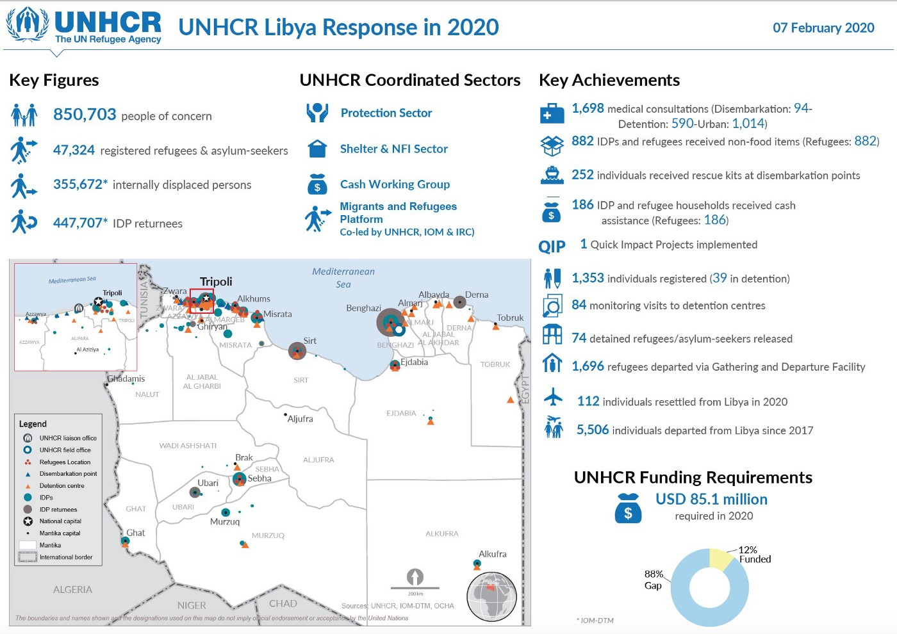

### AYS Daily Digest 7/2/20: More deaths in Moria\.

Criminal Complaint Filed / Attempted Border Crossing in the UK / Spanish Government Conducting Indirect Returns / New Immigration Law in Germany

Temperature within Lebsov has now reached freezing point \(@FranziEire\)
### Featured

Today a statement released by the Legal Centre Lesvos confirmed that a criminal complaint had been filed to the public prosecutors office regarding the death of a 31\-year\-old Iranian national at the pre\-removal detention centre of Moria, with a request to investigate the precise reasons and conditions of death of the man who was allegedly found hanged within the detention centre\.

The criminal complaint lodged by five NGO attorneys who offer free legal aid to asylum seekers in Lesvos raised the issue of insufficient medical, psycho\-social and translation services in the pre\-removal detention centre\. The continued failure by Greek police to make any relevant announcement regarding an investigation into the case after more than 20 days, forced the NGO to launch the criminal complaint\. It was cited that there has been a history of previous deaths in Moria without any effective investigation including the tragic cases of 3 people dying in January 2017 because of the fumes in the frozen tents they were forced to live in, and the death of a 49\-year\-old woman due to a fire in September 2019\.

The coalition of lawyers and NGOs who have launched the criminal complaint are seeking to see if the Greek state has meet its duties under Article 2 of the European Convention on Human Rights and for the investigation to consider any potential criminal acts committed by the authorities including the criminal offence of exposure according to article 360 of the Greek Penal Code\.
### Greece

Seven men aged 17 to 24, were reportedly arrested on Thursday on suspicion of planning attacks on migrants and refugees after the ongoing demonstrations across the island\. The police confirmed that the men were in possession of a makeshift club and a metal rod, and stated that “an investigation showed that the suspects had banded together to carry out illegal acts mainly against foreign migrants”\. The police are still searching for two minors who they believe have connections to the case\.

This case is now one of several incidents of attacks carried out or planned against foreign nationals on the island and the organisations that have set up to support them\. A previous edition of the Daily Digest reported that that one refugee and one local woman were being treated in hospital after being beaten by local fascists whilst the house and car of an NGO was attacked with rocks\.
### UK

Statements released by the British Home Office and media indicate that [100 individuals](https://www.bbc.com/news/uk-england-kent-51420971?fbclid=IwAR2EHP3DjO5FKuPd-TIj0llJ5kwWkkEz1rCQl5WE3mmljfTGth_Pz97g0kM) have been detained during an attempted border crossing in the British Channel\. Of the 100, it’s believed that 15 minors were also amongst the six dinghie boats that attempted to cross\. The reports indicate that up to 26 people were forced into one small dinghie whilst making the perilous journey\. Eye\-witness reports claim that after being rescued from near\-freezing conditions, some of the men, women and children were carried off on stretchers to ambulances waiting nearby\.

During the same period, the French authorities additionally had to launch a rescue mission for a boat of 11 people that was rapidly taking on water, reaffirming the continued dangers that hundreds are willing to place themselves in due to the lack of safe and legal passage across Europe\.

Following reports of the planned deportation flight to Jamaica, [hundreds of people](https://metro.co.uk/2020/02/06/protesters-shut-white-hall-racist-jamaica-deportation-flight-12196775/) have taken to the streets in London to protest against the government’s hostile environment policy\. The deportation flight will be the first of its kind since the Windrush scandal in 2018 that exposed the wrongful detention and deportation of hundreds of Caribbean nationals\. Speaking to the Metro\.co\.uk, Karen Doyle from Movement for Justice said ‘The Jamaican community has been the largest affected by the Windrush scandal and the fact that they are being hit again with the charter flight even before the government has released its lesson learned’ report is scandalous’\.

■■■■■■■■■■■■■■ 
> **[Jacqueline (Jacqui) Mckenzie](https://twitter.com/JacquiMckenzie6) @ Twitter Says:** 

> > The message was very clear tonight. Lawyers &amp; campaigners &amp; family members gathered at Downing Street to denounce the mass deportation of Jamaican people on charter flights before the Windrush Lessons Learnt Review is published, discriminatory nationality law repealed etc. etc. https://t.co/7WXi739jVV 

> **Tweeted at [2020-02-06 21:23:58](https://twitter.com/jacquimckenzie6/status/1225530599185756164).** 

■■■■■■■■■■■■■■ 

### **Italy**

The reception camp set up to house 300 people who were left with no shelter after a fire had broken out in what was described as a ‘shantytown’ in the southern Italian town of Rinano Garganico, has been left almost destroyed after it was ravaged by bad weather\. Reports have not yet indicated the future for the camps inhabitants or the ongoing plans by local authorities to address the issues within the camp\.

[, DISTRUTTE TENDE MIGRANTI ALLESTITE DOPO DRAMMATICO INCENDIO GHETTO RIGNANO")](https://www.youtube.com/watch?v=aEvHcS-qygw)

### Spain

Over the last 8 weeks, the Spanish government, through a 2003 readmission agreement, have forcibly deported [100 people to Mauritania](https://mailchi.mp/ecre/ecre-weekly-bulletin-07022020?fbclid=IwAR03uMnS2FEfU8FS5lSC7dB444zYyLO2l8J5jG8XQU6vGNaNGOrimY1NKXo#Spain:%20Authorities%20Denounced%20for%20Indirect%20Returns%20to%20Mali) \. Despite the concern of the threat of indirect returns, the vast majority of those deported to Mauritania were Malian nationals\.

The Mauritanian Information agency confirmed that the Spanish authorities were aware that after their deportation to Mauretania, the Malian nationals were subsequently further deported back to conflict\-torn Mali, indicating the Spanish government’s knowledge of third party deportations\.

The UNHCR stated that “nobody from the conflict\-affected regions should be forcibly returned to Mali” and that “the remaining parts of the country should not be considered as an appropriate alternative to asylum”\. This continued practice by the Spanish government of conducting indirect returns to Mali was denounced by the Spanish Refugee Support Commission, who further issued a statement claiming that regardless of the expression of asylum, these individuals lives should never have been put at risk by deporting them to a third country from where they may be returned to a country in conflict, such as Mali\.
### Libya

UNHCR 2020
### Germany

The new Skilled Immigration Act that will come into force on March 1st is set to attract highly qualified or skilled professionals from outside the EU to migrate to Germany for work\. Whilst the new law is said to make it ‘easier for skilled workers with conventional, non\-academic training’ to migrate to Germany, it has also attracted a lot of criticism\. The Skilled Immigration Act has led some to claim that it does not go far enough as to ‘reach out to skilled labour’ with some critics are pointing to the long waiting times for those with sought\-after professional skills within the current asylum system as an indication of the current flaws that the law has failed to address\.

Whilst the new law is intended to attract professionals in areas such as elderly care, IT and engineering, its reported to be a model after an existing legislation that is designed to attract academics to Germany\. The new law will remove the condition placed upon German employers to give priority to German or EU nationals with equivalent qualifications, but a statement by the interior ministry confirmed that this condition may be reintroduced in line with the situation of the labour market\. One condition of the new law is the requirement of prior knowledge of the German language for professionals seeking to migrate\.

An analysis provided by [InfoMigrants](https://www.infomigrants.net/en/post/22558/germany-what-s-the-new-skilled-immigration-law?fbclid=IwAR1QqQLvdlk2ej2SOxwAU_Z3lNJqhDHD4R1X-AE4v_PGaQN4LrmXEAhi6Qc) reports that it is unclear if this new law will allow current asylum seekers with the required requisites and experience, who have spent years waiting for a work permit, to change over their status to the new system and be able to enter the employment market\.
### Fundraising

After 5 months of the NGO Mediterranea Saving Humans being forcibly stationed in the port of Licata, the court of Palermo ruled that there was no reason to seize a civil society organisation’s ship and thus the Ionian Sea is free to once again commence is vital rescue missions in the Mediterranian\. Due to the unplanned seizure of their ship, they have now been forced to fundraise 100\.000 Euros to refill the tanks, supply galleys and provide essential equipment to the Ionian to allow it to continue its rescue missions\.

The NGO Open Arms are looking to fundraise 600\.000 Euros to repair its ship and ensure the continuity of its rescue missions\. In a statement released by Open Arms they said that “for months, breakdowns have hindered our mission at sea\. In just over 2 years this old tugboat has saved more than 6,000 lives, but its engine is running out and needs a definitive repair that we cannot face”\.

### European Union

Statewatch, a non\-profit organisation that monitors justice, home affairs and security within the European Union, has uncovered a draft version of the strategic [guidelines](https://mailchi.mp/ecre/ecre-weekly-bulletin-07022020?fbclid=IwAR1UCL5T-xeRhdTck6uyofRbnUnI0X3SO3g1QWDu_XesXvjmdu7sopU06xw#Council’s%20Five-Year%20Strategic%20Guidelines%20Reinforce%20Focus%20on%20Return) of the Council of the EU that alleges the EU is set to increase its cooperation with third countries to help facilitate the ‘return of migrants’\.

The new guidelines that detail how the implementation of the Strategic Agenda 2019–2014 within the operational mandate of migration and asylum in the EU over the next 5 years will be submitted to the council on the 12–13th March 2020 for endorsement\. Within these guidelines, plans will be set out to improve coordination between actors, member states and EU bodies operating across a range of policy mandates including visa, legal migration possibilities, development and trade\.

Criticism have already mounted against the proposed plans, including a recent policy recommendation by [ECRE](https://www.ecre.org/wp-content/uploads/2020/01/PN_25.pdf) warning of the likelihood of the diversion and undermining of aid and the goal of the eradication of poverty if the EU seeks to the development aid with the readmission of a country’s nationals\. Migrant and refugee advocates have expressed their concern that vulnerable people will be a target for deportation without due process and appropriate safe\-guarding measures to ensure a continuation of aid if the EU continues with their plan to attribute development aid with the readmission process\.

**Find daily updates and special reports on our [Medium page](https://medium.com/are-you-syrious) \.**

**If you wish to contribute, either by writing a report or a story, or by joining the info gathering team, please let us know\.**

**We strive to echo correct news from the ground through collaboration and fairness\. Every effort has been made to credit organisations and individuals with regard to the supply of information, video, and photo material \(in cases where the source wanted to be accredited\) \. Please notify us regarding corrections\.**

**If there’s anything you want to share or comment, contact us through Facebook, Twitter or write to: areyousyrious@gmail\.com**

_Converted [Medium Post](https://medium.com/are-you-syrious/ays-daily-digest-6-2-20-more-deaths-in-moria-cadea15d4c5d) by [ZMediumToMarkdown](https://github.com/ZhgChgLi/ZMediumToMarkdown)._
