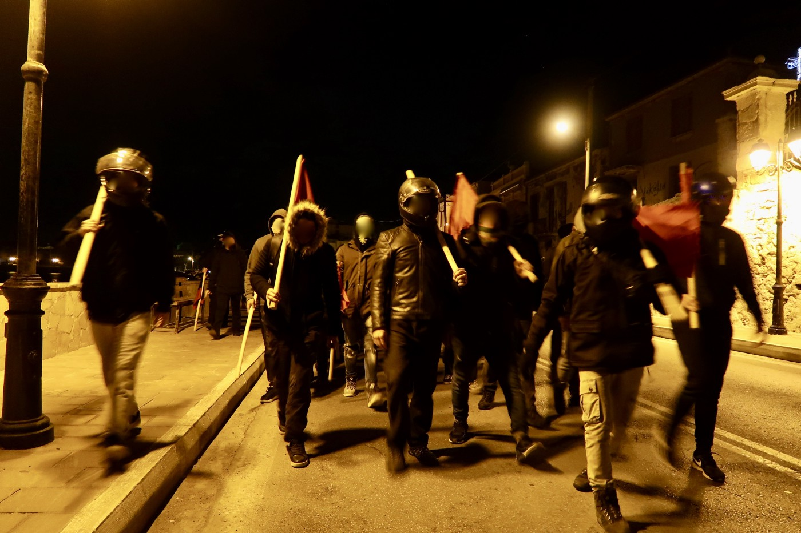
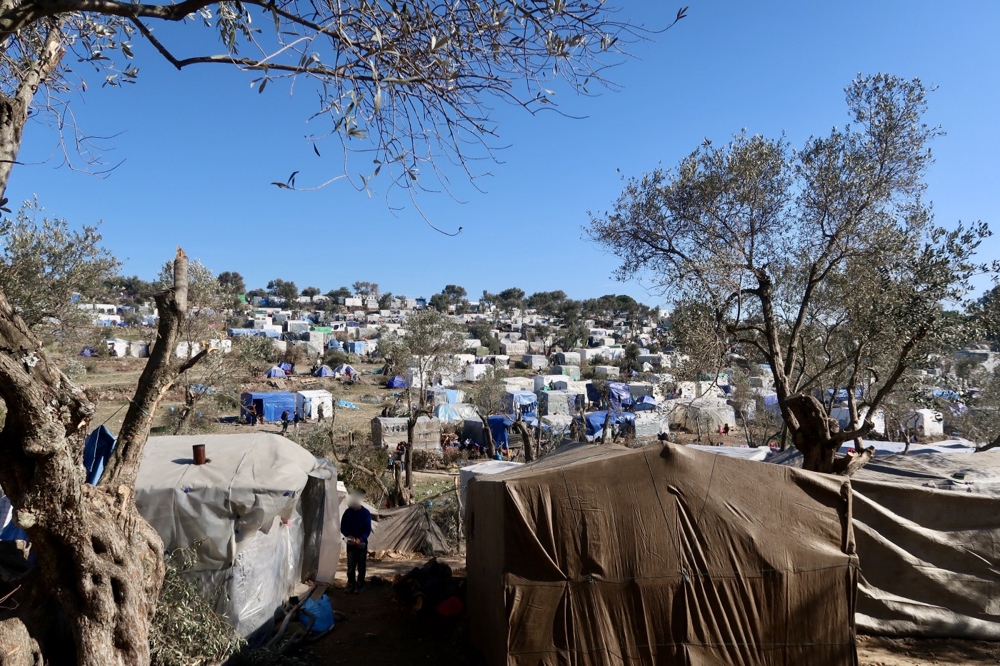
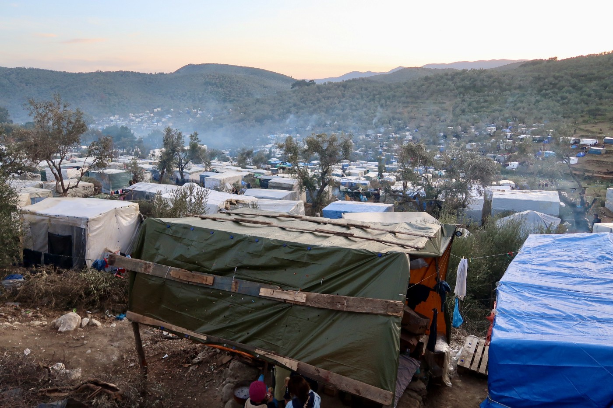
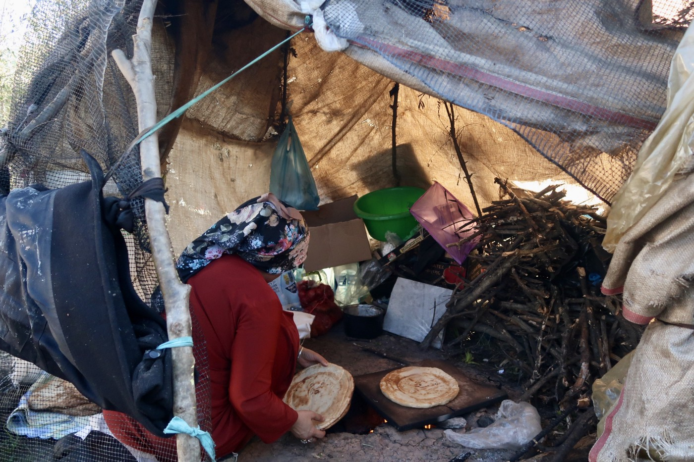
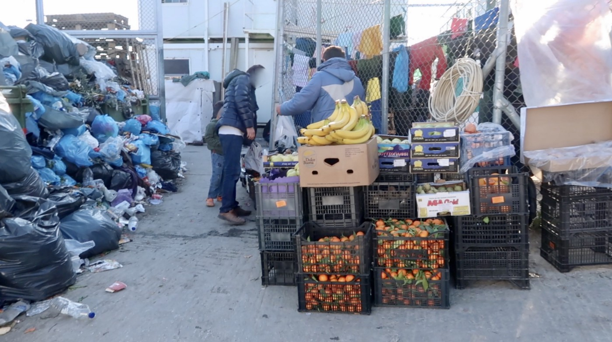
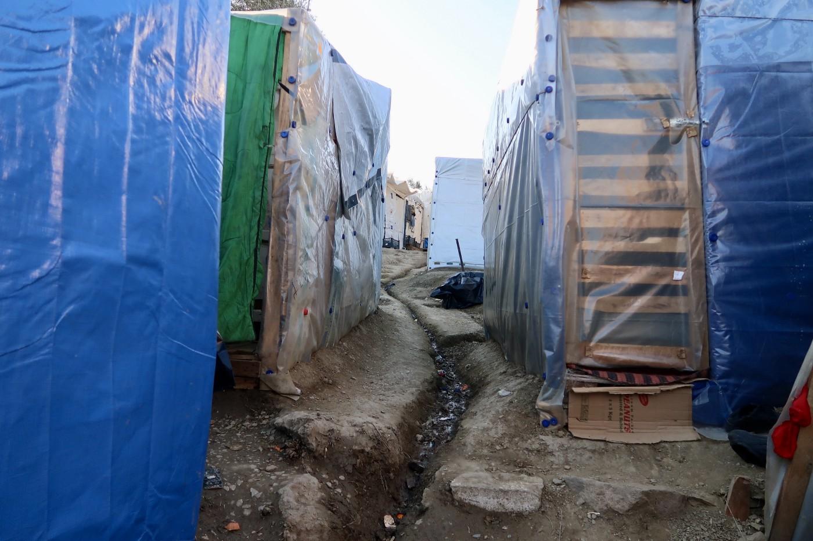
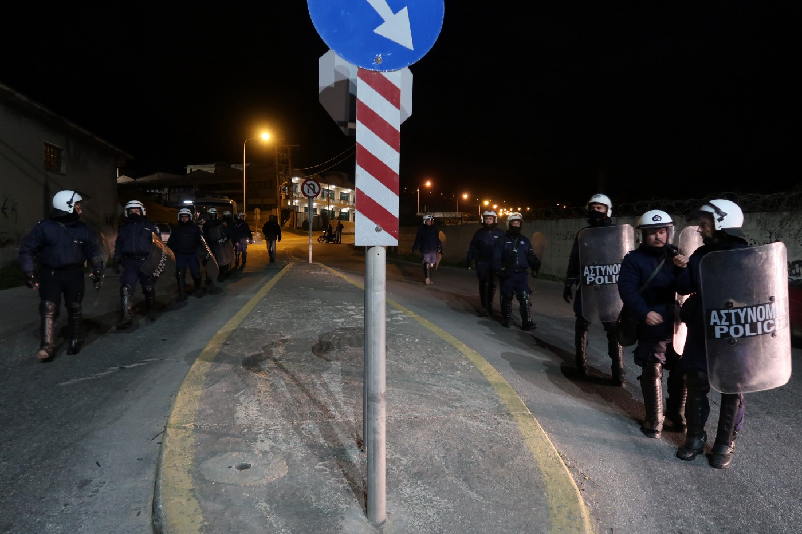
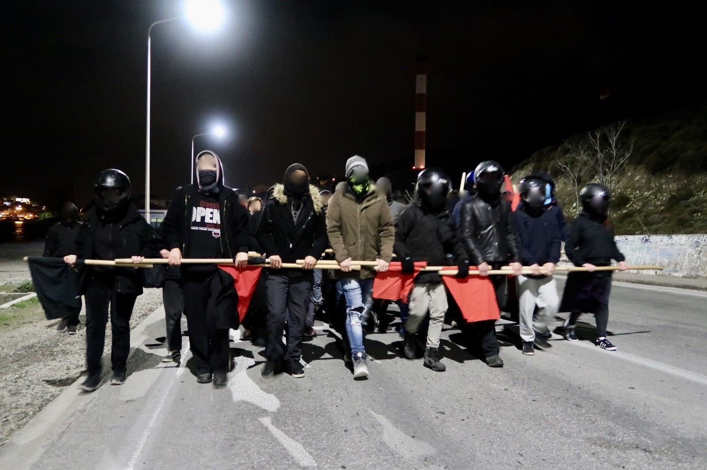
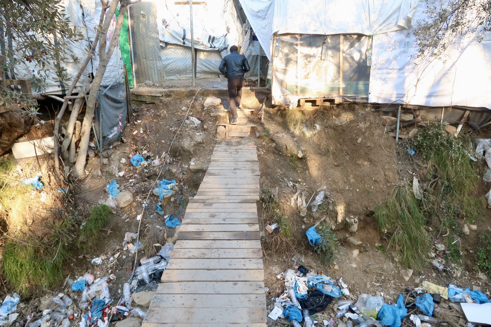

### AYS Special from Lesvos: **Right Wing Attacks on Refugees, Volunteers, and Locals**
#### _In cooperation with the [Latitude Adjustment Podcast](https://www.latitudeadjustmentpod.com/podcast) , we bring you a series of interviews with protagonists and victims of the recent clashes on Lesvos, where over 20\.000 refugees are hoping to be allowed to move to the mainland\._

Antifascist Demonstration on the evening of February 4th\. The March went from Mitilini to Kara Tepe and back\. Photo: Eric Maddox

It should be noted that the following analysis and collection of first\-hand accounts represents a very conservative estimation of the threats posed by right wing groups on Lesvos\. Having been on Lesvos since mid January I can say that there has been a consistent exchange of warning messages in WhatsApp groups for NGO’s, and between volunteers, warning of possible threats\. However I’ve elected to balance the need to inform the public about perceived threats with the need to focus on verifiable eyewitness accounts\. Tensions are high and it’s necessary to be mindful when sharing unverified information that might contribute to panic\.

_Some eyewitness testimonies have been lightly edited for grammar and clarity\._

**The Backdrop:**

Tensions and a climate of fear and mistrust are on the rise on Lesvos after a week that saw multiple attacks by right wing extremists on refugees, volunteers, and on locals perceived as sympathetic to the plight of the more than 20,000 refugees and migrants stuck on the island as they await transfer to the Greek mainland or deportation to Turkey and elsewhere\. [Seven right wing extremists were arrested on Lesvos on Thursday](https://www.keeptalkinggreece.com/2020/02/07/lesvos-moria-extremists-greeks-arrests/) , with two others still wanted by authorities\.

These attacks come after an anti\-immigration March on January 22nd, with thousands of Greeks staging a general strike across the islands and marching in Mitilini Harbor to protest against, among other things, their perceived abandonment by Athens to shoulder the responsibility for the ongoing influx of refugees on an island with a population of about 32,000 residents\. [Signs organizing the protest](https://www.instagram.com/p/B7jfzbco4cP/) were taped inside dozens of shop windows in the days leading up to the march, stating: “We Want Our Islands Back\. We Want Our Lives Back”\. [A contingent of island mayors and governors later went to Athens to petition the national government\.](https://apnews.com/04a991af9b66c2a4bcaec21d483a4089)

The ever\-expanding community of make\-shift dwellings around Moria Refugee Camp, Lesvos\. Photo: Eric Maddox

A common rebuttal to these claims is that, far from making life worse for the islanders, the “refugee crisis” breathed life back into flagging island economies still struggling to recover from the economic crisis, with NGO’s, volunteers and refugees themselves spending money in shops, hotels, and on goods and services\. In addition, massive sums have been handed over to Greece by the EU in what has been called the [“most expensive humanitarian response in history”](https://www.theguardian.com/world/2017/mar/09/how-greece-fumbled-refugee-crisis) \. However, one look at the conditions in Moria Refugee Camp quickly leads one to ask where all the money has gone\.

Moria, a defunct Greek military base repurposed to provide temporary accommodation to approximately 3,000 people is now pushing towards an occupancy of around 21,000, if one includes the sprawling “ [Olive Grove](https://www.youtube.com/watch?v=VuQ8CyQ_DRs) ” which has quite simply exploded since my initial visit to the island in late 2015 — early 2016\. Amongst these residents are more than 1,000 unaccompanied children \(though this number is suspected to include hundreds more if those left to fend for themselves in the Olive Grove are taken into account\) \.

Some locals would be happy to see Moria and its surroundings gone for good\. Photo: Eric Maddox

Residents are forced to wait in long queues for food, toilets, and for access to substandard medical care\. Many say they are routinely sent away with neary universal prescriptions for water and occasionally over the counter painkillers\. I’ve met with several residents who have vaguely diagnosed heart conditions and one [man who made the journey from Afghanistan with lung cancer](https://www.instagram.com/p/B8B6wdVI13o/) \. [Mountains of trash bags are piled up next to living spaces, food vendors](https://www.youtube.com/watch?v=jQoteX1yE8o) , and [lining stream beds](https://www.instagram.com/p/B8Q2WFSl5qY/) in what appears to be a looming public health crisis that’s been all but engineered\. Volunteer efforts are overwhelmed but are likely the only reason residents aren’t wading through waste\-deep trash in the narrow walkways carved into the hillsides\. There appears to be no evidence of any organized plan for garbage disposal or all but the most primitive sanitation services for the camp\.

**A Climate of Fear, Persecution, and Violence:**

It was in response to these conditions, and the long wait times for asylum \(or deportation\) processing that Afghan residents \(who constitute the overwhelming majority of Moria’s residents\), organized a march from Moria Camp to the town of Mitilini on Monday February 3rd, to protest and make their desperation public\. [A women’s march had also taken place in Mitilini a few days earlier](ays-daily-digest-30-01-20-moria-is-hell-women-take-to-the-streets-in-lesvos-b70e7d5bbeac) \. However, upon reaching the area around Kara Tepe \(a much smaller refugee camp created to accommodate extremely vulnerable individuals\) about midway between Moria and Mitilini, the protestors were confronted by riot police who unleashed torrents of tear gas on the crowd of an estimated 2,000 peaceful protestors, which included a mix of men, women, and children\. One nurse I spoke with related that she had seen a newborn exposed to the gas\. [Refocus Media Labs](https://www.facebook.com/refocusmedialabs/) , a nonprofit that trains refugees in media production skills, was present to [film and photograph the entire incident\.](https://www.youtube.com/watch?v=SHjqNjGfx-o&fbclid=IwAR3OPIRs2tsFEnsCo3mkyWPaXiDt2uFPj9Oq7gtx_ndmNpX-vggz8cQzSPo)

Preparing food on the periphery of Moria Refugee Camp: over 20\.000 people just want to live in dignity\. Photo: Eric Maddox

What follows is the first\-hand account of one foreign medic who was present at the scene to treat the protestors\. They’ve requested to remain anonymous out of concerns that they may be barred from continuing their work on Lesvos:

\* \* \*

**_1\. Can you describe in detail what happened in each incident?_**

> _“We recognized a lot of people around the area of Kara Tepe\. We run the clinic normally and saw patients\. Around 11 am I heard from people down at the protest that it started to escalate, so me and some medics went down and help as medics if it’s needed\. We came after the first attack of teargas\. We were prepared with some antiacids and stuff to clean out eyes\. We cleaned so many children, men and women eyes\. We supported several people with panic attacks\. Then I called the rest of the team to come and support, because it got worse, more and more people suffering from teargas, panic attacks \(some of them ended in being completely unresponsive\) and we had one with a suspected heart attack\. He was sadly close to the area where the most teargas was thrown\. I reached out to a police officer to get an ambulance\. We waited 1,5 hours and he was not stable\. Several times he had to go through another attack of teargas and we had to carry him several times to a place where he might be safer\. We were on side until protest was pushed back behind Kara Tepe direction Moria\.”_ 

**_2\. Did you go to the police?_**

> _“Yes but only for ID check when the protest was about to be finished\.”_ 

**_3\. What organization do you work for and what kind of work do you do? How long have you been on Lesvos?_**

> _“Medical NGO\. More than a year\. I would usually not have a problem to tell my name and more details, but there’s a risk because of police wrote down my name plus ngo that they could make us consequences after the last days and as you might read, it’s important we are able to be continuing our work on Lesvos, so we have continuously medics that are able to help in those situations\.”_ 

Food sold next to mountains of rubbish at the entrance to the formal facility of Moria Camp\. Latrines and dwelling are a few steps away\. Photo: Eric Maddox

A smaller number of protestors managed to make it to Mitilini and to continue with their protest on Monday afternoon\. This protest was joined by volunteers and locals before it was broken up by police, at which point the mixed group began the long walk back to Moria Camp, facing harassment along the way\. One NGO worker and long\-time Greek islands resident had this to say of their experience walking back towards Moria with the protestors:

_17:00 on Monday, February 3rd, Ano Skala, close to castle:_

_“I was in the demo that started from the theater of Mytilene and somewhere close to the castle, while walking, I saw a policeman shouting at refugees in Greek, saying ‘go back to their country and to die and drown in the sea’ and I told him ‘what are you doing??’ He started calling me a slut and to fuck off from here and to go die with the refugees’\. During the whole demo that went until Moria camp, a lot of policemen were hitting and shouting at refugees on the way, while the refugees were peacefully saying slogans like ‘Lesvos people we are sorry’ and ‘Moria no good’, without provoking the police\.”_

Later on Monday evening in the village of Moria near the refugee camp, locals organized for their own counter demonstration against the protests from earlier that day\. Confrontations by counter\-protestors in Moria village shifted to violence on Tuesday evening, including towards [an Italian NGO worker when her car was attacked while transporting two asylum seeker](https://www.keeptalkinggreece.com/2020/02/07/lesvos-moria-extremists-greeks-arrests/) s, with other similar attacks being claimed\. One source indicated to me that riot police positioned on the other end of Moria village told them they had been ordered to “stand down”\.

Protests by refugees and those standing in solidarity continued in Mitilini on Tuesday, and were also broken up by police and attacked by anti\-immigrant elements\. What follows are three first\-hand accounts by individuals who were present:

**Account 1:** **_11:27am, Tuesday, February, 4th:_**

> _“I was in the theater of Mytilene next to the demonstration of the refugees\. I was peacefully sitting and observing everything that was happening with a friend of mine\. 20 minutes later more police enforcement came and surrounded the protesters\. Two young refugees tried to pass by to join the protesters, but the police where telling them aggressively to go away, which they started doing, but the one policemen pushed one of the girls pretty strong for no reason, which everybody saw and started shouting at the policeman\. Maybe 15 min after that, a local old greek man passed in front of me and started shouting in greek that all NGO people deserve death and should leave from here and also death to all the refugees, plus calling me many sexist things, to which I couldn’t just listen and do nothing, so I replied in Greek, because I know Greek, telling him that he has no right to speak like this and to stop immediately\. The old man looked at me and left, continuing calling me names\. Immediately, an undercover police man approached me asking me for my ID, and I told him that he should ask for the old man’s ID and that I will not tolerate such behaviors\. He didn’t say anything, wrote down me name and ID number and told me to go further back\. Another police man came by and told me aggressively to not ask any questions, ‘it’s none of my business’ and to go further back right now\. Minutes after that, I saw from my new sitting position the same policeman writing down my friend’s ID number and talking to him for quite a long and taking him by the arm, together with another girl, and taking them to the police can \(wasn’t a proper police car, it was a normal red fiat car\) \. A bit later the protesters got themselves into the main street and the police were pushing them and forcing them to walk not on the read, but on the sea side, which seemed really dangerous, as there were so many people\._ 

“The Olive Grove”, Moria Refugee Camp\. Photo: Eric Maddox

> _I saw a woman on the ground, she has an epileptic seizure as far I as could say, and somebody already called an ambulance, so I stayed with some people there to help if needed\. Immediately a lot of old greek men, together with a couple of black dressed with black grasses young men can close and started shouting at as, saying we should all die and that we will show the news that the locals kill the women and what not, all this while the woman was suffering and we were waiting for the ambulance\. I tried to calm people, but many were very aggressive, shouting at me 4 or 5 at the same time, and I had to raise my voice in greek many times\. A man close to me started calling sexist name 2 girls next to me, names like ‘whores, sluts, go your country \(the girls were greek btw\) and when the one of the girls got pissed and replied, the old man, together with other 2–3 started chasing her, and she ran away\. The other girl came back and was close to me\. 2 old men were talking to me and they were kind and I was trying to get to tell to the other men to go as far as possible from the refugee woman in need of ambulance, but the 2 nice men told me I should immediately go away because the men behind him plan to throw as in the sea, which was right behind us\. The ambulance came and then we left\. All the men were looking at us aggressively and shouting most of the time\.”_ 

Riot police followed the the antifascist protest back to Mitilini on Tuesday night\. Photo: Eric Maddox

**Account 2: _Around noon on Tuesday, February, 4th, in front of the theater of Mytilene_**

> _“I was taken to the station at around 12:15\. I was sitting down close to the group of refugees protesting when a police officer in everyday clothes approached me\. He asked who I was and to move further back\. I said no very politely, telling him I like to sit where I’m sitting\. He then asked for my ID and to search my bag\. I gave him my stuff and asked to stay where I was, but they didn’t let me and they moved me a bit further back in order to make a perimeter around the refugees\. After that the same officer kept telling me to move again further back and I kept politely refusing\. After a couple of times he asked he said that if I did not move back I would be in trouble\. After I refused politely again he told me to come with him to the police department so my details could be checked again on the computer database\. When I tried to say no he was persistent and grabbed me by the arm gently, implying that if I didn’t cooperate he would take me by force\. They then moved me and another Greek girl standing next to me \(trying to support me\) to the police station and kept us there for almost two hours under the basis of checking our details, they kept us for questioning for no reason\.”_ 

_\* \* \*_

**_Account 3: Around 2pm, Tuesday February 4th_**

> _“I was outside the Municipal Theatre with a friend of mine as the refugees’ demonstration took place\. After a while, the police started — for no apparent reason — brutally attacking the protesters leaving a refugee woman unconscious on the pavement, next to the sea\. Me and a few other people called an ambulance and waited until it arrived, while some aggressive locals approached us\. They were about 8 locals, around the age of 60, yelling racists slurs near the unconscious refugee as a few other refugees were trying to wake her up\. At that point in time, other than the refugees and the locals, there were five university students trying to help the woman\. One of them, we will call her I\. , tried to calmly talk to the locals\. The rest of us thought that there was no need to have a conversation with a group of fascists so we patiently stood near her in case she would need any help\. Meanwhile, an Italian reporter was recording the refugees until one member of the fascist group started yelling homophobic things at him, before he tried to punch him twice, until he eventually threw away his camera\. Then, some of the fascist started to be even more aggressive towards me\. And she was constantly trying to calm them down\. Two of them, the one who previously attacked the reporter and one of the most well known far\-right locals, we will call him P\., started whispering about throwing I\. Into the sea\. When P\. started running towards her I stepped in front of him and asked him what he was planning to do\. He started saying things like ‘’I don’t have to tell you what I’m planning to do, I’m Greek, I can do whatever I want to’’\. I kept standing in front of him, so he started yelling sexist and homophobic things to me, until one girl from the university — I didn’t even know until then — stood in front me and defended me against him\. Out of nowhere, 4 of them started chasing the girl who defended me, still yelling about throwing her into the sea\. She ran towards Saphou Square in order to save herself, while me and her friend ran after the locals who were chasing her\. I managed to stop 2 of them and one of them was the guy who previously tried to hit the reporter\. I stood in front of him asking him to stop what he’s doing, but he put his hand on his jacket’s pocket and said “Do you want me to take it out and kill you right now?”\. I realized he was talking about a knife so I started slowing moving backwards\. Then he put his hand in his pocket, trying to reach for the knife, repeating the same phrase\. I don’t know if he actually had a knife, but it felt too real, so I turned around in order to quickly leave\. He started running after me so I also had to run towards Sapfous Square until he stopped\.”_ 

**_2\. Did you go to the police?_**

> _“Personally, I wasn’t planning to go to the police, but after the incident, the girls that they also got attacked told me that they wanted to report it, so I agreed to go to the police with them as a witness\. We went to the police station twice that day but they said that they were too busy to deal with our situation at the moment\. The next day, both of them decided to not report it, as they realized it would be dangerous and that they would feel safer if they would just let it go\. I personally didn’t bother to go to the police, as I’m sure that they wouldn’t do anything and I’m aware that most of these guys that attacked us are known for their practices and nobody has stopped them all those years\.”_ 

**_3\. Any information you feel comfortable giving about yourself?_**

> _“I’m Greek, 21 years old\. I’m also a student of Cultural Technology and Communication and I’ve lived on Lesvos for the past 2\.5 years\.”_ 

**_4\. Are you aware of others who have been attacked or harassed and who are afraid to come forward or to contact the police? How many? What have they told you?_**

> _“None of the people I know that got attacked contacted the police\. Also, most of them got harassed by police officers too, during the latest demonstrations\.”_ 

**_5\. Name? If you feel strongly that you need to be completely anonymous that’s ok but please explain why\._**

> _“I’d rather stay anonymous, as I’m aware that these people that attacked me, already have my photos \(one of my friends heard them saying it\), so I would feel safer if there was no way they could possibly find out what’s my name\.”_ 

Antifascist Demonstration on the evening of February 4th\. The March went from Mitilini to Kara Tepe and back\. Photo: Eric Maddox

On Tuesday night around 10:30pm [I documented an antifacist night march](https://www.instagram.com/p/B8LvxlJo-Yx/) intended to demonstrate a show of force and numbers against the attacks and reports of fascist groups patrolling streets on motorcycles and going into local businesses searching for NGO workers\. The march was peaceful and was followed by police starting about half\-way on its journey to Kara Tepe Camp\. Uniformed and plain clothed police were joined by a contingent of riot police about half\-way back towards Mitilini\. I noted no confrontations with police\. I departed the protest around 12:30am as it wound down near the city center\. However, as marchers made their way to the Palia Agora Bar later in the evening they were confronted by right wing groups\. Local news provided [this report](https://www.stonisi.gr/post/6718/tagma-efodoy-sthn-odo-ermoy-video?fbclid=IwAR2-UyFruu91hgByHXpvT7ALksEHSztM5Nt0wu8KyUFp46NAMN99ohUqZEI) along with [video documentation](https://www.facebook.com/stonisi.gr/videos/174899823798240/) of the events that followed, and one of those present gave the following account:

**_Palia Agora Bar, Mitilini, around 2:00am on Wednesday morning_**

> _“Later the same day, I went to the demo which was organized at 10\.30 pm and we went to kara tepe\. The demo was peaceful and nothing beyond some aggressive locals with provocation, but we were many, so they couldn’t do anything\. Turned back to mytilene and around 2:00am me and my friends, who were in the demo, decided to go to palia agora, a bar in Ermou street\. We met some people that we know on the street and walked together\. One of them heard something and told us he sees around 10 people with black clothes and sticks in their hands\. We all saw them and they started running towards us, so we started running towards the bar, which was really close\. The fascists group came outside of the bar, throwing stones and shouting that ‘they burn our houses’\. They tried to open the door of the bar, but there were many people helping to keep the door closed\. Then they left and hid behind the corner and could almost still me seen\. We called other people from the demo for support and around 50 people came in front of the bar and chased them\. We were a bit afraid to go back to our houses, but we made big groups and went home\.”_ 

_\* \* \*_

On Wednesday, February 5th Police stopped by local NGO’s and began to gather information on aid workers:

> _“Then today the armed police turned up at the community centre and detained every volunteer and demanded our passports so we could all be recorded\.” Gavin Fraser, independent volunteer working near Kara Tepe camp\._ 

Rubbish overflows into stream beds around Moria Refugee Camp, with no sign of any formal trash disposal or sanitation services for the camp\. Photo: Eric Maddox

On Wednesday evening, February 5th, I met with a group of five independent foreign volunteers who were working next to Kara Tepe Camp on Wednesday around 12pm when three armed police and several plain\-clothed local public officials required them to cease work and provide their identification documents as well as parents’ first names and their local addresses\. These volunteers were required to wait for approximately two hours while these checks were completed\. This incident, and reports of other similar incidents, raise grave concerns that a database of volunteers and employees is being compiled that could be used to remove, intimidate, or silence individuals critical of government policies and to hamper or halt the work of the NGO’s that they might be associated with\.

I’ve come across many other threats, warnings, and unconfirmed reports of attacks during my time in Lesvos, among them reports of right wing extremists patrolling the streets of Mitilini with the intention of attacking foreigners, and entering shops to harass business owners into identifying NGO workers among their clients\. It’s also important to note what is largely absent from this report, namely the testimony of refugees who have been subjected to similar threats and attacks, and far worse\. Some of those concerns will be covered in an upcoming podcast series\. For the time being I’ve attempted to limit this report to claims that I have been able to independently verify over the course of the past week\. It’s noteworthy that such a significant and diverse number of people have been willing to come forward and share their testimony over such a short span of time, and that they have elected to trust me, a stranger and relative newcomer in Lesvos, with stories that could almost certainly subject them to further threats, reprisals, and attacks should their identities become known\.

This report represents little more than a glimpse into the growing tensions and environment of hostility towards refugees and those who endeavor to support them here on Lesvos\. So long as these attacks go unaddressed by the local and national leadership and by local authorities we appear to be on a trajectory for an increase in violence on a scale that is hard to predict\. But one thing is clear, a focus on militarizing borders and engineering miserable conditions for refugees across the Greek isles will not deter desperate people from fleeing war, oppression, and poverty in their home countries\. Europe, the EU, and the West more generally, either need to change their interventionist military and economic policies towards the sending countries or provide accommodation to those fleeing the consequences of these policies\. Trying to put a lid on the pressure cooker will only lead to more violence and misery all along the migratory path and to more tensions inside the EU itself\. In the end, Europe will continue to grow less safe as some of the darkest elements from the mid 20th Century continue their alarming resurgence across the European Union, emboldened by the public’s tolerance for xenophobic narratives and scapegoating\.

**_The report is written for By Eric Maddox, host and producer of [Latitude Adjustment Podcast](https://www.latitudeadjustmentpod.com/podcast) , who is currently collaborating with AYS on a series of episodes documenting the conditions of refugees and communities in Greece and the Balkans\. [Latitude Adjustment Podcast](https://www.latitudeadjustmentpod.com/) is a weekly show that highlights underreported issues, places, and communities around the world, with a special focus on human rights\. He completed his graduate research in International Conflict Transformation in The West Bank, and spent 2012–2016 working on independent media projects across the Middle East and North Africa, for which he founded the Dutch nonprofit, [Open Roads Media](https://www.openroadsmedia.org/) \. This has been Eric’s first return to Lesvos since coming as a volunteer in late 2015\-early 2016\. He’ll be heading to the Balkans in late February to continue his reporting on the current status of refugees and communities along the borders of the EU\. You can follow the progress of his collaboration with AYS on Instagram: [latitude\_adjustment\_podcast](https://www.instagram.com/latitude_adjustment_podcast/)_**

_Converted [Medium Post](https://medium.com/are-you-syrious/ays-special-from-lesvos-right-wing-attacks-on-refugees-volunteers-and-locals-9f98779aef8e) by [ZMediumToMarkdown](https://github.com/ZhgChgLi/ZMediumToMarkdown)._
