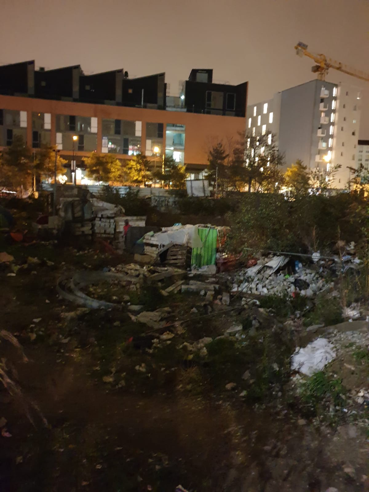
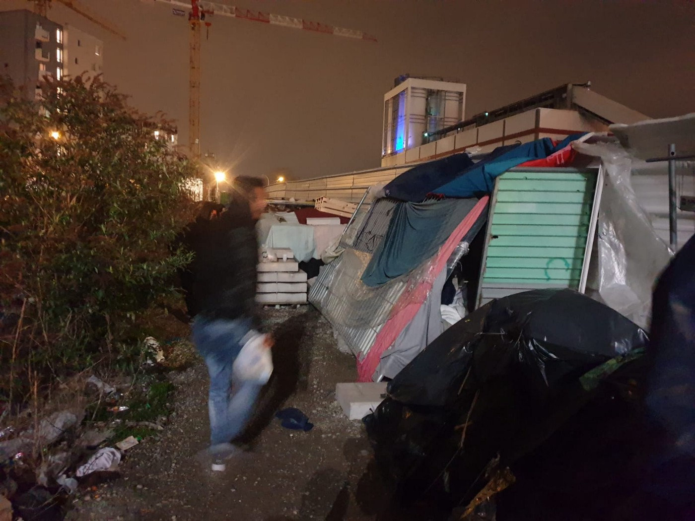
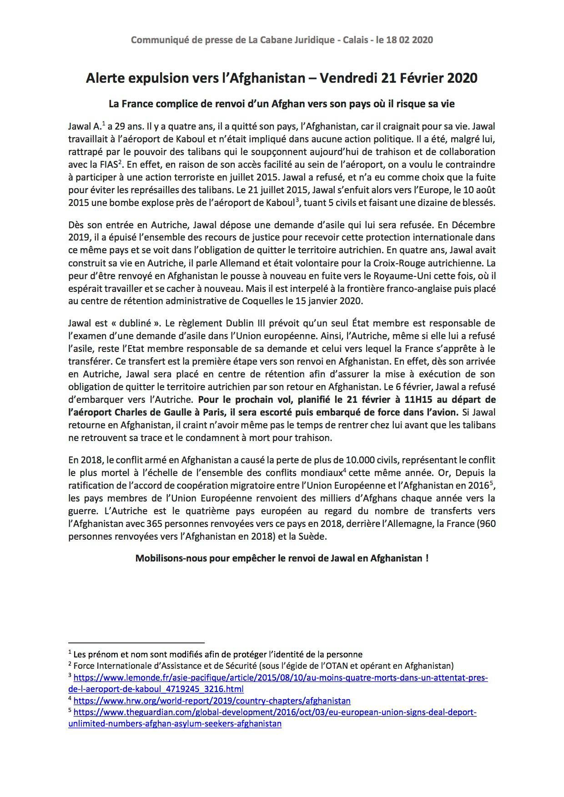

### AYS Daily Digest 20/2/20: Ongoing\-Pregnant women disappearing from reception centres in the Netherlands
#### Worrying ongoing disappearances in the Netherlands / Frontex deports to Mauritania from Spain / Bosnia and Herzegovina’s issues exacerbate as they seem to be left alone with the growing number of issues / Serbia’s conditions provided to people in camps worsen / ‘Invisible’ struggles of people sleeping rough in France / & more news

 \)](assets/624d63c620cb/1*sXKkI3HveCax6hOa7Uw7rA.jpeg)

Arrivals intensify as the problems mount in the Aegean \(Photo: [Aegean Boat Report](https://www.facebook.com/AegeanBoatReport/?tn-str=k%2AF&hc_location=group_dialog) \)
#### FEATURED

**The Netherlands** — A message has been sent to the midwives’ professional association in the Netherlands to be alert to signs of human trafficking after at least 25 pregnant women in the status of asylum seekers, originally from African countries, disappeared from the reception centres where they were staying\.

> “Is a woman scared or does someone else hold her papers?” 

According to the official statistics, in the late 2000s, over 100 Nigerian girls disappeared from Dutch refugee centres, several of whom were later found in Italian brothels\. However, this is yet another one of the worrying practices widely known and obviously not enough is being done to prevent and/or process such cases\.

“It is not inconceivable that both women and newborn children are or become victims of human traffickers, illegal adoption or voodoo rituals,” EMM said\.

> In January, the NRC reported that over 2,500 children have disappeared from refugee centres in the Netherlands over the past 10 years and no\-one knows where most of them are\. 

#### **Syria** — ‘The campground is just mud\. The streets are mud\. We are waiting for death’

The United Nations said nearly **one million people had been displaced** multiple times since December trying to outrun Assad’s offensive, with UN human rights chief Michele Bachellet warning that “no shelter is now safe”\.

> Yesterday, at least 15 communities in Idleb and Aleppo were reportedly hit by air strikes, and 11 communities were reportedly struck by shelling\. Three people, including a woman, were allegedly killed and three others were allegedly injured\. 

> According to WFP, food prices in Idleb have increased 120 per cent in one year\. Most markets have closed, and supply routes are disrupted due to the hostilities\. 

After the call on refugees to flee camps near the Bab al\-Hawa border crossing, panic and uncertainty arose inside the camps, with many of the displaced puzzled by the idea that the Syrian government was targeting areas near the Turkish border\.

> “The displacement is immense\. We are talking about a population the size of Marseille in France moving within a few weeks to the middle of nowhere, to an area that lacks the services needed,” Issam Khatib, executive director of civil society organisation Kesh Malek, [_told MEE\._](https://www.middleeasteye.net/news/assads-bombs-chase-us-syrian-forces-target-refugee-camps-near-turkish-border?fbclid=IwAR1oki8i3tzqHJwwr-prOhZSVqvkJKaQPM-aEMrcc5beGDUkll79RDPb2Bg) 

Photos collected by a commercial satellite company show the refugee camps that have popped up in and around three Syrian towns near the border\.

Find the maps and additional explanation [here\.](http://Photos collected by a commercial satellite company show the refugee camps that have popped up in and around three Syrian towns near the border.)
#### SEARCH AND RESCUE AT SEA
### An Invisible Shipwreck?\!

Alarm phone is pushing more investigation into the disappearance of a ship urging Libyan, Maltese and Italian authorities to share information about the day’s rescue missions\.

A black rubber boat with 91 people on board, reportedly hailing from Sudan, Niger, Iran and Mali, called the hotline in distress at 3:30 a\.m\. Feb\. 9\. The passengers managed to share their GPS coordinates minutes later, which put them in international waters north of Libya\.

Alarm Phone [wrote:](https://alarmphone.org/en/2020/02/19/an-invisible-shipwreck/?post_type_release_type=post&fbclid=IwAR3txVPtwoupG3uVNq8ctO1lyGTjml4Mkap-CNghJrl_BbAeLW8QMKJ1fgU)

> We believe that this deflated dinghy is indeed the boat we had alerted authorities of, and we need to confirm whether the deflated boat had been rescued by the Libyan Coast Guard, or whether, instead, there was a shipwreck\. 

> For doing so, we would need some clarification about the rescue conducted by the Libyan Coast Guard that day, as well as on the details of the black rubber boat spotted via air:
 

> Could you share a summary, timestamp and GPS positions of the rescues conducted by Armed Forces Malta, as well as by the Libyan Coast Guard, on February 9th 2020, as well as on the night between February the 9th and the 10th? 

> If there was a rescue by the Libyan Coast Guard that day, where did it take place, and at what time? 

> Can you share the footage of the deflated rubber boat taken by Frontex airplane Osprey1? 

> What was the condition of the rubber boat spotted by Osprey1? Was it still inflated and intact? 

> Was the engine still on the deflated black rubber boat spotted by Osprey1? 

> Families of people who were on that boat have been reaching out to the Alarm Phone, telling us that their relatives are currently missing\. We want to give them a clear answer as soon as possible\. We would be very grateful if we could receive further information\. 

> As of last October, roughly 19,000 people have drowned or disappeared on the sea route since 2014, according to IOM\. 

#### GREECE

The last two days at least 17 boats have arrived on the Greek Aegean islands, carrying 620 people, [Aegean Boat Report](https://www.facebook.com/AegeanBoatReport/?__tn__=%2CdkCH-R-R&eid=ARCOT4QTyvxe7Rcg63Qi0Hvj_5qi61umq9YP1Ph74sZlY6CmAkvVeaQH3uBVvzy38qmMbs03jD424xwP&hc_ref=ARScu-bEHauyA170iXkRKmfQ3Z6um1z8d4X8eIacqyHEjQZd33vQQ4UH4ZpO4OIh84w&fref=nf&hc_location=group) team reported\.

If there is even still a need to watch the human misery on display in Moria before actually doing something, more photo and video accounts or horrifying living conditions are posted all the time\.

■■■■■■■■■■■■■■ 
> **[ellen trapp](https://twitter.com/elltra) @ Twitter Says:** 

> > #Moria #refugeesgr #EU #Greece #Lesbos - hier wachsen die Slums von #Moria mit ungefähr 20000 Menschen stetig weiter. Menschenunwürdige Bedingungen! https://t.co/iE46nBOAYy 

> **Tweeted at [2020-02-20 10:10:10](https://twitter.com/elltra/status/1230434459499057152).** 

■■■■■■■■■■■■■■ 

■■■■■■■■■■■■■■ 
> **[ellen trapp](https://twitter.com/elltra) @ Twitter Says:** 

> > #Moria #refugeesgr #EU #Greece #Lesbos - hier wachsen die Slums von #Moria mit ungefähr 20000 Menschen stetig weiter. Menschenunwürdige Bedingungen! https://t.co/iE46nBOAYy 

> **Tweeted at [2020-02-20 10:10:10](https://twitter.com/elltra/status/1230434459499057152).** 

■■■■■■■■■■■■■■ 

After strong reactions the name of 19 year old Iraqi girl, Ruqia, has been removed from the deportation list\. The international mobilization will continue until her request has been granted\.
#### SERBIA

[Asylum Protection in Serbia](https://twitter.com/APC_CZA) reports that over 300 people who are accommodated at the Bujanovac camp are lacking drinking water, clothes and hygiene products\. Many of the people inside the ‘camp’ have rash and scabies\. 
Last week 50 people were returned from the northern borders into the camp, APC reports\.
Serbia currently hosts around 4,500 migrants, the official figures show\.
#### BOSNIA AND HERZEGOVINA

Local organisations and individuals active in the northern part of the country have shared an information that due to the reconstruction of the railway, from March 3 until March 12, Talgo trains will not be running from Sarajevo to Bihać, but will only operate from Sarajevo to Doboj\. Some of the activists along this route fear this might reflect on the situation in Sarajevo in a way that there will be more people stuck there as they will not be able to leave the city as quickly as it has been done so far\.

As from today, at the Tuzla bus station people in tranzit can purchase tickets to Ključ, and not to Cazin or Velika Kladuša, where they intend to arrive\. If they will be allowed by the authoritties to continue their travel, they will be allowed to buy a ticket for the rest of the journey in the bus\. This is a result of a practice that has been widely denounced and which has been going on for moths — people are taken off the buses in Ključ, thus reinforcing the officially non\-existing inner borders in BiH, creating many more issues to the people traveling, including unaccompanied minors, who are often being left unattended as not always there is an available vehicle, social worker or so\. It is the local unit of the local Red Cross that tries to help as much as they can in this particular spot\.
### Are these really improvements FOR the people?

[IOM Bosnia and Herzegovina](https://www.facebook.com/IOMUNBH/?__tn__=%2CdKH-R-R&eid=ARCK8OPgTLIdf5qo2VD5vd0aAGoKmtZ9ZVs_Wbq-Tpj2qL_VBBrd3OmFQBTO05yIBsGuQwhAG2FLb6ny&fref=mentions&hc_location=group) has published a set of photos displaying their recent spending of the EU funds into — more fences and bars\. Even though all the camps run by the organisation provide horrible conditions for the people inside them, they always seem to bee documented and commented on as a success\. This is taking it to another level\. However colourful, bars on the windows are still bars on the windows of a family ‘camp’\. Allegedly, to protect the people staying in the facility, the IOM brags about keeping the people safe\. Not to even open up the always present topic of human rights, restricting movement, applying wrong rhetoric and treatment to people in search of international protection, they seem to have skipped some more needed steps, such as keeping the people warm and comfortable by investing in isolation, better equipment of the camps all across the country, not just the ‘family camp’, one must wonder how come it’s always fences that are the priority \(and of course, how much did these cost\) \. Either way, presenting the current treatment of people in camps, the conditions there and state of safety as a success is perverse, to say the least\.
#### FRANCE

Activists in Paris assembled a team for a maraude along the Saint Denis Canal\. During the visits to some of the most unaccessible areas, they found some provisional camps under the bridges\.
Those were mostly men \(and a pregnant woman\! \), whom they’d woken up but who all said: “We sleep without sleeping\.”

> Indeed, with the wet and cold penetrating the tents and one’s own skin, away from the eyes of the others going about their lives, in the unsanitary conditions and in the middle of the rats, how does one sleep? 

They met people who are staying in about fifty tents, and distributed food kits and hot drinks, at the same time being aware that what they needed most was human and friendly contact and understanding:

> Talk about football as our friend Mohamed did so well\. exchange words in French, English, Arabic, German, Spanish\. Remember that what binds us goes beyond solidarity, that it is above all a simple exchange between people sharing the same space of time in this world\. 

Find the entire report on the Facebook page of the group\.

](assets/624d63c620cb/1*vnFx2ALkRh2O22sZmT04Nw.png)

Photos: [Solidarité migrants Wilson](https://www.facebook.com/Solidarit%C3%A9-migrants-Wilson-598228360377940/?__xts__%5B0%5D=68.ARBJRf7LmUI0uSwXRVT2WXkxbXhs9RKweW6bM91qmERRnK7UnFAcUy8xd5fCTdLhWuWv8f_gZrk33l4xHr1WaU23h7ex97KGDM44oLwhgVyYSpJMtyT4Iv7cX-f17FP9qgqpK04TGuesF_n8kpaJbHG7FQOvvAXmaWK_DyjwU0u1iENg5alvOyD2r2cAlIb8w0pk5R9UX1P0MnNRHAhAy6tvur5NLC3UFDIDDBQF2l8W2H7vCwlQ0PrCuMjTBM43nYC3Lqz80_qBG6xQdG98gpdmkeKLDO2qFt1EmW0znzvrwm30y6X7TRd90zHrV5GKrDD7womcQsSMn55gmxO7tFRphQ&__tn__=k%2AF&tn-str=k%2AF)

### Deportation alerts continue\.

Deportation probably happening now\! 
Here’s hoping there’s a good fight and prevention\. Read what the [Utopia 56 Paris et Ile\-de\-France](https://www.facebook.com/U56ParisIDF/?__tn__=%2CdkCH-R-R&eid=ARCrJqk5huy8d9-bibGPlNnFYvku8lUASmvMID2LA8P_eIdygk9fsuO_pG3Q28RuwLb2jXmx7mYn9nC-&hc_ref=ARQ4sNsHP0PSSKrjDJShupxQoFbIUVdeNVjmXaA17DV066A5RLiP9T8zjzLvgPPfgwA&fref=nf&hc_location=group) team wrote:

> Jawal A\., 29 years old, is from Afghanistan\. He was working at Kabul airport when he was tried to force him to participate in a terrorist act in July 2015\. He refused, and fled to avoid reprisals from the Taliban\. He goes to Austria where he stays for 4 years\. He speaks perfectly German, builds a life there, becomes volunteer for the Red Cross\. But his application for asylum is refused and in December 2019 he exhausted all possible remedies, so he is forced to leave Austria\. While looking to join England, he was arrested at the French\-English border and placed in the Administrative Holding Center \(CRA\) in Coquelles on January 15, 2020\. 

> Jawal A\. is under the Dublin III Rules, which makes Austria alone responsible in Europe for the investigation of its application for asylum, so France wants to send him back to that country\. But a return to Austria is just a first step towards a return to Afghanistan, a country where the life of Jawal A\. is in great danger\. Since the signing of the European Union migration cooperation agreement with Afghanistan in 2016, thousands of Afghans fearing for their lives have been forced back to a country at war\. 

> We can no longer ignore what is being done in the name of our democracy, nor hide behind cross\-referencing to third countries, like Austria, when we know very well that the exile will arrive immediately, immediately deported\. 

#### SPAIN

For the third time this year, Frontex operated repatriation flight took off from Spain’s Canary Islands for Mauritania, carrying 51 people on board\.
As of 2003 agreement signed between Spain and Mauritania, many things have changed and as it seems the authorities were not urged to reconsider previous arrangements, they are using this old agreement in order to make international protection mechanism even less available to the desperate people seeking safety in the only ways they see is possible\.

MNP officers noted several irregularities\. Having pointed them out, they say they received “no response” from the deportation authorities\. On this flight, they found that some of the officers conducting the flight failed to wear the requisite identification numbers on their vests\.

[Read more](https://www.infomigrants.net/en/post/22908/back-to-mauritania-frontex-repatriates-migrants-arriving-on-canary-islands?fbclid=IwAR2hmWY76cxL65b3tH49ejWC2HI6T2XddZZh35pZKl41ohOlKbk-l3Byvnc) \.
#### UK

The company which already runs the notorious Yarl’s Wood detention centre, Serco, will take over Brook House and Tinsley House from May 2020\. The contract runs until 2028, with an option to extend until 2030, the Freemovement reports\.

The Home Office says that Serco will have various extra obligations under the new contract, including increasing staff numbers “substantially” and running activities for detainees seven days a week\.

Most of the UK’s immigration removal centres are now [privately run](https://www.freemovement.org.uk/campsfield-house-to-close/) , only Morton Hall remains in the hands of the prison service\.
### Home Office deports asylum seekers on charter flight to EU countries

The [Home Office](https://www.independent.co.uk/topic/Home_Office) has gone ahead with a charter flight deporting [asylum seekers](https://www.independent.co.uk/topic/asylum-seekers) this morning despite a stark warning from immigration solicitors that these individuals may have been denied access to justice, British [media](https://www.independent.co.uk/news/uk/home-news/charter-flight-asylum-seekers-deportation-home-office-trafficking-victims-a9345816.html) reported\.

> At least 16 people who had been issued removal directions were granted last minute reprieve after solicitors intervened and challenged their deportation on the basis that they were trafficking victims\. It is not known how many people were on the flight\. 

**Find daily updates and special reports on our [Medium page](https://medium.com/are-you-syrious) \.**

**If you wish to contribute, either by writing a report or a story, or by joining the info gathering team, please let us know\.**

**We strive to echo correct news from the ground through collaboration and fairness\. Every effort has been made to credit organisations and individuals with regard to the supply of information, video, and photo material \(in cases where the source wanted to be accredited\) \. Please notify us regarding corrections\.**

**If there’s anything you want to share or comment, contact us through Facebook, Twitter or write to: areyousyrious@gmail\.com**

_Converted [Medium Post](https://medium.com/are-you-syrious/ays-daily-digest-20-2-20-ongoing-pregnant-women-disappearing-from-reception-centres-in-the-624d63c620cb) by [ZMediumToMarkdown](https://github.com/ZhgChgLi/ZMediumToMarkdown)._
