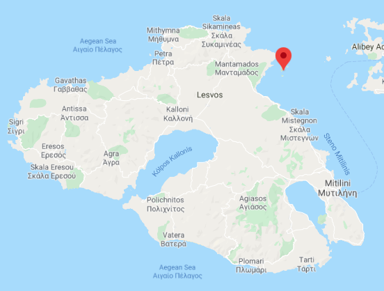
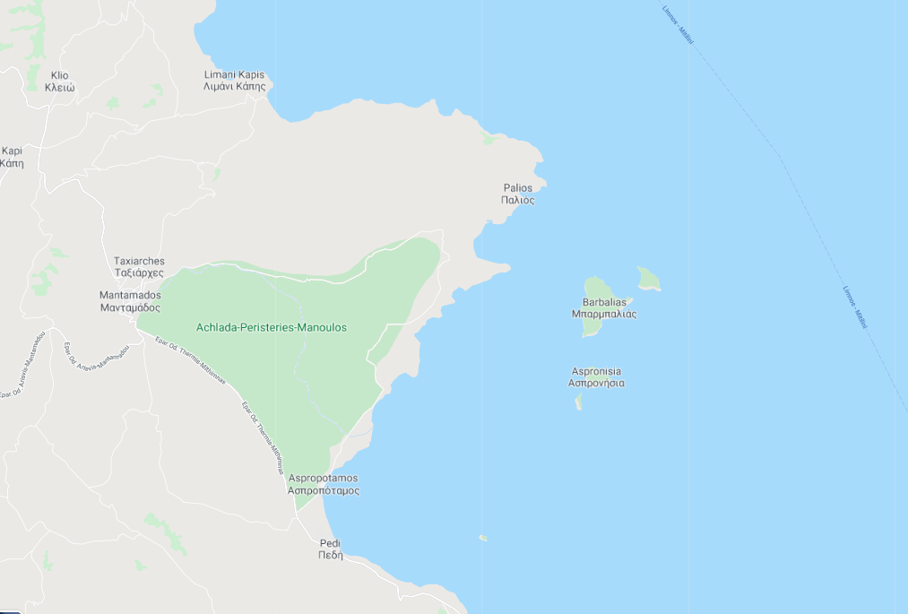
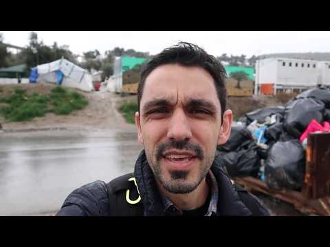

### AYS Daily Digest 21/2/20: Lesvos authorities propose closed camp on uninhabited island

Syria: freedom of movement of civilians increasingly at risk /// Border fence built on the Croatian/Bosnian border /// End Heathrow Immigration Detention public meeting in the UK /// Metropolitan Community Clinic in Helliniko, Athens faces eviction /// Police harassment on the rise in central Athens

 \)
[\#noborders](https://www.facebook.com/hashtag/noborders?epa=HASHTAG)](assets/ae430390aaac/1*zw4f5tOQHVqXVzFpN_faaw.jpeg)

“Syrian People Syrian War” By Yaser Ahmad \(via [Art Against](https://www.facebook.com/artagainstproject/photos/a.704384742944296/2752786191437464/?type=3&theater) \)
[\#noborders](https://www.facebook.com/hashtag/noborders?epa=HASHTAG)
#### FEATURED
#### Lesvos authorities propose to build a closed centre on an uninhabited island

Several local media outlets are [reporting](https://www.keeptalkinggreece.com/2020/02/21/lesvos-migration-center-uninhabited-islet-tokmakia/) that authorities on Lesvos have sent a counter\-proposal to the central Greek government, regarding the construction of a closed centre on the island\. Instead they want the centre to be built on a small uninhabited inlet off the eastern coast of Lesvos called Tokmakia/Aspronisia, with an area of 560 acres \(around 2,266 sqm\) \.

Lesvos \(left\) and Aspronisia \(right\), the uninhabited inlet selected by Lesvos authorities for imprisoning people on the move

This comes weeks after a similar proposal was aired by central authorities, and then immediately retracted followed harsh criticism which also came from the islands’ representatives\.

Symbolically, this also comes on the same day ECRE published a [letter](https://uploads.guim.co.uk/2020/02/14/200213-Andrew-Wilkie-Response-from-International-Criminal-Court-Australian-Government-treatment-of-asylum-seekers_(1).pdf) in which the International Criminal Court \(ICC\) communicated the results of their overview of Australia’s deportation and detention policy\. Australia runs offshore detention centres in scarcely populated areas of Nauru \(where 230 people on the move are living at the moment\) and Manus \(180 people\) which have come under scrutiny and severe criticism over the last year\. The ICC described Australia’s offshore detention regime as amounting to “cruel, inhuman, or degrading treatment”\. Some of the conditions of detention and treatment of refugees and asylum\-seekers in the processing centres on Nauru and on Manus Island constitute “the underlying act of imprisonment or other severe deprivations of physical liberty under Article 7\(1\) \(e\)” of the Rome Statute that defines crimes against humanity\.

However, the court decided not to follow through with the case, as it falls outside the ICC’s jurisdiction and does not demonstrate the “contextual elements”\.

This new dangerous idea was reportedly proposed by Lesvos MP and former justice minister Charalambos Athanasiou\. While some [media](https://www.stonisi.gr/post/7046/h-lysh-gia-th-domh-einai-ta-tokmakia-realtime) present this idea as a sort of provocation made to slow down the negotiations with central authorities, others [report](https://www.lesvosnews.net/articles/news-categories/politiki/protasi-gia-kleisti-domi-prosfygon-se-exotiki-nisida-tis-lesboy) that this plan had already been presented and discussed between the island’s and Athens’ representative, and the transfer scenario is already underway\. The North Aegean regional governor has invited Noti Mitarakis, minister of immigration and asylum, to visit Lesvos over the weekend for a “zero\-base” dialogue, in which they will also discuss the proposal\.

SYRIA
### The freedom of movement of civilians from Idleb to northern Aleppo increasingly at threat

As we reported yesterday, the situation of the displaced Syrians is taking a serious turn\. Around 900,000 people have already fled their homes in Idlib\. They are heading to the north\-west of the directorate and towards the Turkish border, where they are systematically rejected\. In the area controlled by the Federation of Northern Syria, there are already 700,000 people in need, despite attacks of Turkish\-backed militias and theTurkish army are reportedly increasing \( [1](https://twitter.com/RojavaIC) , [2](https://web.telegram.org/#/im?p=@rojavaresiste) \) \.
Since 1 December, some 300 communities changed control, rapidly bringing the frontlines closer to areas that are densely populated\. The people from those communities are the ones who fled\. Places previously considered safe by civilians are now coming under fire\.
Find more information on the recent developments in Northwest Syria [here\.](https://reliefweb.int/report/syrian-arab-republic/recent-developments-northwest-syria-flash-update-no-8-20-february-2020?fbclid=IwAR30v07jMUYPMbjlyTum0jCqmNfgDGe5iPoZFHm4LcvT7aVlpCQXheTmnRI)

Look [here](https://www.nytimes.com/interactive/2020/02/14/world/middleeast/syria-idlib-displaced.html?fbclid=IwAR32AryTu4bLFuzIBovfiYh0c8NCWII8nw1ZXn-lZR-UoGjdSBq5gmcdxWI) , to get a visual grasp of what it means for almost a million people to flee a city\.

GREECE

Eric Maddox, from Latitude Adjustment Podcast, published some thoughts on Moria before leaving the island\.

Stay in touch for the five\-episode special collaboration between AYS and Latitude Adjustment\.
#### Eviction of the Helliniko Metropolitan Community Clinic, Athens, requested

The Helliniko Metropolitian Community Clinic on the outskirts of Athens, [received a notification letter](http://www.mkiellinikou.org/en/2020/02/20/second-attempt-to-evict-the-metropolitan-community-clinic-helliniko-in-athens-greece/?fbclid=IwAR1B06TK0hNwN6CmefzCVU1YQ_tIFkANRfOvqoHkz2rzpQcQ1zdKIdLTFGg) from Helliniko S\.A\. dated 11 February 2020, which “clearly states that the Clinic must immediately vacate the building in which it has been housed since December 2011 and which was granted by the Municipality of Helliniko\-Argyroupolis”\.
#### Police harassment on the rise in Athens

Since the change in government, more police have been moved to a Athenian neighbourhood where many non\-white people live\. Racial profiling has been increasing, with targeted harassment in the areas of Patission, Kipseli, Acharnon and Exarchia, especially at bus and metro stations\. Notara26, one of the last migrant squats in the area, has been violently targeted by riot police in different occasions\. This last week, police started to maintain a constant presence in Platia Exarchia, making it impossible for people to use the highly frequented public space\.

■■■■■■■■■■■■■■ 
> **[Exiled Arizona 🎃](https://twitter.com/exiledarizona) @ Twitter Says:** 

> > Friday night in Exarcheia the square is completely empty due to police harassment. People are packed into the side streets. Such a ridiculous situation. 

> **Tweeted at [2020-02-21 22:41:40](https://twitter.com/exiledarizona/status/1230985969211408390).** 

■■■■■■■■■■■■■■ 

B & H/CROATIA
### New border fence erected between Croatia and BiH

A fence has been placed in a small village close to the border with Bosnia and Herzegovina, in Ličko Petrovo Selo\. The official news on this Orban\-like action says that it is designed to curb the illegal migration, but we are pretty sure that there is no single individual in these areas who finds it a plausible ‘solution’ to what has been the most used way to flee due to a lack of access to the mechanisms of international protection\.

In a response to a Bosnian news portal, the Ministry of Interior stated that “according to the Schengen catalogue of the EU concerning the supervision of the outlying border, return and acceptance, the border crossings and its nearby area must be technically supervised, and the border checks and surveillance should be well lit\. The border crossings must be separated with a fence \(exceptions can be made in the case of border crossings for the local border traffic\)”, the answer states\.

They also confirmed that foundations for such a type of moveable fences were placed earlier in Gejkovac, Pašin Potok, Erdut and Batina\. Their further analysis will reportedly determine whether such new border barriers will be erected in other areas\.

The use of border externalization as a bargaining chip for accession to the Schengen area, or in the case of some other countries, to the EU, has turned out to be a strong argument for the current heads of states, but they don’t seem to take into account the mark that violent pushbacks and other inhumane border practices will leave on history\. Nobody will recall the ‘service’ the Balkan countries thought they were doing for the political step forward, but tens of thousands of people will never forget the humiliation and abuse they suffered in the forgotten areas of the western Balkans\.

UK
### Together against the new detention centre

Taking place on 28 February in Hounslow, a borough in London, the End
Heathrow Immigration Detention \(EHID\) collective is holding its first
public meeting in its fight against the construction of a new mega
detention centre \(immigration prison\) as part of the plan to expand
Heathrow Airport\. If it goes ahead, it will be the **single largest** 
**detention centre in Europe** \. We oppose the airport expansion, the new
detention centre, and also want the existing centres at Heathrow Airport
\- Harmondsworth and Colnbrook — closed\. We are calling on anti\-borders
activists in London, and the local community, to join the campaign\.

Find the Facebook event here:

For more information about the development and the campaign against it,
please see their website:

**Find daily updates and special reports on our [Medium page](https://medium.com/are-you-syrious) \.**

**If you wish to contribute, either by writing a report or a story, or by joining the info gathering team, please let us know\.**

**We strive to echo correct news from the ground through collaboration and fairness\. Every effort has been made to credit organisations and individuals with regard to the supply of information, video, and photo material \(in cases where the source wanted to be accredited\) \. Please notify us regarding corrections\.**

**If there’s anything you want to share or comment, contact us through Facebook, Twitter or write to: areyousyrious@gmail\.com**

_Converted [Medium Post](https://medium.com/are-you-syrious/ays-daily-digest-21-2-20-closed-camp-on-inhabited-island-lesvos-authorities-propose-ae430390aaac) by [ZMediumToMarkdown](https://github.com/ZhgChgLi/ZMediumToMarkdown)._
