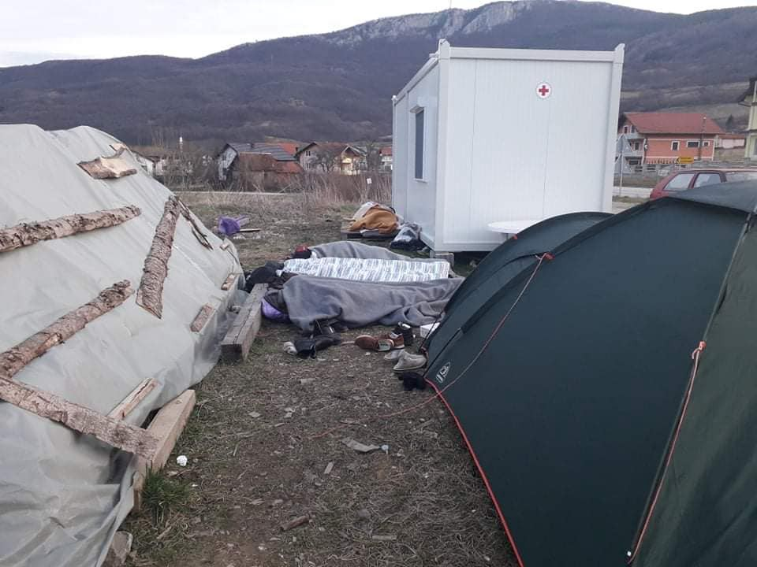
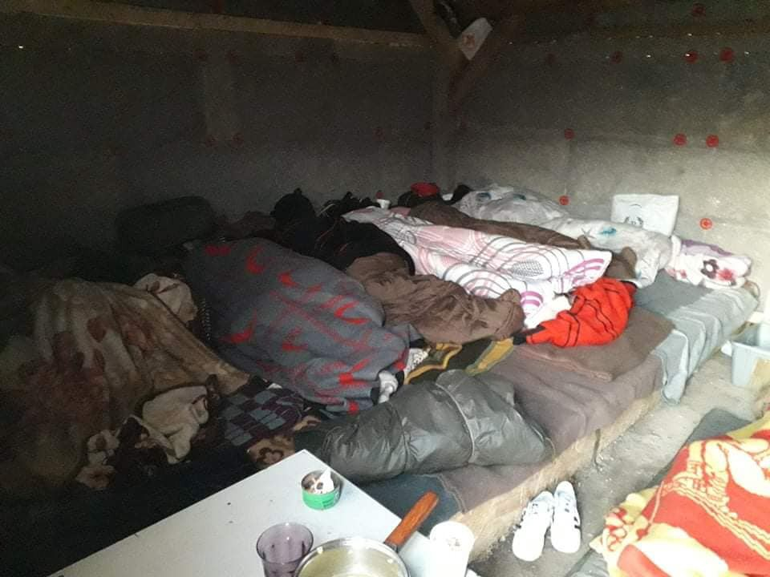
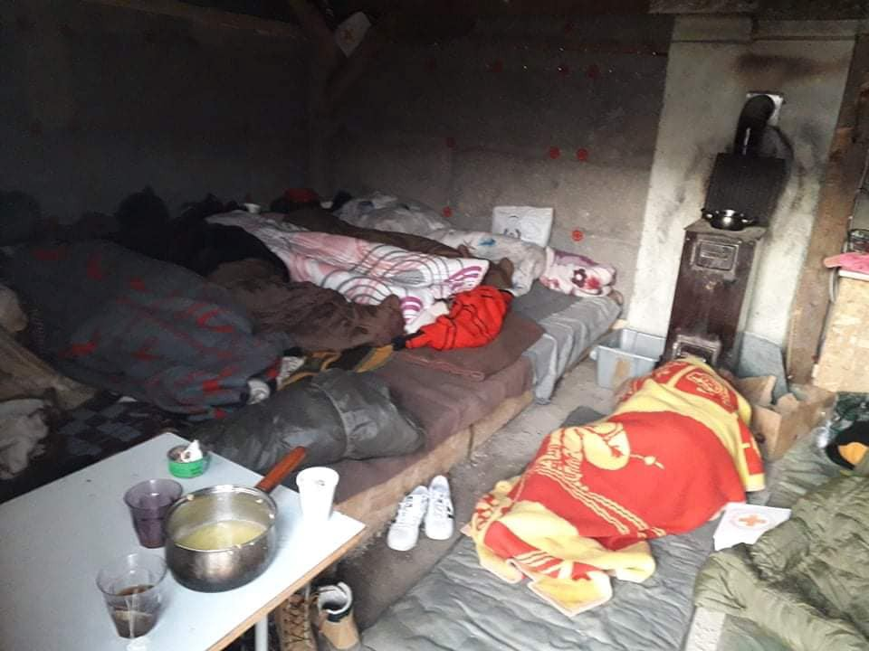
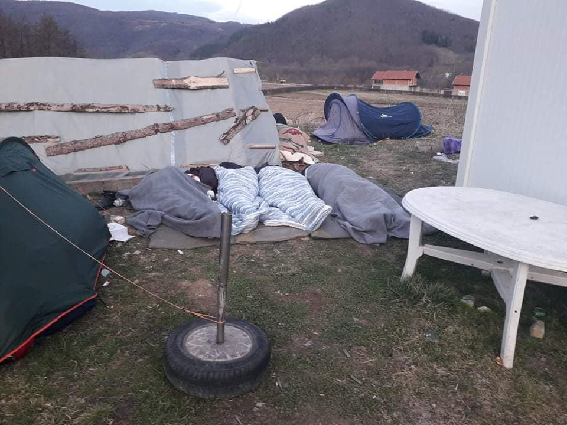
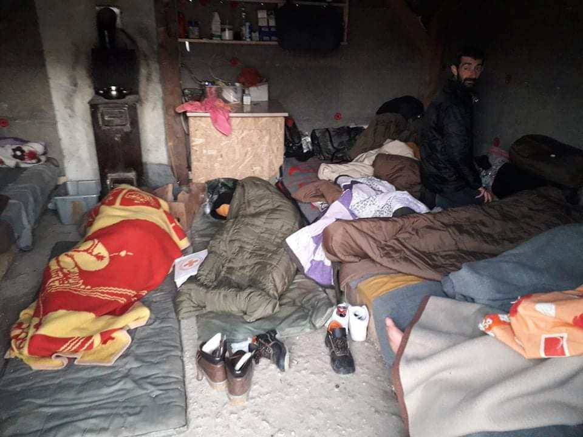

### AYS Daily Digest 24/02/20: How close did the Maltese authorities work together with the Libyan Coast Guard?
#### High tension and protests on Greek Islands before the arrival of riot police // Passengers and crew of Ocean Vikings under quarantine in Italy // Finland willing to take in 175 vulnerable persons from Greek Islands // Overwhelmed volunteers and local teams in Bosnia and Herzegovina in the face of more arrivals // & more

 \)](assets/fe6abd4d928b/1*R2JS706pthnwj1lnMuehpA.jpeg)

Ključ, Bosnia and Herzegovina — the daily reality of people in tranzit \(Photo: [Sanella Lepirica](https://www.facebook.com/sanela.lepirica?__tn__=%2Cd%2AF%2AF-R&eid=ARB40AUzhE3NbmBltK2oj1-LVz7GQoFjLEpqmXnU8-DBSaZguuJOEy2nPoG2qvhQPQDmnofD1u0kIU-F&tn-str=%2AF) \)
#### FEATURED
#### How tied was the cooperation between The Libyan Coast Guard, the Maltese Government & Armed Forces **when it comes to the interception of boats on route to Malta?**

A trusted person from the Office of former Prime Minister Joseph Muscat claims to have arranged a secret pact between Maltese authorities and Libyan Coast Guards\.

Neville Gafá, a controversial former coordinator in the office of the last Maltese Prime Minister Joseph Muscat, talked about his role in arranging a pact between Malta and the Libyan Coast Guard on intercepting refugee boats making their way to Malta\. The statement was made in a public inquiry investigating the killing of the journalist Daphne Caruana Galizia\. Gafá explained that he acted on direct orders from the Office of the then Prime Minister Muscat when he, in the summer of 2018, used his private contacts with officials in Libya to set up the procedure with the Libyan Coast Guard\. According to Gafá, he would receive information about the position of refugee boats from the Maltese Armed Forces and would hand them over to the Libyan Coast Guard, they in turn would use this information to intercept the boats before they left Libyan waters\. Gafá’s travel to Libya in question took place in the Summer of 2018\. Gafá previously rejected the assertion that he had been traveling as a special envoy of the Prime Minister and was negotiating with Libyan officials\. In a news article from November 2018 about the unclear cause and course of Gafá’s Libya trips, it was stated that:

> “Mr Gafà denied having used any diplomatic designation and said he had travelled to Libya on a “personal trip”, meeting ministers who were “friends”\.
 

> A spokesman for the Office of the Prime Minister had said Mr Gafà did not hold any official meetings in Libya on behalf of the Maltese government\.” 

Times of Malta, November 28th, 2018, see [here](https://timesofmalta.com/articles/view/what-is-neville-gafas-real-job.695325) \.

Now, the situation appears to have been somewhat different\. In an article from yesterday, February 24th 2020, it was said that:

> Gafà says the OPM asked him to use his contacts in Libya to establish a direct line with the authorities there, particularly the Libyan coastguard\. 

> He lifts the lid on what has, until now, been an unconfirmed report of a secret arrangement between Malta and Libya to have migrants intercepted inside Libyan waters\. 

> “I used to receive information of boats departing from Libya and their coordinates from the Armed Forces of Malta and would relay this directly to the Libyan coastguard\. My work was to cover Libyan waters only\. The moment a boat moved out of Libyan waters it no longer remained my remit,” Gafà explains\. 

> He says that he used to communicate with his contacts in the Libyan coastguard and if the situation remained unresolved, he would up the ante by contacting the Libyan interior ministry\. 

MaltaToday, Feburary 24th 2020, see [here](https://www.maltatoday.com.mt/news/national/100536/nevile_gafa_2loyal_servent_migration_deal_libya#.XlOHpRNKhhE) \.

Allegedely, between July 2018 and January 2019, around 53 migrant boats were intercepted in this way before they could leave the Libyan waters and enter the Maltese Search and Rescue Zone\. 
This close cooperation between a European member state and the Libyan coast guard is once again shocking\. All humanitarian organisations and human rights advocates condemn pushbacks to Libya, as it is not a safe country\. Those pushbacks violate the non\-refoulement principle\. The non\-refoulement principle is a fundamental principle in international law\. It forbids a country to return asylum seekers to a third country in which they are in danger\. 
UNHCR has repeatedly insisted that Libya is not a safe country:

■■■■■■■■■■■■■■ 
> **[UNHCR Libya](https://twitter.com/UNHCRLibya) @ Twitter Says:** 

> > UNHCR with partner @[IMC_Worldwide](https://twitter.com/IMC_Worldwide) provided emergency &amp; medical help to 240 people who were intercepted at sea &amp; brought to Tripoli by Libya Coastguard.    
We continue to emphasise Libya 🇱🇾 is not a safe port for disembarkation https://t.co/RWxcE0RhfM 

> **Tweeted at [2020-02-18 10:50:31](https://twitter.com/unhcrlibya/status/1229719837825470464).** 

■■■■■■■■■■■■■■ 

The Council of Europe’s Commissioner for Human Rights, Dunja Mijatovic, recently called on Italian authorities to suspend co\-operative activities with the Libyan Coast Guard\. In a letter to the Italian Minister of Foreign Affairs from Feburary 13th 2020, Mijatovic eyplains:

> “Given the safety situation in conflict\-torn Libya at present and the great amount of evidence pointing to serious human rights violations faced by migrants and asylum seekers returned there, I call on your government to suspend the co\-operation activities in place with the Libyan Coast Guard that impact, directly or indirectly, on the return of persons intercepted at sea to Libya\.” 

■■■■■■■■■■■■■■ 
> **[Commissioner for Human Rights](https://twitter.com/CommissionerHR) @ Twitter Says:** 

> > Italy should suspend co-operation activities with Libyan Coast Guard and introduce #HumanRights safeguards in future #migration co-operation 
Read my letter to #Italy’s Minister of Foreign Affairs @[luigidimaio](https://twitter.com/luigidimaio) [coe.int/en/web/commiss…](https://www.coe.int/en/web/commissioner/-/commissioner-urges-italy-to-suspend-co-operation-activities-with-libyan-coast-guard-and-introduce-human-rights-safeguards-in-future-migration-co-opera) 

> **Tweeted at [2020-02-21 09:07:58](https://twitter.com/commissionerhr/status/1230781193865637888).** 

■■■■■■■■■■■■■■ 

On Sunday, 23th Feburary 2020 the former chairperson of the Maltese Green Party, Arnold Cassola, filed a complaint with the International Criminal Court in Den Haag to investigate the secret pact between Malta and the Libyan Coast Guards and the role of Gafá and Muscat in it\. He alledges violations of basic Human Rights and a breaches of International Law\. 
Further, NGO’s like the _Aditus Foundation_ and the _Civil Society Network_ have called for inquiries into the secret pact\. In an article from yesterday, 24th of Feburary 2020, the Director of Aditus Neil Falzon is quoted:

> “Falzon spoke about how asylum seekers intercepted by the Libyan coastguard are returned to a place where men are sold as slaves, women are sexually exploited and people are sent to die in detention centres\. “Beyond legality questions, we should be asking ourselves if we want to be a nation that treats people with such a vile disregard for their humanity and dignity,” he said\.” 

MaltaToday, February 24th 2020, see [here](https://www.maltatoday.com.mt/news/national/100549/libya_pact_malta_facilitated_return_of_migrants_to_ghastly_and_horrific_situation_ngos_says?fbclid=IwAR2ciscpBATvGzrHOn1kbwLIdycKiusFaVxa34JzOi_-JBo0e_Sx7Tzf1-U) \.

Neville Gafá in turn, is unaware of any wrongdoings\. He claims that one cannot speak about pushbacks, since the interceptions happened in Libyan waters\. He presents himself as having saved thousands of lives, “spared” Malta from thousands of immigrants and helped to avert a national crisis\.

MaltaToday, February 19th 2020, see [here](https://www.maltatoday.com.mt/news/national/100487/neville_gafa_claims_credit_for_migrant_interceptions_by_libyan_coastguard) \.
#### GREECE

Tension rose tonight on Lesvos and Chios when the arrival of a ferry with riot police from the mainland was expected\. The police are supposed to support the government’s plans to install closed migration centers on the islands\. Residents and local authorities have tried to prevent these plans by setting up barricades\. On Lesvos, according to media articles, tear gas has been used against the protesters\. 
Find more information here:

#### BOSNIA AND HERZEGOVINA

Ključ, asmall ‘hot spot’ along the route through Bosnia and Herzegovina, is a place where people traveling from Tuzla and Sarajevo are usually taken off the buses, and subsequently are left to deal with how to continue towards the northern towns on their own\. People have now been arriving in larger numbers\. The conditions which they find have not changed\. Officials and large organisations have not come up with any viable solution for a sustainable reception site or even dealing with arrivals, so it is the Red Cross of Ključ, along with individuals and local initiatives from other places who are bearing the whole responsibility for the situation\.

](assets/fe6abd4d928b/1*C78mmdqsrZtM1tbeCVDNlw.jpeg)

Photo: [Sanella Lepirica](https://www.facebook.com/sanela.lepirica?__tn__=%2CdC-R-R&eid=ARC7xb8RaSctekCORh27379MXibvwwLP_C1CHB9f5W7HJRc4JVN1_mKFfgo1q541q0bbV-3BrF5lsnjo&hc_ref=ARTn9pSub9EwSJZv3J8czlNXRDi9Fuk8pCCp7_IIBFVN0qToB5MaWpGN04JOvrVI-cc&fref=nf)
#### ITALY

People on the move should be warned of the special circumstances that the coronavirus has influenced in some of the regions, particularly in the Veneto area, the closest region to Slovenia and Croatia, where there is an large army presence across the small towns and on the roads leading up to inhabited areas, we have been informed\.
### Quarantine for Ocean Viking

274 people who have been rescued by the Ocean Viking are now allowed to disembark in Sicily\. Upon arrival, the rescued persons, as well as the crew, are to be held under quarantine for 14 days\. This is a safety measure in response to the dramatic increase of cases of corona infections in Italy\. Médecins Sans Frontières, the operator of the boat, expressed their understandings for the measures but in the same time highlighted that “The Covid\-19 outbreak should not result in unwarranted new public anxiety around those who are rescued at sea\.” Nor should the outbreak “serve as a pretext to prevent the Ocean Viking from resuming its lifesaving work in the central Mediterranean\.” 
Italy is heavily hit by the new corona\-virus, with around 200 cases of infections and 6 confirmed deaths\. Most of the cases appear in the northern regions of Italy\.
#### FINLAND

The Finish government has announced that it will open its gates for 175 asylum seekers from Mediterranean countries like Greece, Cyprus, Malta and Italy\. This step is a reaction to Greece appeal to European countries to support it in protecting the most vulnerable groups of people, who are currently stuck in horrendous conditions in the camps on the islands\. According to a statement by the Finish President Sauli Niinistö, priority will be given to girls and young children\.

**Find daily updates and special reports on our [Medium page](https://medium.com/are-you-syrious) \.**

**If you wish to contribute, either by writing a report or a story, or by joining the info gathering team, please let us know\.**

**We strive to echo correct news from the ground through collaboration and fairness\. Every effort has been made to credit organisations and individuals with regard to the supply of information, video, and photo material \(in cases where the source wanted to be accredited\) \. Please notify us regarding corrections\.**

**If there’s anything you want to share or comment, contact us through Facebook, Twitter or write to: areyousyrious@gmail\.com**

_Converted [Medium Post](https://medium.com/are-you-syrious/ays-daily-digest-24-02-20-how-close-did-the-maltese-authorities-work-together-with-the-libyan-fe6abd4d928b) by [ZMediumToMarkdown](https://github.com/ZhgChgLi/ZMediumToMarkdown)._
