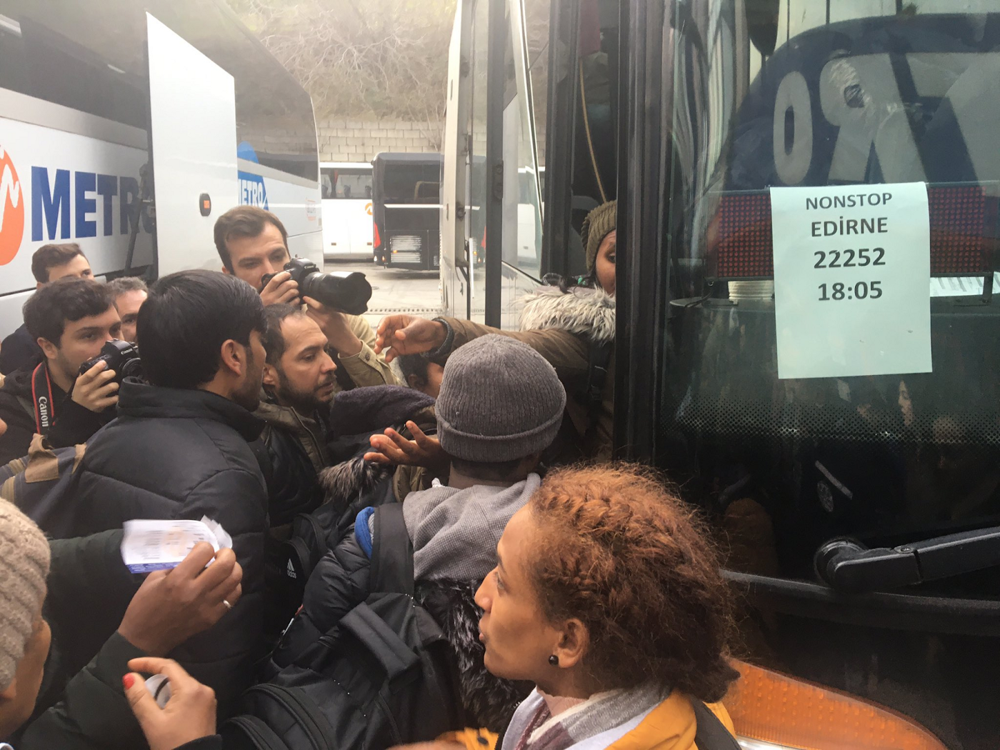

### AYS Daily Digest 28/2/2020: Stuck in No Man’s Land

Refugees head towards the border // Fascism on the rise in Serbia // Family faces deportation after 15 years in Sweden

### **Greece / Turkey Border Situation**

On Thursday evening, Turkey ordered police, coast guard and border patrol officers to stand down in response to the deaths of more than 33 soldiers by Russian\-backed Syrian Government forces\. On Friday, reports poured in about refugees making their way to the border, sometimes even assisted by the Turkish government\.

■■■■■■■■■■■■■■ 
> **[Jenan Moussa](https://twitter.com/jenanmoussa) @ Twitter Says:** 

> > 1/ Turkey realizes that the only way to pressure Europe on escalation in Idlib is by allowing refugees to go to Europe.

Today busses in Istanbul were picking up refugees to drop them off in Edirne, a Turkish town close to border crossings with Greece &Bulgaria.

Vid via @OweisAk https://t.co/rfBgUVfqfe 

> **Tweeted at [2020-02-28 10:18:44](https://twitter.com/jenanmoussa/status/1233335721374687232).** 

■■■■■■■■■■■■■■ 

In response to questions regarding the Turkish government’s position on the situation, the spokesman of the Turkish Justice and Development Party, Omar Jilick said:

_“Our policies about the refugees didn’t change but we can’t from now on control their movements\.”_

The exact number and makeup of the travelling refugees still cannot be verified, as reports about how many are on the move are conflicting and subject to exaggeration\. However, it seems as of last night around 150 refugees from Syria, Iran, Afghanistan, and Palestine were trapped in the border region, specifically between Edirne and the Greek border\. This area is being called a sort of no man’s land, where there is nothing but sprawling fields and darkness\. Some on the ground have reported that refugees wishing to return to Istanbul are facing resistance from Turkish forces\. Prevented from returning to Istanbul and prevented from entering Greece, these refugees seem to be stuck in no man’s land as tensions on all sides rise\.

Reports coming through social media showed what appeared to be Greek authorities firing teargas at refugees\.

The news around the situation is troubling for two reasons: 1\) The Greek authorities’ use of teargas on refugees at the border is inhumane and puts lives at risk 2\) Trapping refugees in the border region with no option to move will only increase tensions and further endanger everyone present\. Turkey seems to be playing with refugees’ lives in order to fulfill its political ambitions of garnering Western support against the Syrian regime and in doing so is putting many at risk\.

■■■■■■■■■■■■■■ 
> **[Jenan Moussa](https://twitter.com/jenanmoussa) @ Twitter Says:** 

> > 1000s of migrants/refugees today again flock to Turkish-Greek border near Edirne. Crowd is growing by the hour.

You can see in this video by @[egemengok_](https://twitter.com/egemengok_) that there are no guards on Turkish side.

People walking freely into no man's land only to be blocked by Greek border guards. https://t.co/bZo4fxFWTT 

> **Tweeted at [2020-02-29 09:49:32](https://twitter.com/jenanmoussa/status/1233690758626074624).** 

■■■■■■■■■■■■■■ 

In response to Turkey’s declaration, NATO members called for an urgent briefing on the situation yesterday and the US State Department announced it is considering providing assistance to Turkey\.

■■■■■■■■■■■■■■ 
> **[Belgium UN New York](https://twitter.com/BelgiumUN) @ Twitter Says:** 

> > 🙌 BREAKING

#Belgium[UN](https://twitter.com/UN)SC 🇧🇪 together with Germany, Estonia, France, Dominican Republic, UK & US requested an urgent briefing of the @[UN](https://twitter.com/UN) Security Council on the developing crisis in Northwest #Syria #Idlib.

The briefing should take place at 4pm. https://t.co/W9O1msbusU 

> **Tweeted at [2020-02-28 15:11:21](https://twitter.com/belgiumun/status/1233409357141991426).** 

■■■■■■■■■■■■■■ 

In its own response, Greece has reportedly sent backup troops to the border and has supposedly closed the entire border not just for refugees, but for everyone\.

■■■■■■■■■■■■■■ 
> **[Andreas Mountzouroulias 🇬🇷](https://twitter.com/andreasmoun) @ Twitter Says:** 

> > #Greek army on alert - #Athens sends more soldiers in #Evros

#Greek defense forces and the police increased their patrols on Friday at the land border with #Turkey along the #Evros River 

#Türkiye #Erdoğan #Erdogan #Yunanistan #μεταναστευτικο #Syria #COVID2019 https://t.co/K5ktnv5xuU 

> **Tweeted at [2020-02-28 17:16:39](https://twitter.com/andreasmoun/status/1233440892339597314).** 

■■■■■■■■■■■■■■ 

■■■■■■■■■■■■■■ 
> **[Liana Spyropoulou](https://twitter.com/LSpyropoulou) @ Twitter Says:** 

> > #BREAKING 
#Greece just shut down the borders with #Turkey in Kastanies, near #Evros Not only for the migrants, for EVERYONE! 

> **Tweeted at [2020-02-28 12:06:49](https://twitter.com/lspyropoulou/status/1233362920345612288).** 

■■■■■■■■■■■■■■ 

In response to the declaration, local Greek media reported an increase of sea arrivals today\. It must be noted, however, that this is probably unfounded information, as the numbers of arrivals seem to be similar to those on any other day\.

■■■■■■■■■■■■■■ 
> **[NoBorders](https://twitter.com/Refugees_Gr) @ Twitter Says:** 

> > Reports on local media today for increase of arrivals at Skala Sykamnias #Lesvos #refugeesgr https://t.co/4xT6XuoiCt 

> **Tweeted at [2020-02-28 12:30:04](https://twitter.com/refugees_gr/status/1233368771315871746).** 

■■■■■■■■■■■■■■ 

■■■■■■■■■■■■■■ 
> **[Savvas Karmaniolas](https://twitter.com/savvaskarma) @ Twitter Says:** 

> > Another dinghy boat carrying #refugeesGr landed on the northern coast of Lesbos island, #Greece #Λεσβος https://t.co/opwk5GsIFS 

> **Tweeted at [2020-02-28 13:54:41](https://twitter.com/savvaskarma/status/1233390064811618304).** 

■■■■■■■■■■■■■■ 

[For more information on the border situation in Arabic: للمزيد من المعلومات باللغة العربية](https://www.facebook.com/ajmubasher/videos/vb.125786760767400/499205834005667/?type=2&theater)
### **Serbia**

No Name Kitchen has been reporting more and more often about rising fascist sentiments in Serbia\. Today their car was vandalized by angry locals\.

### **Sweden**

A Lebanese family which has been living in Sweden since 2004 will be deported back to that country\. The family originally fled because of political persecution and even changed their names once they arrived in Sweden\.

The daughter, Sofia, aged 14, was born in Sweden and if she is deported it will be to a country she does not call home\. The case of the family has sparked a lot of reactions on social media and a petition was started which now has more than 8000 signatures\. The 26\-year\-old son, Pierre, finished school in Sweden and is now working\.

Their case is now pending before the Migration Court of Appeal\.

[Read More Here](https://sverigesradio.se/sida/artikel.aspx?programid=103&artikel=7417698&fbclid=IwAR3rhzsFypr03AqpWQlb4k4LxE-NpMgSOkuZTZd80GyTlx0xX2kQY2sdraQ)
### **Syria**

The UN chief António Guterres described the current displacement crisis in and around Idlib and the escalation in fighting between Turkish and Russian\-backed Syrian forces, as “one of the most alarming moments” of the nearly decade\-long war\.

■■■■■■■■■■■■■■ 
> **[الجزيرة - عاجل](https://twitter.com/AJABreaking) @ Twitter Says:** 

> > عاجل | مساعدة غوتيريش للشؤون السياسية: هناك استهداف للمدنيين حتى في مخيمات النازحين في الشمال السوري 

> **Tweeted at [2020-02-28 21:13:17](https://twitter.com/ajabreaking/status/1233500441742381056).** 

■■■■■■■■■■■■■■ 

_“Without urgent action, the risk of even greater escalation grows by the hour\. And as always, civilians are paying the gravest price\.”_

The UN reports that even safe zones such as IDP camps and shelters where displaced families have sought refuge have been struck by shelling\.

“ _The most pressing need now is an immediate ceasefire before the situation gets entirely out of control\.”_

[WHO](http://www.who.int/en/) Spokesperson Christian Lindmeier also described the situation as “mayhem\.”

■■■■■■■■■■■■■■ 
> **[UN Geneva](https://twitter.com/UNGeneva) @ Twitter Says:** 

> > "As of today, 84 health facilities have been forced to suspend operations since 1 December 2019," -- @[WHO](https://twitter.com/WHO) 

"We now have 950,000 displacements going in absolutely horrifying conditions. People have nothing and they have no place to go," -- @[UNOCHA](https://twitter.com/UNOCHA) 

#Idlib #Syria https://t.co/B012LyA32G 

> **Tweeted at [2020-02-28 14:57:01](https://twitter.com/ungeneva/status/1233405752804597760).** 

■■■■■■■■■■■■■■ 

**Find daily updates and special reports on our [Medium page](https://medium.com/are-you-syrious) \.**

**If you wish to contribute, either by writing a report or a story, or by joining the info gathering team, please let us know\.**

**We strive to echo correct news from the ground through collaboration and fairness\. Every effort has been made to credit organisations and individuals with regard to the supply of information, video, and photo material \(in cases where the source wanted to be accredited\) \. Please notify us regarding corrections\.**

**If there’s anything you want to share or comment, contact us through Facebook, Twitter or write to: areyousyrious@gmail\.com**

_Converted [Medium Post](https://medium.com/are-you-syrious/28-02-20-ays-daily-digest-stuck-in-no-mans-land-bb74e2f913ee) by [ZMediumToMarkdown](https://github.com/ZhgChgLi/ZMediumToMarkdown)._
