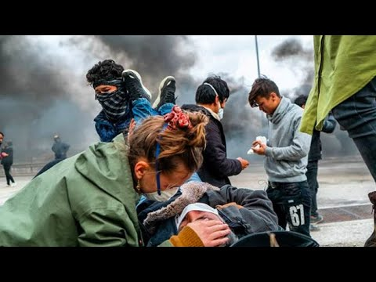
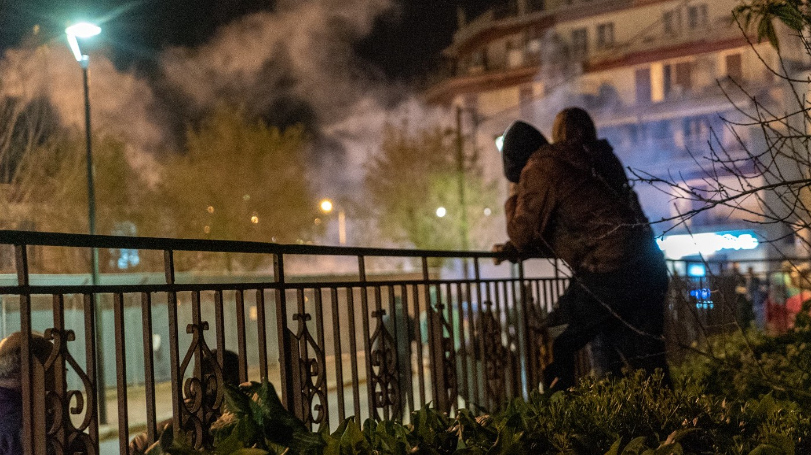
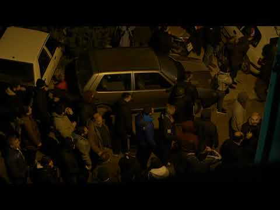
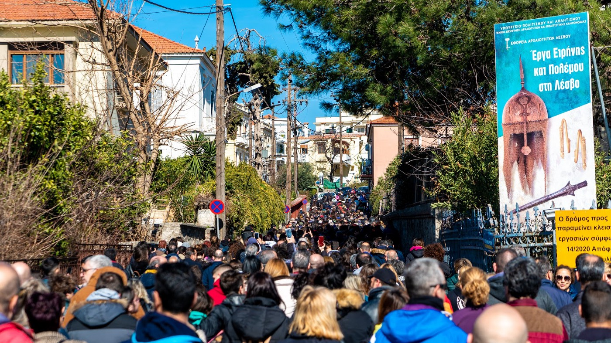
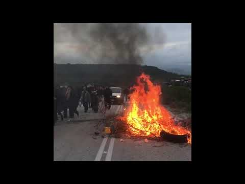
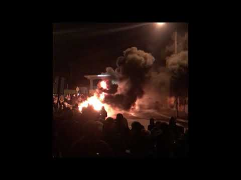
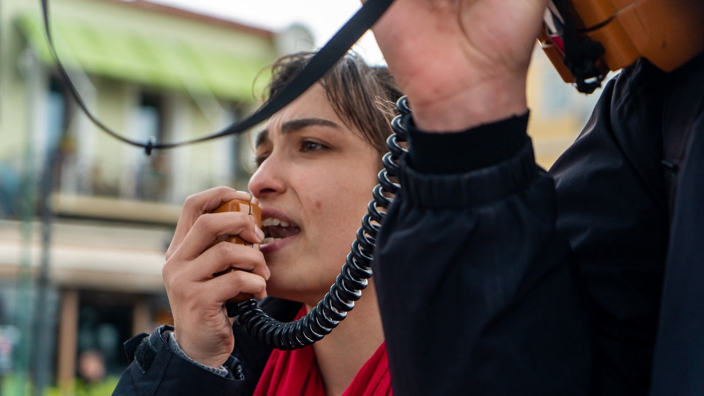
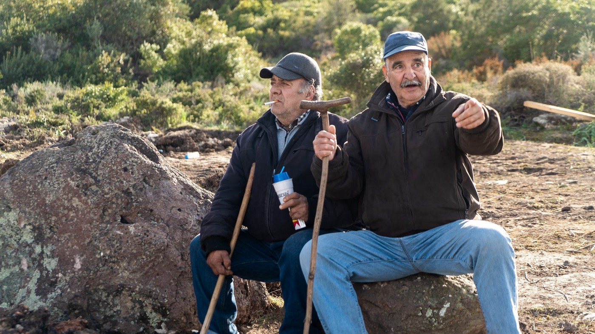
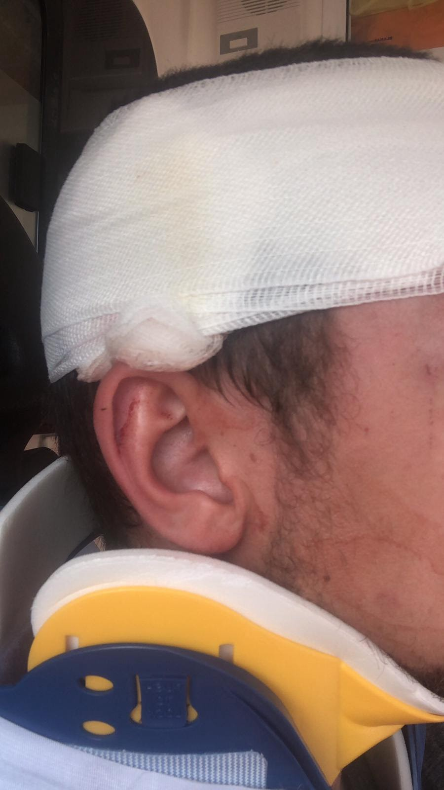
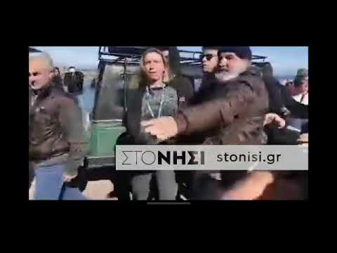

### AYS Special: Lesvos well beyond the brink \(this is what we know so far\)
#### In partnership with Refocus Media Labs, we bring you the most detailed account of violent and sometimes confusing events unfolding at the congested Greek island, with updates to follow as the story is still unfolding\. Written by Douglas F\. Herman\.

Tear gas canisters fired at local protesters by riot police imported from Athens\. \(Kavala, Lesvos\)
Photo: @dfherman @refocusmedialabs
### **Pressure Cooker**

Ever since the Mitsotakis’s Nea Dimokratia \(ND\) government took power in July the severity of the refugee crisis on the north Aeagean islands of Lesvos, Chios, Samos, Kos and Leros has exponentially exploded with 42,568 asylum seekers trapped on the islands\. The numbers of new arrivals continue to grow at a rate faster than mainland transfers with obvious results\- extreme overcrowding, dwindling resources and deplorable conditions\. On Lesvos alone, over 21,000 refugees indefinitely endure inhumane conditions, and their numbers are dangerously close to equaling the local population within the capital region of Mytilini\. The government response has not quickly “decongested” the island hot spots, as it repeatedly stated, and transfers to the mainland are easily outpaced by new daily arrivals\. Rather than stabilizing an overwhelming crisis, Mitsotakis’s conservative government continues to push a highly controversial plan to develop closed detention centers on the very same islands, has embarked on a campaign to scrutinize NGOs for their humanitarian operations and recently used their majority to pass more restrictive asylum laws aimed at making it easier to reject, detain and deport asylum seekers without legal recourse\.

> **NOTE TO READER:** The following overarching report focuses on Lesvos and attempts to communicate the extremely complex situation that has pushed asylum seekers and locals alike well beyond the brink\. This report follows a linear path to help provide context and causality for events as they currently unfold\. Readers more informed on recent context may want to scroll to the latter sections for most recent developments\. 

North Aegean All\-Island General Strike: January 22, 2020 Mytilini, Lesvos
photo: @dfherman
### **“We want our island back, we want our lives back”**

To refugees and locals alike, closed centers will function like prisons, immediately holding people in detention until their asylum claims are processed, while others arbitrarily not deemed eligible, will be deported\. Local and regional authorities on all the North Aegean islands have flatly rejected these plans, and the local populations have aggressively refused to allow the construction to commence\. On January 22, 2020, public and private sectors on the North Aegean islands held the first of many general strikes in protest of the government, continued flows or new arrivals, NGO operations and proposed plans to construct closed camps\. Thousands of islanders flocked to their capital cities to join in the strike and led peaceful demonstrations to the seats of their governments with a common slogan of _“We Want our Island Back\. We Want Our Life Back\.”_ The mayors of all islands then met with New Democracy leadership in Athens the day after to communicate their demands and solutions to a crisis they have disproportionately shouldered for more than five years\.

Refugee Protest: January 30, 2020 Mytilini, Lesvos 
photo: @dfherman
### General strikes & refugee protests

A week later, on Jan 30th, refugee mothers and children took to the streets in Mytilini to peacefully demand solutions for conditions inside Moria\. In a driving rain, they peacefully marched through the port chanting and holding signs reading _“We escaped war and insecurity, but here they are kill us from the cold\.”_ Less than a week later on February 3, refugees led a larger and more comprehensive peaceful protest toward Mytilini over the conditions in Moria, summary deportations without appeal and the seemingly never\-ending delays in asylum claim procedures\. Similar to the peaceful display of Greek solidarity on the 22nd, where families of all ages gathered and marched through the center of town, refugees from all backgrounds attempted to do the same\. However, riot police previously brought in from Athens met them on the road from Kara Tepe refugee camp toward downtown Mytilini, trapping thousands and aggressively used tear gas to push back a peaceful crowd filled with women, children and elderly\. _“Azadi, Azadi, Freedom, Freedom\!”_ was their common call as they consistently attempted to re\-establish a peaceful demonstration, but police forces repeatedly escalated without provocation\.

**_How it was covered in the mainstream media: [Aljazeera Brief by Katy Fallon, Video by Douglas Herman & Ciaran Carney](https://www.aljazeera.com/news/2020/02/refugee-children-crowds-protesters-tear-gassed-lesbos-200204133656056.html)_**

Refugees set contained fires by burning tires in the streets to combat the tear gas, and volunteer nurses and doctors treated numerous protesters impacted by tear gas, some of which suffered panic attacks, severe breathing issues and in one case a heart attack\. Nurses on the scene reported waiting well over an hour for an ambulance to arrive\. Police continued to escalate using tear gas to move their perimeter back toward Moria, and then without provocation started “arresting” refugees, nurses, volunteers, journalists \(myself included\) and other non\-Greeks walking along the main road\. Those detained were physically locked into a small section in the back of a van without adequate seating and driven aggressively toward the Mytilini police station where hours of disconcerted detention commenced\. All were eventually released without charge, formal paperwork or true explanations for their detentions\.

Detainees inside transported to Mytilini police station, February 3, 2020 Kara Tepe, Lesvos
Photo: @dfherman

The following day, another group of refugees staged a peaceful protest outside the municipal theater in downtown Mytilini to reassert their demands to end the conditions in Moria and the surrounding tent city where nearly 15,000 now struggle to survive the winter\. At one point, a collective chant _“Lesvos, we are sorry”_ rang through, clarifying their awareness of the troubles their extended presence has caused the small island community\. Shortly after they started marching through the port, the riot police once again used aggressive tactics shoving them along the harbor\. But the true climate change was when locals verbally and physically threatened refugees, intimidated NGO volunteers and openly chased anyone with a camera\.

A protester was punched by Police officer in plain clothes\. Mytilini, Lesvos
Photo: screen grab from video by Ciaran Carney

Men of differing ages claiming to be undercover police, harassed journalists with cameras, demanded identification and attempted to confiscate cameras\. Several refugees reported being threatened and locals chanted _“throw them back in the sea\.”_ While these incidents were isolated, many volunteers, Greek and non\-Greek NGO workers reported feeling a growing sense of concern in public spaces and serious worries over walking alone at night\.

### Orchestrated fear

In the days that followed, some residents of Moria village began hostile defense of roads in and out of the village, and groups of fascists started openly attacking volunteer vehicles and NGO workers\. During this time, Greek Alternate Migration Minister Giorgos Koumoutsakos began publicly encouraging a campaign of hate and blame against NGOs and volunteers, calling them _“bloodsuckers …that set up operations in one night in order to have access to EU funding\.”_ Migration Minister Notis Mitarakis compounded the sentiment with statements alleging NGOs incited the recent refugee protests\. Quick adoption on both mainstream and social media was widespread, and suddenly reports of mobs on motorbikes coming after NGO volunteers became common\. Peaceful demonstrations against the unchecked violence perpetuated on volunteers, NGOs and refugees in and around Moria village were met with more violence when a mob of young fascists attacked a local cafe popular with aid workers and local Antifa supporters\.

Local Antifa march against violent blockade of Moria Village\. Kara Tepe, Lesvos 
Photo: Ahmad Ebrahimi @s\.ahmad\_ebrahimi

While the physical damage was minimal, and police eventually dispersed the attackers, the damage was done as a cloud of legitimate fear fully settled above Mytilini\. Days later, the nightly defense of Moria village remained unaddressed by police\. 14 refugees were detained as responsible for orchestrating the Feb 3rd protest and NGOs were still being openly accused without evidence of being ring leaders and provocateurs\. A day later, seven individuals were eventually arrested with homemade weapons for more brazen behavior, but calm did not return as the sometimes armed and aggressive defense of Moria village continued to ensure refugees stopped using the shorter paths to reach Mytilini\. Longstanding NGOs operating inside Moria village closed their centers and many NGO volunteers and aid workers felt the need to move out of rented apartments to ensure daily safety for themselves and their vehicles\.

**_For more in\-depth interviews and a recent special report from Lesvos click here: [Latitude Adjustment Podcast’s Special Report for AYS](ays-special-from-lesvos-right-wing-attacks-on-refugees-volunteers-and-locals-9f98779aef8e)_**
### Closed centres & Requisition of land

In November 2019, the central government officially announced the plan to establish closed centers on the five islands and shutter overcrowded camps like Moria on Lesvos\.

But the push to actualize the plan truly started on January 31, 2020 with the closure of Stage 2 camp in Skala Sikamineas on the north coast of Lesvos\.

Daily scene on the north coast of Lesvos, near Skala Sikamineas\. Arrivals in 2019 have totalled more than 2017 and 2018 combined, yet Stage 2 first response camp was recently ordered closed\.
Photo: @dfherman

The dramatic increase in arrivals in 2019 totaling nearly 60,000 \(more than 2017 and 2018 combined\), made Stage 2 a vital humanitarian resource providing immediate support for new arrivals including dry clothes, blankets, food, medical services and temporary accommodation prior to transfers to Moria\. In November, the West Lesvos Municipal Council voted in favor of closure, no appeal was filed and the Hellenic Ministry of Public Order and Citizen Protection did not reverse course\.

Olive Grove behind overcrowded Moria Camp, Lesvos\. Over 15,000 people are living rough in tent city\.
Photo: @dfherman

The impact was felt immediately with new arrivals that weekend going without immediate services\. With the population of Moria exploding past 20,000 in a space with a maximum capacity of 3,000 an entire tent city has formed within the olive groves around the sides of the military camp, and significant portions of the surrounding groves have been cut for firewood and building materials\. Sanitation is overflowing, access to clean water is non\-existent, access to toilets and showers at all\-time low, scabies and other diseases are rampant, crime and violence is a constant threat and formal educational options simply do not exist\.

Olive Grove behind overcrowded Moria Camp, Lesvos\. Over 15,000 people are living rough in tent city\.
Photo: @dfherman

Prime Minister Kyriakos Mitsotakis, who campaigned and won on promises of swiftly solving the refugee crisis, continues to call on EU nations to relieve Greece and other southern nations of the imbalanced weight and responsibility\. Their announcement of creating close detention centers focused upon speeding up the asylum process as well as deportations\. The declaration of land purchases to establish the centers was met with outrage by island leadership and citizens alike\. Government spokesman Stelios Petsas stated _“the closed facilities will be governed by strict rules and limitations for movement for the occupants\. They will receive exit cards for controlled leave, while structures will remain closed at night\.”_ Reuters further reported that the Greek government would utilize emergency decrees ratified by parliament at a later date to fast\-track legislature procedures to move forward with construction\. The Ministry of Migration and Asylum declared that three construction companies were awarded fast\-track contracts to start the basic clearing for foundational building at three respective sites\. AKTOR SA received 854,390 Euros on Lesvos, TERNA SA 1,031,398 Euros on Chios and MYTILINEOS SA received 947,651 Euros for similar clearing work on Samos\. According to an in\-depth report “Eating Mountains and Eating Each Other; Disjunctive Modernization,Infrastructural Imaginaries and Crisis in Greece by Dimitris Dalakoglou and Yannis Kallianos \(ELSEVIER\), this type of central government vs local community battle over building contracts and land development rights has become epidemic in Greece, and long\-standing and epic local resistance commonplace\.

On Lesvos, the remote agricultural area in Karava, close to Mantamados had been selected for the new closed camp\. Mantamados, with a population of just 2,447 people \(2011 census\) vehemently opposed\. The central government moved forward with a proposed legislative act to requisition lands, prompting the North Aegean Region \(NAR\) government to suspend ties with the Greek government, establish patrol groups to protect the Karava area and appeal the plan to the Council of State\. Similar actions from both sides unfolded on other Aegean islands with especially extreme resistance on Chios\.

“Life\-jacket Graveyard” near Molyvos, Lesvos\.
Photo: @dfherman

In a symbolic action, the West Lesvos municipality transported thousands of “rotting” life\-vests and rubber dinghy boats from the now infamous “life\-jacket graveyard” to the proposed building site\. Other blockades of raised earth, rocks, trees, trucks and farm equipment were set up along all small country roads leading into the agricultural area of Karavas\.

In response, Migration Minister Notis Mitarakis announced “the freezing of requisitions so that the dialogue starts” and requested alternatives from the local governments\. The suspension was pre\-scheduled to last less than one working week and the main alternative by the local government was to build the closed center on the uninhabited islet of Aspronisi, roughly five nautical miles off the coast of Mantamados\. Mitsotakis’s government rejected this alternative due to extreme infrastructure costs in establishing adequate services on the islet\. With no resolution in hand, the central government announced they would move forward with their intended plans in the area of Karava\.

Aspironsi, uninhabited islet in the background just off the coast of Mantamados, where alternative site for closed camp was rejected by Mitsotakis’s government\. Karava, Lesvos
Photo: @dfherman
### Daxi, Daxi

Saturday, February 22nd was a day of local and cultural celebration in Mytilini\. With Greek Carnival fast approaching, Sappho Square was filled with performers, dancers and musicians who entertained a large crowd of locals and refugees alike to traditional dance, song and farcical plays\. The energy was inclusive, joyful and festive\. For a couple of hours no one felt a looming political and physical showdown or the destabilizing refugee crisis\.

Cultural dance festival in Sappho Square in Mytilini, Lesvos February 22, 2020
Photo: @dfherman

On the other side of town a peaceful solidarity march had commenced protesting the requisition of lands, the creation of the closed camps, the continued indifference to the conditions in Moria and lack of plan to resolve new arrivals\. As it snaked through the streets of Mytilini toward the municipal building and back into port, the collective energy of locals, refugees and NGO workers fighting against the larger policies inspired hundreds of young and old to engage\. After weeks of locals being pitted against NGOs, volunteers and refugees, the unity on display gave the sense that the island had turned a much needed corner\.

Solidarity March of locals, refugees and NGOs\- Mytilini, Lesvos\. February 22, 2020
Photo: @dfherman

However, by Monday it was leaked that Athens was sending a ferry loaded with additional riot police, military personnel, water cannons and machinery to clear land and proceed with building the closed centers\. A new sense of unity came crashing down upon Lesvos like a sledgehammer\.
### Calm before the storm

Once word leaked that reinforcements were en route, locals formed blockades at the main port of Mytilini on Lesvos, and similar defensive actions were taken on Chios\. In Mytilini, the crowds gathered in the evening and blockaded the entrances and exits of the main ferry terminal with garbage and recycling trucks and in an effort to stop riot police from disembarking\. Large crowds started to form and prepared to stay the night until the ferry was to arrive\. Reports that the GPS on the ferry were turned off to avoid exact arrival times were apparently thwarted when crew members and passengers easily communicated with islanders for their arrival\.

Locals blockade the ferry terminal with garbage trucks throughout the night in advance of secret delivery of riot police arriving from Athens\. Mytilini, Lesvos February 24–25, 2020\. 
Photo: @dfherman

The crowd was mixed in sentiment and tactics\. On one side, Antifa and KKE \(communist party\) supporters locked arms around a banner denouncing the government plans to create the new closed centers\. They chanted protest slogans heard on Saturday while marching down Ermou street in the center of town\. The group was unified and peaceful\. On the opposite side, near the main entrance to the port terminal more restive protesters gathered and shouted at police who were lined up in full riot gear behind the fences in the ferry terminal\. In the middle were hundreds of locals who were simply there, talking and drinking coffees, beer or other alcoholic beverages\. There was an almost party atmosphere in the middle and all ages were present\.

Initially peaceful blockade of Mytilini ferry terminal, Lesvos
Photo: @dfherman

After several hours of peaceful gathering, the energy shifted\. The groups in the middle and near the main entrance started to become more aggressive, shouting more loudly and started shaking the fences that ringed the parking area\. One by one the fence fell in stages and protesters celebrated with each crashing gate\. At the corner of the terminal the crowd became even more emboldened and vicious with taunts of the police who still stood mainly in the shadows 20–30 meters away from the crowds that quickly increased in size\.

Riot police brace for confrontation with locals at ferry terminal in early hours of February 25, 2020 
Mytilini, Lesvos Photo: @dfherman

Several reporters were on the scene photographing and filming the situation without incident, but shortly after 1 am the more aggressive side of the crowd started attacking those with cameras\. One journalist in a gas mask and riot helmet became a target for physical violence, and while filming toward the riot police through the fence I was personally jumped by a group of men with an older man in his late 50s striking the first blow\. Quickly a mob formed, kicking and punching as they tried to destroy my camera\. The police stood idly by, not engaging until I was able to pull away and sneak between the fence\. Riot police eventually tossed tear gas and the crowd scattered\.

An initially peaceful blockade of Mytilini ferry terminal shifts towards anger\.
Photo: @dfherman

More tear gas followed as the rowdy crowd returned to the front line of the fence, hurling tear gas canisters and rocks back at the police\. On the other side, the Antifa group continued to chant protest slogans denouncing the closed camps, and the more moderate groups in the middle shifted away from the front line\. Eventually the more active group of protesters pushed further in toward the port fence and a fire was lit in the street and in trash bins, to which riot police tossed more tear gas to disperse\.

Tear gas is used to push back more aggressive elements in crowd blockading ferry terminal in Mytilini, Lesvos February 25, 2020 photo: @dfherman

As the scene grew out of hand, the Antifa group started marching away from the scene and back toward the port of Mytilini and Sappho Square\. A pitched battle ensued with riot police tossing more tear gas and the protesters eventually returned to the front line once it dissipated\. Police continuously used tear gas to advance their position, impacting residents in apartments directly above as tear gas vapors entered their homes\. The crowd grew more brazen, tossing bottles and rocks back at the police lines, but by the time the ferry docked, the police had controlled the area and the newly arrived reinforcements were able to disembark in full riot gear to head north along the coastal road toward Mantamados\.

### Showdown in Mantamados

Throughout the night protesters battled with riot police along the coastal road near Karava just south of Mantamados\. Posts on social media and [**Facebook Live**](https://www.facebook.com/profile.php?id=100005311481518&sk=videos_by&lst=664905812%3A100005311481518%3A1583056273) feeds spread quickly, stoking anger and a sense of urgency to join\.

](assets/7c11873e12f8/0*bl9FGWbE55c4282d)

Scene along road to Mantamados where local protesters squared off with riot police sent from Athens\. 
photo: posted by [**Katerina Nikos**](https://www.facebook.com/profile.php?id=100005311481518)

By the next morning Sappho Square in Mytilini was bursting at the seams with people\. Leadership on Lesvos and other islands called for a general strike in protest of the police brutality\.

Sappho Square in Mytilini, Lesvos\. Day 1 General Strike on Lesvos\.
photo: @dfherman

A passionate and unified rally marched from Sappho Square past the port area embroiled in the blockade and up to the Ministry\.

Day 1 General Strike March to the Ministry in Mytilini, Lesvos\. Photo: @dfherman

Shortly after the rally ended, protesters got in cars and others in charter buses, heeding the call to action to defend Karava\. Lines of cars worked their way up the coastal road to reach the blockaded road to Karavas area where hundreds of the imported riot police once again employed tear gas, physical violence and a water\-cannon to push back civilian protesters\.

](assets/7c11873e12f8/0*kgX58Zk4CCMZqnSd)

Scene along road to Mantamados where local protesters squared off with riot police sent from Athens\. 
photo: posted by [**Katerina Nikos**](https://www.facebook.com/profile.php?id=100005311481518)

The ferocity of the resistance surprised the police as local farmers, women, elderly and people of all ages joined the fray\. Flares fired by police set off brush fires and locals set up contained fires on the road to counter the constant tear gas\. Greek news outlets reported that both Regional Governor Kostas Moutzouris and West Lesvos Mayor Taxiarchis Verros joined the demonstration with residents\.

](assets/7c11873e12f8/0*CTqNjig1Dbwlg-pC)

Locals protesting the creation of closed camps near Mantamados, Lesvos 
photo: posted by [**Franziska Grillmeier**](https://twitter.com/FranziEire)

Approaching dusk it was reported on the road halfway between Mantamados and Mistegnon that “a deal has been reached” and all the protesters were slowly starting to head back\. Then more reports of police firing tear gas, using their batons to damage cars and hit people along the roads\. Reports of vulgarities, including “Turkish Seeds”, were hurled by riot police at the protesters, many of which are descendants of Greek refugees who were forced back to Lesvos and other islands in massive population transfers in 1922\.

](assets/7c11873e12f8/0*BwuTxG25FirRTfEM)

Tear gas canisters and flask grenades thrown by riot police toward locals protesting the creation of closed camps near Mantamados, Lesvos photo: posted by [**Katerina Vati**](https://www.facebook.com/katerina.vati/photos?lst=664905812%3A500122425%3A1583056972)

**_Videos and Facebook Live and Twitter feeds by journalists including [Franziska Grillmeier](https://twitter.com/FranziEire) and [Katerina Vati](https://www.facebook.com/katerina.vati/photos?lst=664905812%3A500122425%3A1583056972) chronicle the day of struggle for protesters scattering into the brush and tree line dominated for hours\._**

By nightfall, many of the protesters had left the road and were back in Mytilini where a group stormed a military barracks where riot police were stationed\. In prior incidents on both Chios and Lesvos, protesters stormed hotels where the additional forces were staying\. On Chios, there were reports of off\-duty police being attacked in their hotel rooms and on Lesvos, personal belongings were reportedly taken and burned in the street\.

Later in the evening PM Mitsotakis announced he was calling back the reinforced riot police and forces essentially ending the standoff, but another pitched battle in front of the military barracks on the outskirts of Mytilini raged for hours into the night with thousands of islanders engaged\. New York Times reported the casualties of the day\- On Lesvos 10 residents with significant head wounds, 43 officers injured, two with shotgun wounds, and on Chios 9 more officers needed medical attention\.

### **Aftermath**

By 9 am the reinforcements had boarded ferries to leave Lesvos and Chios, and a second day of general strike over the situation began\. Mitsotakis summoned the Regional Governor and island Mayors to an emergency meeting in Athens, but Ekathemarini reported Regional Governor Costas Moutzouris defied the Prime Minister’s call and met it with obscene gestures and disparaging statements via social media\. While Mitsotakis called the meeting to calm tensions and come up with a solution, his office stood firm on needing to move forward with construction of the closed centers before dealing with overcrowding in camps like Moria\. The weather had taken a severe turn, but even with rain and extremely high winds whipping about Sappho Square was packed, and a sense of temporary victory permeated the crowd\.

Day 2 of General Strike against police brutality and creation of closed camps on Lesvos
Photo: @dfherman

People gathered and spoke passionately about their experiences during the previous day and night, and lines of taxis came honking as they lined the port road and joined the demonstration\. Several speeches kicked off another powerful show of unity before the crowd marched up to an empty Ministry building and circled back through town\.

Day 2 of General Strike on Lesvos\. Photo: @dfherman

With temporary victory in hand and no reason to head back up to Mantamados, the general situation calmed down as the majority of demonstrators simply went home to avoid driving rains, even hail, and heavy winds\. But reports started flowing in that packs of angry men forming near the power plant on the coastal road just north of town started circulating\. Several brazen attacks against NGO workers and volunteers were reported in private message groups\.

Locations of alleged attacks by fascists on volunteers\. 
Source: anonymous

Cars with rental stickers were attacked with chains and smashed while volunteer aid workers defended themselves through physical assaults inside their vehicle\. Others fueling up at a petrol station were threatened with switchblades and a volunteer was reportedly attacked walking through Moria village\.

Vehicle damaged in attack by fascists against volunteers
Source: anonymous

Back up at the road to enter the Karava area, local farmers and workers of all ages remained on guard\. Two older grandpas standing guard spoke of their solemn duty to protect their land in what they assumed would be a long war to come\. _“We are Greek warriors\. This is our land, and we will stay here until we die\!”_

Local protesters continue to stand guard at roadblock up to Karava, the proposed site of closed camps near Matamados, Lesvos photo: @dfherman
### “We will open the gates”

For years now Turkish President Recep Tayyip [Erdoğan](https://www.theguardian.com/world/recep-tayyip-erdogan) has leveled threats that he would “open the gates” and allow refugees to freely cross into Europe\. Consistently using the nearly 4 million refugees in Turkey as a major bargaining chip, [Erdoğan](https://www.theguardian.com/world/recep-tayyip-erdogan) has successfully extracted billions in aid from the EU\. Their controversial EU\-Turkey deal in 2016 has been seen as the major cause of the crisis on the islands\.

Prior to the bilateral non\-binding agreement, refugees merely transited from North Aegean islands en route to the mainland, but the deal put a containment policy into effect with new arrivals indefinitely tethered to their island of arrival while asylum claims are processed, a process that for most takes years\. In exchange for billions in aid Turkey vowed to stem the tide of new arrivals\. As reported by UNHCR, numbers are certainly down from the peak of the crisis in 2015–16, but nearly 300,000 new arrivals have come to Greece since the deal went into effect\. In 2019 nearly 60,000 arrived in Greece, with 5,000 new arrivals in 2020 alone and Aegean Boat Report consistently chronicles Turkish Coast Guard only stopping around 50–60% of attempted crossings\.

In Syria, Assad’s regime has continued to squeeze the last rebel stronghold in Idlib, leading to a brand new humanitarian crisis with millions trapped behind closed Turkish borders\. Recent attacks by Assad’s forces led to at least 33 Turkish soldiers being killed, and in response Turkish forces have hit over 200 Syrian government targets\. But the bigger response was the statement floated by members of [Erdoğan](https://www.theguardian.com/world/recep-tayyip-erdogan) ’s party that Turkey would stand down and allow Syrian refugees to cross freely into Europe\. Rumors spread quickly through social media and thousands moved toward the land border in Northern Greece\. [**Guardian report from Istanbul**](https://www.theguardian.com/world/2020/feb/28/tensions-rise-between-turkey-and-russia-after-killing-of-troops-in-syria) reveals busses loading up refugees to go from Istanbul to the border\. Once they crossed in between the two nations near Edirne, Greek military and riot forces met them with tear gas and violent push\-backs\. Greek PM Mitsotakis tweeted: _“I want to be clear: no illegal entries into Greece will be tolerated\. We are increasing border security\. Greece does not bear any responsibility for the tragic events in Syria and will not suffer the consequences of decisions taken by others\. I have informed the European Union of the situation\.”_

The EU reported receiving assurances from Ankara that Turkey would continue to honor the current pact, but realities on the ground show different\. Bulgaria has also reinforced border forces as they report Turkish guards standing down\. While those trying to cross the land border now find themselves trapped in no\-man’s land between Greek forces repelling them and Turkish forces refusing them re\-entry, the situation on the islands is critically different\.

Greece has repeatedly called for NATO to increase naval patrols in the months following [Erdoğan](https://www.theguardian.com/world/recep-tayyip-erdogan) making similar threats to allow refugees free passage into the EU via Greece\. Those threats seem to have become official as Erdogan stated on Saturday, Feb 29th that _“we will not close the doors in the coming period, and this will continue\. Why? Because the European Union needs to keep its promises\. We are not obliged to look after and feed so many refugees\. If you’re honest, if you’re sincere, then you need to share\.”_

As reported in the Guardian, [Erdoğan](https://www.theguardian.com/world/recep-tayyip-erdogan) , claims 18,000 migrants have crossed the border, but Greek forces claim they have repelled them all\. Increased crossings to Lesvos and Samos are expected if the Turkish Coast Guard does in fact stand down\. In numbers for the previous week \(Feb 17–23, 2020\) [**Aegean Boat Report**](https://www.facebook.com/AegeanBoatReport/) stated 27 boats carrying 840 people were stopped by TCG, but 22 boats with 807 arrived on Greek islands\. With less than half of new arrival totals being transferred to the mainland each week, the total refugee and migrant population on the islands has exploded to 42,568\. With arrival rates already 81% higher than the previous weeks, any decision by [Erdoğan](https://www.theguardian.com/world/recep-tayyip-erdogan) to stand down his Coast Guard patrols will immediately lead to crisis\-level surges on already overloaded islands\.

Shortly after reports of refugees and migrants crossing the northern land border rumors started flying around Moria camp that all borders were open and ferries would take them to the mainland\. Hundreds braved driving rain to reach the port in hopes they could finally leave Moria and Lesvos\. Police resumed blockades along the road to stop the flows from reaching town\.

**_Throughout the holiday weekend reports of increased landings have come in from [Lighthouse Relief](https://twitter.com/LighthouseRR) and [Aegean Boat Report](https://twitter.com/ABoatReport) on Twitter\._**

New arrivals off boats just landed near Port Mytilini being brought to Moria for processing\. 
photo: Kyra Sacks

At the time of reporting, Alarm Phone also reported a boat with 49 people \(incl 18 children\) was attacked twice by a speedboat with men in black masks near Mytilini at the borderline between Skala Mistegnon and Panagiouda\. The engine of the boat was destroyed in the first attack, and they now reportedly row with their bare hands to reach shore\.

■■■■■■■■■■■■■■ 
> **[Alarm Phone](https://twitter.com/alarm_phone) @ Twitter Says:** 

> > *HAPPENING NOW*
A boat with 49 people (incl 18 children) has been attacked twice by a speedboat with black-masked men near #Mitilini at the borderline between Skala Mistegnon and Panagiouda. Their engine was destroyed in the first attack and they now row with their bare hands. 

> **Tweeted at [2020-03-01 08:02:26](https://twitter.com/alarm_phone/status/1234026193772535808).** 

■■■■■■■■■■■■■■ 

According to the people on the boat, a Turkish vessel was on the scene but did not come closer and did not help them\. They now reached Greek waters\. The Greek coastguard is informed but does not react at all\. Their last location reported was N39\.19°, E26\.56° \(‪08:56 CET‬\) \.‬

■■■■■■■■■■■■■■ 
> **[Alarm Phone](https://twitter.com/alarm_phone) @ Twitter Says:** 

> > According to the people on the boat, a Turkish vessel was on the scene but did not come closer and did not help them. They now reached Greek waters. The Greek coastguard is informed but does not react at all. This is the last location we received:

N39.19°, E26.56° (08:56 CET). https://t.co/QuJTORi7sA 

> **Tweeted at [2020-03-01 08:02:28](https://twitter.com/alarm_phone/status/1234026203620745221).** 

■■■■■■■■■■■■■■ 

For residents of the area directly in front of the ferry terminal it was another long night dominated by their deepest fear that 2015 was in fact starting all over again\.
### Shifting sands

Numerous reports are currently flooding social media chronicling local attacks on journalists, NGO volunteers and refugees\. [**Erik Marquardt** recently reported that](https://twitter.com/ErikMarquardt) locals are attacking journalists, and [**Michael Trammer**](https://twitter.com/mic_tra) who earlier in this month started a single\-use camera project with some of our advanced photography students reported he was personally attacked\.

> _“My cameras were thrown into the water\. I was beaten and kicked heavily\. This lasted a while\. No police on site, also as I left\. Some locals that disagreed with what the attackers did took care of me\. And I am with friends\.”_ 

Both roads in and out of Moria camp are blocked by Police, and numerous reports of locals looking for volunteers and NGO workers are circulating\.

Volunteer and employee cars parked near Moria Camp\.
Photo: M\. \-ReFOCUS Media Labs student

Multiple reports coming out of that locals are attacking cars coming out of the Moria area\. Passengers are ok, but all windows on vehicles have been smashed\. Private networks of aid workers are constantly urging everyone to stay off the roads and remain indoors\.

Volunteer and employee cars parked near Moria Camp\.
Photo: M\. \-ReFOCUS Media Labs student

Live video also coming in from [**Giorgos Christides**](https://twitter.com/g_christides/status/1234099140793073665) in Thermi where a boat loaded with families is not being allowed to come ashore by large groups of locals\.

[**_Stonisi Greece_**](https://stonisi.gr/post/7298/epeisodia-to-limani-ths-thermhs) **_is reporting that Astrid Castelein\- Head of the UNHCR Sub\-Office on Lesvos was also physically threatened and “detained” by a group of locals\._**

Reports currently coming in that an Antifa demonstration is forming in Sappho Square\. Others stating that fascists plan on attending as well\. With tonight the final night of an abbreviated Carnival week, many fear public drinking and people under the cover of masked costumes will feel emboldened for further aggression against NGOs, volunteers, refugees and anyone standing in solidarity with them\.
#### **NOTE: This story is unfolding, updates will follow accordingly\.**

**ReFOCUS Media Labs** 
**Photography and Video** 
**[www\.refocusmedialabs\.org](http://www.refocusmedialabs.org/)**

**Reporters and contributors:** [Douglas F\. Herman](https://twitter.com/dfherman) , [Kyra Sacks](https://www.instagram.com/kyra_sacks_art/?hl=en) , [Ciaran Carney](http://Ciaran Carney- @escapethesmoke) , [Ahmad Ebrahimi](https://www.instagram.com/s.ahmad_ebrahimi/?hl=en) , [Steffen Stender](https://www.instagram.com/steffenstender/?hl=en)

**Find AYS daily updates and special reports on our [Medium page](https://medium.com/are-you-syrious) \.**

**If you wish to contribute, either by writing a report or a story, or by joining the info gathering team, please let us know\.**

**We strive to echo correct news from the ground through collaboration and fairness\. Every effort has been made to credit organisations and individuals with regard to the supply of information, video, and photo material \(in cases where the source wanted to be accredited\) \. Please notify us regarding corrections\.**

**If there’s anything you want to share or comment, contact us through Facebook, Twitter or write to: areyousyrious@gmail\.com**

_Converted [Medium Post](https://medium.com/are-you-syrious/ays-special-lesvos-well-beyond-the-brink-this-is-what-we-know-so-far-7c11873e12f8) by [ZMediumToMarkdown](https://github.com/ZhgChgLi/ZMediumToMarkdown)._
