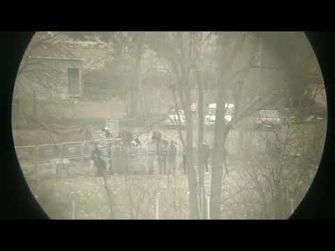

### AYS Daily Digest 04/3/20: Greece may be using ‘lethal teargas’ against migrants

Refugees shot at the Greek border / Denmark to assist in human rights violations / Police harassment in Bosnia / Escalating violence at sea

 \)](assets/fd74bb29e3fd/1*8U9ywqx2i_hrGMRaJpovGw.jpeg)

CS 560 round recovered from Turkish\-Greek border\. Source \( [@Omega\_RF](https://twitter.com/Omega_RF) \)
### Feature:

The solidarity crisis encompasses not only the people on the move, but also the people of the Greek islands, who have been completely shut out by successive European governments, as well as their own\.

For many locals on the Aegean islands the plan to build both very large and very permanent detention centres was one step too far\. There were mass, largely peaceful, protests and road blockades against the construction of such centres, but clashes with riot police brought from Athens followed\.

In Chios, the population of Vial, the only camp on the island, has been at around the 6000 mark for many months, six times it’s official capacity\. This situation was always going to come to a head at some point\.

Locals from Chalkios, the village of about 300 people beside Vial camp, have organised a road block since Sunday, 1 March, primarily in place in order to prevent the newest arrivals from being transferred to the camp, where they would normally have been registered after they arrive\. The latest arrivals are being kept in a building for the time being; they are scared and are unsure of what will happen next to them\. NGOs have been prevented from accessing the camp since the blockade was enacted\. They are allowing the food trucks through to the camp, although they did stop them early on Tuesday morning amidst some confusion\.

A small group of people on the island have taken this action many steps too far when they burned down the Chios People’s warehouse \(CPW\) in the early hours of Tuesday morning\. The warehouse had been used by many groups and individuals, local and international, to stored NFIs for those in need, that is asylum seekers and various local communities\. The overwhelming majority of the Chios community has utterly condemned this senseless act\.

A protest organised by locals in solidarity with CPW was held on the main Street of the town of Chios on Tuesday evening\. Almost all of the NGOs on the island have ceased their operations this week, as the situation remains very tense after almost 300 people arrived on Sunday, and a further 80 arrived the following days\.

Local people on the island are not the issue\. Many of them have rescued people from the sea themselves and have helped people on the move here over the years\. They have also protected them against the small anti\-refugee groups\. The issue is the total lack of care and painful indifference consistently demonstrated by Greece’s European ‘partners’, day after day\. All of the islands have been in crisis for five years\.

Over 42,000 people are stuck on the islands\. This is a humanitarian disaster and the only reason any European authorities come to the table is to discuss how to prevent any further migration into Europe\. No one is listening to any of the people on the Aegean islands\. Europe must act now, or accept it’s own immorality and intolerance for what it is, and stop hiding behind false acts of solidarity and mistruths about Europe’s inability to cater and care for refugees that are in this position, directly or indirectly as a result of the policies of European governments\.
### Greek Border

[A statement and video](http://www.ekathimerini.com/250200/article/ekathimerini/news/greek-police-repel-migrants-on-border?fbclid=IwAR3K5oh2A9O9meFM77U06uy4lERiCs0sPCXkdASIU46tqonHxk_LyVm4btg) provided by the Greek authorities appeared to show tear gas being fired by a large group of individuals dressed in what could be assumed to be police riot gear, firing tear gas towards the Turkish side of the border\. The statement provided by the Greek authorities claimed that Turkish riot police were positioned an estimated four metres from the frontier of the Evros region, firing tear gas canisters towards the ongoing clashes between Greek police and migrants and refugees seeking safe passage\.

Whilst the statement provided by the Greek authorities looks to point towards Turkey for the continued use of tear gas, this should not distract from the fact that Greek police have also been routinely firing tear gas upon refugees and migrants\.

Additionally, yesterday it was reported that Greek border guards in Pazarkule opened fire on a group of migrants and refugees attempting to cross the border\. The reports indicate that one person has sadly died and five have been wounded after being fired on with teargas, rubber bullets and live rounds\. [The head of emergency services at Edirne’s Trakya University Hospital](http://www.ekathimerini.com/250223/gallery/ekathimerini/news/clashes-erupt-on-greece-turkey-border-as-migrants-seek-entry?fbclid=IwAR1hK0xH-3raVDsktxKkbUN9Q1E0UOPdcqSK6ct1OB3dfS-W9O6KPNEgmwE) , Burak Sayhan, told journalists that on Wednesday six people were admitted to the emergency department at the hospital including one person who was pronounced dead on arrival\. Of these six, he said one person had been shot in the head, two had gunshot wounds to their lower and upper body and one had a broken nose\.

■■■■■■■■■■■■■■ 
> **[Piotr Zalewski](https://twitter.com/p_zalewski) @ Twitter Says:** 

> > Source in Pazarkule, on the Turkish border with Greece, says Greek border guards opened fire on a group of migrants and refugees attempting to cross this morning. Says a number of people are wounded, some heavily. https://t.co/91l1MeM9Cm 

> **Tweeted at [2020-03-04 09:28:50](https://twitter.com/p_zalewski/status/1235135102704906240).** 

■■■■■■■■■■■■■■ 

The Turkish Interior Minister [announced today](https://twitter.com/MovingEurope/status/1235507306626002944?s=20&fbclid=IwAR11TsTc51GV0bTHpHsOSSuSRh4u_ReoIVbHIRmmPJT74GCrlIaPr4ny-VM) that they will deploy a thousand police special forces on the border in order to prevent push backs into their territory by Greece\.

Despite the mounting evidence indicating the opposite, a statement by [Margaritis Schinas](https://www.euronews.com/2020/03/04/greece-should-respect-international-law-amid-border-crisis-says-eu?fbclid=IwAR3ajjAYlCORIYbCEm38tEUchhU0eNB9E3z8MrJ6Utiy5bp0mpezLD06re0) , Greek politician and vice\-president of the European Commission, claimed that “Everything that is done at our external borders must be done in accordance with the law”\. Even though a lacklustre statement was made, a photo published yesterday of President Ursula von der Leyen congratulating border guards further indicates the position and the complicity of the EU commission on issues of human rights violations and pushbacks at the Greek border\.

■■■■■■■■■■■■■■ 
> **[European Commission 🇪🇺](https://twitter.com/EU_Commission) @ Twitter Says:** 

> > @[vonderleyen](https://twitter.com/vonderleyen) @[eucopresident](https://twitter.com/eucopresident) @[EP_President](https://twitter.com/EP_President) @[kmitsotakis](https://twitter.com/kmitsotakis) @[AndrejPlenkovic](https://twitter.com/AndrejPlenkovic) @[MargSchinas](https://twitter.com/MargSchinas) "I thank the Greek border guards and coast guards, the police, servicemen and servicewomen and Frontex for their tireless effort." https://t.co/zRjVonTeiL 

> **Tweeted at [2020-03-03 14:43:44](https://twitter.com/eu_commission/status/1234851960064442370).** 

■■■■■■■■■■■■■■ 

[A report by Bellingcat](https://www.bellingcat.com/news/uk-and-europe/2020/03/04/greek-security-services-may-be-using-potentially-lethal-tear-gas-munitions/?fbclid=IwAR0aBSEDD43EDeNJu3NxWh3MkAeG-j5WtJbxFWJUiB1OTf6sBS1IYi-yfpA) has indicated that Greek security services may be using potentially lethal tear gas munitions against refugees\. They have claimed that images and videos coming from the region suggest that Greek authorities may be using similar tear gas rounds to those that have resulted in death and serious injury during protests in Iraq\. Unlike normal tear\-gas rounds, the extended range tear\-gas rounds that were first identified by the Omega Research Foundation as being used by the Greek authorities, are fired at far greater distances, have a pointed tip and therefore are likely to cause significantly worse injuries\. The design of these tear\-gas rounds means that a direct hit would be potentially lethal\.

 \)](assets/fd74bb29e3fd/1*z_jASJjGuNfibJeVS8-LnA.jpeg)

CS 560, №560 FEDERAL SPEDEHEAT, LONG RANGE PROJECTILE, IRRITATING AGENT Source \( [@Omega\_RF](https://twitter.com/Omega_RF) \)

 \)](assets/fd74bb29e3fd/1*8U9ywqx2i_hrGMRaJpovGw.jpeg)

CS 560 round recovered from Turkish\-Greek border\. Source \( [@Omega\_RF](https://twitter.com/Omega_RF) \)

[Refugee Info Bus](https://www.facebook.com/RefugeeInfoBus/posts/2639303342971744?d=m) provided an update of the situation on Lesvos\. They say that recent arrivals to the island were removed via a navy vessel and were reported to have been brought to mainland Greece and then further deported\. Additional reports have indicated that navy ships have been sent to Lesvos to house more than 400 of the new arrivals\.

Over the last two days, large numbers of people who live in Moria camp have been taken to the port of Mytilini to buy ferry tickets to the mainland\. These tickets have been denied and they have been forced back to Moria to further endure the desperate and inhumane conditions of the camp\.

Food lines in Moria and now reported to be over four hours long and there is no hot water\. NGOs continue to leave the island and most services are still suspended meaning that the situation will only deteriorate\.

MSF confirmed that despite having to suspend their activities for two days as tensions increased on Lesvos and around Moria, they are determined to stay on the Island and continue providing care to people trapped in these inhumane conditions\.

■■■■■■■■■■■■■■ 
> **[MSF Sea](https://twitter.com/MSF_Sea) @ Twitter Says:** 

> > 👉Once again: we are determined to stay in #Lesbos & provide care to asylum seekers trapped in inhumane conditions in #Moria. We were forced to suspend our activities for the last 2 days as tension increased but we are ready to fully resume our activities over the next few days. https://t.co/iB5OXFD3aP 

> **Tweeted at [2020-03-04 15:56:42](https://twitter.com/msf_sea/status/1235232711461265411).** 

■■■■■■■■■■■■■■ 

It has been reported that neo\-fascists from Austria and Germany arrived in Greece today\. Their leader Martin Sellner uses the “white power” hand sign, like the racist mass murderer of Christ Church\.

### Sea

The NGO AlarmPhone has [published a report](https://alarmphone.org/en/2020/03/04/escalating-violence-in-the-aegean-sea/?post_type_release_type=post&fbclid=IwAR0OA8i0zZNaJ5HCZaWeNaVELFFu8V1jmTT5AiTj2VayQZjkTPU23SuQaaY) on the escalating violence, attacks and human rights abuses being perpetrated by European coast guards since Turkey publicly announced that it will open its borders\.

Between 1–3 March 2020, AlarmPhone was alerted to 14 distress cases in the Aegean Sea\. Only three boats managed to arrive in Greece\.

The violence and human rights violations that AlarmPhone has documented in the Aegean sea include: attacks on boats by masked men who remove the boat engine, leaving people in acute distress, shootings at boats and people, push and pull\-back operations, and other attacks intended to sink migrant boats\. AlarmPhone affirms that repeatedly, Frontex and Greek coastguards have been simply observing boats in distress, refusing to intervene for several hours\. The refusal to intervene and help distressed migrant boats has lead to the unfortunate death of a child who drowned off the island of Lesvos on Monday\.

> We were alerted by another boat in distress off the coast of Lesvos, carrying 35 people, including 11 children\. At 11:57 am, we forwarded their distress to the Greek Coast Guard and shared the following GPS location: N39\.23°, E26\.55° \(at 11:50 am\) \. The people were urgently asking for help\. As in previous cases, the people reported that their engine and their petrol had been stolen in an attack at sea\. Spotters on the shore on Lesvos documented the presence of at least two different boats nearby: one Greek Coast Guard vessel and one Italian Frontex vessel\. Again, instead of rescuing the people in distress they were just circling around them\. The people told us: “They are only making waves\! We are very afraid\! Now they are driving away from us\. Please help, we need help\.” At 2:52 pm , the people informed us that water was coming into the boat\. They said that everything was wet and they were scared to be forced to spend the night at sea\. We witnessed another case of non\-assistance while the world was watching\! Even though we regularly updated the coast guards with updated positions of the boat in distress \(last update at 7:00 pm CET: N39\.23°, E26\.49°\), they remained inactive\. Again, people started rowing with their bare hands in order to reach land\. At 9:48 pm, only after we informed the authorities in Mytilene that the boat had a hole and that the people were in immediate danger of drowning, they confirmed that they were conducting a rescue\. The people in distress had waited for over 12 hours before being rescued\. Letting them wait so long at risk of drowning was torturous\. 

### **Denmark**

[Denmark announced](https://www.thelocal.dk/20200304/pm-says-denmark-ready-to-help-greece-stem-refugee-arrivals?fbclid=IwAR2eLvFT-LZrVa7Rr6FgNRd5LfgwhAxvT_LrFQFW--Xs0cSP8XG4jJvSxzk) yesterday that Prime Minister Mette Frederiksen has contacted her counterparts in Greece and Bulgaria, offering them ‘assistance’ in preventing the arrival of migrants and refugees from Turkey\. Prime Minister Frederiksen said that she was concerned about the potential increase in refugees and migrants arrivals in the EU as a result of the ‘Turkish decision’ but was noticeably silent on the continued violations of human rights, due process and access to asylum\. Denmark’s foreign ministers added that “Protection of the EU’s outer border is an important priority for the government\. That’s why we have reacted quickly and reached out to both Greece and Bulgaria,”\.

Many international observers viewed the announcement by Denmark to offer one of its surveillance aircraft to Frontex, an agency that is already facing allegations of helping to facilitate illegal pushbacks, as an indication of a wider EU policy of complicity towards the violence being directed towards people fleeing war\-torn countries such as Syria\.

Its also been reported that Jimmie Åkesson, leader of the far\-right Sweden democrats has been identified as personally handing out leaflets on the Turkish\-greek border saying: “Sweden is full\. Don’t come to us\! We can’t give you more money or provide any housing\. Sorry about this message\. Swedish people, Sweden Democrats’\.

■■■■■■■■■■■■■■ 
> **[NoBorders](https://twitter.com/Refugees_Gr) @ Twitter Says:** 

> > Leader of far-right Sweden Democrats Jimmie Åkesson, personally handing out leaflets to refugees at Turkish-Greek border saying:
”Sweden is full. Don't come to us! We can't give you more money or provide any housing. Sorry about this message.
Swedish People, 
Sweden Democrats.”

> **Tweeted at [2020-03-04 18:23:53](https://twitter.com/refugees_gr/status/1235269752366542852).** 

■■■■■■■■■■■■■■ 

### EU

In addition to the new announcement by Denmark to provide physical assistance, other EU member states have also announced their support for Greece and Bulgaria including Austria, Hungary, France and EU Commission President Ursula von der Leyen\. Late Wednesday night the German government took to twitter to announce, in multiple languages, that Europe’s borders were not open and neither was Germany’s\.

■■■■■■■■■■■■■■ 
> **[Steve Alter](https://twitter.com/BMISprecher) @ Twitter Says:** 

> > The German Federal Minister of the Interior: "We need orderly conditions at the EU's external border. We will use our best efforts to support Greece in achieving this. Europe’s borders are not open for #refugees from #Turkey, and neither are our German borders." #migration 

> **Tweeted at [2020-03-03 18:38:57](https://twitter.com/bmisprecher/status/1234911154306240516).** 

■■■■■■■■■■■■■■ 

### Slovenia

[Border police in the Slovenian](https://www.rtvslo.si/crna-kronika/v-dobovi-resili-30-prebeznikov-zakopanih-v-glino-tudi-otroke-in-nosecnico/516197?fbclid=IwAR0OItm-jHZYTYx5zE4_jT29J8mBA-PCl-R8cps5sxpiJmgfvMT3YfJXHVU) town of Dobova found 30 migrants trapped in clay that was being transported from Serbia by train\. They hoped to avoid border checks if they hid in the clay, but the once\-wet surface dried and hardened, and they weren’t able to dig their way out of it anymore\. Luckily they were discovered at the border, because they were running out of oxygen and, according to a police statement, were in a life\-threatening situation\. Among 30 people from Syria, Iran, Iraq and Afghanistan, there were 12 children and one very pregnant woman\. Rescue dogs were used to find and save all people from the group\. After being dug out from the clay, three people ended up in a hospital\.
### Serbia

[Humanitarian NGO No Name Kitchen](https://www.facebook.com/NoNameKitchenBelgrade/) who is currently present in Šid has announced that since Saturday in addition to the regular local police, special police forces are also now present in the region\.

The chief of Serbia’s police justified the decision to deploy special police forces to the small town of Šid because of previous burglaries that were allegedly carried out by people on the move\. The presence of the special police force in Šid means that the refugees and migrants will likely face even greater repression than before\.
### Bosnia

[No Name Kitchen also reported](https://www.facebook.com/NoNameKitchenBelgrade/?__tn__=kC-R&eid=ARBfvftjrwz83r2NBmjEc9uhBeaMQbSngbiuKbkficGi4e8jUSsgk6-KTLouNnfWPbXwADWQrQ5eM07-&hc_ref=ART2q7evCJiXezDHixlBSFXpD2xZ6Z56hi9G-nxaOq5whB5QibR4ASS1fu69UKTtQEM&fref=nf) that in Velika Kladusa their volunteers have faced ongoing police harassment for the last 12 days making it far more difficult to carry out their work and distribute food and humanitarian aid to vulnerable people enduring the terrible weather conditions in Bosnia\.

> NNK report that ‘We were asked to show our ID around the corners, we were followed by civil cars, we were secretly photographed and we were questioned in police stations, streets and government offices’ 

Despite the continued harassment of their volunteers, they were still able to hand out clothes and food more than 2800 times\. Despite the police pressure they distributed 890 meals to people living in the streets, around the refugee camp in Miral or in tents, and 1108 more to people dwelling in squats or shelters and assisted eight people in transit with medical care through their If You Do Mind programme\.

**Find daily updates and special reports on our [Medium page](https://medium.com/are-you-syrious) \.**

**If you wish to contribute, either by writing a report or a story, or by joining the info gathering team, please let us know\.**

**We strive to echo correct news from the ground through collaboration and fairness\. Every effort has been made to credit organisations and individuals with regard to the supply of information, video, and photo material \(in cases where the source wanted to be accredited\) \. Please notify us regarding corrections\.**

**If there’s anything you want to share or comment, contact us through Facebook, Twitter or write to: areyousyrious@gmail\.com**

_Converted [Medium Post](https://medium.com/are-you-syrious/ays-daily-digest-05-3-20-greece-may-be-using-lethal-teargas-against-migrants-fd74bb29e3fd) by [ZMediumToMarkdown](https://github.com/ZhgChgLi/ZMediumToMarkdown)._
