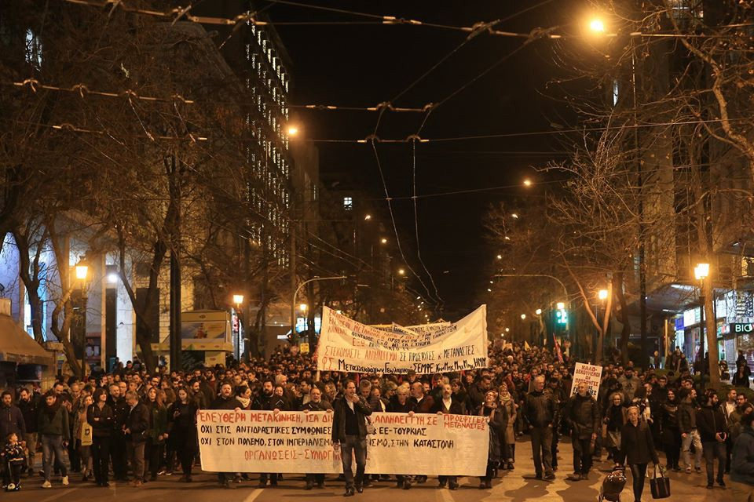
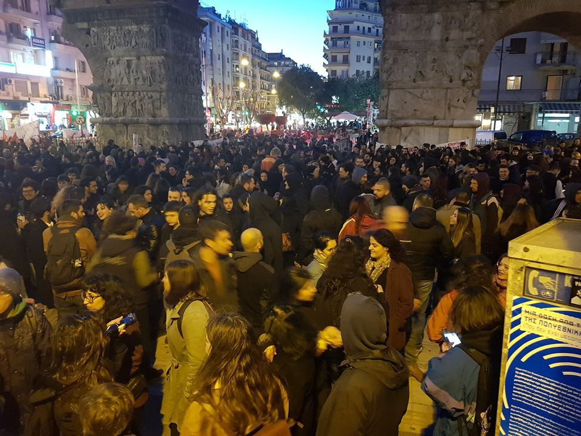

### AYS Daily Digest 05/3/20: Racism and Solidarity in Greece
#### Updates on the current situation in Greece // death toll in Mediterranean reaches 20\.000 since 2014 // European cities open for integration of more refugees from Greece, but governments still blocking // Swedish right wing party member in Greece

by Mir Suhail, political cartonist from Kashmir\. The picture shows Greece represented by the mythological figure of Medusa as she is welcoming syrian refugees with arms\.
### FEATURE: UPDATES FROM GREECE
#### Racists on the Rise and demonstrations for Solidarity with Refugees

A whole series of racists acts against refugees and attacks against activists and journalists happened yesterday all over Greece\. At the same time, also all over the country, thousands of people demonstrated for Human Rights and Solidarity with Refugees\. 
In Volos in Central Greece, a Facebook group has been created named “Association of hunters of illegal migrants”\. It later changed its name to “Association of Volos Patriots”, apparently after legal measures have been taken\. In the closed group, pictures of weapons like guns and knives have been posted, together with gun licenses\. Hateful posts circulated, together with incitements to hunt down refugees\. The group organized a meeting just one hour before a solidarity march in Volos in order to structure itself for action and to plan a trip to Evros River at the border to support the border guards with their manpower and weaponry\. The group is a closed group and can only be joined through invitation\. 
The crew of Sea Watch’s Boat **Mare Liberum** has again been attacked by a mob when the ship tried to enter Mytilene’s port in order to resupply\. Some days ago the ship has been attacked at their usual port south of Mytilene\. People tried to pour gasoline on the ship and insulted and threatened the crew\. After this incident, the ship stayed in open waters in order to stay safe\. Some team members of No Border Kitchen Lesvos were present at yesterday’s attack and tried to support the crew\. On their Facebook channel they give an account of the events:

> “As soon as they sailed into the port of Mytillini, a group of bigots gathered to threaten the ship and its crew\. Under chants of “go home\!” and “go to turkey\! the crew of the vessel had complete their tasks\. Some of us positioned ourselves in between the ship and the mob, to support our friends and make sure they where not attacked\. \[…\]” 

See: Facebook No Border Kitchen Lesvos

On Chios a warehouse has been closed after threats to burn it down\. Residents reported to the police that a man on a motorcycle without licence plates and with a white helmet threatened to set fire to the warehouse, which is located in a densely populated area\. In order not to endanger the residents the FEOX warehouse was closed subsequently\. Just at the beginning of the week another warehouse of NGO’s on Chios burned down\.

But Fascism and Racism is not at all a matter of Greece alone\. All over Europe fascists and racists organized themselves under hashtags like \#neveragain2015 in the last days\. This hashtag’s name alone shows the deep inhuman ideology\. The key figure of the extreme right group “identitarian movement” Martin Sellner is currently in Greece to shows his support the Greek Border Guards\. His accounts read like reports from high risk regions\. Unfortunately he forgets to mention that it is him and his comrades who do make Greece a high risk region these days for refugees and their supporters\. 
And the Austrian Sellner is not alone\. Jimmie Åkesson, leader of the right wing party Sweden Democrats visited the Greek border and handed out flyers stating “Sweden is full”\(see also News on Sweden, below\) \.
But amidst all this dramatic events Greek people show that the majority of them supports the rights of refugees and stands in solidarity with them\. All over the country demonstrations have been held yesterday in order to show solidarity\. About 7000 people joined the peaceful protest in Athens\.

Demonstration in Athens, copyright Marios Lolos

Demonstration in Thessaloniki, copyright No Border Network

In this article carious videos of the demonstration can be found:

On the border between Greece and Turkey, tear gas and water cannons have been used by greek authorities in order to hold back refugees from entering the country\. Turkey in turn brought some 1,000 police officers to the border to, as they claim, prevent Greece from pushbacks\.

Legal Center Lesvos gives a very useful legal account of the current situation for refugees in Greece on its Facebook page\.

The European Centre for Press and Media Freedome published a joint Statement in which it calls for the EU and its member states to create a safe environment for journalists reporting on the humanitarian situation in Greece\.

Find the text [here](https://www.ecpmf.eu/the-eu-and-member-states-must-create-safe-environment-for-journalists-reporting-on-the-humanitarian-situation-in-greece/?fbclid=IwAR2KUrQog1kcDRy5BB9S9I1ZuA9GANeuyoXet634GmKc5Z1iv8VUqrWz5OE) \.
### SEA

■■■■■■■■■■■■■■ 
> **[MSF Sea](https://twitter.com/MSF_Sea) @ Twitter Says:** 

> > The death toll in the #Mediterranean sea reaches 20,000 since 2014.

Yet another grim milestone for #EU migration policy in a week marked by violence against #refugees &amp; violent pushbacks in #Greece. 

> **Tweeted at [2020-03-05 17:50:53](https://twitter.com/msf_sea/status/1235623836034437122).** 

■■■■■■■■■■■■■■ 

### GERMANY

The German Parliament rejected a proposal made by the Green Party to take in 5000 most vulnerable refugees from Greece\. The Green Party had proposed to take in pregnant women, single traveling women and unaccompanied minors\. The parties that opposed the proposal stated once again that a European solution must be found for the situation of refugees in Greece\. Germany is willing to take in unaccompanied minors only if more EU\-member states do the same\. This is the same mantra that we hear for many years now\. Until now only Luxembourg, France and Finland expressed their will to take in some of the children\. Following the rejection of the proposal in the German parliament, seven mayors of German cities made a plea to the Government to get the allowance to accept minors in\. All in all 140 German cities have declared themselves as “Safe Havens”, expressing their will to accept refugees\. 
A good article on what Germany could do in the current situation and on what it is actually doing can be found here:

### NETHERLANDS

As in Germany, also in the Netherlands cities express their will to accept refugee children\. The city council of Amsterdam and the Mayor of Leiden issued such statements\.

> “Leiden has always been a city of refugees, I am confident that we can take good care of these children,” says Mayor Lenferink 

See [here](https://joop.bnnvara.nl/nieuws/amsterdamse-raad-wil-vluchtelingenkinderen-lesbos-opvangen?fbclid=IwAR1T2Z9vhCsZTYYacRGEy2PQ5ye0FU_oMABUKDE75UQKtOqjWe6U43lT3Jc) \.
### SWEDEN

Jimmie Åkesson, leader of the right wing party Sweden Democrats visited the Greek border and handed out flyers stating “Sweden is full”\. Leaders from some other parties in the Swedish parliament have condemned Åkessons actions, saying that it was a cowardly move to make\.

The lawyer Behrang Eslami reacted on Åkessons visit to the border area and reported him to the police for spreading misleading and/or untrue information — “osant intygande” in Swedish\. The flyers Jimmie Åkesson handed out at the Greek\-Turkish border, which claims that Sweden already is full, was signed with “the Swedish people and the Sweden Democrats”\. Eslami told the newspaper Aftonbladet that Åkessons flyers do not represent him — nor all the people in Sweden\.

According to Åkessons lawyer his client did nothing wrong — since handing out flyers isn’t illegal\. The preliminary investigating officer responsible for the police report on the other hand said that Åkesson may be guilty of the crime incitement/agitation against ethnic group \(in Swedish: hets mot folkgrupp\) \. The Sweden Democrats is the biggest party in Sweden now, according to the latest poll\.

In reaction to Åkessons act a Facebook group has been created on Wednesday with currently close to 75\.000 members named “SD representerar inte mig\!” \(SD does not represent me\! \)
For today, 6th of March, a demonstration is planned in Stockholm to stand up for Asylum Rights\.

\(See on Facebook: Stå upp för asylrätten\! \)

**Find daily updates and special reports on our [Medium page](https://medium.com/are-you-syrious) \.**

**If you wish to contribute, either by writing a report or a story, or by joining the info gathering team, please let us know\.**

**We strive to echo correct news from the ground through collaboration and fairness\. Every effort has been made to credit organisations and individuals with regard to the supply of information, video, and photo material \(in cases where the source wanted to be accredited\) \. Please notify us regarding corrections\.**

**If there’s anything you want to share or comment, contact us through Facebook, Twitter or write to: areyousyrious@gmail\.com**

_Converted [Medium Post](https://medium.com/are-you-syrious/ays-daily-digest-05-3-20-racism-and-solidarity-in-greece-d182da227031) by [ZMediumToMarkdown](https://github.com/ZhgChgLi/ZMediumToMarkdown)._
