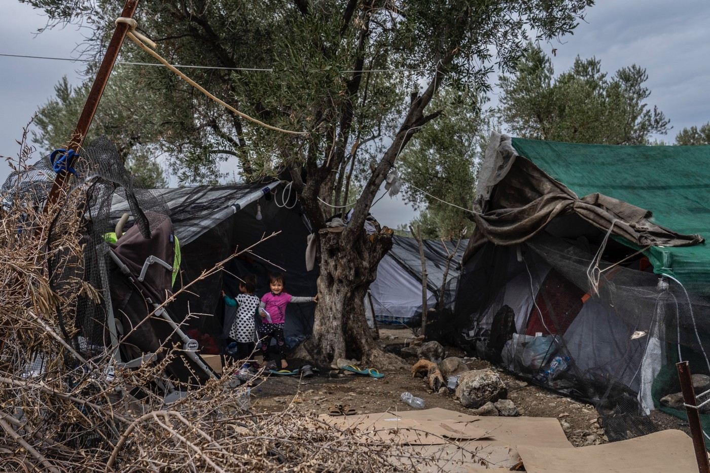
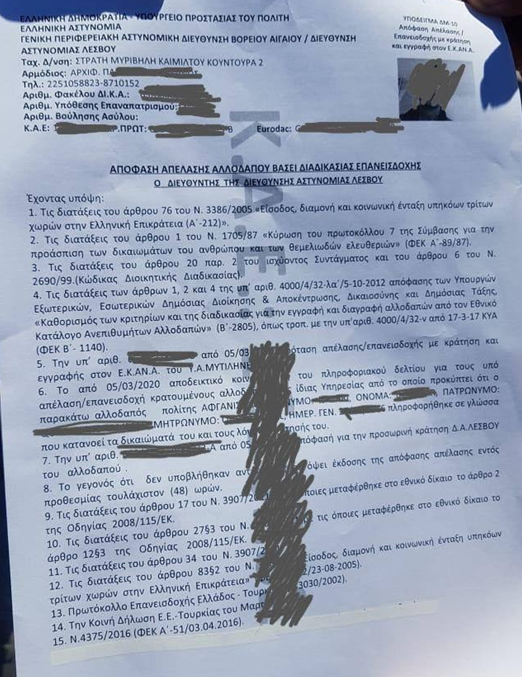
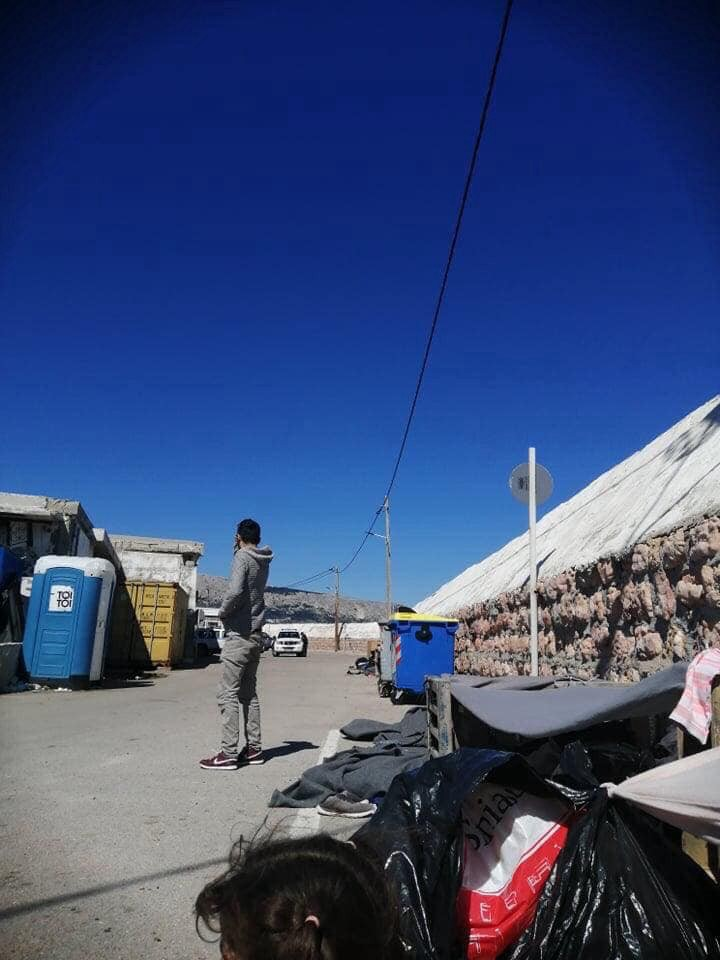

### AYS Daily Digest 13/03/20: People removed from Greek islands without a chance to seek asylum

[Are You Syrious?](@AreYouSyrious?source=post_page-----93d1ea05091----------------------)

[Mar 14](ays-daily-digest-13-03-20-people-removed-from-greek-islands-without-a-chance-to-seek-asylum-93d1ea05091?source=post_page-----93d1ea05091----------------------) · 10 min read

Growing Concerns about the Spread of Coronavirus // Illegal Returns in Greece // The Criminalization of Giving Assistance to People on the Move in Bosnia // Disastrous Conditions for Deported Afghans // & More

### FEATURE:
### Refugees on Lesvos asked to sign documents in Greek, leading to their “voluntary returns”

Greek authorities on Lesvos seem to be returning people on the move to Turkey by having them sign their own voluntary return documents\. It seems Greek authorities are giving Afghans, and others being kept in navy boats in the port of Lesvos, documents like the one in the photo below which outlines their “consent” to legal expulsion\.

Sources from Brussels tell AYS that people on the move are being asked to sign these documents, despite the fact that they do not understand what it says and no one explains what impact it will have on them\.

> _“The document makes reference to several provisions of Greek and EU law, as well as the EU\-Turkey Statement, but makes no reference to the Presidential Decree in which the access to asylum procedures was suspended for one month”, AYS was told\._ 

Under section 6, it clearly states that by signing this document, the person has been informed, in a language s/he understands, of their rights and the reasons of their detention\. Section 8 states that the person has not appealed the return decision within the 48 hour deadline\.

There are serious concerns among people on the ground that detained refugees were **NOT** informed of anything regarding their detention, expulsion or of their ability to appeal the decision\. It appears they are not even informed about what this specific document states\. Sources say they are sure that the detained people concerned have not been given _any_ actual means to appeal their return decision\.

Even though it may seem obvious, it is worth repeating that suspending access to asylum and collectively returning people back to Turkey is in flagrant violation of several EU laws, the Geneva Convention and of the fundamental rights all EU Member States are obliged to protect\. Moreover, Commissioner Johansson has said several times that the right to asylum shall be respected at _all times_ and for all cases\. Yet, these actions continue occurring in the face of EU principles, laws and norms\.

Following the departure of the military boat carrying 500 rejected people from Lesvos, we were unofficially told they would probably be moved to closed facilities in the northern part of Greece, possibly in a new migrant detention centre being established in the region of Serres, in the nearest proximity to the Bulgarian border\.

FEATURE II:

Mayor of Tuzla \(Bosnia and Herzegovina\) prohibits assistance to people on the move

Conditions are worsening in Tuzla after the Mayor declared the prohibition of assistance to people on the move\.

After the recent dismantling of the provisional campsite at the bus station in Tuzla, the repressive local government continues to avoid finding a proper solution to the situation, while simultaneously preventing organizations from helping the people stranded in the town\. Earlier this week, there were around 100 people in different accommodation facilities and on Friday approximately 300 new people arrived\. There is a fear of helping or providing assistance to those in need across Tuzla, as the Mayor and the local government have prohibited any help, officially because of Coronavirus concerns\.

However, as previously reported, many question the legitimacy of these concerns, as the prohibition focuses mostly on prohibiting food or non\-food item distribution to newly arrived people, while allowing other activities to carry on\. Mirko Bakramović, the Director of the Association of the Country of Children Tuzla, posted an open letter on Facebook pleading with the local authorities to reconsider the basis of an order prohibiting the distribution of food and water\.

Discussing the order, Bakramović said,

_“Despite the concerns over Covid\-19, international and domestic protection rules for children on the move should still be upheld and followed in Tuzla\.”_

All authority for providing aid and assistance has now been handed over to the Red Cross\. They will continue providing a lunch package and some basic first aid: wraps for existing wounds, bandages and some painkillers, but without any referrals to the hospital once a day to the people gathered in the city\. However, there is some concern about the quality of the staff as there have been reports that Red Cross members discuss people on the move, the people they are there to support, in disparaging, hateful terms\. In Tuzla, there is no accommodation, no hot food distribution, and no local assistance\. Additionally, the mobile charging station has been removed\. Now vulnerable people are left on their own for each and every need they might have, without any information, assistance or even basic kindness\.

TURKEY

Closure of the Edirne camp?

AYS volunteers on the ground in Edirne say that the border camp has reportedly been closed since 12 am, Friday\.

Earlier that day, there were reports of new arrivals as well as a group of people on the move being held 60 km outside of Edirne\. Sources believe that it was a group being pushed back from the border\.

GREECE

Frontex presence surges at Evros border

In the past few days, hundreds of police officers from across Europe have been sent to the Greek region of [Evros](https://greece.greekreporter.com/2020/03/13/former-speaker-of-the-house-filippos-petsalnikos-dies-at-70/) , next to the Greek\-Turkish border, in order to “secure” the Union’s external border\. Men and women from Poland, Austria, Germany, Estonia, and many other EU member states, along with huge amounts of special equipment and vehicles, have been deployed to the land border with Turkey\.

_“The presence underlines the fact that the protection of the European area of freedom, security and justice is a shared responsibility of all Member States and Frontex\.”_

On Friday these forces were _officially_ fully deployed and are now in full operation\.

Meanwhile, the islands are still completely overwhelmed, and boats continue arriving\.

In response to the impending arrival of Coronavirus, aid agencies are scrambling to prepare as best as they can in what seems to be a hopeless situation\. The island camps provide the perfect breeding ground for the Coronavirus with no soap, little water, minimal toilets and thousands of people crammed together in less than hygienic conditions\.

_“Families of five or six have to sleep in spaces of no more than three square meters \[32 square feet\] \. This means that recommended measures such as frequent hand washing and social distancing to prevent the spread of the virus are just impossible\.”_

While aid agencies are doing the best they can to prepare and sensitize the community, awareness does little if clean water cannot be found\.

In Chios, the situation is appalling as new arrivals are housed out in the open\. In these conditions, it seems there are 2 toilets for every 250 people\. The toilets are never cleaned and dirty water from the toilet is running all over the place\. There are sick people among them who are also forced to sleep in the street\. Children and women may sleep in vans, but the men are all outside, exposed to rain, wind and sun\.

Volunteers are not allowed to help or approach\. It seems these people may be transferred to a closed deportation center on the mainland on Wednesday\.

In the Amygdaleza detention center, a police officer tested positive for the coronavirus, becoming the first confirmed case in Antynomia\. Apparently, the officer traveled to Vienna several days ago and returned showing symptoms\. While she does not work directly in the detention centers, there were refugees in her office and fears are growing that some may have contracted the virus\.

In wake of the growing concerns over coronavirus, the police officers’ union of the Aegean and Dodecanese islands called for the responsible ministers to decongest the islands and for increased attention to human rights as well as public health\. In a letter to the ministers, the union expressed their opinion that a lack of understanding about the seriousness of the situation prevails and will only bring more damage in the long term\.

On the islands, many schools and activities run by NGOs are temporarily closing as a preventative measure against Coronavirus\. On Samos, Alpha Centre is one of the latest to close down as well\.

In the Exarcheia neighborhood of Athens, a refugee was beaten and arrested on Friday night\. Below is a video account of the event\.

SYRIA

WHO shares fears over COVID\-19 in Syria, no cases confirmed yet

In addition to ongoing fighting and displacement, civilians in Syria are now at risk of contracting COVID\-19, and aid agencies say the country isn’t prepared for it\.

_“The reality is that after nine years of conflict, the health system and infrastructure that would be vital in combating any public health emergency have been decimated\.”_

So far, no cases of COVID\-19 have been reported in Syria, yet they have been confirmed in all five countries neighboring Syria, including Turkey and Lebanon\. The government says there’s no Coronavirus in the country — a claim that even pro\-regime commentators view as suspicious\. The World Health Organization said it considers the risk of a Coronavirus outbreak to be _“very high, particularly in densely populated areas and areas of active hostilities such as in northwest Syria\.”_

Aid workers view its arrival in the displaced person camps not as a matter of if, but when\.

DENMARK

Populists using coronavirus to re\-demand restriction of movement and a total stop of new asylums

Denmark announced on Friday it would shut its borders to most foreign visitors for a month starting on Saturday\. The restrictions will come into force at 12 pm \(1100 GMT\) on Saturday and continue until at least April 13\.

_“All tourists, all travel, all vacations, and all foreigners who cannot demonstrate a credible reason to enter Denmark will be denied entrance at the Danish border\.”_

Danish citizens and foreigners working in Denmark will still be free to enter and leave the country\.

In the midst of these new travel restrictions, the populist Danish People’s Party \(Dansk Folkeparti\) is exploiting the situation to re\-demand a total stop for asylums as well as restrictions for the existing asylum centers as a means of “limiting the spreading of the virus\.”

ITALY

Migrant farm workers at risk of epidemic

_“Contagion within the informal camps would be impossible to manage\.”_

In Italy, concerns are growing about the spread of Coronavirus in the tented communities of migrant farm workers\. A total of 440 migrant farm workers are currently living in tents and containers spread across a one\-hectare area of land in the town of San Ferdinando in the province of Reggio Calabria in the Italian south\. In response to growing concerns the Mayor, Andrea Tripodi, has called for increased aid in the area stating that:

_“Hygiene standards aren’t those of the western world”_

The volunteer associations working in this area are also alarmed\. They say the population of about 1,000 people, mostly men between the ages of 20 and 45 years old, are at high risk\. The NGOs are therefore calling for more tents to better distribute the farm workers; more restrooms, and that the restrooms be disinfected twice a day\.

GERMANY, SWEDEN

Afghans fear deportation amid new instabilities in the country

An unconfirmed number of Afghan asylum seekers were deported from Germany to Afghanistan on Friday and are set to arrive on Saturday morning\. This is happening in the midst of continued political instability, insecurity, and humanitarian crises\.

On 9th of March, both the opponents running for president, Ashraf Ghani and Abdullah Abdullah, held a dual ceremony declaring themselves winner of the election\. On the 11th, Ashraf Ghani also ordered the release of 1500 Taliban fighters\. Since then, the level of anxiety among Afghans has risen considerably and people are concerned about the start of another civil war\. In this situation, those being deported from countries like Sweden, Germany and other European states are terrified and face extreme vulnerability and isolation upon arrival\. Many don’t have family, relatives or someone they can count on during these times of crisis\. Fleeing again would be impossible as they have no money or resources to protect themselves\.

All this political unrest comes amid rising concerns about the threat of Coronavirus\. The border between Afghanistan and Iran is still open and thousands have returned over the past couple of weeks\. This includes those who returned on their own as well as those who were forcibly deported\.

Doctors and experts say the only way of lowering the risk of infection is to keep good hygiene and stay away from crowded areas\. Unfortunately, this is impossible for those being deported as they often have nowhere to go and are forced to live in crowded conditions in under\-served areas with thousands of other displaced persons\.

**Find daily updates and special reports on our [Medium page](https://medium.com/are-you-syrious) \.**

**If you wish to contribute, either by writing a report or a story, or by joining the info gathering team, please let us know\.**

**We strive to echo correct news from the ground through collaboration and fairness\. Every effort has been made to credit organisations and individuals with regard to the supply of information, video, and photo material \(in cases where the source wanted to be accredited\) \. Please notify us regarding corrections\.**

**If there’s anything you want to share or comment, contact us through Facebook, Twitter or write to: areyousyrious@gmail\.com**

_Converted [Medium Post](https://medium.com/are-you-syrious/ays-daily-digest-13-03-20-people-removed-from-greek-islands-without-a-chance-to-seek-asylum-4fae47cfd0c4) by [ZMediumToMarkdown](https://github.com/ZhgChgLi/ZMediumToMarkdown)._
