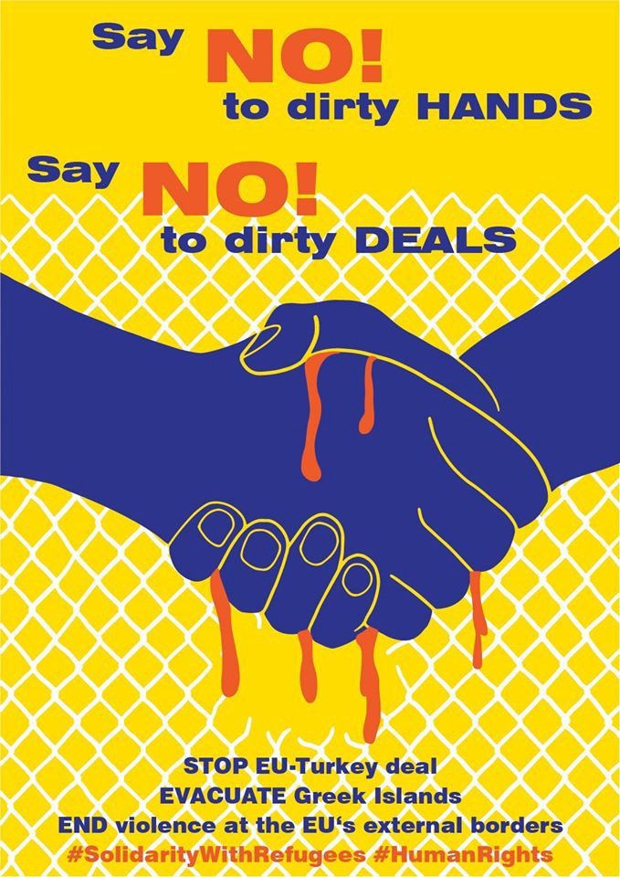
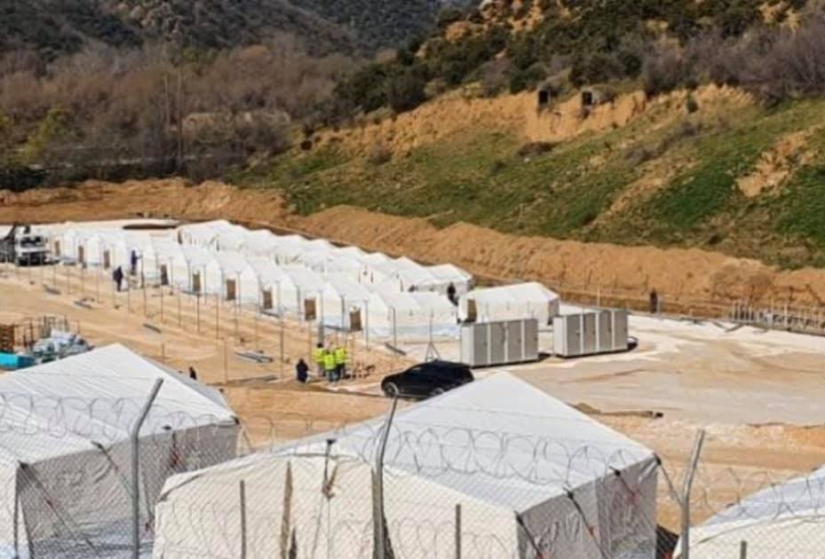
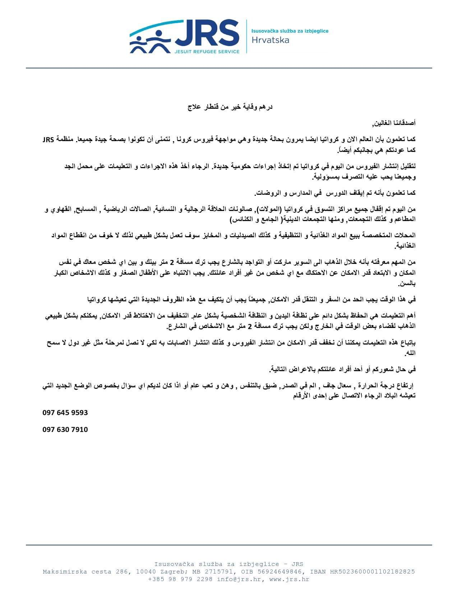

### AYS Daily Digest 18/3/20: Protecting human lives demands major concrete humane steps, not imprisonment
#### Covid\-19 state measures ignore the realities of tens of thousands of people / More information on the current situation in different countries, measures taken, warnings and available teams on site

 ‎\)](assets/2ddd7b3189dd/1*FCNiF8VYaxlk6F7BVy8zbg.jpeg)

Chios\. Today\. Tents in which some of the people are staying\. \(Photo: [Jenny Zinovia Kali](https://www.facebook.com/jenny.kali.1?fref=gs&__tn__=%2Cd%2AF%2AF-R&eid=ARBHsIY4valLup899ZGd4yx1gaK1gtccbdggXBks7hDdejdUbQgwLYsU_cg_hXyoCZ6bbLnlH6yAK2W1&tn-str=%2AF&dti=1508309029486384&hc_location=group_dialog) ‎\)

> The coronavirus outbreak threatens to inflict carnage on refugees around the world who often live in cramped conditions, lack access to clean water and are in countries with failing or stretched medical systems\. 

#### FEATURED

4 years ago today, the EU\-Turkey Statement was signed — an act which has been deadly for the people on the move, toxic for the rule of law, and a damning manifestation of Europe’s border priorities, as a member of the Legal Center Lesbos put it\. The deal used fear as a tool, building and boosting racism and xenophobia, creating a zone where **human rights do not apply** and gave money and influence to Turkey\.

> **41,500** people today find themselves stacked in informal shelters inside, outside and around the five reception and identification centres on the Aegean islands\. 

Far\-right groups supported by neo\-Nazis from the rest of Europe took over control following the Turkish border manipulation with people and the violence from both sides that followed\. The neo\-Nazis have [beat and terrorized citizens, those supporting refugees and NGO staff](https://rsaegean.org/en/timeline-of-attacks-against-solidarity/) \.

“On European territory, the Statement transformed Greece’s Aegean islands into open\-air detention centres\. Human rights concerns, immediately voiced by a range of non\-governmental organisations, were ignored in the pursuit of the containment of migrants and the acceleration of return\. The ensuing abuses — which, as foreseen, are now the well\-documented daily reality — are instrumentalised to deter those who may wish to reach the EU,” as Legal Centre Lesbos reminds us\.

> Europe has left us alone, and is watching as the rights of these refugees are violated, as they are made enemies\. And in doing so, Europe accepts that our society here in Greece but also in other European countries is being radicalized through xenophobia and racism — _Efi Latsoudi, Refugee Support Aegean_ 

[](https://l.facebook.com/l.php?u=http%3A%2F%2Fkritnet.org%2F2020%2Frefugees-welcome-dont-shoot%2F%3Ffrom%3Dpublikationen%26fbclid%3DIwAR2r2JEty4tpBunbxQgUR7qaHCASMyWmnryonCDFjeMCfU7T_a8L7297iQg&h=AT0sx0-6eLHAw6x4e14SOMtwMbvcHPD4nMZUZTCmMq9ykj8wHQtUQfH3pRG81Dgj06dZPtcVtjqLTb_mL6YW_zVvL412H-gJKedUDPEK9oRli2ERExzPjIKiIgM1FfgX8n7Rokdr6OKeXDIAT3vI0ul-RC2VpvNtk8fm6AviF6WQrvi19DQoHqLtIAuSy5iPQJd4Vi2kSLZHKbiHBpWgRsQs6fyrguGSPiESwtp3MX4ivBxPr9VauqlNgzaXgiH1cCYiUJssyKd5zi1lQ3j4jO6VeHJ1qgJit95PxqSiqWJbNXKmCQEwlyq0XF02Cpb8OjA6mvPrMSKKUpEY-hWneHx_Xt0hMQU3bjdUTmdTBAZxrGd9mWvElYPsYXeZ7tHuE74qPNmfbZ5xwHcSx3h-RAVvr6038K0XOlNw04JaH5R13RkA5hedI_im7FhKMcZpfN9ww9SwJUypwMSPhIal2Ij_enXb9EfGMwivspR9e9C4Wc4uhmQ4sq9R0CvWk5gYtycm2Kkw_En2qDNz5tIr_gJAZWqO9c_TAXpJ9Q1kXUITTLc5sGLC2MK2HX0w7LsOWATTf9eND09jr1Odkry0geNlFjuZXbj35G1T_yX5GI84jIymk6QX5krsataGy-_9RQF5HA)

> The Covid\-19 pandemic may bring exceptionally unpredictable consequences and lead to uncontrolled situations for the health of the thousands of people crammed in these unacceptable conditions\. 

Fencing and restrictions on the movement of the people living in the hotspots in order to manage the spread of Covid\-19 is a dangerous measure\. 
In an address to the public during the pandemic, some of the doctors compared the irresponsible walking around and staying in close proximity to other people and not respecting the safety measures to carrying a gun and potentially killing people\. Does that imply that the EU states are intentionally about to kill the weakest among the population fleeing their homes in search of international protection?

> Where are the international monitoring missions now to witness the injustice and further endangering of humans whose freedom of movement and deciding had already been taken away from them? 

Reportedly, these are some of the measures that will affect the people in camps: Only one person per family would be allowed to enter towns once per day, transportation to town would only be offered every hour from 7 am to 7 pm, camps will be fenced off or closed to free entrance, including Moria\.

■■■■■■■■■■■■■■ 
> **[Manos Moschopoulos](https://twitter.com/maledictus) @ Twitter Says:** 

> > The camp in Moria didn't have enough space to build a leisure room, let alone the medical facilities needed to treat people in the event of a virus outbreak. The focus should be on strengthening the island's healthcare system as a whole. As it should have been for years now. 4/ 

> **Tweeted at [2020-03-18 08:38:12](https://twitter.com/maledictus/status/1240195787256102912).** 

■■■■■■■■■■■■■■ 

> The [right to health provides](https://www.refworld.org/pdfid/4538838d0.pdf) that health facilities, goods, and services should be: 

> available in sufficient quantity, 

> accessible to everyone without discrimination, and affordable for all, even marginalized groups; 

> acceptable, meaning respectful of medical ethics and culturally appropriate; and 

> scientifically and medically appropriate and of good quality\. 

■■■■■■■■■■■■■■ 
> **[Elpida #ShutDownAllCamps](https://twitter.com/Elpida_Amal) @ Twitter Says:** 

> > @[xoriskanape](https://twitter.com/xoriskanape) @[SEENOTRETTUNG](https://twitter.com/SEENOTRETTUNG) The problems start with #washyourhands without water:
[twitter.com/RaphaelKnippin…](https://twitter.com/RaphaelKnipping/status/1240369341016748036?s=20) 

> **Tweeted at [2020-03-19 09:16:00](https://twitter.com/elpida_hoffnung/status/1240567690319798274).** 

■■■■■■■■■■■■■■ 

Germany has now put on hold the pact with Turkey and “will no longer accept refugees from any country”, as the EU effectively shuts its borders to non\-EU citizens to curb the spread of coronavirus, the interior ministry announced on Wednesday\.

Many European countries have introduced states of emergency in order to deal with the COVID\-19 coronavirus pandemic\. In many countries this has affected migrant, asylum and refugee services too\.

On [this link](https://www.infomigrants.net/en/post/23524/which-migrant-services-in-europe-are-suspended-or-reduced-due-to-covid-19?fbclid=IwAR1RidM6xMWINWlFNLYXI5NrccEaT8iJ0fSWe1tco_XSWw-E8lm1qBicqyc) you can find listed changes for Greece, Italy, Germany and France\.

For those still working on the front lines, CHEERing has produced a set of slides of realistic basic information for people in transit about the Coronavirus situation\. The organisation is run by public health professionals\.
Here is the link to their presentation: [https://cheerinternational\.files\.wordpress\.com/2020/03/covid\-19\-info\-refugees\.pdf](https://cheerinternational.files.wordpress.com/2020/03/covid-19-info-refugees.pdf) \.
#### GREECE
### Turkish border

The media [reported t](https://apnews.com/1186bda6bd2bae0e78dee9743cfad10a?fbclid=IwAR1OaEaHNcBoP9a3FnqZl0sD9KYml_JuM10qRb6G_NDYlqLsrSHm4tn6H28) hat the police on Greece’s border with Turkey used tear gas and water cannon Wednesday to repel hundreds clustered on the Turkish side who attempted to break down a border fence and enter Greece\.
An estimated 2,000 people are still camped out on the Greek–Turkish border, weeks after Turkey declared its borders to Europe open and encouraged migrants and refugees people to cross into Greece\.
### Violence monitoring

Following the recent developments in Greece regarding violence against people at its national and EU border, the Border Violence Monitoring Network has co\-authored a comprehensive report alongside several organisations \(Mobile Info Team, Mare Liberum, No Name Kitchen, and Balkan Info Van\) \. The publication outlines the latest data from monitoring groups recording pushbacks to Turkey from both land and sea, highlighting systemic and EU\-backed acts of extreme violence and cruelty in breach of international law\.

This report is based on first\-hand testimony of:
- Events at the Kastinies/Pazarkule border crossing between Turkey and Greece
- Systematised pushbacks in the Evros region
- Human Rights breaches on the Aegean Sea
- Detention and unlawful removals from the Greek islands
- Internal violence in the Port of Patras

Find the PDF of the Report [here\.](https://www.borderviolence.eu/?nltr=MjI7NjQ7aHR0cHM6Ly93d3cuYm9yZGVydmlvbGVuY2UuZXUvd3AtY29udGVudC91cGxvYWRzL1JlcG9ydC1vbi1HcmVlY2VfTWFyY2gtMjAyMC5wZGY7OzQ0MGY2ZGE1MGQxYTViNTkxYmNkNDk1NTJiMWMwM2Y0)
### Sea arrivals — Lesvos

A boat carrying 40 people was stopped by the Greek Coast Guard outside Mytilíni, Lesvos south at 7:30 this morning\. The coast guard allegedly disabled the engine on the boat, and left the people helpless, at sea\. The boat is reported to carry around 20 children\.

Three vessels from HCG and one NATO rib are on location, but are not intervening, there has been no attempt to pick up the people in distress\. These rubber boats are fragile, the people inside are in imminent danger and under Maritime law they should be rescued immediately\.

In a video from the site, posted by the ABR, the people on the boat are heard saying:

> “They left us in the sea, nobody will pick us up, neither Greek or Turkish Coastguard” the man from the boat says\. “The Greeks left us, there are children and women here”\.
 

> “ I hope God never forgives you” a woman says in the background\. 

### Closed deportation centre erected

The closed deportation center at the Klidi site in Sintiki Serres, northern Greece is under construction\. This new temporary center can accommodate up to 500 people\. We prefer calling it a concentration camp, which it is\.

The new arrivals after 1 March, who are still on the Aegean islands, will be taken to this **closed deportation center** , [Aegean Boat Report](https://www.facebook.com/AegeanBoatReport/?__xts__%5B0%5D=68.ARDPnyreH4Wk8yVYoA_u1sgwkZL13O66fZkj9muUeKzF9Do_3kBx5-iKH_SfANKZDcBP6dpD8xSnCnhnwJBtxsNFeR7zD4-WXXSMocymY_MWVxIFul3uba-FDon9cvnRKfWgCzrLF7bast0zrimuq52mlLVtuwcrvpjEh_NPJDcTpW9WqN22rEDDkjFTRI10Zif5HPdSShbbCLBWe9hwzWsF3vkEAhl62mC1t_F-F511sLEzVI5in9lYnwvewT_89Wlgk8qBeknVh7iB3aoaV3VpR4RLiZlioRii8MZef5LmBIcbNqdJxKfIj_1pdGtNwESPiZ--SqTj6uYcf_84IW8&__tn__=k%2AF&tn-str=k%2AF) says:

> The remaining 189 people on Lesvos, \(63 already at the port, 90 people on arrival sites in the north, and 36 people from today’s arrivals\) will be locked up here awaiting deportation\. When they will be transported to Serres, and how long they will stay there is unknown\. 

> Also new arrivals on the other Aegean islands will allegedly be taken to this site, Chios, Samos, Leros, Kos etc\. There are around 1000 people on the other islands, that arrived after 1 March, how they plan to accommodate all these people is at the moment not known\. 

### Chios

283 people are kept near the port of Chios in small summer tents\. Some of them arrived on Chios on 1 March\. The conditions of their imprisonment are extremely difficult\. Right now winds of 8 Beaufort are blowing on the island and the waves sometimes hit the tents\. Yesterday, the police and the port authorities tried to protect the people, especially mothers and children, from the weather conditions by bringing nearby police cars and vans to put them in, activists present on the island reported\.
The people were supposed to be transferred to the already infamous closed detention center mentioned earlier, but the government announced they will be transferred on Friday\.

 ‎\)](assets/2ddd7b3189dd/1*kAd697Pr_cnhRvOwOA1Skg.jpeg)

Chios \(Photo: [Jenny Zinovia Kali](https://www.facebook.com/jenny.kali.1?fref=gs&__tn__=%2Cd%2AF%2AF-R&eid=ARBHsIY4valLup899ZGd4yx1gaK1gtccbdggXBks7hDdejdUbQgwLYsU_cg_hXyoCZ6bbLnlH6yAK2W1&tn-str=%2AF&dti=1508309029486384&hc_location=group_dialog) ‎\)
### Athens

Here is the newly updated list of organisations who provide food to people in need:

Municipality of Athens \( [https://www\.cityofathens\.gr/node/34642](https://l.facebook.com/l.php?u=https%3A%2F%2Fwww.cityofathens.gr%2Fnode%2F34642%3Ffbclid%3DIwAR0fhfR0LxABYjQGE--R79TBU_bRp3F5syvd4qf0KG4GDuYPNKp0naSBZF8&h=AT3eDswkIzDXUgyHaA1UsuW_XtmVwPjoB4fGQEaEWy_e7frX7dA66sN_FKO3fLfjLfnuEwKvHnWnTZokoRDL2Ygr1nfGBnqi_2bxWxKQDFrPFGZGezHB0EFjvIk2bulctA) \)
 “The Other Human” \( [http://oallosanthropos\.blogspot\.com/?m=1\. \. \.](https://l.facebook.com/l.php?u=https%3A%2F%2Foallosanthropos.blogspot.com%2F%3Fm%3D1%26fbclid%3DIwAR2dnl7YPy0oGDqYgL0EqZlwLY7N6IqZeJZqRyInBqPwzZJMXVY_Y_Me-w8&h=AT1EPRUFKji3tv8FgTYDFXZjL-IU7pKx9mg4Ex8icc-GRrsE6330Wevv2A-pYqJr-m5Jclc05kbi3uaZVeOqnqXTc4iS7gLUWiLqajfPTQlsFYRcVpH_Lad1N1uFChTxAw) \)
 Khora \( [https://www\.facebook\.com/KhoraAthens/](https://www.facebook.com/KhoraAthens/?hc_location=ufi) \)
Caritas Athens \(52 Kapodistriou street, Athens\)
Steps \( [https://steps\.org\.gr/one\-stop/](https://steps.org.gr/one-stop/?fbclid=IwAR2NRLr6-QaWHh3Dzm-cahnJ4i02t9mfAcqDCN4ZfjRRc4r1wg8npaYcedM) \)
Hope Cafe at Victoria, Friday, Saturday and Sunday at 18\.00 \( [https://www\.facebook\.com/soulfoodforrefugees/](https://www.facebook.com/soulfoodforrefugees/?hc_location=ufi) \)
Φορείς που παρέχουν φαγητό σε άτομα που το έχουν ανάγκη \(συμπεριλαμβανομένων των προσφύγων\):
Δήμος Αθηναίων \( [https://www\.cityofathens\.gr/node/34642](https://www.cityofathens.gr/node/34642?fbclid=IwAR02qf8ORXF7PctGN4M9PL2uTqpwMDAqzVJANHdkCHVcWjpTDXkoMn4toYw) \)
“Ο Άλλος Άνθρωπος” \( [http://oallosanthropos\.blogspot\.com/?m=1\. \. \.](https://oallosanthropos.blogspot.com/?m=1&fbclid=IwAR2qlEoyWs1RWpk18J2owDBcP6jT60uf0MRWL0eXSEamDSqU_O4Py_0ee08) \)
Khora \( [https://www\.facebook\.com/KhoraAthens/](https://www.facebook.com/KhoraAthens/?hc_location=ufi) \)
Caritas Αθήνας \(Καποδιστρίου 52, Αθήνα\)
Steps \( [https://steps\.org\.gr/one\-stop/](https://l.facebook.com/l.php?u=https%3A%2F%2Fsteps.org.gr%2Fone-stop%2F%3Ffbclid%3DIwAR0ZAuluZ_g9Dgg59ABa27dA_wKUShtZDIfXYSaDe7-MZDue98Ao5Hz-tM0&h=AT3tab5DfgbELI8tHI6td21Dl1CRRI5n-9JMF3tdJQgUDWrJRx5pwoc4OfglexOSyXi6MrrsMrQfm3qNEACZQXn2J8YvI6sPcjyRKXpEY3mhIosycAxqv72aOyioh6HGJA) \)
Hope Cafe στη Βικτωρια, Παρασκευή, Σάββατο, Κυριακή στις 18\.00 \( [https://www\.facebook\.com/soulfoodforrefugees/](https://www.facebook.com/soulfoodforrefugees/?hc_location=ufi) \)
#### SERBIA

In Serbia, the entire country is under special curfew, upheld by armed forces sent out by the authorities\. The official announcements seem to be unclear, aggravating tensions among people\. Some of the volunteer teams supporting the people on the move will have to halt their activities, while people have been picked up and taken to camps that are run by the rigid systems of the army, completely oblivious of the human rights aspect and the whole international protection standards system that should be upheld everywhere in the same way\.

■■■■■■■■■■■■■■ 
> **[Azil u Srbiji Asylum Protection in Serbia](https://twitter.com/APC_CZA) @ Twitter Says:** 

> > U centar za azil u Banji Koviljači su od sinoć smešteni i migranti uhvaćeni u pograničnom pojasu. Njih oko 170 je dovezeno u centar za azil. Potrebna higijenska sredstva i maske i dodatni kapaciteti za prihvat. https://t.co/vtd3rLpgut 

> **Tweeted at [2020-03-18 14:40:39](https://twitter.com/apc_cza/status/1240287002483986432).** 

■■■■■■■■■■■■■■ 

Unfortunately, it seems that the entire ‘special measures’ plan will come down to the closing of people in the camps, without minimal conditions\. Some of the people working reportedly couldn’t exit the camp to go to work due to these measures imposed\. The army reportedly decides about exit for each case individually\.

■■■■■■■■■■■■■■ 
> **[Azil u Srbiji Asylum Protection in Serbia](https://twitter.com/APC_CZA) @ Twitter Says:** 

> > Zatvoreni centri za smestaj tražilaca azila/migranata,ograničeno kretanje ovim ljudima.Potrebno dostaviti zaštitne maske,higijenu i objasniti ljudima na njihov jezicima o izazovima koje suočavamo i merama koje su preduzete,kao i o načinima da se zaštite.Nisu manje ugroženi od nas https://t.co/YyjDYhcI1B 

> **Tweeted at [2020-03-17 20:16:10](https://twitter.com/apc_cza/status/1240009051464970245).** 

■■■■■■■■■■■■■■ 

Lack of proper hygiene conditions and supply with hand sanitizers and other products remains an issue\.
#### BOSNIA AND HERZEGOVINA

On 16 March 2020, a [group of UN human rights experts](https://www.ohchr.org/EN/NewsEvents/Pages/DisplayNews.aspx?NewsID=25722) said that “emergency declarations based on the COVID\-19 outbreak should not be used as a basis to target particular groups, minorities, or individuals\. It should not function as a cover for repressive action under the guise of protecting health… and should not be used simply to quash dissent\.” This information seems to have missed the officials, but also silent complies within the UN INGOs in Bosnia and Herzegovina\. We have so far not been able to find a single critique or a proposition of a plausible solution for the newly developed situation, with the intention to protect the people on the move who are stuck in Bosnia and Herzegovina\. Apart from open calls by individuals and different initiatives, no concrete actions were demanded from concrete stake holders, by the UN organisations or anyone else\.

On the other side, the authorities have been making decisions arbitrarily, which are very discriminatory in their application, which is leading to seriously racist and hateful formal actions\.

The Minister of Security of Bosnia and Herzegovina publicly saiid that the biggest focal point of the spread of coronavirus are the migrants, stating “the officials need to treat them very vigorously\. They are the centre of the virus outbreak and they must be taken off the streets\.”

> The country’s security minister stated it is of utmost importance to erect tents for the migrants, surrounded with barbed wire so as to limit their movement\. 

According to the universal minimal standards, when quarantines or lockdowns are imposed, governments are obligated to ensure access to food, water, health care, and caregiving support\.
“States have an obligation to ensure medical care for those in their custody at least equivalent to that available to the general population, and must not deny or limit detainees, including asylum seekers or undocumented migrants, equal access to preventive, curative or palliative health care\. Asylum seekers, refugees living in camps, and people experiencing homelessness may also be at increased risk because of their lack of access to adequate water and hygiene facilities, ” according to the HRW recommendations based on international laws and standards\.
### COVID\-19: No one is safe until all are protected\!

> Open Letter from the Transbalkan Solidarity Group 

> Currently there are tens of thousands of refugees and other migrants in the Balkans\. Some of them are accommodated in official collective centers, while a large number of people fall outside the system, surviving through the help of the local population and support provided to them by volunteers throughout the region\. Yet with the spread of the COVID\-19 virus, the already difficult situation in which they find themselves is becoming even more challenging and demands urgent action of those in charge — local and international actors — and solidarity from all of us\. 

Find the entire document with the possibility to sign it on the following link: [https://transbalkanskasolidarnost\.home\.blog/eng/](https://transbalkanskasolidarnost.home.blog/eng/)
#### CROATIA

Although some of the media have reported in a sensationalist way that people staying at the reception centre Porin in Zagreb have been infected, the [Ministry of Interior has confirmed](https://www.koronavirus.hr/trazitelji-medjunarodne-zastite-nisu-zarazeni-koronavirusom/171?fbclid=IwAR0UOMrreHTnB0CP6MHfMN9u-xWF-Wlvva6JghMLrXVV8ylaaG3sxDkMeKM) that nobody has coronavirus inside Porin and in order to prevent bringing in possible infection from outside, following the measures declared by the crisis council for civil protection, the language, integration and socialisation activities by some of the organisations, including AYS, have been temporary halted, while medical support and vital daily support provided by Medecins du Monde and part of the Red Cross team continue during the announced 30 days of special measures at a national level\. People staying in Porin have the usual practice of free movement, but are instructed as are all other citizens to stay in as much as possible and to limit participation in larger gatherings, as well as to pay special attention to the stated self\-protection measures that have also been published in Arabic and Persian by the JRS\.

On the JRS Facebook page you can find a video explanation, following [this link\.](https://www.facebook.com/JRSizbjeglice/videos/201780901103084/) 
AYS continues supporting people who need help in kind or other types of support, all the while insisting on responsible behavior from all sides\. We are providing emergency hygiene products to the people in the asylum system living in private accommodation and also supporting the small number of those in Porin who have been recommended to stay in self\-isolation, in order to support them and lift their moods during days that require a lot of patience and trust\.
#### FRANCE
### Paris

MdM teams report about the dangerous situation in Paris for the hundreds of people being left without any support, lodging, even water and food\.

■■■■■■■■■■■■■■ 
> **[Médecins du Monde](https://twitter.com/MdM_France) @ Twitter Says:** 

> > [ Camp #Aubervilliers ]

- 500 pers. parquées par la Police
- sans eau
- sans nourriture

Nous n'avons plus de mots.

➡ Est-ce cela la politique gouvernementale vis à vis des plus vulnérables en temps de #coronavirus ?

@[EmmanuelMacron](https://twitter.com/EmmanuelMacron)
@[CCastaner](https://twitter.com/CCastaner)
@OlivierVeran
@PrefPolice  
#QAG https://t.co/lNSTwoJJSK 

> **Tweeted at [2020-03-18 17:40:52](https://twitter.com/mdm_france/status/1240332354721402880).** 

■■■■■■■■■■■■■■ 

La Cimade has published a document stating that:

> No satisfactory measure seems to have been put in place, either to protect against the risks of contamination the people in reception centres and those homeless, or to protect the people who manage these places of confinement or intervene there daily;
 

> In particular, there is no protocol to ensure that both foreigners arriving in CRA, LRA and ZA, as well as personnel entering it, do not carry the virus;
 

> The prescriptions of the Ministry of Health cannot be respected in these places, whether it is about “social distancing” or barrier gestures;
 

> Those who are locked up are not always informed of the risks associated with COVID\-19 contamination and the measures implemented by the government;
 

> Finally, the insufficiency of the action of the public authorities and the risks which it is taking run to their intervening parties forced most of the associations which bring their assistance to the foreign people in detention or in waiting area to withdraw\. 

If you are active in helping people on the move or people outside of shelters, please find additional information that might be crucial in the current situation, here:

#### GERMANY
### Protesting against quarantine

533 residents, as well as all staff at the reception center in Suhl in the state of Thuringia, have been in quarantine since Friday after one man tested positive for the coronavirus COVID\-19\. At the weekend, [reportedly](https://www.infomigrants.net/en/post/23520/germany-asylum-seekers-protest-against-virus-quarantine?preview=1584544604387&fbclid=IwAR2ps9WUjPH-cYKp5UwZeCFDIn_S86FeTXHpk94rPjyZMFoA2HDJFUe6V1Y) , some residents tried to leave the facility by climbing over the perimeter fence\. Reportedly, they also threw things at emergency services\. As they are unable to leave the center to buy groceries, residents received a delivery at the weekend including cigarettes, chocolate and sweets for the children\. Authorities are trying to buy more face masks, while volunteers are offering to translate the importance of respecting the quarantine measures, at the same time comforting people who feel abandoned\.
### Halted deportations

On the topic of deportation, the answer of the Federal Ministry of Interior avoids a clear definition, but the tendency is clear\. In all likelihood, there will be no more deportations from Germany at all due to the corona pandemic\. Read more [here](https://l.facebook.com/l.php?u=https%3A%2F%2Fwww.dw.com%2Fde%2Fvermutlich-keine-weiteren-abschiebungen-wegen-coronavirus%2Fa-52818647%3Fmaca%3Dde-rss-de-top-1016-rdf%26fbclid%3DIwAR1UbNyAfgnR50UfPi8D18VUtDhZrWAdbJ4O3RDWV5oxpZySPGyaZ6niRk4&h=AT2T-yXW3O-ugl3zem0KC_Z9s3OXgKJEGT82jhEAL3mdoGXhyVZVyf2YyNapWP0oVtz3h_SoXyjT3_pwgP6lS8Wa4nUa8FhZaECzZpSNywHYlKf6nRQjZpNYhC3N2dtU6KjX4YuvMSVDBQ) \.
#### SWEDEN
### Temporary reducing deportations

Today the police [said](https://l.facebook.com/l.php?u=https%3A%2F%2Fpolisen.se%2Faktuellt%2Fnyheter%2F2020%2Fmars%2Fdialog-med-afghanska-myndigheter-gallande-verkstallighetsarenden%2F%3Ffbclid%3DIwAR00LML2QPolDvup0T79X6OSxwmpgPANDilU9RSEAw77zbeWatSahIlRQ3g&h=AT3zE6uP6gwJE82voiSkWEKws3dypTQb8xM0bffFgM30hDFTspOFXqc28xQgjK9tjlrEyAX5Hd-Ej4BFkwt9r42sQYDadDf0ZDUwrb7dkz93X2ONxxwCDU8HTJhHrXYXfaBQcPjLBC4gpA3GNDa-577hXNdYMu0uH16hxbrO9g) that deportations will be reduced as a consequence of COVID\-19\. Barely any flights are leaving Sweden at this point\. The Swedish announcement came after the Afghan authorities declared that they will not accept any returnees coming back from Sweden\. 
The police or border police are involved in a lot of deportations, since the Migration Agency, the responsible authority, can only execute deportations if the rejected asylum seeker agrees to return “voluntarily”\.

Following Afghanistan's decision to stop accepting returnees the police will have to evaluate if there are any legal grounds to keep the asylum seekers in detention during this extended period of time\. If not, after individual assessments, this may result in the release of some who are now detained\.

> In an email sent from the Migration Agency they said that there is no decision to pause their governmental activities, such as deportations of those who choose to go back voluntarily, but due to practical issues they might be temporarily halted\. 

> Just as with the statement from the police — the decision to stop deportations not official, but currently is impossible to implement \. 

> The next big deportation from Sweden to Afghanistan was scheduled for 31 March\. 

The Migration Agency also [released a statement](https://l.facebook.com/l.php?u=https%3A%2F%2Fwww.migrationsverket.se%2FOm-Migrationsverket%2FPressrum%2FNyhetsarkiv%2FNyhetsarkiv-2020%2F2020-03-18-Forvarstagen-konstaterat-sjuk-i-Covid-19.html%3Ffbclid%3DIwAR0u349lHwIA_gz-_K-PG8h8slK1-rw6Km31oXz8bsal1UM1oFun7f2CMbo&h=AT00R-Y1Ni16xBE_P4OSznNwAV0vcaBBRhd1a9om4wwOM74PVSfAYufsDEQI_d58N8-7UtgRJOS36HXfQUcZ2b-_55Se2LPaLJpwOf11CYxd0C939BWm6p_XKuJs6ESJIFmpOkv0ZcTpmw) today, confirming that there has been a case of COVID\-19 in their detention facility in Märsta\. Two more people showed symptoms of COVID\-19 and were placed in isolation\. Following the confirmation of the disease at the detention facility “a threatening situation arose among the detainees”, as the Migration Agency phrased it in their statement\. The staff at Märsta detention center called the police, and later two reports of assault against an officer were filed\.

Despite this, the responsible infection\-control physician believes that operations at the detention center can continue as usual\. The possibility to visit the facilities are currently even more restricted than usual\.
### Notice regarding the freedom of movement during the coronavirus

[Freedom of movement](https://tbinternet.ohchr.org/_layouts/15/treatybodyexternal/Download.aspx?symbolno=CCPR%2fC%2f21%2fRev.1%2fAdd.9&Lang=en) under international human rights law protects, in principle, the right of everyone to leave any country, to enter their own country of nationality, and the right of everyone lawfully in a country to move freely throughout the whole territory of the country\. Restrictions on these rights can only be imposed **when lawful, for a legitimate purpose, and when the restrictions are proportionate, including in considering their impact** \. Travel bans and restrictions on freedom of movement may [not be discriminatory](https://www.refworld.org/docid/5e7132834.html) nor have the effect of denying people the right to seek asylum or of violating the absolute ban on being returned to where they face persecution or torture\. In that line, at the moment, the governments have broad authority under international law to ban visitors and migrants from other countries\.
For more detailed information regarding human rights in the context of coronavirus, please read this text recently published by Human Rights Watch:

**Find daily updates and special reports on our [Medium page](https://medium.com/are-you-syrious) \.**

**If you wish to contribute, either by writing a report or a story, or by joining the info gathering team, please let us know\.**

**We strive to echo correct news from the ground through collaboration and fairness\. Every effort has been made to credit organisations and individuals with regard to the supply of information, video, and photo material \(in cases where the source wanted to be accredited\) \. Please notify us regarding corrections\.**

**If there’s anything you want to share or comment, contact us through Facebook, Twitter or write to: areyousyrious@gmail\.com**

_Converted [Medium Post](https://medium.com/are-you-syrious/ays-daily-digest-18-3-20-protecting-human-lives-demands-major-concrete-humane-steps-not-2ddd7b3189dd) by [ZMediumToMarkdown](https://github.com/ZhgChgLi/ZMediumToMarkdown)._
