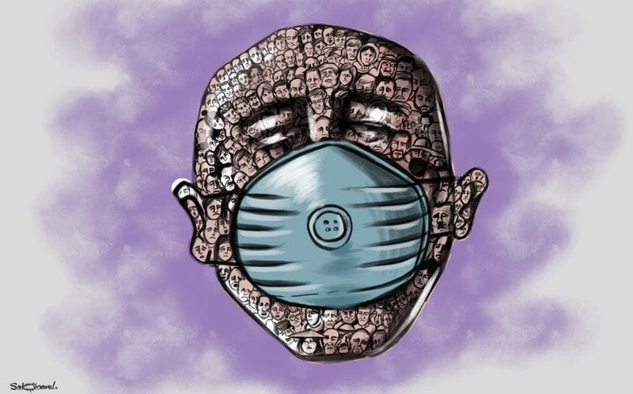

### **AYS DAILY DIGEST** 19/03/20: Thousands Brace for Impact in Unprotected Camps

_Restricted movement in the camps // Calls to end detention centers // First COVID\- 19 case in a reception center in Germany // What to Know about Decree №8 and 9 in Italy_

**Corona Virus By Mohammad Sabaaneh**
### **GREECE**

> “I just pray that this virus does not enter the camp, because if it comes, there is no safe place for anyone\.” 

In Greece, Doctors Without Borders \(MSF\), along with other NGOs, are calling for camps to be urgently evacuated to avoid the pandemic spreading through vulnerable communities that already lack basic healthcare\. However the government’s response has been to isolate people in the camps away from others\.

On Lesvos, both Kara Tepe Refugee Camp and Moria Refugee Camp, authorities have announced that movement outside the camp will be restricted to 100 people leaving each hour, between 7am\-7pm, and that only one individual per family is allowed to leave the camps at a time\. Given that the camps’ combined population is more than 20, 000 people, just 1 in 20 will be able to leave each day\. All visitors and nongovernmental organisations \(NGOs\) have also been prohibited from entering the camps for at least 14 days\.

> “Protecting public health at any cost, for the benefit of residents on the islands and in camps, is our priority\.” 

The isolation of the two camps today seems an effort to keep the migrant population segregated from the rest of the population of the island\. An outbreak now would be impossible to control, and the already strained health system would be unable to respond\. It would be disingenuous to suggest that isolation of the camps is to protect the migrant population, as residents are completely lacking in any other measures to protect themselves, including access to water, soap, and ability to self isolate\.

Videos from the ground show just how bad the situation is and how impossible it would be to do any kind of social distancing or hand washing\.

Douglas Herman is reporting videos from the ground daily with messages like,

> “Can’t stay home if this is home\! COVID\-19 is a real threat\. In response the Greek government has shut down public life and is arresting anyone who endangers public health\. Yet Moria Camp on Lesvos is locking vulnerable people in overcrowded and illegal conditions without adequate access to water, soap, masks, space for social distancing, even doctors\. Asylum seekers came to the EU for international protection\. So where is it?” 

Instead of protecting them, these measures abandon these people to the realities of a long\-neglected health crisis that will be hit by a global pandemic\. If rapid measures are not taken to evacuate the most vulnerable individuals and prepare for provision of emergency health care to this population, Greece is signing the death sentence for potentially hundreds of vulnerable individuals living in these camps\.

Ground teams are more overwhelmed than ever and need as much support as possible during these difficult times\. You can support initiatives like the mask workshop group which is trying to create as many face masks as possible for the camp residents and those that show signs of the illness\. The initiatives was started by four women from Moria who had experience as tailors in their countries\.

> “It was set up within six hours on Friday…One of the Afghan women used to be a tailor in Kabul and said she’d have no problem managing the operation\.” 

You can also donate to local activists and teams who stayed to support the people stuck on Lesvos\.

You can make a donation via PayPal \(hyperlink this: [https://womenrefugeeroute\.us15\.list\-manage\.com/\. \. \./click\. \. \.](https://womenrefugeeroute.us15.list-manage.com/track/click?u=18487a830f2836b49d3534127&id=ebc18db5da&e=e7075f6663&fbclid=IwAR3XtJuNlU9Ue3VDhHWT2T-Tw2CZGsnAcTPbXZ0zYh8gLLUWdm_I7bVyDj4) \)or via a regular bank transfer to:

**Women Refugee Route ARBEJDERNES LANDSBANK**

**Account number: 53610258213**

**IBAN: DK8253610000258213BIC**

**SWIFT: ALBADKKK**

**Subject: “Lesvos Solidarity”**

Political action is crucial at this time as well\. We must all do what we can to support solidarity initiatives in times like these and always\.

■■■■■■■■■■■■■■ 
> **[Are You Syrious?](https://twitter.com/areyousyrious) @ Twitter Says:** 

> > Spread information. Contact your MEP. Demand action from those in charge. Raise your voice. There are many ways to better familiarize yourself with the situation, to share your knowledge with others and do something concrete in your area or support ground teams. #LeaveNoOneBehind 

> **Tweeted at [2020-03-19 22:01:11](https://twitter.com/areyousyrious/status/1240760254444511239).** 

■■■■■■■■■■■■■■ 

In Chios, the situation is also dire\. In the Vial Refugee Camp, even if they wanted to, people cannot keep a three\-foot distance from someone who is coughing or sneezing, as the World Health Organization [suggests](https://www.who.int/emergencies/diseases/novel-coronavirus-2019/advice-for-public) \. It is also almost impossible to avoid gatherings of 10 or more people which is a new Greek policy\.

> “I see fear in everyone because of this new disease called corona\.” 

Yesterday there was another attack on volunteers\. The incident took place at Xalkios mini market where the two volunteers had gone, who — as they often do — provide refugee and immigrant families with various items to support and serve them\. Two women in the area attacked them with abusive and insulting expressions and then broke the windshield and the mirror of their car\.

On the mainland, dozens of doctors and nurses working in Greece’s public hospitals have tested positive for Coronavirus and some 300 members of medical staff across the country are in home isolation\.

> “We are decimated, if masks do not come, there will be many losses\.” 

According to Panos Papanikolaou from the Federation of Hospital Medical Associations of Greece EGEN, four health officials at [Agios Savvas](https://www.ethnos.gr/ellada/94641_koronoios-se-karantina-mpainoyn-tesseris-ygeionomikoi-ypalliloi-ston-agio-sabba) Hospital for Cancer treatment in Athens were tested positive\. 10 doctors and 11 nurses from [Ippokratio Hospital](https://www.koutipandoras.gr/article/koronoios-se-karantina-10-giatroi-kai-11-nosileytes-sto-ippokrateio) have been also placed in house isolation, after one doctor at the Ears\-Nose\-Larynx clinic has been tested positive\. The clinic was closed for disinfection, patients were transferred to other hospitals\.

Infected personnel is not only to be found in Athens but also in other hospitals across the country\. In Kastoria, northern Greece, more than 5 doctors have been tested positive and another 60 are in house isolation\.

In Corfu, a thousand and two hundred immigrants at the Corinth detention center went on hunger strike protesting the abysmal conditions in which they were detained despite the threat of the spread of the Coronavirus\.

> _“Hundreds of people are trapped and crowded into a concentration camp in inhumane and dangerous health conditions, facing the threat of the spread of coronavirus, led by the state authorities\.”_ 

If migrant detention centres become health bombs, the entire population will be at risk\.
### **FRANCE**

In France, concerns over COVID\-19 are triggering the release of migrants in pre\-removal centers\. Judges are ordering the release due to the need to prevent the “exportation and importation” of COVID\-19 cases and because of the practical impossibility to enforce returns to the countries of origin\. As a result, there are no more legal grounds for detention and people are released\.

> _“In a context where many countries close their borders and where flights from French territory are suspended at least for 30 days, the prospect of expulsion from abroad, if it is not entirely absent, appears most hypothetical in the retention period\.”_ 

In Lille, the situation is becoming more than alarming\. A large number of people, including minors, are still living outside, and no concrete health measures have been put in place to address the eventual arrival of COVID\-19\.

As many volunteers and concerned community members are unable to work directly with people on the move at this time, LA PORTE D’ULYSSE — CENTRE D’HÉBERGEMENT is calling for donations\.

If you wish to support them and donate, they need the following items which can be sent to their address La Porte d’Ulysse 6, Rue du Planeur 1130 Haren:

\- Shower gel and hand soap

\- Toothbrushes

\- Coffee, tea, sugar, jam…

\- Fruit and vegetables

\- Washing powder/pads

\- Hand gloves, antibacterial gel and masks
### **SEA**

On February 8\- 9, 2020, ninety\-one people went missing in the Mediterrean after embarking on a black rubber boat from Garabulli, Libya and calling AlarmPhone for immediate assistance\. More than a month later, they are still missing and no information has been provided by the authorities about their whereabouts\.

On the night of the 8th Alarm Phone contacted Libyan, Maltese and Italian coast guards several times on February 9th to mobilize relief for people in distress at sea, but none of them responded adequately\. Libyan authorities told us that they were unable to conduct search and rescue \(SAR\) operations because “their detention centers are full” and that they had to solve this problem with “higher authorities\.” Families are desperately looking for them and have received no information about their whereabouts as all of the authorities continue to remain silent\.

> “The Mediterranean is a liquid cemetery because European states and authorities refuse to put an end to these lethal migration policies\.” 

Their silence on events is indicative of their reluctance to take responsibility for what happened\.

If all these people lost their lives, their death is once again the result of European migration policies and the outsourcing of borders in North Africa and elsewhere\.

Limiting safe travel routes and forcing people to cross the sea are the underlying and systemic causes of this ongoing violence\.

■■■■■■■■■■■■■■ 
> **[Alarm Phone](https://twitter.com/alarm_phone) @ Twitter Says:** 

> > @[guardiacostiera](https://twitter.com/guardiacostiera), @[Armed_Forces_MT](https://twitter.com/Armed_Forces_MT), @[Frontex](https://twitter.com/Frontex): il vostro silenzio dimostra la vostra riluttanza ad assumere responsabilità. Eravate tutti avvertiti e sareste dovuti intervenire. Il #Mediterraneo è un cimitero liquido perché vi rifiutate di por fine a politiche di frontiera letali. 

> **Tweeted at [2020-03-19 11:52:50](https://twitter.com/alarm_phone/status/1240607157021741059).** 

■■■■■■■■■■■■■■ 

### **GERMANY**

The first case of COVID\-19 was detected in a reception centre in Hessen\. The person concerned is a 24\-year\-old Afghan citizen\. He is the first and only confirmed suspected case to date within the initial reception facility\. The Gießen health office was immediately involved and ordered that the person be segregated by March 31\. Currently, 3174 people are accommodated across five locations across Hesse with German authorities still refusing to close the camps and provide decentralised accommodation\.
### **ITALY**

Pensare Migrante created a fact sheet of questions and answers regarding the two new Decrees and how they will affect new terms for residence permits, appeals, international protection bodies\.

### **GENERAL**

The 10 days of activism continues and in its second day promotes a statement from Mare Liberum:

> **“During the last weeks, since the beginning of March, we were observing a situation, which showed once again, how dangerous and deadly the European external borders are, threatening the lives of those that are fleeing war, persecution and hardship\.”** 

**Find daily updates and special reports on our [Medium page](https://medium.com/are-you-syrious) \.**

**If you wish to contribute, either by writing a report or a story, or by joining the info gathering team, please let us know\.**

**We strive to echo correct news from the ground through collaboration and fairness\. Every effort has been made to credit organisations and individuals with regard to the supply of information, video, and photo material \(in cases where the source wanted to be accredited\) \. Please notify us regarding corrections\.**

**If there’s anything you want to share or comment, contact us through Facebook, Twitter or write to: areyousyrious@gmail\.com**

_Converted [Medium Post](https://medium.com/are-you-syrious/ays-daily-digest-19-03-20-thousands-brace-for-impact-in-unprotected-camps-2af8c1ad34ed) by [ZMediumToMarkdown](https://github.com/ZhgChgLi/ZMediumToMarkdown)._
