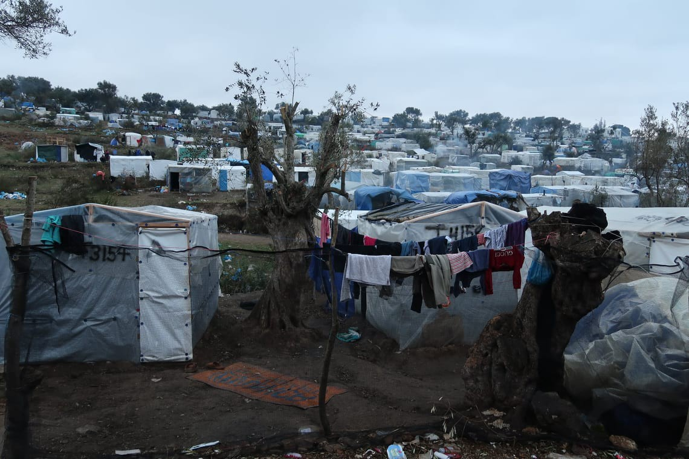
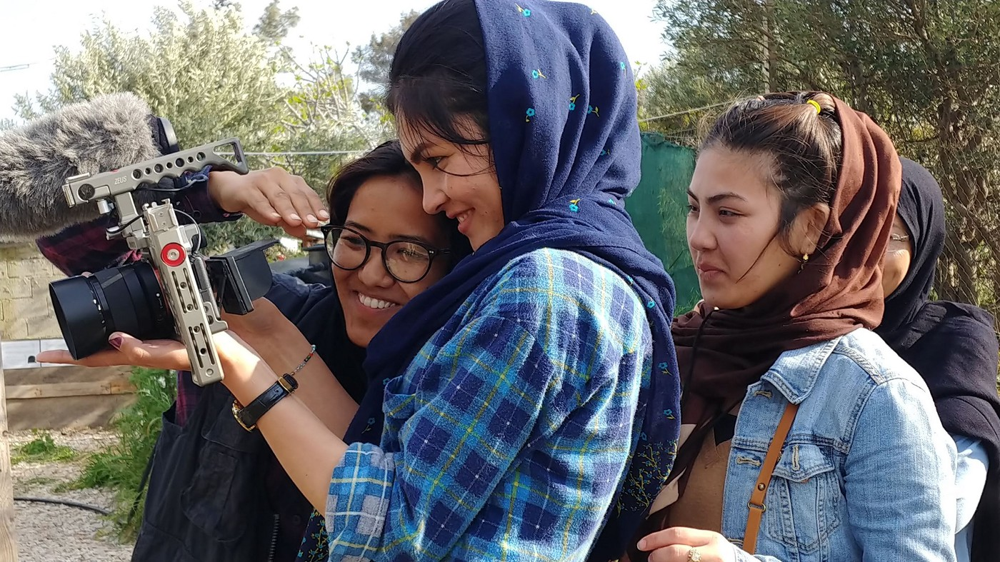
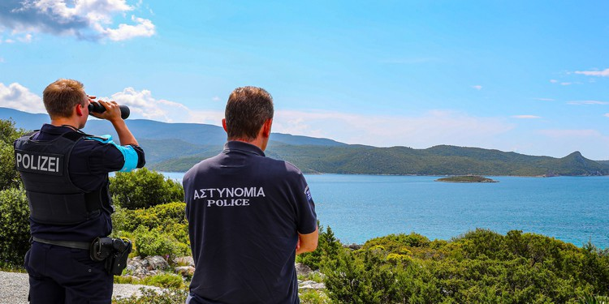
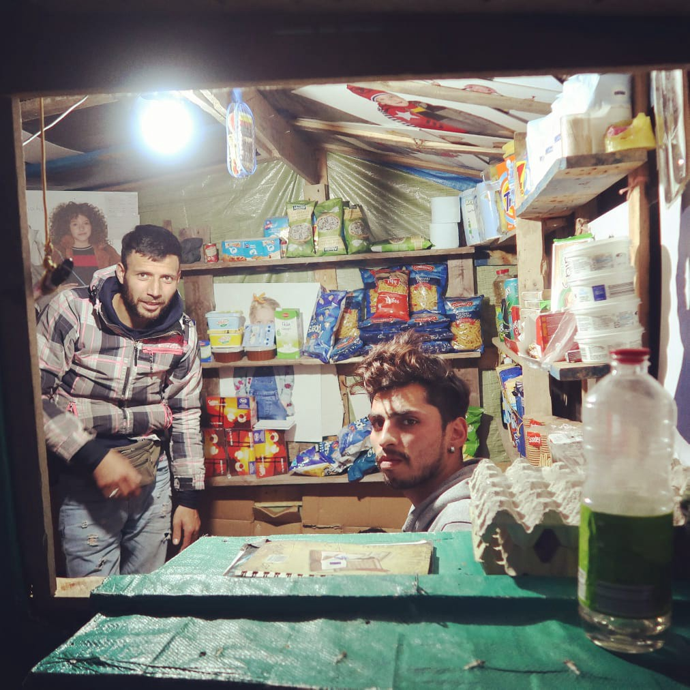
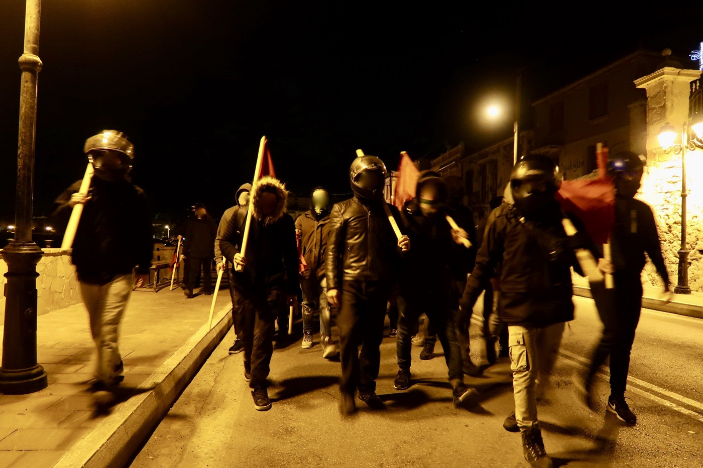
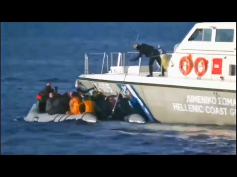
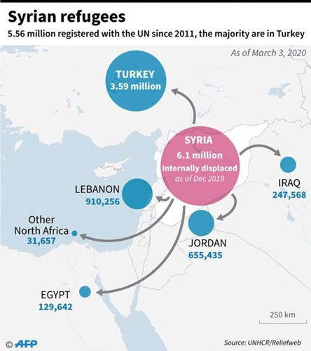
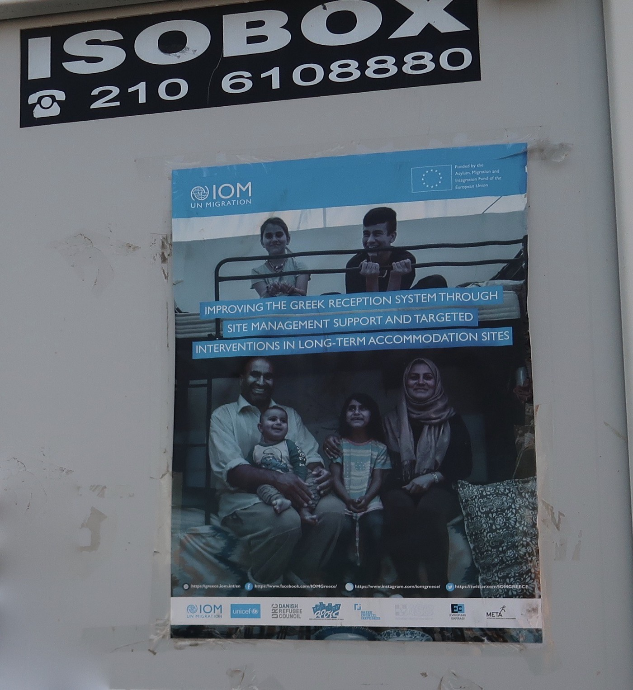

### Podcast: Turkey and Greece \- the story behind the headlines
#### This unplanned special report serves as a critical update and as a preface to two extensive field reports to be released in the coming days, made by Eric Maddox of the Latitude Adjustment Podcast in cooperation with AYS

Moria camp on Lesvos is currently hosting over 20\.000 people\. Photo: Eric Maddox

One of the advantages of podcasting lay in its ability to reach people despite the recent border closures that have resulted from COVID\-19\. And so, as I continue to work on editing all of the interviews that I conducted with refugees, volunteers, Greeks, and various stakeholders in Lesvos and Athens over the past two months I also took the opportunity to put together a comprehensive introductory episode by way of two lengthy phone calls with contacts in Greece and Turkey\. This is the first of a three\-part series focussing on Greece, with the Balkans phase of the project now delayed until the current COVID\-19 pandemic is effectively contained\.

> [**YOU CAN CATCH THE FULL PODCAST EPISODE HERE\.**](https://www.latitudeadjustmentpod.com/podcast/2020/3/14/episode-57-special-report-from-greece-and-turkey) 

#### **Our Show Guests:**

**Douglas Herman** is a journalist and co\-founder of [Refocus Media Labs](https://refocusmedialabs.org/) , a nonprofit organization that empowers asylum seekers through teaching media skills\. Douglas has been based on Lesvos for several years and more recently he’s been documenting the escalating situation on the island for a variety of news sources\.

**Deman Güler** is a human rights attorney in Turkey and manages the Human Rights Center and Commission for Refugees for the [İzmir Bar Association](https://www.izmirbarosu.org.tr/EN/?fbclid=IwAR2t4ZzqU6AiatiTGDTEuF_cZ3CI33gYXSeLHPjCpE2Lh9wekJkLeV9YGiQ) \. Those familiar with the geography of the migratory routes will recognize Izmir as one of the principal staging areas for smugglers and for those trying to cross by sea to the Greek isles\.

Refocus Media Labs is empowering refugees through teaching media skills\. Photo: Douglas Herman
#### **The Wide\-Focus:**

Much has changed since I left Greece at the end of February, and much has changed since 2015 when I first came to Greece and to Moria Camp on Lesvos\. This episode is intended to provide a broad update on current conditions in Lesvos and in Turkey, while the following timeline should help to refresh memories and to educate friends about how we got to the present situation and what is happening elsewhere along the migration routes\.

In 2015 large numbers of asylum seekers, mostly from Syria, made their way to the borders of the EU in what became the largest movement of refugees in Europe since the Second World War\. Many had already spent years [languishing in camps across the Middle East, North Africa, and elsewhere](https://www.amnesty.org/en/latest/campaigns/2013/12/freezing-conditions-forgotten-camps-refugees-from-syria-in-lebanons-bekaa-valley/) before finally growing desperate at their conditions and at their sense of abandonment by the international community\. European Union member states received more than 1\.2 million first\-time applications for asylum in 2015\. The overwhelming majority of those eventually granted asylum were settled in Germany\.

The Greek government officially asked Frontex last night to launch a rapid border intervention at its sea borders in the Aegean, as of March 2020\.

In 2016, in response to growing alarm at the continuing movement of peoples towards Europe, the European Union struck the so called EU\-Turkey Deal, with Brussels promising to pay Ankara 6 billion Euros to contain the flow of people within Turkish borders\. Along with the deal, the EU’s multinational border enforcement body, Frontex, ramped up patrols in the Aegean, while the EU began equipping and funding [a rather mixed cast of characters in Libya to monitor and suppress crossings in the central Mediterranean](https://foreignpolicy.com/2019/10/10/libya-migrants-un-iom-refugees-die-detention-center-civil-war/) \.

And while some of this will be known to those who have been following events more closely, less well known is the fact that The EU has also sent millions of dollars to Sudan in an effort to curb migration from Africa long before it reaches the Libyan coastline\. This has been going on for years, and [Sudan has in turn deployed its Rapid Support Forces \(formerly known as the Janjaweed miliatias of Darfur Genocide infamy\) as its border police](https://www.thenewhumanitarian.org/special-report/2018/01/30/inside-eu-s-flawed-200-million-migration-deal-sudan) , with reports that this force [has itself taken part in kidnapping and human trafficking activities itself\.](https://www.clingendael.org/pub/2018/multilateral-damage/3-effects-of-eu-policies-in-sudan/)

On the other side of the Meditteranean Italy effectively sealed off its ports and Malta behaved in similar fashion, with the result that crossings shifted Westwards to Spain\. You can catch [my conversation about the situation in Malta, and about the mediterannean routes more broadly, in episode 29 of Latitude Adjustment podcast](https://www.latitudeadjustmentpod.com/podcast/2019/3/31/episode-29-maria-pisani-malta-amp-the-mediterranean-route) \.

A message from the Ocean Viking recorded on 21 August 2019, as the ship remained stranded in the Mediterranean Sea for the 12th day since the first of four consecutive rescues, with 356 men women and children on board waiting to be allowed to disembark in a place of safety\. Photo: MSF

The overall effect has been a marked decrease in the crossings from Greece to Turkey, with Spain replacing Italy as the largest recipient of Mediterranean crossings\.

However, it should be noted that while there has been a decrease in the overall number of crossings, [the mortality rate has remained high](https://www.unhcr.org/news/press/2018/9/5b8935964/mediterranean-crossings-deadlier-new-unhcr-report-shows.html) , with the death rate in the Mediterannean as much as doubling at various points since the EU\-Turkey deal\. [More than 18,500 people have been reported dead or missing trying to cross the Mediterannean since 2014](https://migrationdataportal.org/themes/migrant-deaths-and-disappearances#recent-trends) , making it far and away the deadliest migratory route on earth\.
#### **Greece:**

In July 2019 a new right wing government took power in Greece, based in part on its promise to take a hard line on immigration\.

However the result has been a continuation of the large bottleneck of refugees trapped on the Greek Islands with a policy of [malign neglect creating filthy and dangerous conditions](https://www.theguardian.com/global-development/2020/feb/11/un-calls-for-urgent-evacuation-of-lesbos-refugee-camp) that exemplify the EU’s longstanding strategy to manage migration flows through deterrence\. But to paint a crude image with words, imagine a converted former military base designed to temporarily accommodate roughty 3,000 people, currently packed beyond bursting with approximately 20,000 souls spilling out onto its periphery\. This includes unaccompanied minors, families, the elderly and infirm, and young men, all living in fetid conditions amidst mountains of [garbage which spill into the dry riverbeds](https://www.youtube.com/watch?v=Ez_U2jXX4jI&t=72s) that cut through the camp\. Filthy latrines drive people to use the surrounding hillsides as an open lavatory making the walk across what open areas remain along the camps’s periphery a rather treacherous undertaking, with the result that human excrement will likely be tracked back into crowded shelters and common areas\. These same hillsides have been stripped bare of olive trees as residents are left to scavenge whatever source of firewood they can to fend off cold and wet nights with no electricity or running water\.

Practically all of the residents of Moria that I spoke with mentioned living in constant fear as a climate of general lawlessness has been left to take hold over the camp, with reports of robberies, stabbings, and even [homicides](https://www.infomigrants.net/en/post/19064/minor-killed-at-moira-migrant-camp-on-lesbos) in recent months\. My first thought upon seeing the lack of access to hygiene resources in Mora, and and upon seeing a level of filth that can only be described as post apocalyptic, were that the camp is a looming public health catastrophe that has been all but engineered\. And this was _before_ COVID\-19 exploded in Europe and the West\. [At least one case of the virus has already been reported amongst the local population on Lesvos](ays-daily-digest-09-03-2020-coronavirus-reaches-lesvos-supermarket-worker-falls-sick-eec0d7fc162d) , making it not a question of if but rather when an outbreak will take place in Moria and in other camps, as thousands of immunocompromised people who are already struggling with ill health are forced to live in filth as NGO’s close shop in response to the Coronavirus\. This means already overwhelmed support services have presently been reduced to almost nothing in the face of a growing pandemic\. That’s Moria camp, by far the biggest camp, but still just one camp on one island\. Imagine this scenario playing out across the camps on the other Greek isles, where conditions differ only in scale\. I can’t imagine that my Armenian ancestors faced such conditions when they too came to Greece by boat as refugees roughly one hundred years ago\. Not only is it shocking to consider that one is standing on European soil in Moria Camp, there’s little evidence to suggest that one is standing in the 21st Century\. And to cap it off [a fire broke out in a crowded section of the camp](https://www.instagram.com/p/B91dqkrobgD/) on March 16th\. [The body of a 6 or 7\-year\-old girl was found in the debris](https://www.cbc.ca/news/world/greek-migrant-camp-1.5499001) \.

People are still trying to have normal lives and even small businesses inside Moria\. Photo: Eric Maddox

Greece’s unique geographical position as an EU member state that shares no physical borders with the European Union effectively makes the Greek mainland an island as well\. And while that may be, Athens and the Greek mainland still remain a sought after destination and a dream for those left to wait, suffer, and rot on the islands\. Much as Greece has been used as a holding cell by the EU, Athens has used its Aegean islands as open air prisons\. In recent months and weeks this culminated with Athens announcing plans for closed detention centers to be built on several of the islands\. [These plans have not gone down well, either with island residents or with refugees\.](https://www.reuters.com/article/us-europe-migrants-greece-protests-idUSKCN20K1YJ)

In January island residents called for a one\-day general strike across the islands, mounting large protests that appeared to be uniformly peaceful\. However frustrations and misinformation have also led to a Rise in right wing attacks and threats on NGO staffers and refugees, [a topic that I covered in a recent written report for Are You Syrious](ays-special-from-lesvos-right-wing-attacks-on-refugees-volunteers-and-locals-9f98779aef8e) which documented first\-hand testimonies of some of the victims\.

Antifascist Demonstration on the evening of February 4th, in the wake of Lesvos riots\. Photo: Eric Maddox

Then, in late February, Athens sent in large reinforcements of riot police and building equipment on ferries under cover of night, ostensibly to begin with construction of the closed detention centers and to suppress local opposition to these plans\. The heavy handed measures lead to almost instant confrontations between locals and police, with Athens ultimately conceding and recalling its forces\.

[A detailed timeline of the escalating tensions on Lesvos was contributed to AYS by Douglas Herman](ays-special-lesvos-well-beyond-the-brink-this-is-what-we-know-so-far-7c11873e12f8) , one of our guests in this special podcast report\.
#### **Turkey:**

As for Turkey, the country currently hosts 3\.7 million Syrian refugees\. Add to this refugees from Afghanistan, Arican nations, and other countries, and this number swells to over 4 million, making Turkey host to the world’s largest refugee population\.

And then there’s Turkey’s military involvement in Syria, just on the other side of its southern border\. As the Syrian government has fought to retake Idlib \(the last remaining rebel stronghold located in the northwest of the country\) [nearly a million people have been internally displaced since Christmas, making this the largest displacement of people in Syria since the war began\.](https://www.nytimes.com/2020/02/18/world/europe/turkey-syria-idlib.html?fbclid=IwAR3Lbb_3MR81i8Uezgombm7dWubVrtWpgTZtsDNEm02ARrw8lT732ON2HoM) During this time people have been sleeping, starving and freezing to death in frigid temperatures on the periphery of an active war zone, and it’s possible that nearly a million more could join them once the final urban strongholds are taken\.

Syrian refugees in bordering regions in Turkey by the end of January 2020\. Photo: UNHCR

Then just as all of this tension was mounting in Lesvos and on the other Greek isles at the end of February, [33 Turkish soldiers were killed by Syrian forces in an artillery strike, and overnight Turkish president Erdogan announced that he was telling his border police to stand down\.](https://www.sfgate.com/news/world/article/Turkish-soldier-killed-in-northwest-Syria-15094540.php)

Reports quickly followed of [refugees being bussed from inside Turkey to the land border with Greece](https://www.middleeasteye.net/news/buses-istanbul-transport-refugees-turkey-border-greece-free) , while more boats began to cross to the Greek islands from the Turkish coastline\. Greece then announced that it was suspending all asylum hearings for one month and that it would be deporting people directly back to Turkey without a hearing, [a direct violation of its obligations under international law and as an EU member state\.](https://www.theguardian.com/world/2020/mar/12/greece-warned-by-eu-it-must-uphold-the-right-to-asylum?CMP=share_btn_fb&fbclid=IwAR3WCTKVjFcEAO7IDeQ7AQOX8JbNDjWTDF8YYmfEmIzGjAdgX46IuHxNgKw)

“Clashes” is a term that should be utilized with caution as it’s all too often deployed as a rhetorical cover for one side beating up on another, but in this case it’s not clear to me just who is responsible for the escalations on the border\. All that’s clear is that asylum seekers who were clearly encouraged by Turkey to make a run for a better life, were then pushed back in severe fashion, and as usual remain caught in the middle\. Greek forces at one point announced round the clock live fire drills into the stretches of the Aegean where boats cross from Turkey, while the [Greek coast guard were caught on film trying to execute an aggressive pushback of a flimsy raft loaded with people inside of Greece’s territorial waters\.](https://twitter.com/Stone_SkyNews/status/1234454621818703873)

Even a complete and prolonged cessation in crossings would do nothing to address the problem that remains on the Greek islands\. [At the moment more than 42,000 people are trapped across the islands\.](https://data2.unhcr.org/en/documents/download/74359) Many are stuck for years\. And many are deported back to Turkey where they are again deported back to war zones in phenomena known as “chain deportation” and refoulement\.

Hungary’s right wing government has since used the Coronavirus as a pretext for [suspending some of its own asylum procedures](https://www.euronews.com/2020/03/03/orban-uses-coronavirus-as-excuse-to-suspend-asylum-rights-in-hungary) , citing Iran as a major center of the virus while failing to note that [“recent Iranian arrivals from Turkey have been living in closed Turkish camps for years, not in Iran”\.](https://twitter.com/viktoriaserdult/status/1234108411324850182)

[According to UNHCR figures that are already two years old, there are 70 million forcibly displaced people worldwide](https://www.unhcr.org/figures-at-a-glance.html) \(this includes those who have been internally displaced, IDPs, as well as those who have had to seek safety in another country, also known as refugees\) \. Of the world’s total refugee population roughly 80% are hosted in countries next to their countries of origin\. In other words, it’s important to note that when we talk about the “refugee crisis” in a global context, it’s the Global South that has borne overwhelming responsibility for hosting these vulnerable populations, and the figures that Europe is looking at accommodating \(or repelling\) represent just a tiny fraction of that number\. The number of refugees that Europe took in in 2015, at the height of the crisis, accounted for a fraction of a percentage point increase in its population\. At the moment the population of tiny Lebanon, a country currently in the middle of a political revolution and a complete financial meltdown, is roughly 20–25% Syrian\. Top hosting countries are Turkey, Pakistan, and Uganda\.

This still leaves out a lot of information, notably the conditions faced by refugees in the countries that are hosting most of them, but if you want more detailed insights into the backstory, the broader geographic and political context, and more personal narratives from refugees, volunteers, Greeks, and concerned parties then be sure to look for the episodes that will soon follow this one\. Each of those episodes will also be accompanied by an abundance of supplemental materials on the Latitude Adjustment Podcast\.

You may also check our archive for previous interviews with displaced peoples and those working to support them: [Escape from Afghanistan to France;](https://www.latitudeadjustmentpod.com/podcast/2018/12/25/episode-18-abdul-saboor) [Interview with Are You Syrious?;](https://www.latitudeadjustmentpod.com/podcast/2019/5/22/episode-34-milena-zajovi-are-you-syrious) [Interview with No Name Kitchen;](https://www.latitudeadjustmentpod.com/podcast/2019/1/4/episode-19-bruno-morn-no-name-kitchen-serbia-amp-bosnia) [Trapped for Seven Months In Kuala Lumpur Airport;](https://www.latitudeadjustmentpod.com/podcast/2019/4/16/episode-31-stuck-in-malaysia-a-syrian-amp-yemeni-story) [Stateless: Rohingya Community](https://www.latitudeadjustmentpod.com/podcast/2019/8/2/episode-42-stripped-of-citizenship-myanmars-rohingya-community)

Also look for numerous episodes highlighting conditions across the Middle East and North Africa\.
#### **CONCLUDING THOUGHTS:**

Far from being the front lines of the refugee crisis, for a very small number of the world’s refugees the European Union is merely the finish line\. And it’s the finish line in a race that nobody wants to run\.

**For all of you looking to get more involved, here are three things that you can do to make a difference:**
1. While many of us are waiting it out in self\-imposed isolation, millions of others do not have this option\. The impact of the Coronavirus will be felt most harshly by vulnerable communities and refugees are at the top of that list\. We must **get the more than 42,000 people who are stranded in camps across the Greek islands transferred to the mainland where they can be given access to expedited asylum proceedings, liveable conditions and access to healthcare, and access to resettlement in EU member states so that Greece is not left to shoulder so much of the responsibility on its own\. Here is one place to start [for Europeans](https://www.europemustact.org/?fbclid=IwAR0wtOi_vKBXLUhQpizEKN0Hj9SCDD_4MV6gy658k-bBLf9gCEARXQzpupg) , another [for the rest of us](https://www.change.org/p/leavenoonebehind-prevent-the-corona-catastrophe-now-also-at-the-external-borders?use_react=false) , and you can also [join this Facebook group](https://www.facebook.com/groups/refugeereliefactionforum/) \(the author of this article is the founder and admin\) \.**

There must be a way to do better than this\. Photo: Eric Maddox

2\. Find local small NGOs doing critical work with low overhead to donate to\. Need suggestions? Just go to the website or follow us on social media where we’ll be posting [a list of organizations](https://www.latitudeadjustmentpod.com/podcast/2020/3/14/episode-57-special-report-from-greece-and-turkey) \.

3\. Vote differently and write to your elected officials\. And hit the streets when you hear about demonstrations in your area\. These actions aren’t just about registering your anger, they’re ways to meet and form connections with people in your community who care about these issues too\. And that’s the whole point of all of this right? Community\. We need to get out of our bubbles and meet the people living next to us\. As a bonus, you’ll walk away with some new friends who share your passions and interests\.

4\. Find local people who are _from_ the communities in question\. Your community probably has resettled people in it\. Meet them\. Host them for dinner\. Visit their mosques and take your kids and your curiosity with you\. Take an interest, and ask what resources they need in order to effectively support their people back home or in transit\. They will have direct lines of contact and a much better idea of what their relatives and home communities actually need\.

And finally, [here is a video\-interview with the author](https://www.facebook.com/latitudeadjustmentpodcast/videos/2532105590442176/?v=2532105590442176) about conditions on Lesvos and across the Middle East and North Africa\.

_The report was written by Eric Maddox, host and producer of [Latitude Adjustment Podcast](https://www.latitudeadjustmentpod.com/podcast) , who is currently collaborating with AYS on a series of episodes documenting the conditions of refugees and communities in Greece and the Balkans\. [Latitude Adjustment Podcast](https://www.latitudeadjustmentpod.com/) is a weekly show that highlights underreported issues, places, and communities around the world, with a special focus on human rights\. He completed his graduate research in International Conflict Transformation in The West Bank, and spent 2012–2016 working on independent media projects across the Middle East and North Africa, for which he founded the Dutch nonprofit, [Open Roads Media](https://www.openroadsmedia.org/) \. You can follow the progress of his collaboration with AYS on Instagram: [latitude\_adjustment\_podcast](https://www.instagram.com/latitude_adjustment_podcast/)_

_Converted [Medium Post](https://medium.com/are-you-syrious/podcast-turkey-and-greece-the-story-behind-the-headlines-f8c80dc0c388) by [ZMediumToMarkdown](https://github.com/ZhgChgLi/ZMediumToMarkdown)._
