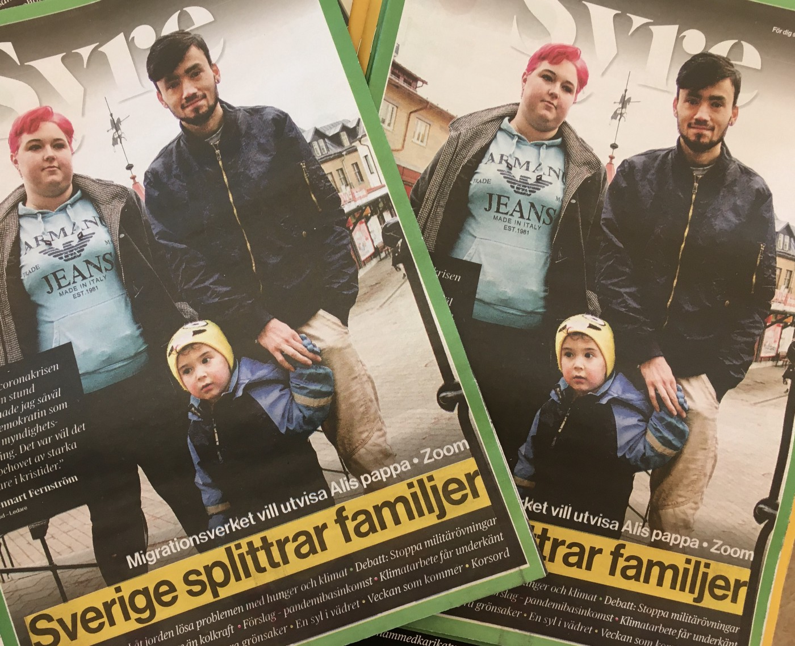
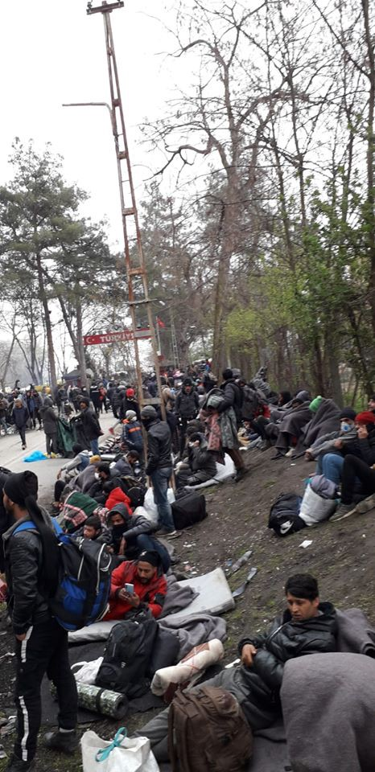
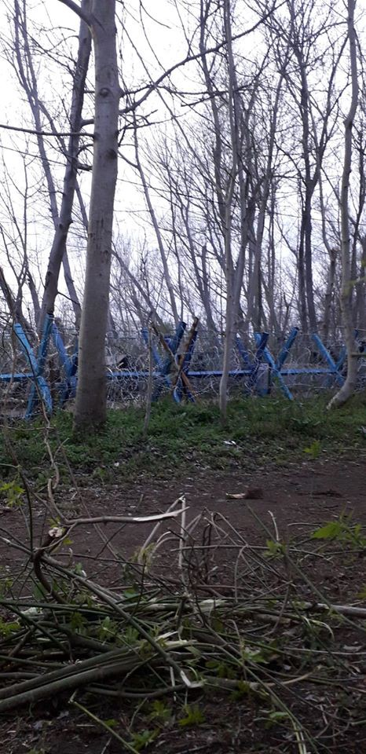
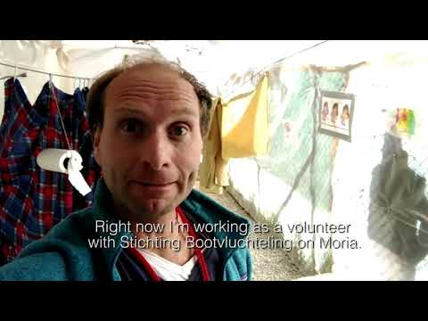

### AYS Daily Digest 26/03/2020 — Swedish Migration Agency Continues to Rip Families Apart
#### Updates from Pazarkule///Greek Parliament Denies the Right to Asylum///First Case of Coronavirus in CPR Gradisca

Habib, Marie & Ali\. Photo Credits: AYS
### FEATURE: Sweden is separating families — Little Ali’s dad does not have enough reasons to stay, according to the Migration Agency

On January 1st, 2020, the UN’s Convention on the Rights of the Child became law in Sweden\. Despite that, families are being separated without taking the wellbeing of the child into consideration\.

Even before the law was implemented concerns were raised: will this actually apply to all children in Sweden, or will it only be empty words? For Ali, the child of a Swedish mother and an Afghan father, it is the latter\. Nationality should not matter, but if the Migration Agency deports Habib, Ali’s dad, back to Kabul, they will deliberately refuse a Swedish child his right to grow up with his father\.

In Sweden it is very difficult to separate families, sometimes even in cases where the child might be damaged by close contact with one or both parents\. As it seems, it’s much easier when the father is from Afghanistan\. There are other differences in the ways children of Swedish parents and children of non\-Swedish parents are treated under the law\. According to the regular procedure when a separation has to take place \(most often with the support of [a law called LVU](https://www.riksdagen.se/sv/dokument-lagar/dokument/svensk-forfattningssamling/lag-199052-med-sarskilda-bestammelser-om-vard_sfs-1990-52) \), the child is provided with a lawyer who will speak on behalf of the child before the court\. However, this is not the case when the Migration Agency wants to deport someone’s father\.

The disturbing fact that the UN’s Convention on the Rights of the Child would not apply to children seeking asylum has been known for a long time\. The Aliens Act is superior to this law\. Politicians from the Social Democrats, The Left Party, and the Center Party told the paper Syre that when a new migration policy will be presented during the summer of 2020, this will be one of the topics they need to discuss and, hopefully, change\. Until then, many children are still in danger of losing family members or otherwise being harmed by the state\.
#### THE CASE OF HABIB, MARIE & ALI

Habib Niazi came to Sweden in late 2015, just a few days after a temporary and strict asylum law was implemented retroactively\. Habib Niazi and Marie Nordström met while they still were in school\. At first, Marie thought they ”only would be friends”, but it soon grew to so much more, as she phrases it\. They both told the paper Syre that the most beautiful thing with their relationship is that they always are there for each other\.

Since the day Ali was born in 2017 they have been taking care of him together\. The small family moved into the apartment in the town of Ödeshög, in Östergötland county, on the first of January 2020\. They bought almost all of the furniture for very cheap: a big sofa for the living room, a kitchen table with matching chairs and other necessities\. But the bed that Ali sleeps in Habib built in school, where he is studying to become a carpenter\. In the future, he wishes to develop his skills and become a welder also\.

That is, if Habib gets to stay in Sweden\. His asylum application has been rejected by the Migration Agency\. According to his asylum lawyer, Almina Imamovic, the Swedish asylum procedure is not what it used to be\. Since 2015 a lot has changed — and not in a positive direction for those seeking protection and a fair process\.

Habib has refused to sign papers saying that he is returning voluntarily to Afghanistan\. Since he brought Ali, a neighbor, and his lawyer to the meeting — it was impossible for the authorities to detain him for not ”cooperating”\. Habib, Marie and Ali’s hope right now is that Habib will be eligible for a whole new asylum process since he chose to convert to Christianity when both Ali and Marie were baptized\. According to a ruling from the Migration Court of Appeal from December 2019 [\(MIG 2019:25\)](https://lagen.nu/dom/mig/2019:25) it is forbidden to deport someone who because of a new faith could risk persecution if sent back\. But it’s is yet not certain that this will help Habib since many Afghan Christians have also been deported, despite the certain danger they face upon their return\.

Imamovic thinks it’s unfair that if Habib gets to stay in Sweden it is because he has converted to Christianity, but not as the father of a Swedish child\.
#### A NUMBER OF IGNORED REGULATIONS

Laws and legislations that make it possible for Habib to stay or apply for residency because of a strong connection to someone in Sweden do exist\. For example, [article 9 in the UN convention of the child](https://www.ohchr.org/en/professionalinterest/pages/crc.aspx) states that:

> “States Parties shall ensure that a child shall not be separated from his or her parents against their will, except when competent authorities subject to judicial review determine, in accordance with applicable law and procedures” \(…\) “States Parties shall respect the right of the child who is separated from one or both parents to maintain personal relations and direct contact with both parents on a regular basis, except if it is contrary to the child’s best interests\.” 

And the right to respect for one’s “private and family life” is regulated in the [European Convention, article 8:](https://www.echr.coe.int/Documents/Convention_ENG.pdf)

> “There shall be no interference by a public authority with the exercise of this right except such as is in accordance with the law and is necessary in a democratic society in the interests of national security, public safety or the economic well\-being of the country, for the prevention of disorder or crime, for the protection of health or morals, or for the protection of the rights and freedoms of others\.” 

But despite this, and writings in national laws, [such as chapter 5 in Sweden’s Aliens act](https://www.riksdagen.se/sv/dokument-lagar/dokument/svensk-forfattningssamling/utlanningslag-2005716_sfs-2005-716) , the Migration Agency does not consider it reasonable for Habib to stay in the country\. In the Swedish Aliens Act it says that if an alien has a strong connection to someone in Sweden, the person can, despite status in the country, stay during the time he or she applies for residency because of a strong connection to someone\. This is an exception — but depending on the case, an exception could be decided on\.

> “You have to weigh the best interests of the child against other considerations and in regards to society\. As a concrete example, this means that the decision to break up a family has to be weighed against the regulated immigration”, Carl Bexelius, deputy legal chief at the Migration Agency, [told the paper Syre\.](https://tidningensyre.se/2020/24-mars/barnets-basta-inte-alltid-viktigast/) 

Carl Bexelius also said in the interview that the circumstances when the family was created can matter\. If someone chose to start a family without having his or her status regulated then the person takes a risk and their new family will not help in their asylum process\. Although Sweden, the EU and the UN have laws that state it is in the best interest of the child to remain with both parents, there is unfortunately precedent for separating families\.

But the fact that there is a child does not automatically change anything\. The child, despite nicely written laws, is not always the most important thing\.

> “It is the parents who are responsible for their child\. However, based on the existing legislation we are trying to take into account the best interests of the child\. But it must also be weighed against, for example, regulated immigration”, Carl Bexelius told the paper\. 

The Migration Agency deputy legal chief also said that they are taking into consideration if it is possible for the person to return to his or her country of origin and apply from there if refusing someone to stay in Sweden during the time he or she awaits being granted residency because of a strong connection to someone in the country\. However, it would be impossible for Habib to apply for residency from Afghanistan\. The Swedish Embassy in Kabul does not accept any migration errands, including family reunification, as confirmed in an email sent to the paper behind the original report\. Deported Afghans must travel to Islamabad, New Delhi or Tehran if they wish to apply for permission to travel back to family in Sweden via an embassy\.

If Habib is sent back to Afghanistan it is basically impossible for him to return to Sweden, where his child and the mother of his child live and have citizenship\. What will happen to them when he is gone? It is keeping them awake at night right now\.

The testimonial above is just one of countless examples of the work of the Swedish Migration Agency\. Surprise deportations, refusal of important healthcare and other shady practices happen on a regular basis, according to multiple respondents\.

Link to the whole story, and more photos of the family and their daily life, [can be found here\.](https://tidningensyre.se/2020/24-mars/sverige-vill-utvisa-alis-pappa/) The interview with the Migration Agency’s deputy legal chief [can be found here\.](https://tidningensyre.se/2020/24-mars/barnets-basta-inte-alltid-viktigast/)

TURKEY
### Updates on the Situation in Pazarkule

Tensions are rising at Pazarkule as soldiers are threatening to disperse the gathering with force\. However, people continue to gather at the border between Turkey and Greece\. An AYS source reports:

The situation at Pazarkule\. Photo credits: Anonymous AYS source

> Now they will get out the gathering … The speakers say they are taking out the camp\. They will force people out if they do not\. People refused to go to Istanbul and gather at the gateway to Greece\. I don’t know what to do, I’m afraid\. People, most of them, did not eat in two days … and between us children and pregnant women\. I am at the heart of the event and I cannot believe what I see is unbelievable\. Every 20 meters is two soldiers — we talked a little while ago with a Greek officer\. We told him: Do not hit the open arms and the gases\. There are children and pregnant women … The people here are sitting and doing nothing\. People are sitting right at the border\. 

More pictures from Pazarkule\. Photo credit: Anonymous AYS Source

GREECE
### Greek Parliament Denies Right to Asylum

The Greek parliament v [oted](https://www.oxfam.org/en/press-releases/new-greek-law-reneges-right-asylum?fbclid=IwAR2B4zHw-yqYg2NSEXPhu68MK1u9LaZMCx3nx0h17CGdX20z8sM1NwerSLU) to make a government directive into law that suspended the right to asylum for all people who entered Greece between March 1st and the 31st\. The law could be further extended, and given the current xenophobic climate in Greece, this remains a possibility\. Even people fleeing war and death in their home countries will not be allowed to stay\. In response, Refugee Support Aegean organized a letter signed by 121 organizations addressing the Greek government, the European Union, the UN and the World Health Organization\. In their letter, they [stated](https://rsaegean.org/en/protect-the-most-vulnerable-to-ensure-protection-for-everyone/?fbclid=IwAR0kfktQKR4TUnbJ4042EDe0x_-KD4UIEL8r26Xlpo59iELGvCN2Z2aAWw4) that not only does this law violate international asylum law, it is irresponsible to continue detaining people in unsanitary camps during a public health crisis\.

Instead of stripping people on the move of what meager rights they had before, the Greek government should be focused on the unsanitary, disease\-spreading conditions in the existing camps\. Overcrowding and lack of sanitary facilities are common in Chios, Lesvos and countless other places\. Vasilis Panxou, a volunteer on Chios, called the situation there a “ [nuclear bomb\.](https://www.facebook.com/smhumanitario/posts/2877415515683613?hc_location=ufi) ”

In response to the conditions, doctors across Europe started a \#SOSMoria campaign, calling on the Greek government and the EU to evacuate the camps and resettle people across the EU\. Medical professionals \(and others\) are asked to sign the distress call [here](https://en.sosmoria.eu/?fbclid=IwAR1sUu_2bF8G8KjHrw2Fd3GRXycdMnHfmKBF_kKFtCDi2LUSf1W-LkRFiDc) \.

Instead of evacuating the camps, the Greek government is building new ones, the so\-called “closed centers” on the mainland\. These new centers are just as [horrendous](https://www.facebook.com/AegeanBoatReport/photos/a.285312485325196/798412410681865/?type=1&theater) as the existing camps — the tents used for housing are already overcrowded, there are not enough toilets, and there are only outdoor showers\. There is no safety equipment for people detained to prevent COVID\-19, and there is no way to safely dispose of masks worn by police officers\.

BOSNIA & HERZEGOVINA
### Information for People on the Move About COVID\-19

This Info\-point Facebook page [publishes](https://www.facebook.com/info.point.covid19/posts/104449911206590) information about the coronavirus pandemic in English, Arabic and Farsi for people on the move in BiH\.

ITALY
### First Case of Coronavirus in CPR Gradisca

A person [detained](https://www.facebook.com/NoaiCPR/posts/672711053300404) in Gradisca on March 19th tested positive for coronavirus, authorities confirmed\. Residents of the CPR have already been on hunger strike for several days to protest the unsanitary conditions they live in\. People detained in Gradisca say that conditions are so bad the virus would infect them all, and they are afraid that authorities would leave them to die\.

GERMANY
### COVID\-19 Lockdowns Affecting People on the Move

Germany’s lockdown is disproportionately affecting marginalized people, including people on the move\. Conditions in shelters are crowded and unsanitary — already 21 people in refugee accommodation across Germany caught the virus\. People on the move are not given enough information about what’s going on, since very little informational material is translated\.

However, because of the epidemic people seeking asylum are now [allowed](https://www.infomigrants.net/en/post/23690/germany-migrants-and-refugees-may-fill-labor-gaps?fbclid=IwAR3o8jOtNx8VSbpqWLo7Xmn87sgLuBamEmeREB2SpgCaZoGRP5G3XphSnTo) to work in fields facing labor shortages, such as medicine and farm work\. This could be a step towards a more humane, integrating asylum process or simply a way to exploit the labor of people in precarious situations\. We hope it is the former\.

EUROPEAN UNION
### EU Calls on Countries to Release Detained People on the Move During Pandemic

The Commissioner for Human Rights [asked](https://www.coe.int/en/web/commissioner/-/commissioner-calls-for-release-of-immigration-detainees-while-covid-19-crisis-continues?fbclid=IwAR2pis_whuOz67pecXz25kVVDcoal2E-mTG_MjKfGoHkfy5zgpE7a2O1N68) all member states of the Council of Europe to release people in detention for immigration issues “to the maximum extent possible\.” Many of the people detained where those awaiting deportations, which are now suspended indefinitely, so they can no longer be detained under international law\. Also, most detention facilities do not have enough space, sanitary equipment, or other conditions necessary to prevent the spread of COVID\-19\.

Other figures on the national level, such as Italy’s national detainee rights guarantor, are also [calling](https://www.infomigrants.net/en/post/23685/coronavirus-italian-detainee-rights-guarantor-concerned-about-migrants-in-repatriation-centers?fbclid=IwAR0mTiq8o-ZUXeE6k9kyY5PaMYvZkOCea7fpom0SURbJ--j_dCkdynSpyXU) for the release of people in detention facilities since deportations are now impossible\. As of Tuesday, he was still waiting for a response\.

Some member states, such as Belgium and Spain, already began releasing some people\. Others, [such as](https://twitter.com/granqvistmarta/status/1242886832028815361?s=21&fbclid=IwAR1B54p1DYcycfkcoCXxoLCyhaDMiqqSl-NMao0hyLH0QBC4Gqu2i5qHaxQ) Sweden, are not\.

GENERAL
### Coronavirus Pandemic Impacts Refugee Policy Across the Globe

We’ve written about how the coronavirus has impacted the lives of people on the move in Europe, from lack of sanitation in camps, to closure of important services, to increased xenophobia\. However, the effects of this pandemic are global and people on the move on all continents are affected\.

In Mexico, the government [suspended](https://mundo.sputniknews.com/america-latina/202003251090903611-el-gobierno-de-mexico-suspende-un-mes-procedimientos-de-refugiados-por-coronavirus/?fbclid=IwAR3q7IdU9X7afK2q_1B5himT4ptmfjg-KPaVpeAowI8YK59Pj8mUyPV964Q) all procedures concerning refugee status for one month, as part of its social distancing measures to stop the spread of COVID\-19\. In Bangladesh, authorities [locked down](https://www.aa.com.tr/en/asia-pacific/covid-19-bangladesh-enforces-lockdown-in-rohingya-refugee-camps/1780689?fbclid=IwAR3RYHJwkPD_qnoTpPly8VK98rxvthWfSw0yp8bha95qZphiO9jpdLwBRmg#) Rohingya settlements in the southern district of Cox’s Bazar, forbidding over one million people from leaving the camps\. People in the camps are pleading for the government to restore Internet so they can stay up to date with information about the pandemic\. In Uganda, new arrivals for people seeking asylum are s [uspended](http://www.thenewhumanitarian.org/news/2020/03/25/uganda-coronavirus-refugees-asylum-seekers?fbclid=IwAR1yZISGxMTJvKfKBArNoQZnAnJQreXrM8l8cnremAuhX7ZAPrxI1uPSX94) for 30 days\.

What these global cases tell us is that during times of crisis, it is the most vulnerable who have their rights taken away first\. In Europe and across the globe, governments are using the pandemic as an excuse to crack down on people on the move\. They are putting them in legal limbo, denying them freedom of movement, or refusing them entry\. Those who stand in solidarity must be vigilant and see how long these so\-called emergency measures last\.

**Find daily updates and special reports on our [Medium page](https://medium.com/are-you-syrious) \.**

**If you wish to contribute, either by writing a report or a story, or by joining the info gathering team, please let us know\.**

**We strive to echo correct news from the ground through collaboration and fairness\. Every effort has been made to credit organisations and individuals with regard to the supply of information, video, and photo material \(in cases where the source wanted to be accredited\) \. Please notify us regarding corrections\.**

**If there’s anything you want to share or comment, contact us through Facebook, Twitter or write to: areyousyrious@gmail\.com**

_Converted [Medium Post](https://medium.com/are-you-syrious/ays-daily-digest-26-03-2020-swedish-migration-agency-continues-to-rip-families-apart-d3ff42b63ab3) by [ZMediumToMarkdown](https://github.com/ZhgChgLi/ZMediumToMarkdown)._
