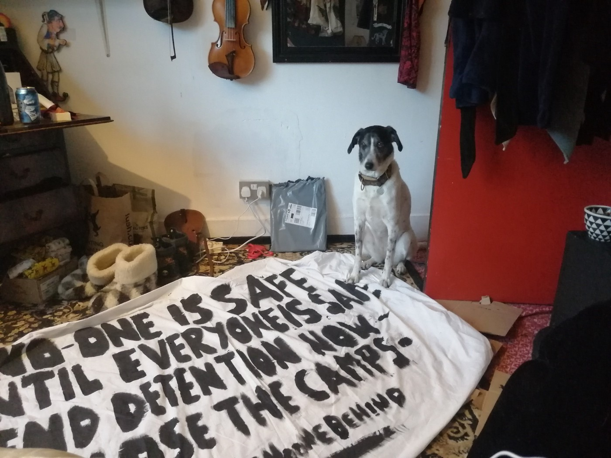
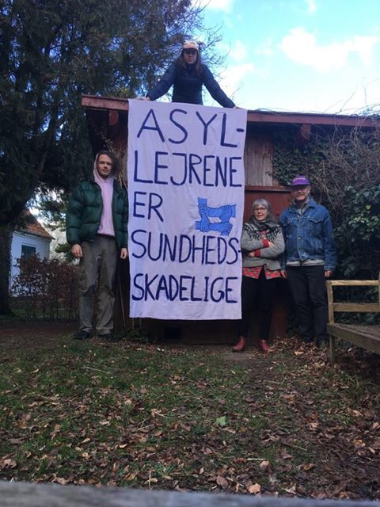
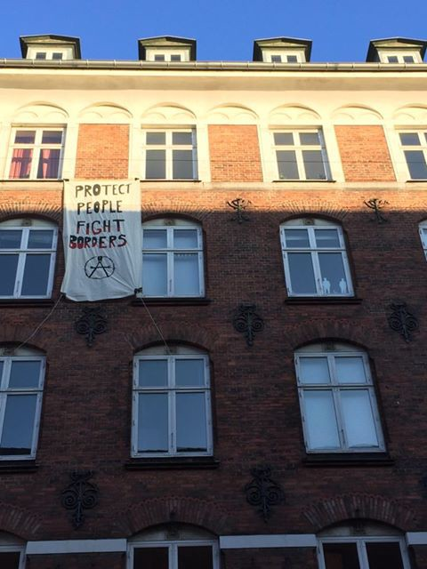
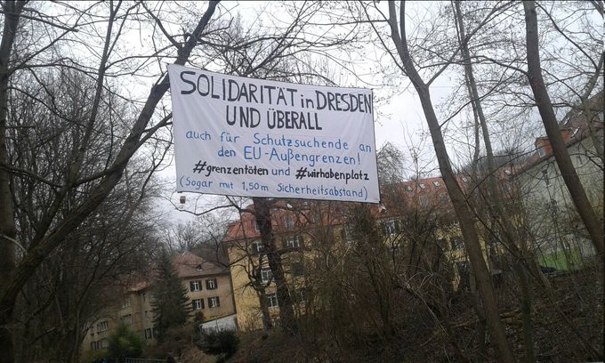
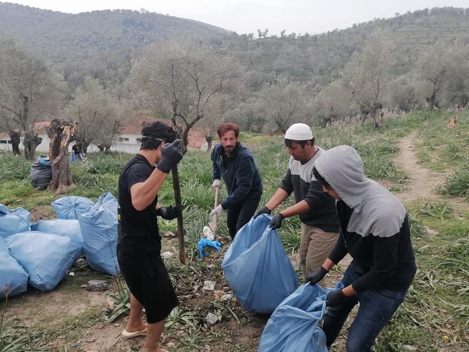
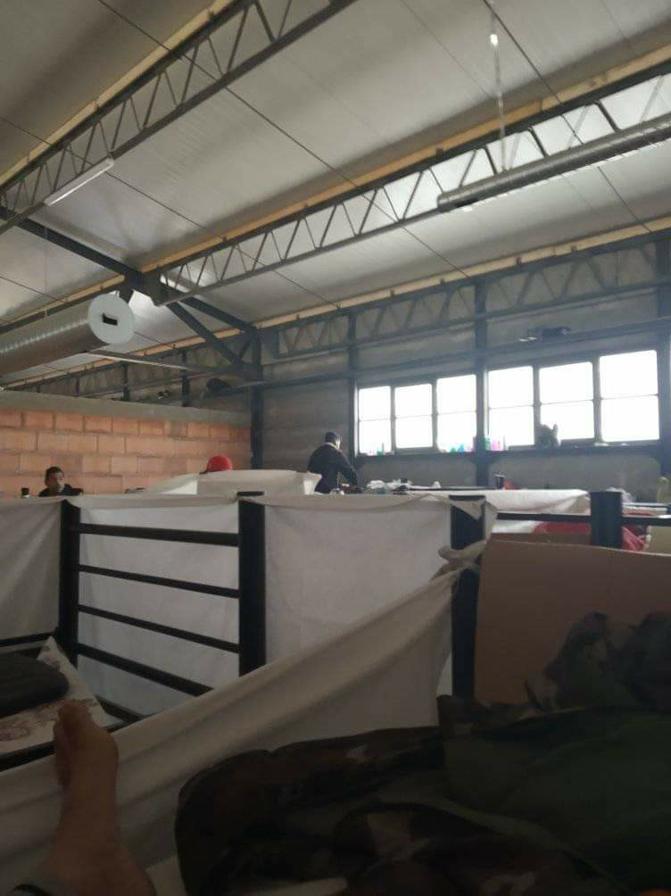

### AYS Weekend Digest 28–29/3/2020 — Demands from a pandemic

PORTUGAL: Asylum Seekers temporarily granted equal rights as citizens\. GREECE: Struggle and solidarity amid pandemic\. TURKEY: People moved to camps close to Syrian border fear deportation\. SEA: Boats in distress in West Med\. BOSNIA: Photos from Blazuj camp\. FRANCE: Protest to halt eviction\. Doctors with refugee status offer help in UK and SERBIA\.

 
 \#CloseTheCamps \#EndDetention \#LeaveNoOneBehind](assets/705c1e0a3b11/1*vC4WjWxLxRtQrWNLkezbhQ.jpeg)

On Sunday 29th, hundreds of people participate in a banner drop organised by [DEMANDS FROM A PENDEMIC](https://www.facebook.com/events/232337231249053/) 
 \#CloseTheCamps \#EndDetention \#LeaveNoOneBehind

**Feature story — [Demands from a Pandemic](https://www.facebook.com/events/232337231249053/)**

In a home based protest that took place this weekend activists across the UK and Ireland stood in solidarity with people on the move and those imprisoned in Greek island camps and detention facilities everywhere\.

 \)](assets/705c1e0a3b11/1*DGPdkYpRgzPjsuLbmrJekQ.jpeg)

\( [Demands from a Pandemic — Close the Camps and end Detention\!](https://www.facebook.com/events/232337231249053/) \)

> WE DEMAND:
 

> \- The immediate evacuation and closure of Moria camp and all refugee camps along the EU’s borders\! 
 

> \- Immediate release for all those imprisoned in UK detention centres and Irish Direct Provision\! 
 

> \- Safe housing for everybody\! Rehouse people from camps and detention centres into adequate and safe accommodation\! Stop ongoing and new evictions of people from UK Home Office accommodation\! 
 

> \- Equal access to healthcare for ALL, regardless of residence status\!
 

> \- End No Recourse to Public Funds and all Hostile Environment policies
 

> \- Residence status for all asylum seekers and undocumented migrants now\! \! 

Similar actions took place over the weekend in Denmark, France and Germany and more are planned\. There was also a [street protest in Berlin](https://twitter.com/EndeGelaendeDD) with appropriate protective measures taken\.

 ‎ [Bannerdrop i en pandemi \#2 — Evakuér Moria\-lejren på Lesbos\!](https://www.facebook.com/events/517656552491457/?acontext=%7B%22ref%22%3A%22106%22%2C%22action_history%22%3A%22null%22%7D) , [Ende Gelände Dresden](https://twitter.com/EndeGelaendeDD) , [Revendications d’une pandémie](https://www.facebook.com/Revendications-dune-pandémie-104626767855812/?tn-str=k%2AF) \)](assets/705c1e0a3b11/1*Hv808Q59xT1QIPuGr7aNdw.jpeg)

\( [Krav fra en pandemi](https://www.facebook.com/kravfraenpandemi/?tn-str=k%2AF) ‎ [Bannerdrop i en pandemi \#2 — Evakuér Moria\-lejren på Lesbos\!](https://www.facebook.com/events/517656552491457/?acontext=%7B%22ref%22%3A%22106%22%2C%22action_history%22%3A%22null%22%7D) , [Ende Gelände Dresden](https://twitter.com/EndeGelaendeDD) , [Revendications d’une pandémie](https://www.facebook.com/Revendications-dune-pandémie-104626767855812/?tn-str=k%2AF) \)

■■■■■■■■■■■■■■ 
> **[heutegibt'sEISbei mir](https://twitter.com/ginsbergEmmi) @ Twitter Says:** 

> > @[_Seebruecke_](https://twitter.com/_Seebruecke_) 
Evakuierung der griechischen Inseln jetzt!! Solidarität ist grenzenlos. #LeaveNoOneBehind #grenzentöten  #RefugeesWelcome https://t.co/j3GnxGti6o 

> **Tweeted at [2020-03-29 15:42:19](https://twitter.com/ginsbergemmi/status/1244288786797858816).** 

■■■■■■■■■■■■■■ 

Further calls here \-

France: [https://www\.facebook\.com/events/2638971093000828/](https://www.facebook.com/events/2638971093000828/) 
Catalunya: [https://www\.facebook\.com/events/s/fuego\-a\-las\-fronteras\-dia\-de\-a/236102787757018/](https://www.facebook.com/events/236102787757018/) 
Germany: [https://www\.facebook\.com/events/s/grenzenlose\-solidaritat\-leaven/212965793357000/](https://www.facebook.com/events/212965793357000/) 
Denmark: [https://www\.facebook\.com/events/517656552491457](https://www.facebook.com/events/517656552491457/) 
Italy: [https://www\.facebook\.com/events/1571971852961452/](https://www.facebook.com/events/1571971852961452/)

In the context of a global pandemic, armchair activism has finally found it’s place, one of the few tools left to us until restrictions are lifted\. Even under these conditions we will not and cannot be silent\.

TURKEY

**Difficult conditions for those evicted from Pazarkule**

 \)](assets/705c1e0a3b11/1*21rW__P4PQXQpFi2Gblwkg.jpeg)

\(Photo Credit: [Human Stories](https://www.facebook.com/humanstoriesgr/?tn-str=k%2AF) \)

Meagre rations for people relocated to Malatya refugee camp in Turkey\. Those evicted from [Pazarkule](https://www.facebook.com/hashtag/pazarkule?epa=HASHTAG) have been transferred to closed camps in the cities near the Syrian border and they fear deportation to Syria\.

SEA

[Salvamento Marítimo](https://twitter.com/salvamentogob) spent the weekend searching for three boats that left Dajla, in Western Sahara, for the Canary Islands on Friday\. They have [spotted two boats](https://www.eldiario.es/canariasahora/365diasmigraciones/Salvamento-Maritimo-localiza-Gran-Canaria_6_1011108886.html) carrying around 60 people and at least one has been rescued\.

GREECE
#### Struggle and Solidarity amidst a pandemic

Lesvos

 volunteers on the ground join the call: bringing refugees to safety has to happen now\. Sign the petition and spread the call: [https://en\.sosmoria\.eu](https://l.facebook.com/l.php?u=https%3A%2F%2Fen.sosmoria.eu%2F%3Ffbclid%3DIwAR0fmDkScX42-pdesnxAwyA743_O5uq2l5rhllmIPEacU2qbtwAYxGmBf_E&h=AT0cVlL3WIw53s9KzsDWh6wRSX18psaIuak1x2vxpMG-dxtbwoDwRFqHWKHxL4slIl8KUe2V7f6rg0j7lva3Ktid592qj_M4K1d4l6iqSCnZaCZ3KJtO_DRRyt7C3pQNUMdM_IbZKZL3EG-VLuhxbzF3cvD9)](assets/705c1e0a3b11/1*FLeEVw4L0JqJtpd_XQHp8A.jpeg)

European medics call for the immediate evacuation of the squalid camps at EU’s borders\. [Medical Volunteers International e\.V\.](https://www.facebook.com/medicalvolunteersinternational/?__tn__=%2CdK%2AF-R&eid=ARBUVjwx7e1uUhQedrxJnBmUmGz6-1DsR1VeGhomkI7hy2FkkRxgpDkAt8Bopwh4AwlTNMQOg29WF_rv&fref=tag) volunteers on the ground join the call: bringing refugees to safety has to happen now\. Sign the petition and spread the call: [https://en\.sosmoria\.eu](https://l.facebook.com/l.php?u=https%3A%2F%2Fen.sosmoria.eu%2F%3Ffbclid%3DIwAR0fmDkScX42-pdesnxAwyA743_O5uq2l5rhllmIPEacU2qbtwAYxGmBf_E&h=AT0cVlL3WIw53s9KzsDWh6wRSX18psaIuak1x2vxpMG-dxtbwoDwRFqHWKHxL4slIl8KUe2V7f6rg0j7lva3Ktid592qj_M4K1d4l6iqSCnZaCZ3KJtO_DRRyt7C3pQNUMdM_IbZKZL3EG-VLuhxbzF3cvD9)

[The Moria Corona Awareness Team](https://www.facebook.com/MoriaCoronaAwarenessTeam/posts/118475256448320) published their multi\-language update on the Covid\-19 situation on the island \(click on the link above for Arabic, French and Farsi\):

> COVID\-19 update: 

> The 76\-year\-old woman who was admitted to hospital last Thursday afternoon, died today due to complications caused by the coronavirus\.
 

> Coronavirus statistics at Lesvos:
 

> 1 healthy\. 3 sick\. 1 dead\. 

Overcrowding, lack of access to water, unhygienic and unsanitary conditions — the well\-known situation of the camp makes it impossible for the people stuck in Moria to follow the basic Covid\-19 prevention rules\.

As shown in this [video](https://www.facebook.com/MoriaCoronaAwarenessTeam/videos/596581584551472/?v=596581584551472) , Greek authorities have installed one medical container to report suspected cases of Covid\-19\. One single container for over 20,000 people, and some Greek media [reported it as a great achievement](https://www.keeptalkinggreece.com/2020/03/28/moria-coronavirus-medical-center/#.Xn95zA2v6vs.facebook) …

In the meanwhile, the Moria Corona Awareness Team have organised [rubbish collection groups](https://www.facebook.com/MoriaCoronaAwarenessTeam/videos/211479166793937) within and around the camp, and they are suggesting to all the residents to [minimise unnecessary contact with the rest of the island](https://www.facebook.com/MoriaCoronaAwarenessTeam/videos/2827024794071135/?v=2827024794071135) to avoid spreading the virus within the camp\.

 \)](assets/705c1e0a3b11/1*2bzLAUgABrYzYpdkuUuGew.jpeg)

Garbage collection on Thursday 26th of March \(Photos by [MCAT](https://www.facebook.com/MoriaCoronaAwarenessTeam/posts/116919043270608) \)

[Covid\-19 Emergency Response Fund](https://www.wwbt.org/covid-19.html?fbclid=IwAR3BHvxkDmbtFK-P0rYI-EcV7f6rvzl4ksK8kF2U9DHu1JR8OcpE9xSuays) has been set up to provide Moria with material for 40,000 masks, sewing machines, hand sanitiser and to set up a health clinic in the camp\. Contribute if you can\.

Team Humanity is also operating towards the safety of Moria’s residents:

[![The team have been working hard to give each person in Moria refugee camp a mask, 2 soaps and a flyer with instructions, for 3 days now they have done such amazing work, 1 team of girls are sewing masks in Hope & Peace center next to moria refugee camp and the 2 team are in the camp distributing to everyone so we can save and prevent everyone from harm in the camp. Please continue supporting us as we are in urgent need of help. https://www.facebook.com/donate/229784944873135/?fundraiser_source=external_url https://gogetfunding.com/team-humanity-hope-peace-center/ PayPal: donation@teamhumanity.eu MobilePay: 13319 #maskfactory #weneedhelpnow #innocentpeople #moriarefugeecamp #innocentwomenandchildren #unitedwestand #togetherwearestronger #savethisworld #theworldiscryingforhelp #teamhumanity #hope&peacecenter #salamaldeen]( "The team have been working hard to give each person in Moria refugee camp a mask, 2 soaps and a flyer with instructions, for 3 days now they have done such amazing work, 1 team of girls are sewing masks in Hope & Peace center next to moria refugee camp and the 2 team are in the camp distributing to everyone so we can save and prevent everyone from harm in the camp. Please continue supporting us as we are in urgent need of help. https://www.facebook.com/donate/229784944873135/?fundraiser_source=external_url https://gogetfunding.com/team-humanity-hope-peace-center/ PayPal: donation@teamhumanity.eu MobilePay: 13319 #maskfactory #weneedhelpnow #innocentpeople #moriarefugeecamp #innocentwomenandchildren #unitedwestand #togetherwearestronger #savethisworld #theworldiscryingforhelp #teamhumanity #hope&peacecenter #salamaldeen")](https://www.instagram.com/p/B-UONpsHQSC/embed/?cr=1&rd=https%3A%2F%2Fwww.instagram.com)

> The team have been working hard to give each person in Moria refugee camp a mask, 2 soaps and a flyer with instructions, for 3 days now they have done such amazing work, 1 team of girls are sewing masks in Hope & Peace centre next to Moria refugee camp and 2 teams are in the camp distributing to everyone so we can save and prevent everyone from harm in the camp\.
 

> Please continue supporting us as we are in urgent need of help\. 

On Saturday another fire broke out in the olive grove outside the camp\.

■■■■■■■■■■■■■■ 
> **[Begüm Başdaş](https://twitter.com/BegumBasdas) @ Twitter Says:** 

> > Another fire in #MoriaCamp is reported by the residents today.

Fire destroyed two tents, damaged more.

Thankfully no one was hurt, they say.
The residents were again mostly on their own to stop the fire. 
#refugeesgr
#LeaveNoOneBehind 

📸 by Moria resident https://t.co/9QPg6BWRCk 

> **Tweeted at [2020-03-28 23:38:55](https://twitter.com/begumbasdas/status/1244046338658119681).** 

■■■■■■■■■■■■■■ 

CHIOS

The [Chios People’s Warehouse](https://www.facebook.com/chiospeopleskitchen/posts/754918718370002) , despite being the victim of an arson attack in early March, is still supporting people stuck on the island\. Strict isolation measures have been put in place to protect the island’s population from the coronavirus\.
As a result, the kitchen is no longer able to cook and provide hot meals\. However, they have adapted to the changing circumstances and continue to operate by delivering dry and fresh food packages that enable people to cook for themselves\. They have distributed 100 bags of food to refugee families over the past ten days and they will start delivering fresh fruit to unaccompanied minors housed in the camp over the next few days\.

European court of Human Rights ruling:

■■■■■■■■■■■■■■ 
> **[Equal Rights Beyond Borders](https://twitter.com/EqualRightsBB) @ Twitter Says:** 

> > The @[ECHR_CEDH](https://twitter.com/ECHR_CEDH) obliges 🇬🇷in interim measures proceedings to provide suitable healthcare to vulnerable  applicant living in the camp Vial and is implicitly warning 🇬🇷 to implement adequate measures to counter #corona virus in 🇪🇺Hotspots.
👉[bit.ly/echrcorona](https://bit.ly/echrcorona)
#LeaveNoOneBehind https://t.co/IAZfi9APQA 

> **Tweeted at [2020-03-27 15:58:16](https://twitter.com/equalrightsbb/status/1243568028354256899).** 

■■■■■■■■■■■■■■ 

KOS

■■■■■■■■■■■■■■ 
> **[Katy Fallon](https://twitter.com/katymfallon) @ Twitter Says:** 

> > Some updates from Kos, according to ppl I’m speaking with they were handed out soap yesterday, which is good, but bathrooms & water situation still sporadic & often in bad shape.

Still shows how much work there is to be done to actually protect camp residents against COVID-19. https://t.co/ZLntTY3cpn 

> **Tweeted at [2020-03-28 11:03:09](https://twitter.com/katymfallon/status/1243856145904787456).** 

■■■■■■■■■■■■■■ 

RHODES

[Solidarity Groups in the Dodecannese Islands](https://www.facebook.com/groups/DodecaneseSolidarity/) reported that racist far\-righters on Rhodes were planning attacks against refugees on the island, taking advantage of the movement restriction imposed due to the spread of coronavirus\. Read more [HERE](https://racistcrimeswatch.wordpress.com/2020/03/29/1-986/) \(in Greek\) \.

PATRAS

[No Name Kitchen](https://www.facebook.com/NoNameKitchenBelgrade/posts/947980018933616) are still active on the ground\. Despite having only one volunteer in Patras since the beginning of the lockdown, they have visited the squats in the port area every day\. They are working with a student from Patras helping in the field and their local partner KINISIS who helps during distributions at the factories, and provided masks, gloves and advice\.

> All our work stands in the terms of preventing SARS\-CoV\-2 \(Corona\) to spread into the squats and to the people we visit\. We’re are still taking care of around 200–210 people a week, with distributing food, sanitary items, medical care and solidarity\!
 

> Our work is done wearing gloves and masks these days and changing them every time we visit a different spot\. That creates a greater distance from the people we usually quite close to but that’s what has to be done\. 

They distribute soap, shower gel and shampoo, set up washing stations, and measure temperatures of those living in the squats\.

> \[On Saturday 28th,\] the first person we were treating showed an increased temperature and was therefore told to stay isolated from the other people while we supported him\. After consultation with the doctor from our local partner KINISIS we were told to observe the situation and will measure the temperature again on Sunday\. At the time, we are working on a way to get him tested for Covid\-19\.
 

> Fortunately thanks to our good relationship to the people we always have friends living in the squats who help us translating and making sure our suggestions are taken dead serious\. 

They continue treating around 20–30 people per day for problems caused by living in unsafe conditions in abandoned factories and for injuries caused by police and security companies\.

> Unfortunately there were at least three accidents at the port side, with people being met by the absolute disproportionate action of the police\. Which means that police and commandos at the port are still beating people who surrender\. 

\(Quoted text by Alexander Sawizki, No Name Kitchen Patras\)

ATHENS

As in many other countries, people have started organising to respond to the lack of policies to protect the most vulnerable groups from the combined effects of Covid\-19 and lockdown measures\.

[Steps](https://www.facebook.com/stepsgr/) , [Khora Social Kitchen](https://www.facebook.com/KhoraAthens/) , [Mano Aperta](https://www.facebook.com/manoaperta1) and [Hope Cafe](https://www.facebook.com/soulfoodforrefugees/) have started working together — also with the support of [Pampiraki Support Initiative](https://www.facebook.com/groups/PAMPIRAIKI/) , [SOS Refugiados](https://www.facebook.com/sosrefugiados/) and [Help Refugees](https://www.facebook.com/HelpRefugeesUK/) — and have created [Many Stops](https://www.facebook.com/stepsgr/posts/1307598109434766) , a food distribution action to be able to reach the homeless people of Athens\. Everyday they cook and distribute around 200 portions of food and distribute them around town between 5pm and 7pm\.

Also, Khora Social Kitchen is open for take\-away meals, Monday to Friday, from 12\.30 to 16\.00 in Kastalias 13, Kipseli\.

[Ο Αλλος Ανθρωπος](https://www.facebook.com/%CE%9F-%CE%91%CE%BB%CE%BB%CE%BF%CF%82-%CE%91%CE%BD%CE%B8%CF%81%CF%89%CF%80%CE%BF%CF%82-%CE%9A%CE%BF%CE%B9%CE%BD%CF%89%CE%BD%CE%B9%CE%BA%CE%B7-%CE%9A%CE%BF%CF%85%CE%B6%CE%B9%CE%BD%CE%B1-%CE%94%CF%89%CF%81%CE%B5%CE%B1%CE%BD-%CE%A6%CE%B1%CE%B3%CE%B7%CF%84%CE%BF-%CE%93%CE%B9%CE%B1-%CE%9F%CE%BB%CE%BF%CF%85%CF%82-628150187199571/?__tn__=kC-R&eid=ARBIL8hJ7eXl0YbW9wUL0k-3gyE4QwJ3WkAvS9eH3aO7W2CzwXiYJnxcJ9zwNhQiNLYGbFYqc5_Q8Ucz&hc_ref=ARSKN5DgELuFlQb7GhVI9YC8T7kFjI3cpoNu4mFhphVnyd8wewRINv5qrez3WIo_4J0&fref=nf&__xts__%5B0%5D=68.ARDI--SO2RXHTypmlhh3rvy25EllY5fwgGd3flP0ZEKdvw_LPeX-4CEv9gAOz_JJf6VYbeIJj645UCLUm4TvTK6S7BKMPTOcYRXvvFNEA1hgIzU11XsyHszrEUgLfspCPN1lyLRW9R2FyijWCQBMmJzRCHs-9t8cr0K5bSlK6eLbPJhYV3AZ6KInHb2C3sG3Sft0Q0jDjk3mNeXzaGkE4o1RugCpSmOOnMC3l3X3ZzGawmXIwiBH_iSTTYtOIC2jtUwJ3MIZ1YqfCLS8E7sBsps5bdlvo0owr8zYWGfBuYSRVgXpiYBDmXpaIwEK-vlWqZOHXIYByxcsCE3KHBXR8w) \(The other man\) Social Kitchen is cooking and distributing food every day in Megalou Alexandrou 122, Keramikos\.

A list of mutual support groups in Greece is being updated [HERE](https://menoumemazi.org/stirizoume-ebrakta/) \.
#### Frontex Executive Director reminds his staff of their priorities

In an internal staff email sent last week and seen by EUobserver, Frontex’s Executive Director Fabrice Leggeri said they had a legal obligation to support Greece\. This means that, despite the coronavirus outbreak, there will be “no reduction of deployment needs” for three of its missions along the Greek land and sea borders with Turkey, he said\. The missions include the so\-called rapid border interventions where Frontex sent in an extra 100 officers to the land border, along with helicopters, boats and other surveillance equipment earlier this month\.

Read more [HERE](https://euobserver.com/migration/147901) \.

BiH
#### **COVID\-19 cases update**

On Saturday it was [reported](https://www.facebook.com/info.point.covid19/posts/106696504315264) that nine people had tested positive for COVID\-19 in Tuzla Canton and a new order has been made not to move around in public places without protective equipment \(face masks and gloves\) \.
#### **Situation in camps getting worse under lockdown**

New tents have been put up to isolate people as they can no longer leave the camps\. Inside they are full of bunk beds…

 \)](assets/705c1e0a3b11/1*oQ-yRC2DiyPArzRcmJV4gw.jpeg)

\(Photo Credit: [Crveni križ Unsko sanskog kantona](https://www.facebook.com/Crveni-križ-Unsko-sanskog-kantona-52572773380/?__tn__=kCH-R&eid=ARDp_M7CLfvFqKRuYAonIevFKIlAQXlNgjgiYv7QvSpJxFVk3HbGOtF-V9uljnD9Cc8jDLLPtdf85emT&hc_ref=ARQq1131h6HzC4cVdavi7uhearURIHwT92ISQFzGErQpExxCYPO6oi9-OyG8txQPWEE&fref=nf&__xts__[0]=68.ARDKYPY9h8PgawI1gfYR3Zmyl1W_XgTPlQ7kaj_3TF9PVE-PQ1EvJIIwAVnF2suIJW_lE_qRiG27nLcCX9bG5ym0pqvNKu5MDNts94fsX-wk9Fa4yPyH20oKQdHT2aefMOJWy6BLVmZDxgS7TFOLLNIwSvEe67vvkq_w6r64rEL_DfLOiBPDk1u6e_szLQ4rfetzoTMN7LQJzBZYoqypPFoIYlUJShjv1whJw0bf-6hJ0bUOrr62rqycFqPBs4j0qwIpw5Yub2GEbghMeG9HWnKRgb1Y77Fm3eF_Gi50gbhRb_l1bgABHuYP51pc3C-IvdZpCC-0fSnaCq60v_qxcCVCYH4A-P0xiu4ihJHY8Gma3PHFIYF6a50Ro5HYFgzphcVCBvUJDFOlY5PMUExkvFqz74cxHwTJ-OGPBAPbzPG_YCg28jVyK6fwHC4nLcm6NmvFiYw9Td0IqborjMuXvzH9pwLkWzajh_HVyjLA74uZhHKr95A) \)

[Help for People on the move in Bosnia](https://www.facebook.com/groups/144469886266984/permalink/535533293827306/) have shared photos of an IOM run camp near Sarajevo\.

 \)](assets/705c1e0a3b11/1*yCttuPstV4pT4eAuEjb3QA.jpeg)

\(Photo Credit: [Help for people on the move in Bosnia](https://www.facebook.com/groups/144469886266984/permalink/535533293827306/) \)

> Camp Blazuj, Anno Domini 2020 \(28\. March 2020\. \) 

> While they convince us that roses bloom in the camps, we get pictures of horror\. We have information to beat people and everyone complain about getting very little food\. Some of the people told us they took their phones away, so we are aware that we might be getting the last pictures from the camp so the truth wouldn’t come out\. Our moral duty is to share this because we are their only voice, and if they cut off our contacts, we can only guess that the situation is getting worse\. We are their only voice, we must not be silent\. 

> Around 3000 people are expected to “fit” in this camp\. 

[Another report from Bira](https://www.facebook.com/photo.php?fbid=1142528602767787&set=a.152333821787275&type=3&theater) states that locals are not even allowed to deliver food to individuals in the camp anymore as it is not authorised during the lockdown\.

> But we all buy food from the supermarket, don’t we?
 

>  We all go to shopping\. 
 

>  Why aren’t they allowed to have anything?
 

>  I remind you that they are locked in there like animals\.
 

>  He dropped the phone and left without wanting to talk to me anymore\. 
 

>  
 

>  Do we realise how serious all this is?
 

>  Do we realise how bad this is? 

**Racist bus driver get what he deserves**

Someone managed to film a racist bus driver as he tried to kick a refugee who was trying to enter his bus\. He then fell out of the bus himself…

SERBIA

[Local media reports](http://www.h-alter.org/vijesti/srbija-izbjeglice-i-migranti-nude-svoju-pomoc-tijekom-izvanrednog-stanja?fbclid=IwAR0X5dFVmt8fACaK0GnWvAe-shqHDZStYq-R2DaW7RVLW6HheaOUA_sCtsQ) that refugees and migrants housed at the Bujanovac Reception Center have sent a letter to offer their help during this state of emergency\.

> There are paramedics, workers, farmers among us, but we are first and foremost people who offer every kind of assistance the Government deems necessary — from medical, through quarantine, to street cleaning 

On man, Habib Soheli from Iran, is currently sewing up to 40 masks a day\.

FRANCE

**Utopia 56 still working**

[Utopia 56](https://www.facebook.com/asso.utopia56/photos/a.1080057285359396/3095706687127769/?type=3&theater) are continuing distribution as best they can in these difficult times to people on the street throughout Northern France\. You can donate to particular areas to support their work using these links\.
 👉 [Utopia 56 Calais](https://www.facebook.com/Utopia-56-Calais-258099198180444/?__tn__=%2CdK%2AF-R&eid=ARDqBlPry-qbBu34UX71IXqf7dx-_Kl9C_tCsfmS0jVCK3lzjXGtx7FuuHpun4uwsq-yhjFoYNvRWc1I&fref=tag) 
 👉 [Utopia 56 Lille](https://www.facebook.com/utopia56lillecollecte/?__tn__=%2CdK%2AF-R&eid=ARBT-btpntilzXRLfhsmyCDEsg1MZscYPBBfyCXeW9vSkgGOodFHjT6j1IskSlHkw_aMZzOkrKr3miCC&fref=tag) 
 👉 [Utopia 56 Paris et Ile\-de\-France](https://www.facebook.com/U56ParisIDF/?__tn__=%2CdK%2AF-R&eid=ARCkrvoiL011-gUAyPqds2BQVWcAtxtAeVcTa11WXu_Zb-WOk7MXMY-CUJUHmnw8p8EVAM-jhrIX64dF&fref=tag) 
 👉 [Utopia 56 Rennes](https://www.facebook.com/utopia56Rennes/?__tn__=%2CdK%2AF-R&eid=ARDspzgutr5IcUdMJ8gBHhMOFaVAS0mVwbGfcageMS7v04trrHzorVi_XaMl2YMSCebxvgIhRCVLJdyS&fref=tag) 
 👉 [Utopia 56 Toulouse](https://www.facebook.com/utopia56toulousehebergementcitoyen/?__tn__=%2CdK%2AF-R&eid=ARDrkMeLCElPjo89Mek6IrEEYX3wRGq8KlyYN5eRQIzxNB7XritMQcj9b6BgrHvSLX7UbFvYEBER0G5d&fref=tag)

**Protests against evictions**

Local activists are calling for evictions to be halted and for empty housing to be put to good use [housing people](https://www.facebook.com/groups/177642579245883/permalink/1107677206242411/?hc_location=ufi#) on the move\.

■■■■■■■■■■■■■■ 
> **[Marche des Solidarités](https://twitter.com/MSolidarites) @ Twitter Says:** 

> > Mobilisation des militant.e.s de l'assemblée antiraciste du 20ème devant le F1 de la porte de Montreuil qui a commencé à expulser cette semaine des personnes qui y logeaient. L'hôtel a déjà annoncé que les dernières expulsions auraient lieu demain #droitaulogement #28mars https://t.co/qOpR0zFsm8 

> **Tweeted at [2020-03-28 18:30:31](https://twitter.com/msolidarites/status/1243968728846516225).** 

■■■■■■■■■■■■■■ 

PORTUGAL

**Asylum Seekers granted equal rights with citizens**

■■■■■■■■■■■■■■ 
> **[Zoe Gardner](https://twitter.com/ZoeJardiniere) @ Twitter Says:** 

> > Portuguese government has decreed that ALL asylum seekers and ALL undocumented migrants with pending applications for residence are AUTOMATICALLY granted and may access ALL STATE PROVISION including healthcare and benefits. I'm going to faint. [publico.pt/2020/03/28/soc…](https://www.publico.pt/2020/03/28/sociedade/noticia/governo-regulariza-imigrantes-pedidos-pendentes-sef-1909791) 

> **Tweeted at [2020-03-28 11:06:53](https://twitter.com/zoejardiniere/status/1243857085877682177).** 

■■■■■■■■■■■■■■ 

UK

Further [offers of support](https://www.facebook.com/groups/donate4refugees/permalink/2602789936497908/) have been given by doctors with refugee status in the UK\. In a [letter](https://www.facebook.com/roger.roberts.319/posts/10156735722856199) sent to MPs they state:

> We are a group of hundreds of refugee doctors who are living in the UK\. Currently, we are in the middle of process of getting registration to practice medicine\. Also, our final licencing exam\(PLAB 2\) has been cancelled until July and could be cancelled again\. 

> In light of the current pandemic of the covid\-19, we need your support to put much more pressure on General Medical Council\(GMC\)and parliament to make decision regarding registration of refugee doctors who live in the UK\. 

> We are qualified doctors coming from crisis areas, so we faced such challenges\. Also, we have the drive, courage, knowledge, experience and language to deal with such crisis\. We need to pay back something and risk ourselves to the UK which support us\. We are ready immediately and more than happy to help NHS and patients\. 

> Best regards, 

> Yasir Abdulhussein 

_Converted [Medium Post](https://medium.com/are-you-syrious/ays-weekend-digest-28-29-3-2020-demands-from-a-pandemic-705c1e0a3b11) by [ZMediumToMarkdown](https://github.com/ZhgChgLi/ZMediumToMarkdown)._
