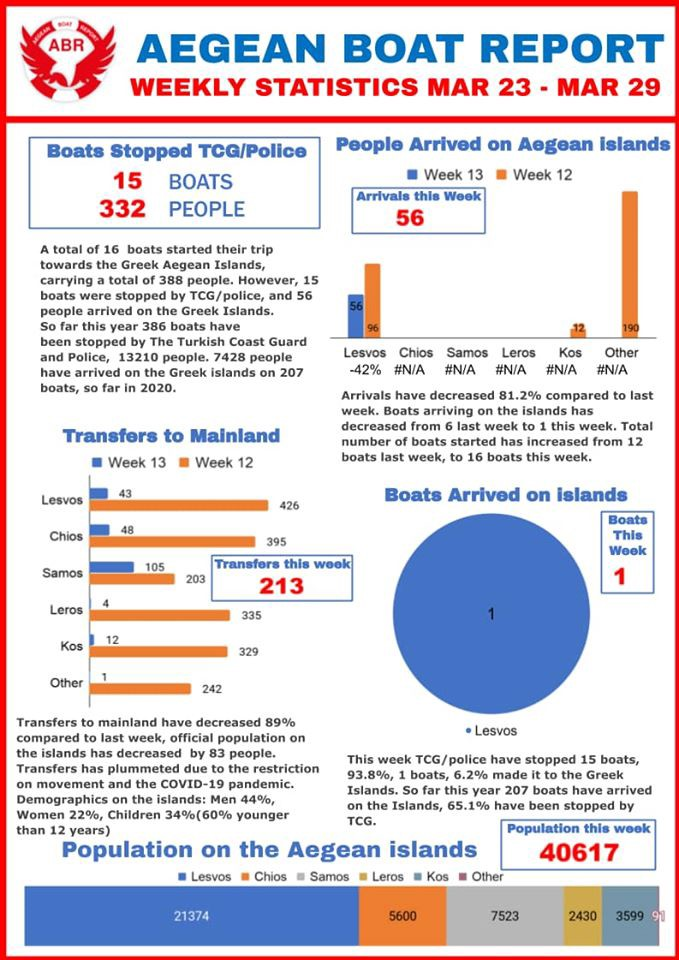
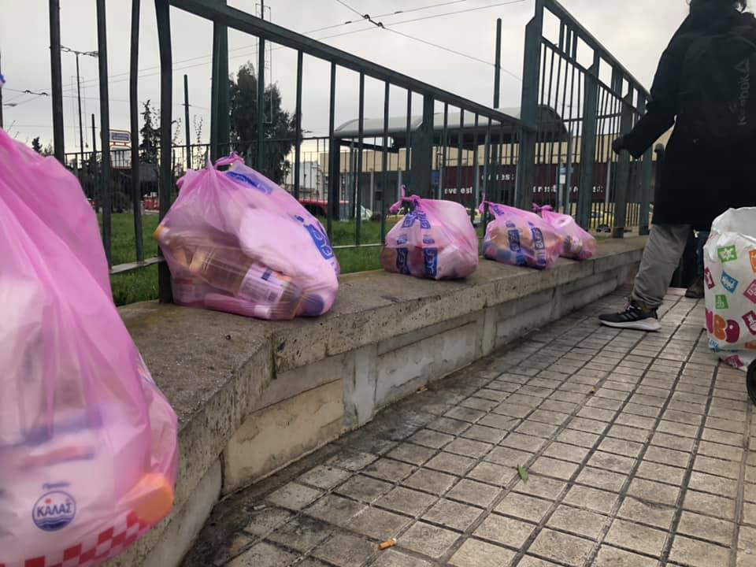
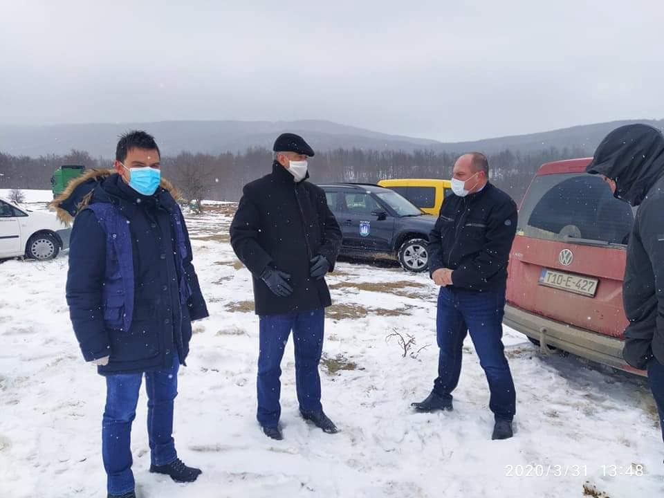
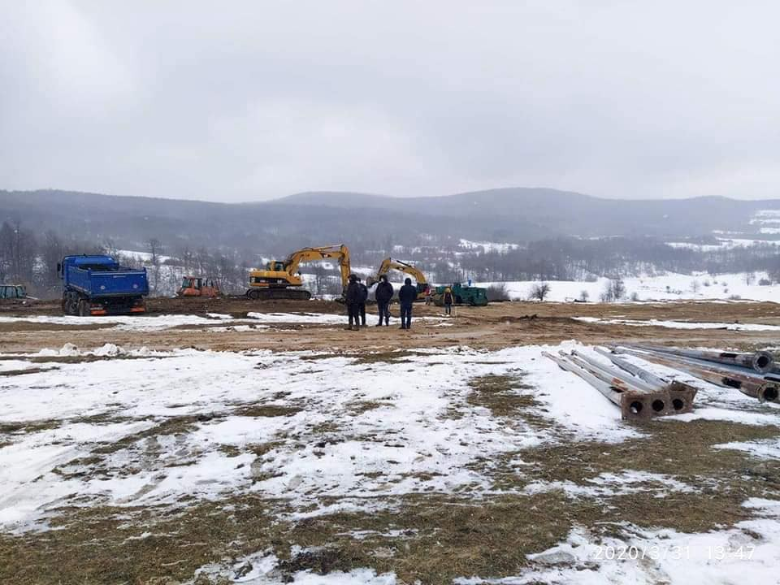
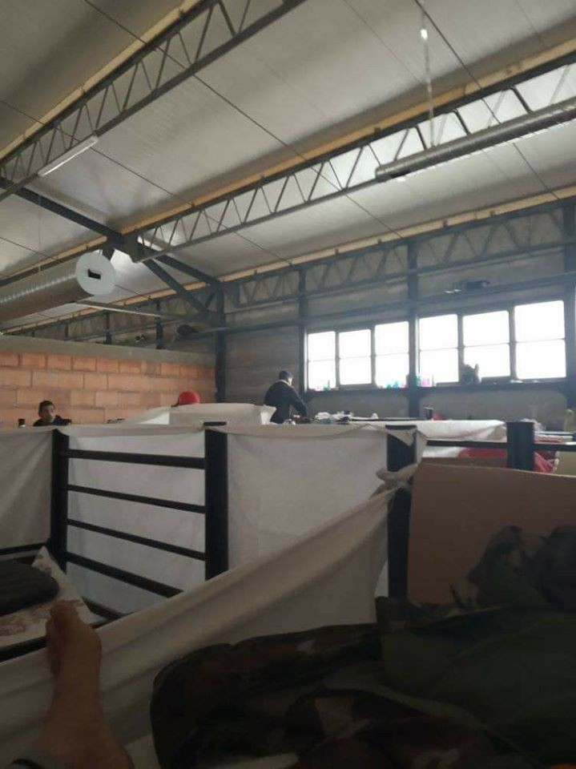
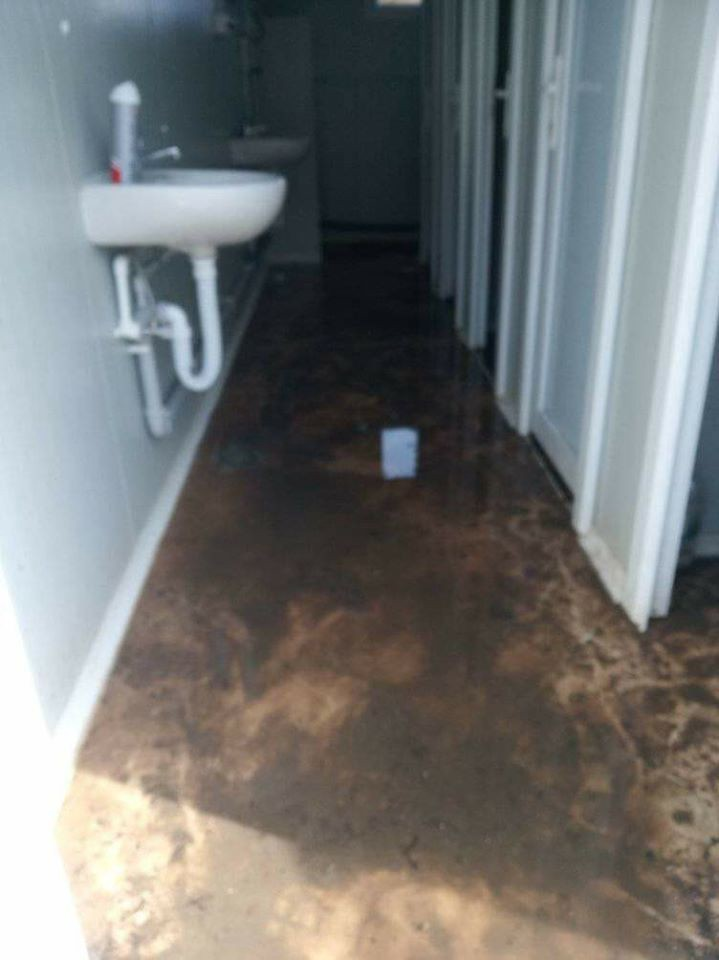

### AYS Daily Digest 31/03/2020 Refugee woman who gave birth in Athens tests COVID\-19 positive

_175 people stranded in waters near Cyprus // Salvamento Maritimo says 8 year old girl traveled 4 days alone across Med // horrible conditions in closed camps in Bosnia due to COIVD\-19 fears // update on Calais // and more…_

](assets/1b1c43be1eb2/1*TPbpGc1D8_RPuGox9nSdtQ.jpeg)

Photo by [Καμιά Ανοχή](https://www.facebook.com/KamiaAnohi/?tn-str=k%2AF)
### FEATURE: A woman who gave birth on Sunday at a hospital in Athens, tests positive for COVID\-19\. She was living in a refugee camp in Ritsona, northeast of Athens\.

She was tested on Tuesday, as well as the baby and the baby’s father\. Both of them were found to be negative\. According to Greek media, the government response includes:

> “The National Public Health Organization \(EODY\) has sent a team to the camp to investigate whether the unnamed woman was infected there or after leaving the facility\. EODY will also try to trace everyone she may have to come into contact with\. 

> Authorities at Ritsona have created isolation quarters for people displaying symptoms of Covid\-19\.” 

[10 of the hospital staff](https://www.lesvosnews.net/articles/news-categories/ellada/thetiki-gynaika-ston-koronoio-apo-ti-domi-filoxenias-metanaston?fbclid=IwAR1sYYI-bCxoZH3MKKs-LTDjQdkchFkGIDEX_vCU9c2CEsTu4_KeXCIn6sA) who came into contact with her are in quarantine\. It is still very unclear as to where she got the virus, because another person who she lived with tested negative as well\.

The narrative in the TV media however has not been kind\. Καμιά Ανοχή explains:

> “The media tv narrative did not miss an opportunity to frame the news with xenophobic hints, as if what we were missing in the deadly pandemic It’s the excess of racism and misogyny\. 

> Stop \(putting the\) blame on people, especially those and those that the state consciously left in the horrible concentration camps\. In Ritsona Live 2800 prosphýgisses and refugees in miserable conditions, as in Moria, Bial and in every outdoor prison created to shut up the hope of the refugees for a new life\.” 

Of course a pregnant woman whose living in a refugee camp has contracted the virus\. Pregnant women all of the world have gotten the virus during the pandemic\. It’s not a shock that the lack of resources and attention given to refugees, and being generally prepared, has resulted in this woman’s unfortunate situation\. We cannot change what people didn’t do in the past, but we can try our best to change the response moving forward\. **Greece needs to alleviate it’s refugee camps\. Greece must evacuate the islands\. Solidarity now\!**
#### TUNISIA

The Middle East Monitor is reporting that the Tunisian Foreign Minister Noureddine Erray is mobilizing financial support for Palestinian refugees during the pandemic with the UNRWA\. The Foreign Minister stressed that Tunsia is behind the Palestinian cause\. More [here](https://www.middleeastmonitor.com/20200331-tunisia-mobilises-financial-support-for-palestine-refugees/?fbclid=IwAR3PojKtV2X-VdJyy9uefi9m0na1cJ4Tg0BdX1rh2UVJ8vuTp85nnbgkhMA) \.
#### GREECE

![“This morning at 01\.30, **two life rafts carrying 39 people, 7 children, 12 women and 20 men** , was found drifting close to the Greek sea boarder outside Dikili\. **According to the statement from the passengers, obtained by TCG, Greek coast guard had put them in the rafts and left them at the Turkish sea border\.** In one week six life rafts carrying refugees has been detected by TCG, similar statement has been given in all six cases\. The rafts have been found from Datça in the south to Dikili in the north, a stretch of 170 miles\. To pick up people from boats heading to Greece, inside Greek waters, force them in to life rafts and leave them in a helpless state at the border, would be a violation of international maritime law, if this in fact is the case\. The last two incidents was most likely heading to Lesvos south\.” Photo by [Aegean Boat Report](https://www.facebook.com/AegeanBoatReport/posts/801935850329521?hc_location=ufi)](assets/1b1c43be1eb2/1*Q0oirGVNuNxK6rWzFiwvbg.jpeg)

“This morning at 01\.30, **two life rafts carrying 39 people, 7 children, 12 women and 20 men** , was found drifting close to the Greek sea boarder outside Dikili\. **According to the statement from the passengers, obtained by TCG, Greek coast guard had put them in the rafts and left them at the Turkish sea border\.** In one week six life rafts carrying refugees has been detected by TCG, similar statement has been given in all six cases\. The rafts have been found from Datça in the south to Dikili in the north, a stretch of 170 miles\. To pick up people from boats heading to Greece, inside Greek waters, force them in to life rafts and leave them in a helpless state at the border, would be a violation of international maritime law, if this in fact is the case\. The last two incidents was most likely heading to Lesvos south\.” Photo by [Aegean Boat Report](https://www.facebook.com/AegeanBoatReport/posts/801935850329521?hc_location=ufi)

Please let people know about [the Greek Council for Refugees Online Helpdesk](https://www.facebook.com/groups/AthensVolunteersInformation/permalink/2035585186573768/?hc_location=ufi) \. They can send online messages to them about:
- their asylum applications;
- issues related to integration in Greece; or
- any other questions they may have\.

They can send a message directly through their Facebook page, but the must let the helpdesk know the following:
1. Where in Greece they are?
2. What do they need \(what is their request\)?
3. Which language do they speak?

### Here is some tragically excellent footage by ReFOCUS Media Labs and edited by Yousef Eldin on the situation in Lesvos

[This is reality](https://www.bbc.com/news/av/world-52095552/coronavirus-protecting-yourself-in-a-migrant-camp?fbclid=IwAR25mAA3ZhhEbrVzs8tKLtCD52M1PKG3ZiSzsovKbq8oytgCLaPxJngJ1aE) …and it’s looming\. Brace yourselves for what April and May might bring\.

Stand by Me’s facility on Lesvos was destroyed in a fire on Tuesday morning\. Since this is the third organization on Lesvos having problems with fire, the investigators are not ruling out arson\. More [here](http://www.ekathimerini.com/251179/article/ekathimerini/news/fire-destroys-refugee-ngos-facilities-on-lesvos?fbclid=IwAR01X1gYVpUIwJn7y-cJp6p1tHeST5tidtllrEjuCVOVH74n1UZOIpoweHc) \.

■■■■■■■■■■■■■■ 
> **[Vassilis Tsarnas](https://twitter.com/VassilisTsarnas) @ Twitter Says:** 

> > The High Administrative Court of #Greece issued a temporary injunction ordering that 2 Afghan women who appealed against their expulsion &amp; the authorities' denial of their right to apply for #asylum will not have to leave the country and their case will be reexamined.
#RefugeesGr 

> **Tweeted at [2020-03-31 21:01:16](https://twitter.com/vassilistsarnas/status/1245093830350835713).** 

■■■■■■■■■■■■■■ 

More [here](https://www.gcr.gr/en/news/press-releases-announcements/item/1416-sxolio-tou-esp-sxetika-me-tin-prosorini-diatagi-tou-ste?fbclid=IwAR2tlWIW6bps5ri9g0Soo15tMy_H46NNL75ghkqGqp3HWwgE6C_1YgXWMIA) \.
### Greek Media reported that Greece will open some ports to accepting people from Libya, so that they can relocated to other member countries\.

[Crete](https://www.efsyn.gr/efkriti/koinonia/237296_stin-kriti-oi-metanastes-apo-ti-libyi) seems to be chosen as the first port:

> “Specifically, the government appears to have accepted Crete as a place of destination for immigrants, which will be engaged in a business aimed at monitoring the eastern Mediterranean region to prevent alleged arms trafficking in Libya, it said in a statement\. Member of Heraklion, Syriza, Socrates Vardakis\.” 

Human Rights Watch said in a report on Tuesday:

> “Greek authorities are arbitrarily detaining nearly 2,000 migrants and asylum seekers in unacceptable conditions, and denying them the right to lodge asylum claims, in two recently established detention sites on mainland Greece, Human Rights Watch said today\. Authorities claim they are holding the new arrivals, including children, persons with disabilities, older people, and pregnant women, in quarantine due to COVID\-19, but the absence of even basic health precautions is likely to help the virus spread\.” 

_“If the government is serious about preventing COVID\-19 transmission and illness among migrants and asylum seekers, it needs to scale up testing, provide more tents, and give people enough toilets, water, and soap, and put in place prevention interventions,” said Belkis Wille, senior Crisis and Conflict researcher at Human Rights Watch\. “Forcing people, some of whom are at high risk of severe disease or death, to live in dirty and unsanitary conditions, cramped together in close quarters, is a recipe for spreading the virus, not to mention is degrading and inhumane\.”_ [Read the full report here\.](https://www.hrw.org/news/2020/03/31/greece-nearly-2000-new-arrivals-detained-overcrowded-mainland-camps?fbclid=IwAR3MOSCPTcMkvwE98SgyLaD--AGkww18SIA398uNeC4GPyN0IEQh49XaxkY#)

![“Sharing \#HopeBags in times of \#Corona in Athen \#Greece\! Since last week we start to share Hope Bags which include: toilet paper, macaroni, pampers, disinfecting \(materials\) and mask etc… As we started we become more messages, than we expected from \#homeless families and single people in \#Athens\. We looking forward too help this people everyday with our Hope Bags\. As you know we need support from you to \#support the \#people\. You can send us a private message for the PayPal link or you order online by a supermarket some stuff for our Hope Bags to \#cafe\_patogh\. In Times of Corona \#Soldarity is more needed than ever before\! Please we don’t leave no one Behind\! We stand with Homeless people\.” Photo by [Our House](https://www.facebook.com/ourhousegr/posts/2579686722283158)](assets/1b1c43be1eb2/1*cdlUkXUDytSkMLIbC2WyBw.jpeg)

“Sharing \#HopeBags in times of \#Corona in Athen \#Greece\! Since last week we start to share Hope Bags which include: toilet paper, macaroni, pampers, disinfecting \(materials\) and mask etc… As we started we become more messages, than we expected from \#homeless families and single people in \#Athens\. We looking forward too help this people everyday with our Hope Bags\. As you know we need support from you to \#support the \#people\. You can send us a private message for the PayPal link or you order online by a supermarket some stuff for our Hope Bags to \#cafe\_patogh\. In Times of Corona \#Soldarity is more needed than ever before\! Please we don’t leave no one Behind\! We stand with Homeless people\.” Photo by [Our House](https://www.facebook.com/ourhousegr/posts/2579686722283158)

An update on Khora’s operations in Athens under the pandemic measures can be found [here](https://www.facebook.com/KhoraAthens/posts/1413599008812703) \.
### HELLENIC RED CROSS INFORMATION HOTLINE INFO

[Called: MultiFunctional Athens Centre \(MFC\)](https://www.facebook.com/groups/AthensVolunteersInformation/permalink/2035346809930939/?hc_location=ufi)

Email: [mfchotlineteam@redcross\.gr](mailto:mfchotlineteam@redcross.gr) 
Landline Tel: \+30 210 514 0440
Landline Tel: \+30 210 512 6300

Mobile/Whatsapp/Viber: \+30 693 472 4893

Current times:
Monday to Friday: 8\.30am to 4pm \(all channels\)
Monday to Friday: 4pm to 8\.30pm \(only Whatsapp/Viber\)

Providing information, guidance, support and advice concerning migrants and refugees in 12 languages: Arabic, English, Farsi/Dari, French, Greek, Kinyarwanda, Kirundi, Pashto, Russian, Swahili, Turkish and Urdu\.
#### CYPRUS
### At least 175 people are stranded at sea after Cyprus is refusing to accept them due to COVID\-19 fears\.

As part of a new law, only Cyprians and others with special permits are allowed to enter into the country during the pandemic\. The police boat came near enough to the overcrowded dinghy for a police translator to speak in Arabic about the new rules\. [Aljazeera](https://www.aljazeera.com/news/2020/03/cyprus-pushes-syrian-refugees-sea-due-coronavirus-200330091614066.html?fbclid=IwAR2XpibzIlBsY0vgomHqdApM9UqldmRRjCYohJGbUpb8KdkzKhNtsXXQqdA) spoke to a few persons on board and one of them said:

> “It was very crowded, the waves were high and the boat was moving a lot\. I held my children tight\. The police said you cannot enter because of the coronavirus, we said we were joining our husbands and families and if you are scared about coronavirus you can put us in a camp alone or quarantine\. But they refused and then the boats started to circle\.” 

Suspending asylum now is against international law\. We must protect the most vulnerable persons from contracting this virus\.
#### ITALY

 : GRADISCA \(Gorizia\) Italy\. Our thoughts often goes out to the kids at Cara camp\. Now there are 180\. They too \(like all of us\) forced to be within four walls\. But a camp doesn’t have the comforts we can have at our home, it’s not a “nest”\. Loneliness and boredom get heavier\. Let’s think of them, the refugees in the various structures and of those who don’t have a home, Italians and foreigners\. Exposed more to the dangers\. And also to those who are in even closer places, such as prisons and CPR\. We virtually embrace all of them\.](assets/1b1c43be1eb2/1*e4aGfBckZWv2qmvNMZEQaw.jpeg)

Update and Photo by [L’ ALTRA VOCE](https://www.facebook.com/1245970425495921/photos/a.1266360583456905/2883870161705931/?type=3&theater) : GRADISCA \(Gorizia\) Italy\. Our thoughts often goes out to the kids at Cara camp\. Now there are 180\. They too \(like all of us\) forced to be within four walls\. But a camp doesn’t have the comforts we can have at our home, it’s not a “nest”\. Loneliness and boredom get heavier\. Let’s think of them, the refugees in the various structures and of those who don’t have a home, Italians and foreigners\. Exposed more to the dangers\. And also to those who are in even closer places, such as prisons and CPR\. We virtually embrace all of them\.
#### SPAIN

[Salvamento Maritimo](https://www.lavozdegalicia.es/noticia/sociedad/2020/03/30/nina-cruzo-estrecho-patera-sola-plena-cuarentena/00031585575269255943963.htm?fbclid=IwAR2KEspN2GzC-PM8Gfks04e92DV0BmYhTDKc5VTNdp4JTXTJ_Iq5I-yB5UE) picked up a girl, age 7 or 8, after she spent a four day journey across the sea in a boat with 27 other people, all strangers to her\. She said her mother died and her father is supposed to be living in France\. COVID\-19 is spreading, but people all over the world still need asylum, especially orphaned children\. We cannot relent in protecting their rights\.
#### BOSNIA AND HERZEGOVINA

![“To whom it may concern
I am a migrant, living in Bira camp of Behac City of B&H since last year, Camp run by IOM\.We are in a closed camp not for health reasons, but we get unhealthy and Sick just because we can’t get vitamin D and other supplements, even we don’t have toothpastes and brushes for washing mouth, Soap and Shampoo for body wash, nail cutter, razors or hair cut machine, Medicine and treatment and so on… we are deprived from these basic things\.
I do not blaming or complaining about anyone, just telling the truth, we are human, should be treated like other human beings\!
Since past 2 or 3 months the situation gets worse than ever because of COVID\-19 crises started, IOM Staff is just thinking and taking care of their selves\. They have gloves, Hand sanitizer gels, masks and … which is not for us\.” Photo by [L’ ALTRA VOCE](https://www.facebook.com/L-ALTRA-VOCE-1245970425495921/?__xts__%5B0%5D=68.ARA31BQYpXJAo2uZLgskbhZxnrFoXQzLzWr88khTgCZfZwRGBznt7H2nyvPmuBYNsJN9Ju9-OmjnvftqPeCsqz4Eb4F7u4zYb5Rv9xpWu5a7U8znBnJYn5MSDgWK8VMhqq00NV5R3DMzYywaFoan1N2KwBfK4YqbVONO5FguoTFAoDH9Mj7czH-QtCmvl9aAP5wXcIPsHKMzNjB5vYNMK4xSQN4Yct7Z4PcJb-3yPsdTj_Sgc7KvrW0Vb0S0DtalprKmdv6QK1Nkhq5_S7jKLSt9E4COncUE9InHe3sF67ztGeK7aLKqw5Mz7C30N17uPlufpPHR1PqWulCIojt0zuFSwi0K&__tn__=k%2AF&tn-str=k%2AF)](assets/1b1c43be1eb2/1*9PzqU5j3pXaUxk_NjS7Ehw.jpeg)

“To whom it may concern
I am a migrant, living in Bira camp of Behac City of B&H since last year, Camp run by IOM\.We are in a closed camp not for health reasons, but we get unhealthy and Sick just because we can’t get vitamin D and other supplements, even we don’t have toothpastes and brushes for washing mouth, Soap and Shampoo for body wash, nail cutter, razors or hair cut machine, Medicine and treatment and so on… we are deprived from these basic things\.
I do not blaming or complaining about anyone, just telling the truth, we are human, should be treated like other human beings\!
Since past 2 or 3 months the situation gets worse than ever because of COVID\-19 crises started, IOM Staff is just thinking and taking care of their selves\. They have gloves, Hand sanitizer gels, masks and … which is not for us\.” Photo by [L’ ALTRA VOCE](https://www.facebook.com/L-ALTRA-VOCE-1245970425495921/?__xts__%5B0%5D=68.ARA31BQYpXJAo2uZLgskbhZxnrFoXQzLzWr88khTgCZfZwRGBznt7H2nyvPmuBYNsJN9Ju9-OmjnvftqPeCsqz4Eb4F7u4zYb5Rv9xpWu5a7U8znBnJYn5MSDgWK8VMhqq00NV5R3DMzYywaFoan1N2KwBfK4YqbVONO5FguoTFAoDH9Mj7czH-QtCmvl9aAP5wXcIPsHKMzNjB5vYNMK4xSQN4Yct7Z4PcJb-3yPsdTj_Sgc7KvrW0Vb0S0DtalprKmdv6QK1Nkhq5_S7jKLSt9E4COncUE9InHe3sF67ztGeK7aLKqw5Mz7C30N17uPlufpPHR1PqWulCIojt0zuFSwi0K&__tn__=k%2AF&tn-str=k%2AF)

In an update from GRADBIHAC:

> **Camp on the site of the Lisa should be functioning soon** …As agreed at the extended meeting of the operating group for the monitoring of activities and control of the migrants crisis in the area of the usk, the city council has launched activities of the preparation of the city council, for which there is an agreement of the city council, to set up a camp for migrants who are currently located outside the organized approach\. Camps in bihac, which is both their and public health\. 

> “ despite bad weather conditions and the fact that throughout bih has been declared a state of accident due to the international community — EU, the government of the government, the government of the bih government, and the ministry of security of bih to prepare the location of the fox for accommodation of migrants\. This is the best solution to move migrants from the streets and abandoned objects\. The task of the city of Beige is to perform preparation works on the site, the construction of the access road, the secondary water network and the fence, for which the city has been 40\.000 km “ — said mayor bihac fazlić\. 

> \- on the proposal of the canton of civil protection of the un\-San Canton, the government of the Canton, has decided to use special fees for the implementation of prevention measures to ensure the conditions for the accommodation of migrants at the location of the lipa area near bihac and the city of Belgrade, the amount of 60 000 Km implementation of prevention measures in preparing the location of the Lisa location for the access of migrants\. The Federal Administration of cz has been provided by the federal administration of cz, and with the support of the minister of security of bih, with the support of the minister of security of the ministry of bih, the support of the ministry of security of the ministry of Bosnia and Herzegovina in organizing the camp and accept migrants while the danger of the spread of Coronavirus, says Prime Minister\. 

> During the tour of the lipa location, plans for the quickly implementation of basic infrastructure have been presented to make the camp in eight days\.” 

Photos by GRADBIHAC

![“Camp Blazuj, Anna Domini 2020 \(28\. March 2020\. \) While they convince us that roses bloom in the camps, we get pictures of horror\. We have information to beat people and everyone complain about getting very little food\. Some of the people told us they took their phones away, so we are aware that we might be getting the last pictures from the camp so the truth wouldn’t come out\. Our moral duty is to share this because we are their only voice, and if they cut off our contacts, we can only guess that the situation is getting worse\. We are their only voice, we must not be silent\. Around 3000 people are expected to “fit” in this camp\.” Photos by [Pomoć izbjeglicama u BiH/Help for people on the move in Bosnia](https://www.facebook.com/groups/144469886266984/permalink/535533293827306/)](assets/1b1c43be1eb2/1*-vqGrlk1rDsbeq-H5TMnnQ.jpeg)

“Camp Blazuj, Anna Domini 2020 \(28\. March 2020\. \) While they convince us that roses bloom in the camps, we get pictures of horror\. We have information to beat people and everyone complain about getting very little food\. Some of the people told us they took their phones away, so we are aware that we might be getting the last pictures from the camp so the truth wouldn’t come out\. Our moral duty is to share this because we are their only voice, and if they cut off our contacts, we can only guess that the situation is getting worse\. We are their only voice, we must not be silent\. Around 3000 people are expected to “fit” in this camp\.” Photos by [Pomoć izbjeglicama u BiH/Help for people on the move in Bosnia](https://www.facebook.com/groups/144469886266984/permalink/535533293827306/)
#### CROATIA

Know any refugees or others who are looking to learn Croatian during their quarantine? Look no further\! Here are [some free online classes](https://croaticum.ffzg.unizg.hr/?page_id=5024&fbclid=IwAR3ObbJEkdvcAH0RbJozs6X6mBSkD-EJiXeKy_lMw-LSnL2hvv43N0VYUIY) \.
#### SERBIA

[Serbian news is reporting:](https://www.blic.rs/vesti/beograd/potpuna-zabrana-kretanja-za-migrante-u-obrenovcu/7g5kwmv?fbclid=IwAR0dcgbTTKX_OyROy37339Jd7sBXj2MYs6cPHnR6J3tz6yxPp6Tsf3ukKOc)

> **“Full\-scale lockdown for migrants in Serbia is still in force due to coronavirus pandemic\.** 

> Neither symptoms nor positive cases were registered among people on the move across the country, in whatever formal category \(asylum seekers, asylees, etc\. \) \. In their summary for the reporting period 24–31 March 2020, Info Park reports that ‘the most camps are working above the full capacity and are protected by military forces\.’ 

> Out of 8,652 people staying at the centres governed by The Serbian Commissariat for Refugees and Migration \(SCRM\), 7,149 are adult men, 393 adult women, and 1,110 children, including 540 unaccompanied minors\. 

> ‘All 93 pushbacks from Hungary during the week were immediately transported to the nearest Sombor camp by the MoI\. Some of the previous Sombor RC beneficiaries were moved to Krnjaca AC as the process of relocation between the centers started to roll out\. Since arch 30, Bela Palanka \(Divljana\) RC is in function again after a 2\-year long break; 284 migrants from Kikinda RC were relocated\. The opening of a makeshift Miratovac tent/container center is postponed for the end of the week due to bad weather and snow in the South\.’” 

#### SLOVENIA

In the ECRE ‘s 2019 update on the aslyum system in Soleniva, they give an overview of the main changes since the 2018 report:

**_“Asylum procedure_**
1. _Effective excess to the asylum procedure continued to be the main problem in 2019\._
2. _The lengthiness of the procedure increased significantly\. Asylum seekers had to wait up to 15 days to be able to lodge their application for international protection and, by the end of the year, more than 30% of individuals had waited more than six months for the first instance decision\._
3. _Only 85 people were granted international protection in 2019\. For the first time Eritrean asylum seekers were issued negative decisions on their asylum applications\._

**_Reception conditions_**
1. _Reception capacity…lower hygienic standards and health risks\._
2. _A systematic solution for unaccompanied minors was not found in 2019\._

**_Detention of asylum seekers_**
1. _Due to the increase in numbers of asylum seekers and the backlog of cases, applicants were de facto detained on the premises of the Asylum Home or its branch while waiting to lodge their application for international protection\._
2. _No legislative changes were made in 2019, however the Supreme Court decision on the provisions of the IPA in March 2019 suspended the detention of asylum seekers due to the lack of provisions defining the ‘risk of absconding’\.”_

Read the full report [here](https://www.asylumineurope.org/sites/default/files/report-download/aida_si_2019update.pdf) \.
#### FRANCE
### Calais Migrant Society provided this update: “As a result of the COVID\-19 outbreak, many people locked up \(in CRAs and prisons\) in France being released\.”

> “There have been announcements by the union of prison workers that many people in prisons who are either sick or at the end of their sentence should be released in order to de\-congest prisons in case of a virus outbreak\. In Italy, the affect of the management of the COVID\-19 outbreak and worsening conditions for those already precarious and locked up have lead to riots inside prisons\. 

> With borders closed and flights canceled, deportations are not possible\. Judges have liberated many people from detention centers\. **The CRAs however are not empty\. Throughout France, they have been filled with foreigners released from prisons\.** 

> In Calais, in CRA Coquelles, after the initial releases, only two people were in detention\. Last week, there were 76 people\. With the CRA under construction, there is place for no more than 60 people\. \(Update: at the moment, there are “only” 8 people, all of them were brought in directly from prison\. \) The association which is supposed to provide legal support inside the CRA has been physically absent, and will continue to be so, since confinement measures have been put in place in France\. Visits are not allowed\. The PAF \(Police Aux Frontieres — border police\), to protect themselves, has suggested closing the CRA\. Only one nurse is working\. People are not able to receive any supplies from outside\. There is a lack of soap and shampoo, enough for one shower a week\. 

> In CRAs, detainees are [speaking out](https://abaslescra.noblogs.org/tag/coronavirus/) against worsened conditions and detention\. 

> [**During a turbulent time, once again, the state punishes more those already in precocity\. Abolish detention centers\! Abolish all prisons\!**](https://calaismigrantsolidarity.wordpress.com/2020/03/30/cra-coquelles-packed-cra-coquelles-bonde/?fbclid=IwAR1_POZL304qEXTQtx_ofsDuTvEKwagJZ0P5qsFb71DHPNLe-GxbEZAlkD4) 

[Several organizations](http://www.rfi.fr/fr/france/20200330-coronavirus-l-impossible-confinement-migrants-calais) have written to the UN to demand that it force the French state to protect the 1,200 people living in Calais from COVID\-19\.

Also for our French speakers, [this video](https://www.facebook.com/FRANCE24/videos/263809048090095/?__xts__[0]=68.ARC6tAn4HKJrWWjqXs5mA8GFeqv8CAishacS0eziuSckBSHnEIJStggRC9OfJAkcMOhKpAvApxhcdZq7b9uhln1kfhF7YWKtgsNS3QeO-SVy5iquu9yGxl2_HtkmLcUAsZdufQJnVHGFotZilW8LtCKwF5w4p2rnmsX5gyUCgBD6iU0DxGGRHFWt5QJQUNOla_tFNX3Ri7wcgxuSo2JYi6HiGv3aCw6HzSFGVJG92m4sRSfDTJXd12LfaVNQA3lstcIVx8YYHXZTpo0MBrRWqcmaLFTQocoMy05t70JFgfqIEo7IjJor-HEothDTFeNtSqYg9VPp9UOOdDYb4cpALQkvpezCtsVX&__tn__=-R) talks about the hundred of refugees who are still living on the street in Paris and what you can do to help them\.

We need solidarity to protect all those living on the street and in refugees camps everywhere\!
#### DENMARK

The Danish MEP Margrethe Auken calls in the [daily Information publication](https://www.information.dk/debat/2020/03/sf-evakuer-flygtninge-hoejrisikogruppen-graeske-flygtningelejre?fbclid=IwAR0UATTYib2FrjyTW2m0GWLIrus6PUSLxbLgfkxs4uo2_h8oy8QB--YW4Rs) for an immediate evacuation of the most high\-risk and vulnerable groups in the Greek refugee camps and for and for increased economic support to the Greek islands in light of the Corona virus crisis threatening the refugee camps:

> “Danish society is already under pressure, but we must be able to take care of the weak — even outside the country\. If the COVID\-19 breaks out seriously in the Greek islands, hell is loose and thousands will die\.” 

#### NORWAY

](assets/1b1c43be1eb2/1*KsUDR9hAP-dumiJEsC5Reg.jpeg)

Photo by [Morten Uglum](https://www.aftenposten.no/norge/i/RReyM8/plasserte-ut-7499-par-sko-paa-strand-i-oslo-for-demonstrere-for-barn-paa-lesbos?fbclid=IwAR3JlT7YwrXBOqEJ7hOp5Zx2hmeiQThIvyIsbfLOOg09LHKI9GODXK1BJCM)
### In a demonstration outside of Oslo on Tuesday, 7499 pairs of shoes were placed on Ulvøya beach\.

[Each pair of shoes](https://www.aftenposten.no/norge/i/RReyM8/plasserte-ut-7499-par-sko-paa-strand-i-oslo-for-demonstrere-for-barn-paa-lesbos?fbclid=IwAR3JlT7YwrXBOqEJ7hOp5Zx2hmeiQThIvyIsbfLOOg09LHKI9GODXK1BJCM) represents a child or young person stuck living in Moria and as a refugee on Lesvos\.

Originally, the shoes were going to be placed in front of the Norwegian parliament, but plans changed due to the pandemic\. One single pair of shoes will be placed the capital’s steps on Wednesday in solidarity\. An online demonstration will be happening at the same time in the afternoon\. 9,000 people are counting have signed up for the demonstration on Facebook\. Find it [here\.](https://www.facebook.com/events/344419563122996/)

](assets/1b1c43be1eb2/1*uPeCPGUSwvRWaJSyoPxLFg.jpeg)

Photo by [Morten Uglum](https://www.aftenposten.no/norge/i/RReyM8/plasserte-ut-7499-par-sko-paa-strand-i-oslo-for-demonstrere-for-barn-paa-lesbos?fbclid=IwAR3JlT7YwrXBOqEJ7hOp5Zx2hmeiQThIvyIsbfLOOg09LHKI9GODXK1BJCM)
#### GENERAL

](assets/1b1c43be1eb2/1*S0WS6PWWYivOojhhSfUASQ.png)

Helpful map showing various virus spreading constraints countries are enacting\. Photo by [Frontex](https://frontex.europa.eu/media-centre/news-release/covid-19-restrictions-4IdY3J?fbclid=IwAR25cjpBK3IN3JcnLuLhudEJDyecCi0DD26GF8ivzuxcp4VG2BeIobQgVyk)

[PSA HELPFUL WEBINAR](https://phap.org/PHAP/Events/OEV2020/OEV200402.aspx?fbclid=IwAR2W7tA1v8fNVcgKvi4DqzTtxlmq5o8Th5BIsmAYxHQYNB8QA-sCd4b7v0k) :

> “ **Sphere recently released guidance for how the Sphere Handbook can help guide humanitarian staff in the response to the COVID\-19 outbreak** \. But how should camp managers apply those standards and strengthen the prevention measures recommended by technical sectors? 

> **Join us for a webinar on 2 April** , organized by the CCCM Cluster and PHAP, to learn about COVID\-19 prevention measures critical to the work of Camp Managers and others working in displacement settings\. You will hear from WASH specialists, as well as experienced Camp program staff who have recently been involved in setting up special measures to prevent the spread of disease and develop key messages for populations living in temporary settlements\. A representative from Sphere will also provide guidance for how the Sphere Handbook can be a useful tool for practitioners in this situation\.” 

[**Techrefugees**](https://www.facebook.com/photo.php?fbid=10163327390630597&set=gm.2643888329268524&type=3&theater) **is looking to be of help online:**

_“At Techfugees, we are collecting data on how the situation is progressing for displaced people across the world, how policies are adapting and listing all projects that are currently \*still\* supporting refugees with technology that need support / or would benefit from your \#StayAtHome support\._

_Any people with:_ 
_\-data on the situation on the ground_ 
_\-policy news on asylum & resettlement_ 
_\-working organisation that would be interested in getting online volunteers or visibility right now for the work they do to protect & support displaced people…\.”_

**Find daily updates and special reports on our [Medium page](https://medium.com/are-you-syrious) \.**

**If you wish to contribute, either by writing a report or a story, or by joining the info gathering team, please let us know\.**

**We strive to echo correct news from the ground through collaboration and fairness\. Every effort has been made to credit organisations and individuals with regard to the supply of information, video, and photo material \(in cases where the source wanted to be accredited\) \. Please notify us regarding corrections\.**

**If there’s anything you want to share or comment, contact us through Facebook, Twitter or write to: areyousyrious@gmail\.com**

_Converted [Medium Post](https://medium.com/are-you-syrious/ays-daily-digest-31-03-2020-refugee-woman-who-gave-birth-in-athens-tests-covid-19-positive-1b1c43be1eb2) by [ZMediumToMarkdown](https://github.com/ZhgChgLi/ZMediumToMarkdown)._
