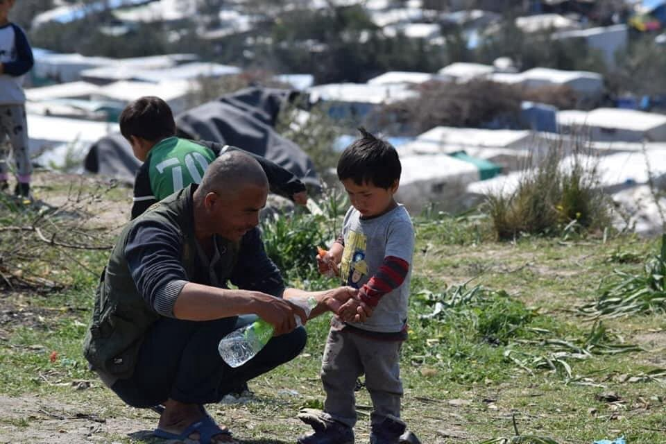
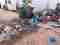
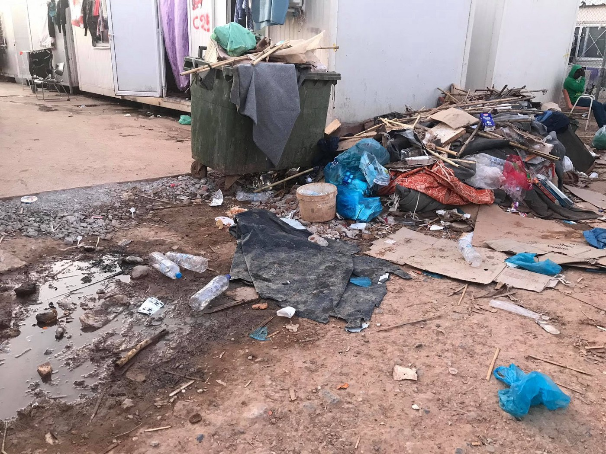
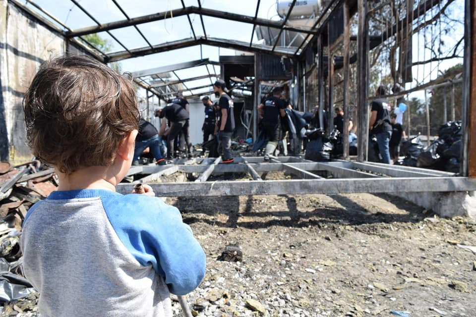
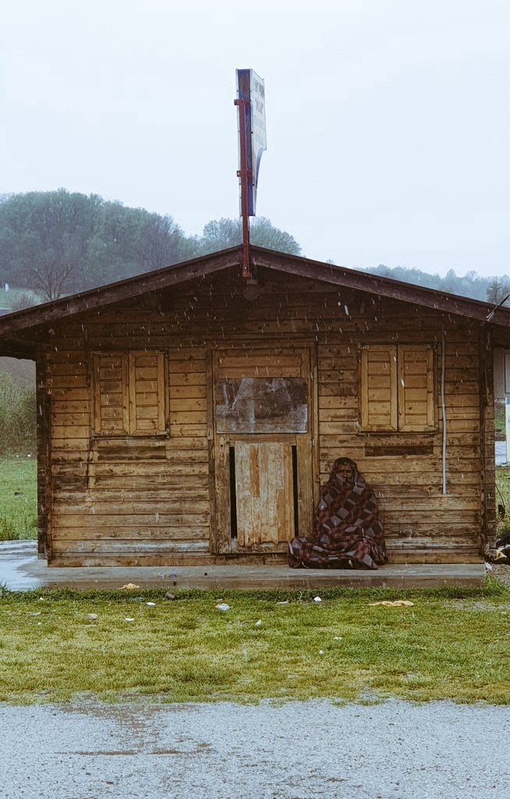

### AYS Daily Digest 14/04/20: Left to Fend for Themselves — Europe’s Unspoken Migration Policy
### Malta and Italy turn their back on people stuck at sea // Greece fines homeless people // An innocent Nigerian boy shot in Italy // Police brutality in Calais // People on the move abandoned in BH

[Are You Syrious?](@AreYouSyrious?source=post_page-----f62721332594----------------------)

[Apr 15](ays-14-04-2020-left-to-fend-for-themselves-europes-unspoken-migration-policy-f62721332594?source=post_page-----f62721332594----------------------) · 9 min read

### FEATURED

**Malta continues to remain silent on the rescue or abandonment of 55 people stuck at sea which was first reported by Alarm Phone four nights ago\.**

The 55 were Eritrean, Ethiopian, Sudanese and Somali refugees from [\#AbuSelim](https://www.facebook.com/hashtag/abuselim?hc_location=ufi) , [\#Zawiyah](https://www.facebook.com/hashtag/zawiyah?hc_location=ufi) , [\#TariqAlSikka](https://www.facebook.com/hashtag/tariqalsikka?hc_location=ufi) and [\#Sabhaa](https://www.facebook.com/hashtag/sabhaa?hc_location=ufi) detention centres, who have suffered years of torture and starvation\. In the night, the IVAN \(Portuguese flag\) was instructed to engage in a rescue **but** continued north\. The weather is getting worse and there is no clear answer about what has happened to these people\. If the dinghy has not sunk yet and the 55 people are still alive, it should now be less than 30 nautical miles from Lampedusa\. Italy and Malta must act\!

The crew of the Aita Mari and their guests on board are also being denied entry into Malta\. They need a port of safety immediately\. There are 43 people onboard who have suffered enough\. Not only did the Armed Forces of Malta fail to rescue them, but now they are also failing in their duty to coordinate a port of safety\!

Malta is legally responsible for the suffering and death of these people at sea and Italy is an accomplice to the catastrophe\.
### [Giulia Tranchina](https://www.facebook.com/photo.php?fbid=10157561234458621&set=a.10150438475713621&type=3&theater)
### [Edit description](https://www.facebook.com/photo.php?fbid=10157561234458621&set=a.10150438475713621&type=3&theater)
#### [www\.facebook\.com](https://www.facebook.com/photo.php?fbid=10157561234458621&set=a.10150438475713621&type=3&theater)

All of this is being watched by Frontex, but without any intervention or assistance\. How can they just sit back and watch as more people continue to die at sea?
### [Giulia Tranchina](https://www.facebook.com/photo.php?fbid=10157561597253621&set=a.10150438475713621&type=3&theater)
### [All witnessed by Frontex while monitoring but refusing to intervene since Friday\. Crimes against humanity](https://www.facebook.com/photo.php?fbid=10157561597253621&set=a.10150438475713621&type=3&theater)
#### [www\.facebook\.com](https://www.facebook.com/photo.php?fbid=10157561597253621&set=a.10150438475713621&type=3&theater)

Academics, activists and others are calling on Malta and the EU to act\. The statement comes as Italy and Malta shut off their ports to migrant rescue charities, like the Sea\-Eye and its ship ‘Alan Kurdi’, and fended off accusations of refusing to succour boats in distress\. “The decision to close ports is unlawful\. The absence of solidarity between the Member States in meeting their collective moral and legal obligations is reprehensible,” the academics said\. Read more [here](https://www.maltatoday.com.mt/news/national/101668/open_the_ports_and_save_boat_migrants_300_academics_call_on_malta_and_the_eu_to_act?fbclid=IwAR2EtyZ5IhlYZdATbjKwgkzoQFnYTAhj4wfXm220wReV8Ez61FEHuDrgBM0#.XpbHuGiTLnF) \.

Meanwhile the Alan Kurdi has still not been able to dock\. A total of 149 people are on board and have spent their eighth night on board\.

Join the already 3,500 signatories and sign the petition \#DontLetThemDrown \#AllLivesMatter
### [‘All lives matter’: dozens join call to ensure migrants are not left to drown](https://timesofmalta.com/articles/view/all-lives-matter-dozens-join-call-to-ensure-migrants-are-not-left-to.785507)
### [As Malta and Italy look away, people are caught aboard rickety boats in the middle of sea\. A social media campaign…](https://timesofmalta.com/articles/view/all-lives-matter-dozens-join-call-to-ensure-migrants-are-not-left-to.785507)
#### [timesofmalta\.com](https://timesofmalta.com/articles/view/all-lives-matter-dozens-join-call-to-ensure-migrants-are-not-left-to.785507)
### LIBYA

In Libya tensions are rising after a man was shot and killed by the Libyan Security Force last week\. He was apparently shot while some people on the move were trying to escape a disused tobacco factory that local militias are using as a detention facility\. According to local sources the General Security & Security Concentration Agency is also located in that same tobacco factory in Ghot al\-shaal district\.
### TURKEY
### Edirne updates

As of March 26th, Turkey has been covertly transferring hundreds of the 6,000 refugees previously stuck in Pazurkale/Edirne to various detainment centers throughout the country\. On Friday April 10th it was reported that they began moving some towards the coast facing the Aegean Islands\. AYS received information that 650 people were being held at the Osmaniye detention center for the prior two weeks before being separated by nationality and boarded onto buses last Friday night\. Their whereabouts now are unknown\.

Additionally, 350 Syrians were moved to a deportation center in Izmir Friday and on Monday were released, allowed to go wherever they wanted but without any assistance or support from the Turkish government, while 250 Iranians were dropped off in Canakkale, forced to fend for themselves with no food or water\. An additional 200 Syrians were dropped off near Behram, where they wandered the beach for a few hours before police collected them and sent them back to Istanbul\.

Those detained in Bursa were released Friday and told they could go wherever they wanted but without any assistance\. Because of COVID\-19 mesures, many are unable to go anywhere and are stuck wherever the buses drop them\. NGOs and journalists are also largely unable to reach them to provide assistance or to cover their situations because of the measures\. While the large majority are still stuck in the Edirne region, they have been told they will probably be moved to other detention centers and cities in the following days\.
### GREECE
### Kos

Two days ago, people finally received their cash card top up\. Normally, they receive financial assistance at the beginning of the month, as do most people in Greece, but due to the Corona restrictions, it was late this month\. A lot of people needed to go shopping as they were running out of food, but only 65 people are currently allowed to go out at one time\. There are currently over a thousand people in the camp, which has become more crowded since they moved the people camping outside to within the walls of the hotspot\. As a result the situation escalated and the police beat both the women and the men to separate the groups\.

### Ritsona

With 14 more days of quarantine, the people in Ritsona have no way to protect themselves\. Seven out of ninety have already tested positive in the community\.

Thessaloniki

Mobile Info Team has recorded information from 30 homeless people on the move in Thessaloniki who were fined by the police under the “movement restrictions\.” One person has been fined as often as 5 times, another two people, 4 times each\. These people have nowhere to live, nowhere to go and the government who refuses to assist them sends its law enforcement officers to fine them?

Lesvos

Fascist violence has been escalating over the past few weeks and on April 8th they burned down the home of refugees living outside Moria\. Mare Liberum spoke with two of the men who were living there\.
### [Security Check Required](https://www.facebook.com/watch/?v=536195237331270)
### [Edit description](https://www.facebook.com/watch/?v=536195237331270)
#### [www\.facebook\.com](https://www.facebook.com/watch/?v=536195237331270)

The latest fire in Moria caused a lot of devastating destruction\.

Luckily, the White Helmets have begun cleaning up the area, trying to make conditions better and cleaner for residents\.
### [Moria White Helmets](https://www.facebook.com/MoriaWhiteHelmets/photos/pcb.126485102327891/126483738994694/?type=3&theater)
### [Moria White Helmets added a new photo\.](https://www.facebook.com/MoriaWhiteHelmets/photos/pcb.126485102327891/126483738994694/?type=3&theater)
#### [www\.facebook\.com](https://www.facebook.com/MoriaWhiteHelmets/photos/pcb.126485102327891/126483738994694/?type=3&theater)

A child looks on at the volunteer team getting to work\.

Seawatch is working to send 1000 masks to Lesvos to try to curb the outbreak\.

Chios

The Ministry of Immigration and Asylum signed a contract today to lease a property in the ALITHEIA complex, in Lefkonia\-Kontari area of ​​Chios, for the creation of a space for the stay of the newcomers\.
### [Jenny Zinovia Kali](https://www.facebook.com/photo.php?fbid=3351076054906558&set=p.3351076054906558&type=3&theater)
### [Jenny Zinovia Kali added a new photo\.](https://www.facebook.com/photo.php?fbid=3351076054906558&set=p.3351076054906558&type=3&theater)
#### [www\.facebook\.com](https://www.facebook.com/photo.php?fbid=3351076054906558&set=p.3351076054906558&type=3&theater)

The rent for a period of seven months amounts to 46,200 EURO, with the possibility of extending the lease, and the property will operate as a place of residence for newly arrived immigrants\. This is supposedly all done in an effort to disperse the impact of the Corona pandemic\. The impetus for the decision was stated as:

“For reasons of urgency and unpredictability that are not the fault of the Greek State, as well as for reasons of security, public order and public interest, with attention to the need to take the necessary measures to protect public health and society as a whole\.”

Samos

Some good news out of Samos today\. A young Syrian boy’s family reunification case was accepted\! Hassan\* will be able to join his older brother in the UK\. The pictures below were taken by Hassan himself and demonstrate the dire conditions in the camps\.

Transfers

This afternoon 20 minors were taken from Moria Camp to the harbor of Piraeus \(Athens\) \. They should reach Germany by the 18th\.

Human Rights Watch is calling for hundreds of migrant children who are in Greece without parents or relatives and in immigration detention to be moved to child friendly housing\. HRW say they are currently at a heightened risk for contracting COVID\-19\.

Human rights violations including illegal pushbacks continue occurring at the Greece\-Turkey border\. Read MIT’s report co\-authored with No Name Kitchen and Border Violence Monitoring Network for more information on the update situation\.

**\*If you or someone you know needs up to date information about the asylum process in Greece, this [website](https://help.unhcr.org/greece/coronavirus/) has info in many languages\. \***

BOSNIA & HERZEGOVINA

The changing weather has just added to the number of difficulties people on the move face while stuck in Bosnia and Herzegovina\. As there is no public transport at their disposal and no freedom of movement for them, getting from one place to another is extremely difficult\. Most of the people are left out on their own \(if they are not forced into provisional campsite like Lipa near Bihac\), only some have managed to stay in private accommodation under different conditions and circumstances, while many are stuck in different hardships of the official camps run by international organisations, and German Civil Protection \(Technisches Hilfswerk\) in the case of recently infamous Blazuj camp\. Those who bother to go the extra step and show humane treatment to these people in transit through Bosnia and Herzegovina more than often see images of despair among these people who now also often carry the stigma of potential health risk in the context of coronavirus, although no infected people have been reported among all those people throughout the country\.

ITALY

In Bari, an unarmed Nigerian boy was shot while riding his bicycle to supply food for a local restaurant\. The shooter has thankfully been arrested\.
### [Security Check Required](https://www.facebook.com/2waysmultimedia/videos/678356872737495/?v=678356872737495)
### [Edit description](https://www.facebook.com/2waysmultimedia/videos/678356872737495/?v=678356872737495)
#### [www\.facebook\.com](https://www.facebook.com/2waysmultimedia/videos/678356872737495/?v=678356872737495)

FRANCE

An open letter from people on the move in Calais highlights intense police brutality and the violation of human rights\.
### [Utopia 56 Calais](https://www.facebook.com/pg/Utopia-56-Calais-258099198180444/posts/?ref=page_internal)
### [SHARE PLEASE\. I’m currently researching the wellbeing of humanitaria… n aid volunteers within Northern France\. I’m…](https://www.facebook.com/pg/Utopia-56-Calais-258099198180444/posts/?ref=page_internal)
#### [www\.facebook\.com](https://www.facebook.com/pg/Utopia-56-Calais-258099198180444/posts/?ref=page_internal)

For families, students, people on the move, etc who need a warm meal and a little support during this time, there are restaurants opening their doors and providing free meals\.
### [Jenny Lepage Buchanan](https://www.facebook.com/photo.php?fbid=10157954823637092&set=a.10153414639827092&type=3&theater)
### [INFO IMPORTANTE: en cette période de confinement, les restos du cœur ouvrent leurs portes à tous sans distinction, sans…](https://www.facebook.com/photo.php?fbid=10157954823637092&set=a.10153414639827092&type=3&theater)
#### [www\.facebook\.com](https://www.facebook.com/photo.php?fbid=10157954823637092&set=a.10153414639827092&type=3&theater)

Additionally, if you or someone you know has symptoms and cannot access a doctor: The Covid\-19 Centre in the 19th arrondissement of Paris is offering free consultation for people without access to a doctor\. Flyers in Arabic and Mandarin \+ audio info in Wolof, Bambara, Sarakolé, Arabic, Mandarin
### GENERAL
### Free online counselling

A psychologist from Germany who volunteered in Greece from 2015–2017 is offering free counselling sessions via Skype/Zoom for volunteers working anywhere with people on the move in Europe and/or with people on the move in locations affected by Europe’s externalizations policies\.
### [Theresa Quast](https://www.facebook.com/groups/766219550168182/permalink/2622922117831240/)
### [Information Point for Volunteers on Samos has 2,799 members\. Just like the other ‘Information Point’ facebook pages…](https://www.facebook.com/groups/766219550168182/permalink/2622922117831240/)
#### [www\.facebook\.com](https://www.facebook.com/groups/766219550168182/permalink/2622922117831240/)

Happening today 15/04, a COVID\-19 webinar at 17:00 CEST hosted by Ruud Nijman — a well respected clinical epidemiologist and medical professionals on the ground\.
### [Megan Briony Cruickshank](https://www.facebook.com/groups/766219550168182/permalink/2622469434543175/)
### [Training\! \* \* Hello everyone\! There is still time to sign up to some of the sessions we have organised this week…](https://www.facebook.com/groups/766219550168182/permalink/2622469434543175/)
#### [www\.facebook\.com](https://www.facebook.com/groups/766219550168182/permalink/2622469434543175/)

**Find daily updates and special reports on our [Medium page](https://medium.com/are-you-syrious) \.**

**_If you wish to contribute, either by writing a report or a story, or by joining the info gathering team, please let us know\._**

**We strive to echo correct news from the ground through collaboration and fairness\. Every effort has been made to credit organisations and individuals with regard to the supply of information, video, and photo material \(in cases where the source wanted to be accredited\) \.**

**Please notify us regarding corrections or other viewpoints\.**

**If there’s anything you want to share or comment, contact us through Facebook, Twitter or write to: areyousyrious@gmail\.com**

_Converted [Medium Post](https://medium.com/are-you-syrious/ays-daily-digest-14-04-20-left-to-fend-for-themselves-europes-unspoken-migration-policy-b5c5004420a9) by [ZMediumToMarkdown](https://github.com/ZhgChgLi/ZMediumToMarkdown)._
