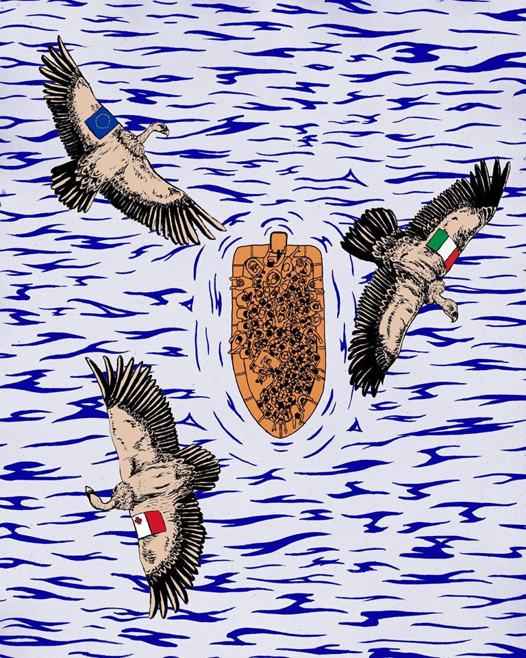

### AYS Daily Digest 20/04/20: First trial on Crimes against Humanity against former members of Assad’s secret service

Information on the Saharan migration route // Updates from Greece: 331 children still held in protective custody // Germany: Former Frontex staff member uncovered as fascist // New Agency for return of rejected asylum seekers to open in Denmark in August

Copyright: Jon Halls
### FEATURE: First trial against former members of Assad’s secret service about to start

On Thursday, April 23th, the first trial against two of Bashar al\-Assad’s former secret service agents, charged with crimes against humanity, will start in Germany\. 
The trial is the result of the tireless work of the Syrian advocates Anwar Al\-Bunni and Mazen Darwish, who worked together with the European Center for Constitutional and Human Rights \(ECCHR\) \. They collected evidence of torture in state\-run facilities in Syria, such as testimonials from survivors, photos from the so called ‘Caesar Files’, and filed criminal complaints against alleged perpetrators in various European countries\. 
Syria is not a member state of the International Criminal Court \(ICC\) in The Hague, the institution that is responsible for the prosecution of international crimes such as crimes against humanity, genocide or war crimes\. This makes it difficult for the ICC to formally open this investigation\. 
The alternative way to open investigations is to transfer the case to the UN, after a vote by the UN\-Security Council\. This was attempted but Russia and China used their respective vetos to prevent it\.
In order to open a case in Germany, the principle of universal jurisdiction has been used\. This principle allows states to practice jurisdiction in cases of the most severe crimes regardless of the nationality of the accused or the place where the alleged crimes were committed\. Already in 2011 the German Federal Public Prosecutor started investigations on crimes committed in Syria\. The two accused former members of the Syrian secret service came to Germany in 2014 and 2018, respectively\. They both were arrested in February 2019\.
Both of them left Syria at a relatively early stage of the war, Anwar R\. in 2012, Eyad A\. in 2013\. Anwar R\. apparently defected in 2012 and joined the opposition movement\. Although the crimes he committed are tremendous, he most probably does not belong to the group of people from Assad’s entourage with the most blood on their hands\. They, one would argue, remained in their positions in Assad’s Syria and continued their atrocities\. For example, Jamil Hassan, who has until recently been head of the Syrian Air Force Intelligence Directorate, to name only one of them\. The international arrest warrant against him issued by Germany and France will not bring any results unless Hassan leaves the country and gets arrested by other state’s authorities\. 
Anwar R\. is now indicted in Germany for complicity in crimes against humanity\. According to the press release from the court about the indictment, Anwar R\. had been an official in Syria’s General Intelligences Directorate\. Between April 2011 and September 2012 he led the investigation section and the associated detention center of the al\-Khatib Branch, also called Branch 251, a facility in Damascus\. According to the indictment, Anwar R\. was in charge of the investigation section and has had authority over the investigators and the prison guards\. During the time of his assignment, at least 4,000 prisoners had been subject to torture, physical violence and threats against their families\. At least one case of rape and sexual abuse occurred\. The aim of these practices was to force confessions and information about the opposition movement\. At least 58 people died as a consequence of the abuse\. Further, the living conditions within the prison were appalling\. Prisoners had no access to medical care or basic personal hygiene, the food supplied was often inedible and the cells were so crowded that people could not sit or lie down, even to sleep\. As the superior, Anwar R\. oversaw and ordered the various mistreatments\. The second accused person, Eyad A\., was working under Anwar R\. He allegedly facilitated the crimes committed under Anwar R\.’s supervision by arresting demonstrators and bringing them to the al\-Khatib prison, already knowing of the practice of torture in the facility\. 
Human Rights Watch collected testimonies from former detainees in Syrian state run facilities\. The following testimony was published in the HRW report “Torture Archipelago”\. The survivor was detained in the Al\-Khatib facility in January 2012\.

> “All night and day we heard the sounds from men being tortured\. One person who helped organizing protests was forced to stand on his knees the entire time in the prison cell\. During the investigation they threatened me that they would strip my clothes off and torture me with the dulab\. We didn’t know what time it was so we couldn’t know when prayer time was\. We couldn’t sleep because of the sounds of torture\. The other girl with us in the prison cell told me that they slapped her several times and kicked her in the stomach\. I saw security forces slapping a 12 year old boy in the corridor\. They also brought him to say that he saw us at the protest\. But the boy swore that he has never seen us before; they believed him\. \[T\]he cells are very close to each other and there was a peephole I used so I could see what was happening outside\.” 

> — Twenty\-five\-year\-old Marwa \[woman\], who was arrested with her friend near a demonstration in Damascus in January 2012 

Although this one case is far from being enough, it is an important first step in making members of Assad’s regime criminally accountable for their atrocities\. The trial will be held in the Higher Regional Court Koblenz\.

For the full HRW\-Report, see:

For more information on the trial, see:

### NIGER

Alarm Phone Sahara expressed concerns about the situation of people who tried to cross the Sahara from Niger into Algeria and Libya and were put in 14\-days’ quarantine in IOM facilities\. 
On 2nd April, a group of about 250 people was brought to Agadez \(Niger\) from the Libyan border with the aid of IOM, after having been provided with food and water\. What happened before this is unclear\. Barbara Rijks, Chief of Mission of IOM Niger, explained on twitter that the people were abandoned by smugglers at the border\.

■■■■■■■■■■■■■■ 
> **[Barbara Rijks](https://twitter.com/BarbaraRijks) @ Twitter Says:** 

> > More than 250 #migrants were abandoned last week by their smugglers close to #Madama, at #Niger’s border w/ #Libya, amidst the #COVID19 lockdown. https://t.co/NPC5VTUPu6 

> **Tweeted at [2020-04-02 10:04:28](https://twitter.com/barbararijks/status/1245653318497533953).** 

■■■■■■■■■■■■■■ 

Informants from Alarm Phone Sahara in contrast said that they were not abandoned but intercepted by the security forces from Niger, after the Libyan border forces denied them entrance due to corona\-related regulations\. 
In Agadez, to where they have been brought, they were put in 14\-days quarantine under IOM administration in a local stadium\. 
Alarm Phone Sahara further reported that since March 19th, 2020, about 667 people have been expelled from Algeria and brought to the so called “point zero” at the border between Algeria and Niger, from where they were told to walk back into Niger, to the border town Assamaka\. 
The route though the Sahara Dessert is one of the most deadly migration routes\. According to IOM, between 2014 and 2018 at least 30,000 people disappeared on the route\. 
Alarm Phone Sahara provides people in the area with important information\. It also runs an emergency number, to which people who got lost or are abandoned can reach out\. APS does not have a vehicle to rescue people themselves, but will try to reach out to other agents\.

**IN CASE OF EMERGENCY** 
**\+22 780296826 or** 
**\+22 785752676**

For their website with useful information, see:

For more information on the reported cases from Alarm Phone Sahara, see:

For more information on the route, see:

### GREECE

While Luxemburg and Germany are praising themselves for having taken in about 60 unaccompanied minors from the overcrowded camps on the islands, approximately 331 children are currently in protective custody in police stations\.

■■■■■■■■■■■■■■ 
> **[Tihomir Sabchev](https://twitter.com/TihomirSabchev) @ Twitter Says:** 

> > Last week about 60 unaccompanied minors left Greece for Germany &amp; Luxembourg. Applaudable.

However, there are right now 300+ kids in protective custody (police stations) across 🇬🇷, a practice that acc. to the ECtHR violates #HumanRights &amp; for which Greece has been convicted... https://t.co/UC2Ykk7IIw 

> **Tweeted at [2020-04-20 10:24:07](https://twitter.com/tihomirsabchev/status/1252181243438956544).** 

■■■■■■■■■■■■■■ 

In November 2019, Greece was ordered to release two children from protective custody and transfer them to suitable accommodation by the European Court of Human Rights\.

> “The two children, represented by Refugee Support Aegean \(RSA\), were detained in the cell of a police station in Attica for more than ten days without access to outdoor spaces and to their belongings\. Detention conditions in Greek police stations are widely acknowledged as inhuman and degrading, including by the ECtHR’s rulings in H\.A\. and Sh\.D\. earlier this year\.“ 

For more information on this case, see:

Restrictions of free movement for residents of Reception and Identification Centres and Hosting Structures will be extended until May 10th, the Greek Ministry of Migration and Asylum announced on Facebook\.

A woman from Somalia that is six months pregnant has tested positive for Coronavirus\. She lives in an IOM run reception facility in Kranidi, Peloponnese, which is installed in a hotel\. Allegedly, she is asymptomatic and in quarantine\.
### SEA

An article on the end of the cooperation between MSF and SOS Mediterranee can be found [here](https://www.infomigrants.net/en/post/24204/doctors-without-borders-splits-from-sea-rescue-partner-over-coronavirus-policy?preview=1587371161577&fbclid=IwAR3xYHHZxDzDAog2O-xhAKCcUuF684YAIVGpN3P2pI67pe5EL8xHj-PQomI) \.
We reported about this in the digest of April 17th\.

The two organizations had different opinions on how to continue rescue operations during the corona pandemic\. 
Another article on the current situation in the Mediterranean Sea that speaks about the closure of Italian and Maltese ports and the Maltase failure in fulfilling their rescue duties that led to the death of 12 people in the past week can be found [here](https://www.infomigrants.net/en/post/24195/coronavirus-crisis-hampering-mediterranean-migrant-rescues?fbclid=IwAR35cpvulB0gJECkSEKu0wMafqkMJKfvB_29kicc7lfDdv1X8NjYazQaLNw) \. Also see AYS Daily Digests from last week\.
### GERMANY

According to an article published by a German newspaper, a German port police officer called Sven J\. has been uncovered as a fascist\. He even stored weaponry that likely will lead to charges, as this falls under the Military Weapons Control Act \(Kriegswaffenkontrollgesetz\) \. This is far from being an individual case\. Since 2017 investigations have been opened against police officers and members of the military suspected of being involved in fascist networks that are hoarding weapons, listing people who should, in their eyes, be murdered, and plan for a fascist revolution on a so called “Day\-X”\. 
In the case of the now uncovered port police officer, connections to these networks existed too\. Sven J\. has been part of the Frontex\-Mission Poseidon\. In 2018 he was part of the operation positioned on Samos, Greek, for four weeks\. The operation was in charge of controlling ships in the Aegean Sea, arresting alleged smugglers and saving people from drowning\. Over the last months and years, Alarm Phone and other groups have documented dozens of attacks on refugees in the Aegean Sea\.

For the article on this case in German, see:

For an article in which the networks of fascist groups within the German police and military are revealed, see:

More articles on fascist networks within German police and military can be found on the same website\.
### FRANCE

Refugee Rights Europe, Committee for Refugee Relief and 91 other organisations made a submission to seven UN Special Rapporteurs to inform them about the situation of refugees in France amid the Corona Pandemic:

> “In northern France, up to 1,500 displaced people, including unaccompanied minors, families, women and men, are living in camps and settlements, suffering from unequal access to health services, water and sanitation, food — and are left without adequate housing\. As they do not fully benefit from the preventive measures put in place by the government and local authorities to prevent the spread of the virus, they are particularly at risk within the context of the COVID\-19 pandemic\.
 

> In addition, asylum desks of préfectures \(PADA\) are closed throughout France, preventing people from claiming asylum and therefore being legally authorised to stay in France and accessing basic services such as housing, healthcare and subsidies, in violation of the Geneva Convention of 1951\.
 

> Finally, the situation of human rights defenders, and other organisations that support vulnerable people, has been greatly compromised by the Government’s response to COVID\-19 pandemic, due to the lack of protective equipment, and excessive verbalisations\.” 

From the Refugee Rights Europe Website, see:

Care4Calais published a statement from a person stuck in Calais on the current situation:

■■■■■■■■■■■■■■ 
> **[Care4Calais](https://twitter.com/Care4Calais) @ Twitter Says:** 

> > Refugees are living with constant fear about their health, food and water as COVID-19 takes away the little support they had.

Hamid in #Calais Calais talked to us about how he felt.

[youtu.be/zZhj-kDbJEA](https://youtu.be/zZhj-kDbJEA) https://t.co/m7i3Wg8NaK 

> **Tweeted at [2020-04-20 19:35:43](https://twitter.com/care4calais/status/1252320060166864903).** 

■■■■■■■■■■■■■■ 

### PORTUGAL

In a refugee shelter in Lisbon, 138 out of 180 residents have been tested positive for coronavirus\. The people were housed in a youth hostel\. After one man needed to be hospitalized, the whole hostel was evacuated and disinfected by firefighters\. Portugal took a gratifying step at the beginning of the pandemic by granting temporary citizenship rights to migrants and asylum seekers\. This gave people access to the social security system and most importantly to public health care\. This regulation will be valid until beginning of July\.
### DENMARK

In Denmark, a new agency called “Hjemrejsestyrelse”, which translates to “Return” or “Home Travel Agency”, will open on 1st August\. The agency will be in charge of orchestrating the return or deportation of rejected asylum seekers\. These tasks have formerly been carried out by the police\. They include the organization of travel documents, the duty of reporting, interviews about collaboration etc\. 
Refugees Welcome, a Danish NGO working on Refugee Rights appreciated the installation of the new agency\. In an article published on their website they state:

> “We hope that is will also mean a shift from negative incitements \(force, threats, detention, daily duty to report in the deportation camps\) to increased use of positive incitements \(meetings, offers, agreements, economical and practical support in the home country\) and maybe a better understanding of the countries in question and the situation of the rejected person, which is often complicated\.” 

Let’s hope this will prove true\. Otherwise Denmark will have a strong institution to organize and enforce oppressive measures against rejected asylum seekers\. The first interim president does not raise our expectations\. Claes Nilas has been involved in two cases of the breaching of UN Conventions by Danish Ministries, the so called Tamil Case and the Stateless Case\. In both cases, his superiors lost their jobs when the violations became public\. 
There are usually around 1,000 rejected asylum seekers in Denmark\. Almost half of them come from countries such as Iraq or Iran, to which they cannot be deported by force\. The new agency will consist of about 250 employees\. That’s a quota many institutions that protect the rights of refugees can only dream of\.
### UK

The Refugee Council have uploaded a summary of the government’s response to the corona\-pandemic in relation to the asylum seekers and the asylum process, to their website\.
The summary includes, for example, the release of about 350 people who have been held in immigration detention and the order to review every case of persons held in immigration detention, the possibility to agree to receiving asylum decisions via email, the three\-month pause of evictions of people who are no longer entitled to asylum accommodation, and the temporary suspension of the resettlement programme\.
For all the new regulations, see:

**Find daily updates and special reports on our [Medium page](https://medium.com/are-you-syrious) \.**

**If you wish to contribute, either by writing a report or a story, or by joining the info gathering team, please let us know\.**

**We strive to echo correct news from the ground through collaboration and fairness\. Every effort has been made to credit organisations and individuals with regard to the supply of information, video, and photo material \(in cases where the source wanted to be accredited\) \. Please notify us regarding corrections\.**

**If there’s anything you want to share or comment, contact us through Facebook, Twitter or write to: areyousyrious@gmail\.com**

_Converted [Medium Post](https://medium.com/are-you-syrious/ays-daily-digest-20-04-20-first-trial-on-crimes-against-humanity-against-former-members-of-d29b6d78b1ae) by [ZMediumToMarkdown](https://github.com/ZhgChgLi/ZMediumToMarkdown)._
