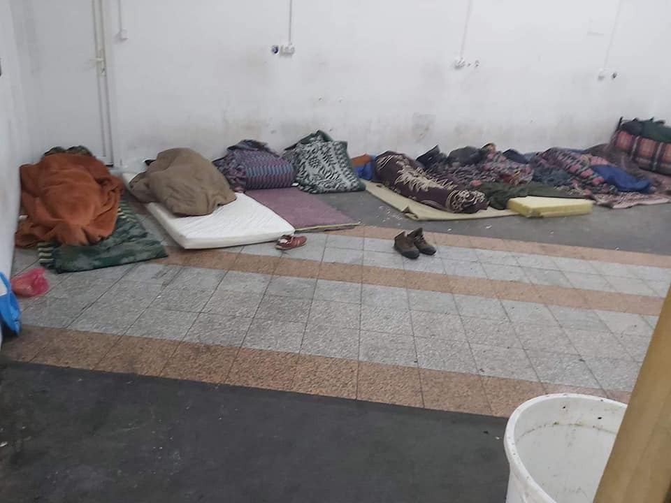
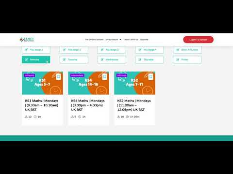

### AYS Daily Digest 21/04/20: Transparency ignored when it serves ulterior motives?
#### Edirne: “released after 26 days in prison without guilt” / Demands to Greece from ECfHR / A letter from the people inside Miral camp in BiH / Stepping up for asylees in Croatia / Italy to legalize undocumented foreigners working illegally on the fields / & more

](assets/439ab85e4ea4/0*zYeLB9MvHi79tEVT)

“The days go by and the blood from the murder of the sixteen\-year\-old boy is still dripping, the child’s body is in the fridge and the killer is free\. Honoring our dead is the right of every human being\.” A peaceful demonstration outside of Moria photo by [**th\.v**](https://twitter.com/th_voulgarakis)
### Featured

The Commission of the European Union refuses to publish a report assessing the 1\-month\-suspension of asylum requests by the Greek government, when thousands of people gathered on the Turkish side of the border trying to enter the country, [writes](https://euobserver.com/migration/148119?fbclid=IwAR34McarnN7P67VHtAerNLUDgtcvAIMX8HaLkkN1JcczflCVt05p25emXXA) EUObserver:

> “The commission insisted it first needed to study the measure — a position it continues to maintain almost three weeks after Greece lifted the suspension on 1 April and in light of the current pandemic\.” 

On the other hand, the Commission’s legal service provided president Ursula von der Leyen with an internal note soon after Greece had restricted the access to asylum, on March 4th\.

Even after a freedom of information request, the Commission still holds this report back arguing it could harm international relations and the EU\-Turkey deal, saying:

> “The frankness, objectivity and comprehensiveness of the legal advice would be seriously affected if legal advice on highly sensitive subjects, as in the present case, would be disclosed” 

However, the Commission has updated its guidelines on asylum due to the pandemic, demanding that all asylum applications be registered and processed, even if maybe delayed\. Exception: The rules may be sidestepped ”in case of a large number of simultaneous applications\.”

Meanwhile, France, Germany, Italy, and Spain urge the European Comission to support a “search and rescue solidarity mechanism”, as documented in [another article](https://euobserver.com/migration/148109) \. As the Dublin agreement has in fact failed and member states are not able to reach a consensus over a reform for a fair share, these four countries have made some new suggestions\. Germany, for example, proposes the European asylum agency \(EASO\) should “assist member states in the aforementioned procedures as needed”\. These procedures include offshore registration, security and medical checks, and identification of asylum seekers\. The letter also suggests measures to prevent people from continuing on the migration routes within the EU: “In particular, reception services for asylum seekers should be provided exclusively by the responsible member state\.”
#### TURKEY

After 26 days of quarantine close to Edirne, a group of an unknown number of people has been released and transferred to Istanbul\. AYS received the following meassage:

> Today, we are released after 26 days in prison without guilt\. I am in the streets of Istanbul …\. They brought us and threw us on a street, and we have nothing but our phones\. 

#### GREECE
### ECtHR requests that Greece provide appropriate accommodation and medical treatment to refugees contained in Lesvos hotspot

The outbreak of the COVID\-19 pandemic highlights yet again the extreme risks facing refugees contained under squalid conditions on the Eastern Aegean islands\. The Reception and Identification Centres \(RIC\) on Lesvos, Chios, Samos, Leros and Kos host over 35,000 persons, more than five times above their reception capacity\. Severe overcrowding under abhorrent living conditions in the RIC is a persisting reality, in sharp contrast to social distancing measures enforced throughout Greece and to recent European Commission guidance to transfer asylum seekers to facilities with lower occupancy\.

This backdrop renders evacuation out of Moria and other sites a public health imperative to prevent loss of life\. Beyond unaccompanied children, whose plight has led to welcome relocation initiatives to other EU countries, many more people face acute health risks, not least due to particular circumstances including age, medical conditions and trauma\.

■■■■■■■■■■■■■■ 
> **[Franziska Grillmeier](https://twitter.com/f_grillmeier) @ Twitter Says:** 

> > Another peaceful protest is happening right now in front of #Moriacamp. #Refugeesgr demanding safety &amp; justice for death of a 16-yo boy who succumbed to his wounds 2 weeks ago. Tensions are increasing among the 19,000 inhabitants cramped in space for 2,800. Picture by inhabitant. https://t.co/m7SYUT2gmz 

> **Tweeted at [2020-04-21 11:14:52](https://twitter.com/f_grillmeier/status/1252556401152589826).** 

■■■■■■■■■■■■■■ 

150 people tested positive for the coronavirus at a quarantined seaside hotel housing 470 people, including many children, but none of those infected displayed symptoms of COVID\-19, media report\.

Located 170 kilometres southwest of Athens, this hotel has been quarantined since April 16 after an employee tested positive\.
#### BOSNIA AND HERZEGOVINA

[L’ ALTRA VOCE](https://www.facebook.com/L-ALTRA-VOCE-1245970425495921/?__tn__=kCH-R&eid=ARCDhumpYXV7i6FWp5_XN74eEGGrTiAkPbnemHmSTtYe01cAbS77jfAMyxbWpPR6IWIpiV4P79a_JjMi&hc_ref=ARSmKrQlBbT4C57CfMmCYJ9vHjhBoEghMDXwwp6n0ftSQWWdqoIiaeqreMjSIbTEK_o&fref=nf&__xts__%5B0%5D=68.ARB4mZzcy3AYsy_sddk2nxJCG3gydy09i3abMFKOAxIPamhf_UJa7PNHrhGChfcJQomtflzE_ofyBBFfQVVPMAWWjyojMSac4RYiNyA7xwbYCcIQyZa-atZ-bWLImTbsNnRKz--f1u6rqiDxdkMywhj_Apz2z9dE4SxXUxZYgNv9QuAHC-G2bMiRtrPFFoLJYbxgpTqqNuuXp9o_WMN_ly1LPcpG-7I5ennh-TC6egQNUk2sOiufmIdThE8rtOpk722ZCmfh1IJ0mL_NOhlRHJbku08JsqRBJxUjmrTzJ6hpVkxqhnUB2ZWJ-OEL3TMGLsyNjlDgoZMFwMNE7YP5RqVCmmU5Z7hrb288d7s59k4pGpUarts) published a letter co\-signed by 70 people staying at one of the official camps in Una Sana canton, run by IOM\. From the Miral camp in Velika Kladuša, they wrote that there is not a sufficient amount of food for everyone, and people are not allowed to buy and bring inside their own food to eat at their chosing, thus selectively applying their own standards\.

](assets/439ab85e4ea4/0*tDKlOxNvnnScNs6k)

Photos by the camp residents, via [L’ ALTRA VOCE](https://www.facebook.com/L-ALTRA-VOCE-1245970425495921/?__tn__=kCH-R&eid=ARCDhumpYXV7i6FWp5_XN74eEGGrTiAkPbnemHmSTtYe01cAbS77jfAMyxbWpPR6IWIpiV4P79a_JjMi&hc_ref=ARSmKrQlBbT4C57CfMmCYJ9vHjhBoEghMDXwwp6n0ftSQWWdqoIiaeqreMjSIbTEK_o&fref=nf&__xts__%5B0%5D=68.ARB4mZzcy3AYsy_sddk2nxJCG3gydy09i3abMFKOAxIPamhf_UJa7PNHrhGChfcJQomtflzE_ofyBBFfQVVPMAWWjyojMSac4RYiNyA7xwbYCcIQyZa-atZ-bWLImTbsNnRKz--f1u6rqiDxdkMywhj_Apz2z9dE4SxXUxZYgNv9QuAHC-G2bMiRtrPFFoLJYbxgpTqqNuuXp9o_WMN_ly1LPcpG-7I5ennh-TC6egQNUk2sOiufmIdThE8rtOpk722ZCmfh1IJ0mL_NOhlRHJbku08JsqRBJxUjmrTzJ6hpVkxqhnUB2ZWJ-OEL3TMGLsyNjlDgoZMFwMNE7YP5RqVCmmU5Z7hrb288d7s59k4pGpUarts)

According to the people whose photos and statements made it to the Letter, there is always someone going to sleep hungry\. Also, there are frequent references to violent measures and unprofessionally harsh treatment by the outsourced security companies working in camps\. Among others, the letter states:

> “If we ask for the market they always say IOM will open market for you inside the camp and provide you a western union inside the camp but until this opportunity, you cannot buy anything from the market\.
 

> We are all worried because very soon our Ramzan month is coming how we will survive during the Ramzan because they don't have any good management or their staff is also acting like racist people we are afraid might be they will also beat us in future\.” 

](assets/439ab85e4ea4/0*41xcTzjNHhBoRE56)

Photo via [L’ ALTRA VOCE](https://www.facebook.com/L-ALTRA-VOCE-1245970425495921/?__tn__=kCH-R&eid=ARCDhumpYXV7i6FWp5_XN74eEGGrTiAkPbnemHmSTtYe01cAbS77jfAMyxbWpPR6IWIpiV4P79a_JjMi&hc_ref=ARSmKrQlBbT4C57CfMmCYJ9vHjhBoEghMDXwwp6n0ftSQWWdqoIiaeqreMjSIbTEK_o&fref=nf&__xts__%5B0%5D=68.ARB4mZzcy3AYsy_sddk2nxJCG3gydy09i3abMFKOAxIPamhf_UJa7PNHrhGChfcJQomtflzE_ofyBBFfQVVPMAWWjyojMSac4RYiNyA7xwbYCcIQyZa-atZ-bWLImTbsNnRKz--f1u6rqiDxdkMywhj_Apz2z9dE4SxXUxZYgNv9QuAHC-G2bMiRtrPFFoLJYbxgpTqqNuuXp9o_WMN_ly1LPcpG-7I5ennh-TC6egQNUk2sOiufmIdThE8rtOpk722ZCmfh1IJ0mL_NOhlRHJbku08JsqRBJxUjmrTzJ6hpVkxqhnUB2ZWJ-OEL3TMGLsyNjlDgoZMFwMNE7YP5RqVCmmU5Z7hrb288d7s59k4pGpUarts)
#### CROATIA

During the previous weeks, AYS volunteers have been finding ways to support people living in Zagreb under the asylum system\. Along with a number of difficult measures, unclear policies and decisions, many are facing the end of their state\-supported two\-year term in the worst conditions — in the midst of the pandemic, Zagreb was hit by an earthquake a month ago\. It left a lot of damage on many buildings, lives and policies, and has shifted prorities even further for the already inefficient officials in the City of Zagreb\. Many people will be left without their accommodation, some because their landlords have lost their own homes, others because many Zagreb citizens are also in search of an apartment that is currently safe to live in\. Therefore, we intend to broaden our weekly support, which at the moment includes providing hygiene and other basic products to those in need, uninterrupted volunteer work with schoolchildren and accompanying people in a number of different bureaucratic struggles\. We will try to find a way to support people financially so they can pay their rent, as some are already having to leave their homes and even find a place in one of the shelters\. This is something troubling us and we are at the moment working tirelessly to find a viable solution\. Follow us for more information on how you can contribute in these efforts\.
#### ITALY

The Italian government is considering legalizing undocumented foreigners working illegally on the fields, according to [Infomigrants](https://www.infomigrants.net/en/post/24230/italy-considers-legalizing-migrant-workers?fbclid=IwAR1QUTkSngvwoBy6D5SGxOAkJqDegZmpo6FfmVanaq6-OLV_w8szajrzfWA) \. The minister for the South, Giuseppe Provenzano, also wants to include home carers and domestic workers\. Refugee\.info has written a detailed piece about what this amnesty would mean, recalling that a first attempt failed in parliament in December 2019:

#### GENERAL
#### Mapping Covid\-19 impact

Volunteers of Techfugees [started](https://www.facebook.com/groups/Techfugees/permalink/2662341990756491/?hc_location=ufi) mapping the impact of the Coronavirus on Camps for displaced people\. “As many camps are not reporting any case for now we have not mapped all of them — for now,” writes Joséphine Goube\. By clicking through the map, you can find detailed information about the situation in single camps with the currently available sources\.

Team Humanity founder Salam Aldeen and Ali Latif from 3Lance Education provide online classes for children\. The Online School was already founded in March 2020 “after the news of a global lockdown became apparent,” Aldeen says\. They have known each other for several years and have worked together on different projects since they met volunteering in Idomeni\. Their motivation was “to do something positive for the world in its darkest hours”\. With the support of volunteer teachers they developed a programme and now operate the Online School Monday — Friday \(9\.30am — 4\.00pm\) UK BST\. They offer lessons at all levels for KS1 — KS4 for Maths, English, Science, Dance and Yoga\. To attend the classes, a registration is required, and the service is free of charge\.

**Find daily updates and special reports on our [Medium page](https://medium.com/are-you-syrious) \.**

**If you wish to contribute, either by writing a report or a story, or by joining the info gathering team, please let us know\.**

**We strive to echo correct news from the ground through collaboration and fairness\. Every effort has been made to credit organisations and individuals with regard to the supply of information, video, and photo material \(in cases where the source wanted to be accredited\) \. Please notify us regarding corrections\.**

**If there’s anything you want to share or comment, contact us through Facebook, Twitter or write to: areyousyrious@gmail\.com**

_Converted [Medium Post](https://medium.com/are-you-syrious/ays-daily-digest-21-04-20-transparency-ignored-when-it-serves-ulterior-motives-439ab85e4ea4) by [ZMediumToMarkdown](https://github.com/ZhgChgLi/ZMediumToMarkdown)._
