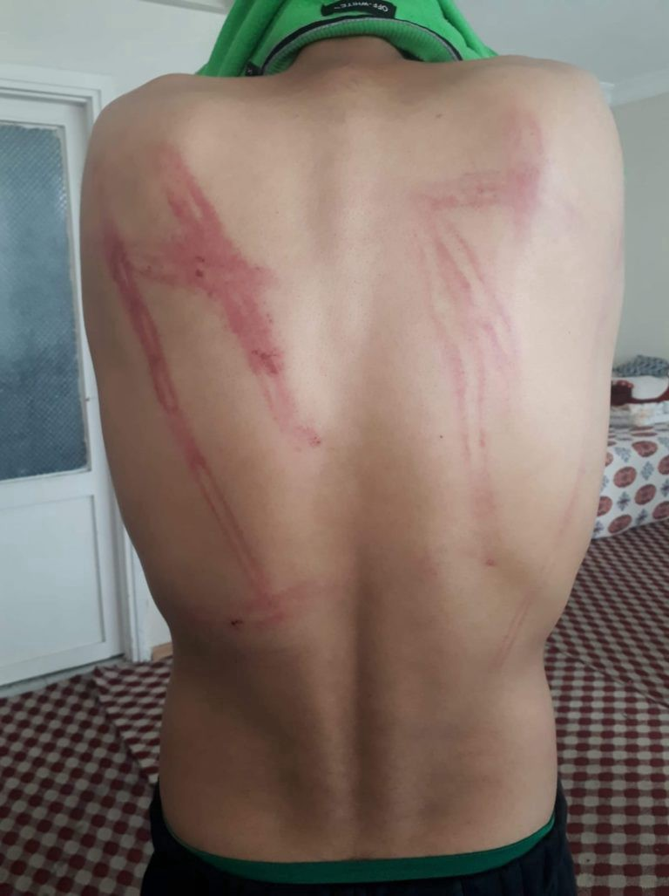
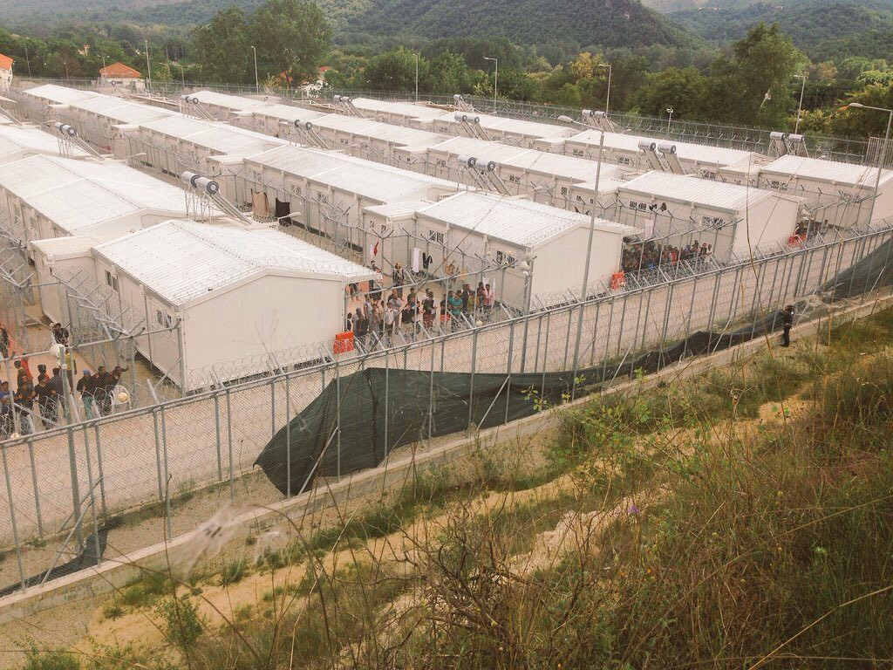
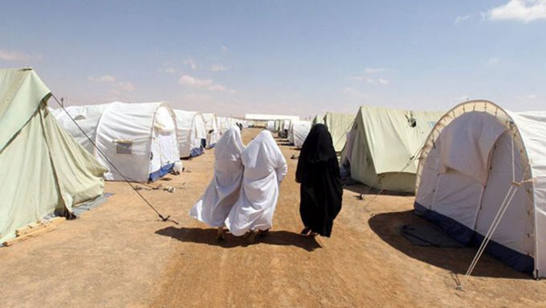
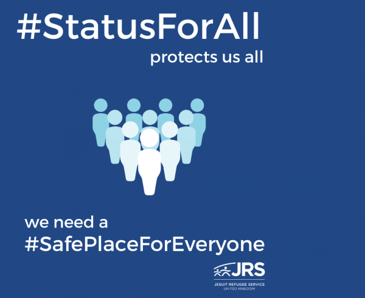

### AYS Daily Digest 05/05/20 Photographic evidence & first hand testimony: Greece pushbacks under COVID\-19

_Libyan detention fear during COVID\-19 // looming fate of camp in Tunisia // hunger in UK during COVID\-19 // privacy concerns in Germany // and more…_

### FEATURE: Releasing first hand testimony and photographic evidence indicating the existence of violent collective expulsions

Border Violence Monitoring Network, Wave\-Thessaloniki and Mobile Info Team have published a press release: Collective Expulsion from Greek Centres on Tuesday:

> _“In response to the recent spike in pushbacks from Greece to Turkey, \(we\) are releasing first hand testimony and photographic evidence indicating the existence of violent collective expulsions\. In the space of six weeks, the teams received reports of 194 people removed and pushed back into Turkey from the refugee camp in Diavata and the Drama Paranesti Pre\-removal Detention Centre\.”_ 

> _“In the case of Diavata, respondents report being removed from this accomodation centre by police with the information that they would be issued a document to temporarily regularise their stay \(informally known as a “Khartia”\) \. Instead they shared experiences of being beaten, robbed and detained before being driven to the border area where military personnel used boats to return them to Turkey across the Evros river\. Meanwhile, another large group was taken from detention in Drama Paranesti and expelled with the same means\. Though the pushbacks seem to be a regular occurence from Greece to Turkey, rarely have groups been removed from inner city camps halfway across the territory or at such a scale from inland detention spaces\. **Within the existing closure of the Greek asylum office and restriction measures due to COVID\-19, the repression of asylum seekers and wider transit community looks to have reached a zenith in these cases\.”**_ 

The collected evidence comes from cases on 31st March 2020, 16th April 2020, 17th April 2020, 23rd April 2020, and two separate cases on 28th April 2020\. Many of the cases involved people being pushed into vans from Diavata camp and driven to the Turkish border to be expelled\.

There are still more reports of recent mysterious pushbacks not yet accounted for\. [On April 30th](https://www.efsyn.gr/ellada/koinonia/241802_hios-mystirio-me-tin-tyhi-prosfygon-poy-eftasan-stin-paralia-tis-monolias) , dozens of people saw a small inflatable boat of about [10 to 15 people](https://twitter.com/teammareliberum/status/1257622881808396289?fbclid=IwAR26FAr0NKRZqPnOvGu8tsdHDEMKYEWit51Cuj3TMtU0FPgjBpBBuVxWkVw) reach the shore of Chios, when the Greek Navy appeared on site to tow them “away\.” Chios MP Andreas Michailidis spoke about the incident:

> _“If the suspicions expressed in the reports are confirmed, the Greek government is seriously exposed and fully responsible for the consequences of its practices\.”_ 

Josoor Blog just published an editorial on [“Pushed around Europe: The story of a young man who was pushed back more than 15 times\.”](https://www.josoor.net/post/pushed-around-europe?fbclid=IwAR0PR6mJilCoSHaa7K_9kRW1JpUqniMTY-GVTQk31RMQ4oQ40xlF9I-2Di4) It’s not an easy read, but if you need to see the bravery in the human spirit right about now, take a look\. This young man’s story also evidences the absolutely inhumanity of pushbacks occurring in Europe\. They were intolerable and breaking international law before COVID\-19, and they continue up until now…
### LIBYA
### “The COVID\-19 crisis has sparked fear in Libya, and healthcare systems that were already on their knees risk being further crippled\.”

Libya expert Mark Micallef, who leads an observatory specialising in human smuggling and trafficking in North Africa and the Sahel for the think tank Global Initiative Against Transnational Organised Crime, says:

> _“Detention centres have to be seen in this context\. Given the escalating war in Tripoli, a number of detention centres have been evacuated\. Even though detention centres are hosting fewer migrants, the ones who are detained are facing worse conditions”_ 

The situation in the detention centers is at crisis point, particularly because malnutrition and illness are already widespread\. With refugees living outside centres often unable to find safe work and shelter, many have no option but to stay in the facilities, despite terrible conditions and treatment\. [More here](https://timesofmalta.com/articles/view/migrants-not-safe-in-libya-expert-warns.789617?fbclid=IwAR17FGSNsSfaafoyL2CMVZcrnAmUGk0qnp57CRlM_bTdZ2mg2UQoHExB6y0) \.
### TUNISIA

Mourad Teyeb, a journalist and consultant based in Tunis, wrote an eye\-opening article with a grave warning about the constructing of the UN\-run refugee camp in an area near Remada, in Bir Fatnassia village\.

He warns that with the ongoing civil war on Libya and the upheaval from COVID\-19, thousands more people will migrate to the Tunisian borders for safety\. The camp is only planned for 6 months and the government is insisting that it will not host permanent refugees\. But as we are seeing in so many other countries, due to severe conflict, refugees are living in camps of this sort for years\. There is also a real fear of extremism in the region of Tunisia where the camp will be located, as many young Tunisian are getting recruited by radical groups\. Teyeb warns that extremists will try to recruit from the camp as well\. [Read in full here\.](https://www.euractiv.com/section/global-europe/opinion/fatnassia-camp-is-a-time-bomb-that-threatens-whole-of-north-africa/?fbclid=IwAR09mx4q7E0wNJ_gt-GwPUws7iGG0th0P326FMb0YnJ_J1OEwPeLrTvg9hc)
### SEA

[78 people](https://twitter.com/alarm_phone/status/1257633084884889601?fbclid=IwAR3VFJKhhU1HaO9HGlOfmndRLfCwfYqByS6V3yPOq_PJ7aXIvuxY8wUKhlU) are still waiting to be rescued on the Marina merchant vessel\. They have been at sea for 3 days\. COVID\-19 IS NOT AN EXCUSE\.

AlarmPhone has seen an increase in racist attacks against their organization during COVID\-19\. Here’s what they have to say:
### GREECE
### Residents in northern Greece protest arrival of 300 vulnerable asylum seekers to hotel, transfer oversaw by IOM

After Tuesday’s Press conference with the General Police Director of the North Aegean, journalist [Franziska Grillmeier](https://twitter.com/f_grillmeier/status/1257611808745062401) laid out some excellent points behind the disturbing fact that **most of the fines for COVID\-19 restrictions were given to refugees** :

> _“Background: During this time, over 3 big fires broke out in \#Moria \+ \#Vathy, causing hundreds of people to flee for a safe place\. Many inhabitants of \#Moria were also fined in front of Supermarket, where ppl got basics like flour, oil \+ diapers that weren’t provided in Camp\._ 

> _Additionally: many inhabitants couldn’t charge phone with credit — since they were not allowed to travel to \#Mytilini anymore to charge\. Hence, SMS to communte could rarely be sent\. ALSO, people report to be left without information on \#COVIDー19 regulations for most time\._ 

> _While not to forget that up to 19,000 men, children \+ women are currently trapped in a space made for 2,840 alone in \#Moria\. Women with disabilities, women giving birth, newborn children, elderly men with movement difficulties in olive grove fields \+ with no future outlook\.”_ 

Just a reminder from [Theirworld’](http://s3.amazonaws.com/theirworld-site-resources/RefugeeEducation-Summary-230420-1.pdf) s report **Finding solutions to Greece’s refugee education crisis: Executive Summary** , “as of January 2020, the refugee enrollment rate in public schools on the islands was only 6%\.” COVID\-19 closures have only heightened the need for refugee children to receive access to education and have the ability to leave the camps during the day\. Theirworld reiterates that donors across the world need to recognize the education opportunities for refugee children as a top priority\.
### MALTA

[Malta wants Pope Francis](https://timesofmalta.com/articles/view/malta-asks-pope-francis-to-take-in-a-family-of-migrants.790169?fbclid=IwAR0C3Ea3j7DMxQHNZNqgkNjBWYdc_4qpljtLqEnQTQL5Y6EbtBTGp0ql1EA) to take in a family of refugees, they write in a letter\. Foreign Affairs Minister Evarsit Bartolo told Times of Malta that “This would serve as a motivational reminder for other bigger states to carry their fair share of the burden which Malta is disproportionately facing\.” Interesting bid; the Pope was supposed to visit refugees in Malta before COVID\-19\.
### GERMANY

The plan to accept 2,000 refugees from the Greek islands is under threat of not coming into fruition\. German media explains: _“The State Cabinet adjourned on Tuesday the decision on a submission by the Minister of Justice Dirk Adams \(Greens\), according to which up to 2000 refugees, albeit stretched until 2023, are to be accepted in the Free State\. The SPD considered the template not ready for the cabinet\. A new attempt to reach agreement is to be made next week, the chances for an agreement are considered poor\.”_ [More here](https://www.tagesspiegel.de/politik/koalitions-krach-in-thueringen-spd-stoppt-hilfsplan-fuer-fluechtlinge-aus-lesbos/25802444.html?fbclid=IwAR28zM9BxgNO3o7wx3JdSYEg59ixYLB3UYrmBNziz86deuq0ORHy-8JbFOA) \.

Refugees in Germany are suing the government for invasion of privacy due to collecting their mobile phone data\. A 2017 law gives the government the right to collect their data if they do not have valid identification\. Lea Beckmann, a lawyer at the GFF said _“The BAMF \(Germany’s ministry for migration and refugees\) is disregarding the strict constitutional rules by which the state must abide when accessing personal data\.”_ More [here](https://news.trust.org/item/20200505161630-vhiiz?fbclid=IwAR1jkGVCXVYEI4qnMU-Ko0or63AqO31QGloW4Ac6PfWjQOIkcrWCjvLP5a0) \.
### UK

Food scarcity for refugees and asylum seekers is a huge issue during the COVID\-19 lock down\. The Independent reports:

> _“ **Around 44,000 asylum seekers are currently living in the UK on just over £5 a day** — or £37 a week — and concern is mounting that, due to a decline in face\-to\-face charity support and limitations on where they can shop during the lockdown, many are having to make impossible choices, choosing between basic needs such as buying nappies for their young children, eating an evening meal or buying mobile data to speak to loved ones\.”_ 

Some aslyum seekers are suing the Home Office to provide more aid per week and to “fill the support gap” to account for the change in conditions\. Many people are skipping meals in order to feed their children\. Learn more [here](https://www.independent.co.uk/news/uk/home-news/coronavirus-job-losses-laid-off-domestic-workers-carers-homeless-visa-a9498581.html) \.

**Find daily updates and special reports on our [Medium page](https://medium.com/are-you-syrious) \.**

**If you wish to contribute, either by writing a report or a story, or by joining the info gathering team, please let us know\.**

**We strive to echo correct news from the ground through collaboration and fairness\. Every effort has been made to credit organisations and individuals with regard to the supply of information, video, and photo material \(in cases where the source wanted to be accredited\) \. Please notify us regarding corrections\.**

**If there’s anything you want to share or comment, contact us through Facebook, Twitter or write to: areyousyrious@gmail\.com**

_Converted [Medium Post](https://medium.com/are-you-syrious/ays-daily-digest-05-05-20-photographic-evidence-first-hand-testimony-greece-pushbacks-under-d5db88f4d67a) by [ZMediumToMarkdown](https://github.com/ZhgChgLi/ZMediumToMarkdown)._
