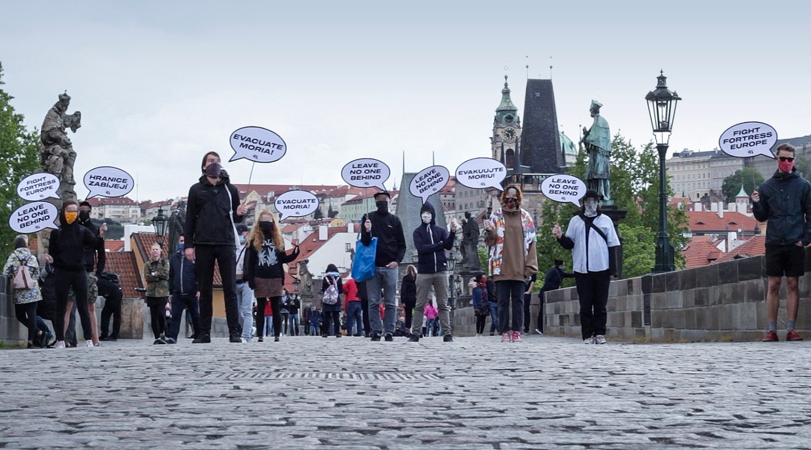
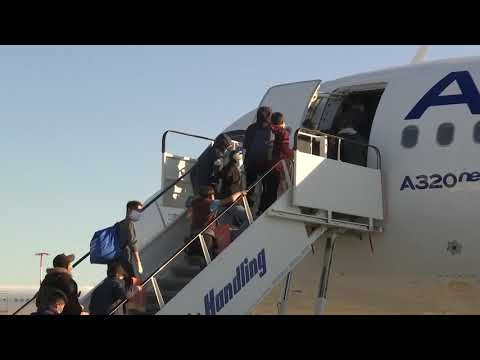

### AYS Daily Digest 6/5/20: Hungry and locked up in the Western Balkans, as the EU discusses accession
#### All the ways the international community is failing in the ‘Western Balkans’ / Greece to reexamine vulnerability certificates, as nationalism and securitization become focal point again / Reports from the ground / As it turns out, Germany didn’t take in unaccompanied minors who needed the most care, as many were eligible by law for relocation or family reunification / Sweden asking for a ten\-year wait before another try at applying for asylum

](assets/a8d5a8215a01/1*PRbVNflVBeuUXVeUq7cxJw.jpeg)

Krnjača camp, Serbia, \- [photo source](http://Lagkadikia Camqu Hama)
#### FEATURED
### Violating the refugee convention by failing to meet housing and food standards

While talks around the accession of the Western Balkan countries to the EU are underway these days, Human Rights are at their lowest points in these areas\. Croatia continues violent pushbacks, even “marking” people with color spray in some places, and hurting people deliberately and systematically, without any stronger voice against it, or proper investigation and resulting measures for the non\-existent border monitoring paid by the EU Commission\. In Bosnia and Herzegovina, there are desperate people on both sides, those who need help and those who are no longer able to provide it in decent measure and the proper way \(locally organised individuals and organisations\), while a man’s life was taken; he was a father and husband, a person on the move, someone who underwent the dangerous journey from Kurdistan to reach somewhere safe with his family\. Many unclear circumstances were already reported a number of times regarding the many \(questionably trained for this purpose\) “security” officers across the UN supported camps in Bosnia and Herzegovina, and this is the culmination of the unanswered questions and concerns, as many people from the Sarajevo camp where the man was fatally injured claim it is a consequence of the beatings by one such officer installed by the IOM, the organisation running this camp and a number of others\. Not much scrutiny from any of the humanitarian voices came after this, except the scarce information from IOM’s regional director that an investigation is under way\. Should it not be? Is that the best we all can do as a society? Nobody is romanticizing the conditions and resulting social tensions among people, but this should raise more than brows from the officials, ‘humanitarians’, and the whole international community\. COVID\-19 measures have demonstrated to many that any day now this could be anyone else, detained and deprived of the right to movement, and most of us luckily don’t know how we would react and what this would do to us and now — if we would survive the humanitarian standards\.
In Albania, many of the hundreds housed in the reception centre in Babrru, Albania, find themselves reduced to begging for food in the capital\. Journalists who spoke to the residents say many complain about gangs stealing and assaulting people there, while others were left out in the cold despite seeking refuge at the centre, as it is closed under a lockdown across the country due to the coronavirus pandemic\. Along with the closed centre in Karec, they have a capacity for about 400 people ahead of a larger number of people arriving and passing through Albania\.

In Serbia, the state of emergency introduced on 15 March is still in force, which means a ban on movement for migrants and asylum seekers\. Since the beginning of the year, 839 people, most of them from Afghanistan, have expressed the intention of seeking asylum in Serbia\. There are no coronavirus cases among people on the move in Serbia \(So far, in Serbia there are 9,557 confirmed COVID\-19 cases; deaths: 197; tested: 106,461\), Info Park reported in their newsletter:

> According to the latest information, almost nine thousand migrants and asylum seekers are under lockdown in Serbia\. Asylum and reception centers remain overcrowded\. The people in camps complain about unequal criteria for obtaining the right to exit the camp arguing that some can leave multiple times while others cannot\. The biggest issue is the inability to buy certain things they need and withdraw money from ATMs and Western Union\. 

At the same time, the right\-wing propaganda and vigilante hate attacks keep happening, the most recent being a [man who ran into the closed camp in Obrenovac with his car](https://l.facebook.com/l.php?u=https%3A%2F%2Fwww.youtube.com%2Fwatch%3Fv%3DSTb4kGJlxLY%26feature%3Dyoutu.be%26fbclid%3DIwAR2xITlcJv_dtXZO6bsOU0cGpLblE6QpgABKkfNuuMAIWE_AdLwnyTVrU88&h=AT3PL2JdEsCAZoo2Qay6W8NBvbNn7K6L6oUZrJbJcqoCDuy26nmfflroBqK7GuLczqRpT1yCFXhgQ7r_G8LYHofGP7-krbHLH1fjppJElpVmJoXj4I7VHBBw5tkmSSF-qNDlc3nz7hYjJg) and, while luckily nobody was run down or hurt, his case is just one out of many displays of hatred towards people whose wellbeing is known only to those who are making sure they don’t step out of the detention camps at the gates of the EU, as the Union counts points and dwells on the future of the Western Balkans\.
#### GREECE
### First registered arrival in 35 days

A boat carrying 51 people landed in Kalo Limani, Lesvos this Wednesday morning, Aegean Boat Report team documented\. This was reportedly the first arrival on Lesvos that has been registered in 35 days\.

> Due to the restrictive measures in place to prevent the spread of coronavirus, the people will remain in the area of arrival and placed in quarantine for 14 days\. There has not yet been a decision as to where in this area they will stay, and under what conditions, and the people are waiting on the road at the moment\. 

### State to evict people from camps and homes

In spite of the strict measures in the entire EU asking people not to move or even go out if not necessary, the Greek government has decided that up to 7,500 people who were granted asylum will be evicted by the end of this month, both from the camps and also from houses in private ownership where people have been placed\. Also, they will reportedly also lose the right to the cash cards, one of the few items providing people with some dignity and possibility to decide on something in their life while in limbo\.
### Vulnerability assessment \(re\)questioned

A Greek prosecutor will reportedly investigate 25,000 vulnerability certificates provided in Greece to people exposed to heightened risks of harm who require special care, support and protection\. These are not merely people who are at risk of persecution or refoulement\. Such certificates have allowed them the \(often life\-saving\) move from infamous camps at the Greek islands to the country’s mainland\. However, it is important to remember that obtaining such a vulnerability document never represented any sort of guarantee for a positive asylum response in their ongoing case\. The cases that are to be examined are from the period of the previous government, and while the criteria on which people would be defined as vulnerable or not has changed \(depending on how poor and overcrowded the situation in the island camps was and how urgent the need to decongest the islands was\), it brings into question who then decided if not the officials and their partners from the international organisations deployed precisely for this mission and working within protection and health area, and why these decisions would now be put into question\. We will follow up on this issue and we welcome comments, examples and contributions to the discussion\.

■■■■■■■■■■■■■■ 
> **[Katy Fallon](https://twitter.com/katymfallon) @ Twitter Says:** 

> > But in some parts of the camp, the river of rubbish is still very much in existence. However, no corona cases in Moria and none on Lesvos for a few weeks — which is a small amount of good news at least. https://t.co/aoQGKivaPp 

> **Tweeted at [2020-05-06 13:14:09](https://twitter.com/katymfallon/status/1258022240328863744).** 

■■■■■■■■■■■■■■ 

During the past two days in a small Greek town road barricades were installed and a hotel that was to host asylum seekers was burned down\.

■■■■■■■■■■■■■■ 
> **[𝕋𝕙𝕖 𝔻𝕦𝕜𝕖](https://twitter.com/thedukeoriginal) @ Twitter Says:** 

> > This is what locals did to the hotel that was supposed to host migrants in Arnissa, Pella.
Police is collecting evidence to take those responsible to court.
250 migrants were supposed to go to Panagitsa, Pella, but were not allowed by locals.
They then tried to go to Arnissa https://t.co/F0vzMHo634 

> **Tweeted at [2020-05-06 11:03:41](https://twitter.com/thedukeoriginal/status/1257989408504061954).** 

■■■■■■■■■■■■■■ 

This is being treated as arson, and while the mayor reportedly reacted, no official reactions or condemnation came from the government side, thus they are tacitly accepting such behavior and the violence inflicted on the people\. In the meantime, the official state continues with the notion of supporting the degrading treatment, underlying nationalism, and insisting on securitisation in their official policies\.

■■■■■■■■■■■■■■ 
> **[Apostolis Fotiadis](https://twitter.com/Balkanizator) @ Twitter Says:** 

> > Agreement comes about 18 months after Frontex used the same system in a pilot project for border control in Greece. Also a 'Hermes 900' produced by Israeli Elbit has been deployed by Frontex/EMSA in Greece and crashed in Crete last January. 

> **Tweeted at [2020-05-06 09:32:28](https://twitter.com/balkanizator/status/1257966453145378816).** 

■■■■■■■■■■■■■■ 

### Greek\-Turkish border

The media are reporting that the Greek authorities have published reports of two new incidents in less than 24 hours of shots being fired into the air by Turkish guards on the Evros River border with Greece, in the northeast\. Some believe these happen so the Turkish side could control specific crossing points along the river border\. See more on that particular report [here](https://www.ekathimerini.com/252407/article/ekathimerini/news/two-new-incidents-of-shots-at-evros-border-reported?fbclid=IwAR2uNOSsU84TbMY5gzoN0vabwDmgARJLJpPVz7S_FHzFAvElTC903HYovw8) \.
### Volunteers report

The volunteers of No Name Kitchen, Women in Solidarity House on Lesvos and others reported on this week’s news from Lesvos, Patras, Thessaloniki and Serbia\. [The link](https://www.facebook.com/NoNameKitchenBelgrade/videos/941631542996491)

#### CZECH REPUBLIC
### Demonstration of solidarity with refugees on the Greek Islands held in Prague

> “Camps in the Greek islands need to be closed immediately and evacuate refugees to safe and dignified conditions\! For example, the use of empty tourist infrastructure in Greece and other European countries, which are still at risk due to the restrictions imposed due to the pandemic of failure”, _the protesters stated\._ 

#### GERMANY
### The lie behind the PR

When Germany relocated 47 unaccompanied minors from Greece in mid\-April, it was communicated as a “humanitarian action” due to the inhumane conditions in the camps on the Aegean islands\. In a weeks\-long [debate](https://l.facebook.com/l.php?u=https%3A%2F%2Fwww.swr.de%2Freport%2Fwarum-fast-nur-gesunde-kinder-in-deutschland-ankamen-rettungsaktion-von-gefluechteten-kindern-aus-griechenland%2F-%2Fid%3D233454%2Fdid%3D25262364%2Fnid%3D233454%2Fl7zp8a%2Findex.html%3Ffbclid%3DIwAR1yNoLt3W1U9GOcGR9uxQP3Azs2yB0vGiFYd9QqHaTEe46oTxIOByiz8RQ&h=AT3NUnQyK19KoLVFyeKCaLPVaMxw5vB4rK6MS4-XzGlIIBrzq8tdcQQriBvwG-wmIwLlPFTdRL6otSKYiUJ5UCzZ9RVEpJxIpWWxGUo0WhCnKXf5C_ZkZcfE4-CepuTFzwPFCHUG3Q5Q8lXTwOlTyPgRUYq48pVnhL--W8V_RbLV) the government parties agreed to take underage kids up to the age of 14, preferably with physical or mental problems, and girls\. As the public broadcaster found out now, this was not the case\. In fact, **most of the relocated kids were healthy and already had close relatives in Germany** — and therefore they were **eligible by law for relocation or family reunification** \. The persons involved explained this with the difficult selection process in a short period\.

As ProAsyl states, 18 of the kids already have family in Germany — and thus have the legal right to family reunification\.

■■■■■■■■■■■■■■ 
> **[PRO ASYL](https://twitter.com/ProAsyl) @ Twitter Says:** 

> > Als humanitäre Aktion verkaufter Etikettenschwindel: Von den 47 Flüchtlingskindern, die Deutschland mit großem Getöse aus griechischen Elendslagern eingeflogen hat, haben 18 Verwandte in Deutschland - und damit Rechtsanspruch auf Familienzusammenführung. 

[tagesschau.de/investigativ/r…](https://www.tagesschau.de/investigativ/report-mainz/fluechtlinge-griechenland-209.html) 

> **Tweeted at [2020-05-06 08:16:29](https://twitter.com/proasyl/status/1257947329602228225).** 

■■■■■■■■■■■■■■ 

At the same time, it seems that most of the concern was for favorable optics, and not so much for the privacy and protection of the children while they were being taken to the planes and transported to Germany\.

#### SWEDEN
### Prolonging the waiting time between applications

If an asylum seeker is rejected, the person can file a new request for asylum in Sweden four years after the negative decision\. This is the procedure [according to](https://sverigesradio.se/sida/artikel.aspx?programid=83&artikel=7466096&fbclid=IwAR3Ac2G7gukOuabyQdGKU6WO2rO1-4sUlJHHNFO4fzBErUVVTwbZcvBwVMc) the current rules\. Some political parties in parliament now suggest that the wait time should be increased to 10 years\. The Left Party \(Vänsterpartiet\) and the Green Party \(Miljöpartiet\) strongly oppose this\. One of the reasons is the fear of a growing shadow society — which is already the case given the narrow grounds for granting someone asylum\.

The parties behind the suggestion, and those opposing it, are all participating in the committee that will present a suggestion for a new long\-term and sustainable migration policy for Sweden during the summer\. The committee will meet next week\. The current and temporary migration policy, almost at the EU’s minimum level, will be in practice until the summer of 2021\.

**Find daily updates and special reports on our [Medium page](https://medium.com/are-you-syrious) \.**

**If you wish to contribute, either by writing a report or a story, or by joining the info gathering team, please let us know\.**

**We strive to echo correct news from the ground through collaboration and fairness\. Every effort has been made to credit organisations and individuals with regard to the supply of information, video, and photo material \(in cases where the source wanted to be accredited\) \. Please notify us regarding corrections\.**

**If there’s anything you want to share or comment, contact us through Facebook, Twitter or write to: areyousyrious@gmail\.com**

_Converted [Medium Post](https://medium.com/are-you-syrious/ays-daily-digest-6-5-20-hungry-and-locked-up-in-the-western-balkans-as-the-eu-discusses-a8d5a8215a01) by [ZMediumToMarkdown](https://github.com/ZhgChgLi/ZMediumToMarkdown)._
