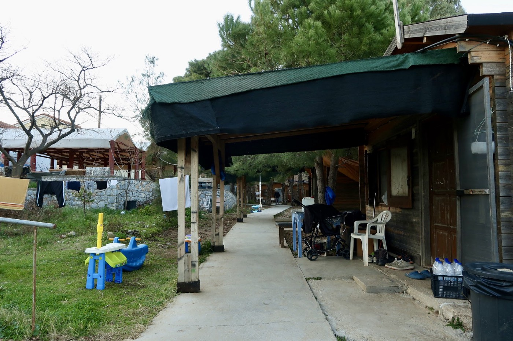

### Podcast: Pikpa, a Refugee Camp Based on Solidarity
#### An interview with Efi Latsoudi, a psychologist who funded the camp in 2012\. and continues to serve its inhabitants

On January 30th of this year I sat down with Efi Latsoudi at the Mosaik Center in Mytilini, Lesvos\. The conversation that followed can be heard in the most recent episode of Latitude Adjustment Podcast\. This third in a four\-part series is a collaboration between Latitude Adjustment Podcast and AYS, covering the personal narratives of refugees, volunteers, and local people on the island and in and around Athens\. You can catch all of the episodes on [the website](https://www.latitudeadjustmentpod.com/podcast) and previous written reports here on the AYS site\.

Originally from Athens, Efi Latsoudi studied psychology and worked with a range of vulnerable communities before moving to Lesvos in 2001\. Her experiences and her story provide a measure of historical context around the refugee crisis in Greece that we almost never get from traditional media\. For starters \(and as many frequent readers of the AYS Digests will already know\), refugees didn’t start coming to Greece in 2015\. That story starts much earlier, and many of the problems and tensions we are seeing today are a repeat of events that took place more than a decade ago\.

Efi Latsoudi began her work with refugees on Lesvos in the mid 2000’s but it was in 2012 that she founded [PIKPA refugee camp](https://www.lesvossolidarity.org/en/) \. Pikpa is a self\-organized alternative squat\-camp and a living political statement declaring how vulnerable people might be housed and treated if communities and resources were brought together in a more thoughtful and compassionate way\. To put it bluntly, PIKPA is the anti\-Moria Camp\. It’s small, quiet, and a refuge in the true sense of the word\. More than a holding cell at the end of a harrowing passage, it offers a place for actual healing to begin\. The camp is also very small\. At its height in 2015 it hosted around 600 people, but its capacity is closer to 150\. However PIKPA is far more than a space for alternative housing\. It distributes food, offers language classes and other services, and since its opening in 2012 it’s served tens of thousands of people\. It’s extension project, the Mosiak Center in Mitilini, functions as a community center, an exhibition space, and an adult education center\.

Among the questions raised in our conversation was where best to allocate our sympathy, support, and solidarity amongst the various stakeholders — refugees, local Greeks, and the international volunteers\. All of these communities overlap \(yes, there are [Greeks who are themselves descended from refugees](https://www.bbc.com/news/world-europe-36499727) \) \. All have found themselves caught first in [a political game between Turkey and the EU](https://www.nytimes.com/2020/02/29/world/europe/turkey-migrants-eu.html) and more recently on an island that has devolved into a prison colony and the home of Moria, Europe’s largest refugee camp\.

And if one is looking for a one\-sentence litmus to gauge where someone stands on the increasingly polarizing topic of competing grievances it might well be phrased as such: What of the struggles of the local Greek population? While opinions vary concerning their role as heroes \(indeed the Greeks of the Aegean Islands [were nominated for a Nobel Peace Prize in 2016](https://www.theguardian.com/world/2016/jan/24/greek-islanders-to-be-nominated-nobel-peace-prize) \), as hapless victims of a geopolitical extortion racket, and as a community that has grown increasingly [frustrated if not xenophonic and overtly hostile](https://www.nytimes.com/2020/03/07/world/europe/greece-turkey-migrants.html) over its place at the front lines of a foreign “invasion”, there is no question that the perceived burden of the refugee crisis on island residents has been converted into ideological currency for center right politicians and for far right extremists\.

Just as attempts to create a composite image of the ideal refugee are problematic and inevitably prejudiced, there is also no singular narrative about the “average Greek”\. Greeks founded Pikpa\. There are also Greeks who would like to see it dismantled and all of its residents unceremoniously deported\. The perspectives of Greeks and international volunteers will inform the focus of the last podcast in this collaborative series, to be released in the coming week\.

As for the more extreme expressions of intolerance, in the days and weeks after this conversation with Efi, right wing attacks on locals, volunteers, and refugees escalated and then exploded into a literal conflagration with the [burning of the School of Peace near Kara Tepe Camp](ays-special-from-lesvos-covid-19-and-an-island-bursting-at-the-seams-691475481680) , while the Greek government tried to force the construction of closed migrant detentions centers in various communities across the Aegean Islands\. For first\-hand testimonies of some of these attacks you can read [my previous report for AYS](ays-special-from-lesvos-right-wing-attacks-on-refugees-volunteers-and-locals-9f98779aef8e) on the subject\.

What we didn’t cover during our conversation for this podcast episode, and what we couldn’t have predicted, are the dramatic and terrifying implications of COVID\-19 hovering over what was already a perfect storm of overcrowding, political and humanitarian neglect, lawlessness, vigilante groups, and the filth that is Moria Camp\. So far no cases of the Coronavirus have been reported in the camp itself, but neither has testing been available\.

What’s more, Moria’s occupants have also been under a total lockdown for weeks, with little access to the funds they need to purchase foodstuffs that are unavailable in the camp\. An ATM was recently placed outside of Moria Camp \(a surreal image to anyone who has actually seen the camp\) \. That’s one ATM to serve 20,000 people\. That ATM is also a beacon that criminal elements can use to identify easy targets who will be returning to the chaos of the camp with pockets full of cash\.

Even the small trickle of 100 occupants per day which had been permitted to gather provisions in Mitilini was recently halted\. Moria has quite deliberately been converted into a massive billboard facing Turkey\. And its advertisement is quite simple, “abandon all hope ye who enter here”, [a message written in human suffering and painted afresh each day\.](https://www.theguardian.com/global-development/2020/jan/17/moria-is-a-hell-new-arrivals-describe-life-in-a-greek-refugee-camp)

Crowding in line for food distribution in Moria\. Photo Credit: Photo Credit: Mustafa Nadri, ReFOCUS Media Labs

By contrast Pikpa Camp offers a reminder of what Moria Camp could be, if some of the tens of millions of euros that appear to have gone missing since 2015 were effectively allocated to reduce suffering, manage the basic material and intangible needs of its inhabitants, and quickly move them on to the mainland and to new lives in other EU member states and in the West\. And this is exactly what some [movements are calling for](https://www.facebook.com/pg/europemustact/about/?ref=page_internal) \. Some will likely look at Pikpa camp as the embodiment of a quixotic vision or as a monument to naivete\. Others will nod to its good intentions but dismiss it as something that could only exist at its present scale\. But then it’s for the critics to explain the limitations of their own vision\.

Every single day human beings somehow manage to erect massive structures, manage complex multi\-state bureaucracies, move perishable goods across the planet, and provide life\-saving healthcare to tens of millions of people\. The only thing that seems fanciful is the notion that Western governments lack the capacity to adequately and humanely support what amounts to the population of a small town\.

Moria is a humanitarian black hole, an open air prison, and a blemish on the ideals of the EU not because the light of compassion cannot reach the camp, and not because the EU lacks the resources to help people or the ability to mobilise them, but because impediments have been carefully and willfully constructed to impede that light from reaching into the darkness\. And in the absence of political will and leadership in the community of nations it then falls upon the citizens of all nations to lead where their governments have faltered, and by virtue of their noble actions and resourcefulness to shame their leadership into leading morally\. Far from a naive vision, Pikpa is an inarguable declaration of the possible\.

In 2016 Efi Latsoudi was a co\-recipient of the Nansen Refugee Award from the United Nations for her work on Lesvos\. The award is given every year “to honor individuals, groups and organizations who go above and beyond the call of duty to protect refugees, displaced and stateless people\.” Past recipients include Eleanor Roosevelt and Medecins Sans Frontières\.

_This report was written by Eric Maddox, host and producer of [Latitude Adjustment Podcast](https://www.latitudeadjustmentpod.com/podcast) , who is currently collaborating with AYS on a series of episodes documenting the conditions of refugees and communities in Greece\. [Latitude Adjustment Podcast](https://www.latitudeadjustmentpod.com/) is a weekly show that highlights underreported issues, places, and communities around the world, with a special focus on human rights\. Eric completed his graduate research in International Conflict Transformation in The West Bank, and spent 2012–2016 working on independent media projects across the Middle East and North Africa, for which he founded the Dutch nonprofit, [Open Roads Media](https://www.openroadsmedia.org/) \. This was Eric’s first return to Lesvos since coming as a volunteer in late 2015\-early 2016\. You can follow the progress of his collaboration with AYS on Instagram: [latitude\_adjustment\_podcast](https://www.instagram.com/latitude_adjustment_podcast/)_

_Converted [Medium Post](https://medium.com/are-you-syrious/podcast-pikpa-a-refugee-camp-based-on-solidarity-28df2b0b5a5e) by [ZMediumToMarkdown](https://github.com/ZhgChgLi/ZMediumToMarkdown)._
