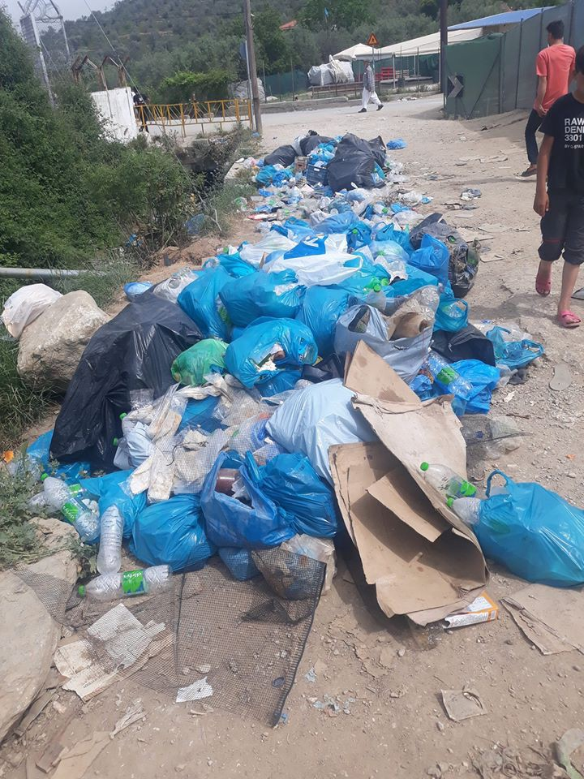
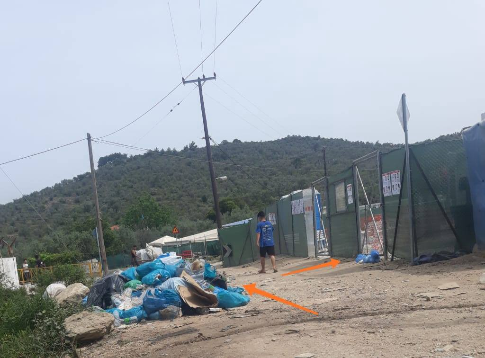

### AYS Daily Digest 18/05/20 Huge Crowds Outside of Reopened Greek Asylum Headquarters’ Offices

_70 people waiting at sea // Squat eviction in Athens // More unaccompanied children crossing English Channel // Army sent to Sid, Serbia // and more…_
### FEATURE: Huge crowds and lack of preparedness from reopening of Greek Asylum Services

The headquarters of the Asylum Service reopened on Monday morning after being closed for two months due to COVID\-19\. Greek media reports:

> “The service reopened without any timely preparation for the gradual service of the many thousands of pending cases and the proper information of those interested, who gathered to be served, most in vain\. After all, the service operated with half the staff to facilitate the keeping of distances in the offices\. 

> As there was no proper infrastructure inside the service to keep a distance, provide a mask, gloves and antiseptic and place plexiglass on the reception counters, service and information was provided on the sidewalk\. An employee of the service was in the yard, taking and handing out papers through the railings, which were the only ones holding the crowd\. Some were even forced to hang on the railings to gain access\.” 

People started gathering outside at midnight to wait\. There has been an increase in anxiety about everyone’s cases since they’ve been out of touch for two months\. More [here\.](https://www.efsyn.gr/ellada/dikaiomata/243840_ntropiastikes-eikones-synostismoy-kai-haoys-exo-apo-tin-ypiresia-asyloy)

](assets/87d8434ad6ed/1*6e0H8Zzxq-a9Quj3Wx4fRw.jpeg)

Photo by [Ef\. Syn\.](https://www.efsyn.gr/ellada/dikaiomata/243840_ntropiastikes-eikones-synostismoy-kai-haoys-exo-apo-tin-ypiresia-asyloy)
#### GREECE

](assets/87d8434ad6ed/1*M7DrMkwYI3Rp2zOXHz0sFA.jpeg)

“ **In the news they say today is the hottest day in Greece ever recorded in May** \. So everyone wants cold water and is collecting plastic bottles for our recycling truck\. It was crazy, but we managed\. On the other hand, these pictures are very sad: For may kids this becomes the biggest fun they have in the day\. So you can imagine the lack of fun they have here\.” Pictures taken by [Amani Hussein/MCAT](https://www.facebook.com/MoriaCoronaAwarenessTeam/posts/138999727729206?hc_location=ufi)

Photos by Moria White Helmets

Update from [Moria White Helmets](https://www.facebook.com/MoriaWhiteHelmets/posts/144120560564345?hc_location=ufi) :

> **“We are in strike\!** We are very sorry for the residents in zone twelve\. We served you and we want to serve you\. But today we decided after adressing this problem for three weeks not to pick the trash in front of IRC hospital any more until there is a proper deposit place\. 

> In April all zones 12, 11 and ten were full of rubbish and we started to mange with support from Stand by me Lesvos and Municipality\. Then a container hospital was build on the place of the old rubbish deposit and no new one created\. Since then refugees wait in the rubbish for medical service\.” 

### 52 people were evicted from Themistokleous refugee squat in Exarchia on Monday morning

[At 6:00 am](https://www.keeptalkinggreece.com/2020/05/18/greece-police-exarchia-squat-asylum-service/) on the day of the [third phase](https://www.facebook.com/spiroutrikoupi17/posts/909076746205793?hc_location=ufi) of reopening, the police evicted 52 people, most of whom were women and children onto the street, forcing them to become homelessness\. All 52, including 12 children, were taken to the police Aliens’ Department where their papers were checked and then were released to be left out onthe streets\. [Spirou Trikoupi 17](https://www.facebook.com/spiroutrikoupi17/posts/909076746205793?hc_location=ufi) comments:

> “This is as it seems the only “return to the normality” that the government was mentioning all this time, full of police arbitrariness, violence and evictions\.” 

![“I’d like to write shame but somehow the word has gone out\. At dawn, the Greek police violently evacuated a capture in which refugees lived \(that is, people in need protection under international conventions\) \. They were transferred to Petros Ralli to depict the channels the establishment of the doctrine of the “iron class” on the terrified faces of children\. And guess what they did to them next? Totally cynically left them in the middle of the street, homeless and helpless, without any concern where they sleep and if they have to eat\. The photo is taken a while ago in Exarchia square, where the refugees ended up with their children and their whole lives gathered in a trash bag\.” [Photo by Maria Louka](https://www.facebook.com/nobordersnetwork/posts/3004800269587845?hc_location=ufi)](assets/87d8434ad6ed/1*6e0H8Zzxq-a9Quj3Wx4fRw.jpeg)

“I’d like to write shame but somehow the word has gone out\. At dawn, the Greek police violently evacuated a capture in which refugees lived \(that is, people in need protection under international conventions\) \. They were transferred to Petros Ralli to depict the channels the establishment of the doctrine of the “iron class” on the terrified faces of children\. And guess what they did to them next? Totally cynically left them in the middle of the street, homeless and helpless, without any concern where they sleep and if they have to eat\. The photo is taken a while ago in Exarchia square, where the refugees ended up with their children and their whole lives gathered in a trash bag\.” [Photo by Maria Louka](https://www.facebook.com/nobordersnetwork/posts/3004800269587845?hc_location=ufi)

■■■■■■■■■■■■■■ 
> **[Mare Liberum e.V.](https://twitter.com/teammareliberum) @ Twitter Says:** 

> > 🔴Breaking: 100 registered #refugeesGR were taken against their will from #Igoumenitsa and brought  to Turkey. This biggest-ever pushback is nothing but state organized kidnapping. The systematic human rights violations must stop! #PushBacksAreIllegal #NotMyEU 

> **Tweeted at [2020-05-18 10:05:11](https://twitter.com/teammareliberum/status/1262323337964843008).** 

■■■■■■■■■■■■■■ 

AYS will continue following this closely\.

[Here is an excellent video](https://www.facebook.com/bbcpanorama/videos/936438620120249/) of an Afghan journalist, who lives in a refugee camp outside of Athens, explaining how one family in the camp has to live after one member tested positive for COVID\-19\. The crowed conditions are entirely accurately shown and everyone is in fear of spread\.
#### MALTA

A Maltese fishing vessel rescued 70 people off the coast of Lampedusa Sunday morning\. Unfortunately, but unsurprisingly, there is a stand off between Italy and Malta as to who will let them dock\. They were rescued in Italian waters but by a registered Maltese vessel and both countries have closed their ports due to COVID\-19 concerns\. More [here](https://www.maltatoday.com.mt/news/national/102420/malta_italy_standoff_over_fishing_vessel_that_rescued_migrants_off_lampedusa?fbclid=IwAR2Bk4fd7liXhvilvk2U63L5Ahbh3tYrZbQq6XfTSOnHj17g5XZwz_oEAzQ#.XsMwDmhKg2w) \.
#### ITALY

Mixed Migration Centre just published [**“MMC Europe 4Mi Snapshot — May 2020 Destination Europe — Migrants and refugees in Italy looking back at their migration journey\.”**](http://www.mixedmigration.org/wp-content/uploads/2020/05/103_snapshot_EU.pdf) They gather important insight from their interviews, but also make clear:

> “This snapshot provides information on the situation for migrants and refugees in Italy before COVID\-19 was declared a pandemic\. At the time of writing, the impact of the COVID\-19 crisis on living conditions for refugees and migrants in Italy remains uncertain\. Government measures to contain the virus mean vulnerable people living on the streets face severe challenges to meet their basic needs, access to services is constrained, people cannot attend interviews for refugee status determination, and xenophobia has increased\. However, we also witness an opening up of access, for example discussions around regularization of migrant workers and citizens in Italy\.” 

#### SPAIN
### 87 people were rescued off the coast from the Canary islands over the weekend

Early on Saturday morning 38 people came close to Fuerteventura and on Sunday 49 people were rescued near Gran Canaria\. Most of those rescued are minors\. There has been a significant increase in new arrivals through this route over the past month\. More [here\.](https://www.infomigrants.net/en/post/24816/87-migrants-rescued-off-the-canary-islands?fbclid=IwAR3iYqhL1L5gOQTI0NhgplnIwk6HpzKuK0pkznVbSt1HRKYPPNwHDQgPhtQ)
#### SERBIA

](assets/87d8434ad6ed/1*hZ1R2cnty8WOOqW7s7A0eg.jpeg)

Photo by [No Name Kitchen](https://www.facebook.com/NoNameKitchenBelgrade/photos/a.312076942523930/983919395339678/?type=3&theater)

In an update from No Name Kitchen:

> “WE ARE BACK\! Again on the ground after almost two months of break due to the Covid\-19\. crisis Sid received us with his usual silence, the sun is absent in the morning and every afternoon the same drizzle repeats\. The house added some hate messages on the facade but nothing out of the usual\. In a few hours we were able to assemble the kitchen, ordered the warehouse and in less than 24 hours we reactivate distributions of clothes, food, hygiene elements, blankets, tents and sleeping bags\. 

> What’s the picture in Sid? **Last Friday, President Aleksandar Vucic announced the army’s dispatch to this village of 14 thousand inhabitants under the excuse of protecting citizens and private property from possible attacks by migrants\.** Nonsense\. No single case of violence was recorded during the Coronavirus period but they send troops to guard the perimeter of the three official camps\. Military police made the advance on the same day of the statement and, at night, soldiers and vehicles arrived at the income of the grounds and also set up a military store in front of the railway station\. 

> At the moment there is no clear decision regarding the freedom of movement of people who are locked in official centers\. In Krnjaca, located on the outskirts of Belgrade, every morning authorities allow up to five people to leave by barracks \(they are around 18\) \. Despite the military presence in Sid, both in Adasevci and the Family Center people can get in and out without major problems\. The situation is different in Principovac, where doors closed since the arrival of the Army\. It is estimated that the three sites still gather around 1800 people\.” 

There is a lot of confusion about the army being deployed to Sid\. There have been no reports of violence of other outstanding incidents\. [Tomas D’Amico](https://balkaninsight.com/2020/05/18/serbian-move-to-deploy-army-near-migrant-camps-questioned/?fbclid=IwAR0mHSsHrO7Y5dgWR0HqmlWKvkQGdcPISBJPufL_RicEHtseEAPZn-as56U) , an activist from No Name Kitchen said:

> “The situation here in the town and the surroundings is pretty calm\. As far we we know, we do not have any incidents between migrants and locals\. We still do not get the decision to bring the army here\.” 

#### GERMANY
### Deportations are down in the first quarter of 2020

4,088 people were deported from Germany, which is 27% fewer than in 2019\. The left party is still calling for deportations to be called off entirely due to continuing concerns over COVID\-19\. The Interior Minister does not agree that all need to be stopped, however all Dublin transfers have remained postponed since April\. More [here](https://www.infomigrants.net/en/post/24809/deportations-from-germany-down-in-first-quarter-of-2020?fbclid=IwAR1l-NfuuXTZk5RSXOqoECHdGCgPj_RL3mYbdFkige0lq7WcePx6qRL7FGo) \.
#### UK
### There is a rise in unaccompanied children arriving to Kent by boat: “We need a sense of urgency about this”

Kent’s county council leader [Mr\. Gough reports](https://www.expressandstar.com/news/uk-news/2020/05/18/sense-of-urgency-needed-to-deal-with-costs-of-caring-for-migrant-children/) that not only have the number of asylum seeking minors doubled in the county in the past year, but:

> “A drop in lorries crossing the Channel due to coronavirus had caused a rise in children arriving in dinghies…What we are now seeing, particularly as you can imagine all the changes with lockdowns across Europe and a significant reduction in freight transport, is that actually the boats are becoming a route for those unaccompanied asylum\-seeking children ” 

There are fears of increases in [modern slavery](https://www.bbc.com/news/amp/uk-england-kent-52680025?fbclid=IwAR2_CYy-QywpHJPqgYAv7NUYUVPflfcdAbbCKuoex6fmSj4Y2fID-aO-GbQ) and [how to pay](https://www.expressandstar.com/news/uk-news/2020/05/18/sense-of-urgency-needed-to-deal-with-costs-of-caring-for-migrant-children/) for these unaccompanied children as county finances are already struggling from the pandemic\.
#### GENERAL

Here is a concise article by Katie Dancey\-Downs on [“Countries exploit COVID\-19 pandemic to shut down borders and clock refugees\.”](https://shadowproof.com/2020/05/18/countries-exploit-covid-19-pandemic-to-shut-down-borders-and-block-refugees/?fbclid=IwAR1bjAaMyvHRuqiG0f3JRW4F8uRL2C0cz2xiimRihnKsJBD-zuFGy4nmFlU) Measures include:
- Political moves instead of effective quarantine measures
- Suspension of search and rescue operations
- Closing of ports of arrival
- Withholding reception conditions and access to asylum at external borders
- Suspension of a majority of displaced people’s rights under COVID\-19 restrictions

During this time of unprecedented challenge, let us keep each other safe, especially the most vulnerable among us\.

**Find daily updates and special reports on our [Medium page](https://medium.com/are-you-syrious) \.**

**If you wish to contribute, either by writing a report or a story, or by joining the info gathering team, please let us know\.**

**We strive to echo correct news from the ground through collaboration and fairness\. Every effort has been made to credit organisations and individuals with regard to the supply of information, video, and photo material \(in cases where the source wanted to be accredited\) \. Please notify us regarding corrections\.**

**If there’s anything you want to share or comment, contact us through Facebook, Twitter or write to: areyousyrious@gmail\.com**

_Converted [Medium Post](https://medium.com/are-you-syrious/ays-daily-digest-18-5-20-huge-crowds-outside-of-reopened-greek-asylum-headquarters-offices-87d8434ad6ed) by [ZMediumToMarkdown](https://github.com/ZhgChgLi/ZMediumToMarkdown)._
