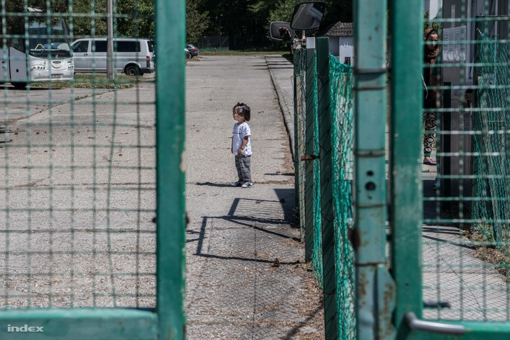
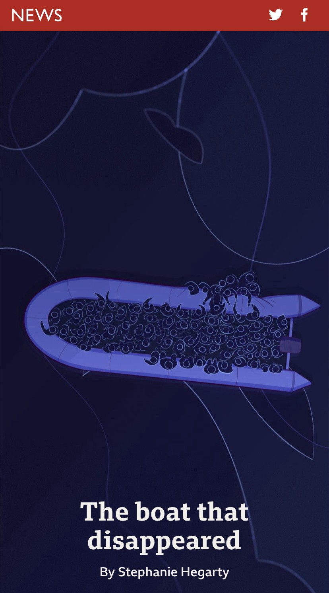
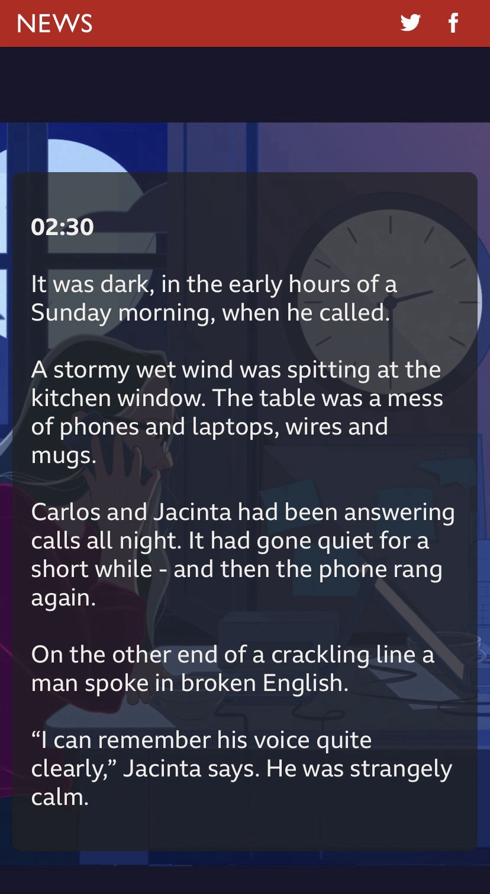
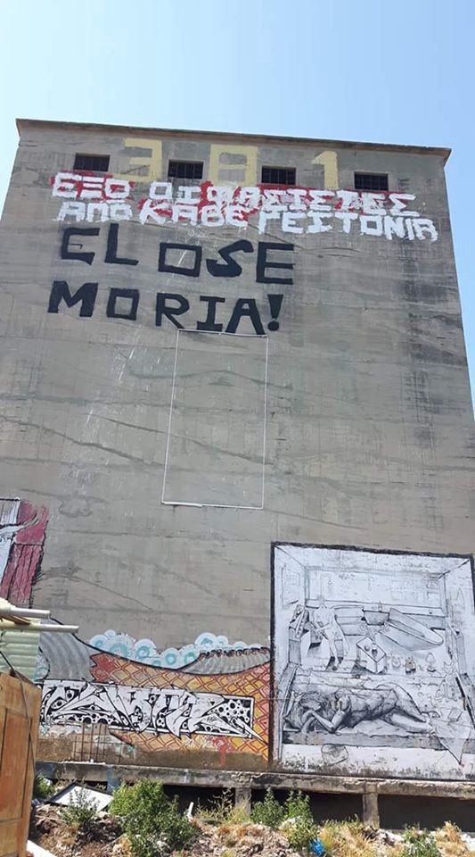
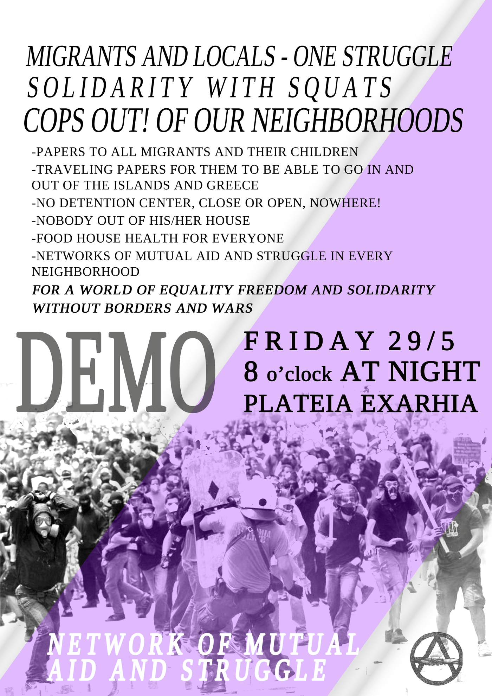
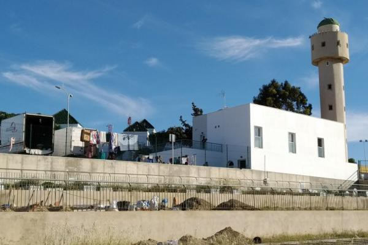

### AYS Daily Digest 25/05/20 “What makes me mad is that my children had to grow up in prison” in Hungary
### Reminder of critical shortages of vaccines in Libya // BBC reporting of 91 people missing at sea // fear of serious COVID\-19 spread in German shelters // and more…

[Are You Syrious?](@AreYouSyrious?source=post_page-----4bf6f01156e3----------------------)

[May 26](ays-daily-digest-what-makes-me-mad-is-that-my-children-had-to-grow-up-in-prison-in-hungary-4bf6f01156e3?source=post_page-----4bf6f01156e3----------------------) · 8 min read

### FEATURE “What makes me mad is that my children had to grow up in prison”

Words from a father who was just released from a transit zone in southern Hungary\. Hungary decided to shut down all of their transit zones last week after the European Court of Justice ruled that holding asylum seekers in these zones constituted unlawful detainment\. No one was allowed to enter these holding zones and what happened inside was largely kept from the world\. Here are some testimonies reported by FÖLDES ANDRÁS who talked to a father who had been trapped living there for two years:

> _“Once a week, a psychologist visited the camp\. On one occasion, I flipped out about what kind of life this is, that I cannot handle it anymore\. We were kept in the dark about our case\. By that time, it had been a year and a half since we lodged our asylum request, but nobody said a word on why there is no decision, why we are still held captive\. I was shouting, but then the psychologist said that if I lose my temper like that, we would have to end our conversation\. Of course, I was upset\. I never went back for another session\.”_ 

And

> _“It was difficult when they asked me, **‘Daddy, why are we locked up?’** I could not let my desperation show because that would have crippled them\. I reassured them that we would still have to wait a little bit, but then our case would be sorted out, and we could leave\. My heart was heavy, but I knew that we did not do anything wrong, it was not my fault that we were there\.”_ 

According to a lawyer from the Hungarian Helsinki Committee, they were trapped waiting for a decision for two years because of a mistake in the procedure; the family’s case was not complicated\. Read more [here](https://index.hu/english/2020/05/25/transit_zone_hungary_ecj_vamosszabadi_camp_iraqi_family_interview_asylum_seeker/?fbclid=IwAR1nOk19Zd05iuyrz1XCuWpXxh8_yNhSAGLc9ebs7w8RM7CTUNeiDrzlAZc) \.
### LIBYA
### UNICEF and WHO warn that a lack of vaccines is putting 250,000 babies at risk in Libya

Both organizations are warning that this could lead to serious outbreaks of measles and polio, and that refugee and internally displaced children are most at risk\. They warn in [a joint statement](https://www.unicef.org/press-releases/over-quarter-million-children-libya-are-risk-vaccine-preventable-diseases) :

> _“There are acute shortages of **hexavalent vaccine** , which protects against six diseases \(diphtheria, tetanus, pertussis, poliomyelitis, Haemophilus influenzae type b and viral hepatitis B\) \._ 

> _Similarly, **oral polio vaccine** , which is administered at birth and at nine months of age, is in critically short supply\._ 

> _Children in hard\-to\-reach and conflict\-affected areas are at particular risk because they may have already missed some vaccination doses\._ 

> _WHO and UNICEF are also concerned that many migrant, refugee or internally displaced children may not have received their basic vaccination doses in their country of origin or may have missed the required doses in Libya\._ 

> _Procurement orders for essential vaccines have been delayed because of lengthy governmental approval processes\. Libya’s Expanded Programme on Immunization \(EPI\) was disrupted due to vaccine stockouts in 2019\._ 

> **_With a saturated global supply chain and constraints arising from the COVID\-19 pandemic, the country is likely to face an extended stockout for a second year running\._** _”_ 

According to [Safa Msehli](https://www.arabnews.com/node/1679776/middle-east) , a spokeswoman for IOM, they were taken to the Al\-Nasser detention center in the town of Zawya, which is west of Tripoli\. 
Msehli warns that **departures from Libya have increased** , which is _“especially worrying amid a sharp decrease in … search and rescue capacity\.”_
### It’s worth stating again that last month IOM reported it’s estimated that the number of people who have died from crossing the Mediterranean since 2014 had surpassed 20,000\.

As the civil war’s end is not yet in sight, so sea rescue continues to be an imperative\. People are not going to stop crossing soon, and if they are forced back to Libya, they might suffer a fate like Tewelde Andom, who died this month from a heat stroke in detention\. Andom is among the many refugees who have died after being sent back to Libya to live in slavery\-like conditions\. Read more on this funny and caring man’s story [here](https://www.irishtimes.com/news/world/africa/migrant-39-who-failed-to-reach-europe-dies-in-libyan-detention-centre-1.4262356?fbclid=IwAR0MMW4GygN0n3h4LfHRbkDi5pPj16vrl6zxVJ2_JNyxYANmYJ_NmdPUdIQ) \.
### TUNISIA

One person is dead and six are still missing after a shipwreck off the coast, near the city of Sfax\. The shipwreck happened on Saturday morning and the Tunisian coast guard only found one body\. **The Tunisian coast guard says that human trafficking has increased recently** \(similar to Libya\), with a growing fear of livelihoods and unemployment in Tunisia and Sub\-Saharan Africa\. More [here](https://www.infomigrants.net/en/post/24953/shipwrecks-off-tunisian-coast-one-dead-six-missing?fbclid=IwAR1uht_JnudPf24N4nkCEQsxLuvDqBkr_56oiqywJRW6jT0MB4JZSmiNU2Q) \.
### SEA

> _“Three and a half months ago a boat left the coast of Libya, got into trouble and called for help — then 91 people just disappeared\. This is the story of their last calls\. And the people who are left searching for them\.”_ 

Please [check out this reporting](https://www.bbc.co.uk/news/extra/vdb6u1mrrv/the-boat-that-disappeared?fbclid=IwAR26397kdW2QVcLL8g91_DkcSac1gM1nH-QwL7HTTbDHnLI0pKOIUEAr8MM) \. It’s equally excellent and heartbreaking\.
### GREECE
### France is set to relocate 750 asylum seekers and unaccompanied minors from Greece

After a Monday meeting between Alternate Minister of Migration & Asylum Giorgos Koumoutsakos and French Ambassador to Greece Patrick Maisonnave, the decision was announced for France to take in 400 asylum seekers and 350 unaccompanied minors\. The first 50 of the unaccompanied minors are not set to leave until July\. France also said it wants to ramp up its support for Frontex\. More [here](https://www.amna.gr/en/article/460474/France-to-relocate-750-asylum-seekers-and-unaccompanied-minors-from-Greece?fbclid=IwAR2F4OFg_JreZIPCcZ4TcysfLckg0wWIAzsNERPtIlrG6TXmMCWe1wULDcI) \.

### Apparently, the Regional Authority of the North Aegean is trying to sue Moria Corona Virus Awareness Team for using the term “Greek side of the island”

They are seriously stipulating that this phrase means that the organization was implying that Moria is not Greek federal territory\. All the group was doing was trying to show that there are differences in the ways of life between inside the camp and elsewhere \(no one can logically question this\) \. _“While Greeks have access to all goods and rights, those living in Moria lack even basic necessities such as water and security,”_ spokesman Mohammed Ali Zantah reportedly said\. More [here](https://www.keeptalkinggreece.com/2020/05/25/lsevos-regional-authority-mcat-greek-side/) \.

Also on Lesvos, a woman who was [a suspect](https://www.ekathimerini.com/253033/article/ekathimerini/news/woman-who-fled-after-moria-killing-arrested-on-lesvos?fbclid=IwAR0MMW4GygN0n3h4LfHRbkDi5pPj16vrl6zxVJ2_JNyxYANmYJ_NmdPUdIQ) in the fatal stabbing of a woman outside Moria has been arrested\. She also lives in the camp and is facing charges of intentional homicide and violating laws on arms possession\.

In other news from Samos, hopefully some justice for pregnant women having to live outdoors:

In an update from [Franziska Grillmeier](https://twitter.com/f_grillmeier/status/1264184831417749505) on the 16 refugees who are waiting for COVID\-19 test results in old buses at the port of Mytilini:

> _“The 16 refugees from Afghanistan and Syria are still waiting in the buses on the barbed wire\-clad rear part of Mytilini\. All of them have now tested negative and should remain on the buses for now\.”_ 

### MALTA

Home Affairs Minister Byron Camilleri says he is not aware of reports that there is a hunger strike aboard Captain Morgan’s boat\. The boat is holding people who were resuced on April 30th and May 7th\. While women and children were taken ashore, the people left on board are stuck because of Malta’s decision to close ports to refugees during COVID\-19\. [More here](https://www.maltatoday.com.mt/news/national/102574/minister_disputes_ngos_claims_of_hunger_strike_by_migrants_on_captain_morgan_boat?fbclid=IwAR0mwt-niZ2Noark6-zIASwInJSjU0PRCoHRXK_LPJ-ke7PTOMExADnICfc#.XsxhSGhKg2x) \.
### ITALY

Stefania D’Ignoti reports for the New Humanitarian [_“Italy’s coronavirus amnesty: Migrant rights or economic self\-interest?”_](https://www.thenewhumanitarian.org/feature/2020/05/25/Italy-coronavirus-migrant-labour?fbclid=IwAR03aWYxMYixL9LIbrsw8oXYCZDJtuh6vWC1YrDK4PEuep_4TLnQ9Vq_SIU) and contends that excitement for the new law passed two weeks ago has faded:

> _“The Italian government passed a law on 13 May paving the way for around 200,000 undocumented workers to apply for six\-month legal residency permits…_ 

> _Supporters still say the new law is an important, if tentative, improvement\. But critics argue that it amounts to little more than a temporary amnesty that puts economic interests ahead of human rights and will do little to address the rampant exploitation of migrant labour, especially in Italy’s agricultural industry…_ 

> _‘Legal papers don’t necessarily protect you from exploitation,’ said Michele Mililli, a USB representative in Sicily\. ‘This is a structural problem that should not have been addressed during a healthcare emergency, but much earlier\.’”_ 

Italian news media is reporting that there was a _“second landing of \(people\) in southern Sardinia from the end of the lockdown: a small boat with 12 people on board, including a minor, was intercepted by the men of the Guardia di Finanza, while three other small boats that were approaching the Sardinian coasts were stopped by the Algerian navy\. All 12 migrants were accompanied to the port of Cagliari where policemen from the Immigration Office of the Police Headquarters and the mobile team were waiting for them\.”_ More [here](https://www.cagliaripad.it/464323/migranti-secondo-sbarco-nel-sud-sardegna-fermati-11-adulti-e-un-minore/?fbclid=IwAR1uNH6o2cZPjTOpNZx4AcrBtTKZB8aYhY21uDWvrAWja11H_09leCEd6Rc) \.
### SPAIN

Publico is reporting that in Spain _“Dozens of Moroccan citizens, the vast majority elderly and women with children, have been living in vans and in a room of the mosque for two months waiting to be able to return to their country, while the city government looks the other way\.”_ A woman living there said:

> _“No one tells us anything\. It is rumored that they will let us through when those who crossed last week exceed the quarantine in Saidía and make sure there is no case, despite the fact that they detected a possible coronavirus\.”_ 

These possibilities have not been confirmed nor has coordination between Morocco and Spain\. [More here](https://m.publico.es/sociedad/2783715/los-camiones-de-un-cementerio-cobijo-de-las-marroquies-varadas-en-melilla/amp?utm_source=twitter&utm_medium=social&utm_campaign=web&__twitter_impression=true) \.
### GERMANY

DW news published a video reporting on the spread of COVID\-19 in refugee shelters in Bavaria\. With such crowded living conditions, many shelters in Germany have widespread outbreaks\. Many people are making masks for themselves and others\. Many people who have been infected are on lockdown in shelters with everyone else\. Find the video [here](https://www.dw.com/en/german-refugee-centers-struggle-to-contain-outbreaks/av-53556073?fbclid=IwAR0txAqP-nTCa5nrf9xvfCrjd3pq8Azua3iQVETEAPzwTJl9IWMxMnPKKOc) \.

**Find daily updates and special reports on our [Medium page](https://medium.com/are-you-syrious) \.**

**If you wish to contribute, either by writing a report or a story, or by joining the info gathering team, please let us know\.**

**We strive to echo correct news from the ground through collaboration and fairness\. Every effort has been made to credit organisations and individuals with regard to the supply of information, video, and photo material \(in cases where the source wanted to be accredited\) \. Please notify us regarding corrections\.**

**If there’s anything you want to share or comment, contact us through Facebook, Twitter or write to: areyousyrious@gmail\.com**

_Converted [Medium Post](https://medium.com/are-you-syrious/ays-daily-digest-25-05-20-what-makes-me-mad-is-that-my-children-had-to-grow-up-in-prison-in-67cc96fe37f1) by [ZMediumToMarkdown](https://github.com/ZhgChgLi/ZMediumToMarkdown)._
