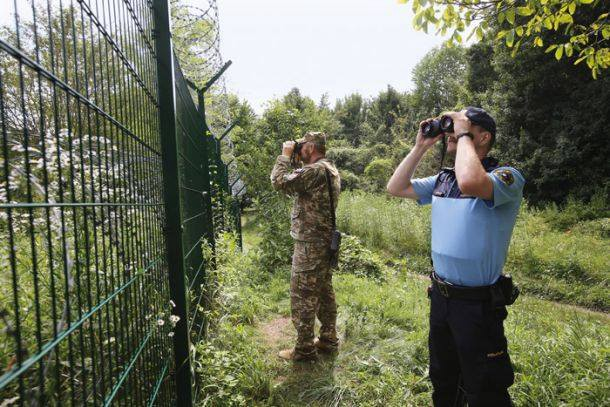
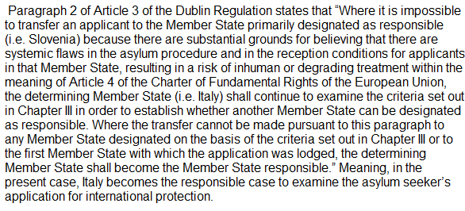
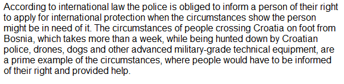
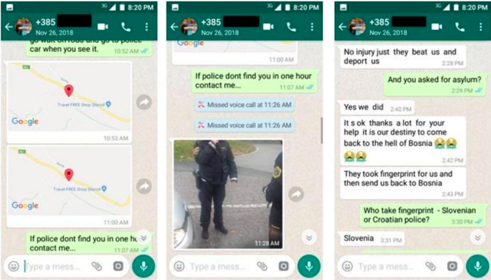

### AYS Special: **Italian Court StopsDeportation to Slovenia, Meanwhile Pushbacks Continue**
#### **Italy has become the latest link in chain push backs where literally thousands of people — often violently — end up in the overcrowded camps of Bosnia and Serbia\.**

Photo by Borut Kranjc \(Mladina\), courtesy of the author
### Contradictory approaches in Italy

An Italian court stopped deportation to Slovenia on the grounds that there is a risk for an asylum seeker to be subjected to inhumane and degrading treatment due to the high possibility of him \(or her\) being further expelled to Croatia and then to Bosnia or Serbia\. However, although the court stopped the deportation of a single individual, collective push\-backs from Italy are becoming increasingly common in the months since the judgement made by the court in Genova \(April 7th\) \. Thus Italian courts are acknowledging the cruel and inhumane treatment that a returnee is subjected to but, on the other hand, the Italian government is massively increasing the scope of push\-backs to Slovenia, as is evident in the recent decision to deploy the army with police jurisdiction\.

> **16\.000 people were returned to Croatia from Slovenia in the last two years\.** 

These are people who were caught and were processed in police stations with charges of illegal border crossing\. When a person asks for asylum in slovenia, he is often faced with threats or the asylum claim is simply ignored and in the official records he is reported as an “economic migrant” — a category invented by the Ministry of Interior and the Police and not encompassed by any law\. If one is classified as an “economic migrant” who has no interest to seek asylum, he can be returned to Croatia under a bilateral readmission agreement from 2006\.

The Court in Italy is concerned over systemic deficiencies in the Slovene asylum system and finds real risk for an asylum seeker to be subjected to inhuman and degrading treatment if deported to Slovenia\. Meanwhile, reports of daily informal deportations from theItalian — Slovene border are becoming more and more common\.

The first court ruling confirming allegations of systemic deficiencies in the Slovene asylum system and high risk for asylum seekers to be subjected to inhumane and degrading treatment contrary to the provisions of Article 4 of the EU Charter of Fundamental Rights\.
### **COURT RULING:** “… **_the risk of the applicant being subjected to inhuman and degrading treatment in Slovenia seems justified_** _…_

In early April a court in Genoa, Italy found that:

> _“Based on the submitted documentation and additional information obtained by this court proprio motu, the applicant’s complaint — given the conditions of receiving refugees in Slovenia and systemic shortcomings in the asylum procedure — seems justified\. \(…\)_ 

> _In this case, **the risk of the applicant being subjected to inhumane and degrading treatment in Slovenia seems justified** \(…\) The data collected raise serious concerns about the reception and asylum system currently in force in Slovenia and in general about the **atmosphere of cultural intolerance and discrimination** prevailing in civil society, among government leaders and between police forces towards foreigners who have entered the country illegally, who have lodged or intend to lodge an application for international protection\.”_ 

Push backs from Schengen are continuing despite the epidemic and other circumstances\. A person from Algeria had his finger amputated by a surgeon in ISlovenia and next day he was already in Bosnia\.

The complaint was lodged by a Pakistani asylum seeker, represented by Alessandra Ballerini, who had first filed the application for international protection in Slovenia and was consequently expected to be deported from Italy to Slovenia according to the Dublin regulation\.

The complaint stipulated that such a deportation would violate, inter alia, paragraph 2 of Article 3 of the Dublin Regulation due to systemic deficiencies in the asylum system in Slovenia\. The court agreed and refused to deport the asylum seeker to Slovenia, _“_ because of the danger that he would be treated there contrary to fundamental humanitarian principles and contrary to the provisions of Article 4 of the EU Charter of Fundamental Rights _”_ \.

As reported by [Primorski dnevnik](https://www.primorski.eu/se/slovenija-na-slabem-glasu-glede-ravnanja-z-migranti-IC501192?fbclid=IwAR2ghXhAYLGzYwMKxP64o57QR9XFo0nJsFwr6xS4-AAcQfVpUt8pO-9ciGM) , the judges came to this conclusion taking into account reports of non\-governmental organizations on the deteriorating treatment of migrants in Slovenia in the past two years and a 2018 report by the UN High Commissioner for Refugees \(UNHCR\), which confirms allegations by non\-governmental organizations of collective expulsions and violence against migrants in the Balkan region, including Croatia and Slovenia\.

Reports of several Slovenian and International NGOs and civil society actors \(Amnesty International, Are You Syrious?, InfoKolpa, Border Violence Monitoring Network\) highlight the issue of the Slovenian police authority’s illegal restrictions of access to asylum and practice of forced returns of asylum seekers without a proper assessment of whether their human rights would be violated in other countries via an informal procedure and without the possibility to appeal the deportation \( _push\-backs_ \) \.

This was shown by several fact\-finding missions: [a survey from 2018 by Amnesty International](https://www.amnesty.si/media/uploads/files/Slovenia%20-%20Push-backs%20and%20denial%20of%20access%20to%20asylum%2C%20Amnesty%20International(1).pdf) obtained testimonies of 51 people in Velika Kladuša and Bihać in BiH, who were returned to the hands of the Croatian authorities by the Slovenian police, despite the fact that they wanted to apply for asylum in Slovenia\.

[Report on illegal practices of collective expulsion at the Slovene\-Croatian border](https://push-forward.org/sites/default/files/2019-08/Report%20on%20illegal%20practice%20of%20collective%20expulsion%20on%20slovene-croatian%20border.pdf) by InfoKolpa documents numerous cases of groups of migrants rejected by Slovenian police and returned to Croatia and further to Bosnia despite explicitly showing intention to file for asylum in Slovenia between 11th September and 7th November 2018 via an Alarmphone report; reports by No Name Kitchen and Balkan Violence Monitoring show collective expulsion and violent return of asylum seekers to the Bosnian border surrounding Velika Kladuša as a routine occurrence initiated by Croatian and Slovenian police forces\.

An example of alarm phone activity

In one year there were 4,653 out of a total of 9,149 intercepted migrants that were collectively deported to Croatia\. The above\-mentioned reports also cite further official statistics from the Slovenian police, which show a change in practice between May and June 2018, when returns to Croatia increased sharply, while at the same time the number of people applying for asylum dropped severely\. Police statistic from police station of a border town Črnomelj state that in May 2018, 371 of the 379 migrants considered \(97\.88% of all\) applied for asylum; after receiving different instructions from the Chief of police, in June only 13 of the 412 migrants, ie 3\.15%, lodged an asylum application\.

**NGOs accuse the Slovenian government and police of preventing refugees from filing asylum applications and of carrying out collective forced returns without a proper and individual assessment of whether their human rights will be violated in other countries and without the possibility of appeal\.**

Returns to Croatia are carried out on the basis of a controversial bilateral agreement between the two countries from 2006 \(when Croatia was not yet a member of European Union\), which enables informal returns under an abbreviated procedure\. According to the court in Genoa, such an abbreviated procedure violates Slovenia’s human rights obligations\.

These findings are further corroborated by an official 2018 report of the UN High Commissioner for Refugees \(UNHCR\), which confirms allegations by non\-governmental organizations of collective rejection and violence against migrants in the Balkan region, including Croatia and Slovenia\.

Primorski dnevnik cites the court decision featuring portions of NGO reports, saying:

> _“Threats, violence, abuse of power and denial of fundamental rights have become common practice at border police stations, and collective deportations to Croatia are repeated daily with the support and awareness of senior police and government officials, despite the high risk of further police violence and theft in Croatia\.”_ 

Slovenian daily newspaper Dnevnik asked Slovenian police for comments on the judgement, and they replied that their procedures were legal and professional, that the guidelines for the work of police officers had already been made public and that UNHCR had not discovered any irregularities when visiting police stations\. The Ministry of the Interior replied that they were fully implementing EU legislation in the field of international protection, and that they were not aware of the ruling and could not comment on it\.

Though there was a decrease of irregular entries into Slovenia during the past few months there was an increase of record irregular entries recorded by Italian authorities\. This has resulted in minor diplomatic tension between the countries where Slovenia has been dismissed as not being diligent enough in their Schengen gatekeeping duties\.
#### We suspect that there are two reasons that Italian authorities are recording an increase of border crossings:

First, as [InfoMigrants](https://www.infomigrants.net/en/post/24755/helping-the-invisible-italy-s-amnesty-for-undocumented-workers-explained) reported, as part of covid\-19 measure the Italian authorities announced temporary legalisation of undocumented residents\. We suspect that this might be a reason for a greater number of people reporting themselves and, thus, creating a spike in official records\. Connected with this reason might be the Covid\-19 measures as traveling became more difficult a greater number of people might be pressed to weather the virus in border municipalities \(such as Trieste\) \.

Migrants \(as well as border tensions with Slovenia\) are traditionally a convenient distraction for the Italian government\(s\) in time\(s\) of crisis\. To show its commitment to regulating the frontier the Italian government deployed the armed forces to aid police in intercepting migrants via the last stretch of the Balkan route\. As Uroš Škerl reported for the daily newspaper [Dnevnik](https://www.dnevnik.si/1042930566/slovenija/na-meji-s-slovenijo-zdaj-tudi-italijanski-vojaki) in the last month Italy returned more people than in the previous four months combined \(29 compared to 27 from January to April\) \. In a statement for Dnevnik **Gianfranco Schiavone** of the NGO Consorzio Italiano di Solidarietà — Ufficio Rifugiati Onlus stated:

> **_“What is new in the last week is that the Italian police started to return people for whom we are convinced that they have the same circumstances as their colleagues that applied for asylum and stayed in Italy\.”_** 

These returns are now conducted with the aid of the armed forces whose deployment the interior ministry justified as _“an answer on illegal migrations”_ \. Schiavone is skeptical of the military as they are not trained to conduct border patrols and handle asylum seekers adding: _“this is all just political theater”_ \.

This latest act of EU migration policy melodrama has actors that are less fortunate than others\. According to Dnevnik there have been three groups of people \(14,17,8\) returned to Slovenia and we suspect that at least one of these groups \(if not all\) has ended up in Velika Kladuša \(BIH\) \. A video emerged with a statement of a member of one of these groups containing claims of violent treatment during the Italy\-BIH pushback was [published recently by a migrant/activist](https://www.facebook.com/lagkadikia.camp.12/videos/255675708979162/) : “This boy who left his fingerprints in Trieste and applied for asylum ، was deported to Slovenia and gradually back to hell”\.

> So, on the one hand, Italian courts have found that push backs are cruel and inhumane, yet at the same time the same government has doubled down on its commitment to condemning people to this fate that its own courts find inhumane and cruel\. 

Although the condemnation of deportation is a necessary first step, unless this idea is used to hold the security forces to account for their oppression and torture of people, it will remain a hollow ruling\. Europeans like to look down on the USA due to their police violence on minorities, state hypocrisy towards its own values and their border walls\. Maybe we should stop looking across the ocean and look closer to home\.

**_Written by: Iza Thaler and Miha Turk from InfoKolpa_**

**Find daily updates and special reports on our [Medium page](https://medium.com/are-you-syrious) \.**

**If you wish to contribute, either by writing a report or a story, or by joining the info gathering team, please let us know\.**

**We strive to echo correct news from the ground through collaboration and fairness\. Every effort has been made to credit organisations and individuals with regard to the supply of information, video, and photo material \(in cases where the source wanted to be accredited\) \. Please notify us regarding corrections\.**

**If there’s anything you want to share or comment, contact us through Facebook, Twitter or write to: areyousyrious@gmail\.com**

_Converted [Medium Post](https://medium.com/are-you-syrious/ays-special-italian-court-stops-deportation-to-slovenia-meanwhile-pushbacks-continue-a0370c30cd02) by [ZMediumToMarkdown](https://github.com/ZhgChgLi/ZMediumToMarkdown)._
