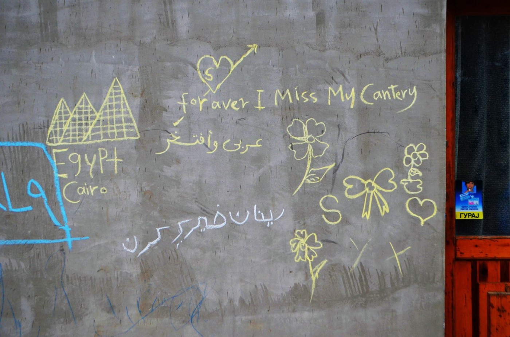

### AYS Daily Digest 5/6/20: Will the Dutch take responsibility for 500 unaccompanied minors from the Greek camps?
#### Ahead of the Dutch governments decision on whether or not to accept children from the Greek camps, we should all ask ourselves — why aren’t they already safe and going to school? Should these discussions even take place? / Suicide attempts with desperate people in Greece / Lowest number of family reunifications in Germany / & more news

#### FEATURED
### The local and national politics difference

On Tuesday June 9th, the Dutch government will vote on a motion to follow other European countries and meet the Greek government’s request to relocate underage unaccompanied refugees\. Researchers from Utrecht University [found](https://www.uu.nl/en/news/research-shows-three-out-of-four-coalition-parties-differ-locally-on-the-vote-for-providing-refuge?fbclid=IwAR2Tjn3W9iRUWEmN0_hpTECRa-PPLoZXOILKedQKVy6Ncnw6We2X1ZrEheA) that 3 out of the 4 coalition parties differ locally on the vote for providing refuge to refugee children from Greece\.

119 of the 355 municipalities have now declared their support for the ‘Coalition of the Willing’\. The coalition was formed to show the willingness of the municipalities to respond to a request for help from Greece to take over the responsibility for the unaccompanied minors stuck in sqalid conditions of the camps across the Aegean islands\. Local authorities can play a major role in the refugee issue and do so in very different ways\. The [Cities of Refuge programme external link](https://www.uu.nl/en/research/netherlands-institute-of-human-rights-sim/research/cities-of-refuge) investigates the relevance of international human rights in law, practice and the discourse surrounding the local reception of refugees\.

In 24 Dutch municipalities the coalition or the municipal councils were not prepared to support the initiative; in the rest of the country the topic has not been placed on the agenda or is still under consideration\. Opponents underline the issue of competence \(‘we are not in charge of this matter’\) and the government’s intention to strengthen possibilities for guardianship in Greece\.
### Criminal complaint against the Croatian police

The Center for Peace Studies filed a criminal complaint on Friday to the Croatian State Attorney’s Office against “unknown perpetrators” from the police, “based on a reasonable doubt of degrading treatment and torture of 33 people and their violent, illegal expulsion from the territory of the Republic of Croatia to Bosnia and Herzegovina”\. 
The report is based on testimonies collected by activists through the Border violence monitoring network shared database\. The publication shares the story of children who sought protection in Croatia, and how Croatia answered in violence\.

For the first time, the Croatian government must answer in court for its alleged practise of pushing back refugees and migrants to Bosnia and Herzegovina\.

On May 25, the European Court of Human Rights published a [communication](https://hudoc.echr.coe.int/eng#{%22itemid%22:[%22001-202733%22]}) on the individual complaints brought by three Syrian refugees\. The applicants — one of whom was an unaccompanied minor at the time — claimed that they were denied an individual assessment of their case as they were summarily expelled from Croatia to Bosnia in October 2018\.
#### LIBYA
### Retaliatory attacks against civilians must be halted and investigated

New evidence obtained by Amnesty International indicates that war crimes and other violations may have been committed between 13 April and 1 June by warring parties in Libya during the latest surge in fighting near Tripoli, including, looting, indiscriminate attacks, and the planting of anti\-personnel landmines in civilian buildings\. See more [here\.](https://www.amnesty.org/en/latest/news/2020/06/libya-retaliatory-attacks-against-civilians-must-be-halted-and-investigated/?fbclid=IwAR0qyvZbbOzPBq4tGEvJhhwE8Y1eBdP5lScbarpVOxuuWmVWGfNPec3sVnY)
#### SEA RESCUE

On the morning of June 5th, Aegean Boat Rescue reported:

> A boat carrying approximately 19 people have been in distress since first light, north of Skala Sikamineas, Lesvos north\. 

> The boat is drifting after allegedly being attacked by a vessel from the Greek Coast Guard, destroying their engine, puncturing their boat and wounded some of the passengers\. 

> The Greek Coast Guard is in the area, only watching, refusing to rescue people in distress\. FRONTEX has been informed, and will hopefully intervene as they did yesterday\. 

### Activist action

The 5th of June marks exactly one month since the ships Alan Kurdi and Aita Mari have been immobilized by Italian authorities\. To demand the immediate release of these rescue ships, on the 5th of June we \( [HuBB — Humans Before Borders](https://www.facebook.com/hubb.humansbeforeborders/?ref=gs&__tn__=%2CdKH-R-R&eid=ARDpgczwWvXQrruSipiv_O54E1bEbtYLP3XEObZ_ppXJTzQJK78T0_dB8aB1CvquUZI3JQ8PD9JG-luJ&fref=gs&dti=179589092412407&hc_location=group) \) are sending a massive amount of emails to the Italian authorities\.

Greek Alternate Minister for Migration and Asylum “called for an emergency and flexibility clause to be integrated into the new European Pact on Immigration and Asylum”\. This was stated in a letter to the Vice\-President of the European Commission, Margaritis Schinas, and the European Commissioner for Home Affairs, Ylva Johansson\. The letter is co\-signed by Cyprus and Bulgaria, and as [efsyn\.gr clearly](https://www.efsyn.gr/ellada/dikaiomata/246592_exofreniko-aitima-koymoytsakoy-stin-ee-gia-nomimopoiisi-epanaproothiseon) stated, behind the vague wording lies the shocking demand that the first host states be allowed to violate the EU Charter of Fundamental Rights and the Geneva Convention\.

Refugee Rescue reports:

> While we have temporarily paused our search and rescue operations to mitigate the spread of COVID\-19, we continue to advocate for the rights to rescue and safe passage\. 

> These rights were seriously impeded this week when up to 38 people were in distress on Greek waters on June 4, only to have their boat returned to Turkey, with hours of torment and uncertainty in between\. For upwards of 15 hours, their lives were in an unacceptable state of limbo\. Then once again yesterday, two boat carrying approximately 70 people faced a perilous journey across the sea before being forcibly returned to Turkey\. One of these boats faced an attack that wounded several passengers, while another arrived in Greece despite lack of rescue support\. Neglecting these lives — women, men, and children — violates human rights and maritime law\. Above all, it is unquestionably wrong and inhumane\. 

> These incidents remind us how much search and rescue is needed, wanted, essential, and lifesaving\. We affirm our commitment to return to Greece as soon as we are able to play our part in ensuring no life is left in a state of limbo\. 

#### GREECE

■■■■■■■■■■■■■■ 
> **[Giorgos Christides](https://twitter.com/g_christides) @ Twitter Says:** 

> > Police in Western Thessaloniki now,  rounding up the usual suspects, #migrants and asylum seekers at a food Distribution center. It’s very probable that at least some of them will be soon seen in Turkey, miraculously so, since everyone knows Greece does no #pushbacks. 1/3 https://t.co/Frh49DxvMB 

> **Tweeted at [2020-06-05 14:17:47](https://twitter.com/g_christides/status/1268909887515439104).** 

■■■■■■■■■■■■■■ 

### Despair leading to more suicide attemps

The recent increase in the number of rejections is leading people to despair\.

3 attempts of suicide in Leros and 2 in Vial of Chios were reported by the No Border Greece:

> The people have been taken to the hospital but we do not have further info about their situation\. 

■■■■■■■■■■■■■■ 
> **[Franziska Grillmeier](https://twitter.com/f_grillmeier) @ Twitter Says:** 

> > ❗️Thread: At 10am this morning one Syrian man was severely hurting himself in front gate of #Moriacamp — cutting with a knife in his wrists and chest. People were reporting that he tried to commit suicide. Police took him to medical station inside camp. /1 ⬇️ 

> **Tweeted at [2020-06-05 12:43:40](https://twitter.com/f_grillmeier/status/1268886203794968577).** 

■■■■■■■■■■■■■■ 

> In a letter addressed to Greek prime minister, [Kyriakos Mitsotakis](https://www.google.com/search?rlz=1C1GGRV_enBE751BE751&q=Kyriakos+Mitsotakis&stick=H4sIAAAAAAAAAONgVuLUz9U3sDCyMDJ5xGjCLfDyxz1hKe1Ja05eY1Tl4grOyC93zSvJLKkUEudig7J4pbi5ELp4FrEKe1cWZSZm5xcr-GaWFOeXJGZnFgMAqOvU61oAAAA) , more than 90 MEPs from four different political groups urge the release of 276 children from police stations and other facilities due to concern that the practise of extending detention beyond the legal 25\-day limit: “exposes children to unsanitary and degrading conditions, detention with unrelated adults and risk of abuse”\. 

As ECRE further reported, following local protests in Malakasa east of Athens, the Greek Migration Minister, Notis Mitarakis, [stated](https://www.ekathimerini.com/253263/article/ekathimerini/news/malakasa-migrant-camp-to-control-residents-movements-says-minister) that a new migrant camp in the area will be the first of its kind on the mainland with tight monitoring of people entering and exiting\. The minister further noted that people not entitled to stay in the camp will be deported\. The new camp is supplementing an open facility that is currently in operation hosting 1800 people and the new camp [will host 1200 people](https://www.ekathimerini.com/253289/article/ekathimerini/news/malakasa-camp-movements-to-be-monitored) from the Greek islands\.
#### SLOVENIA

Along with the recent deployment of 1,000 extra people on the border between Slovenia and Croatia, it’s been reported that, once again, the paramilitary groups are patrolling the border from the Slovenian side:

■■■■■■■■■■■■■■ 
> **[Oddaja Tednik](https://twitter.com/tednikTVS) @ Twitter Says:** 

> > Kako je mogoče, da se po naših gozdovih zbirajo in urijo uniformirane skupine moških, ki celo nadzorujejo državno mejo in nadlegujejo policiste? Kako policija ukrepa in zakaj vlada ne prepove delovanja vard? V ponedeljek ob 20.00. #tednik https://t.co/L6S7r79ZWf 

> **Tweeted at [2020-06-05 08:37:46](https://twitter.com/tedniktvs/status/1268824320479985664).** 

■■■■■■■■■■■■■■ 

#### ITALY AND FRANCE DURING PANDEMIC LOCKDOWN
### News from Trieste: COVID\-19 and pushbacks

Working every day in the street with people\-on\-the\-move has allowed medical volunteers in Trieste to witness the worsening situation at the Italian border with Slovenia\. Here is a sum\-up of the radical changes in the last two months, highlighting growing repression towards transit groups and a spike in pushbacks from Italian territory\. The events are relayed in three distinct stages: from the start of the pandemic, the development of tighter police controls, and finally the expansion of pushbacks through the dubious “informal readmission” process\.
### Systematically failed by authorities

Are You Syrious has been following the media coverage and reports from those on the ground in France for weeks now\. While implementing one of the harshest lockdowns in Europe, the French government managed to consistently neglect one of the weakest groups in their society\. The treatment of people on the move and refugees living in their country during this time has been shambolic at best, and downright negligent at worst\.

Read our [AYS Special from France under Lockdown: Refugees systematically failed by authorities](ays-special-from-france-under-lockdown-refugees-systematically-failed-by-authorities-78835a8de472) :

#### GERMANY
### ECRE: Covid\-19 impacts Family Reunification Procedures

2020 saw a significant decline in family reunifications: from 782 visas issued in February to 480 in March, and only four in April following measures in relation to the outbreak of the Coronavirus pandemic\.

As AYS reported earlier, the number of reunifications is below the national quota\. In May, the NGO Pro Asyl [denounced](https://www.proasyl.de/pressemitteilung/shutdown-fuer-menschenrechte-familiennachzug-liegt-komplett-auf-eis/) the quasi\-suspension of family reunifications, stressing that refugees cannot be stripped of their fundamental right to be united with their families due to the pandemic\.

Read more in [ECRE’s report](https://www.ecre.org/germany-covid-19-impacts-family-reunification-procedures/?fbclid=IwAR2UaUGG1QNSuqdsCeaPGKYxwuGhJE41gemhiZH4atf2wrqr4Bfn4ljwFr0) \.

**Find daily updates and special reports on our [Medium page](https://medium.com/are-you-syrious) \.**

**If you wish to contribute, either by writing a report or a story, or by joining the info gathering team, please let us know\.**

**We strive to echo correct news from the ground through collaboration and fairness\. Every effort has been made to credit organisations and individuals with regard to the supply of information, video, and photo material \(in cases where the source wanted to be accredited\) \. Please notify us regarding corrections\.**

**If there’s anything you want to share or comment, contact us through Facebook, Twitter or write to: areyousyrious@gmail\.com**
### [Are You Syrious?](https://medium.com/are-you-syrious?source=post_sidebar--------------------------post_sidebar-)
#### Daily news digests from the field, mainly for volunteers…

Following
- [Special](https://medium.com/tag/special)
- [France](https://medium.com/tag/france)
- [Refugees](https://medium.com/tag/refugees)
- [Europe](https://medium.com/tag/europe)
- [Migration](https://medium.com/tag/migration)

_Converted [Medium Post](https://medium.com/are-you-syrious/ays-daily-digest-5-6-20-will-the-dutch-take-responsibility-for-500-unaccompanied-minors-from-the-6da0265348ff) by [ZMediumToMarkdown](https://github.com/ZhgChgLi/ZMediumToMarkdown)._
