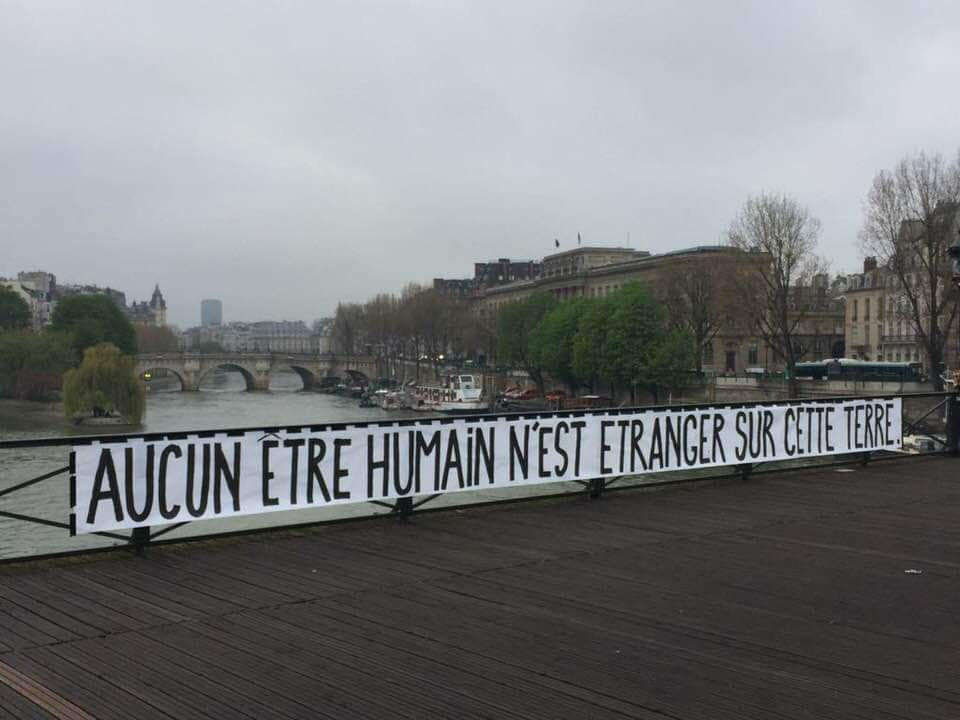
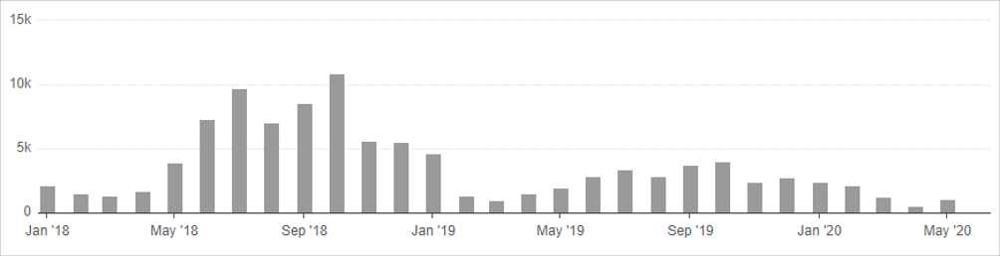
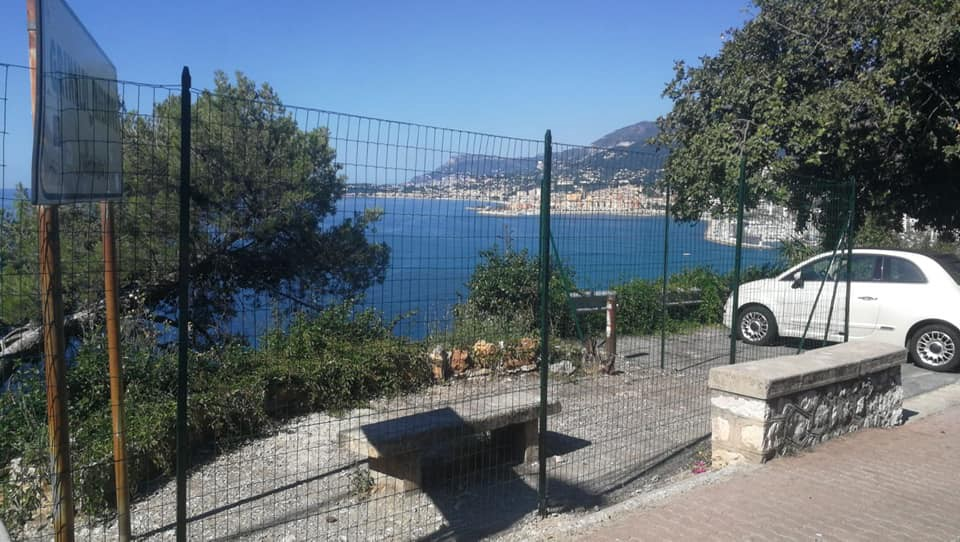
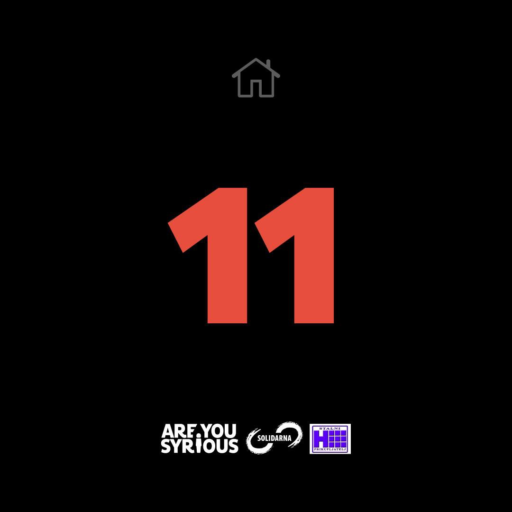

### AYS Daily Digest 8/6/20: On the expansive use of pushbacks in Greece in recent months
#### Updates and news from the Mediterranean, from deadly borders of the politically dispersed and not so united EU, by volunteers on the ground and through various reports

#### FEATURED

The recent cases of pushbacks to Turkey over the Evros river represent long\-standing trends that have been intensifying gradually, BVMN team concludes after having been documenting pushbacks in the Western Balkans and Greece for some months\. In the recent release the team details the latest mass pushback of people who were seized crudely while accessing essential food and medical assistance in Thessaloniki, Greece\.

> The expansive use of pushbacks in recent months can be mapped through the new Greek government’s response to various events: namely the deployment of the [‘international protection and other provisions’ bill](https://www.theguardian.com/world/2019/nov/01/greece-passes-asylum-law-aimed-at-curbing-migrant-arrivals) , [the handling of protests in Moria](https://www.bbc.co.uk/news/world-europe-49873950) , the [fortification of border security](https://www.hrw.org/news/2020/03/17/greece-violence-against-asylum-seekers-border) in the face of Erdogan’s threats, and finally the [suspension of the asylum system in response to COVID\-19](https://www.hrw.org/news/2020/03/17/greece-violence-against-asylum-seekers-border) \. The weaponisation of the lockdown period during the pandemic was simply the last in a long list of measures cracking down on asylum seekers in the country\. In May, BVMN began documenting a new pattern of violence in the region in which asylum seekers and transient communities were taken from inland government institutions, like camps and detention centres, and pushed back to Turkey\. This represents a stark difference to usual border security practices which target those in, or nearby to the border area\. This week the trend of pushbacks from the deep interior of the Greek mainland has ramped up considerably\. 

Read the entire report [here\.](https://www.borderviolence.eu/police-raid-humanitarian-distribution-site-and-pushback-people-in-need/?fbclid=IwAR1uuXNkvoERVjz6ylTiUdgxCFbETTnKYvVa5Yvdwl2e8bjKJIGMCgYymck)
#### MEDITERRANEAN
### Crossing attempts come close to a halt on most Western Mediterranean routes

7266 people have arrived in Spain this year, according to the UN data\. A total of 3,717 came via the Mediterranean Sea, 2,303 people arrived in the Canary islands and 1,246 crossings have been documented into the Spanish enclaves of Ceuta and Melilla\.

While the passage to the Canary islands remained somewhat open during the lockdown months due to the Covid\-19 pandemic, Alarm Phone reports that there have not been that many crossing attempts on the Mediterranean route\. However, as the most vulnerable to the socio\-economic consequences of the health emergency, the people in transit had very little chance of obtaining the permits needed in order to move forward through Morocco, for example\.

> Many people have been denied such a permit in spite of their papers\. As a result, travellers are often arrested by the police because they do not have the official documentation\. Although the Moroccan State has announced several measures aimed at vulnerable populations, none of these measures have so far been taken in respect of the 80,000 sub\-Saharan travellers living in the Moroccan state\. 

Of the 7 cases the Alarm Phone dealt with, 5 boats were on their way to the Canary islands and two attempted to cross the Strait of Gibraltar\.

AP team also noted interesting reports of a new migration “trend” from Tarifa to Tangier: reversed sea crossings from Spain to Morocco\. [Different newspapers report](https://thearabweekly.com/pandemic-sparks-reverse-migration-spain-morocco) that [Moroccans are trying to organise their trip from Spain to Morocco](https://www.faz.net/aktuell/politik/ausland/corona-flucht-schleuser-bringen-migranten-zurueck-nach-hause-16750144.html) to join their families during Covid\-19\. However, AP Member K\. in Tangier reports that there is no reliable information on this phenomenon at the moment, but it is a notion worth investigating further\.

> While the number of deportations of sub\-Saharan people in Tangier had decreased before the lock\-down started, the legal situation of the migrants has not changed at all\. For the most part you are in an irregular situation and are still unable to avail yourself of your rights\. This explains why, despite the Covid\-19 pandemic, the terrible conditions that characterize the lives of people in transit in Morocco means that the focus continues to be on crossing the sea and reaching Europe\. 

Read their entire report [here](https://alarmphone.org/en/2020/06/06/western-med-regional-analysis/?fbclid=IwAR3RlVHzUuETTd3h0duQMqj9-6If-jaOzwVJY9oYvDRVl0arWJhEghslqQo) \.

**_In these times of fencing, militarization and stopping solidarity, drawing parallels between the protests in the US and those here, here is a link to the story of people prosecuted for protesting their pushback\._**

Alarm Phone warns how the latest incident of three teenagers accused of ‘terrorism’ in Malta for protesting being pushed\-back to Libya is not the first time that protests against border violence are portrayed as violent to criminalise migrant protesters\. Watch their story:

■■■■■■■■■■■■■■ 
> **[Sea-Watch International](https://twitter.com/seawatch_intl) @ Twitter Says:** 

> > We thank the #ForumLampedusaSolidale for its clear words in difficult times and subscribe to their demands: It's time to relieve the southern states and especially the front line islands and enable rescue and a fair, self-determined distribution. #SafePassage https://t.co/323M7TILGA 

> **Tweeted at [2020-06-08 14:07:00](https://twitter.com/seawatch_intl/status/1269994338123018240).** 

■■■■■■■■■■■■■■ 

■■■■■■■■■■■■■■ 
> **[Musa Okwonga](https://twitter.com/Okwonga) @ Twitter Says:** 

> > Angrier at the drowning of a slavetrader’s statue than at the drowning of actual Africans in the Mediterranean, we see you. 

> **Tweeted at [2020-06-07 17:08:48](https://twitter.com/okwonga/status/1269677702245736450).** 

■■■■■■■■■■■■■■ 

#### EU
### Last week the EC proposed a €485 million ‘top\-up’ to support Syrian refugees living in Turkey

In the continuation of the EU’s fallible deal with Turkey, a new installment of cash is waiting to be transferred to keep the people stuck in Turkey and absolve Europe from having to finally design a common humane policy on migration\. The latest funds would reportedly be used to extend the Emergency Social Safety Net, a program that “provides monthly financial assistance to approximately 1\.7 million refugees and the Conditional Cash Transfers for Education program, which ensures children can attend school”\. The proposal will go through the European Parliament and Council for approval\.
#### GREECE
### Tomorrow an online discussion on the evictions of thousands of recognized refugees in Greece

On the occasion of the forthcoming expulsion of thousands of people from the reception system, and the policy of closed centers promoted by the government, the “Empty the Reception Centers” Initiative is organizing an online event on Wednesday, June 10 at 7:00 pm, on the issue of housing\. 
Watch the event [**HERE**](https://www.facebook.com/events/722262755174512/) \.
#### SERBIA
### More than 50 people are entering from North Macedonia daily

■■■■■■■■■■■■■■ 
> **[Azil u Srbiji Asylum Protection in Serbia](https://twitter.com/APC_CZA) @ Twitter Says:** 

> > 06.06.2020, Southern #Serbia. More than 1000 #migrants &amp; #asylum seekers placed in accommodation camps lined from Presevo up to Pirot. According to our assessment and field reports,more than 50 persons are entering country from the south daily. #AsylumSeekers #Refugees #migration https://t.co/Jso61OlTTR 

> **Tweeted at [2020-06-07 17:26:06](https://twitter.com/apc_cza/status/1269682056801419266).** 

■■■■■■■■■■■■■■ 

#### BOSNIA AND HERZEGOVINA
### Shame and silence at the ‘green doors’ of the EU

People have been shocked at seeing how many trees have been cut down in order to create a new path in the forest between BiH and Croatia, on the way to the EU border near Bihać\. It is 7 kilometers long, 100 feet wide\. “This serves to better intercept refugees\. Without EU support, this would probably not be conceivable”, comments say\. However, we are witnessing more and more people losing their lives in this area, where a lot of people admire the nature, hike the mountains and go to admire the animal wildlife\. The area as such should not be deadly, so why are so many people dying? The repressive and aggressive policies of the entire EU, all the countries which have deployed their technologies and allocated funds to precisely do that — threaten the people on the way, knowingly risking leaving them with serious physical and psychological consequences or, as has been the case for several boys in the past days, having them lose their lives\. No press coverage in the green border area, no independant monitoring in the area, no ways for people to exercise their right to access the police stations and express their intention to seek international protection, none of that\. Just fencing, a lot of shooting, beating, theft, intimidation and cowardly siding with whichever bullies came up with the idea of that becoming the official way to do things\.
#### ITALY

[Kesha Niya](https://www.facebook.com/KeshaNiyaProject/?__tn__=%2CdkCH-R-R&eid=ARCJ88hJ8M9gckwGshph_hhNXEpisGVdP8U-cMqAy7K09lFw9V27Le-qju0xLPdSfG9u6B2mDjyV2E77&hc_ref=ARTQ79RwBNjhl-t0uWKwbacSW9wBmWonV4dVFqaUo5EIXFdV3A5XolMCWAvFJA-oYNY&fref=nf&hc_location=group) team reports resuming work, but also some novelties in the area:

> With the end of the lockdown approaching, we will be able to return to our work\. It seems a neighbor, who is not disturbed by us other than seeing us from his seaside villa, has thought of the same thing\. So on Monday, May 25th he had a fence put up around the breakfast area\. That’s right, a fence blocking the area around the place we normally set up\. 

> The COVID\-19 crisis has already put a standstill to our work, and to try and continue to block even the most basic resources to reach people, on purpose, is a disgraceful way to misuse that crisis\. This is another attempt to make people invisible, in a way that keeps people as vulnerable as possible and even more at risk, while the violence and abuse they experience from French police during detainment goes unmonitored and unacknowledged\. We are looking to address this act with the local municipality, and see if they really approved such a thing\. 

> Some people think fences are the solution to everything\! But that’s all it is, a fence — it does not erase the people that come by here\. It does not erase the illegal and inhuman detainment they just come out of, and it does not erase their neglected rights to food, water, physical safety, and aid resources\. 

> People will not stop making their journey, and we will not stop our work\.
 

> Solidarity across the world — [Kesha Niya](https://www.facebook.com/KeshaNiyaProject/?__tn__=%2CdkCH-R-R&eid=ARCJ88hJ8M9gckwGshph_hhNXEpisGVdP8U-cMqAy7K09lFw9V27Le-qju0xLPdSfG9u6B2mDjyV2E77&hc_ref=ARTQ79RwBNjhl-t0uWKwbacSW9wBmWonV4dVFqaUo5EIXFdV3A5XolMCWAvFJA-oYNY&fref=nf&hc_location=group) 

#### BELGIUM
### Europe’s ‘hidden’ racism

![“I am Bintou Touré,
As a member of the Coordination des sans\-papiers, I bring my voice here to say that police violence is a reality all over the world\. Even in states that claim to be a state governed by the rule of law, this police violence is rooted and rooted in it\. Belgium does not escape this observation\. Do not wait for the police to abuse you to believe it\. Do not wait for it to happen elsewhere to denounce them\. Foreigners often pay the heavy price\. Some police officers in their excessive zeal commit this violence, which they themselves call blunders\. Whatever the situation, they protect each other\. The problem is that justice is always on their side\.
The most recent example we saw in Brussels happened in Brussels in the middle of a confinement, a young migrant who was raped for free by a police officer\. In court, he claims to have had a stroke of blood\.
The knee on George Floyd’s neck and his death that followed us gathered here this day\.
I beg you to have a thought for Semia Adamu suffocated with cushions as we tried to expel her, have a thought for Mawda a two\-year\-old girl shot by a cop with an easy trigger, have a thought for Adil, A teenage boy robbed in the middle of confinement by police officers in need of education\.
The police who are supposed to protect us are never there when we need them\. I do not want to give you the statistics of the women who called the police for help and the police did not respond, minimizing the realities of women and especially black women\. As an undocumented woman whatever the situation, she is not referred to, at the risk of finding herself in a closed centre\.
Police violence is the pathetic expression of racism in institutions\.
Police violence is the face of politicians unable to find answers to society’s problems\.
Police violence should be reclassified as POLICE CRIMES\. As long as the situation remains intact, the police officers responsible for the violence will continue to get away with it, because they are supported by state propaganda\.
Every effort must be made to ensure that the perpetrators of these acts are held accountable to justice and that the law is enforced\. 
Support the fight against the regularization of the undocumented\.” — via [Serge Guy Alain Bagamboula](https://www.facebook.com/sergeguyalain.bagamboula?__tn__=%2CdCH-R-R&eid=ARDArVaGcnOa-tOO17ZzlrsaIQmqjxaUgo43iN5IX56yZMY2GzEfjyzL-26I6gCe-9KDVYo3n2C7Tj80&hc_ref=ARQvN3ozwLk13_C4JLZOlOT-73_7dKkz8W0d0liLQ8-fFgC3MEuzrS2RWlR6jFnzINw&fref=nf&hc_location=group)](assets/e270f93aa06/1*uadNcmfj67JsYlez4AVXMA.jpeg)

“I am Bintou Touré,
As a member of the Coordination des sans\-papiers, I bring my voice here to say that police violence is a reality all over the world\. Even in states that claim to be a state governed by the rule of law, this police violence is rooted and rooted in it\. Belgium does not escape this observation\. Do not wait for the police to abuse you to believe it\. Do not wait for it to happen elsewhere to denounce them\. Foreigners often pay the heavy price\. Some police officers in their excessive zeal commit this violence, which they themselves call blunders\. Whatever the situation, they protect each other\. The problem is that justice is always on their side\.
The most recent example we saw in Brussels happened in Brussels in the middle of a confinement, a young migrant who was raped for free by a police officer\. In court, he claims to have had a stroke of blood\.
The knee on George Floyd’s neck and his death that followed us gathered here this day\.
I beg you to have a thought for Semia Adamu suffocated with cushions as we tried to expel her, have a thought for Mawda a two\-year\-old girl shot by a cop with an easy trigger, have a thought for Adil, A teenage boy robbed in the middle of confinement by police officers in need of education\.
The police who are supposed to protect us are never there when we need them\. I do not want to give you the statistics of the women who called the police for help and the police did not respond, minimizing the realities of women and especially black women\. As an undocumented woman whatever the situation, she is not referred to, at the risk of finding herself in a closed centre\.
Police violence is the pathetic expression of racism in institutions\.
Police violence is the face of politicians unable to find answers to society’s problems\.
Police violence should be reclassified as POLICE CRIMES\. As long as the situation remains intact, the police officers responsible for the violence will continue to get away with it, because they are supported by state propaganda\.
Every effort must be made to ensure that the perpetrators of these acts are held accountable to justice and that the law is enforced\. 
Support the fight against the regularization of the undocumented\.” — via [Serge Guy Alain Bagamboula](https://www.facebook.com/sergeguyalain.bagamboula?__tn__=%2CdCH-R-R&eid=ARDArVaGcnOa-tOO17ZzlrsaIQmqjxaUgo43iN5IX56yZMY2GzEfjyzL-26I6gCe-9KDVYo3n2C7Tj80&hc_ref=ARQvN3ozwLk13_C4JLZOlOT-73_7dKkz8W0d0liLQ8-fFgC3MEuzrS2RWlR6jFnzINw&fref=nf&hc_location=group)

AYS is entering the last week of our campaign aiming to support some of the refugee households in Croatia at risk of losing their homes\. We are one week and 11 households away from reaching this goal\. Help us spread the word and pitch in to be a part of the change\!

visit: areyousyrious\.eu

**Find daily updates and special reports on our [Medium page](https://medium.com/are-you-syrious) \.**

**If you wish to contribute, either by writing a report or a story, or by joining the info gathering team, please let us know\.**

**We strive to echo correct news from the ground through collaboration and fairness\. Every effort has been made to credit organisations and individuals with regard to the supply of information, video, and photo material \(in cases where the source wanted to be accredited\) \. Please notify us regarding corrections\.**

**If there’s anything you want to share or comment, contact us through Facebook, Twitter or write to: areyousyrious@gmail\.com**

_Converted [Medium Post](https://medium.com/are-you-syrious/ays-daily-digest-8-6-20-on-the-expansive-use-of-pushbacks-in-greece-in-recent-months-e270f93aa06) by [ZMediumToMarkdown](https://github.com/ZhgChgLi/ZMediumToMarkdown)._
