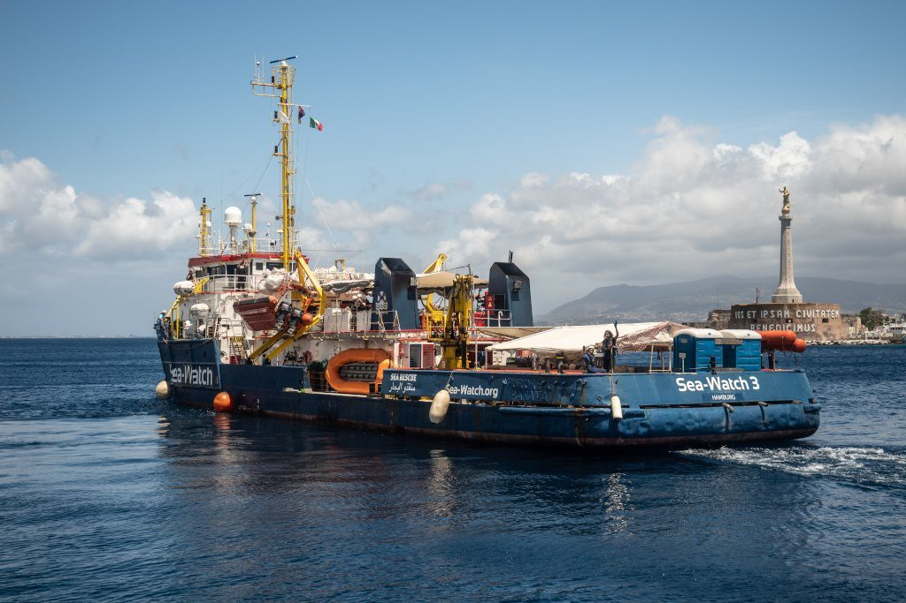
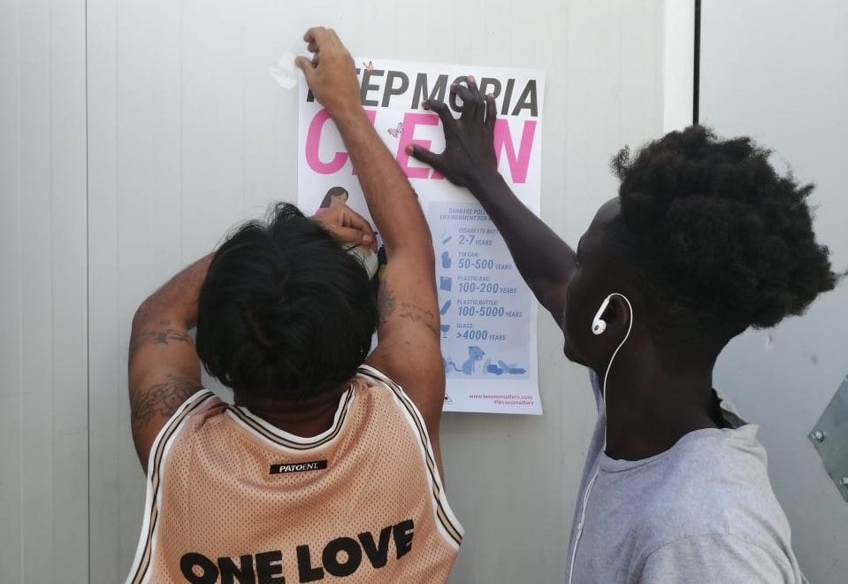
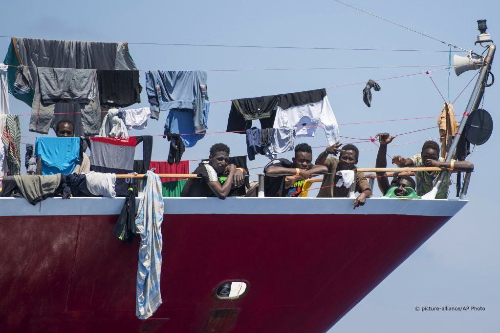

### AYS Daily Digest 09/06/20 Over 11,000 people face possible evictions in Greece
#### Traffickers found after murder in Libya // Sea\-Watch 3 is back at Sea // some people at sea outside Malta to be transferred to other EU countries // and more…

 in 2019\. Photo _by [@ChristofakisN](https://twitter.com/ChristofakisN)_](assets/cdbc50dc1b1d/1*xdebvSKHt69GNjw5Ojy6Ug.jpeg)

From [evictions](https://enoughisenough14.org/2019/08/28/greek-state-begins-evictions-of-anarchist-and-refugee-squats-in-exarcheia/) in 2019\. Photo _by [@ChristofakisN](https://twitter.com/ChristofakisN)_
### FEATURE 11,000 people are facing eviction in Greece because they are no longer eligible to stay at reception facilities for asylum seekers

According to [Info Migrants](https://www.infomigrants.net/en/post/25209/why-thousands-of-refugees-in-greece-face-eviction-and-where-they-can-turn?fbclid=IwAR32Eltn2L8TVMkU4JXrkN3gN_xRD-rpCIojmqZJztRGhqAB46LBqfcHyiQ) , _“As of June 1st, all refugees who received international protection before May 1, 2020 are no longer eligible to stay at reception facilities\.”_

Greece does not have enough space to hold these recognized refugees and house people who are still living in refugee camps on the islands who need to be evacuated\. There is huge concern for the looming homelessness for all these people, since Greece does not have systems in place to properly assist refugees once they are given protection\. UNHCR spokesperson Andrej Mahecic said last week:

> “Forcing people to leave their accommodation without a safety net and measures to ensure their self\-reliance may push many into poverty and homelessness\.” 

#### LIBYA

](assets/cdbc50dc1b1d/1*sXxTos-pUoq-bDplKdoTfQ.jpeg)

“In 10 days, at least 337 migrants who departed from Libyan shores arrived in Italy and Malta, while 194 others were intercepted at sea and returned to Libya\. IOM Libya’s Maritime Update — 29 May to 7 June\.” Info and Photo by [IOM Libya](https://twitter.com/IOM_Libya/status/1270275538142232576)

](assets/cdbc50dc1b1d/1*7q9zbEv2kEHF6r5iFlqreA.png)

“Armed men attacked Zintan dc on Sunday night\. One guard was killed\. Detainees say they believe the people who attacked were trying to kidnap them & will try again\.” Info and Photo by [Sally Hayden](https://twitter.com/sallyhayd/status/1270443736259067906)

20 traffickers were arrested in Bangladesh for killing Bangladeshis in Libya\. They killed 30 people; 26 were from Bangladesh\. According to Bangladesh national news _“The killing took place at a smuggling warehouse in desert town Mezda, near the city of Gharyan, southwest of Tripoli of Libya\. Eleven more Bangladeshis were also injured in the attack\.”_ More [here](http://www.unb.com.bd/category/Bangladesh/killing-of-bangladeshis-in-libya-20-traffickers-arrested-in-bangladesh/52769?fbclid=IwAR0c9omfYx3FzbnY-DeOoYnmuFsUICIUH9nK_q50R3uWTHFIxEMrDx3Cw-M) \.

](assets/cdbc50dc1b1d/1*r2pmWKWWOEFJxGWO_BzOSA.jpeg)

“In today’s comeback mission \#Moonbird spotted 3 boats in distress in international waters between \#Malta and \#Libya\. A Libyan patrol boat was also in the area\. \#SeaWatch3 has launched search operations, but we’re afraid ~200 people have been pulled\-back to the civil war country\.” Info and Photo by [Sea\-Watch International](https://twitter.com/seawatch_intl/status/1270426393025884166)
#### TUNISIA

At least 20 people are dead after a shipwreck off the coast of Sfax on Tuesday\. There were initially 53 people on the boat\. The coast guard is said to be searching for more missing people\. More [here](https://www.reuters.com/article/us-tunisia-migrants/at-least-20-die-as-migrant-boat-sinks-off-tunisia-idUSKBN23G1XH?rpc=401&fbclid=IwAR040JEBKXwvUs7MIc1EfOdLwXKaAK7OSUxYpFvYRPmvXheE92b3u0Ubxo4) \.
#### SEA
### Sea\-Watch 3 is back sailing in the Med\!

Here to save lives\. The organization said on twitter that the crew was _“constantly practicing standard safety and rescue procedures as well as an extra batch of COVID\-19 prevention measures\.”_ [More here](https://www.infomigrants.net/en/post/25258/sea-watch-3-back-sailing-the-mediterranean?fbclid=IwAR3JCfhhZwsSfYsA44vmkZ-q-bGtd-b_Ott2zk4ejj33mPKKUKT3fCTV_t0) \.

#### GREECE

■■■■■■■■■■■■■■ 
> **[Mortaza](https://twitter.com/mortazabehboudi) @ Twitter Says:** 

> > Hundreds of migrants want to buy tickets to leave Lesvos but police push them back. Ferry is full and they need to be checked for identifications. As the situation is very difficult in #Moria camp, many of them must leave the camp without knowing where to sleep in the mainland. https://t.co/wl96jxGOZ1 

> **Tweeted at [2020-06-08 14:50:22](https://twitter.com/mortazabehboudi/status/1270005253178642433).** 

■■■■■■■■■■■■■■ 

[Reports](https://twitter.com/f_grillmeier/status/1270293405130805248) of worsening mental health among residents in Moria:

> “Mental health crisis is worsening by the day in isolation\. Many [\#refugeesgr](https://twitter.com/hashtag/refugeesgr?src=hashtag_click) express hypertension & rise of migraines, increase in anxiety & dizziness\. Enhanced by not being able to break from daily stress through walks to city etc\. Somali family stuck in a hotel structure on Greek mainland reports, that they were told isolation will continue for them until October\. With no schooling for 6\-yo child\. No possibility to work, invite friends or go to hospital\. One medic will come to hotel, if needed\.” 

■■■■■■■■■■■■■■ 
> **[Vassilis Tsarnas](https://twitter.com/VassilisTsarnas) @ Twitter Says:** 

> > THREAD
#Greece: We filed a criminal complaint to the Supreme Court Prosecutor concerning the deaths of Mohammad Al-Arab, Muhammed Gulzari &amp; "Fatma" who is also presumed dead asking for an impartial investigation on the role of Greek security forces on these killings &amp; other 👇1/2 

> **Tweeted at [2020-05-09 11:45:33](https://twitter.com/vassilistsarnas/status/1259087105994735617).** 

■■■■■■■■■■■■■■ 

](assets/cdbc50dc1b1d/1*9wWvSf8DWc2xeFxT4lc1Hw.jpeg)

“Yesterday together with the friends from MCAT we hanged hundreds of posters for better waste management and environment awareness\. Was a good job and people liked it a lot\. Our aim, to keep Moria clean\.” Message and Photos by [Moria White Helmets](https://www.facebook.com/MoriaWhiteHelmets/posts/153365702973164?hc_location=ufi)

The quarantine lockdown has ended in camp in Nea Kavala, northern Greece after many COVID\-19 tests came back negative\. The quarantine was first imposed after a woman in the facility came back with a positive test\. Doctors Without Borders said a quarantine for this long was unjustifiable and that vulnerable people should be transferred\. [More here\.](https://www.ekathimerini.com/253513/article/ekathimerini/news/quarantine-ends-for-nea-kavala-refugee-camp-extended-in-other-facilities?fbclid=IwAR3quiWYQom6eUsfHAiwL9GGmUbmYsQOWDq2GR-F-I7fC4Ct_DtfNUdT5rg)

](assets/cdbc50dc1b1d/1*sDbjKC2edMPGi8e3Vtk5kQ.jpeg)

Photo by [Aegean Boat Report](https://www.facebook.com/AegeanBoatReport/photos/a.285312485325196/850087748847664/?type=1&theater)

Europe Must Act is holding a panel discussion on June 20th for World Refugee Day about raising awareness for the Greek islands\. Find [it here](https://www.facebook.com/europemustact/posts/147320360214000?hc_location=ufi) \.

■■■■■■■■■■■■■■ 
> **[Zübeyir Koçulu](https://twitter.com/zubeyirkoculu) @ Twitter Says:** 

> > The Greek government extradited Murat Kilic, a Kurdish politician and former Democratic Regions Party (DBP) representative, to Turkey where he was summarily imprisoned. Kilic had been seeking asylum in Greece before he was handed over to Turkish authorities. #RefugeesGR 

> **Tweeted at [2020-06-08 17:41:57](https://twitter.com/zubeyirkoculu/status/1270048433789861889).** 

■■■■■■■■■■■■■■ 

#### MALTA
### France, Luxembourg, Portugal will take in “some of the 425” people who have been stuck outside Malta in ships for over a month

The European Commission made the announcement, but it is still uncertain how many people each country will accept\. The Maltese government had made an urgent appeal to other EU countries to help\. Malta has been breaking international law by not letting the people disembark and instead making them quarantine on ships currently not in use\. Some of the people on the ships have been there since April 30th, when they were rescued after distress calls at sea\. More [here](https://www.infomigrants.net/en/post/25256/france-luxembourg-portugal-to-accept-migrants-disembarked-in-malta?fbclid=IwAR2EwWR2aUEozpkrMyni4Nrpl1WYApe1j8n9vAsXLEocZbClq4vOflIw4No) \.

Photo by picture\-alliance/AP Photo

■■■■■■■■■■■■■■ 
> **[Alarm Phone](https://twitter.com/alarm_phone) @ Twitter Says:** 

> > 👉Watch the extended version of Monitor’s documentary on the Easter massacre off Malta’s coast, which left 12 people dead. Listen to the survivors who were forced back to torture camps in Libya. @[georgrestle](https://twitter.com/georgrestle)
[youtube.com/watch?v=HzFHb9…](https://www.youtube.com/watch?v=HzFHb97DCeU&feature=youtu.be) 

> **Tweeted at [2020-06-09 11:37:52](https://twitter.com/alarm_phone/status/1270319197504057345).** 

■■■■■■■■■■■■■■ 

#### ITALY

![**ILLEGAL ITALIAN POLICE PUSHBACKS** : “Alishah 3 days ago managed to arrive in Bosnia to Italy together with other migrants, after two weeks of walking for the woods, without food and no water\. Arrived in Italy they were taken by the Italian police who took their fingerprints and despite their request for political asylum, instead of taking them to a reception center as the law provides, they were loaded into a police van and taken to Slovenia and handed over to the Slovenian police, against every international convention and against the same European immigration laws\. Slovenian police brought him, along with the other migrants, to Croatia and handed him over to the Croatian police, who as always beat him savagely and stole from the few belongings he had and sent back to Bosnia\.” Info and photo by freelance photographer [Pierpaolo Mittica](https://www.facebook.com/photo.php?fbid=3289980547699239&set=a.158984250798900&type=3&theater)](assets/cdbc50dc1b1d/1*BlQJelppzHbhDUMj3vfNOw.jpeg)

**ILLEGAL ITALIAN POLICE PUSHBACKS** : “Alishah 3 days ago managed to arrive in Bosnia to Italy together with other migrants, after two weeks of walking for the woods, without food and no water\. Arrived in Italy they were taken by the Italian police who took their fingerprints and despite their request for political asylum, instead of taking them to a reception center as the law provides, they were loaded into a police van and taken to Slovenia and handed over to the Slovenian police, against every international convention and against the same European immigration laws\. Slovenian police brought him, along with the other migrants, to Croatia and handed him over to the Croatian police, who as always beat him savagely and stole from the few belongings he had and sent back to Bosnia\.” Info and photo by freelance photographer [Pierpaolo Mittica](https://www.facebook.com/photo.php?fbid=3289980547699239&set=a.158984250798900&type=3&theater)
#### BOSNIA AND HERZEGOVINA

Two reports of violence in BiH today:

#### GERMANY

Update by [Mare Liberum](https://www.facebook.com/MareLiberumOfficial/posts/644060972989476) :

> “A recent change of law by the German ministry for transport blocks our ship from operating and practically makes our missions impossible\! LIFELINE and RESQSHIP are also affected\. The official reasoning for the law clearly states that this law change was done specifically to impede the work of humanitarian organisations: yachts and other small crafts, which are operated in the realm of ‚environmental protection, sea\-rescue, including observatory missions or for other humanitarian purposes‘, now have to comply with such unreasonable safety requirements, which are not feasible practically\. 

> The simple aim of this new law is to obstruct our operations\. Apparently, the minister of transport, Andreas Scheuer prefers to see refugees drown, instead of them safely reaching European shores\. We condemn this insidious sabotage of our humanitarian work and demand the change of law to be repealed\!” 

Find their full press release [here](https://mare-liberum.org/en/2020/06/09/verkehrsministerium-verhindert-einsatz-fuer-gefluechtete/?fbclid=IwAR3CxsGkPj3W6YdEZ5BKicSCbRTFiVWsuw-kRXr58GU4Lj8ojlO0Lemyx8U) \.
#### FRANCE

French immigration officials say that ADA cards were not deactivated for no reason during the lockdown\. They apparently “had their reasons” and the right has been extended until July due to COVID\-19\. More [here](https://www.infomigrants.net/en/post/25147/were-ada-cards-deactivated-without-reason-during-lockdown-no-say-french-immigration-officials?fbclid=IwAR1Q8xBywcImk8Z0pDwmiySAR1UBoxm8WkGg8XsqFVfYKXTbeQStbiRonJQ) \.
#### **Find daily updates and special reports on our [Medium page](https://medium.com/are-you-syrious) \.**

**If you wish to contribute, either by writing a report or a story, or by joining the info gathering team, please let us know\.**

**We strive to echo correct news from the ground through collaboration and fairness\. Every effort has been made to credit organisations and individuals with regard to the supply of information, video, and photo material \(in cases where the source wanted to be accredited\) \. Please notify us regarding corrections\.**

**If there’s anything you want to share or comment, contact us through Facebook, Twitter or write to: areyousyrious@gmail\.com**

_Converted [Medium Post](https://medium.com/are-you-syrious/ays-daily-digest-09-06-20-over-11-000-people-face-possible-evictions-in-greece-cdbc50dc1b1d) by [ZMediumToMarkdown](https://github.com/ZhgChgLi/ZMediumToMarkdown)._
