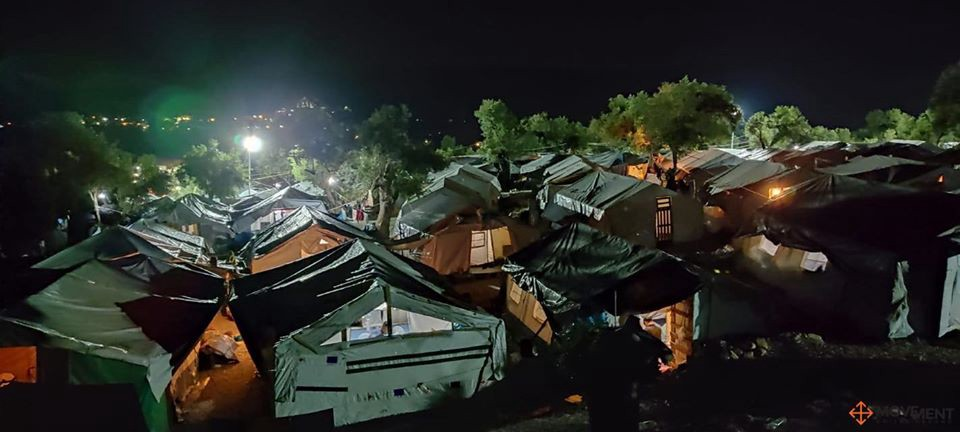

### AYS DAILY DIGEST 11/06/20: Greek Government’s plans to evict recognized refugees leads to chaos, homelessness, and protests
#### Situation for unregistered refugees in Turkey // Extension of Greek residence permits // IOM concerned about the push\-backs in Aegean Sea // Shocking new report on Croatian border violence // Two rescue ships in the Mediterranean again //

Movement On The Ground installed floodlights across the Olive Grove CampUs to increase safety\. Copyrights: Movement On The Ground
### FEATURE: Chaos at the port of Mytilene

The situation on the port of Mytilene continues to be pure chaos and confusion\. For seven days now, people have been waiting for their chance to board the ferry to Athens; earlier, they had been told they needed to leave their rooms or tents by the beginning of June\. People who did not make it onto the ferry were told to walk some 8 km back to Moria\. Many decided instead to stay at the port, sleeping rough around the Statue of Liberty\. While it was said that people with a blue stamp in their papers were allowed to leave, the port authorities restricted some people from leaving who did have such a stamp — and who had already bought their tickets at their own expenses\. No communication between the camp management and the port authorities seems to be in place\. 
Since last Friday, more than 800 people have successfully departed for the mainland\. But it is still unclear where they will go once they arrive, and how they will survive\. The current situation is the result of the Greeks Ministry’s decision to stop supporting some 11,000 recognized refugees and to force them out of subsidized facilities\. At the same time, some 17,000 people in Moria are still not allowed to leave the camp because of coronavirus\. While life in much of Europe is going back to normal, the pandemic is being used against the most vulnerable people in the camps to further deprive them of their freedom and rights\.

■■■■■■■■■■■■■■ 
> **[Franziska Grillmeier](https://twitter.com/f_grillmeier) @ Twitter Says:** 

> > It is the 7th day in a row that #refugeesgr are gathering at the port of #Mytilini to get on a ferry to #Athens, not knowing where they will end up. “Police told us to leave to mainland if we have the money for the ferry ticket,” Naila F. from #Herat says. /1 

> **Tweeted at [2020-06-11 11:50:42](https://twitter.com/f_grillmeier/status/1271047203017183232).** 

■■■■■■■■■■■■■■ 

### TURKEY

The situation of unregistered refugees in Turkey worsened sharply amid the lockdown\. Most of them lost their jobs, if they had them, and are now left without any benefits or opportunities\. People without work permits are often left unpaid and have no way to advocate for their money\. At the same time, landlords are merciless when it comes to paying the rent on time\. 
“I’m not worried about getting coronavirus, but I am worried about buying food, paying my rent and bills\. Coronavirus is nothing compared to this worry,” said one man from Pakistan\.

For a longer article on the situation of unregistered refugees in Turkey, see:

Meanwhile, Erdogan implemented a new law that allows groups of nighttime “neighbourhood guards” to demand that people identify themselves, use force and carry weapons, and apprehend suspects\. This is highly worrying, since the members of these groups undergo only a limited training and are not part of the official authorities\.
For more information, see:

### GREECE

The Ministry for Migration and Asylum is coming up with a new plan to reduce the number of people who are forced to spend their waiting in front of the Asylum Service offices\. This includes the extension of residence permits that were set to expire between the beginning of June and the end of September\.

On the official Facebook page of the Greek Ministry of Migration and Asylum, it was stated that:

> “By decision of the Minister of Migration and Asylum, the validity of the certificates of those applying for international protection that were expiring from 01/06/2020 to 30/09/2020 and have not been renewed, is extended until 01/10/2020\.” 

As of October 1, the printed certificates of applicants for international protection will be replaced by electronic cards\. These cards will be used in order to access the services and the controlled access facilities of the Ministry of Migration and Asylum\. These cards will be issued under the responsibility of the commanders at local facilities and Reception and Identification Centers\. A digital services portal of the Ministry of Migration and Asylum will be launched on Monday 15/06/20\. It will allow applicants for international protection to carry out a number of administrative changes regarding their personal data\. Through these measures, the Ministry hopes to reduce the number of people who have to be physically present at the asylum offices\.

It remains to be seen how well these new solutions will work out\. Former attempts to digitize the asylum procedure have often led to even more chaos\.

For more information in Greek, see:

For the Greek Ministry of Migration and Asylum’s statemetn, see its Facebook page: [Migration Greece Info](https://www.facebook.com/migrationgovgr.info)

The International Organization for Migration \(IOM\) expressed its concerns about recent reports of push\-backs from Greece to Turkey\. In a press release, IOM stated that it is closely monitoring the situation\. The organization also urged the Greek authorities to launch investigations into the issue\. In recent months, the number of reported violent push\-backs in the Aegean — and at times even from the Greek islands — increased sharply\. IOM made it clear that the maintenance of border control is not a higher value than the human rights of individuals who seek asylum:

> “Amid heightened health considerations, we urge States to refrain from securitizing borders and implementing migration practices that could compromise the human rights of migrants, including measures such as the construction of border walls, militarizing border patrols or increasing deportations\. \[…\] 

> While states’ sovereign rights — including maintaining the integrity of borders — must be respected, their discretion ends where they overlap with international human rights obligations\.” 

The NGO _Movement on the Ground,_ in partnership with _Choose Love,_ installed floodlights and fire extinguisher across the Olive Grove camp close to Moria in order to increase security for the camp’s residents\.

In Skaramangas camp outside of Athens, the police used violence and tear gas in order to break up peaceful protests\. The residents were demonstrating against the eviction of recognized refugees\. 
 On Saturday, June 20, the Coordination for Refugees\-Immigration \(SYMPROME\) and other collectives called for a demonstration against refugee evictions, with a pre\-assembly at 14:00 in Omonia\.

For more information on the police riots in Greek, see:

### CYPRUS

Tensions arose in Pournara camp in Kokkinitrimithia after people on the move started to protest against their prolonged detention in a facility\. The centre is meant to only host asylum seekers during the first steps of the procedure and is not suitable for long\-term accommodation\. However, amid the corona pandemic, people were held in the centre for months\. The protests led to some police officers being injured\.

30 vulnerable asylum seekers will be relocated from Cyprus to Finland, the Cyprus Ministry of Interior stated\.

■■■■■■■■■■■■■■ 
> **[EMNCyprus](https://twitter.com/EMNCyprus) @ Twitter Says:** 

> > 30 #vulnerable #AsylumSeekers are going to be relocated from #Cyprus to #Finland, in cooperation with @EASO. A grant agreement has been signed between @FundsUnit and #Asylum Service. Total budget: €21,020 co-funded by @[EUHomeAffairs](https://twitter.com/EUHomeAffairs) #AMIF. 

> **Tweeted at [2020-06-10 05:59:17](https://twitter.com/emncyprus/status/1270596378021056512).** 

■■■■■■■■■■■■■■ 

### CROATIA

Amnesty International published a shocking report of an incident of harassment and abuse by Croatian border authorities\. 16 men from Pakistan and Afghanistan were apprehended by Croatian police during the night of 26–27 May near Lake Plitvice\. After the apprehension, the following scene took place:

> “Between eight and ten people wearing black uniforms and balaclavas identical to those used by Croatia’s Special Police, fired their weapons in the air, then kicked and repeatedly hit the restrained men with metal sticks, batons and pistol grips\. They then rubbed ketchup, mayonnaise and sugar belonging to one into the migrants’ bleeding heads and hair\. Amnesty also spoke to doctors who treated the men and NGOs who witnessed their injuries” 

One of the victims testified to Amnesty International:

> “We were pleading with them to stop and show mercy\. We were already tied, unable to move and humiliated; there was no reason to keep hitting us and torturing us\. They were taking photos of us with their phones, and were singing and laughing\.” 

While violent and humiliating push\-backs from Croatia to Bosnia and Herzegovina have happened on a regular basis for some years now, a new level of brutality has been reached in the past few months\. The Guardian published a longer article in early May on an incident in which people’s heads were sprayed with a cross by drunken and laughing Croatian officers\.

After being beaten and humiliated by the Croatian officers, asylum seekers are generally pushed\-back into Bosnia and Herzegovina and find themselves in the Bosnian border town Velika Kladuša\. A doctor in Velika Kladuša told Amnesty International that about 60% of people on the move who require medical treatment say that their injuries were inflicted by Croatian police\.

For the Amnesty International’s press release, see here:

For the article in the Guardian, see:

### SEA

After months of waiting, two rescue ships are finally back in operation in the Mediterranean Sea\. The Italian NGO _Mediterranea Saving Human_ ’s boat _Mare Jonio_ is supported by the Germans NGO _Sea Watch_ ’s boat _Sea Watch 3_ \.

This good news reaches us at the same time as another tragedy becomes visible: 12 dead bodies have been found off the coast of Tunisia\. This makes 34 bodies that have now been found after a shipwreck occurred between the 4th and the 5th of June\. Since it is estimated that 53 people were on board, more discoveries of corpses are expected\. UNHCR expressed its dismay in a press release\. According to the statement, most of the victims were women and small children from sub\-Saharan African countries\.
### AFGHANISTAN

The Global Peace Index 2020 has been released\. Unsurprisingly, Afghanistan is once again the least peaceful country on earth after taking the top spot from Syria last year\. Still, Afghanistan is considered a safe country by many European countries, which forge ahead with deportations to Afghanistan\.
For the full report, see:

### BELGIUM

The city of Ghent’s council has pledged to take in some 300 refugees from camps on the European border \. This was reported by _Europe must act_ , an initiative that lobbies for cities to take in refugees\. However, since asylum is a federal jurisdiction in Belgium, Ghent’s pledge still needs to be approved by the government\.
### GENERAL

A webinar on legal pathways for refugees to Europe will be held on June 30th\. The main focus will be on humanitarian and university corridors\. It was organized by the Migration and Borders working group of the Netherlands Network for Human Rights Research\.

**Find daily updates and special reports on our [Medium page](https://medium.com/are-you-syrious) \.**

**If you wish to contribute, either by writing a report or a story, or by joining the info gathering team, please let us know\.**

**We strive to echo correct news from the ground through collaboration and fairness\. Every effort has been made to credit organisations and individuals with regard to the supply of information, video, and photo material \(in cases where the source wanted to be accredited\) \. Please notify us regarding corrections\.**

**If there’s anything you want to share or comment, contact us through Facebook, Twitter or write to: areyousyrious@gmail\.com**

_Converted [Medium Post](https://medium.com/are-you-syrious/ays-daily-digest-11-06-20-greek-governments-plans-to-evict-recognized-refugees-leads-to-chaos-a6f5f9370811) by [ZMediumToMarkdown](https://github.com/ZhgChgLi/ZMediumToMarkdown)._
