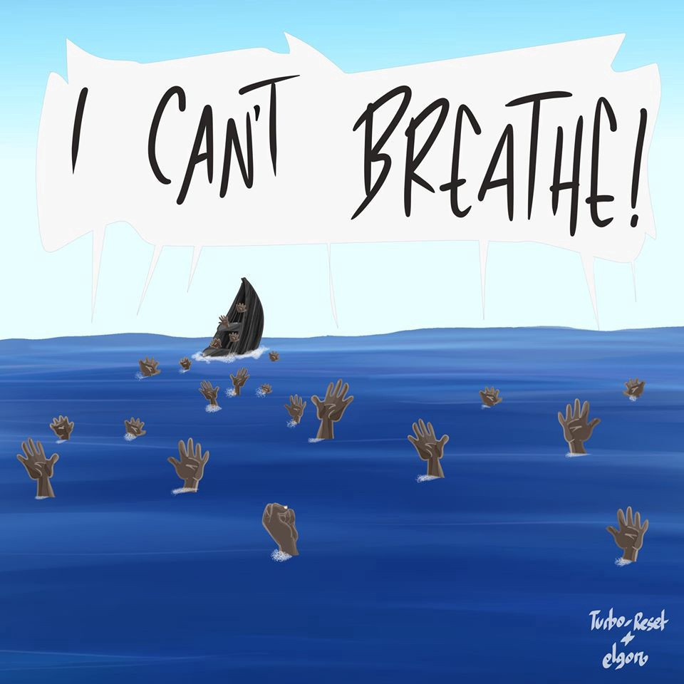
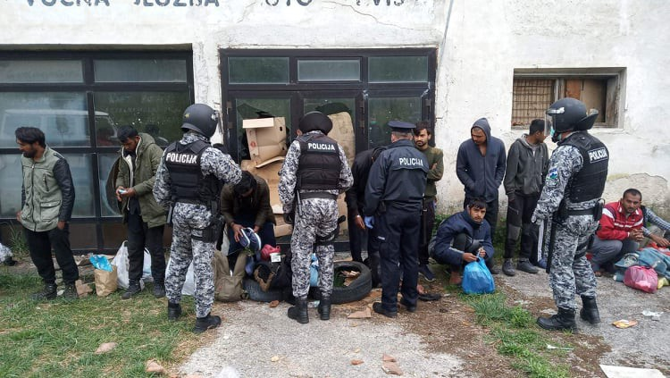
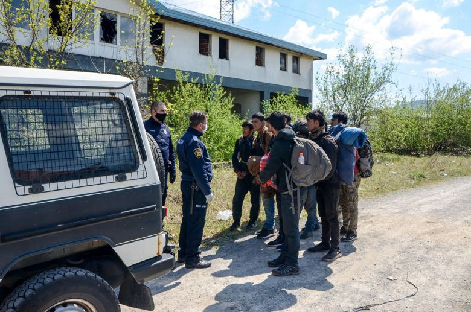

### AYS Daily Digest 12/6/20: 53 people drown in the Mediterranean

[Are You Syrious?](@AreYouSyrious?source=post_page-----e01bc2dbd419----------------------)

[Jun 13](ays-daily-digest-12-6-20-53-people-drown-in-the-mediterranean-e01bc2dbd419?source=post_page-----e01bc2dbd419----------------------) · 9 min read

Update on the shipwreck off the coast of Tunisia // Harassment of Journalist in Bosnia // Ongoing confusion at the Greek port of Mytilene // Open letter to the EU Commission

[https://www\.facebook\.com/alagooon/photos/a\.1676821635940903/2651392351817155/?type=3&theater&ifg=1](https://www.facebook.com/alagooon/photos/a.1676821635940903/2651392351817155/?type=3&theater&ifg=1)
### Feature

Since yesterday’s coverage of the tragic shipwrecks that occurred between the 4th and the 5th of June, it has now been confirmed that the death\-toll is 53\. 53 vulnerable people died\. This could have been avoided if safe and legal routes of migration were established\.

In light of these tragic events, it is welcome news to hear that after months of waiting, two rescue ships have returned to the Mediterranean to carry out the vital work of search and rescue\. Italian NGO _Mediterranean Saving Human_ and German NGO _Sea Watch_ will both be deploying ships to the region

The growing death toll of this tragedy has again shone a light on the perilous journey that many are forced to take\. [Save the children](https://www.infomigrants.net/en/post/25334/save-the-children-says-repatriations-to-libya-unacceptable) have renewed a call for a change in European migration policy stating that: “A coordinated rescue and protection mechanism must be activated as soon as possible between member states, creating legal and safe access routes from areas of crisis or transit to protect those who, every day, risk and too often lose their lives,”\.

Allegations have also been made that the European coast guard agency, Frontex, [is assisting in the forced returns back to Libya](https://twitter.com/seawatch_intl/status/1270755893500620805?fbclid=IwAR3RaULOt-TN2qbrfrIU7u-7lVv7RNu7y6Rd5ANJyyRNmLN9FKZ-EbZYnzg) and thereby they are complicit in not only enabling a breach of international law on behalf of the EU, but also in the deaths of dozens of innocent people who are forced back to war\-torn Libya\.
### Bosnia

Journalist Aydin Kamber published a report detailing the continued difficulties of covering refugees in transit in Bosnia, and the ongoing police harassment that he faces as a result\.

Within the report, he speaks about multiple encounters with the Bosnian police:

> _“At the entrance to the city and just before the beginning of the curfew, I am met by the BiH Border Police patrol, to whom I explain that I am a journalist on assignment and give the necessary journalistic accreditations and other documents, and they soon call the Una\-Sana Canton police\. In order to avoid such an unnecessary scenario, a few days earlier I sent an e\-mail to the Federal Civil Protection Administration \(FUCZ\), which made a decision to declare a curfew in the FBiH, with a request to clarify what I need as a freelance journalist so that he could do his job without hindrance\. They called me from FUCZ and said that my journalistic accreditation was enough and that there would be no problems\._ 

> _I explained all this to the police officers, and they to their superiors, and I showed my accreditations\. They remained of the opinion that I had committed a misdemeanour and that I had to pay a fine of 500 KM\.”_ 

[https://media\.ba/bs/magazin\-novinarstvo/izvjestavanje\-sa\-terena\-tokom\-mjera\-zabrane\-rizici\-izazovi\-i\-prijetnje?fbclid=IwAR391qZTBRpygAW6Whm2VGNRYoRwSP27Lvptew1VZZgql7waBrk\-PDJcsM0](https://media.ba/bs/magazin-novinarstvo/izvjestavanje-sa-terena-tokom-mjera-zabrane-rizici-izazovi-i-prijetnje?fbclid=IwAR391qZTBRpygAW6Whm2VGNRYoRwSP27Lvptew1VZZgql7waBrk-PDJcsM0)

The following day whilst covering the relocation process of about thirty people who had been forced to wait in a kneeling position for around 30 minutes in an abandoned room before being placed on a bus to take them to the newly opened camp Lipa, he again reports on his experience dealing with the police\.

On discovering Kambers attempt to document the transit process, the police commissioner of the Una\-Sana Canton, Mujo Koričić, in a clear attempt to limit the coverage of this process said:

> _“You broke curfew last night\. What are you doing here?” The commissioner asked, to which I replied that I was doing my job, and I tried to explain that I had a permit and the right to work and report from the field\._ 

> _“Who let you work?” Who let you work? Who let you work? “The police commissioner repeated loudly, and continued:” This is a police operation, what do you have to do with it? You have, if you are going to work, a police and staff spokesperson and you work there\. Not here\.”_ 

> _When the transit process started the Kamber was denied the ability to report or cover the action until it had finished, and was reminded that “If it is determined that you did it without authorization, you know what will happen next,”… “we will most likely initiate criminal proceedings against you\.”_ 

To read the full report, please follow the link:
### [Izvještavanje sa terena tokom mjera zabrane: Rizici, izazovi i prijetnje](https://media.ba/bs/magazin-novinarstvo/izvjestavanje-sa-terena-tokom-mjera-zabrane-rizici-izazovi-i-prijetnje?fbclid=IwAR391qZTBRpygAW6Whm2VGNRYoRwSP27Lvptew1VZZgql7waBrk-PDJcsM0)
### [Grupa od dvadesetak Afganistanaca, među kojima je bilo i nekoliko maloljetnika, u proljetno predvečerje kretala se…](https://media.ba/bs/magazin-novinarstvo/izvjestavanje-sa-terena-tokom-mjera-zabrane-rizici-izazovi-i-prijetnje?fbclid=IwAR391qZTBRpygAW6Whm2VGNRYoRwSP27Lvptew1VZZgql7waBrk-PDJcsM0)
#### [media\.ba](https://media.ba/bs/magazin-novinarstvo/izvjestavanje-sa-terena-tokom-mjera-zabrane-rizici-izazovi-i-prijetnje?fbclid=IwAR391qZTBRpygAW6Whm2VGNRYoRwSP27Lvptew1VZZgql7waBrk-PDJcsM0)

The Trans\-Balkan solidarity have made a public request for donations of milk, fruit, sweets and a baby carrier\. This urgent request comes after the organisation has responded to the needs of 17 children including a 8\-day\-old baby\.
### [Transbalkanska solidarnost](https://www.facebook.com/groups/144469886266984/permalink/578533362860632/?hc_location=ufi)
### [Punkt u Velečevu\- Trenutno — beba stara 8 dana, ukupno 17 djece\.😔 Dragi građani Ključa, potrebna nam je nosilica za…](https://www.facebook.com/groups/144469886266984/permalink/578533362860632/?hc_location=ufi)
#### [www\.facebook\.com](https://www.facebook.com/groups/144469886266984/permalink/578533362860632/?hc_location=ufi)
### Greece

Following yesterday’s feature report on the ‘chaos at the port of Mytilene’ where we reported that for seven consecutive days people had been gathering at the port in attempts to board a ferry to Athens, we can again report that today the confusion and tension has only increased\. It’s been reported that only 61 people had successfully made it onto the ferry with priority given to families\.

The current situation is the result of the Greeks Ministry’s decision to stop supporting some 11,000 recognized refugees and to force them out of subsidized facilities\. For those who have made it on the ferry to Athens, there is no subsequent support to be found upon their arrival to the mainland\. This has left families being forced to camp outside on Victoria square\.

Allegations have been made that journalists have been heavily restricted from working at the port, with police prohibiting them from taking photos and subsequently seizing and deleting any images that have been taken\.

A recent announcement from the Greek Ministry of Migration and Asylum shared by the [Greek Forum for Migrants](https://www.facebook.com/GreekForumOfMigrants/?__tn__=%2CdkCH-R-R&eid=ARBw2Gx-0AcVdnvb_e1M6VHlt_gmaIhgkLIgYoeGY-RvrUoArwm9aAwLEC6NTmsPa4yG6TQ7ZTl75xxV&hc_ref=ARTHheIF8b_XlcbGsrAgsJxkSXrj7bHQsB66njGdMYjaPxzHz6qvcY9225SiRgdu8cI&fref=nf&hc_location=group) provides some important updates regarding the asylum process:
- Cards of international protection that expire between 01/06/2020 and 30/09/2020, and have not been renewed, will remain valid until 01/10/2020\. Applicants who hold cards of international protection that are of 6 months duration and have expired in the above mentioned period between 01/06/2020 and 30/09/2020, are requested to visit the Asylum Service offices when the renewal period ENDS and NOT SOONER in order to renew their cards\.
- On 01/10/2020, the asylum cards will be replaced by electronic ones the Ministry of Migration & Asylum will launch a portal of digital services on Monday 15/06/2020 \(applications\.migration\.gov\.gr\) \. Applicants of International Protection will be able to use this portal for specific administrative services\.
- For temporary social security number for health care \(Π\.Α\.Α\.Υ\.Π\.Α\. \) click here: [https://www\.amka\.gr/have\-paaypa](https://l.facebook.com/l.php?u=https%3A%2F%2Fwww.amka.gr%2Fhave-paaypa%3Ffbclid%3DIwAR3MBYsTem3OCZq1Vo31HLm129G4p8Zug5mJFMQLK9hbpxhlIYZjc4qvdXQ&h=AT0fWE78bUyE_9ZRcMqfFEN0Cm0cU9gyt-zFahZbCJFPzO-9-sm51PEj2OKt50rVQatf1JtF7vb0U0mUYgL7BenJSkGp3kus97d92bGUqCWR2LMDKOOzNr3iE44xGI1Hq1kxr5R0VqKwER_8kafjTCJWwONJjF6-kUyMYNo) \(if the page does not work, try through the ministry’s site clicking here: [http://asylo\.gov\.gr/en/](https://l.facebook.com/l.php?u=http%3A%2F%2Fasylo.gov.gr%2Fen%2F%3Ffbclid%3DIwAR2gCsQUKCO2BJl6t3CwvgUL7WQB0vChYQl96dEBwYVax4UKiqaG77ZrT0k&h=AT1YqL--BRfk9i3esZUAptnuzux_ANI_TD82AZlq2Ksm0GllLXbJzDbm9rBMCZ4eXqF9m-cPIhjyYogWJzC3AM5GmeKZoVJivofebhE4LGIslQ53DGNL6E3tRp8fON4BRk4BfXbszD_bU42xFJkUOgJSsq_zdwerJRvzenw) \)
- In case you already have been pre\-registered by the Reception and Identification Service when you entered Greece, or by the Hellenic Police during an administrative detention period or by the Asylum Service via Skype and your application has not been fully registered yet, you can submit the full registration form online by clicking on the following link: [https://applications\.migration\.gov\.gr/selfregistrati…/login…](https://applications.migration.gov.gr/selfregistration/login?lang=en&fbclid=IwAR0qqL7x-RxvLudh_CEoeQI5t8OfWtnWcxyy4xt59W2b4srveWlREnltX78)

Additionally, the team from [Mobile Info Team Greece](https://www.facebook.com/mobileinfoteam/posts/2781317018763676?hc_location=ufi) have provided an updated about PAAPA: regarding the health care numbers for asylum seekers\. The update states:
- Since the re\-opening of the Asylum Service, some applicants have received the new health care numbers for asylum seekers \(called PAAYPA\) when renewing their white cards\. The PAAYPA will give its holder access to the Greek health care system\.
- As a lot of white cards will only be renewed in several months, there is also another possibility to get access to your PAAYPA number\. You can look if you have been assigned a PAAYPA online on a website\. For the time being, asylum seekers can also access the National Health Care System only with their PAAYPA number, even if the PAAYPA number is not written in their white card\.

To read their full guidance please follow the link below:
### Libya
### Europe

152 organisations have signed an open letter to Ursula von der Leyen, President of the European Commission regarding the lack of reaction of EU leaders regarding police brutality against people of colour in Europe as well as institutional and structural racism\. The Letter affirms that the European Commission must prioritise addressing police violence and structural racism in the EU\. This letter comes amidst the backlash of Commissioner Schinas statement, saying that events such as the killing of African\-American man George Floyd in Minneapolis, and the wave of demonstrations against it, were _“not likely \. \. \. to happen in Europe at this scale”_ despite the continued and widespread documentation of police violence, torture or abuse directed at migrants, refugees and people of colour\.

> _The letter reads:_ 
 

> _Twenty years ago, the European Union was at the forefront of the fight against racial discrimination when it adopted landmark laws to prohibit discrimination based on race or ethnic origin\. In a time of rising racist violence, persistent discrimination and racial inequality, the European Commission must have a stronger, more public commitment to address police violence and structural racism in Europe\._ 

> _Furthermore, it states:_ 
 

> _The bare minimum that EU leaders should do is acknowledge the existence of and publicly condemn discriminatory and violent police practices, in particular when it results in death\. But most European political leaders were not even able to do that\._ 

> _There is an urgent need to ensure fair and effective policing practices for all communities\. EU member state governments must adopt measures to combat and prevent racism in law enforcement\. This includes severe sanctions in cases of police violence, ensuring fair and independent investigations, prohibiting racial profiling, and increasing racial diversity and training within the police force\. The EU and its Member States should also collect equality data to make visible where racial profiling, disproportionate use of force and deaths following an interaction with the police are happening\. Such data should enable intersectional cross\-analysis, for example, to identify specific experiences of racialised women\._ 

### [Open letter: The European Commission must prioritise \(…\) — European Network Against Racism](https://www.enar-eu.org/Open-letter-The-European-Commission-must-prioritise-addressing-police-violence)
### [The European Commission must prioritise addressing police violence and structural racism in the EU CC to…](https://www.enar-eu.org/Open-letter-The-European-Commission-must-prioritise-addressing-police-violence)
#### [www\.enar\-eu\.org](https://www.enar-eu.org/Open-letter-The-European-Commission-must-prioritise-addressing-police-violence)
### UK

A digital exhibition by Women For Refugee Women has opened showcasing the photograph of five asylum\-seeking women\. This project was founded because Asylum\-seeking women’s experiences of destitution very often go unseen and unheard\. When the media covers stories about homelessness in the UK, the imagery that accompanies these stories is frequently focused on the male experience and denies people agency over how they are portrayed\. Therefore this project aims to share their photographs and enable them to tell the stories of their own lives\.
### [A window into our lives — ABOUT](https://ourlives.myportfolio.com/about)
### [Women for Refugee Women supported five asylum\-seeking women in London — Antho, Ann, E\.E\., Jeancy and K\.M\. — to work…](https://ourlives.myportfolio.com/about)
#### [ourlives\.myportfolio\.com](https://ourlives.myportfolio.com/about)
### France

French meal delivery company Frichti in Paris has laid off hundreds of undocumented delivery men form their delivery service\. The delviery workers have received an outpouring of public support after the they took to the streets in Protest, and are now asking to return to work and be regularised\.

Two demonstrations held against the working conditions of undocumented migrants drew nearly 200 people\. Since these protests, support has been courted from organisations such as the General Confederation of Labor \(CGT\), the CLAP and MPs from the France Unbowed party have expressed their solidarity with the undocumented deliverymen\.
### [France: Hundreds of undocumented migrant couriers ask to return to work](https://www.infomigrants.net/en/post/25302/france-hundreds-of-undocumented-migrant-couriers-ask-to-return-to-work?fbclid=IwAR0b0tlcbNHFlrO8Vg-ENrD7Q4cYoZ8L5YVVoDwIZc2hqG4fvTg8gDaQXno)
### [After years of service, hundreds of undocumented deliverymen have been laid off by meal delivery company Frichti in…](https://www.infomigrants.net/en/post/25302/france-hundreds-of-undocumented-migrant-couriers-ask-to-return-to-work?fbclid=IwAR0b0tlcbNHFlrO8Vg-ENrD7Q4cYoZ8L5YVVoDwIZc2hqG4fvTg8gDaQXno)
#### [www\.infomigrants\.net](https://www.infomigrants.net/en/post/25302/france-hundreds-of-undocumented-migrant-couriers-ask-to-return-to-work?fbclid=IwAR0b0tlcbNHFlrO8Vg-ENrD7Q4cYoZ8L5YVVoDwIZc2hqG4fvTg8gDaQXno)

**Find daily updates and special reports on our [Medium page](https://medium.com/are-you-syrious) \.**

**If you wish to contribute, either by writing a report or a story, or by joining the info gathering team, please let us know\.**

**We strive to echo correct news from the ground through collaboration and fairness\. Every effort has been made to credit organisations and individuals with regard to the supply of information, video, and photo material \(in cases where the source wanted to be accredited\) \. Please notify us regarding corrections\.**

**If there’s anything you want to share or comment, contact us through Facebook, Twitter or write to: areyousyrious@gmail\.com**
### [Are You Syrious?](https://medium.com/are-you-syrious?source=post_sidebar--------------------------post_sidebar-)
#### Daily news digests from the field, mainly for volunteers…

Following
### Sign up for AYS Daily Newsletter from Are You Syrious?
#### Daily news digests from the field, for volunteers, people on the move, journalists, and the general public
#### You’re an editor of AYS Daily Newsletter
- [Digest](https://medium.com/tag/digest)
- [Refugees](https://medium.com/tag/refugees)
- [Migrants](https://medium.com/tag/migrants)
- [Europe](https://medium.com/tag/europe)
- [Greece](https://medium.com/tag/greece)

_Converted [Medium Post](https://medium.com/are-you-syrious/ays-daily-digest-12-6-20-53-people-drown-in-the-mediterranean-6a02a8f24a3a) by [ZMediumToMarkdown](https://github.com/ZhgChgLi/ZMediumToMarkdown)._
