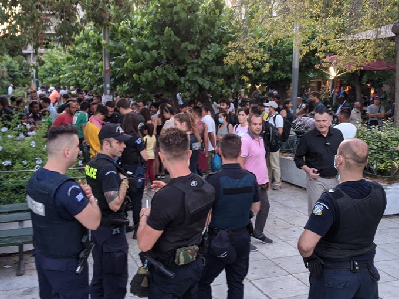
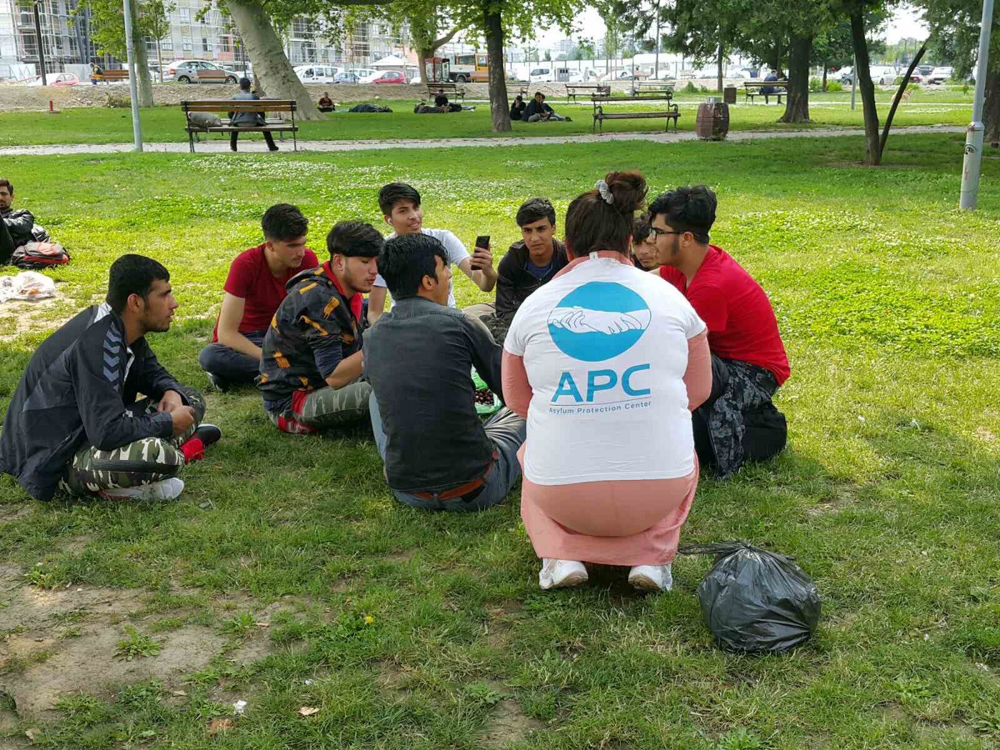

### AYS Daily Digest 16/06/20 Hundreds of people transferred to Athens from Lesvos with nowhere to go

_Protests in Tunis outside Spanish embassy // Germany to allow Dublin transfers again // reports on systematic pushbacks in Greece // more\. \._
### FEATURE Hundreds of people transferred to Athens from Lesvos left with nowhere to go

](assets/4a027911d312/1*6OekVuXv4YHIDeEk1p-etw.jpeg)

Photo of refugees from Lesvos, transfered to Athens with no accomadations for housing when they arrived\. Photo by [ypopto\_mousi](https://twitter.com/lk2015r/status/1272813381624397824)

[A researcher](https://twitter.com/lk2015r/status/1272813381624397824) on migration and illegal pushbacks offered this insight into the reaction towards the people who were transfered from Lesvos, only to arrive in Athens without anywhere to go:

> “Yesterday, [\#Refugeesgr](https://twitter.com/hashtag/Refugeesgr?src=hashtag_click) were transfered from Lesvos to Athens — part of the policy to decongest Moria\. The Greek government made no provision for their housing in Athens\. [\#Refugeesgr](https://twitter.com/hashtag/Refugeesgr?src=hashtag_click) ended up in Victoria Square\. They asked to meet the Mayor of Athens, K\. Bakoyannis \(nephew to the PM, incidentally\) \. The police were called to evacuate the square\. According to the migration ministry some \#Refugeesgr were moved to mainland camps\. 

> Migration min\. Mitarakis blamed solidarians for \#Refugeesgr being in the square — they wanted ‘to make it an issue for the media’\. He said on Mega TV that the refugees should have applied for the IOM\-run Helios programme, \(so it’s their fault…\) \. Mitarakis also bragged about reducing ‘flows’ by 90%, \( \*cough\* \#pushbacks \*cough\* \), referred to ‘closed sites’, reducing number of sites because ‘we cannot give housing for life and pensions for life’ to those who got status\.” 

[EFSYN](https://www.efsyn.gr/ellada/dikaiomata/248032_apo-ti-moria-sti-biktoria-i-oikogeneia-tis-aniha) also reported that other refugees and Greeks did come to the square to see how they could help\. There were several children who more likely than not had to spend the night outside on Tuesday\. They also serve to remind:

> “The situation in Victoria Square is a very small example of where things can go if the Minister of Immigration and Asylum, Notis Mitarakis, insists on evicting 11,000 refugees from structures and apartments, without solutions for the next day\.” 

Refugees met with police in Victoria Square\. Photo by ypopto\_mousi
#### GREECE
### “Greece Suspected of Abandoning Refugees at Sea”

An investigation by DER SPIEGEL reveals how the Greek border control officers regularly carry out pushbacks at sea\. Find it in full [here](https://www.spiegel.de/international/europe/videos-and-eyewitness-accounts-greece-apparently-abandoning-refugees-at-sea-a-84c06c61-7f11-4e83-ae70-3905017b49d5?fbclid=IwAR38rJjBIj6B_kYuTMwPN71wRO7fHIAwd23o7Ssmmf179wb9obrPkSTwk_c) \.

> “The material shows beyond doubt: In the eastern Aegean, European values are being sacrificed in the name of protecting its external borders\. 

> Masked men, almost certainly Greek border control officials, regularly attack refugee boats in the area\. In one case on June 4, the inflatable boat belonging to the masked men can be clearly identified as a Greek patrol boat\. It belongs to Greek Coast Guard ship ΛΣ\-080\. After the refugee boats are intercepted, the Greeks, apparently, frequently put the migrants in inflatable life rafts, tow them toward Turkey and then leave them to their fates\. In most cases, they are dragged ashore after several hours by the Turkish Coast Guard\. 

> The actions taken by the Greeks are a clear breach\. It has long been known that Greek Coast Guard personnel delay rescue attempts and perform aggressive maneuvers\. Now, though, they are actively putting the lives of migrants at risk and they are using life\-saving equipment to put people in danger\.” 

### Racist Violence Recording network just released their Annual Report 2019 for Greece

Here is some of what they had to say about racist attacks on refugees and migrants \(find the [full report here](http://rvrn.org/wp-content/uploads/2020/06/ETHSIA-EKTHESH-2019-english.pdf) \):

> “Victims: 42 incidents against men \(in 16 incidents the victims were 13–20 years old\), six incidents against women \(23–32 years old\), two incidents against NGO offices or facilities run by NGO that provide services to the said group…RVRN in 2019 observes a wider targeting of people from African origin, compared to previous years\. 

> Perpetrators: According to victims, the perpetrators were mainly Greek citizens \(42 incidents\) and men \(36 incidents\) \. In six incidents the perpetrators were women\.” 

■■■■■■■■■■■■■■ 
> **[Tihomir Sabchev](https://twitter.com/TihomirSabchev) @ Twitter Says:** 

> > Anyone remembers the 2,7 km floating fence for which Greece paid 500,000 EUR and which is supposed to stop migrant reaching Lesvos?

It was commissioned back in January and should be delivered on 6 July. https://t.co/cvWUINaAPt 

> **Tweeted at [2020-06-16 16:41:17](https://twitter.com/tihomirsabchev/status/1272932268533780482).** 

■■■■■■■■■■■■■■ 

In this period after the COVID\-19 lockdowns in Greece, the country has not been terribly transparent regarding its public financial deals\. As [the Guardian](https://www.theguardian.com/commentisfree/2020/jun/16/pandemic-greece-public-finances-covid-19?fbclid=IwAR3MrSYdmsuC5iAxcLSoGqGyI0Da6IIi36k5vFpQePOzoMeI1lx-C7Kal7s) reports:

> “Central to the mounting criticism \(to the lack of transparency\) has been the Ministry of Migration and Asylum, which in recent weeks has been hammered by the opposition and media for its disregard for public procurement rules\. Citing both national security and the Covid\-19 emergency, the ministry has gone on a spree of directly awarding contracts worth millions of euros while claiming these deals are “confidential”\. Last month the [government passed a law](https://www.europarl.europa.eu/doceo/document/E-9-2020-002959_EN.html) allowing it to install what EU parliamentarians have described as a “secret fund” in the migration ministry for national security reasons **\.** It has been reported that relevant documents from the [ministry will be destroyed](https://www.kathimerini.gr/1076465/opinion/epikairothta/politikh/epidomata-yperwries-kai-mystika-kondylia) at least every six months\. 

> So far Greece’s lack of transparency over its public finances has passed unnoticed outside its borders\. But with the European Commission’s proposal for a Covid\-19 recovery fund that could send close to €32bn into \(Greece\), this won’t remain so\.” 

#### ITALY

Eleven Italian universities are uniting to create ‘university corridors’ so refugees can to continue studying in Italy\. 20 students currently living as refugees in Ethiopia will be able to continue their academic endeavors in Italy\. Find out more [here](https://www.repubblica.it/solidarieta/diritti-umani/2020/06/15/news/migranti_undici_atenei_italiani_unti_per_creare_dei_corridoi_universitari_cosi_i_rifugiati_potranno_continuare_a_studia-259295846/?refresh_ce&fbclid=IwAR0yLfmOepa4RtbuONyZe9nuw0aXe1ofW-ITm5dc2eB7hnnCBqYD_Z0pZ3I) \.
#### SPAIN

[AllAfrica](https://allafrica.com/stories/202006160738.html?fbclid=IwAR2qCCq4eKFU5e9lbw5GzqrUjDWiA4BEtC2D-1yImgfM0_QitGu6ixOUU_s) is reporting on the recent sit in protests outside of the Spanish embassy in Tunis by the families of Tunisians detained in Melilla:

> “\(They\) demand that their children be allowed to enter the Spanish territories, denouncing the “humiliating treatment” of their children detained in the Melilla centre\. In the midst of heavy security around the embassy, families of the migrants shouted slogans calling for the release of their children and the guarantee of their right to mobility to seek new opportunities in Europe…The migrants’ families express\(ed\) their displeasure at the Spanish authorities’ detention of nearly 800 Tunisians for more than a year in inhuman conditions\.” 

#### THE BALKANS
### Border Violence Monitoring Network just published its Balkan Regional report April/May 2020

[Key points of analysis include](https://www.borderviolence.eu/balkan-region-report-april-may-2020/?fbclid=IwAR3f_83TnyV3fA5zjUCpRSKWBobq1LtbBNwh5qTfcQXopH3NiQJ0yBhAGVU) :

“→ Spray tagging abuse by Croatian police

→ Pushbacks by Frontex from Albania

→ Countrywide removals from Greece to Turkey

→ Dissaggregated “chain” pushbacks from Serbia

→ Legal challenges to Croatia and Hungary

→ ‘Informal Readmissions’ from Italy to Slovenia

Read the full report to find out more on these topics\. Other features include an update from Serbia where army garrisoning, fenced reception centres and fascist attacks have marked a steep increase in violence against transit communities\. You can also follow more on investigations into a shooting by the Greek military, logging by Croatian authorities on the green border, accommodation pressure in Una\-Sana Canton, and updates on housing evictions across Athens and Thessaloniki\.”

SOS Balkan Route released a video showing the destruction in Bihac camp\. _“It's not the first time refugees report that police officers are storming the empty buildings and wild camps and then destroy the last possessions of the refugees there\. All this has system\. All this is happening around the corner, 224 kilometers from Austria\.”_ They also are calling for people to please come to the demonstration on Saturday and also see these events in Vienna: [World Refugee Day\-Solidarity through every crisis\!](https://www.facebook.com/events/2572909476294958/?acontext=%7B%22source%22%3A3%2C%22source_newsfeed_story_type%22%3A%22regular%22%2C%22action_history%22%3A%22%5B%7B%5C%22surface%5C%22%3A%5C%22newsfeed%5C%22%2C%5C%22mechanism%5C%22%3A%5C%22feed_story%5C%22%2C%5C%22extra_data%5C%22%3A%5B%5D%7D%5D%22%2C%22has_source%22%3Atrue%7D&source=3&source_newsfeed_story_type=regular&action_history=%5B%7B%22surface%22%3A%22newsfeed%22%2C%22mechanism%22%3A%22feed_story%22%2C%22extra_data%22%3A%5B%5D%7D%5D&has_source=1&__tn__=K-R&eid=ARDYneQmiWz_Az-MTpFaK2vMpFdzXojuxZ_p_pgHmQtLXERFEqXYFSXpSSivn9pIDKYNwCMncNEpOVeD&__xts__%5B0%5D=68.ARBIHgR4FR8CJLuCFWl_E4F3SrAGUdpEJhk0TdLDEzqMb6-RwRY5x9bQsL9DYmbmA0Dif4aTnaB1u5X_E927bVAxHTjz7j3HNzWMuNrmv7sJ-kI0fOIvSjrJdSlUqsv1lP6-mZXEkSUICWyGFJ0ueiezXQAGqwB47-dN7kfjJAdwkHdNqyaM7EQKeAEm_3y6u0acVM9HwXVx8BfhAeZ80WJMMd6cMGtEoscvXxgIcoD5thWDAH0LEs4bBgG8Z1hGv2w7vXEBdORNJ0NDlT3SXXUGUtGuvdYpK9p99-gYDHjrNER880VGqugC_xQaJSbdoxSlPxZLEGhHg3VEyy2JGMyZz9HLgVRhSuM) and Klagenfurt: [World Refugee Day 2020](https://www.facebook.com/events/182106556443903/?acontext=%7B%22source%22%3A3%2C%22source_newsfeed_story_type%22%3A%22regular%22%2C%22action_history%22%3A%22%5B%7B%5C%22surface%5C%22%3A%5C%22newsfeed%5C%22%2C%5C%22mechanism%5C%22%3A%5C%22feed_story%5C%22%2C%5C%22extra_data%5C%22%3A%5B%5D%7D%5D%22%2C%22has_source%22%3Atrue%7D&source=3&source_newsfeed_story_type=regular&action_history=%5B%7B%22surface%22%3A%22newsfeed%22%2C%22mechanism%22%3A%22feed_story%22%2C%22extra_data%22%3A%5B%5D%7D%5D&has_source=1&__tn__=K-R&eid=ARBud0HE0rVpHphR03VfDOpqyaqXrEot2ynazc_gg_KSiErpb9GuOuhWzDH61yQ-UyHsEFap8nIxWq3t&__xts__%5B0%5D=68.ARBIHgR4FR8CJLuCFWl_E4F3SrAGUdpEJhk0TdLDEzqMb6-RwRY5x9bQsL9DYmbmA0Dif4aTnaB1u5X_E927bVAxHTjz7j3HNzWMuNrmv7sJ-kI0fOIvSjrJdSlUqsv1lP6-mZXEkSUICWyGFJ0ueiezXQAGqwB47-dN7kfjJAdwkHdNqyaM7EQKeAEm_3y6u0acVM9HwXVx8BfhAeZ80WJMMd6cMGtEoscvXxgIcoD5thWDAH0LEs4bBgG8Z1hGv2w7vXEBdORNJ0NDlT3SXXUGUtGuvdYpK9p99-gYDHjrNER880VGqugC_xQaJSbdoxSlPxZLEGhHg3VEyy2JGMyZz9HLgVRhSuM) \.
#### SERBIA

 
·](assets/4a027911d312/1*aJ4C7yjjyOBG6etJ6CAGlA.jpeg)

Belgrade parks\. Photos by [Azil u Srbiji Asylum Protection in Serbia](https://twitter.com/APC_CZA/status/1272933714281013253?fbclid=IwAR3BYi-y5qYPCeHiFKpYg75ZBJYrSvaJOZ4qo_QeWNfx1k-Os6bTyRvAD4Q) 
·

In updates from the aid group Azil u Srbiji Asylum Protection in Serbia:

> “ [The number of refugees](https://twitter.com/APC_CZA/status/1272933714281013253?fbclid=IwAR3BYi-y5qYPCeHiFKpYg75ZBJYrSvaJOZ4qo_QeWNfx1k-Os6bTyRvAD4Q) in the camps is declining sharply compared to the situation during \# COVID\_19, and new people are entering more intensively from the direction of Macedonia and Kosovo in [\#Serbia](https://www.facebook.com/hashtag/serbia?__eep__=6&source=feed_text&epa=HASHTAG) \. Belgrade parks are filled daily with people from Iraq, Syria, Palestine and others\. 

> [Subotica](https://twitter.com/APC_CZA/status/1272922287231074304?fbclid=IwAR2Uo8eV0-Zl9KDhbZzyDKOqhxiqOiV-Bp7Lhr-4AI_M2Yk_p4Oge-RkLjU) — More and more migrants are coming from camps to locations along the border with Hungary\. Among them are unaccompanied minors \(10–16\) from Afghanistan\. Most try to cross illegally by jumping over a wire fence\. In the last 3 weeks, Hungary forcibly returned about 1,500 people to Serbia\.” 

> “ [Batrovci](https://twitter.com/APC_CZA/status/1272918979137413120?fbclid=IwAR2pK7zIZ4B20ihlODi_gqR8xqzDVVJMxcYJusM3pNot1cPG46NthwQLCxY) — up to 100 people are forcibly returned every day by the Croatian police\. In addition to singles, families from Syria and Iraq with small children are also trying to cross the border\. Croatian police continue to use violence and destroy phones\.” 

#### GERMANY

**Germany is set to “un\-pause” Dublin transfers** after initiating the break due to COVID\-19 on March 23rd\. When they lifted custom controls and some flight restrictions on June 15, transfers became possible again\. More [here](https://www.infomigrants.net/en/post/25392/germany-to-restart-dublin-transfers?fbclid=IwAR1yvyC4yi2x78rM7ccC2GpP_qT4JBlVxP7yAwP9LOWiAtDuePSJ9fv9pyU) \.

René Wildangel wrote an excellent analysis on The European Council on Foreign Relations’ site about **“What Assad’s ‘victory’ could mean for Syrians in Germany\.”** Read it in [full here](https://www.ecfr.eu/article/commentary_what_assads_victory_could_mean_for_syrians_in_germany?fbclid=IwAR0xwPOeCdXrka1F8k6scd2-QJIyZ--jCHxnbYJoBIApddPB_4Rc-BlCan0) \.

> “Germany’s state interior ministers and federal interior minister Seehofer will meet this week to decide whether to continue the country’s ban on deporting Syrian refugees\. This comes at a time when the situation in Syria is more hopeless than ever: a fragile ceasefire in Idlib; ongoing human rights violations by the Syrian government; a total absence of reconstruction; a further economic implosion exacerbated by the collapse of the financial system in neighbouring Lebanon; and an intensified US pressure campaign\. A mere glance at this bleak picture should be enough to guide the ministers away from the idea of involuntary return of Syrians\. 

> The last few years have seen the right wing in Germany and across Europe tell a tale of growing societal erosion and Islamist attacks\. But the reality is that the integration of Syrians is actually going smoothly\. A whole generation of Syrians is building a new life, career, and family in Germany — and they are doing so in a fashion that is having immensely positive social and economic effects on Germany\. This new Syrian community is overwhelmingly young \(24 years old on average\) and well educated \(70 percent hold a school diploma\) \. More than 100,000 Syrians are already in employment, while others are pursuing their language proficiency and pursuing their education\. While Germany spends billions on their integration, the German economy is already profiting economically from their presence\.” 

#### FRANCE

InfoMigrants is reporting that hundreds of people living on the street in Grande\-Synthe, since June 3rd have been without a water access point because “the town hall \[has\] removed the last cistern which was at La Linière\.” Many are now forced to drink from and bathe in the lake\. The Mayor has said that the camp wasn’t going to be sustainable anyway\. More [here](https://www.infomigrants.net/fr/post/25390/grande-synthe-la-mairie-supprime-le-seul-point-d-eau-pour-des-centaines-de-migrants-sans-abri?fbclid=IwAR1TESOVMc4tX8PGJAl2V5ypRn8l6aGY-KE00JQkBvcE_ReHSsXg603gsIM&ref=fb_i) \.

 \! ✊
Get mobilized for the [\#regularization](https://www.facebook.com/hashtag/regularization?__eep__=6&source=feed_text&epa=HASHTAG&__xts__%5B0%5D=68.ARBeQkWzDO9PvZ_5pIhq_wdYJzzXhk9B7jMcZ9-tgCdiScvsluuNw99AMJNwm9USXxmq6paNV42PMEvqb75eAx7bMGsu4vr7i2IU-8JWeo6YzVabbgScw7_9OdluofmvWv-6jCoX4-84wLlb5T7rqkR12SEQle9KibYN1pLHH9nLmWslhE74EgRqcctLNzVj3RdktXMIZ1zFOOCFfzBNIKWB1odX6L0LWEljN78VLifyZ7ewcUCJieZvk3dKtKLtnOldlrS6rMrPbfibbgeWpNRxcXRTdmknoTrHAl5t_ZmQnFYhnueQQ60uuABNXG59UeQgrWkYceGYHfm0kSf3&__tn__=%2ANK-R) of the papers\!
Today, La Cimade is launching a campaign for the wide and sustainable regularization of all the non\-papers\. We call for the issue of a stable residence permit which guarantees the right to work, in the long term, to achieve freedom of movement and installation\.
Post your photos with the hashtag [\#LibertéÉgalitéRégularisez](https://www.facebook.com/hashtag/libert%C3%A9%C3%A9galit%C3%A9r%C3%A9gularisez?__eep__=6&source=feed_text&epa=HASHTAG&__xts__%5B0%5D=68.ARBeQkWzDO9PvZ_5pIhq_wdYJzzXhk9B7jMcZ9-tgCdiScvsluuNw99AMJNwm9USXxmq6paNV42PMEvqb75eAx7bMGsu4vr7i2IU-8JWeo6YzVabbgScw7_9OdluofmvWv-6jCoX4-84wLlb5T7rqkR12SEQle9KibYN1pLHH9nLmWslhE74EgRqcctLNzVj3RdktXMIZ1zFOOCFfzBNIKWB1odX6L0LWEljN78VLifyZ7ewcUCJieZvk3dKtKLtnOldlrS6rMrPbfibbgeWpNRxcXRTdmknoTrHAl5t_ZmQnFYhnueQQ60uuABNXG59UeQgrWkYceGYHfm0kSf3&__tn__=%2ANK-R) and tag [La Cimade](https://www.facebook.com/lacimade/?__tn__=K-R&eid=ARCb6WDADoo-EfgbhFhOBt_vYxGeVIJ65lWzCQ95iBuaLv8Zmvf5PNb8XKx7Z6QLfnaleMrw35GaKOdi&fref=tag&__xts__%5B0%5D=68.ARBeQkWzDO9PvZ_5pIhq_wdYJzzXhk9B7jMcZ9-tgCdiScvsluuNw99AMJNwm9USXxmq6paNV42PMEvqb75eAx7bMGsu4vr7i2IU-8JWeo6YzVabbgScw7_9OdluofmvWv-6jCoX4-84wLlb5T7rqkR12SEQle9KibYN1pLHH9nLmWslhE74EgRqcctLNzVj3RdktXMIZ1zFOOCFfzBNIKWB1odX6L0LWEljN78VLifyZ7ewcUCJieZvk3dKtKLtnOldlrS6rMrPbfibbgeWpNRxcXRTdmknoTrHAl5t_ZmQnFYhnueQQ60uuABNXG59UeQgrWkYceGYHfm0kSf3) 
Find some images and the link to the details of our proposals\. Photo by [the campaign](https://www.lacimade.org/liberteegaliteregularisez-regularisation/?fbclid=IwAR1GTGl2luUBZWmKCZrLQ2B7xJGM1Hk51O58pzbcWpkUsPiibziM2cRHbw0)](assets/4a027911d312/1*TJXKe2-O5icxUokMQmTCjQ.jpeg)

[\#LibertéÉgalitéRégularisez](https://www.facebook.com/hashtag/libert%C3%A9%C3%A9galit%C3%A9r%C3%A9gularisez?__eep__=6&source=feed_text&epa=HASHTAG&__xts__%5B0%5D=68.ARBeQkWzDO9PvZ_5pIhq_wdYJzzXhk9B7jMcZ9-tgCdiScvsluuNw99AMJNwm9USXxmq6paNV42PMEvqb75eAx7bMGsu4vr7i2IU-8JWeo6YzVabbgScw7_9OdluofmvWv-6jCoX4-84wLlb5T7rqkR12SEQle9KibYN1pLHH9nLmWslhE74EgRqcctLNzVj3RdktXMIZ1zFOOCFfzBNIKWB1odX6L0LWEljN78VLifyZ7ewcUCJieZvk3dKtKLtnOldlrS6rMrPbfibbgeWpNRxcXRTdmknoTrHAl5t_ZmQnFYhnueQQ60uuABNXG59UeQgrWkYceGYHfm0kSf3&__tn__=%2ANK-R) \! ✊
Get mobilized for the [\#regularization](https://www.facebook.com/hashtag/regularization?__eep__=6&source=feed_text&epa=HASHTAG&__xts__%5B0%5D=68.ARBeQkWzDO9PvZ_5pIhq_wdYJzzXhk9B7jMcZ9-tgCdiScvsluuNw99AMJNwm9USXxmq6paNV42PMEvqb75eAx7bMGsu4vr7i2IU-8JWeo6YzVabbgScw7_9OdluofmvWv-6jCoX4-84wLlb5T7rqkR12SEQle9KibYN1pLHH9nLmWslhE74EgRqcctLNzVj3RdktXMIZ1zFOOCFfzBNIKWB1odX6L0LWEljN78VLifyZ7ewcUCJieZvk3dKtKLtnOldlrS6rMrPbfibbgeWpNRxcXRTdmknoTrHAl5t_ZmQnFYhnueQQ60uuABNXG59UeQgrWkYceGYHfm0kSf3&__tn__=%2ANK-R) of the papers\!
Today, La Cimade is launching a campaign for the wide and sustainable regularization of all the non\-papers\. We call for the issue of a stable residence permit which guarantees the right to work, in the long term, to achieve freedom of movement and installation\.
Post your photos with the hashtag [\#LibertéÉgalitéRégularisez](https://www.facebook.com/hashtag/libert%C3%A9%C3%A9galit%C3%A9r%C3%A9gularisez?__eep__=6&source=feed_text&epa=HASHTAG&__xts__%5B0%5D=68.ARBeQkWzDO9PvZ_5pIhq_wdYJzzXhk9B7jMcZ9-tgCdiScvsluuNw99AMJNwm9USXxmq6paNV42PMEvqb75eAx7bMGsu4vr7i2IU-8JWeo6YzVabbgScw7_9OdluofmvWv-6jCoX4-84wLlb5T7rqkR12SEQle9KibYN1pLHH9nLmWslhE74EgRqcctLNzVj3RdktXMIZ1zFOOCFfzBNIKWB1odX6L0LWEljN78VLifyZ7ewcUCJieZvk3dKtKLtnOldlrS6rMrPbfibbgeWpNRxcXRTdmknoTrHAl5t_ZmQnFYhnueQQ60uuABNXG59UeQgrWkYceGYHfm0kSf3&__tn__=%2ANK-R) and tag [La Cimade](https://www.facebook.com/lacimade/?__tn__=K-R&eid=ARCb6WDADoo-EfgbhFhOBt_vYxGeVIJ65lWzCQ95iBuaLv8Zmvf5PNb8XKx7Z6QLfnaleMrw35GaKOdi&fref=tag&__xts__%5B0%5D=68.ARBeQkWzDO9PvZ_5pIhq_wdYJzzXhk9B7jMcZ9-tgCdiScvsluuNw99AMJNwm9USXxmq6paNV42PMEvqb75eAx7bMGsu4vr7i2IU-8JWeo6YzVabbgScw7_9OdluofmvWv-6jCoX4-84wLlb5T7rqkR12SEQle9KibYN1pLHH9nLmWslhE74EgRqcctLNzVj3RdktXMIZ1zFOOCFfzBNIKWB1odX6L0LWEljN78VLifyZ7ewcUCJieZvk3dKtKLtnOldlrS6rMrPbfibbgeWpNRxcXRTdmknoTrHAl5t_ZmQnFYhnueQQ60uuABNXG59UeQgrWkYceGYHfm0kSf3) 
Find some images and the link to the details of our proposals\. Photo by [the campaign](https://www.lacimade.org/liberteegaliteregularisez-regularisation/?fbclid=IwAR1GTGl2luUBZWmKCZrLQ2B7xJGM1Hk51O58pzbcWpkUsPiibziM2cRHbw0)
#### THE NETHERLANDS

In the new report by M\. Belloni and S\. Aru on **“Sheltering the undocumented in Amsterdam: Inclusive housing rights or policing urban informality?”** they excellently highlight the positives and negatives of the pilot program of a housing scheme for paperless people\. Find it [here](https://homing.soc.unitn.it/2020/06/16/belloni-s-aru-sheltering-the-undocumented-in-amsterdam-inclusive-housing-rights-or-policing-urban-informality/?fbclid=IwAR1zLFg-kZPpAb6XeameZdxwBB_kyBKGMJAa5yaJHqHl896__r05-lB9dQQ) \.

> “The Netherlands has recently launched a project to provide shelters for undocumented migrants\. How can state authorities provide housing for the invisible population of those who are simply not supposed to be there? Belloni and Aru answered this question by interviewing local authorities, government officials and civil society and by spending time with undocumented migrants who are included and excluded by the programme\. In spite of the clear positive implications of this programme, the post sheds light on its less progressive aspects\. In particular, the criteria used to screen eligible migrants introduce new distinctions between “deserving” and “undeserving” irregular migrants\. If this distinction enables some to access assistance, it also justifies a no tolerance policy towards squatting, the practice through which undocumented migrants have usually gained a home, even if a temporary and precarious one\.” 

#### DENMARK

In the newly published “ **Well\-Founded Fear: Credibility and Risk Assessment in Danish Asylum Cases** ” the headlines of the ten recommendations for Danish asylum services are:
1. Education and certification of interpreters
2. Better screening for vulnerable people
3. Assessment of all aspects of an asylum case in one procedure
4. Development of a new test to measure age in the Nordic countries
5. Participation in a common asylum policy and work to revise the Dublin regulation
6. Provision of independent information to the applicant on procedure, rights etc\.
7. Fewer and shorter interviews with a revised structure
8. Sound recording of interviews
9. Improvement of the training of caseworkers
10. Changing the composition and strengthening the rule of law in the Refugee Appeals Board\.

Find the full report with much more insight [here](https://refugeeswelcome.dk/rapporter/pdf/download/?fbclid=IwAR2z7GTyuIy6s9mBTXbJVdd2dfwlhutV3lZ-pGjZT6Lw0iVPCF3-quPihRo) \.
#### NORWAY

](assets/4a027911d312/1*XlwQENW5VcNYCDIQmkTi8Q.jpeg)

“In front of the parliament now\.
Follow the stream from the evacuate children from moria since 12” Photo by [Katrin Glatz Brubakk](https://www.facebook.com/photo.php?fbid=1175051432844643&set=a.133615620321568&type=3&theater)
### Find daily updates and special reports on our [Medium page](https://medium.com/are-you-syrious) \.

**If you wish to contribute, either by writing a report or a story, or by joining the info gathering team, please let us know\.**

**We strive to echo correct news from the ground through collaboration and fairness\. Every effort has been made to credit organisations and individuals with regard to the supply of information, video, and photo material \(in cases where the source wanted to be accredited\) \. Please notify us regarding corrections\.**

**If there’s anything you want to share or comment, contact us through Facebook, Twitter or write to: areyousyrious@gmail\.com**

_Converted [Medium Post](https://medium.com/are-you-syrious/ays-daily-digest-16-06-20-hundreds-of-people-transferred-to-athens-from-lesvos-with-nowhere-to-go-4a027911d312) by [ZMediumToMarkdown](https://github.com/ZhgChgLi/ZMediumToMarkdown)._
