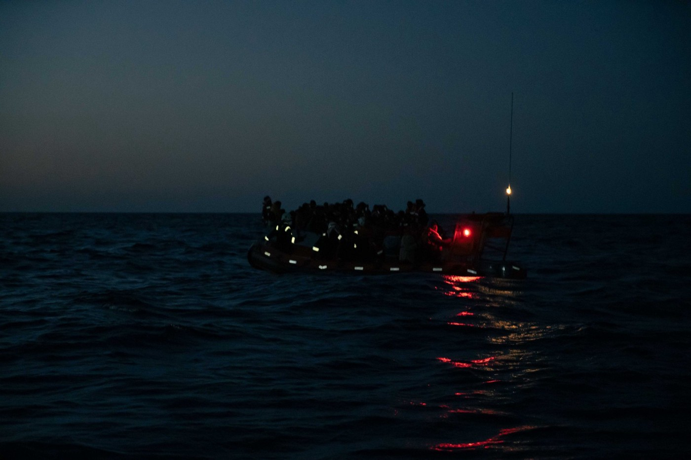

### AYS Daily Digest 18/06/20: 328 people were deported back to Libya
#### Autonomous landings, rescue operations, and pushbacks in the Mediterranean Sea // Reports on Greek pushback tactics // Greek president visits shelter for unaccompanied minors // Pushback from Italy to Greece // 80 million people displaced, highest number ever

Copyright: Sea Watch International
### FEATURE: Autonomous landings, rescue operations, and pushbacks in the Mediterranean Sea

Many people have tried to cross the Mediterranean in recent days\. Some of them made it to Lampedusa, some were rescued by the Sea Watch, and others were intercepted and returned to war\-torn Libya\. Luckily we do not have any news about shipwrecks\. Alarm phone\(a hotline that tries to locate boats in distress and notify the responsible authorities\), the search plane Moonbird, and the rescue ship Sea Watch 3 were busy with saving lives, a job that should be done by European authorities\. 
According to an Italian journalist, about 120 people arrived autonomously to Lampedusa from Wednesday to Thursday morning\. The people landed in six boats:

■■■■■■■■■■■■■■ 
> **[angela caponnetto](https://twitter.com/AngiKappa) @ Twitter Says:** 

> > #migranti Circa 120 persone in 6 sbarchi autonomi sono arrivate a #Lampedusa tra ieri e stamattina. Le barche partite da #Tunisia e Libia: nazionalità Tunisia, Algeria, Egitto, Bangladesh, Marocco, Sudan. Oltre 160 da 2 gommoni sono ora sulla #SeaWatch3 di @[seawatchcrew](https://twitter.com/seawatchcrew) @[RaiNews](https://twitter.com/RaiNews) https://t.co/eZxEzjTgro 

> **Tweeted at [2020-06-18 13:30:12](https://twitter.com/angikappa/status/1273608955617587200).** 

■■■■■■■■■■■■■■ 

At least one of these boats was spotted by the search plane Moonbird\.

In three different operations within 48 hours, a total of 211 people were rescued by Sea Watch 3:

■■■■■■■■■■■■■■ 
> **[Sea-Watch International](https://twitter.com/seawatch_intl) @ Twitter Says:** 

> > 🔴 3rd rescue in less than 48h. Last night, the #SeaWatch3 rescued 46 people from a boat we were informed about by @[alarm_phone](https://twitter.com/alarm_phone). We arrived just in time as water was already entering the boat. Now the total number of guests on board is 211. We need a port of safety immediately! https://t.co/ocq7n4jBZL 

> **Tweeted at [2020-06-19 07:28:09](https://twitter.com/seawatch_intl/status/1273880231586271233).** 

■■■■■■■■■■■■■■ 

They are lucky that they escaped drowning or a forced return to Libya — **but now they need a port of safety\.**

Some 328 people were not so lucky\. They were intercepted and returned to Libya by the Libyan Coast Guard\. According to the Journalist Sara Creta, IOM and UNHCR was at the port during disembarkation\. After some medical treatment and food provision, the people were handed to militias and brought to a location in Tripoli that is controlled by a GNA affiliated armed group:

■■■■■■■■■■■■■■ 
> **[Sara Creta](https://twitter.com/saracreta) @ Twitter Says:** 

> > #Libya Survivors were forcibly brought a location in #Tripoli controlled by a #GNA affiliated armed group. They are now at risk of human trafficking &amp; extortion. No food/medical care. No access of @[IOM_Libya](https://twitter.com/IOM_Libya) &amp; @[UNHCRLibya](https://twitter.com/UNHCRLibya).

The cycle of abuses continues, sponsored by EU + IT. https://t.co/w5FRRtMfIh 

> **Tweeted at [2020-06-18 20:51:51](https://twitter.com/saracreta/status/1273720101557219331).** 

■■■■■■■■■■■■■■ 

Another 185 people were arrested on Thursday by Tunisian National Guards for attempting to cross sea borders, according to a statement by the Tunisian Interior Ministry\. 

The NGO _Borderline Europe — Menschenrechte ohne Grenzen_ published a report on the cooperation between the EU and the Libyan Coast Guards regarding pushbacks in the Mediterranean\. The report is titled “Remote Control: the EU\-Libya collaboration in mass interceptions of migrants in the Central Med\.” It was published together with the NGO’s _Alarmphone_ , _Mediterranea Saving Humans, Sea\-Watch_ and _Statewatch_ \.

The key findings from the report focus on the role of the aerial surveillance conducted by the EU:

> 1\. EU aerial assets are deployed to detect migrant boats from the air and guide the so\-called Libyan Coast Guard to the locations of escaping boats\. 

> 2\. Aerial surveillance has led to the capture of tens of thousands of people and their return to the Libyan war zone\. 

> 3\. Through both aerial surveillance and coordination activities in migrant interceptions, EU actors have violated their SAR obligations and facilitated interception activities of the Libyan authorities\. EU actors are thus complicit in the systematic violation of human rights\. 

For the full report, see:

### GREECE

_Mare Liberum_ and _Deportation Monitoring Aegean_ both published reports on the **new tactics of pushbacks conducted by the Greek Coast Guard in the Aegean Sea\.** 
Since the beginning of March the number of pushbacks has increased dramatically\. A variety of different tactics are being used\. In some cases, the Greek Coast Guard’s boats endanger people on dinghies by steering dangerously close and producing high waves\. Officers on the boats attack people with sticks or fire ammunition into the air and the sea\. Engines are being destroyed\. In some cases, people who have already arrived onshore are forced onto Coast Guards vessels, brought back to the Aegean, put on life rafts and left adrift in Turkish waters\. These life rafts are meant to safe people from drowning in emergencies, not to be used as floating hubs to abandon large groups of people and leave them to their fate\. They do not have engines and can’t be steered\.

According to Mare Liberum, a total of 370 people have been left adrift in 20 life rafts since March 2020\. In many cases, the people conducting the pushbacks have worn black masks\. It is likely that beside the Greek Coast Guards, Frontex is also taking part in these practices\. Witnesses have stated that the ships have been raising foreign flags\. In March, a group of Danish Frontex members refused to follow orders to push back a group of people they just rescued\.

In other cases, people have been deported from reception centres in mainland Greece back to the Evros border crossing in the north of Greece\. The camps concerned are Diavata camp and the Drama Paranesti detention center, both close to Thessaloniki\. Under pretext of renewing residence permits, people were detained, often beaten, and forced to sign a document in Greek that they didn’t understand\. This practice mainly involved men under 30 from Afghanistan, Pakistan, and North Africa\.

In these cases, the people impacted had already applied for asylum\. In the cases of pushbacks directly upon arrival at the islands or still in the Aegean Sea, people were deported without ever being able to apply for asylum\. **Both practices are illegal\.** People have a right to apply for asylum in Europe and to have their claim reviewed in an individual procedure\.

Article 19 of the EU Charter of Fundamental Rights explicitly prohibits collective expulsions, and article 33 of the 1951 Geneva Convention enshrines the principle of non\-refoulement, the cornerstone of international refugee protection\.

Meanwhile, European authorities trample on human rights\.

For the reports, see:

The last families and groups of refugees that gathered at **Victoria Square** in Athens with nowhere else to go were evicted by the police in the afternoon of June 17th\. From reports by _NoBorders,_ we assume that the people were brought to Eleonas Camp in Athens\. 
For more information, see the daily digests for June 16th and 17th:

This video shows how ruthlessly the Greek police interact with both journalists and refugees:

■■■■■■■■■■■■■■ 
> **[MISSION LIFELINE INTERNATIONAL](https://twitter.com/lifeline_intl) @ Twitter Says:** 

> > The #EU's outrage at #GeorgeFloyd’s death is cynical as long as #policeviolence on #refugees and against documenting journalists in #Lesbos are commonplace. The problem is: #racism. https://t.co/9UsmsDTI0T 

> **Tweeted at [2020-06-18 00:10:12](https://twitter.com/lifeline_intl/status/1273407631776980993).** 

■■■■■■■■■■■■■■ 

As IOM Greece reported yesterday, the President of the Hellenic Republic, Ms\. Katerina Sakellaropoulou, visited a shelter for unaccompanied minors in Athens\.

■■■■■■■■■■■■■■ 
> **[IOM Greece](https://twitter.com/IOMGREECE) @ Twitter Says:** 

> > The President of the Hellenic Republic, Ms.Katerina Sakellaropoulou, (@[PresidencyGR](https://twitter.com/PresidencyGR)) visited a shelter for unaccompanied migrant children in Athens, run by #IOMGreece. 

W/ the Asylum, Migration and 
Integration Fund of the European Union #AMIF support.
 [bit.ly/33zdN6A](https://bit.ly/33zdN6A) https://t.co/iiBsynvq9R 

> **Tweeted at [2020-06-18 13:46:13](https://twitter.com/iomgreece/status/1273612985785860097).** 

■■■■■■■■■■■■■■ 

The President expressed her gratitude after young girls handed her drawings they made\. We deeply hope that this visit is more than just a symbolic act and that the new female president will strike a more human and sensible path in governing a highly polarized Greece\.
### CYPRUS

The Cyprus’ interior minister Nicos Nouris called on the European Union to create a common migration policy with the goal of requiring member states to take in a proportional number of asylum\-seekers\. Just some days ago, new legislation that aims to shorten the duration of the asylum application procedure was announced\. Cyprus is currently hosting the highest number of refugees in the EU relative to its population\.

Nouris also announced that a system of safe countries of origin will be implemented in Cyprus\. Asylum application from people from countries like Egypt, Nigeria, Bosnia, the Philippines, and Vietnam will automatically be considered “baseless” unless applicants can prove their individual persecution\.

For more information, see:

A few days ago, the young Egypt LGBTQ\+ activist Sara Hergazi killed herself\. After waving a rainbow flag at a concert in Egypt in 2017, she was arrested and spent three months in prison\. During this time she was mistreated and potentially tortured\. After her release she suffered from post\-traumatic stress disorder\.

Egypt is not a safe country, nor is Nigeria\. Today at 6pm a demonstration to express solidarity with refugees will be held at Eleftheria square in Nicosia\.
### ITALY

No Name Kitchen collected the testimony of a man who was pushed back without a Dublin procedure from Italy to Greece on May 24th\. The man, whose wife and child live in Rome, managed to hide in a truck on the ferry from Igoumenitsa to Ancona\. After arriving, he was discovered by officials who were violent towards him and brought to a special interrogation room\. Without any interpreter, the man was forced to speak in English\. While maintaining that his family lived in Rome, the man was asked for his personal information, fingerprinted and photographed, and then forced to sign a paper in Italian, which he doesn’t speak\. An officer allegedly told him to calm down, maintaining that there would be no problem with his case:

■■■■■■■■■■■■■■ 
> **[NoNameKitchen](https://twitter.com/NoNameKitchen1) @ Twitter Says:** 

> > At the end of the procedure he was forced to sign a paper in Italian, which he does not read or speak. He did not know what he was signing. 

Afterwards, a police officer handcuffed him and brought him onto a ferry 

> **Tweeted at [2020-06-18 13:37:29](https://twitter.com/nonamekitchen1/status/1273610790713597955).** 

■■■■■■■■■■■■■■ 

He was then put on a ferry back to Greece\. Back in Igoumenitsa, he was again interrogated — this time by officials who forced him to get down on his knees and slapped him in the face\.

When people arrive from one EU member state to another, they have the right to ask for asylum\. The first step of the process is a so\-called Dublin procedure in which the authorities check whether or not the person in question already applied for asylum in another EU member state\. If so, the person is then referred to this other country\. In the case reported here, no such Dublin procedure was conducted\. There is also a possibility that the Greek authorities would regard the man’s asylum claim as inadmissible since he left the country and would therefore dismiss it without actually reviewing his case\. In this case he could be deported from Europe without having a European authority reviewing his asylum application\. This would be a breach of European law, since a person has the right to apply for asylum and have his or her case reviewed in an individual procedure\.

20 refugees who are currently in Ethiopia will get the chance to study for a two\-year university degree in Italy\. 11 Italian universities have banded together with the UNHCR to implement a “university corridor” program\.
For more information, see:

### BOSNIA AND HERZEGOVINA

According to a recent newspaper article, the European Commissioner for Home Affairs, Ylva Johansson, is considering withdrawing funding for migration management unless BiH starts to take human rights seriously\. In a direct letter to Bosnia, the Commissioner criticized refugee accommodation practices along the border with Croatia\. Her letter notified the country that the EU expects BiH to respect the rule of law and human rights\. The EU financial assistance for migrant accommodation adds up to 60 million €\. While the EU urges BiH to install more infrastructure, local authorities have instead threatened to close down some of the existing centers\.

For more information in French, see:

### SERBIA

The Asylum Protection Center Serbia reported people being brutally pushed back from Romania into Serbia\. According to the testimonies of people from Syria and Afghanistan, for the past two weeks Romanian police have been humiliating and beating migrants with batons on a daily basis, taking their mobile phones and money during pushbacks to Serbia\. At least 200 people were pushed back a day\.

■■■■■■■■■■■■■■ 
> **[Azil u Srbiji Asylum Protection in Serbia](https://twitter.com/APC_CZA) @ Twitter Says:** 

> > Granica sa Rumunijom. Lica iz Sirije i Avganistana opisuju brutalnost rumunske policije. U zadnjih dve nedelje rumunski policajci svakodnevno ponižavaju i udaraju migrante pendrecima, uzimaju im mobilne telefone i novac prilikom push backa u Srbiju. Najmanje 200 ljudi dnevno. https://t.co/18fAwnzgIT 

> **Tweeted at [2020-06-18 09:55:27](https://twitter.com/apc_cza/status/1273554914690641921).** 

■■■■■■■■■■■■■■ 

### SPAIN

Save the Children is calling on Spain to introduce a new scheme to ensure the rights of child refugees that arrive to Ceuta and Melilla\.

For more information, see:

### SYRIA

■■■■■■■■■■■■■■ 
> **[The White Helmets](https://twitter.com/SyriaCivilDef) @ Twitter Says:** 

> > Another medical issue caused by the overcrowded camp population due to the Russian and regime displacement campaigns is the outbreak of Leishmania in children in northern #Syria. Our #WhiteHelmets work to intensify their field trips and provide treatment doses for those affected. https://t.co/BViRbVKe3N 

> **Tweeted at [2020-06-17 20:50:04](https://twitter.com/syriacivildef/status/1273357265345658883).** 

■■■■■■■■■■■■■■ 

### GENERAL

One in 97 people on this planet is currently displaced, new figures from UNHCR indicate\. UNHCR’s latest Global Trends Report on Forced Displacements suggests that 79\.5 Million people are forcibly displaced\. This is the highest number ever recorded by UNHCR\. 85% of these people are hosted in so\-called developing countries\. 68% originate from only five countries: Syria, Venezuela, Afghanistan, South Sudan, and Myanmar\. 8\.7 million people were newly displaced in 2019 alone\.

Yesterday, UN refugee chief Grandi and IOM’s Vitorino announced the resumption of resettlement travel for refugees\. The resettlement program was halted due to international travel restrictions during the coronavirus pandemic\.

For the full UNHCR report, see:

### Find daily updates and special reports on our [Medium page](https://medium.com/are-you-syrious) \.

**If you wish to contribute, either by writing a report or a story, or by joining the info gathering team, please let us know\.**

**We strive to echo correct news from the ground through collaboration and fairness\. Every effort has been made to credit organisations and individuals with regard to the supply of information, video, and photo material \(in cases where the source wanted to be accredited\) \. Please notify us regarding corrections\.**

**If there’s anything you want to share or comment, contact us through Facebook, Twitter or write to: areyousyrious@gmail\.com**

_Converted [Medium Post](https://medium.com/are-you-syrious/ays-daily-digest-18-06-20-328-people-were-deported-back-to-libya-73636b6644e1) by [ZMediumToMarkdown](https://github.com/ZhgChgLi/ZMediumToMarkdown)._
