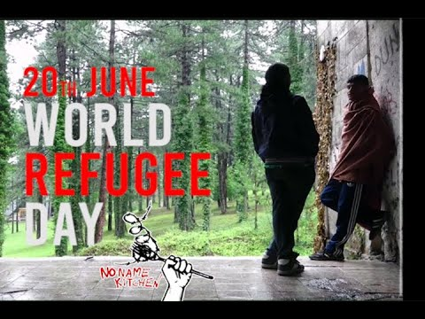
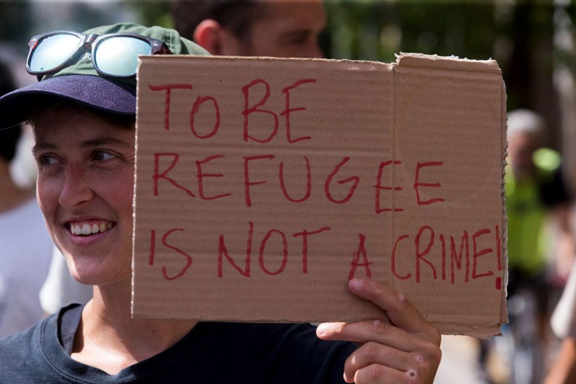
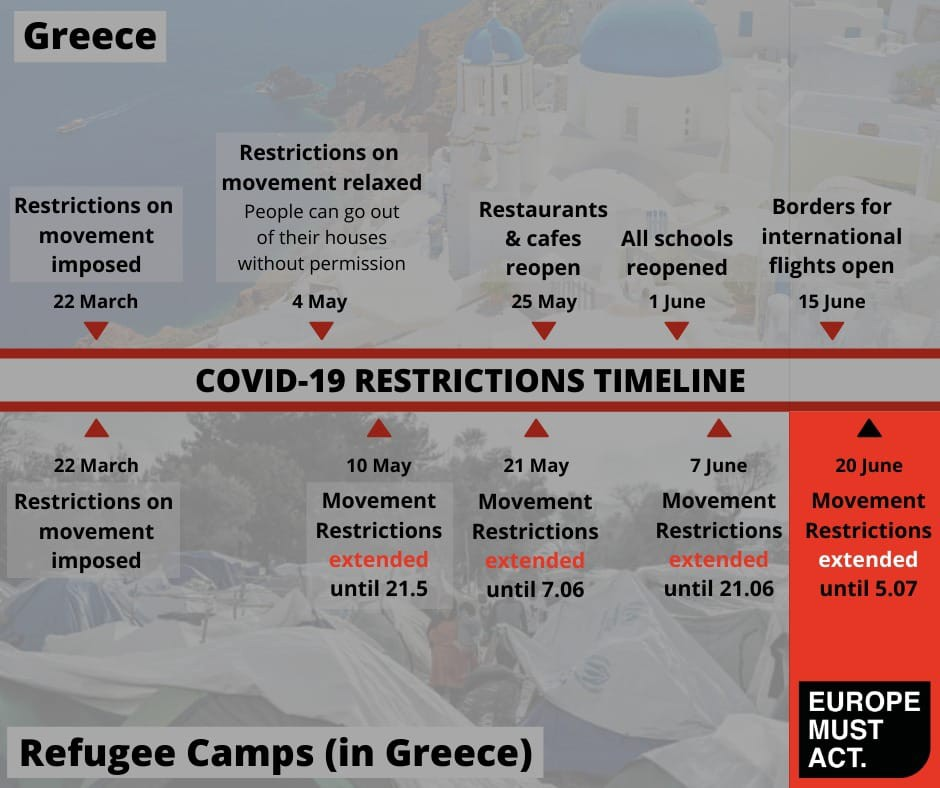

### AYS Weekend Digest 20–21/06/2020 EU: Black Lives Matter, as long as they are not coming to Europe

Shipwreck off Libyan coast, three bodies recovered so far / Sea Watch and Mar Ionio disembarked in Sicily, but different standards / 240 people reached Spain…

 \)](assets/ad89ca176142/1*ZIrhx5ga07JXQR7RRk2ALg.jpeg)

Saturday 20 June was World Refugee Day\. At least three people have died in a shipwreck off the Libyan coast\. \( [Image by CEAR, Comisión Española de Ayuda al Refugiado, for the \#UErfanos campaign, 2015](http://uerfanos.org/) \)
#### Feature 1: World Refugee day: at least three people died in a shipwreck

While the EU parliament was officially [declaring](https://www.eu-journalists.eu/2020/06/20/european-union-declares-black-lives-matter-condemns-racism/) that Black Lives Matter, IOM [reported](http://www.mediterraneocronaca.it/2020/06/20/ancora-un-naufragio-in-libia-recuperati-tre-corpi-superstiti-in-lager-privato/?fbclid=IwAR2ce_T0-ZIHsPGYzeoPEw9iF0R25n3CHPtNUj5YxpwoZlOCfFhNdvBfOsU) a shipwreck off the Libyan coast\. Three bodies have been recovered\. This is the third shipwreck in recent weeks, at least that we know of\. European and Libyan authorities are by now used to treating the Central Mediterranean as top secret, refusing to communicate distress cases, interceptions and returns to Libya\. The shipwreck [took place](https://twitter.com/scandura/status/1274393703357038592) west of Tripoli, between Zawia and Janzur\. Nineteen people have been rescued by local fishermen and have been taken to an unofficial detention centre\.

■■■■■■■■■■■■■■ 
> **[Sara Creta](https://twitter.com/saracreta) @ Twitter Says:** 

> > #Libya #Tripoli Geolocation of hangar controlled by Zintani al-sawaiq brigade to hold #migrants following their interception at sea. People recently brought there have disappeared in less than 24h. No int'l orgs access.

You can see it here on @[googlemaps](https://twitter.com/googlemaps) [google.com/maps/place/32%…](https://www.google.com/maps/place/32%C2%B050'50.4%22N+13%C2%B005'53.3%22E/@32.8473333,13.0959502,17z/data=!4m5!3m4!1s0x0:0x0!8m2!3d32.847319!4d13.09814) https://t.co/gNKbfizEoi 

> **Tweeted at [2020-06-21 19:52:10](https://twitter.com/saracreta/status/1274792246899019776).** 

■■■■■■■■■■■■■■ 

Evidently, Black lives matter only if they are not on their way to Europe\.
#### **Feauture 2: Europe is not only the EU though\.**

Protests and solidarity campaigns have been organised throughout the continent\.

■■■■■■■■■■■■■■ 
> **[From the Sea to the City](https://twitter.com/FromSea2City) @ Twitter Says:** 

> > On #WorldRefugeeDay we launch #Sea2City, an initiative led by sea rescue organisations and civil society, calling to create a network of cities, municipalities and activists to reimagine the European stance on migration with human rights at the center.

[bit.ly/2N5xmfX](https://bit.ly/2N5xmfX) https://t.co/V5D1CoWb8H 

> **Tweeted at [2020-06-20 08:00:12](https://twitter.com/fromsea2city/status/1274250685819871233).** 

■■■■■■■■■■■■■■ 

 in a protest against the Greek government’s migration policy\. Several thousand recognized asylum seekers are threatened with homelessness\. After their recognition, they are only allowed to stay in their accommodations for four weeks instead of six months\. \(Photo by [Marios Lolos](https://web.facebook.com/marios.lolos.1) \)](assets/ad89ca176142/1*8ZLld1GRFgpx3nDsNEP--w.jpeg)

ATHENS, GREECE: 2000 people [participated](https://web.facebook.com/NewsfromtheMed/posts/971616596625270?hc_location=ufi) in a protest against the Greek government’s migration policy\. Several thousand recognized asylum seekers are threatened with homelessness\. After their recognition, they are only allowed to stay in their accommodations for four weeks instead of six months\. \(Photo by [Marios Lolos](https://web.facebook.com/marios.lolos.1) \)

■■■■■■■■■■■■■■ 
> **[Yonsse Lmaki](https://twitter.com/YonsseLmaki) @ Twitter Says:** 

> > Quieren superar la epidemia y hay personas que no tienen vivienda ni agua.#RegularizacionYa https://t.co/zWHgICZdv3 

> **Tweeted at [2020-06-21 18:14:17](https://twitter.com/yonsselmaki/status/1274767611289624582).** 

■■■■■■■■■■■■■■ 

 in several cities, asking for the resumption of sea rescue and the closure of Greek refugee camps\. In Wuppertaal, Seebrucke [presented](https://www.wuppertaler-rundschau.de/lokales/seebruecke-plant-in-wuppertal-gedenkort-fuer-ertrunkene-fluechtlinge_aid-51770279) plans for a memorial monument for people who died in the Mediterranean\. \(Photo by [Nora Hofstetter](https://twitter.com/NoraHofstetter) \)](assets/ad89ca176142/1*P7tp8MQrPBi-7E8vUdbVTg.jpeg)

GERMANY: Seebrucke activists have staged [protests](https://twitter.com/HAZ/status/1274435913511297026) in several cities, asking for the resumption of sea rescue and the closure of Greek refugee camps\. In Wuppertaal, Seebrucke [presented](https://www.wuppertaler-rundschau.de/lokales/seebruecke-plant-in-wuppertal-gedenkort-fuer-ertrunkene-fluechtlinge_aid-51770279) plans for a memorial monument for people who died in the Mediterranean\. \(Photo by [Nora Hofstetter](https://twitter.com/NoraHofstetter) \)

In THE NETHERLANDS, Stop the War on Migrants have published a r [ound\-up of all protests in the country](https://stopthewaronmigrants.noblogs.org/post/2020/06/21/geslaagd-protest-op-20-juni-wereldvluchtelingendag/?fbclid=IwAR3_zo5DQGCQ3kVKcGKYqaWtF2bM5DzPB_CrJq_iddQCGW3uyKILVUQDBbU) \.

These demonstrations are the last step of a campaign to pressure the Dutch government to accept 500 minors from Greece\. The government has so far refused it, arguing that there are better ways to help and pledging 3\.5–4 million euros to help children in Greece\. As the Guardian [report](https://www.theguardian.com/world/2020/jun/21/dutch-government-under-growing-pressure-to-take-in-child-refugees?__twitter_impression=true) s, “One third of Dutch municipalities — 119 local authorities representing nine million people — have said they are in favour of bringing 500 children to the Netherlands, according to the University of Utrecht\. Big cities, such as Amsterdam, Arnhem and Utrecht, have offered [to take in some children](https://www.theguardian.com/world/2020/apr/24/cities-lobby-eu-to-offer-shelter-to-migrant-children-from-greece) \. About 100 prominent figures signed an open letter calling on the Dutch government to answer Greece’s ‘cry for help’\.”

Only on 18 June, did “a Dutch justice ministry spokesperson say a memorandum of understanding signed with the Greek government included an agreement to shelter 48 children on the Greek mainland ‘as soon as possible, with a total capacity of 500 over three years’\.”

 \)](assets/ad89ca176142/1*hD9qhfGt2ZZEvgn3KS_tgQ.jpeg)

BRUSSELS, BELGIUM: This Sunday a boat protest took place on the Brussels Canal\. About 30 people boarded about 15 rafts and boats\. Climbers also deployed a banner under the Sainctelette bridge\. \(Photo via [Selena Carbonero](https://web.facebook.com/photo.php?fbid=10220598412443630&set=a.2828313780342&type=3&theater) \)

From the protestors’ statement:

> Today, we occupy the Brussels canal with about 15 rafts \[…\] because our leaders are determined to revive everything that poisons this world and our lives as soon as possible\. We don’t want this back to the abnormal\. While the National Security Council reopen industries, shops, bars, schools, tourism, \[…\] we are still forbidden to express ourselves… We do not want to wait for the government to finally give us the streets\. 

> We occupy the canal to affirm our solidarity with the forgotten of the health crisis \(detainees, elderly, homeless, precarious workers\), with the first\-line workers in the struggle, for the regularization of all sans papier, for affordable housing, against the anti\-squat law, for the end of police impunity, against state racism, against the patriarchy, against the commodification of health care… In short, for a radically different world, departing from all the policies carried out so far\. 

> It is up to us to build here and now an ecological, feminist, anticapitalist, social and decolonial future\. The waiting time to self\-isolate our anger is over\.”

■■■■■■■■■■■■■■ 
> **[Gilets Noirs](https://twitter.com/gilets_noirs) @ Twitter Says:** 

> > On est là 🔥✊🏿
Pour soutenir le combat de @[laveritepradama](https://twitter.com/laveritepradama) 

Pour défendre la vie des immigrés contre l'Etat français raciste qui menace nos vies 

#AutodefenseImmigrée riposte #GiletsNoirs 🏴👊🏿

#VeritePourAdama https://t.co/5Q54YNVAeq 

> **Tweeted at [2020-06-13 12:58:12](https://twitter.com/gilets_noirs/status/1271788964379267072).** 

■■■■■■■■■■■■■■ 

In GLASGOW, SCOTLAND, last week, a demonstration organised by the No Eviction Network was blighted by the massive presence of the far right, who attacked peaceful protestors and forced organisers to call off the event\.

An interesting and insightful read on the reasons behind the protest states:

> The background to that campaign sheds some light on why the fight against racism remains so important in Scotland\. In July 2018, the private outsourcing firm Serco announced plans to evict over 300 people from the asylum accommodation it operated across Glasgow\. The firm argued that they were still paying to house people who were “no longer receiving \[asylum\] support from the Home Office\.”

> The method proposed? Changing the locks on a person’s house, so they can no longer enter the property, and gathering any personal belongings for collection at a later date\. This would be preceded by an escalating countdown of letters explaining that the occupier had a ‘notice to quit’ the accommodation, a set of measures that Serco called its ‘move on protocol\.’ Of course, it remained unclear where people should ‘move on’ to\. 

Read the full article [HERE](https://tribunemag.co.uk/2020/06/the-asylum-seeker-struggle-behind-glasgows-protests) \.

On Saturday 20 June, an antifascist and antiracist demonstration was held in the city\. Despite it being peaceful and socially distanced, “Police Scotland attempted to incite a disturbance by kettling peaceful protestors in a tightly confined space during a pandemic\. It was clear that the police made an attempt to single out a particular group within the demonstration for especially heavy\-handed treatment, however we were heartened to see so many protestors come to their aid and unequivocally denounce the violent overreaction of the police\.” \(From the [statement of United Against Fascism](https://twitter.com/sukisangh/status/1274649932935372807/photo/1) \)

TUNISIA

Tunisian Press Agency report that two traffickers were [arrested](https://www.tap.info.tn/en/Portal-Society/12802258-two-organisers-of) over the weekend in Sfax and Mahdia\.

GREECE
#### Arrivals

According to [Aegean Boat Report](https://web.facebook.com/AegeanBoatReport/?__tn__=kC-R&eid=ARCF7FldGCm1OMFRuMEesnXlA1ozJqPF195s4LQkTt7XOOxkXneE883nFuKkNudi0R2kfplD4QBEf6Ei&hc_ref=ARRkskfnTpzlQneVgtyT_8roIsM5Fk_4yDXv4awi17H9_Cvsgnn_EAp0XlPQkU7sMCk&fref=nf&__xts__[0]=68.ARBjFyQHdTWxzTA7wXTvOhflMdEFxXcfx-YXihMcPx5nvuvYW0kqypq_nzL1fQ8x8ocToUYFNOOp4fFvuf6eZekSmUc8JOi8VdKeZhXxfr_FhPTEE-NTRc0rJqZquecP75MoDBWCevjv6jUqQ2XJSjZMXwBJc8KfAoDJ3u6BeeW_3BBUqjBSTJL0XZokbFh-fs6cFx-3musFMrQI85UYwSVklzYcFPVllPCaz5dOWoe1a-XW1ts_yyEknalUJ0a9TcymkOcCqDCtWwPmqCDXMcOK-cIVUDfmDuN20GGm-Q02hz8syrkVY6zwTe4tWJjdLkRWlQV2el8BnfIPGzCkHQA) , one boat, carrying 20 people \(at least 10 children\), landed south east of Fteli, Lesvos south, very early on Friday morning\. They were found in the afternoon and all were moved to the quarantine area in Kara Tepe for 14 days quarantine due to COVID\-19 restrictions\.
#### Hellenic coast guard now equipped with thermal cameras and radars

In the latest episode of the Turkish/Greek saga, the minister of shipping and island policies has [declared](https://www.keeptalkinggreece.com/2020/06/20/greece-maritime-borders-shield-themal-cameras-radars/) that Greece will defend its maritime border\. This comes after the recent agreement between Turkey and Libya and Turkish authorities’ statements about prospect drilling for oil and gas in the eastern Mediterranean\. Despite the fact that such devices are not said to be explicitly aimed at people on the move, it is likely that they are going to be used in all border control activities, especially after last weeks [talks](https://twitter.com/itamann/status/1274399136029249536) between the Greek migration minister and Austrian authorities on how to tighten the country’s border\.
#### Restrictions extended for hotspots \(again\)

Europe Must Act [reports](https://web.facebook.com/europemustact/photos/a.104489524497084/150892339856802/?type=3&theater) that “the Greek Government has announced, once again, their decision to extend the restriction measures to limit freedom of movement for residents in the Reception and Identification Centers in the Aegean islands\. Restrictions have also been arbitrarily extended in some accommodation structures for refugees and asylum seekers in Ritsonas, Malakasa and Koutsocheros in Larissa\.”

This is the 4th extension in two months\. Restrictions have been extended until 5 July\.

> Tourists and foreign travelers from many countries have been eligible to travel to Greece for non\-essential purposes since 15 June\. So, once again, we are faced with restrictions being extended for one category of society based on country of origin\. 

ITALY
#### Arrivals: Sea\-Watch3 and Mar Ionio disembark in Sicily,

On Saturday the Mar Ionio disembarked in Pozzallo\. The 67 people onboard will undertake a two\-week quarantine in a structure in the city\. Pozzallo’s mayor [met](https://twitter.com/beppecaccia/status/1274670669486317569) with the Mar Ionio crew as a show of solidarity and support for their activities\.

On Sunday, the Sea\-Watch 3 disembarked in Porto Empedocle\. Authorities imposed different quarantine measures based on the flag of the rescue ship\. The 211 people rescued by Sea\-Watch will be transferred on to the Moby Zaza ferry for a quarantine period\.

As much as this shows the positive solidarity of some Italian local authorities with humanitarian rescue, it is impossible not to notice the difference in treatment: the crew of the Mar Jonio is allowed to disembark and meet with the mayor, the people rescued by the Italian NGO are put into quarantine inland and those rescued by Sea\-Watch are forced to spend another two weeks at sea\. Italian media claim that the disparity is due to stricter safety measures operated by the Italian NGO, but no further details are given…

From Sea\-Watch:

> A ship cannot be considered a “Place of Safety” under international sea rescue conventions\. However, [\#SeaWatch3](https://twitter.com/hashtag/SeaWatch3?src=hashtag_click) has to resume operations and we don’t want to arbitrarily expose guests and crew to avoidable difficulties and suffering, similar to the weeks\-long standoffs in the past year\. 

> Preventive measures aimed at containing the spread of [\#Covid19](https://twitter.com/hashtag/Covid19?src=hashtag_click) should be implemented in suitable facilities on land\. The pandemic must not be used politically to create double\-standards for rescue ships and to deny people seeking refuge their basic rights\. 

> The distribution of rescued people has to happen on shore, with European member states living up to their responsibilities and a German government respecting the demands of over 160 solidarity cities and communes to receive those rescued at sea\. [\#LeaveNoOneBehind](https://twitter.com/hashtag/LeaveNoOneBehind?src=hashtag_click) 

#### More money from Italy to the Libyan coast guard

While people keep dying in the central Mediterranean, the Italian government announced last week that they will increase funding for the Libyan coast guard\. Oxfam Italia [denounce](https://www.oxfamitalia.org/wp-content/uploads/2020/06/CS_-OXFAM_DALL%E2%80%99ITALIA-PIU%E2%80%99-SOLDI-ALLA-LIBIA-MENTRE-IN-MARE-SI-CONTINUA-A-MORIRE_17_6_2020_final.pdf) the fact that none of the modifications announced in November last year have been implemented\. Italy will increase the funding by three million euros, to a total of 58\.28 million in 2020 and 213 million over three years\. When it comes to curbing migration flows — in perfect continuity with previous governments — Italian authorities \(and the EU\) keep [supporting and funding](https://morningstaronline.co.uk/article/f/sending-refugees-back-to-hell-with-eu-support?fbclid=IwAR11jeAF7EaaI40u7qHpV9f2wyTHIG5ZuZW6R_0wjMKm6Xp8Rq9RkTUEhJM) human rights violations, torture, rape and human trafficking\.
#### Police officer investigated after abusing two people on the move

Italian authorities have suspended from office and [opened an investigation](https://www.tap.info.tn/en/Portal-Politics/12799909-investigation-into) into aggressive treatment by an Italian security officer of two people on the move who tried to escape from a Sicilian detention centre\. A video recently [broadcast](https://twitter.com/AngiKappa/status/1274756986379386885) on social media shows the Italian security agent forcing the two people to slap each other\.

MALTA
#### Malta Refugee Council established on World Refugee Day

Maltese media [report](https://www.maltatoday.com.mt/news/national/103086/human_rights_advocates_ngos_launch_malta_refugee_council?fbclid=IwAR1BBAZEYIuTVV81A9BVXV3WCjVsEjMcSd301Mc5ndEoKGqEJKgZjiJfhgI) that the country’s foremost human rights NGOs and refugee charities have launched the [Malta Refugee Council](https://maltarefugeecouncil.org.mt/) as a network of Maltese non\-governmental organisations working for the promotion of the fundamental human rights of persons in forced migration\.
#### 21 people manage to break out from Maltese detention centre

Maltese media report that 21 people broke out from Hal Far detention centre\. The news was broadcast on Saturday afternoon\. At the time of writing, they are believed still to be free\.

SPAIN
#### Arrivals
#### Around 240 people rescued in the Eastern Med

Canary islands local media report that one boat, carrying eight people, was [intercepted](https://www.canarias7.es/siete-islas/gran-canaria/interceptada-una-patera-con-ocho-migrantes-a-unas-seis-millas-de-arguineguin-gran-canaria-YE9363177) off Gran Canaria on Saturday morning and rescued by the Civil Guard on Saturday morning\.

Media [report](https://www.lavozdigital.es/andalucia/sevi-mas-240-personas-27-menores-llegaron-pateras-entre-sabado-y-domingo-andalucia-202006220739_noticia.html?ref=https:%2F%2Ft.co%2FLJtieCkLSi%3Famp%3D1) that at least 241 people arrived on the Andalusian coast on Saturday and Sunday\. Most of them landed or were brought to the Almería province, where 141 people arrived on Saturday and 78 on Sunday\.

Spanish media reported that 11 of the 31 people rescued on Thursday in Fuerteventura \(Canary islands\) [tested positive to coronavirus](https://www.niusdiario.es/sociedad/sanidad/once-de-31-migrantes-patera-jueves-fuerteventura-positivo-coronavirus_18_2966520042.html) \. Another 14 people rescued on Sunday have tested positive to the virus\. For several weeks, the Ministry of Health of the Canary Islands has been conducting such tests on all migrants who are rescued when they reach the island coasts by boat\.

Bosnia and Herzegovina
#### People on the move prevented from using buses

Local media report that a group of people on the move was [prevented](https://crna-hronika.info/iako-su-platili-kartu-migrantima-nisu-dali-da-udju-u-autobus/136471) from boarding a bus at the bus station of Banja Luka\. Despite having regular tickets, a group of 20–30 people was barred by police from getting boarding the bus and reaching their destination \(likely Tuzla\) \.

SERBIAN / HUNGARIAN BORDER

[Azil u Srbiji Asylum Protection in Serbia](https://twitter.com/APC_CZA) report of a brutal arrest and push\-back by the Hungarian police\. Muhamed was arrested trying to climb over a barbed wire border fence near Horgos\. Police stomped on his wounded hands with heavy boots\. “Hungary illegally returns at least 400 people daily to Serbia in the vicinity of Bajmok, Horgos, Kelbija, and Kanjiza\.”

FRANCE
#### Hundreds of people left again on the streets of Paris

With COVID\-19 emergency shelters closing down, hundreds of people were [forced back into the makeshift camps in northern Paris](https://www.leparisien.fr/faits-divers/camps-de-migrants-en-ile-de-france-on-est-reparti-pour-un-cercle-infernal-puissance-10-19-06-2020-8338605.php?fbclid=IwAR1Ymaz0o246keOsviibyPq2wpMS0QyBN9_-RzzNpUc8mr_pHtLSTAkpd1g) \. At the height of the COVID\-19 crisis, up to 177,000 beds were made available for homeless people and rough sleepers throughout the country\. In the last few weeks, some of these emergency structures have closed, and hotels that had participated in the initiative have reopened their commercial activities\. By the end of May, hundreds of tents had already been put up in the Aubervilliers\-Saint Denis and Porte de la Villette areas, and the situation has been worsening since\.

Local organisations have demanded that authorities develop a comprehensive plan for the summer, instead of carrying on with their “infernal cycle” caused by unplanned eviction, destruction of property and lack of alternatives\.
#### Two people stabbed in a fight in Calais

Two people living in one of the makeshift encampments in Calais have been stabbed and taken to hospital on Saturday, local media [report](https://www.radio6.fr/article-52395-calais-une-rixe-entre-migrants-fait-2-blesses.html?fbclid=IwAR2JNPCGYhK3a6_tSeCi2AgBMdQkdMpHkOVLwJinxJ0fIDBRRSRw2-Ytino) \. They are not in life\-threatening condition, but one of them reported a serious injury\.

IRELAND
#### 30 scholarships for Irish\-based refugees and asylum seekers at Dublin City University

Dublin City University, Ireland’s first formally designated University of Sanctuary, has announced 30 scholarship options for Irish\-based refugees and asylum seekers ahead of World Refugee Day \(20 June\) \.

The announcement coincides with a [recent study](https://journal.alt.ac.uk/index.php/rlt/article/view/2368) at the university that shows the significantly positive impact that access to higher education can have on the quality of life for refugees, their sense of themselves and their ability to realise future goals\.

Read more [HERE](https://www.dcu.ie/news/news/2020/Jun/DCU-announces-30-scholarships-mark-World-Refugee-Day.shtml) \.

EU
#### Migration and asylum policies reform discussion postponed again

Media [report](https://www.politico.eu/article/migration-reform-to-be-postponed-after-a-deal-on-the-eu-budget-said-commissioner-ylva-johansson/) that, according to a statement from EU’s Home Affairs Commissioner Ylva Johansson, a long\-awaited European Commission proposal on migration reform has been postponed again — this time until after EU leaders reach a deal on the bloc’s long\-term budget\.
#### Voluntary returns are not so voluntary

Journalists Sara Creta and Lillo Montalto Monella have published a series of articles on the failings of the voluntary returns program sponsored by IOM and paid for by the EU\. The program is hailed as “ [the EU’s flagship response to stopping migrants trying to get to Europe](https://www.euronews.com/2020/06/19/paying-for-migrants-to-go-back-home-how-the-eu-s-voluntary-return-scheme-is-failing-the-de) ”\.

> Around 81,000 African migrants returned to their home nation with the aid of the UN’s International Organization for Migration \(IOM\) and \[financial support of\] the European Union, as part of the €357 million [Joint Initiative\.](https://migrationjointinitiative.org/) \[…\] Of the 81,000 migrants returned since 2017, almost 33,000 were flown back from Libya, many of whom have suffered detention, abuse and violence at the hands of people smugglers, militias and criminal gangs\. Conditions are so bad in the north African country that the programme is called Voluntary Humanitarian Return \(VHR\), rather than the Assisted Voluntary Return \(AVR\) programme elsewhere in Africa\. [_\(Sara Creta and Lillo Montalto Monella\)_](https://www.euronews.com/2020/06/19/paying-for-migrants-to-go-back-home-how-the-eu-s-voluntary-return-scheme-is-failing-the-de) 

Stigma and lack of straightforward support once returned are among the factors that push many people to repeat their attempt to reach Europe\. Furthermore, it is the lack of information given to prospective returnees, the conditionality of most forms of support to acceptance and the lack of scrutiny that raise questions of how these returns can be considered voluntary at all\.

Read the full articles:
- [Paying for migrants to go back home: how the EU’s Voluntary Return scheme is failing the desperate](https://www.euronews.com/2020/06/19/paying-for-migrants-to-go-back-home-how-the-eu-s-voluntary-return-scheme-is-failing-the-de)
- [Abused in Libya and forced into prostitution back home: the nightmare of trying to reach Europe](https://www.euronews.com/2020/06/21/abused-in-libya-and-forced-into-prostitution-back-home-the-nightmare-of-trying-to-reach-eu)
- [Eritrean migrants in Libya claim EU\-backed voluntary returns programme isn’t so voluntary](https://www.euronews.com/2020/06/20/eritrean-migrants-in-libya-claim-eu-backed-voluntary-returns-programme-isn-t-so-voluntary)

**Find daily updates and special reports on our [Medium page](https://medium.com/are-you-syrious) \.**

**If you wish to contribute, either by writing a report or a story, or by joining the info gathering team, please let us know\.**

**We strive to echo correct news from the ground through collaboration and fairness\. Every effort has been made to credit organisations and individuals with regard to the supply of information, video, and photo material \(in cases where the source wanted to be accredited\) \. Please notify us regarding corrections\.**

**If there’s anything you want to share or comment, contact us through Facebook, Twitter or write to: areyousyrious@gmail\.com**

_Converted [Medium Post](https://medium.com/are-you-syrious/ays-weekend-digest-20-21-06-2020-eu-black-lives-matter-if-they-are-not-coming-to-europe-ad89ca176142) by [ZMediumToMarkdown](https://github.com/ZhgChgLi/ZMediumToMarkdown)._
