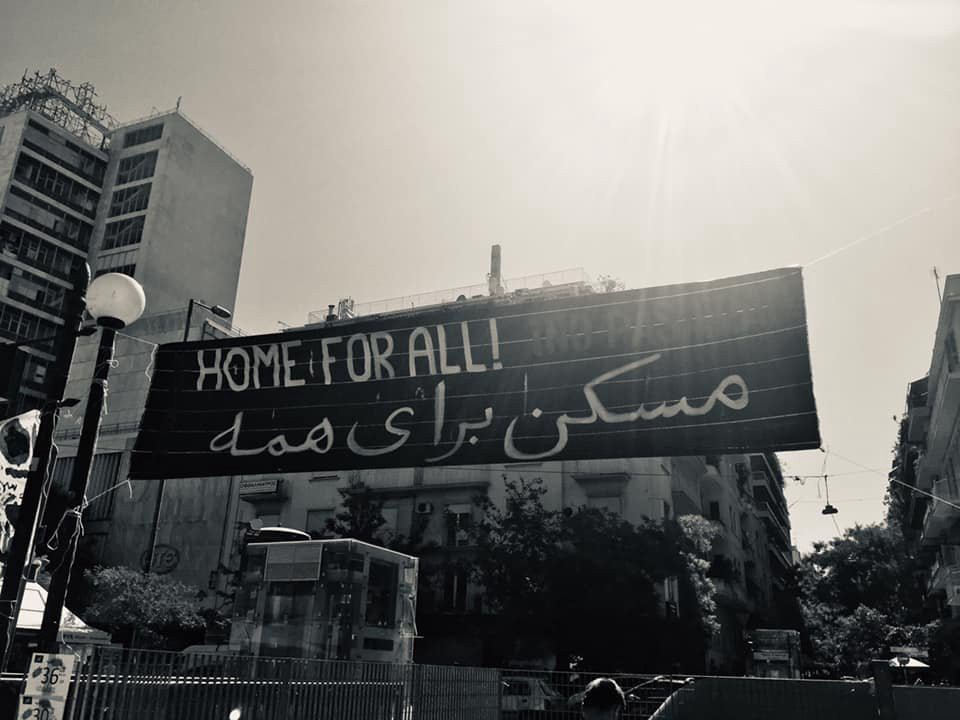
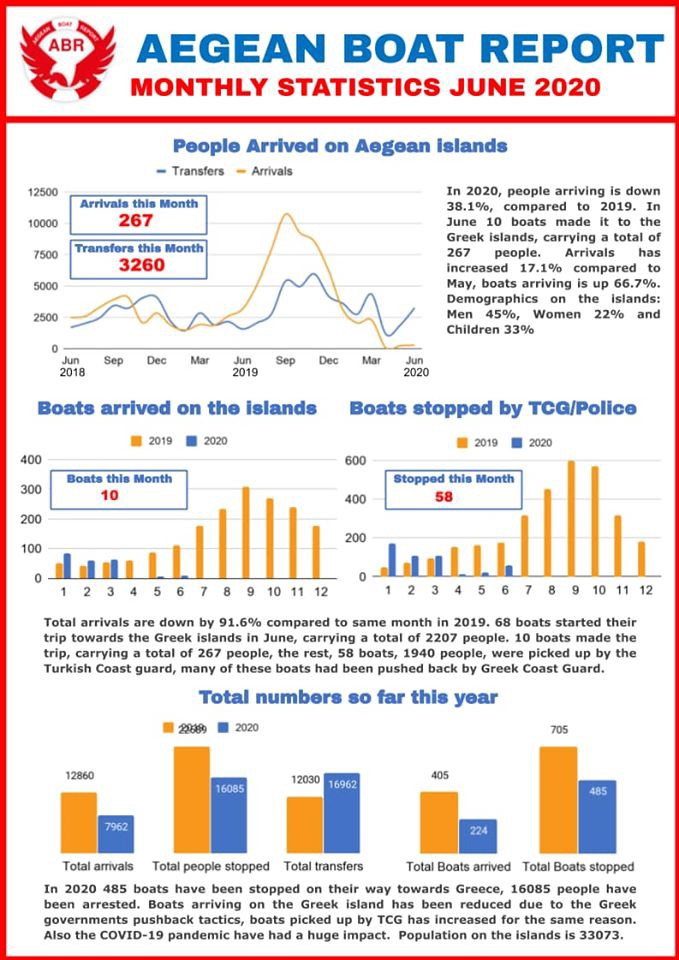
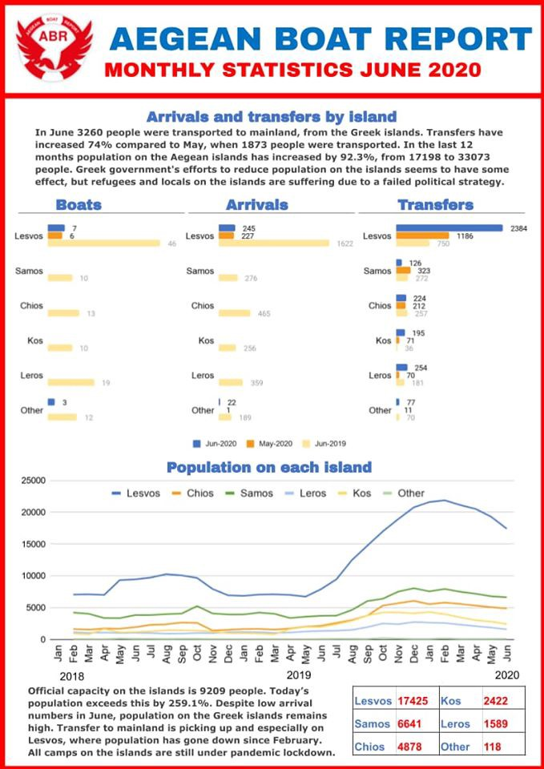

### AYS Daily Digest 02/07/2020: One year since an airstrike hit Tajoura detention centre in Libya
#### Monitoring NGOs call on Germany to protect the rule of law along the European borders during its presidency // Greece: One man drowned, one man killed himself // Ocean Viking is waiting for a Port of Safety // More updates from BiH, Croatia, North Mazedonia, Italy, the Sea \. \.

Copyright: NoBorder Greece
### FEATURE: Libya one year after

One year ago, on 2 July 2019, bombs fell on the migrant detention centre Tajoura in Tripoli, Libya\. This led to the death of at least 53 people, likely more\. According to survivors, the guards shot at people who were trying to flee the scene\. Before the airstrike various activists and NGO’s had called for the eviction of the centre, as it was in the front lines of the war between Libya’s UN\-recognised Government of National Accord \(GNA\) and Haftar’s Libyan National Army \(LNA\) \. 
The Guardian now published an article by a survivor\. This article provides a deep insight into the horrendous experiences a refugee makes while trying to reach Europe\.

> “I crossed the Sahara and lost brothers there\. It’s a horrible moment, when someone describes their experience in the desert it is hard to even listen\. We were without water for three days, and a lot of people were lost\. I tried to cross the Mediterranean from Libya to reach Europe, but I was caught by the Libyan coastguard and they brought me to Tajoura detention centre in eastern Tripoli\. The coastguard is funded by the European Union\. We blame Europe a lot\.” 

The article shows well the cycle of neglect, exploitation and ignorance people on the move find themselves in in Libya\. Smugglers will bring them to detention centres with inhuman conditions, run by militias; they will be released after paying money, often after torture; they pay smugglers to cross the Mediterranean; they will be caught by the so called Libyan Coast Guard who will bring them back into the hands of militias, and the cycle will begin anew\. 
After the airstrike one year ago, the survivors eventually managed to leave the compound of the detention facility and went to a so called Gathering and Departure Facility \(GDF\), run by UNHCR\. Here, the people who are entitled for return or resettlement programs wait for their turn under the supervision of UNHCR\. Since the conditions and security standards are much better there, the survivors of the Tajoura bombing demanded to be allowed into the infrastructure, leading to high overcrowding\.
At the end of 2019, UNHCR used increasingly harsh methods to persuade the survivors of Tajoura to leave the compound again\. People were first offered food and money if they would leave\. Later a leaflet appeared in which it is stated that the ones who do not leave the compound will not be considered for the assessment of securing refugee status\. 

Yesterday in two separate operations, a total of 197 people have been returned to Libya, as IOM reports\. IOM has been at the port whilst disembarkation in order to provide medical assistance\. According to IOM the people were later brought to detention\.

Yonas, the author of the Guardian article, says:

> “Coronavirus has made things worse, and it means we can’t even mark the first anniversary of the bombing\. We need a solution\. Please world, try to open your eyes to us\.” 

For the article in The Guardian, see:

For an article on UNHCR’s handling of the situation at the GDF, see:

### GENERAL

As Germany is taking over the Presidency of the EU Council from Croatia, The Border Violence Monitoring Network initiated a call for Germany to actively promote the rule of law and the respect of human rights along the European borders\. The call was signed by many monitoring NGOs, of course also by AYS\. 
The statement recalls situations in which different German representatives, amongst them Chancellor Merkel, praised the actions of the Croatian border officers, donated surveillance equipment, or claimed to not have any knowledge about the violence that is being used\. The violence along the Croatian border is not only Croatians fault and interest but happens in close interaction and cooperation with other European countries, Germany probably being in the forefront\. 
From the statement:

> “The brutal approach at Croatia’s borders is not a national phenomenon but the implementation of an EU refugee and migration policy based on violence and deterrence\. Five years after the “March of Hope” from Budapest, the undersigned human rights organisations and activist groups call on the Federal Government to work during Germany’s EU Council Presidency for an end to violence against people seeking protection and the respect of the law at the EU’s external borders, and to no longer support and tolerate the massive and well\-documented human rights violations\.” 

For the full statement, see here:

Dunja Mijatović, the EU Commissioner for Human Rights, called on states to

> “put family reunification at the centre of asylum and migration policies\. Family reunification is indeed a key component for the protection of the rights of refugees and migrants, especially children, and for the promotion of inclusive societies\.” 

A guidebook on family reunification of refugee and migrant children has been launched on July 2nd by the Special Representative of the Secretary General on Migration and Refugees, Ambassador Drahoslav Štefánek\. The handbook aims to address obstacles that often hinder the way to family reunification procedures\. Its aim is to facilitate member states to ease the way to family reunification for refugees\.

### Worth reading

This article speaks about the way the corona pandemic caused people, organizations and goverments to rethink the value of mobility\. It reflects “upon the sudden upheaval of global \(im\)mobility patterns through the lens of ‘trapped populations’ coming from the field of migration and environmental change”\.

### Worth keeping an eye on

Statewatch launched its renewed website with material since 1991 on civil liberties in Europe, covering migration, policing, surveillance, secrecy, racism and fascism and more\.

### Worth listening to

Radio Borba, published a podcast with conversation with two members of the informal collectives Women to Women and Trans\-Balkan Solidarity\. They talk about the problems that primarily migrant refugee women \(and their children and families\) face in a previously dangerous environment, now even more aggravated by the health and further economic crisis, in the countries of the so\-called Balkan routes\.

### GREECE

In the Digest of June 29th we reported about a shipwreck that happened on Monday evening off the coast of Ayvalik, Turkey\. The Turkish Coast Guards managed to rescue 35 people, four people were missing\. Now one body has been found who assumingly belongs to one of the missing people\. The survivors of the tragedy said that Greek Coast Guards pushed back the boat from close to the coast of Lesvos, after damaging the boat and taking away the gasoline tanks\. If this is true, these deaths are the direct result of the actions of European border officers\. 
Deutsche Welle published a video on the situation in Greece concerning push\-backs, both from land and sea:

One man killed himself in Oinofyta camp\. According to a twitter user, he was 45 years old and just received his third rejection of his asylum claim\. The twitter user wrote:

> “Our asylum apply is value of our life\! We are refugees\! When we say in the fist interview that we need to get shelter, i t means our life’s are in danger\! When we say in the second interview that we need to get sheltered, it means our life’s are in danger\! When we get rejection after tolerating the problems for many years, it means our life’s are not important, death invite us in its way\.” 

After the evictions from 1st July, many families with young children are still gathered around Victoria Square with nowhere to go\. Most of them arrived to Piraeus from Moria after they had to leave since their allowance to remain in state\-funded accommodations expired\. Temperatures in Greece reached 36 degrees yesterday\.

■■■■■■■■■■■■■■ 
> **[NoBorders](https://twitter.com/Refugees_Gr) @ Twitter Says:** 

> > Πλατεία Βικτωρίας, πρόσφυγες από τη Μόρια, 2.7.2020.
Να δείξουμε την αλληλεγγύη μας.

#antireport #refugeesgr #Moria 
Refugees from Moria at Victoria square, Athens https://t.co/b7z9wqDsmk 

> **Tweeted at [2020-07-02 08:21:10](https://twitter.com/refugees_gr/status/1278604614464659457).** 

■■■■■■■■■■■■■■ 

The Aegean Boat Report for the month of June is out now:

A story written by a young Afghan woman living in Moria can be purchased now\. The title of the story is “the olive tree and the old woman”\. The author Parwana Amiri has been living in the Olive Grove next to Moria since September 2019\. In her strong “letters to the world from Moria” she tells the stories of different people and the hardships they are facing in Moria\. These stories can also be purchased as a book or found on the blog\.

For more information, see here:

### NORTH MAZEDONIA

The governement of North Mazedonia announced that it will increase border patrolling along its borders due to “increased volume of entries and transits of migrants through the country”\.
For more information, see:

### BiH

Local media reported about one tragic and one violent and potentially racist incident\. In the first incident, a group of seven people on the move carried a heavily injured person that showed no signs of life to a railway station in order to get some help\. The person’s body showed shooting wounds that indicate that a hunting weapon might have caused the injury\. The man did not survive\. It later turned out that the fatal shooting was in fact an accident\. A hunter is said to have confessed to the police\. The identity of the victim is still unclear\. 
In the other incident, a video occurred that shows a person that is using extensive violence against people he found hiding in his truck\. The man punches and kicks the defenceless person\. 
No Name Kitchen further reported about an increase in the practice of people on the move being stripped of their clothes by Croatian border officers\. This practice occurs besides use of violence, destruction of phones, stealing of money and humiliation\. A longer read on the practice of push backs from Croatia into BiH in German can be found here:

### CROATIA

In the area that has seen a surge in crossings, close to Stara Gradiska, in the Brod\-Posavina county in the region of Slavonia, a large group of people managed to express intention to seek international protection and were not expelled, but escorted to the Reception centre in Zagreb\. The local police of the city of Slavonski Brod has been returning many people before and also checking the regular bus lines for possible asylum seekers, of course, basing their checks on the ‘racial card’ each time\. Whether this time the people managed not to be pushed back because of the recent bad publicity or they simply had luck to “be saved by the police”, as the articles of this kind always state, we can’t know for sure\. The group of people included one woman in a late state of pregnancy and one woman with a 20 days old new\-born\. The group was in critical physical state when they were found by the police\.
### TUNESIA

In the small coastal city Zarzis, locals try to find a way of dealing respectfully with the relicts of fortress Europe that are washed ashore on a daily base: dead bodies, shoes, letters, bones, photos of loved ones\. 
One man started a “Museum of the See” in which he exhibits the things that he finds\. Another man became a gravedigger besides being a fisherman\. When a body is found at the shore it is him who buries them on the “graveyard of the unknown”\. The graveyard encompasses about 400 graves\. He says:

> “When I am driving in the sea between Libya and Tunisia, I find so many dead bodies\. Sometimes I cannot work because I see so much death”\. 

IOM missing migrants project estimates that in 2020 at least 377 people died or went missing\.

For a radio feature in German, see:

### SEA

The situation on the Ocean Viking is getting tenser\. Currently 180 people are on board, waiting for a safe port for disembarkation\. The people were rescued in five different operations from within the Maltese and the Italian search and rescue zones\. The first operation took place one week ago\.

■■■■■■■■■■■■■■ 
> **[SOS MEDITERRANEE](https://twitter.com/SOSMedIntl) @ Twitter Says:** 

> > 🔴5 rescued people on #OceanViking have expressed suicidal intent. Survivors show signs of agitation, depression, extreme mental fatigue. The mental distress caused by their ordeal in Libya &amp; the current situation is unbearable for many.
All need to disembark in a safe place now. https://t.co/LhiF604XHG 

> **Tweeted at [2020-07-02 15:35:29](https://twitter.com/SOSMedIntl/status/1278713916730806273?fbclid=IwAR3oqiGq3irjuUEaToMyR2cjItOhW0i6HfbOoTZREIsHAP3yDZ3OMD05D3Q).** 

■■■■■■■■■■■■■■ 

Frédéric Penard, SOS MEDITERRANEE’s Director of Operations, calls for the EU Member States to find a solution that includes an immediate disembarkation in a safe port for the people on board\.

> “\[The\] lack of solidarity and burden\-sharing among EU Member States has direct implications for the 180 survivors who risked their lives to flee violence and abuse in war\-torn Libya: tensions on board our vessel are rising, with several survivors threatening to jump overboard\. Many have suffered sun and fuel burns during the time they spent on unseaworthy boats on the open sea, a person had to be evacuated after his medical condition deteriorated and we have a pregnant woman on board\. We have heard from survivors how in a detention centre in Libya guards beat a survivor on his leg with a steel stick until they broke his foot\. Countless people have told us they tried to flee Libya several times, were intercepted by the Libyan coastguard at sea and brought back to detention in a never\-ending vicious circle\. 
 

> These people risked their lives to flee violence and abuse in war\-torn Libya\. They need to disembark in a Place of Safety without further delay — only then will their rescue be complete\. The support of EU Member States has made a difference in the past\. It must not stop now\.” 

### MALTA

In Malta where homelessness is illegal, a group of migrants has been pushed out of their accommodation in order to make place for new arrivals\. They are now sleeping raw at the outskirts of the capital Valletta\. Some of them are apparently still waiting for the results of their asylum application\. 
In Malta people can stay in a state run accommodation for about one year and are expected to find a job and shelter in the meantime\. But since both jobs and housing is rare, many people do not manage to find appropriate accommodation\. Since homelessness is illegal, they often end up in exploitative structures where they pay high sums of money to sleep in overcrowded accommodations\. 
Find more information in French here:

### ITALY

On 1 June, 43 people rescued by the Mare Jonio ship were allowed to disembark in Augusta, Sicily\. After medical checks were conducted, it turned out that 8 of the rescued persons were positive with COVID\-19\. The crew and the all of the rescued persons are in quarantine and do not pose a threat to the population\. Strict security measures have been in place from the beginning\. 
For the press release in Italian, see:

On 2 June, 37 people autonomously arrived to Lampedusa in four separate landings\. They were brought to the receptions centre to conduct the arrival procedures\.
### SPAIN

The situation of Moroccan women who come to Spain as seasonal workers has gotten worse instead of better, two years after the Women’s Link human rights group published a video out calling the degrading treatment of the women\. The women work as strawberry pickers for the European market in the Huelva region\. The UN Special Rapporteur on poverty and human rights, Olivier De Schutter, now called out the “most shocking” conditions under which the women live, with “poor housing conditions, \(in\) overcrowded settlements, \(with\) poor access to water and sanitation, … no ventilation of work spaces, … absence of cleaning of any surfaces or objects\.”

For an article by InfoMigrants, see:

The Spanish government spends eight times more money on border securitization and the detention and expulsion of refugees than on their integration, according to an article published in Público\. While only 11 million are spend on integration, almost 100 million is spend for drones, step detectors, razor wire, facial recognition systems and even military software to scan the social networks of any migrant\. The article in Spanish gives a very deep insight into the fortification and militarization of the Spanish borders\.

### FRANCE

The European Court of Human Rights has ruled that France violated the rights of three asylum seekers who lived for months on the streets\. The three men from Russia, Iran and Afghanistan had no means to meet basic needs such as food, housing and healthcare\.
The Strasbourg\-based court said that the men “have been victims of a degrading treatment reflecting a lack of respect for their dignity”\.

At the same time, three agricultural companies are accused of having exploited migrants in a way that arises to modern slavery\. Between 2017 and 2018 around 200 people have been working for them in vineyards, with insignificant or nonexistent remuneration and unsanitary accommodation\.

For more information in French, see:

**Find daily updates and special reports on our [Medium page](https://medium.com/are-you-syrious) \.**

**If you wish to contribute, either by writing a report or a story, or by joining the info gathering team, please let us know\.**

**We strive to echo correct news from the ground through collaboration and fairness\. Every effort has been made to credit organisations and individuals with regard to the supply of information, video, and photo material \(in cases where the source wanted to be accredited\) \. Please notify us regarding corrections\.**

**If there’s anything you want to share or comment, contact us through Facebook, Twitter or write to: areyousyrious@gmail\.com**

_Converted [Medium Post](https://medium.com/are-you-syrious/ays-daily-digest-02-07-2020-one-year-since-an-airstrike-hit-tajoura-detention-centre-in-libya-6080386f8fde) by [ZMediumToMarkdown](https://github.com/ZhgChgLi/ZMediumToMarkdown)._
