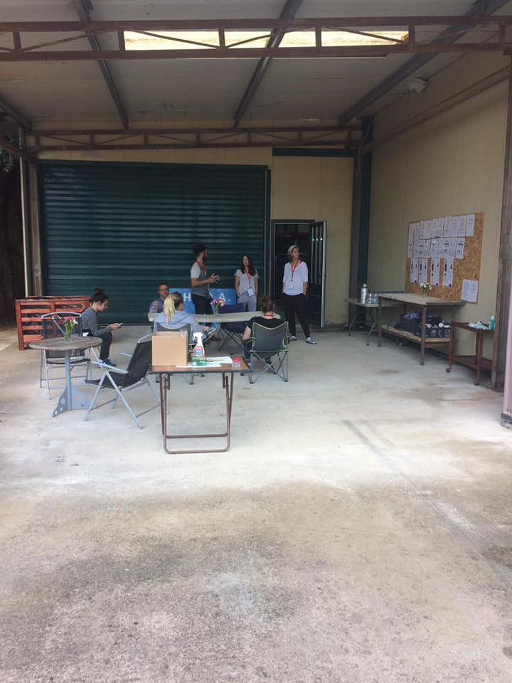

### AYS Daily Digest 6/7/20: Another dangerous precedent for the treatment of Syrians by the EU
#### On the importance of identifying and cataloguing the bodies of those who drown in the Mediterranean / Updates from Chios / Report on the Balkans / News from Ventimiglia after months of lockdown and social distancing / five years past the peak of Europe’s migration crisis, fixing its broken common asylum system is no longer a top priority of the EU / & more news

](assets/74b934763ee7/0*313zGoUDNnxC3uDr)

Photo: [Sea\-Watch International](https://twitter.com/seawatch_intl)
#### FEATURED

There has been severe criticism from human rights campaigners after Denmark officially said they are considering sending Syrian refugees home, deeming areas under the regime of President Bashar Al\-Assad in Damascus safe\. 
They point out that, obviously, no area of Syria is currently safe to return to\.

■■■■■■■■■■■■■■ 
> **[Emma Beals](https://twitter.com/ejbeals) @ Twitter Says:** 

> > The Danish decision to say Damascus was safe was wrong when it was made and remains wrong. Even worse, it has given a crack in the door to other countries to follow suit. Rather than reconsidering individual cases, they should reconsider their own policy. 

> **Tweeted at [2020-06-29 08:17:00](https://twitter.com/ejbeals/status/1277516405030690816?ref_src=twsrc%5Etfw%7Ctwcamp%5Etweetembed%7Ctwterm%5E1277516405030690816%7Ctwgr%5E&ref_url=https%3A%2F%2Fwww.middleeastmonitor.com%2F20200706-denmark-may-return-syria-refugees-as-damascus-area-deemed-safe%2F).** 

■■■■■■■■■■■■■■ 

> To the cry of “dogs”, “fags” and “sons of the great bitch”\. This is how the members of the Red Cross have evicted the six Algerians who were sheltered and quarantined in a house in the Los Nietos neighborhood of the municipality of Cartagena, Spain\. 

Several of these people, arrived in boats last weekend, tested positive for coronavirus and many others were placed in preventive isolation in various centers owned by the humanitarian institution pending the decision of the competent authorities on their custody\.

Hundreds of residents then protested the decision, [alleging](https://www.publico.es/sociedad/migrantes-cuarentena-insultos.html?fbclid=IwAR3nWCJs4VFUv9D-BEUhC3lVzf2UmSVbFw1jdEBJeENMC1vXAy3v4Izn9Bw) that it was not a matter of “racism”, but of “fear of contagion”\. Many of them argued that the authorities had not informed them of what had happened and that the transfers were made at dawn\. These kinds of racist and segregational outbursts have unfortunately become part of the “new normal” which has been so much talked about lately\. Any citizens’ actions and reactions are more and more being criminalized, while public criticism and demands for change in rhetoric and policies are missing across the EU\.

Last month, the European Commission announced it would postpone the release of its draft proposal for a new EU Asylum and Migration Pact — initially scheduled for Easter — until after European leaders finish negotiating the bloc’s next long\-term budget later this summer\. At first glance, this delay might look like a reasonable adjustment of priorities, placing public health and the economic challenges of COVID\-19 ahead of a migration crisis diminished over the years\. Beneath the surface, however, it reflects not an adjustment of priorities, but rather an admission: five years past the peak of Europe’s migration crisis, fixing its broken common asylum system is no longer a top priority of the EU, as we have seen during the Croatian presidency which finished a week ago when their German counterparts “took over the border stone”, as one of the Croatian officials wrote on his social media\.

As Jeff Crisp notes, there is mounting evidence to suggest that governments have a declining commitment to the notion that victims of persecution and armed conflict should be able to find refuge beyond the border of their own country\.

■■■■■■■■■■■■■■ 
> **[Lorenzo D'Agostino](https://twitter.com/lorenzodago) @ Twitter Says:** 

> > The shameful story of a continent that pretends to care about #BlackLivesMattters, but leaves 52 survivors of the Libyan war stranded for days on an animal cargo ship, in my latest for @[AJENews](https://twitter.com/AJENews). 

@[MaltaGov](https://twitter.com/MaltaGov) @[Governo_Italia](https://twitter.com/Governo_Italia) @[seawatch_intl](https://twitter.com/seawatch_intl) @[alarm_phone](https://twitter.com/alarm_phone)

[aljazeera.com/news/2020/07/i…](https://www.aljazeera.com/news/2020/07/italy-malta-reject-52-migrants-stranded-animal-cargo-ship-200706073633394.html) 

> **Tweeted at [2020-07-06 10:24:52](https://twitter.com/lorenzodago/status/1280085296575438848?s=20).** 

■■■■■■■■■■■■■■ 

#### TUNISIA

Forensic scientists in Tunisia have emphasized the importance of identifying and cataloguing the bodies of those who drown in the Mediterranean, in case any of their relatives come looking for them in the future\. Yet dozens who drowned off Tunisia last month will likely remain unidentified, InfoMigrants reports\.
They claim, citing AFP \(official sources that we usually tend to question and check, but this time we have no alternative sources\), that since 2017, the Tunisian authorities have been making sure, via a team of forensic scientists, that they carefully identify and catalogue each of the bodies they recover of migrants who drown in the Mediterranean\. Read more here:

This snapshot explores the impact that COVID\-19 and the measures to prevent its spread have had on refugees’ and migrants’ employment and livelihood opportunities\. It aims to inform the work of humanitarian and development actors assisting affected refugees and migrants\. This snapshot is based on 1,172 surveys and 12 key informant interviews with refugees and migrants in Tunisia conducted between April 6th and June 15th, 2020\. Respondents were surveyed in 15 cities across the country\.

#### GREECE

The ongoing restrictions are creating more complications and worries for the volunteers on the Greek islands\.

About 150 people have been kicked out of Vial \(most of whom have status\) \. They are technically not allowed out of the camp, but the restrictions have been fairly relaxed in practice for them to not feel completely confined\. 
There are tensions among the locals, who are very angry\. According to the local volunteers, “some have thrown rubbish on a road near Vial in what seemed to be an unorganized movement by some locals”\. The situation with waste disposal in Vial is dire, but no NGOs can go in and there has reportedly never been any will on behalf of the municipality to do anything about it\. The \(technical\) water still shuts off reportedly about 5pm each day, since UNHCR stepped in a few months ago and now provide 40,000 litres per day\. Regarding drinking water, people only get 2 litres a day, and sometimes in a family they will get even less per person\. Needless to say, the 2 litres is less than enough in this heat\.

![The OA Distribution Warehouse, last Monday, after months of hard work behind the scenes by our small team on the ground here, with so many challenges outside of our control to deal with, we’ve managed to create something that’s really needed on this island\. It is a massive undertaking, to serve the over 5000 asylum seekers & refugees on Chios island\. Normally men’s, women’s and children’s distributions are done by teams working outside the camp\. Unfortunately, at present we are the only NGO on Chios, that can mass distribute clothes to the people in Vial camp, due to COVID\-19 restrictions around the camp\.](assets/74b934763ee7/1*MJIZsgDhPDXYk5wACV5HYQ.jpeg)

The OA Distribution Warehouse, last Monday, after months of hard work behind the scenes by our small team on the ground here, with so many challenges outside of our control to deal with, we’ve managed to create something that’s really needed on this island\. It is a massive undertaking, to serve the over 5000 asylum seekers & refugees on Chios island\. Normally men’s, women’s and children’s distributions are done by teams working outside the camp\. Unfortunately, at present we are the only NGO on Chios, that can mass distribute clothes to the people in Vial camp, due to COVID\-19 restrictions around the camp\.

> The situation for the people here is nothing less than deplorable, I cannot even begin to describe it, I wouldn’t wish this life on anyone… clothes & hygiene products will not change the situation, but they will give the people one less thing to worry about\. The OA really needs your support to continue to provide choice, quality and consistent NFIs to support the people in these unforseen and unpredictable times\. It is a testament to the team and all of our supporters that the shop is up & running and while we are tweaking things here and there, we assure our beneficiaries fairness and quality items\. 

You can donate to them [here\.](https://www.facebook.com/donate/702675327191474/?fundraiser_source=external_url)
#### BALKAN ROUTE

Refugee Rights Europe has published a report on the Balkan route:

#### ITALY/FRANCE
### Ventimiglia after months of lockdown and social distancing

Melting pot is [reporting](https://www.meltingpot.org/Ventimiglia-ovvero-il-paradosso-della-frontiera-25369.html#.XwQ9UigzY2w) from the Italian\-French border after the lockdown:

> Migration flows during the Covid\-19 pandemic also stopped, and started again as soon as some freedom of movement was regained\. With one difference: the regularization desired and so publicized by this government is pushing those who have already arrived in France, but have not yet managed to obtain a residence permit, to cross the border in the opposite direction, towards Italy\. They go all the way south, looking for a job that allows them to obtain the coveted documents\. Many, however, realize within a few days how unlikely they are to meet the criteria, and try, in a tight circle, to return to France where they may have left a job, albeit in the dark\. They are obviously rejected and risk being stuck in the Riviera town\. 

> In the meantime, the “ _usual_ “ flow from Italy to France has also resumed , another country of passage rather than final destination, which is almost always Northern Europe\. 

> Rejections are therefore double now, and from both borders\. The incoming flows are increasing again, most of them from the Balkan route, the rest from landings in southern Italy or from pushbacks from other European countries\. 

> If rejections were running at a rate of one hundred a day last fall, during the whole quarantine period, between March and April, there were only 107 rejections, while now there are about fifty more a day\. 

> Solidarity projects from below such as the “ [**20k Project**](https://www.facebook.com/progetto20k/) “ have been temporarily blocked by the pandemic and the consequent lack of funds and time\. Even the Kesha Niya international solidarity group \(which you can follow [**here**](https://www.facebook.com/KeshaNiyaProject/) \), which for years have been dealing with the distribution of evening meals, had to stop for a period, starting again in June to distribute individually packaged meals around the city, so as to intercept the migrants who sleep along the banks of the river, at the station, or along the dead tracks that go up the valley towards Roverino and the Campo della CRI\. 

#### FINLAND
### 25 unaccompanied children to arrive soon

The very slow process of relocating the unaccompanied minors from the squalid Greek camps to other EU countries is continuing after lockdown measures weakened in most of the countries\. The first 25 children are to arrive \(finally\) in Finland in the coming days \(weeks?\! \), the media have been [reporting](https://yle.fi/uutiset/osasto/news/first_kids_set_to_arrive_in_finland_from_mediterranean_refugee_camps/11434703?fbclid=IwAR0olo-vs1FXG1HwwwNLqikBo8m2uA2mWvt103SgtIYZ_mPnyaeVRZugDTs) for a while now\. However, things seem to be moving and more concrete information is now available\.

“Because of the coronavirus epidemic, asylum seekers will initially have to spend two weeks in quarantine in Espoo\. After that, they will be placed in reception centres especially for underaged children,” senior officer Mikko Välisalo of Migri’s reception centre unit said\.

The children are likely to be placed in special reception centres in Oulu, Vörå \(Vöyri in Finnish\), Hämeenkyrö, Turku, Espoo and Kotka\. The exact locations, however, will be decided during the course of the placement process\.
#### SWEDEN

Migration policy is again at the center of Swedish politics with a crisis and some decisions that might turn out decisive for the future of immigration in Sweden\. The divisive topic in the ruling coalition is the asylum law\. As it takes the next step in Sweden’s tightening stance towards asylum seekers, stricter time limits on the right to remain and greater restrictions on family reunification are some of the forseen measures in that scenario\. While the social democrats cautiously support that direction, the Greens are against it and have threatened to quit the government if the debate goes against them\. Read more on the subject in Politico’s a [nalysis\.](https://www.politico.com/news/2020/07/05/government-divisions-add-to-corona-ravaged-swedens-woes-349650?fbclid=IwAR0dUfahq38Z8qmb6TYKcgls78zOoflMfdJq0t3evoMCqDg-47d2oc-nBXM)
#### NORWAY
### The country will prioritize refugees who are lesbian, gay, bisexual and transgender

“In nearly 70 countries, homosexuality is a criminal offense and those who violate gender and sexuality norms may be subject to persecution and discrimination in their home country\. This can give the right to protection in Norway\. We are now changing the guidelines for the work of transfer refugees so that persons who are divorced should be given priority,” the State Secretary for Integration Affairs in the Ministry of Education [said](http://www.against-inhumanity.org/2020/07/02/the-end-of-asylum/) in a press statement\.

The Norwegian scheme is three\-year and flexible, which means that if fewer refugees are taken in one year within this period, they can be taken several years after\.
#### FOR FURTHER READING

The coronavirus pandemic has exacerbated inequalities, highlighting the importance of often invisible frontline workers in Italy\. Caporalato has been compared to modern\-day slavery, as it is set up in such a way that intermediaries between the worker and the employer siphon off a large part of their meager wages\.

Jeff Crisp writes about the the current outlook for refugee protection that has arguably never been bleaker, please take time to read his piece:

**Find daily updates and special reports on our [Medium page](https://medium.com/are-you-syrious) \.**

**If you wish to contribute, either by writing a report or a story, or by joining the info gathering team, please let us know\.**

**We strive to echo correct news from the ground through collaboration and fairness\. Every effort has been made to credit organisations and individuals with regard to the supply of information, video, and photo material \(in cases where the source wanted to be accredited\) \. Please notify us regarding corrections\.**

**If there’s anything you want to share or comment, contact us through Facebook, Twitter or write to: areyousyrious@gmail\.com**

_Converted [Medium Post](https://medium.com/are-you-syrious/ays-daily-digest-6-7-20-another-dangerous-precedent-for-the-treatment-of-syrians-by-the-eu-74b934763ee7) by [ZMediumToMarkdown](https://github.com/ZhgChgLi/ZMediumToMarkdown)._
