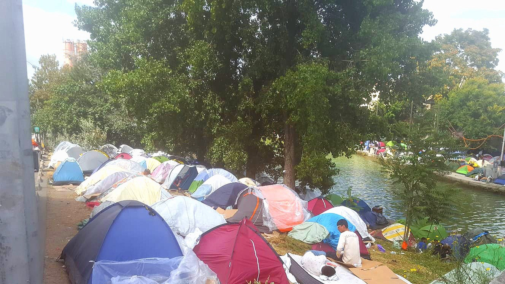
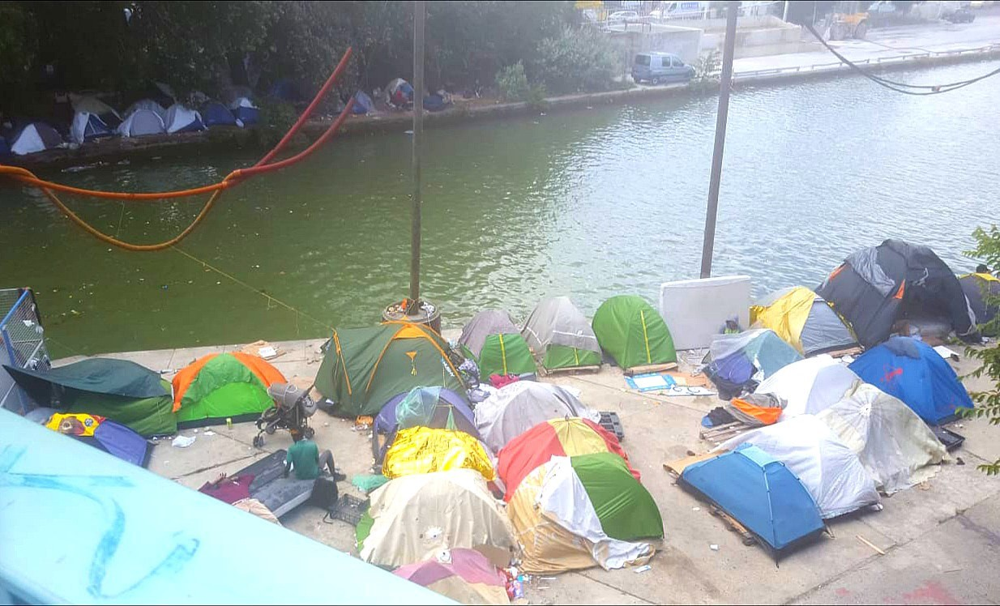

### AYS Daily Digest 7/7/20: Black Lives on the move systematically left to die
#### On the situation at the Mediterranean — report by Alarm Phone / updates from Greece / Family reunification again in Germany / Finland’s government decides to give up on their original plans to control people / & more news

](assets/e39a84bd1785/1*eT1lV_uX_OgbOTSeziE0fg.jpeg)

Paris\- Photo: [Danika Jurisic](https://www.facebook.com/profile.php?id=100009499466124&__tn__=%2CdCH-R-R&eid=ARCwhJ6Hv_tF4PJy9AEj5J3dkMhKDs86Qu97oUnon813Cuiz3pfLHK6Aedfde4W2rA7vjTD24Z_E8iCp&hc_ref=ARSlIei53ZAWDPCjpoYf5FbULGE_SPHXrcmxk2Bi_81NrlaPir5BskJWOyCIeXGI10I&fref=nf&hc_location=group)
#### FEATURED

**Europe has tried to invisibilise the dramatic effects of its letting\-die policies, actively turning the Mediterranean into a black hole where Black Lives on the move are systematically left to die\.**

> The Central Mediterranean Sea has continued to be a zone of violence, human rights abuses, disappearances and deaths, as well as a stage of struggles for freedom of movement 

In their latest report, the AlarmPhone team reports how the European authorities have reinforced its repressive border control industry through EU air surveillance, by engaging merchant vessels or [ghost fleets](https://alarmphone.org/en/2020/04/24/malta-the-ghost-fleet-against-migrants-frontex-blames-the-countries/?post_type_release_type=post) in illegal push\-backs, and by providing money and resources to strengthen the illegal operations of the so\-called Libyan coastguards\.

Unfortunately, thousands are being left on their own, trying to reach the Old Continent, but many have failed because they were pushed back\. Many have experienced tragic accidents at sea or have been unable to communicate their GPS location at sea to one of the SAR teams\. However, thanks to the tireless efforts of the Civil Fleet — Sea Watch 3, Moonbird, Open Arms, Mare Jonio, Aita Mari and Ocean Viking — about 3,350 people have reached Europe in 2020 so far\. This year, Alarm Phone has supported 77 boats in distress in the Central Mediterranean Sea, carrying about 4,500 people, they reported\.

> Over recent months, the EU has further improved its cynical ways of enforcing borders through modes of selective visibility and presence\. 

> In the contested Libyan Search and Rescue \(SAR\) zone, EU aerial assets have facilitated the interception and capture of thousands of migrants [back to the Libyan](https://www.eu-libya.info/) warzone\. Systematic violations of SAR obligations and human rights occur also within EU SAR zones, where European aerial assets have watched people drown and die of hunger and thirst from above, instead of organising their rescue, _the report states\._ 

The team reports that it is only thanks to the survivors who have bravely chosen to speak up and testify that they managed to gain glimpses into the crimes that EU institutions and member states perpetrate at Europe’s external borders\.

Find the details on the reports and testimonies in the [**Alarm Phone Central Mediterranean Regional Analysis, 1 January — 30 June 2020**](https://alarmphone.org/en/2020/07/06/also-in-the-central-mediterranean-sea-black-lives-matter/?fbclid=IwAR2HdHLo3IuEBztwm2Q1MNuBLgsyznXajDJNZrc9dwhftOrW_sDtiwD0S4Y)

The absence of EU assets and NGO rescuers has not prevented people from trying to escape the Libyan warzone\. During the week of June 29 to July 6, 299 migrants were intercepted at sea and returned to Libya\.
#### SEA

■■■■■■■■■■■■■■ 
> **[Sea-Watch International](https://twitter.com/seawatch_intl) @ Twitter Says:** 

> > "Being here as #feminist and activist against #racism is part of the same commitment for #equality." - @[ClaireChahnez](https://twitter.com/ClaireChahnez), feminist, activist and guest coordinator on board the #SeaWatch3 https://t.co/ne14DCWEyz 

> **Tweeted at [2020-07-07 12:28:37](https://twitter.com/seawatch_intl/status/1280478826720628736).** 

■■■■■■■■■■■■■■ 

200 people rescued by a humanitarian aid boat in the Mediterranean Sea began to leave the vessel in Sicily late on Monday after spending nine days on the ship\.

■■■■■■■■■■■■■■ 
> **[SOS MEDITERRANEE](https://twitter.com/SOSMedIntl) @ Twitter Says:** 

> > UPDATE The disembarkation of 180 survivors who remained on #OceanViking for up to 11 days waiting to reach safety ended at 3:15am today.

They were walked to passenger ferry Moby Zazà to reportedly start a quarantine. Media report all survivors' COVID-19 tests were negative. https://t.co/134PIT37KQ 

> **Tweeted at [2020-07-07 12:23:41](https://twitter.com/sosmedintl/status/1280477588788596742).** 

■■■■■■■■■■■■■■ 

#### LIBYA
### Local aid and rights associations have called for the closure of migration detention centers

“The failure to move detainees from the vicinity of a potential military objective or move military objects that were positioned next to the detention center, likely amounting to a violation of the obligation under international law to take all feasible measures to protect civilians under their control from the effects of potential attacks\.”
#### TURKEY

A Turkish registered tanker was stopped in Izmir by the Turkish coast guard\. Onboard, they found 276 refugees, 59 children, 46 women and 171 men; 8 smugglers were also arrested\.

A video released shows people crammed into the ship’s tanks with poor ventilation: some of the refugees arrested were having problems breathing\. This could easily have ended up in a major disaster, if not stopped in time, [Aegean Boat Report](https://www.facebook.com/AegeanBoatReport/?__tn__=%2CdkCH-R-R&eid=ARCIRUYBJh11cVLfVvVaziIZDIqGvjUgSuwG5SqafgOyfkzqL9sl4ySzyAaGbw-3tly3L7mozwFPReJc&hc_ref=ARSqd5Bewq0-KWZIQuJDG-AOXfTLXOc2dLyTfoYDG2ba9HW5WHXMpAlebetBjbIIrCM&fref=nf&hc_location=group) wrote\.

](assets/e39a84bd1785/1*n7f-YU5ITyYAaz80CQQ54A.jpeg)

Photo: [Aegean Boat Report](https://www.facebook.com/AegeanBoatReport/?__tn__=%2CdkCH-R-R&eid=ARCIRUYBJh11cVLfVvVaziIZDIqGvjUgSuwG5SqafgOyfkzqL9sl4ySzyAaGbw-3tly3L7mozwFPReJc&hc_ref=ARSqd5Bewq0-KWZIQuJDG-AOXfTLXOc2dLyTfoYDG2ba9HW5WHXMpAlebetBjbIIrCM&fref=nf&hc_location=group)

A DW investigation has uncovered information about masked men attacking the boats of migrants trying to reach Greece that may link them to the Greek Coast Guard\.

EU interior ministers are scheduled to hold an informal meeting today to discuss the situation surrounding sea rescue in the Mediterranean Sea\. Following a short respite due to corona\-related restrictions, the number of people trying to get to the European Union via the Mediterranean has grown steadily, according to the European border agency, Frontex\. And again, migrants are drowning due to the lack of rescue services\. One region under the spotlight is in the Aegean Sea, between Turkey and Greece\. Many people have reported being attacked in European waters\.
#### GREECE

](assets/e39a84bd1785/1*DCQ0zYBX-qgpvJvFoUV4nA.jpeg)

[Aegean Boat Report](https://www.facebook.com/AegeanBoatReport/?tn-str=k%2AF&hc_location=group_dialog)

After a short period of suspension of the activity of Certification of Torture Victims, METAdrasi announces its resumption from 1/7/2020\.

Information on the referral procedure and the operation of the programme at the email vot@metadrasi\.org and at the telephone numbers \( \+30\) 690 809 1509 and \( \+30\) 214 1008 700 \(ext\. 337\) \.

COVID\-19 restrictions have eased across the Greek islands but we are still alert to the threat the virus poses to both the hosted and hosting community on Lesvos\.

In response, we have procured 2,500 masks for the local hospital of Mytilini\. We hope these masks will serve both hospital workers and patients as a protective and preventative measure\.
#### MONTENEGRO

NNK team reports on the rising issue with many people, that of the mental health:

> Yesterday, the NNK volunteer in Montenegro told us about the case of a person he’s known who, by diagnosis, needs psychiatric help\. However, the man is already in the process of asylum and the assisting lawyer has advised him not to receive it, as that could be negative when it comes to receiving the refugee protection he has requested\. 

> What world have we created in which not only do we not give importance to the mental well\-being of people, but also forces themselves to hide their traumas? 

> For now, in this case we will not be able to give support, but if you want to be part of the No Name Kitchen health project you can contact our partner Valentina in the mail info@nonamekitchen\.org\. She can tell you about the cases that are pending and that need medical support so you can give him financial support\. 

#### EU

■■■■■■■■■■■■■■ 
> **[Erik Marquardt](https://twitter.com/ErikMarquardt) @ Twitter Says:** 

> > IM #Seehofer hat sich vollkommen verplappert und behauptet, Rückführungen nach Libyen seien legal. Beeindruckend schmerzbefreit, wie das @[BMI_Bund](https://twitter.com/BMI_Bund) hier Rückführungen nach Libyen „mit Unterstützung der Küstenwache“ zugibt, obwohl die höchstrichterlich verboten sind.
#HomeAffairs https://t.co/l4F3r6Ic7i 

> **Tweeted at [2020-07-07 15:17:07](https://twitter.com/erikmarquardt/status/1280521233805737984).** 

■■■■■■■■■■■■■■ 

#### MALTA
### “Everyday people already struggling are made to stand, or as most do, sit on the floor come scorching sun, wind, cold or rain”

Like in many other countries and places, due to the limit on the number of people who can be physically present in the waiting room at any given time, in Malta, those who hope to solve their issues regarding their status now wait long hours in less than favourable conditions\.

The applicants for international protection are only being seen by appointment, as it was confirmed by the authorities, but many still show up without one\.

The Home Affairs Ministry is reportedly making plans to convert the Office of the Refugee Commissioner into a Government Agency and will be moving the said office to a larger premises later on this year, the local media [said\.](https://lovinmalta.com/news/migrants-forced-to-wait-under-scorching-sun-as-queues-form-outside-maltas-overburdened-refugee-commissioners-office/?fbclid=IwAR30s3umLvp_XTJCoLoTjwWKV-vgV6j6HdwOC94ieOlLeFup8AZJcd_PDZc)

■■■■■■■■■■■■■■ 
> **[Lorenzo D'Agostino](https://twitter.com/lorenzodago) @ Twitter Says:** 

> > #breaking Malta has allowed the disembarkment of the #Talia52, stranded since Friday on an animal cargo ship, the captain of the #Talia tells me. Great #news! 

> **Tweeted at [2020-07-07 20:38:32](https://twitter.com/lorenzodago/status/1280602120031477761).** 

■■■■■■■■■■■■■■ 

#### PORTUGAL

25 unaccompanied migrant children are traveling from Athens to Portugal, where they will be given shelter as part of a relocation program worked out among several European Union countries, the Greek officials confirmed\.
#### GERMANY
### 161 cities and municipalities in Germany want to welcome more refugees

Activists say that more and more mayors across the EU are opposing the ruling politics regarding the welcome of refugees across the continent\.
### Family reunification available once again

Family reunification is now possible again — but during the coronavirus pandemic, restrictions have expired on many visas\. There are now options to apply for a “new sighting” within a one\-month period\. It is important that those affected notice this, Pro Asyl warns\.

#### FRANCE

Local activists report from the streets of Paris:

> The camp is getting bigger by day\. It is exploding\. So many new people came to Paris, and some old one that gave left their temporary shelter during confinement\. Tents are now spreading on both sides of the canal , covering almost a kilometer in length\. People are asking for jackets\! because of the constant shifts in temperature and moody weather\. Days are hot, and nights are cold\. Many of them are with cold\. I won’t even start on skin disease\.
 

> Food distributions are irregular and often insufficient\. Many of them are forced to walk for miles around Paris just to find a meal, some distributions of Restos du cour or some other association\. 

> The atmosphere on the camp is bad\. People are desperate, edgy, afraid … they are trying to improvise in any way possible to tend to their daily needs: toilet, food, water, shelter… Every day is a challenge\. There is a lot of tension on the camp fuelled by uncertainty and previous bad experiences\. Many of them came from Calais, escaping the violence\.
 

> The needs on the camp are enormous an we are trying to address the most urgent ones\. — find more on [Danika Jurisic](https://www.facebook.com/profile.php?id=100009499466124&__tn__=%2CdCH-R-R&eid=ARCwhJ6Hv_tF4PJy9AEj5J3dkMhKDs86Qu97oUnon813Cuiz3pfLHK6Aedfde4W2rA7vjTD24Z_E8iCp&hc_ref=ARSlIei53ZAWDPCjpoYf5FbULGE_SPHXrcmxk2Bi_81NrlaPir5BskJWOyCIeXGI10I&fref=nf&hc_location=group) ’s profile\. 

#### FINLAND

Finland will not move forward with its plan to oblige unsuccessful asylum seekers to wear ankle monitors, their Minister of Interior stated\.

> A process will be initiated to amend the aliens act to lay down provisions on “technical monitoring” of people whose asylum applications have been denied\. The measure, the government said, would be a less restrictive and more appropriate alternative to detention and the residence obligation, _it is r [eported\.](https://www.helsinkitimes.fi/finland/finland-news/domestic/17837-ohisalo-finland-drops-plan-to-adopt-ankle-monitors-to-unsuccessful-asylum-seekers.html?fbclid=IwAR0w9mgeMWD0sx1HdHrKvTt1L-3lMB__Z5Hf06QPJvp_7EFNRviaAgNoKMQ)_ 

#### UK

More migrants than ever before crossed the English Channel by boat in the first half of this year — despite British\-French agreements that are designed to prevent this\. As populist agitators and concerned patriots drum up for more isolation, the British Home Office has started to implement a plan to send boat refugees back to France\.

#### FOR FURTHER READING

A photo essay on a fragmented European border strategy\.

Thematic Focus: ICTs & Other Technologies from the Forced Migration Current Awareness site

**If you wish to contribute, either by writing a report or a story, or by joining the info gathering team, please let us know\.**

**We strive to echo correct news from the ground through collaboration and fairness\. Every effort has been made to credit organisations and individuals with regard to the supply of information, video, and photo material \(in cases where the source wanted to be accredited\) \. Please notify us regarding corrections\.**

**If there’s anything you want to share or comment, contact us through Facebook, Twitter or write to: areyousyrious@gmail\.com**

_Converted [Medium Post](https://medium.com/are-you-syrious/ays-daily-digest-7-7-20-black-lives-on-the-move-systematically-left-to-die-e39a84bd1785) by [ZMediumToMarkdown](https://github.com/ZhgChgLi/ZMediumToMarkdown)._
