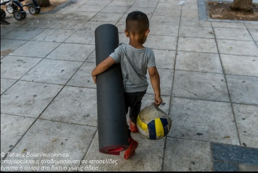

### AYS DAILY DIGEST 09/07/2020: Protests in Greece against New Demonstration Law
#### First aid trainings in Moria // Report on discriminatory practices by Blue Star Ferries // News from the Sea // Von der Leyens reaction to investigation into March shooting at Turkish\-Greek border

young boy at Victoria Square in Athens
### FEATURE: NEW DEMONSTRATION LAW IN GREECE

On Thursday, thousands of people demonstrated in Athens against a new law that has been submitted to the parliament\. The law aims to expand police power over demonstrations\.

> “It stipulates that protesters apply to the police for a license to demonstrate\. Groups must do so via an assigned organiser who will be financially liable for any damage to property or obstruction of economic life deemed to have been caused by the protest\.”
 

> \(see article below\) 

The demonstrations that were held on Thursday proved the new bill’s inadequacy and the people’s will to oppose it: some 10,000 people gathered to show their disapproval\. Clashes between demonstrators and police occurred\. Greece sees big demonstrations on a regular base, especially since police violence, mainly against refugees, is high\. The bill is especially inadequate since many of these protests are held spontaneously and without clear organizing structures\. At the same time, there have been reports of an increase of police violence, especially during Corona\-lockdown\.

Ioanna Manoussaki\-Adamopoulou, a PhD candidate at University College London researching refugee rights in Greece, spoke about the

> “increase in records of police stripping of citizens during stop and search operations, and worryingly, taking them into spaces without cameras and beating them up\. These are all the practices that remind us of non\-democratic dictatorial governments\. Such practices have reappeared with ferocity, and with a kind of discourse of Junta\-like police powers\.” 

For more information, see:

### GREECE

Meanwhile protests in Kos Detention Center continued\. According to the Athens legal support team, the riot police entered the detention centre on Wednesday in an attempt to violently suppress those protesting their conditions\. The police searched everyone for phones and broke those with cameras they found\.

Ruhi Loren Akhtar, a humanitarian activist, shared notes of her disturbing experiences of traveling with Blue Star Ferries, the ferry that connects the Aegean islands with Athens on June 18th\.

She explains in great detail the discriminatory measures that are taken against refugees and people of colour that use that ferry, while Greeks and white people enjoy extra comfort\.

Akhtar reports that people are segregated from the beginning of the process\. The line of assumed refugees is forced to wait while, while those who are deemed to be Greek or tourists are allowed to pass\. Refugees are not allowed to use the elevator\. They are directed to the open deck and are not allowed inside despite having the same ticket as the others\.

We want to support and emphasize Akhtar’s call to Blue Star Ferries:

> “\* \*I would like to ask Blue Star Ferries is this a policy from your directors or is this a policy made by the team leading staff of that journey, or is this a governmental policy? What is your justification for segregating refugees/people of colour and Greeks/white people even during corona virus pandemic\. \* \* 

> \* \*Are human beings really so different?\* \*” 

For the full report, see Ruhi Loren Akhtar on Facebook\.

The criminalization of NGOs continues:

■■■■■■■■■■■■■■ 
> **[Lena K.](https://twitter.com/lk2015r) @ Twitter Says:** 

> > GR govt MP Bogdanos has asked social media users to inform him when NGOs post the positions of GR HCG &amp; Navy vessels. This happens when boats trying to cross are in distress and in need of #SAR. Yet another example of how the govt tries to prevent #SAR and criminalise NGOs. 

> **Tweeted at [2020-07-09 07:31:51](https://twitter.com/lk2015r/status/1281128921258438657).** 

■■■■■■■■■■■■■■ 

Moria Corona Awareness Team and Moria White Helmets, together with Stichting Bootvluchteling, will set up a **first aid training for Moria residents\.** The aim is to eventually have one trained first\-responder for every 100 people living in the camp\.

Stichting Bootvluchteling explained:

> “The training covers a variety of topics that people can face in Moria: from carbon monoxide intoxication to heat strokes, snake bites, fractures, burns and recognition of stroke\. Due to the magnitude and difficult accessibility of the camp, it can take a long time for rescuers or the ambulance to reach emergencies\. That is why first aid knowledge and skills among Moria residents are extremely important\.” 

Moria Corona Awarness Team posted a beautiful statement by a resident of Moria:

> “As an immigrant, I believe that do your little bit of good where you are; it’s those little bits of good put together that overwhelm the world\. … We may have different religions, different languages, different colored skin, but we all belong to one human race\. We all share the same basic values\. 

> This country will not be a good place for any of us to live in unless we make it a good place for all of us to live in\. 

> We have to do the best we are capable of\. This is our sacred human responsibility\.” 

A petition has been started by Greeks to call on the government to to cut all ties with the war criminal Bashar al\-Assad, whose crimes against humanity have caused millions of families to flee Syria\. The petition explains:

> “Syria will never be free under a man who drops chemical weapons on his own people, and who locks up anybody who opposes him and throws away the key\.” 

Greece has appointed a Special Envoy for Syria, which can be seen as a first step towards normalizing relations with Syria\. In 2012, European countries withdraw their diplomatic missions from Syria\.

Find the petition here:

### CROATIA

A new testimony of violent treatment of a young refugee by the Croatian police have been collected by No Name Kitchen:

> “When the police chased me, I ran away, I was seriously injured, and the police reached the ambulance\. I went to a hospital, they sewed my wound and gave the police a paper\. \[…\] They took us to the border with some people when we arrived and we found a special police carrying sticks\.” 

According to the testimony, the injured boy himself was not beaten, but others of the same group were \. Nevertheless he had to walk with the wound for a long distance, which caused the wound to become infected\.
### HUNGARY

Four migrant men have been sentenced to a year\-long imprisonment in Hungary for entering the country illegally after tearing down a border fence\. After serving their sentence, they will be deported, with a two\-year ban on entering the country\. Hungarian policies make it close to impossible for people to cross into the EU and to apply for asylum, a right that is guaranteed under international standards\. After closing the detention centers following the Court of Justice of the European Union’s verdict in May, Hungary announced that it will implement a system that only allows applying for asylum from diplomatic missions outside of the country\. 
This video from the Hungarian Helsinki Committee provides a good insight into the situation\.

For more information, see:

### SEA

Using the supposed lack of safety of rescued people on board as a justification, Italian Coast Guard authorities blocked the Sea Watch 3 ship once again from starting a new mission\.

■■■■■■■■■■■■■■ 
> **[Sea-Watch International](https://twitter.com/seawatch_intl) @ Twitter Says:** 

> > Since last night, the #SeaWatch3 is under administrative block. Publishing a press release took the Italian Coast Guard 3 min after their visit, a responsiveness they clearly lack when it comes to distress cases - showing once again the political agenda behind this blockade. https://t.co/WszemmGhCb 

> **Tweeted at [2020-07-09 11:23:29](https://twitter.com/seawatch_intl/status/1281187214261719040).** 

■■■■■■■■■■■■■■ 

The irony in this is to bitter to actually laugh about: It is the same authority that remains inactive until people drown or are deported back to Libya\.

At the time of this writing, Alarm Phone and Moonbird were aware of two boats in the Mediterranean, one of them — a rubber dinghy with some 25 people on it — in distress within the Maltese Search and Rescue Zone\. The other is a wooden boat with at least 250 people on board\. All authorities have been alerted\. Every person who dies will be due to the inaction of European authorities\.

■■■■■■■■■■■■■■ 
> **[Sea-Watch International](https://twitter.com/seawatch_intl) @ Twitter Says:** 

> > 🔴 #Moonbird spotted a boat with approx. 250 people on the upper deck only and we expect more people inside.
Our crew has alerted all authorities and requested the immediate launch of a rescue operation: boats like this one are at extreme risk of capsizing. https://t.co/KLsJxDnSIC 

> **Tweeted at [2020-07-09 14:37:23](https://twitter.com/seawatch_intl/status/1281236008743337984).** 

■■■■■■■■■■■■■■ 

### LIBYA

A new study published by the German NGOs medico international and Brot für die Welt sharply criticizes the IOM emergency returns from Libya and Niger and the way the EU funds and supports activities in third countries in order to prevent people from fleeing to Europe\. Often these activities are labelled as development activities and themselves violate human rights\.

> “As one example, in 2015 the EU created the Emergency Trust Fund for Africa \(EUTF\), originally meant to pri\-marily address root causes of irregular migration and dis\-placement in Africa\. Besides funding classic development projects in countries of origin of migrants and refugees, and contrary to one of its originally stated objectives to also support the establishment of regular migration path\-ways, the vast majority of the EUTF migration projects ended up being aimed at controlling and preventing migration within and out of the African continent\. In this framework and operating together with the International Organization for Migration \(IOM\), in 2016 the EU started funding the “voluntary return” and reintegration of migrants within Africa\. \[ \. \. \] At the same time, European member states stopped their official sea rescue operations and the deployment of ships near Libyan territorial waters\. Some member states even launched a campaign against civilian search and rescue organizations\. After the US\-American television station CNN aired pictures of slave\-like conditions in Libyan refugee camps at the end of 2017, some of the captured refugees and migrants were evacuated from Libya\. They were not brought to Europe, however, but to their countries of origin and transit where in many cases the causes of flight continue to exist and where the return of refugees is likely to lead to new conflicts\. At the same time, EU money continued to flow to the Libyan coast guard, even though the latter was demonstrably involved in human rights violations against migrants\.” 

For the full report, see:

\(German and English version available\)
### GERMANY

A young Afghan man named Waheed P\. has been deported from Germany after having been trapped by authorities\. He went to an appointment on March 11th on Return Counselling; had he skipped the appointment, he would have get his remunerations cut\. But Waheed P\. never returned from this meeting\. Instead, he was placed on a deportation plane to Kabul the next day\. According to a newspaper, in the interview before the deportation he stated that he had no contact with his family in Afghanistan\. Since December 2016, more than 900 men have been deported back to Afghanistan\.

For more information \(in German\), see [here](https://www.neues-deutschland.de/artikel/1138849.abschiebung-in-die-falle-gelockt.html?fbclid=IwAR0fhNQB15BQ7P1d1R91GWorCDGaTga_3bjTv_suFBXg8R6AtHPZtNqyjEs) \.
### FRANCE

In France, the coronavirus emergency is being used to limit people on the move’s access to legal measures\. Since March, in\-person hearings have been limited, while the use of audiovisual means of telecommunications, telephone communication, and even the cancellation of hearings for certain procedures have been extended\. These new procedures are extensively applied to people in detention centers\. According to the NGO Le cimade, this has disastrous implications for human rights defense:

“A good part of these people do not master French and thus appear without being able to correctly understand the words expressed\. The poor quality of audiovisual transmissions, the absence, sometimes, of an interpreter, or the impossibility of seeing all the parties, seriously undermines respect for the principle of a fair trial\. The preparation of the defense between lawyers at a distance and detained persons is often reduced to a few minutes\. The use of rooms in principle intended for videoconference interviews with OFPRA, located in the heart of the detention centers, near which the border police are held, does not guarantee the confidentiality of the exchanges\. The publicity of the hearings is greatly affected by these measures\.”

For more information, see \(in French\):

The president of the Hauts\-de\-France region in which Calais is situated wrote a letter to the newly appointed Minister of the Interior Gérald Darmanin to reiterate his demand for reinforcement of the police forces in the region\. Although the Jungle of Calais has been cleared over and over, many people on the move stay in the region, often hiding in the forest from the police, which regularly harasses, intimidates, and confiscates and destroys their belongings\.
### SWEDEN

Human Rights Watch calls on Sweden to accept unaccompanied minors from the Greek Islands:

### NORWAY

A new report shows that people from countries such as Eritrea, Ethiopia, Chechnya, Turkey and the Uyghur regions of China are subject to extensive threat and pressure by their countries of origin, even while living in Norway\. Pressure is put on them to refrain from oppositional activities, often by targeting their family members who remain in the country of origin\.

These findings are the result of a report commissioned by the Ministry of Education and Research\. For more information, see:

### EU

Muhammad al\-Arab\. Muhammed Gulzar\. Mohamed Hantou\. Zeeshan Omar\.
Those are the names of the victims that have been identified after the shooting at the Greek\-Turkish land border in March\. On Monday, Tineke Strik, along with other MEPs, called on the European Commission to investigate these crimes after two Greek Ministers were questioned about the incident during an LIBE committee meeting \(LBE is the committee on Civil liberties, Justice and Home Affairs\) \. On July 9th, EU Commission President von der Leyen responded with a disappointing letter:

■■■■■■■■■■■■■■ 
> **[Tineke Strik](https://twitter.com/Tineke_Strik) @ Twitter Says:** 

> > President @[vonderleyen](https://twitter.com/vonderleyen) response to the shootings at the Greek-Turkish border: she simply takes the denial by the Greek government as truth, despite clear evidence that asylum seekers were killed. The Commission shouldn't defend governments but hold those responsible accountable. https://t.co/CCWOd0ghlt 

> **Tweeted at [2020-07-09 14:50:55](https://twitter.com/tineke_strik/status/1281239413704593408).** 

■■■■■■■■■■■■■■ 

### GENERAL
#### Worth reading:

Preprint versions of the Oxford Handbook of International Refugee Law are available now\. The Handbook itself will only be published in 2021\.

This article makes some very important points by showing how in Europe, Black people’s lives are lost in the Mediterranean\. The author draws parallels to the U\.S\. and shows how the counterpart to Defund the Police must be Defund Frontex in Europe\.

> “The expiration of black and brown lives at sea must be connected to Europe’s border practices and policies, in the same way that Floyd’s death is being connected to racist policing in the US\. In order to do so, however, we would first have to acknowledge that black and brown lives also matter at sea\.” 

This article shows how LGBT\-peoples asylum claims are routinely rejected in Europe and UK\.

**If you wish to contribute, either by writing a report or a story, or by joining the info gathering team, please let us know\.**

**We strive to echo correct news from the ground through collaboration and fairness\. Every effort has been made to credit organisations and individuals with regard to the supply of information, video, and photo material \(in cases where the source wanted to be accredited\) \. Please notify us regarding corrections\.**

**If there’s anything you want to share or comment, contact us through Facebook, Twitter or write to: areyousyrious@gmail\.com**

_Converted [Medium Post](https://medium.com/are-you-syrious/ays-daily-digest-09-07-2020-protests-in-greece-against-new-demonstration-law-4ee62b8b6449) by [ZMediumToMarkdown](https://github.com/ZhgChgLi/ZMediumToMarkdown)._
