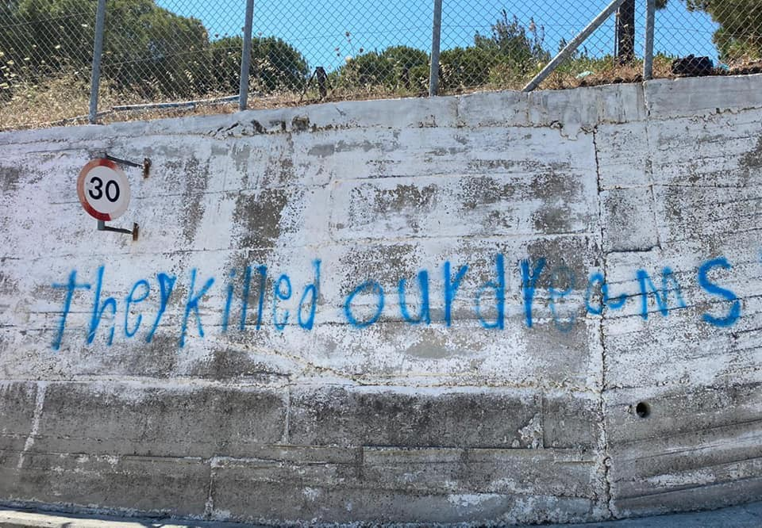
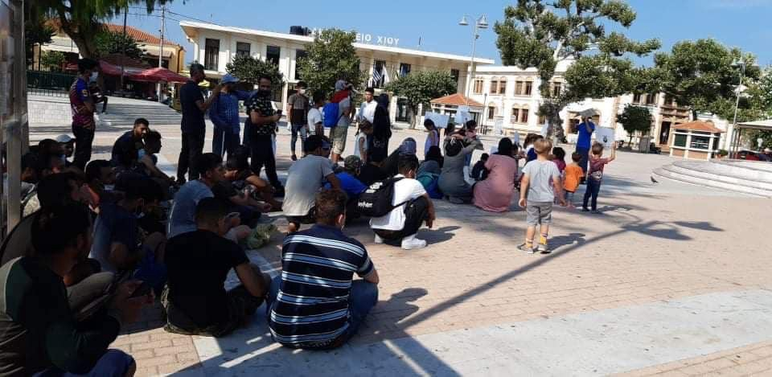
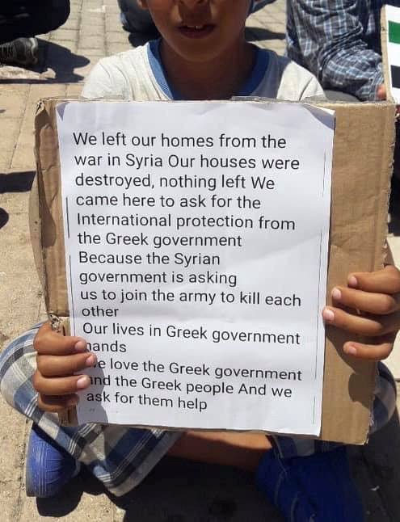

### AYS Daily Digest 13/7/20: Former and current officials hand in hand with border and detention torture practices
### As the stance of migration changes, the Ministries of Interior use it to enforce securitisation strategies and violent border measures / the UK’s ex\-police and diplomacy officers working for the Libyans / Council of State rules: French Ministry of the Interior violates the right to asylum at the border with Italy / 1,000 people arrive in Italy in the past 3 days / Calls for help and aid in the Balkans and in the north of France / reports and updates from the ground & more

[Are You Syrious?](@AreYouSyrious?source=post_page-----997ba2076666----------------------)

[Jul 14](ays-daily-digest-13-7-20-former-and-current-officials-hand-in-hand-with-border-and-detention-997ba2076666?source=post_page-----997ba2076666----------------------) · 9 min read

### FEATURED

It is reported that the Libyan Coastal Security General Administration has had meetings with the UK\-based security risk company “Rose Partners”\. It appears that this is more than a meeting and the **UK security risk company has been contracted by Libyan Ministry of the Interior** to develop “security and administrative procedures” for the Libyan Coastal Security General Administration\. It is important to note that the Coastal Security are the organisation that has been shooting at refugee boats and trying to drown or sink boats with dangerous boating tactics\.

> **_The Libyan detention facilities where torture, violence and enforced starvation have become commonplace is also run by the Libyan Ministry of the Interior\._** 

From the European side, the interior ministers from Germany, Spain, France and Malta were involved in the [online conference talks](https://www.faz.net/aktuell/politik/ausland/migration-eu-will-staerker-gegen-schleuser-vorgehen-16858935.html?fbclid=IwAR1B3sHGDYEIv3Ud3G80q7kodTsJuKF-rzO1iy0U4OX_1wWCHf8z8IzpR7U) with the northern African representatives\. Morocco, Algeria, Tunisia, Libya and Mauritania took part in the conference, which was organised on the initiative of the Italian Interior Minister\. JEU Interior Commissioner Ylva Johansson said that she now wants to explore bilateral contacts on how cooperation can be improved, especially with Europol\. On the occasion of the video conference, Amnesty International [warned](https://l.facebook.com/l.php?u=https%3A%2F%2Fwww.amnesty.de%2Fallgemein%2Fpressemitteilung%2Feuropa-und-zentralasien-eu-nordafrika-kooperation-verantwortung-fuer%3Ffbclid%3DIwAR3HSDwR8vRNylv1IWeluhDjJ0rdMCoGhiS6Kih2w_MRO3tjU5x1vSUaqF8&h=AT3wXvG_RVDbE75gsSkubIvZj8CsG0IIYEKL79HbRyNcPs5ET5MYMGj2-QOId9DpH9ecXFrc0bRN2g3qZYqc0LiaGbij15ITFyOgFfmqwr3BqcN56Xr8fyk8V9vGpx30zDMHS3AzwCr2zg) of expanding cooperation between the EU and countries like Libya, Tunisia and Morocco to keep people on the move away from Europe\. In addition, the federal government is called upon to initiate a change in law within the framework of its EU Presidency which explicitly allows humanitarian aid for refugees\.

The French Council of State confirmed what our associations have denounced for years: **the Ministry of the Interior is violating the right to asylum at the border with Italy\.** Last May, a woman and her five\-year\-old son were pushed back to Italy despite having expressed a desire to apply for asylum upon their arrival in France\. This is a systematic practice that takes place on the Franco\-Italian border and is fully accepted by the Ministry of the Interior\. [Read more](https://www.amnesty.it/la-francia-viola-il-diritto-dasilo-alla-frontiera-italiana?fbclid=IwAR3Z9cr7JSL0beNrmEIXiulcuS3L3Wv2dGhDbsYvVEotdx1cTRQknE7u_j4) \.

At the same time, stressing the **unlawful and inherently violent nature of collective expulsions** at the EU land borders \(namely, those between Croatia and BH and Serbia, as well as the Greek — Turkish border\) **,** many activists, groups, organisations and even political bodies are demanding answers and responsibility to be taken by the heads of the ministries in charge of setting the rules for asylum, migration and integration \(interpreted by most of them as a securitisation issue before anything else\) \.

In an almost generalized silence for months, probably hundreds of asylum seekers are stopped in Trieste and in other places in the region, sent back to Slovenia and from there transported to Croatia and then to Bosnia and Herzegovina\. This **chain pushback practice is happening within the already known misuse of the readmission agreement** from the Slovenian side and along with the illegal violent practices of collective pushbacks from Croatia to Bosnia and Herzegovina\.

On the south, [**Legal Centre Lesvo**](http://twitter.com/lesboslegal) **s** reports that the Greek authorities have been using rescue equipment — namely inflatable, motorless life rafts — in a n **ew type of dystopic expulsion\. “** Migrants are violently transferred from Greek islands, or from the dinghy upon which they are travelling, to such rafts, which are then left adrift in open water\.” In their new report, testimonies from 30 survivors detail the systematic, unlawful and inherently violent nature of collective expulsions in the Aegean Sea, amounting to a crime against humanity\.
### [Press Release: New Legal Centre Lesvos report details collective expulsions in the Aegean Sea](http://legalcentrelesvos.org/2020/07/13/press-release-new-legal-centre-lesvos-report-details-collective-expulsions-in-the-aegean-sea/?preview=true&fbclid=IwAR2wiGR_v6nx5Q_Q-Nh1FhbFZptBTtvER5ROwPaBd0iZMGAajrMI9sHQ-b4)
### [Greek authorities are unlawfully expelling migrants who have arrived in Greece, and abandoning them at sea on…](http://legalcentrelesvos.org/2020/07/13/press-release-new-legal-centre-lesvos-report-details-collective-expulsions-in-the-aegean-sea/?preview=true&fbclid=IwAR2wiGR_v6nx5Q_Q-Nh1FhbFZptBTtvER5ROwPaBd0iZMGAajrMI9sHQ-b4)
#### [legalcentrelesvos\.org](http://legalcentrelesvos.org/2020/07/13/press-release-new-legal-centre-lesvos-report-details-collective-expulsions-in-the-aegean-sea/?preview=true&fbclid=IwAR2wiGR_v6nx5Q_Q-Nh1FhbFZptBTtvER5ROwPaBd0iZMGAajrMI9sHQ-b4)
### EU

German Interior Minister Horst Seehofer [said](https://audiovisual.ec.europa.eu/en/video/I-192669) that Germany would attempt to get EU members to reach a political deal on migration reform while Berlin holds the bloc’s rotating Council presidency, a period running until December 31\. It is [reported](https://www.politico.eu/article/germans-favor-tougher-eu-asylum-policy-poll/amp/?__twitter_impression=true&fbclid=IwAR04j1JE0q-DODA1rhJx2ueVd8n2mMtzTd-amPRkTOaK58Z-pBfrRKLEhYs) that fifty\-nine percent of the survey’s respondents supported reconfiguring the bloc’s [Common European Asylum System](https://ec.europa.eu/home-affairs/what-we-do/policies/asylum_en) to “prevent asylum seekers from entering the EU illegally in the future,” and instead focusing on bringing in “more vulnerable people directly from crisis regions\.” As an expert on the UN and refugee issues stated, that presents the potential risk of the argument in favour of ‘safe & legal routes’ or ‘complementary pathways’\. Governments will use it as an excuse for obstructing the arrival of ‘spontaneous’ asylum seekers\.
### GREECE

In the meantime, MSF [reports](https://l.facebook.com/l.php?u=https%3A%2F%2Fwww.msf.org%2Fgreece-evicts-vulnerable-refugees-leaves-them-streets%3Ffbclid%3DIwAR1sC8j2V5Y1145nAc9gAZipY6zbvLBdlNaE7uM5ZCiScb5iosvwdQh4quM&h=AT3mWdYXCF1iU-JMGlNuhpfBlRq5ITXNUZ3KZPoC9ePjKjY6vj_9HSOMJwfyrfXNlYAd8u74z9KJ6t8zqotSufTgw0viErDeT9IyHKou4mvLhFKhAfHqnorEgMYbUEA4OdmIiHaE6z5EiA) that an increasing number of patients with severe health and mental health conditions in Greece are being threatened with eviction or have been evicted from their accommodation\.
The Greek government has been granted EU funds for enlarging the mainland’s accommodation scheme, yet to find a quick solution for the congested camps on the islands, the eviction of more than 11,000 recognised refugees has begun\.
### While tourists sip cocktails on the beach, those living in Moria only have running water every day for a few short hours

> _The simple dwellings seem endless\. How many people really live here is unclear, but one thing is certain, everyone here suffers from looking away from Europe\._ 

An excerpt from the ground blog of EfS tells one of the many stories of people on the move:

> _Yousef tells us that he and his family have been in the camp for six months\. He is the only one in the family who speaks English, so responsibility for the rest of his family rests on him, the shoulders of the 16\-year\-old Afghan\. He tells us of the violence in the camp\. Only a few days ago, a man died in a stabbing\. There is no medical care at night and the ambulance takes a long time, if it comes at all\. When we ask about his mother, he explains that she is on the way to organize food\. People have to queue for hours just to get some bread and water\._ 

> _Youssef briefly disappears into the tent and returns with a black folder\. He proudly shows us his father’s certificates\. In his home country, he worked as a medical technician in a WHO laboratory\. But now it is almost impossible to find a job in Greece\. The schools are closed — corona lockdown — and without school and no language skills, there is no opportunity for work\. Yousef’s family was very lucky because they received their papers two days ago\. Many others fall through the grids of the European asylum lottery and are deported or forced into illegality\. And yet there is still a rocky road ahead of the family, because for the time being they cannot leave the island\. The bureaucratic hurdles are high, but Yousef is an optimist and firmly believes that his family will find a safe haven\. We say goodbye and go on\._ 

> _Usually, people are allowed to leave the camp to buy medicines or food\. But the government has extended the curfew for the fifth time, so now the refugees have to endure in the camp\. The people are frustrated and exhausted, there are always protests but in Brussels there are discussions about economic pacts and the German Council Presidency\. The suffering of the refugees does not fit into the picture and people continue to persevere on the Greek island\. Without perspective\._ 

### Arrivals

11people were dropped off from a speedboat in Eftalou, ABR wrote\.

After testing, all the newly arrived people will be taken to the quarantine camp in Megala Therma, Lesvos for 14 days’ quarantine due to the coronavirus\.

> _At the moment there are a total of 200 people in quarantine on Lesvos, 162 in the quarantine site In Megala Therma, Lesvos north and 27 in the quarantine site in Kara Tepe, Lesvos south\. The 11 new arrivals from today will remain outside the camp in Megala Therma until test results are ready\._ 

### Protest on Chios

[Refugee Biriyani & Bananas](https://www.facebook.com/RefugeeBiriyaniAndBananas/?tn-str=k%2AF) team reports about protests on Chios

BALKAN ROUTE

In Serbia, the situation for the people is very hard as all the countries have closed their borders for Serbians who have been protesting against their government’s policies for the past seven days now\. In the meantime, the situation for the people on the move and asylum seekers is getting harder by the day\. Asylum Protection Centre reports that out in the open as well as in private accommodation and the reception camp in Subotica, there are currently about 500 people, of whom 200 are Afghans, while the others come from Syria, Morocco, Algeria, Tunisia, Egypt and Palestine\. Among them there are many young families\. 
They have encountered families who have been returned from Hungary and are now at the reception camp, where they sleep in small tents in the backyard of the camp\. Kurdish families with small chidren reportedly stay at the reception lodging or in hostels\. All of them hope to reach the northern borders to continue on\.

UN report for Serbia

UNHCR and partners provided information and counselling to over 1,600 foreigners on access to asylum, health care and other rights and services and supported the integration of 115 asylum seekers and refugees\. UNHCR partners also supported authorities with over 1,000 interpretation and cultural mediation services\.

No refugee or asylum seeker tested positive for COVID\-19 infection\. UNHCR and its eleven partners remained fully operational, carefully calibrating office and field presence in line with infection\-prevention protocols, while continuing comprehensive risk communication in all the languages of refugees and asylum seekers, online, on the phone and in person\.
### [UNHCR Serbia Monthly Update, June 2020 — Serbia](https://l.facebook.com/l.php?u=https%3A%2F%2Freliefweb.int%2Freport%2Fserbia%2Funhcr-serbia-monthly-update-june-2020%3Ffbclid%3DIwAR3Jt_n6hEyZvotCx9lktXm3tA8UUZZnhLGIDNuBdSt37JN8RJN87vFMmpE&h=AT2Ipg7PfAF91Jj-_MbplQvzRrUAxDAdkU_CQmhwlytLGJhcfIHQGCqxgO2LwmdUG5u8f6Xnum7LLwYAbgV8cy29OslB3p3wdGT7ejcu-o5EL8pMzczyRniEgR0HWzXCcc4VdM01H68Tiw)
### [UNHCR and partners informed and counselled over 1,600 foreigners on access to asylum, health care and other rights and…](https://l.facebook.com/l.php?u=https%3A%2F%2Freliefweb.int%2Freport%2Fserbia%2Funhcr-serbia-monthly-update-june-2020%3Ffbclid%3DIwAR3Jt_n6hEyZvotCx9lktXm3tA8UUZZnhLGIDNuBdSt37JN8RJN87vFMmpE&h=AT2Ipg7PfAF91Jj-_MbplQvzRrUAxDAdkU_CQmhwlytLGJhcfIHQGCqxgO2LwmdUG5u8f6Xnum7LLwYAbgV8cy29OslB3p3wdGT7ejcu-o5EL8pMzczyRniEgR0HWzXCcc4VdM01H68Tiw)
#### [l\.facebook\.com](https://l.facebook.com/l.php?u=https%3A%2F%2Freliefweb.int%2Freport%2Fserbia%2Funhcr-serbia-monthly-update-june-2020%3Ffbclid%3DIwAR3Jt_n6hEyZvotCx9lktXm3tA8UUZZnhLGIDNuBdSt37JN8RJN87vFMmpE&h=AT2Ipg7PfAF91Jj-_MbplQvzRrUAxDAdkU_CQmhwlytLGJhcfIHQGCqxgO2LwmdUG5u8f6Xnum7LLwYAbgV8cy29OslB3p3wdGT7ejcu-o5EL8pMzczyRniEgR0HWzXCcc4VdM01H68Tiw)

[No Name Kitchen](https://www.facebook.com/NoNameKitchenBelgrade/?tn-str=k%2AF&hc_location=group_dialog) is in need of men’s summer clothes on the route, collecting them in Croatia, while Are You Syrious is collecting hygiene products, men&women’s clothes and many more things to distribute in our Free Shop in Zagreb\. If you can contribute in any way, contact the groups to see what the next step is\.

### ITALY

In the last three days, 1000 [people arrived](https://l.facebook.com/l.php?u=http%3A%2F%2Fwww.mediterraneocronaca.it%2F2020%2F07%2F13%2Fcontinuano-gli-sbarchi-autonomi-a-lampedusa-foto%2F%3Ffbclid%3DIwAR0jQ1trx3jWVzAXzkPlXN0FU4NzMD17qHYmfqoKl-MWMDv2-UmYSc6_1-A&h=AT3m-FoQdzWwxB0bkT6Ed2SjJ4JeRhEa5Ifce2kmxVRFe4MIJh9hj0awxYABhLPDtYFMr5qSHJoc7RZ78oGVZt7t0qvMN78XaAV0Mpw0pm9VMVLo2SLWRzepUhDA5wEigBhrJRHgve-kRg) autonomously in Italian territorial waters\.

360people are from Libya, the rest from Tunisia, a country that is in a serious political and economic crisis \(two boats also from miles away such as Zarzis and Djerba, near the Libyan border\) \.

Also this morning and at night landings continued in Italy, especially in Lampedusa\. At night, three boats with 10–15 people each arrived from Tunisia on the Pelagic island, Pozzallo, Sicily and [landed 65 peopl](https://l.facebook.com/l.php?u=https%3A%2F%2Fwww.fanpage.it%2Fpolitica%2Fmigranti-arrivati-a-pozzallo-65-naufraghi-a-lampedusa-nuovi-sbarchi-nella-notte%2F%3Ffbclid%3DIwAR0yHn53hQDR5fmy62RnxJcEbSRPkQv62Yrr5jRNowYjr8D_zplMAa-A-N8&h=AT0DH8OHCsrHAZLaJvEYW3xLEUKMpA2lZce6nUwXj5A2aSjH3s1yckJoH91cnDkALOl3D8E_5jZVf6nJC7ICm4g_chh1sD30AIfUydIpDCew3LR2EQ3VEIyK1qKUF41efE5G_sCBfGaN6g) e\.

FRANCE

Emergency appeal in Calais

In the last few days we have seen the most brutal evictions in Calais since 2016\. Police have taken everything from the refugees — tents, sleeping bags, clothes and food\.

Hundreds of people were shipped as far away as Marseille or Spain, and of course they have returned, walking for days with no food or sleep\. But now they have absolutely nothing except their unbreakable will to survive\.

We have given out hundreds of sleeping bags, blankets, and tarpaulins\. But this has decimated our stocks\. We were already worried for winter with no summer festival salvage this year\.

We have given out hundreds of hot drinks, cakes and smiles to keep spirts up\. We have driven round looking for those who are lost and don’t know where to go\. But people are tired, confused and frightened\. They don’t know when this will end\.

Please help us to keep them warm, fed and dry at this traumatic time\.

\- £12 buys a tent to keep two people dry through the night
\- £6 buys a sleeping bag to keep someone warm while they sleep
\- £4 buys a healthy snack pack with water, dates, halal chicken, nuts and chocolate until we get cooking facilities up and running again

Please donate here: [bit\.ly/evictionshelp](https://bit.ly/evictionshelp?fbclid=IwAR3-htr6J4XtW2DdqA8DJ89R1QqvmpK4wdhM_OeKMK6kh-DGlJ_5DLgaju8) — [Care4Calais](https://www.facebook.com/care4calais/?tn-str=k%2AF)

THE NETHERLANDS

Police and the organisation responsible for housing asylum seekers have been accused of breaching refugees’ privacy by sharing personal information about refugees without their consent\. COA, which co\-ordinates the Netherlands’ asylum compounds, passed on details of residents who were involved in incidents on site, including their date of birth, ethnicity and religion\.
### FOR FURTHER READING

Raphael Knipping and Michael Trammer translated their multimedia project into English\. “We were on the island at the beginning of March and tried to capture a moment where tensions escalated\.”
### [\| ΛΕΣΒΟΣ \| Lesbos](http://lesvos.pageflow.io/lesvos-en)
### [THE GATES OF FORTRESS EUROPE ARE FIRMLY CLOSED IN 2020, LEAVING ONLY A FEW LOOPHOLES\. AT FEW PLACES REFUGEES DO MANAGE…](http://lesvos.pageflow.io/lesvos-en)
#### [lesvos\.pageflow\.io](http://lesvos.pageflow.io/lesvos-en)

Listen to the Pandemic Diaries from Greece:

…

**If you wish to contribute, either by writing a report or a story, or by joining the info gathering team, please let us know\.**

**We strive to echo correct news from the ground through collaboration and fairness\. Every effort has been made to credit organisations and individuals with regard to the supply of information, video, and photo material \(in cases where the source wanted to be accredited\) \. Please notify us regarding corrections\.**

**If there’s anything you want to share or comment, contact us through Facebook, Twitter or write to: areyousyrious@gmail\.com**
### Sign up for AYS Daily Newsletter
### By Are You Syrious?

Daily news digests from the field, for volunteers, people on the move, journalists, and the general public [Take a look](/are-you-syrious/newsletters/ays-daily-newsletter?source=follow_footer--------------------------follow_footer-)
### Sign up for AYS Daily Newsletter
### By Are You Syrious?

Daily news digests from the field, for volunteers, people on the move, journalists, and the general public [Take a look](/are-you-syrious/newsletters/ays-daily-newsletter?source=follow_footer--------------------------follow_footer-)

_Converted [Medium Post](https://medium.com/are-you-syrious/ays-daily-digest-13-7-20-former-and-current-officials-hand-in-hand-with-border-and-detention-55201cd7d5fd) by [ZMediumToMarkdown](https://github.com/ZhgChgLi/ZMediumToMarkdown)._
