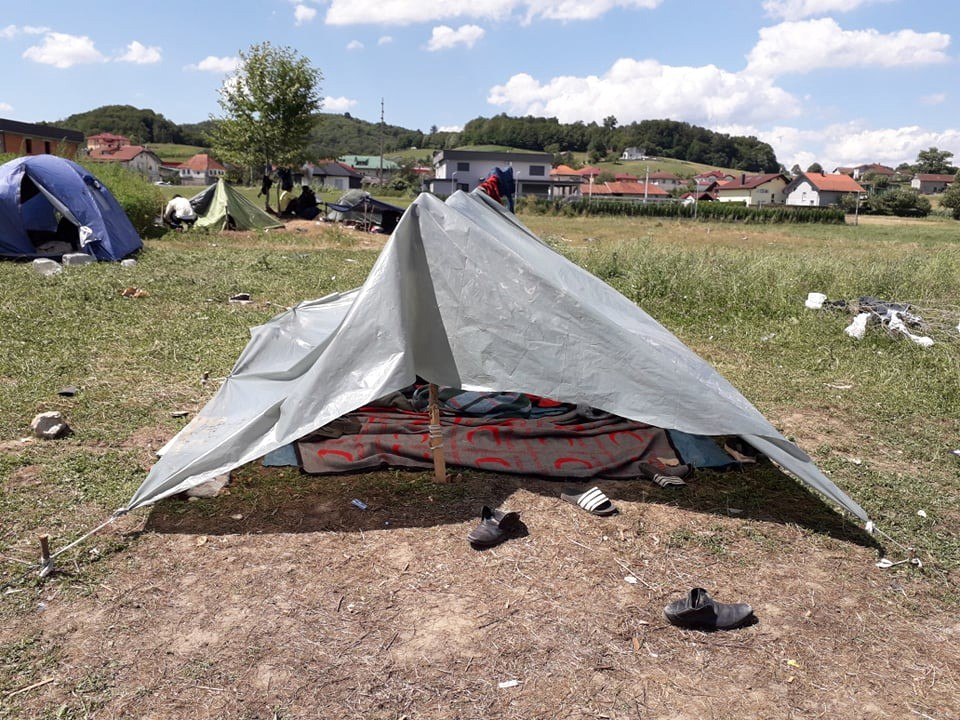

### AYS Daily Digest 17/7/20 Devastation in Bosnia: Security forces destroy camp

_Huge win for family reunification in EU Courts // continued lockdown in Greece for refugees // relocation plan set for Syrian refugees in Lebanon // and more…_

](assets/18885c21070e/1*ebKSq-TDwiZbD36Ph776fQ.jpeg)

Photos of Velika Kladusa by [NoName Kitchen](https://www.facebook.com/NoNameKitchenBelgrade/posts/1027320167666267)
### FEATURE → News from Velika Kladusa: “The situation was already dramatic a couple of days ago and today it is even worse\.”

Update from [NoName Kitchen](https://www.facebook.com/NoNameKitchenBelgrade/posts/1027320167666267) : **“Yesterday, July 16th, special security forces and cleaning workers from the city council picked up the settlement where hundreds of people were living, around the official refugee camp\. People have no other place around where to live\.”**

According to the media, [radiovkladusa\.ba](http://www.uskinfo.ba/vijest/foto-uklonjeno-divlje-migrantsko-naselje-u-polju-kod-velike-kladuse/77858?fbclid=IwAR1Ho7T4T0EdCSdOgGTSdgrKTt6fGjPopEu2qsjcdhzFMGpqd5aDzT9FtCI) , the removal was of a “wild settlement” and took place “without incident\.” Yet NoName Kitchen continues describing how devastating the loss is of the “wild settlement” is to the people who needed its shelter:

> “According to the information we have received, all the tents, clothes, backpacks, food and belongings in general were thrown away\. Some 200 people were transferred to the Lipa refugee camp, an official camp made of giant tents, located far from any urban nucleus and paid for with EU money\. Many other people ran away for fear of what might happen to them\. 

> No name kitchen volunteer on Velika Kladuša told us: “They destroyed everything\. I dont have the words to describe you how it looks here\. No place to go\. Some people is in the woods hiding\. No clothes, no tents, no nothing” 

> The situation is still dramatic\. The Miral reception camp finally opened its doors after having people confined for much longer than the government demanded for the rest of the country’s citizens, and this has caused many people to leave to try ‘the game’\. We are seeing pushbacks every week, of all sorts, people being victims of violence permanently, many pushbacks, violent and illegal, from Slovenia and from Italy\. Although this happened before, the last 4–6 weeks it is something really striking, especially from Italy, where certain rights, such as the application for asylum, are supposedly tightly protected\. 

> If we add to this that many people have come from other places, many from BiH, from Montenegro, Serbia and so on, this means that right now we know that apart from the 600–700 people in the camp, there are also some 600–700 people outside the camp, in a really dire situation\. The police are expelling them from the squats where they generally seek shelter, and we have many people on the river bank, with two plastics, some with tents — those who have been able to access them, which are few, of course\. 

> We have had days of over 40 degrees, a terrible heat and very little hygiene, because there is the river but there is a lack of soap and clean clothes\. All this is compounded by the rather unstable climate in terms of border opening and closures\. This does not affect so much people who don’t cross at the official borders, but it does affect our work teams, because we have already had volunteers, activists who have gone and had to leave because they were closing the borders again\. But still, we are continuing the work\. 

> We continue with the system of exchangeable coupons for food, the famous vouchers we have been mentioning for some time\. We have expanded the program, now we have three supermarkets and more than 600–700 people every week who have access to food in this way, to the food they want, so that they can cook it the way they want, and that is a triumph\. 

> And in parallel, there are already activists of No Name Kitchen on the ground preparing the return of the teams, not only to Velika Kladusa, but also to Maljevac, where we have the central warehouse, the logistic centre, and where we are right now working on improving and maintenance, changing a little all the structure so that it can also give service to our projects in Balkans\. 

> A few days ago we made a couple of calls: we need handy volunteers interested in coming to help, building shelves, sorting clothes … there is a lot of work to do; and we need donations of clothing, especially summer, shorts, sneakers, and also phones\. 

> Not only people in Velika Kladusa need clothes\. Volunteers and activists located in other key points around Bosnia and Herzegovina such as Tuzla, Kljuc, Bihac or Sarajevo\.” 

> “The situation in Bosnia and Herzegovina for refugees is really hard\. Don’t look the other way\. European border policy has created chaos in its neighboring countries\. And everyone here helping refugees and migrants constantly needs help\.” 

#### LEBANON

The Lebanese President Michel Aoun announced on Thursday, in coordination with the Syrian government, [a new plan to relocate Syrian refugees](https://www.middleeastmonitor.com/20200717-lebanese-president-we-set-plan-for-syria-refugees-return/?fbclid=IwAR1iqtcBn7jTTUn1bA7SufgeKFRyzPqw3uzn9vgkq9wj9v2lOu_nnzcmiQU) in Lebanon back to Syria\. Aoun said:

> “We have always called on the countries concerned with the affairs of displaced persons to do their part in order to secure their return and we waited for their positions to come through, but today we have to act in a practical way to push these countries to perform their duties towards the refugees…\(Lebanon\) is not in the position of attacking anyone or supporting disputes and wars at all, but we are obligated to defend ourselves, whether we are neutral or not…The concerned agencies are vigilant in securing the borders in the south, in light of Lebanon’s keenness to resolve disputed issues with Israel under the auspices of the United Nations\.” 

#### SEA

■■■■■■■■■■■■■■ 
> **[Sara Creta](https://twitter.com/saracreta) @ Twitter Says:** 

> > Latest update: ~ 65 people from #Eritrea #Sudan including minors &amp; women have been rescued by #Malta &amp; will disembarked shortly.

Families members have been in contact to ask info as Italian &amp; Maltese authorities gave no official update on the rescue.

Where is the right to know? https://t.co/1bPWPGBcV1 

> **Tweeted at [2020-07-17 11:10:54](https://twitter.com/saracreta/status/1284083147437678594).** 

■■■■■■■■■■■■■■ 

[**63 people were rescued**](https://timesofmalta.com/articles/view/rescued-migrants-being-brought-to-malta.805566?fbclid=IwAR2cEuZye1Ivgqs1gmz1waLJchczujKLx_wHTEg0vzAKul83Rbl-Gg3Zp-Y) and brought to Malta on Friday\. Alarm Phone had lost contact with their sinking boat for awhile and tried their hardest to get the authorities attention\. Thankfully they were rescued several hours later\.

Al Jazeera is reporting that _“An unidentified body drifting in international waters within the Libyan search and rescue \(SAR\) zone for almost three weeks is yet to be retrieved despite repeated requests by a rescue group operating in the Mediterranean\. A photo taken on June 29 by Seabird, a monitoring aircraft operated by the search\-and\-rescue group Sea\-Watch, shows the body facing down in the Mediterranean’s rough waters, entangled in a half\-sunk grey dinghy\. Sea\-Watch told Al Jazeera on Friday the body was still floating even though the group immediately alerted authorities in Libya, Italy and Malta and sent three more requests since\.”_ [More here\.](https://www.aljazeera.com/news/2020/07/dignity-drowned-body-left-float-ngo-requests-200717151902969.html?fbclid=IwAR3j2a-6Bh-M2K4aPNVOwAR687PF2h4QtqmpBMpM4wohS2vPHIJzQnN7HIM)
### The most dangerous migration route in the world got a whole lot more dangerous due to COVID\-19

The central Mediterranean route from sub\-Saharan Africa, through Niger, through Libya, across the Mediterranean to Italy has become a lot worse through the pandemic in regards to tougher restrictions on movement, wages drying up, and people fearing the virus\. [The Danish Refugee Council](https://drc.ngo/news/covid-19-is-cutting-off-even-more-lifelines-for-people-seeking-safety?fbclid=IwAR35WlR5iGOvH026qkw-TmNHhaURW72hsbzri0hcbkKamvBUAX4txfxYFpM) says:

> “Along the route, people rely on daily wages in unstable jobs just to be able to buy food and basic necessities\. The pandemic has forced people into lockdowns and cut off work opportunities with no savings\. This has impacted their ability to cover their basic needs, to afford potential onward travel, and to send home money to their families\.” 

#### GREECE

![**“On Wednesday morning, 04\.20, TCG picked up 37 people from a life raft that was drifting north east of Simi island\.** People from the raft claims to have been put there by Greek coast guard\. They further claim to have arrived on Rhodes, but was rounded up by Greek police, before taken back to sea in a HCG vessel\. Strangely enough this is not unusual in the Aegean Sea, but the life raft used this time haven’t been used before, as far as we know, usually they are square, this one was round\. Perhaps the Greek Coast Guard is all out of the square once, and started using a different model\. Around 50 life rafts has so far been found drifting in the Aegean Sea since March\. It remains to be seen if there will be more of these rafts in the time to come\.” Photo by [ABR](https://www.facebook.com/AegeanBoatReport/posts/876799529509819)](assets/18885c21070e/1*gt77gD_3F1zgtnu-AopmLw.jpeg)

**“On Wednesday morning, 04\.20, TCG picked up 37 people from a life raft that was drifting north east of Simi island\.** People from the raft claims to have been put there by Greek coast guard\. They further claim to have arrived on Rhodes, but was rounded up by Greek police, before taken back to sea in a HCG vessel\. Strangely enough this is not unusual in the Aegean Sea, but the life raft used this time haven’t been used before, as far as we know, usually they are square, this one was round\. Perhaps the Greek Coast Guard is all out of the square once, and started using a different model\. Around 50 life rafts has so far been found drifting in the Aegean Sea since March\. It remains to be seen if there will be more of these rafts in the time to come\.” Photo by [ABR](https://www.facebook.com/AegeanBoatReport/posts/876799529509819)

■■■■■■■■■■■■■■ 
> **[Vassilis Tsarnas](https://twitter.com/VassilisTsarnas) @ Twitter Says:** 

> > #Greece: We filed a criminal complaint, based on a testimony by @[RuhiLoren](https://twitter.com/RuhiLoren), on how ppl recognised as #Migrants or #RefugeesGr &amp; not #tourists, were segregated during a trip by "Blue Star Ferries", between Chios island &amp; Piraeus. And that's not just a rare exception!
#Segregation 

> **Tweeted at [2020-07-17 11:06:53](https://twitter.com/vassilistsarnas/status/1284082137143160832).** 

■■■■■■■■■■■■■■ 

■■■■■■■■■■■■■■ 
> **[Vera Magali Keller](https://twitter.com/veramagalik) @ Twitter Says:** 

> > #Moria lockdown AGAIN just got extended for the 6th time. We don’t know until when. Since 5 months (March 23) #refugeesgr cannot leave Moria. This is what we expected, #Greece wants #Moria to be a closed camp. #freethecamps 

> **Tweeted at [2020-07-17 07:41:52](https://twitter.com/veramagalik/status/1284030546016899073).** 

■■■■■■■■■■■■■■ 

Part of [MSF’s statement](https://www.msf.org/covid-19-excuse-keep-people-greek-islands-locked) regarding how Greece is keeping camps in lockdown during the pandemic:

_“MSF cannot stay silent about this blatant discrimination, as the restriction of movement imposed on asylum seekers dramatically reduces their already\-limited access to basic services and medical care\._

_In the current phase of the COVID\-19 epidemic in Greece, this measure is absolutely unjustified from a public health point of view — it is discriminatory towards people that don’t represent a risk and contributes to their stigmatisation, while putting them further at risk\.”_

Help [Eleonas Refugee Food Support Program](https://chuffed.org/project/eleonas-refugee-food-support-program?fbclid=IwAR2wUUhj8abMuv5FE-xTmoRj4dGDVPpTb56J9jZlFOtnSvVmGeqovaHthF8) fight refugee hunger in Greece during COVID\-19\!

> “Today we ask for your support for the new Eleonas Food Support Program that aims to help some of the most vulnerable residents of the camp\. During the previous months and increasingly so, more and more residents have stopped receiving the small cash support as a result of their asylum request being accepted or rejected; in both cases the monthly cash support on which they depend on to cover basic needs, is no longer offered to them\.” 

#### ITALY

[First Aid Support Team](https://www.facebook.com/FASTFirstAidSupportTeam/posts/1008599442908745) NEEDS DOCTORS, NURSES, and PARAMEDICS with Italian citizenship or anybody already registered to practice in Italy in Ventimiglia \(FR/IT border\):

> “100\+ people are being pushed back every day\. There are 200\+ on the streets and no first aid is provided for refugees in the city\. Only emergencys that require hospital treatment are allowed \. The authorities insist on registration or Italian citizenship\! Please message us ASAP if you know somebody\!” 

![\*NEW REPORT\* “At a critical time in Europe’s response to migration and asylum with the European Union’s New Pact on Migration in the pipeline, our latest report presents several concerns regarding pushbacks, treatment in detention, and living conditions for displaced people in Italy\. **In particular, the report raises concerns about Italy’s failure to uphold the principle of non\-refoulement** by engaging in summary pushbacks, as well as implementing bilateral readmission agreements without sufficient guarantees as stipulated in international human rights and refugee law\.” Photo by [Refugee Rights Europe](https://www.facebook.com/RefugeeRightsEurope/photos/a.1502441746729332/2344113559228809)](assets/18885c21070e/1*eTSNyyGdJ3IjjB6Re-bDhg.jpeg)

\*NEW REPORT\* “At a critical time in Europe’s response to migration and asylum with the European Union’s New Pact on Migration in the pipeline, our latest report presents several concerns regarding pushbacks, treatment in detention, and living conditions for displaced people in Italy\. **In particular, the report raises concerns about Italy’s failure to uphold the principle of non\-refoulement** by engaging in summary pushbacks, as well as implementing bilateral readmission agreements without sufficient guarantees as stipulated in international human rights and refugee law\.” Photo by [Refugee Rights Europe](https://www.facebook.com/RefugeeRightsEurope/photos/a.1502441746729332/2344113559228809)
#### SPAIN
### Arrivals to the Canary Islands have multiplied by 6 since January…

…But while the Canary island’s immigration has risen, for the rest of Spain new irregular arrivals have actually decrease by 34\.1% this year so far\. This is due to a decrease in boat traffic to the Strait of Gibraltar and on the Mediterranean\. More on new arrivals to Spain [here](https://www.canarias7.es/sucesos/las-llegadas-en-patera-se-multiplican-por-6-en-canarias-desde-enero-YG9448573?fbclid=IwAR19u7jNtlF_AHxMvlj6SNxMvWf0eYY6xKgmv368XpvDYIXGpjK6BDiYHFU) \.

A fire burned down 70 shacks on the Camino del Corchuelo, in El Terrón early in the morning on Friday\. While the fire was finally put out, many people are let without any belongings\. This is the second fire in this area since [Monday](https://www.diariodehuelva.es/2020/07/17/lepe-inmigracion-asentamientos/?fbclid=IwAR3dOh6CUYxR3qzPl7YNs4uPcILdxdN58-ECmBMej2tsWLCj2U-4_b3NHbI) \. Find out more [here](http://huelva24.com/art/139135/un-nuevo-incendio-esta-madrugada-en-un-asentamiento-en-el-terron-destroza-70-chabolas?fbclid=IwAR3iJyHQ4znjK_4b9sy90BM1VosPQepvZzIkAsJDsYpUiRB5yuk0TOp2AtQ) \.
#### BOSNIA AND HERZEGOVINA

■■■■■■■■■■■■■■ 
> **[NoNameKitchen](https://twitter.com/NoNameKitchen1) @ Twitter Says:** 

> > Around 100 people, many of them children, are living hidden in a forest. 

No Name Kitchen gives them food and washes their clothes to avoid skin diseases. 

We also do it hidden. Why? Because in Europe, #refugees are treated as criminals. As well as the people that support them. https://t.co/ZeRmdBocxs 

> **Tweeted at [2020-07-17 09:02:22](https://twitter.com/nonamekitchen1/status/1284050803787993090).** 

■■■■■■■■■■■■■■ 

#### GERMANY
### Good news update from AlarmPhone\!

_“Acquitted\! Our Alarm Phone member **Hagen** who was accused of ‘inciting criminal acts’ for asking the public to protect and if necessary hide those threatened by deportation, **was freed yesterday of all charges\!** Solidarity is not a crime\! No one is illegal\!”_ Find the full report in German [here](https://www.fr.de/rhein-main/main-kinzig-kreis/hanau-ort66348/kein-aufruf-straftaten-13835101.html) \.
#### FRANCE

![“With the ongoing evictions in Calais, the refugees have lost their ability to cook\. **Pots and pans have been confiscated and destroyed by authorities\.** This is a huge setback\. Cooking gives people a sense of togetherness and agency, and gives them choice over their diet\. We’ve rapidly adapted to this change, swapping cooking essentials for food packs that contain ready\-to eat snacks like nuts, biscuits, dates, fruit and halal chicken\. We’re focusing on things that are high in energy and nutritious, and adding fresh fruit every day\. Over the past week, we’ve given out many hundreds of these snack packs\. This week the police continue to move groups of refugees on, still forcefully and with violence\. Access to water points has been denied and state food provision has stopped\. Every day we take out hot tea and coffee and food to as many different groups as we can find\.” Photo by [Care4Calais](https://www.facebook.com/care4calais/photos/a.1046164975416459/3446383652061234)](assets/18885c21070e/1*jJaBBf9N5p1oUpuv7EeNrg.jpeg)

“With the ongoing evictions in Calais, the refugees have lost their ability to cook\. **Pots and pans have been confiscated and destroyed by authorities\.** This is a huge setback\. Cooking gives people a sense of togetherness and agency, and gives them choice over their diet\. We’ve rapidly adapted to this change, swapping cooking essentials for food packs that contain ready\-to eat snacks like nuts, biscuits, dates, fruit and halal chicken\. We’re focusing on things that are high in energy and nutritious, and adding fresh fruit every day\. Over the past week, we’ve given out many hundreds of these snack packs\. This week the police continue to move groups of refugees on, still forcefully and with violence\. Access to water points has been denied and state food provision has stopped\. Every day we take out hot tea and coffee and food to as many different groups as we can find\.” Photo by [Care4Calais](https://www.facebook.com/care4calais/photos/a.1046164975416459/3446383652061234)

**Help Care4Calias by donating for snack packs\!** [Find info here\.](https://www.facebook.com/care4calais/photos/a.1046164975416459/3446383652061234)
#### BELGIUM

A police officer who beat up a refugee back in April has been sentenced to 1 year in prison as well as fined €1,600 by a court in Brussels\. The man who was brutalized was just walking to a hostel for asylum seekers, when the police officer got out of a van and proceeded to hit him and smash his phone\. The court viewed the offense as “absolutely unacceptable\.” [More here](https://www.brusselstimes.com/all-news/belgium-all-news/122009/one-year-suspended-for-policeman-who-beat-up-refugee/) \.
#### EU
### **A major victory for family reunification\!**

The European Court of Justice has just ruled that if a child started out as a minor but turned of age during the proceedings to reunite that child with their parent in Europe, the court has ruled that these cases cannot be dismissed since the child is no longer a minor\. This case was brought from a refugee in Belgium who’s case failed to reunited him with his three children due to these circumstances\. [More here](https://www.infomigrants.net/en/post/26099/europe-s-top-court-rules-on-family-reunification-of-minors?fbclid=IwAR1YQQHtaLPqQw7zLQQZ72nUMZqK5N3nhVlTYb2qJQ3IEizhnZsuADCcOGQ) \.

[European Council on Foreign Relations](https://www.ecfr.eu/article/commentary_unending_lockdown_why_aiding_child_refugees_could_strengthen_the?fbclid=IwAR1qzqIbqkr5PDxoDCa1qD7951ZhkkcLPpgRbJBn2ZMiDt60Ou7mkq53-3A) just published a commentary on 
**“Unending lockdown: Why aiding child refugees could strengthen the European project\.”** AYS urges you to read it in full but here is a synopsis:

> “This is not an easy time for anyone\. **But, for children who are likely traumatised after fleeing their homes only to find themselves alone in unliveable camps such as Moria, things are far worse than they are for most Europeans\.** By relocating them to more hospitable locations and improving education within the camps, the EU can significantly improve their lives and decrease its long\-term integration and support costs\. As the trade\-offs facing policymakers become increasingly complex, efforts to help unaccompanied minors may provide a small but tangible victory for all\. With a minimal commitment, European governments can transform the lives of refugees, safeguard the well\-being of their constituents, and strengthen the foundations of the European project\.” 

#### GENERAL
### The Missing Persons Project, launched in 2018 by the ICRC, is currently developing a Minimum Standard Dataset for the Search of Missing Migrants\.

We invite all interested parties [to submit their written comments](https://www.icrc.org/en/document/draft-minimum-standard-dataset-search-missing-migrants?fbclid=IwAR2ybRMVuF9QA7PVDnGi9PxDquLOYXv-zVl5rhZjIAF4bC6cpQ1FqJJPzfI) on this dataset\. All submissions:
- should be submitted electronically to this dedicated email address: [missingpersonsproject@icrc\.org](mailto:missingpersonsproject@icrc.org)
- should have, in the subject line of the email: Minimum Standard Dataset for the Search of Missing Migrants — comments
- should be in a single document of no more than two pages, and indicate exactly which paragraphs the comments pertain to
- must be in English, French, Spanish, Arabic or Russian\.

**Deadline: 30th of November 2020\!**

Global Campus on Human Rights sent out this statement on the threat to citizens and their right to record during the pandemic:

> “In the interest of advancing justice and accountability, it has become a duty for the human rights community to advocate for an unambiguous recognition of the right to record and the ability of citizens to freely exercise this right without fear of retaliation or victimisation\. This is essential if we must continue guarding the good during and after the COVID\-19 pandemic\.” 

[Find it in full here](https://gchumanrights.org/preparedness/article-on/the-video-of-their-crimes-protecting-the-right-to-record.html?fbclid=IwAR2cEuZye1Ivgqs1gmz1waLJchczujKLx_wHTEg0vzAKul83Rbl-Gg3Zp-Y) \.

This is a warning that AVRR from IOM has spent more time recently advertising “volunteer returns\.” Be on the look out and [don’t buy into it\!](https://dm-aegean.bordermonitoring.eu/2018/06/14/he-myth-of-voluntary-deportations-assisted-voluntary-return-and-reintegration-from-greece-january-2018/?fbclid=IwAR2d_bzxeKKXZ4Ee09tvCEjL3wrXrAvp_sNjeRxMOTGoQ6QzTU7hk8ID-9A) People denied their right for asylum don’t return voluntarily\.

If you have the time this week, [check out this podcast](https://www.latitudeadjustmentpod.com/podcast/2020/7/17/64-live-asylum-conditions-in-greece-and-the-balkans?fbclid=IwAR1YQQHtaLPqQw7zLQQZ72nUMZqK5N3nhVlTYb2qJQ3IEizhnZsuADCcOGQ) about asylum conditions in Greece and the Balkans\! Some experts discuss the most important points to address today\.

**If you wish to contribute, either by writing a report or a story, or by joining the info gathering team, please let us know\.**

**We strive to echo correct news from the ground through collaboration and fairness\. Every effort has been made to credit organisations and individuals with regard to the supply of information, video, and photo material \(in cases where the source wanted to be accredited\) \. Please notify us regarding corrections\.**

**If there’s anything you want to share or comment, contact us through Facebook, Twitter or write to: areyousyrious@gmail\.com**

_Converted [Medium Post](https://medium.com/are-you-syrious/ays-daily-digest-17-7-20-devastation-in-bosnia-security-forces-destroy-camp-18885c21070e) by [ZMediumToMarkdown](https://github.com/ZhgChgLi/ZMediumToMarkdown)._
