### AYS Weekend Digest 18–19/7/2020 Endemic Police Racism in Tuzla
#### 60 people feared dead in Turkey at border / Ethiopians and Eritreans at risk in Libya **/** Mass Deportation to Sudan **/** Italian tanker’s captain and owner on trial for push\-back in 2018 / Extended lockdown on Greek Islands / Arrivals on Canary Islands / Protest in Madrid for regularisation and against detention centres and much, much more…

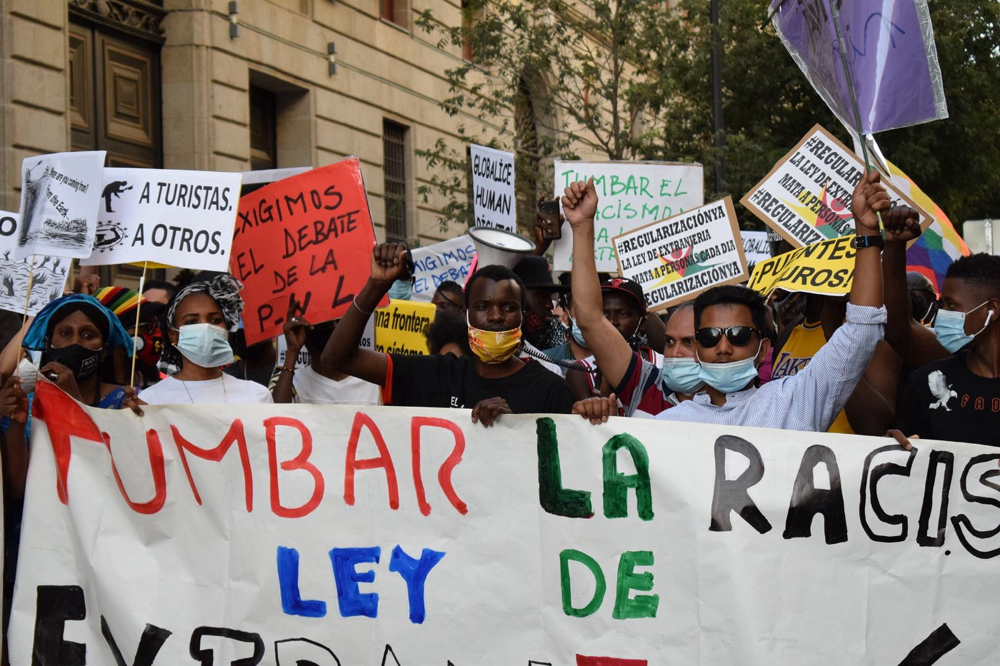

\(Photo Credit: AYS\. Sunday’s protest in Madrid asking for the regularization of migrant people in Spain and the closure of CIES\)

**FEATURE: Endemic police racism in Tuzla, Bosnia and Herzegovina**

People whom the western police of Tuzla believe to physically “resemble the refugees” they’ve seen before, are being taken away in official cars of the Tuzla canton Ministry of the Interior towards Sarajevo\.

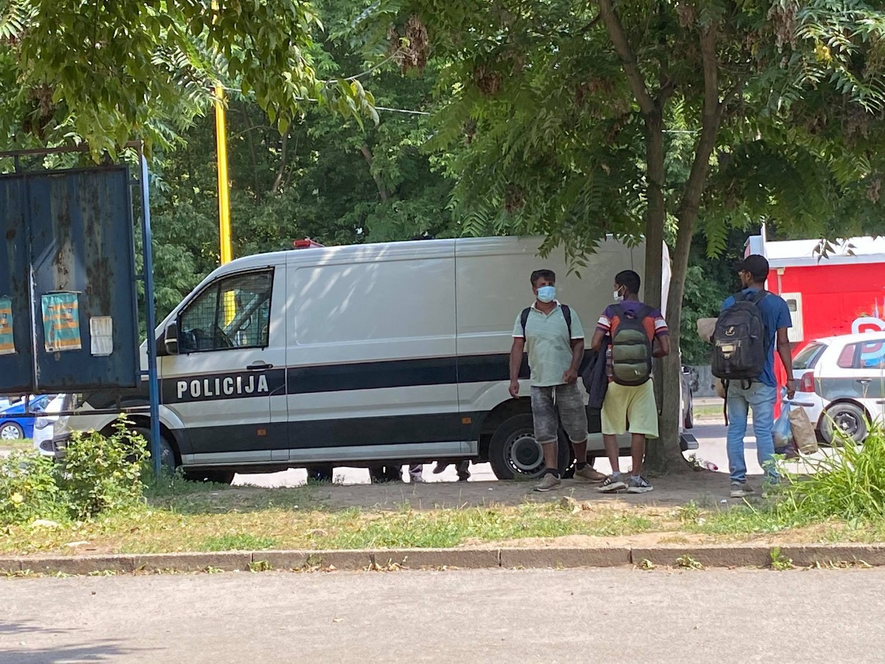

Tuzla police loading people into vans to move them towards Sarajevo \(Photo by AYS\)

At first, these people were transported to Olovo, then Kladanj, and now they are being taken to Živinice, a small town in Tuzla canton\. Often, they are left across the road from the nearby woods\. There, the police leave them without anything and direct them towards Sarajevo \(as we reported earlier regarding the Republic of Srpska police directing people towards the Una Sana canton\) \.

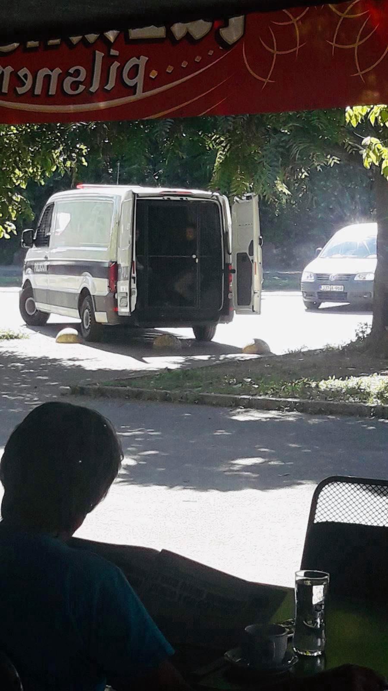

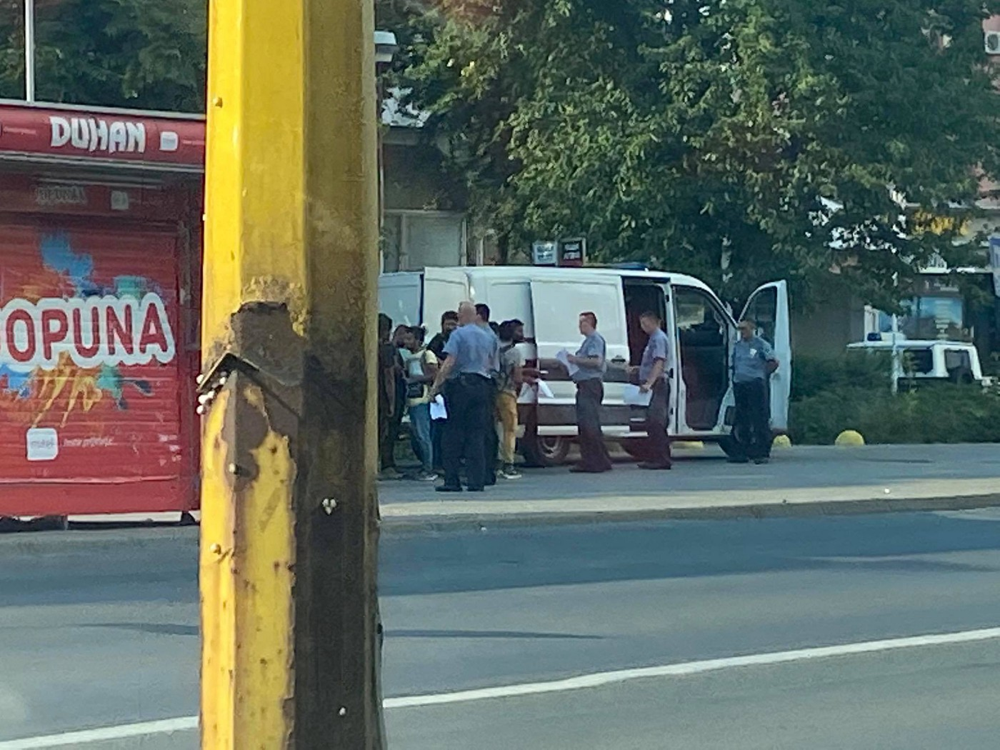

Photos by AYS

In the Tuzla case, some questions arise:
- Which authority is directing such transfers to unspecified locations?
- Where are these individuals being taken, are they transferred to other authorities and on which legal grounds?
- Do police officials have all the necessary documents for such a procedure \(travel order and such\)?
- Do the police take into consideration each of the individual cases — for example, do they take into account that some individuals have been issued documents that regulate their stay in the Tuzla canton as asylum seekers? Or are all of those people simply being taken out of Tuzla, as was documented a number of times before?
- Is there any agreement between the Ministry of the Interior of the Tuzla canton and of the Ministry of the Interior of the Sarajevo canton on the admission of these people?
- If so, why has the public not been informed?

Since the start of the coronavirus crisis, the Office for Foreigners in Tuzla has not been registering people, even though they are arriving daily\. This is the only field office in the country that has stopped registering people\. This fact alone has made the work of independent organisations and NGOs extremely difficult\. A large number of people coming to Tuzla are in dire need of medical assistance, but, without the possibility of applying for asylum officially, they are excluded from medical care\.

Police agents have been raiding the local restaurant at the Tuzla bus station, taking people away and driving them off towards Sarajevo\. Some officials have allegedly suggested that the owner of the restaurant should forbid people on the move from sitting at tables or gathering on the premises, and they told the owner not to charge people’s phones\. Other restaurant owners within the bus station reportedly support police activity, informing the police each time people arrive for a coffee etc\.

What law is this police practice based on? Apart from this restaurant, people on the move are not allowed anywhere around the bus station\. The same goes for long\-term volunteers, activists and people from different organisations, who are being accused of “gathering” people on the move\.

Who will investigate illegal police practices in Tuzla?

TURKEY

**60 People feared dead**

A boat carrying 60 people capsized on Lake Van in south\-eastern Turkey over the weekend, reports [Info Migrants](https://www.infomigrants.net/en/post/25727/dozens-of-migrants-feared-dead-in-lake-van-turkey?fbclid=IwAR2W1fl3IuIZQnnTBVwWCt8hvW3LefyhjZ0NXSkFhtal_PV5l4ATdJ33cGM) \. So far only six bodies have been found and although special equipment is being brought in from Ankara, the lake is 450 metres deep in some places and the recovery of the bodies of these people will be difficult\.

The lake is on a common route between Central Asia and Turkey and last year there was a [similar incident in which seven people died](https://www.infomigrants.net/en/post/25727/dozens-of-migrants-feared-dead-in-lake-van-turkey?fbclid=IwAR2W1fl3IuIZQnnTBVwWCt8hvW3LefyhjZ0NXSkFhtal_PV5l4ATdJ33cGM) \.

TUNISIA

[Local media report](https://www.tap.info.tn/en/Portal-Headlines/12895288-kef-7-irregular?fbclid=IwAR2ETm9o2xWiwZHO4AFcb1SfiZLzNYAWPg7TQKibEL5LQhcNT9mkraOuQgA) that seven people were arrested on Sunday by the National Guard deployed at the border crossing in the region of Kef\. They have been taken to the mandatory quarantine centre in Kef\.

LIBYA

**Group of Ethiopians and Eritreans at risk in Libya**

[A human rights solicitor reports](https://web.facebook.com/rastajuly/posts/10157870896008621) :

> _A group of 127/128 migrants, mostly [\#Ethiopian](https://web.facebook.com/hashtag/ethiopian?__eep__=6&source=feed_text&epa=HASHTAG) and [\#Eritrean](https://web.facebook.com/hashtag/eritrean?__eep__=6&source=feed_text&epa=HASHTAG) , arrested in Tripoli about a week ago have been locked by the Libyan police in a secret military camp in Bahtjna near [\#Zawiya](https://web.facebook.com/hashtag/zawiya?__eep__=6&source=feed_text&epa=HASHTAG) Al Nasr Detention center\. They are in desperate conditions\. Among them there are 16 women, of which 2 are pregnant, and 3 babies\. One refugee has been shot and taken away from the center, nobody knows whether he is still alive\. They are being denied sufficient food and water, seized phones and kept locked up\. They are all registered by [\#UNHCR](https://web.facebook.com/hashtag/unhcr?__eep__=6&source=feed_text&epa=HASHTAG) and need urgent intervention to be released\. They are in inhuman conditions and the fact that they have been taken to this military camp where UN agencies have no access suggests a high risk of being [\#sold](https://web.facebook.com/hashtag/sold?__eep__=6&source=feed_text&epa=HASHTAG) by authorities to new traffickers to [\#torture](https://web.facebook.com/hashtag/torture?__eep__=6&source=feed_text&epa=HASHTAG) them\. The refugees are desperate and they are afraid of being be sold to Haysem, a notorious trafficker\-torturer who collaborates with the Libyan authorities in Zawiyah\. These are the Libyan authorities and torturers for profit that the [\#Italian](https://web.facebook.com/hashtag/italian?__eep__=6&source=feed_text&epa=HASHTAG) government is funding, these are the [\#CrimesAgainstHumanity](https://web.facebook.com/hashtag/crimesagainsthumanity?__eep__=6&source=feed_text&epa=HASHTAG) that EU governments are commissioning and encouraging\._ 

**People deported to Sudan**

80 people from Sudan, [a country still experiencing the aftermath of civil war and continued violence](https://www.cfr.org/global-conflict-tracker/conflict/civil-war-south-sudan) , [were deported this weekend](https://web.facebook.com/Alhadath.Libyaa/posts/2209230649201856) from the centre for sheltering and deportation of illegal immigrants in Kafra city\. This included those who were transferred from the Qanfouda shelter centre in Benghazi, and another number of other cities in the eastern region\.

GREECE
### Arrivals and push\-backs

[Aegean Boat Report](https://www.facebook.com/AegeanBoatReport/) ’s breakdown of the weekend: throughout the weekend, they report of around 150 people arriving on Lesvos\.

On Saturday morning at least two boats arrived on Lesvos, carrying 28 and 38 people\. There is also a report of a third boat, but it is still unconfirmed\.

Two boats arrived on Lesvos on Sunday, carrying a total of 90 people\. 56 people arrived in Tarti, Lesvos south before first light\. 34 people arrived in Skaka Mistegnon in the evening\.

Also one boat was reportedly pushed back by the Hellenic Coast Guard \(HCG\) 06\.00 Sunday morning outside Mytilíni\. The boat was drifting for hours before eventually being picked up by the Turkish Coast Guard \(TCG\) \. Both HCG and TCG were present the whole time, refusing to help\.

The new arrivals will, after their COVID\-19 test results are ready, be taken to the quarantine camp in Kara Tepe, Lesvos south for 14 days quarantine due to the coronavirus\.

At the moment there are a total of 329 people in quarantine on Lesvos, 239 people in Megala Thermis, Lesvos north and 90 people \(those who arrived on Sunday\) in Kara Tepe, Lesvos south\.
### How long does it take to turn reception into detention?

[From Europe Must Act](https://www.facebook.com/europemustact/photos/a.107779454168091/158742592405110) — Yesterday Greek authorities extended the restrictive measures for refugees and asylum seekers living in the Aegean camps for the 6th time\. Now the measures will last until the 2nd of August\.

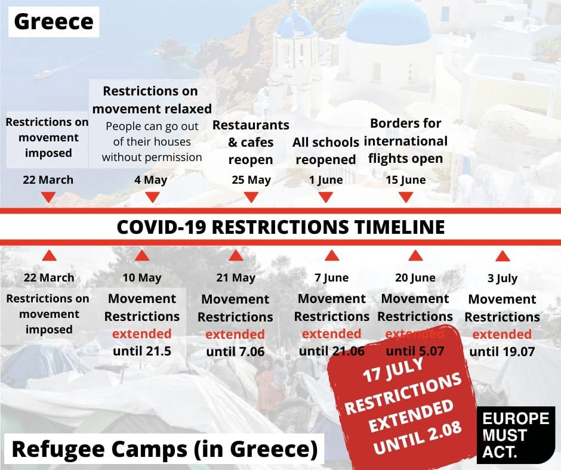

This means that 14,431 people stuck in Moria, 4,380 in Vial, as well as those in Vathi, on Leros and on Kos still can’t access basic services and are in fact imprisoned in the camps\.

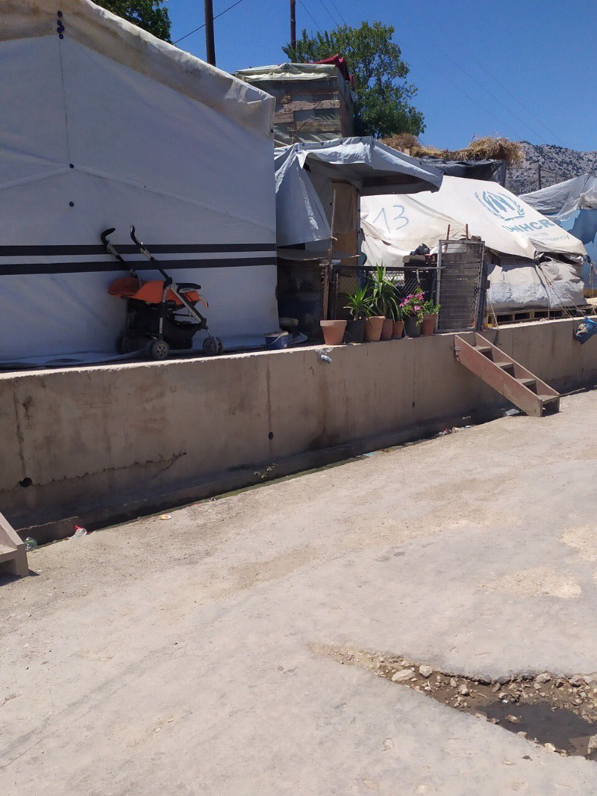

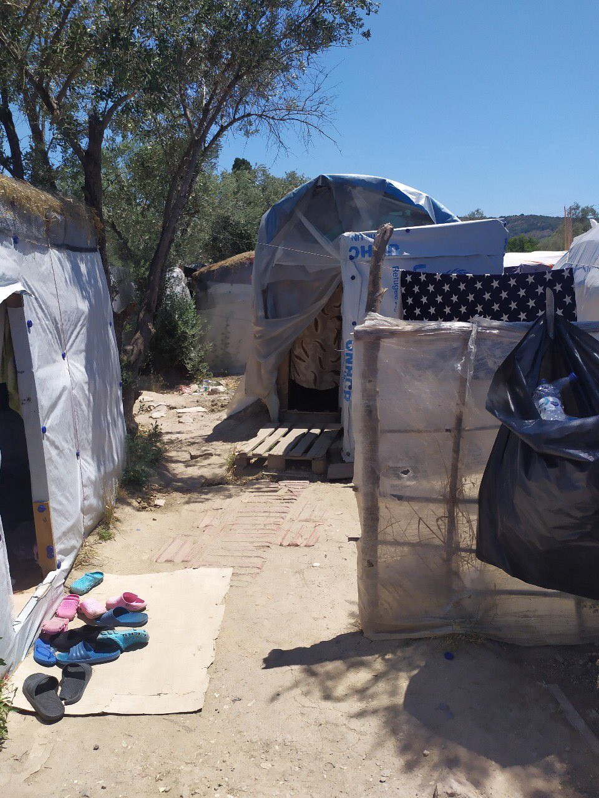

Vial Camp, Chios\. \(Photos by [RSA](https://twitter.com/rspaegean/status/1284494411884310528) \)
### Updates from Athens

[Hope Cafe — Refugee Soul Food](https://www.facebook.com/soulfoodforrefugees/posts/955379084936050) published an update on the situation in Athens after around 8,500 registered refugees have been tossed out of the system throughout Greece\.

> _After being housed by the UNHCR since they entered the system and receiving cash assistance monthly to feed their families , they find themselves homeless and penniless as a Greek citizen expected to find work and provide for themselves\._ 

> _Greeks themselves can not find work and rely on their families to survive \. These families don’t have anyone to hold their hand and offer them a bed or a meal \._ 

> _Our WhatsApp system is now not just full of requests from New arrivals needing support until they enter the asylum system\. It’s packed with families with children toddlers and babies sleeping in the parks on blankets \. It’s now averaging 35 degrees daily and these families do not have access to toilets , water , shelter or food \. Their prospects are desperate as they now have asylum in Greece and social support here for Refugees is none existent\._ 

Hope Cafe is supporting homeless families in Athens: Please, consider donating: [Paypal\.me/feedinghope](https://l.facebook.com/l.php?u=http%3A%2F%2FPaypal.me%2Ffeedinghope%3Ffbclid%3DIwAR1CQ6LJVllNwRsLx5CiAcykvUC7az1tiynnqhA0RTwhu4ok1fkXvZEGLv4&h=AT2oIIwKEB_IZyia4xtXGUfOzBRrX9N9pZ8xFyemuC0A1c4Ngr1ysUznQNN6jmkUr0fBlvPxL2eF-QYlkln84XBgRZdnPpzGsLT0mvVs_qGfZDpLvtu9LNDG8Kg_MhYWafoFdFI&__tn__=-UK-R&c[0]=AT3cqtt9byI23WpH-owqjeHwrPzkIyNPa8gxj2JY7FqvfiHqMQMs-AfwfnzWE40_jn_l6tcdg6tHcRy81b4-Mmjd1wFFZ7HGE1XC6tPKqgjv5mnFrRs4S39L293wzU_xvTT9TTa3LcMwHEG8mLFr7us7a19ORuUuBg_7O1ELKpcb_Yefp-oC0aSHTN8) — [www\.gofundme\.com/homelessfoodsupport](https://l.facebook.com/l.php?u=http%3A%2F%2Fwww.gofundme.com%2Fhomelessfoodsupport%3Ffbclid%3DIwAR1LJQHI9ksX3jvKMLsiDsPOdIAOULBxMgu6A5n-ctW-bSwg3yTSQw5Yi9I&h=AT3MUFqOet3IqY-mOsLLOOOwyY2R9pH6MscGz78yfeK7sTGYOb-b5vVum3ftXfWp8znWxWPjTxQQSHHncpcps6c2VWgA9Vqn4DCr-Ri_CBkyh1bqR6wBlljNO2oTA4tNQxWMiaQ&__tn__=-UK-R&c[0]=AT3cqtt9byI23WpH-owqjeHwrPzkIyNPa8gxj2JY7FqvfiHqMQMs-AfwfnzWE40_jn_l6tcdg6tHcRy81b4-Mmjd1wFFZ7HGE1XC6tPKqgjv5mnFrRs4S39L293wzU_xvTT9TTa3LcMwHEG8mLFr7us7a19ORuUuBg_7O1ELKpcb_Yefp-oC0aSHTN8)
### 6 people arrested in Greece for human smuggling

Greek authorities claim to have shut down a smuggling ring after the arrest and charging of 6 people in Athens and on the Ionian island of Corfu, media outlets [report](https://www.ekathimerini.com/254887/article/ekathimerini/news/traffickers-used-sailboats-to-ferry-migrants-to-italy?fbclid=IwAR0cfNabsRvebj_1haecm1kXIbGWg4a8QbG_be-qDMB8hfVkwQau0DJk12o) \. The group were using sailboats to bring people on the move to Italy, charging around €5,500 per person\. It is [reported](https://www.sn.at/politik/weltpolitik/migranten-in-lkw-in-griechenland-entdeckt-90384544?fbclid=IwAR2ftyksMZJ2IlsNviwRZ92J9qWQkKo9Pw3nxE19Ha5mMFHNOs0OBSHi9RM) that police arrested 28 people on the move over the weekend as part of this operation\.
### ATLAS \(Aid to LGBTQI Asylum Seekers\) Workshop in Athens

Zaatar — Non profit organisation will hold their [workshop on how to best support LGBTQI asylum seekers](https://www.facebook.com/zaatarngo/posts/3236056219748032) on Tuesday 21st and Wednesday 22nd\. Check the link for time slots and to sign up\.

> _What are the unconscious biases we might have as volunteers towards LGBTQ\+ asylum\-seekers? What is at stake — psychologically, politically, sociologically — when we want to support queer refugees?_ 

> _How can we provide assistance to LGBTQ\+ refugees without causing further damage, shame, or ignorance?_ 

### Volunteer Calls

Refugees 4 Refugees is looking for [volunteers in Moria, Lesvos](https://www.facebook.com/Refugee4Refugees/photos/a.317155631961452/1270617269948612)

ITALY
### Trial against Asso28 captain and owner for illegal push\-back in the Central Med

Preliminary investigations reached their end and a [trial will start in Naples regarding the push\-back of the 30th of July 2018](https://www.avvenire.it/attualita/pagine/caso-asso-28-processo-per-il-respingimento-di-101-migranti) \. On that day, 101 people were rescued from a dinghy near an oil rig by the Italian Asso28 ship, which operated for the Mellitah Oil & Gas company \(managed by Noc, a state oil company, of which Eni, the Italian energy company, is shareholder\) in support of the Sabratah oil rig\. Those 101 people were immediately brought back to Libya\. Luckily Open Arms was in the area, and recorded transmissions with the Asso28 and authorities on what was happening there\. Both Italian authorities and Eni representatives claimed that the whole operation was directed autonomously by the Libyan Coast Guard\. Libyan authorities — it was claimed — were present on the oil rig and on the Asso28, but their names did not appear in the first log book submitted by the ship, only to be added in a new version submitted months later\.

We’ll update as the trial continues\.
### Updates from Ventimiglia:

[Progetto 20k published an update](https://www.facebook.com/progetto20k/) on the situation at the French/Italian border:

> _The situation here is volatile\. 90, 100, 150 people are pushed\-back to Italy every day\. French police forces leave people inside containers for hours\. French authorities call them “waiting areas”, but they are prisons for people on the move\. One person we met was left in one of these containers from 10pm to 1pm of the following day, with no food or water\. They are dirty, overcrowded and so hot people struggle to breath\. Obviously in such condition, and sanitary measure or social distancing is impossible\. After months of pandemic emergency, French authorities seem to have forgot about Covid\-19\. Pregnant women, unaccompanied minors and people with health problem and flu symptoms are detained in the same containers\._ 

> _Italian authorities fail to check on those who are pushed\-back, aiding and abetting the illegal practice of their french counterparts\._ 

> _At the same time, ‘return fluxes’ have been increasing for a while, for the regularisation law for migrant workers boasted by the Italian government\. Many people are coming to Italy to buy fake contracts to benefit of the new law, paying up to 10,000€\._ 

> _The camp of the Red Cross is still on lockdown, with 20 people living inside\. It is possible that it will close soon\. People are left to sleep rough, on the beach, by the river, or by the train tracks… Within the town, police presence is massive, people on the move are constantly stopped and solidarians are pressured to stop distributing food and NFI\. Police is always present at distribution point, checking ID and interrupting activities\. A few days ago, the mayor interrupted Kesha Niya’s distribution telling volunteers they could not be there or distribute food to foreigners… Instead, distribution is still active every day at 8pm at the Gianchette carpark, near Lidl\._ 

SPAIN

**Moroccan workers returning home**

[The first ship sails on Saturday](https://elpais.com/espana/2020-07-18/comienza-el-regreso-de-las-temporeras-marroquies-atrapadas-en-huelva.html?utm_source=Facebook&ssm=FB_CM&fbclid=IwAR2spUeIsWSDo12srqCb785sbLIiBoFwQmlOX00mB4Wa3vI86S5uRylDhFw#Echobox=1595088356) with 1,221 of the 7,100 Moroccan workers who have been stuck in Spain after the closure of their country’s borders by the coronavirus crisis\. The ship will make the journey every other day until everyone has been taken home\.

**Arrivals to Gran Canaria**

[A boat carrying eight people](https://www.europapress.es/islas-canarias/noticia-rescatan-patera-ocho-migrantes-sur-gran-canaria-buscan-otra-salio-tarfaya-20200719130100.html?fbclid=IwAR3FPItZ35b8J9wZBgNuF40Me1gZSiQ92vtKMKggRH04hIoS0e27HNkZF34) was rescued by Salvamento Marítimo to the south of Gran Canaria, on Sunday, but another vessel is still being searched for\.

[Another eight people](https://www.europapress.es/andalucia/cadiz-00351/noticia-trasladan-barbate-cadiz-ocho-varones-llegados-patera-madrugada-20200718184902.html?fbclid=IwAR1GNxG0zc1PE2WZQBD2Z7xPp8lfncZFbaWcTnOC6Jw5Xr9FOKR2fjM1Rco) arrived on Saturday morning to the port of Barbate \(Cadiz\) \.

On Friday, [60 people were rescued by the ‘Nizar’](https://www.europapress.es/islas-canarias/noticia-rescatan-patera-60-migrantes-sur-fuerteventura-20200718111041.html?fbclid=IwAR1xlvQGI2mPXxEPxycQhHX3OPOey7j6oLymKGVOAGOSYCsRzwE627d1KaU) and taken to the port of Gran Tarajal\.

**Protests in Spain for the regularisation of people on the move**

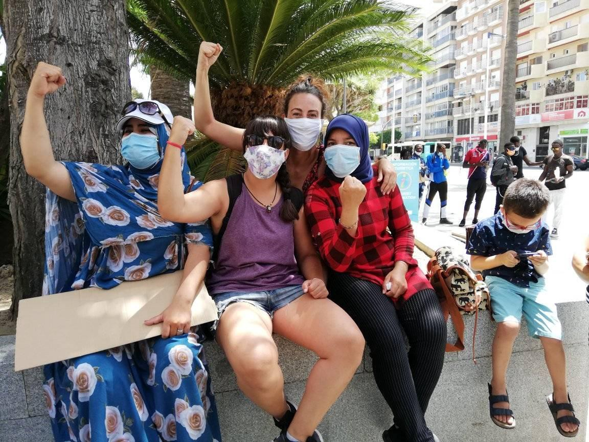

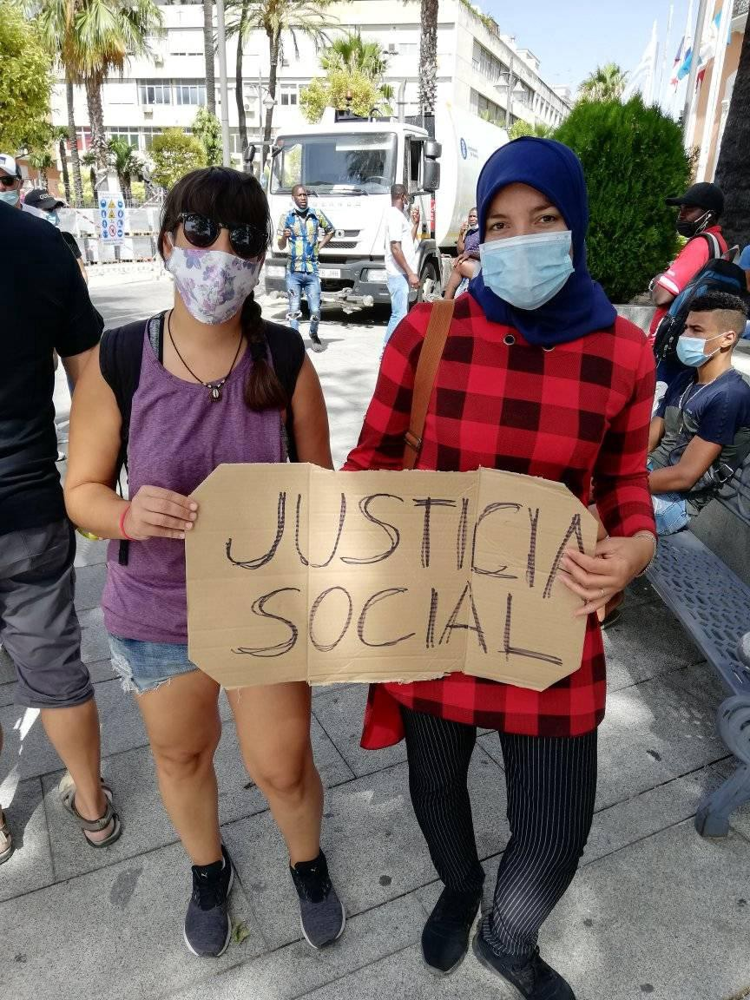

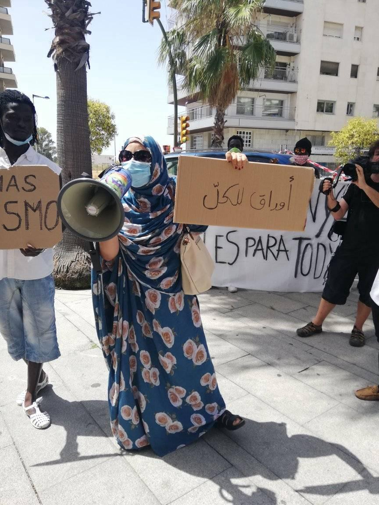

\(Photo Credit: [Papeles Para Todxs \#RegularizacionYa](https://web.facebook.com/permalink.php?story_fbid=151211743209922&id=103412274656536&hc_location=ufi) \)

> _We took to the streets this morning with many sisters from various anti\-racist associations, migrants and racialized throughout the territory\. We demand the Government and all government bodies of the Spanish state to approve the [\#NLPRegularizacionya](https://web.facebook.com/hashtag/nlpregularizacionya?__eep__=6&source=feed_text&epa=HASHTAG&__xts__%5B0%5D=68.ARAqbGPeovDTdsexIy8l_YzeSNz9iqq16xzuL8v2tJ2xvzPoO77MCkyZhsLykANhP7YPPSReuuJagKrEVLATpFmRReih5cd7sHvF6yRpUc0ys7T1VqKQOV6OKBZWBTmErnXT54CJJLcRLom63qo7xGGayGRXuw6YTa362d399dar63q3_rmEaA0rU0bLlw5sgZ8s3daujGr802QU0aoPH8ylJwOrP_EWTEzTgCfrzpcV3d_VFYfjHrmtf4CssykyjOk-C2OX1EmEV0g0PoxNS7ktnjSh7M3qS53CcQkP3l5jqH8zCjKFBsnsbw4nas3WCV1c9DlSt1SAmWrGUH6XciI&__tn__=%2ANK-R) so that more than 600 thousand migrants without papers can, after years of precarious work, instability and institutional violence, be regularized\. It’s not charity, it’s social justice\. [\#RegularizationYa](https://web.facebook.com/hashtag/regularizationya?__eep__=6&source=feed_text&epa=HASHTAG&__xts__%5B0%5D=68.ARAqbGPeovDTdsexIy8l_YzeSNz9iqq16xzuL8v2tJ2xvzPoO77MCkyZhsLykANhP7YPPSReuuJagKrEVLATpFmRReih5cd7sHvF6yRpUc0ys7T1VqKQOV6OKBZWBTmErnXT54CJJLcRLom63qo7xGGayGRXuw6YTa362d399dar63q3_rmEaA0rU0bLlw5sgZ8s3daujGr802QU0aoPH8ylJwOrP_EWTEzTgCfrzpcV3d_VFYfjHrmtf4CssykyjOk-C2OX1EmEV0g0PoxNS7ktnjSh7M3qS53CcQkP3l5jqH8zCjKFBsnsbw4nas3WCV1c9DlSt1SAmWrGUH6XciI&__tn__=%2ANK-R)_ 

> _Valencia_ 
 

> _Málaga_ 
 

> _Huelva_ 
 

> _To Coruña_ 

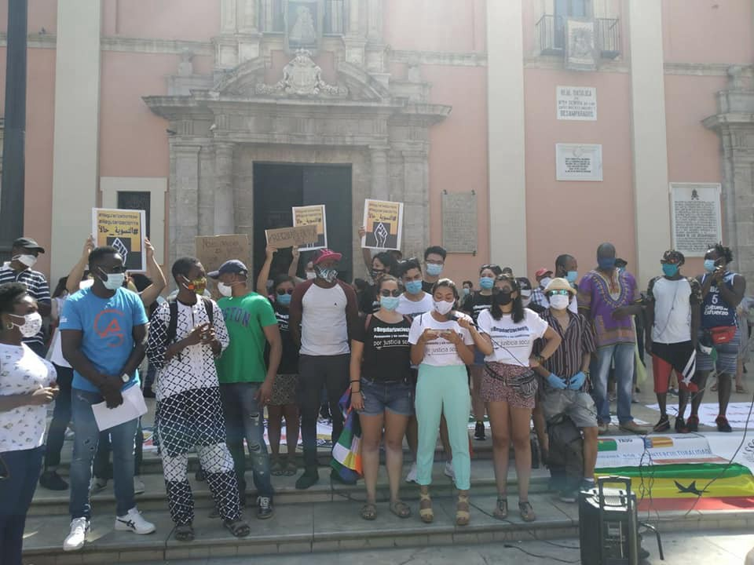

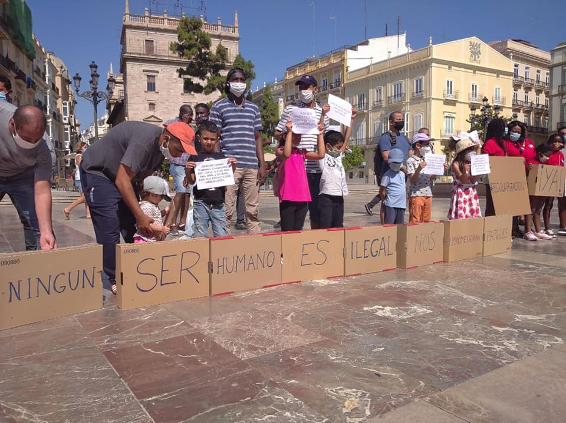

\(Photo Credit: [Papeles Para Todxs \#RegularizacionYa](https://web.facebook.com/permalink.php?story_fbid=151211743209922&id=103412274656536&hc_location=ufi) \)

**Two people arrested**

[National Police officers have arrested](https://www.europapress.es/videos/video-detenidos-dos-patrones-pateras-encargados-traer-migrantes-argelia-20200717111257.html?fbclid=IwAR26udsj1FnINyJHKgfGxwIMAm2_iGfQHE5LwEfF9I4Dc92kSKkDtzL7qhE) two 30\-year\-old individuals thought to be members of a criminal organization dedicated to the trafficking of human beings from Algeria to the coast of Murcia\.

BALKANS

**No Name Kitchen still need support**

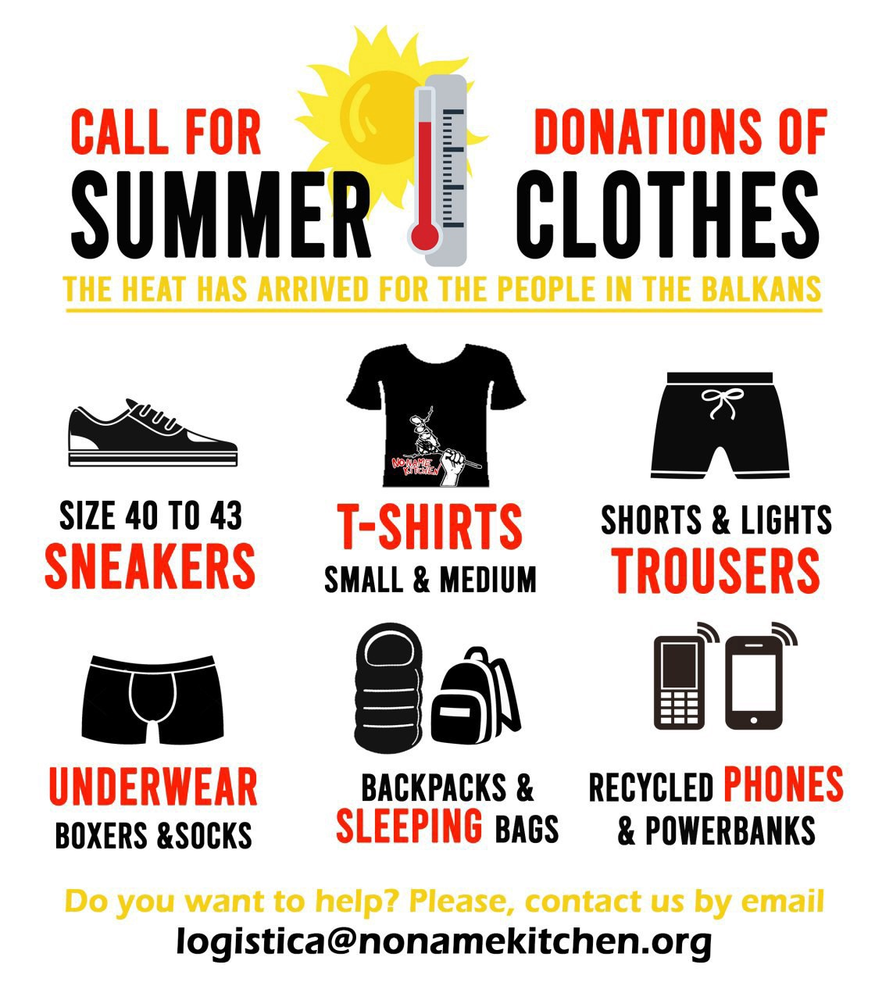

The number of people they support has doubled in recent days to around 120 people, to whom they provide food, clothes, sleeping bags, tents, and basic health services in and around Šid, Serbia\.

> _Many have asked us why people live in the jungle instead of the camps, the reasons are numerous\. First of all, all three camps around Sid \(Principovac, Adasevci and “family camp”\) are full\. They do not accept any more POM but they give papers that recommend them to go by their means to other camps, usually hundreds of kilometers from here\. Secondly, the camps are overcrowded and often characterized by ethnic tensions\. In Principovac, rooms host between 6 to 15 people with two tents on the outside where dozens of bunk beds are cramped on one another\. Finally, what is likely to be the main reason, freedom\. In the camp, people need to carry an ID at all times and they are restricted in their movement\._ 

> _Many have described the camps to us as a prison\. Until last week, the army stationed in front of all the camps’ entrances and with the excuse of containing the pandemic has not allowed anyone to enter or leave for more than three, long months\._ 

**98 people prevented from entering Bosnia**

[Media report](http://www.uskinfo.ba/vijest/video-stotinu-migranata-ponovo-pjeske-pokusalo-preko-rijeke-drine-uci-u-bih/77904?fbclid=IwAR13GDZFvQPqhxbYTur9U2DniRXiulbiP_vdEssEieg_CSlK3ffFPgWn7T4) that 98 people tried to cross into Bosnia from Serbia over the Drina River\. It is not mentioned whether the Bosnian police who prevented their entry asked them whether they wished to claim asylum, but I think we know the answer to this…

SERBIA
### [Updates](https://us15.campaign-archive.com/?u=c7e9b46d2628a21e41a33163e&id=a3cf05c10e&fbclid=IwAR1GaWx775NrVPucDNWbe62T37X17ipx6N7pugm3-wUh54DTgyhOid-zRCo) from InfoPark

InfoPark has been a partner of UNICEF in an initiative which resulted in a regional analysis entitled “ [Making the Invisible Visible: the identification of unaccompanied and separated girls in Bulgaria, Greece, Italy and Serbia](https://www.unicef.org/eca/reports/unaccompanied-and-separated-girls-europe?fbclid=IwAR3ChqA_fGIjJoZQM85nDKt3x-QHmwh8A2xeoSuaPT8rR4kl2jgEYzG0kw8) ” and a practical tool accompanying it\. It will be launched in Belgrade on Thursday 23rd of July\.

At the beginning of June, the group’s program for unaccompanied boys ‘Superboys’, will restart in Belgrade after a three months break and will land in Bogovadja AC\.

FRANCE

**Attempted crossings to UK intercepted**

[At around 4\.30am on Sunday 19th](https://www.radio6.fr/article-52644-sept-migrants-secourus-au-large-de-calais.html?fbclid=IwAR2yH4o-leCX83opbtsSHYumJ17omN2o8FT_uQYcgsrZilX0Blszv8JGtAc) , a boat in difficulty with seven people on board was spotted about 2 kilometres off the coast of Calais\. The tug Abeille Languedoc was hired by the CROSS Gris\-Nez to rescue them\. They were handed over to the border police\.

[On the morning of Friday 17th](https://www.radio6.fr/article-52636-18-migrants-secourus-ce-matin-entre-calais-et-touquet.html?fbclid=IwAR0sY8-e60ZLqX2yzTaLQL-VHYOBQVGEpjwG04MP9NQVl8EEUTEiik0S6Ik) , a kayak was spotted off the coast of Calais\. Then shortly before 8:00 a\.m\., a boat with another 15 people on board was spotted with a failing engine off Le Touquet\. They were dropped off at the port of Boulogne and handed over to the border police\.

The current well being of these people is not known, but the abuses of the French border police are [well documented\.](https://www.amnesty.org/en/documents/eur21/1585/2019/en/)

EUROPE
### Ministerial conference on combating illegal migration on the Eastern Med

Media [report](https://orf.at/stories/3174196/) that a ministerial conference to combat what they term as ‘illegal migration’ on the eastern Mediterranean routes will take place in Vienna on Wednesday and Thursday \(22nd and 23rd July\) at the invitation of Interior Minister Karl Nehammer \(ÖVP\) \. Ministries from Germany, Denmark, Greece, Slovenia, the Czech Republic and Hungary will be there\. State Secretaries from Poland and Slovakia are expected as well as representatives of the EU Commission, the EU Commissioner for Enlargement and European Neighbourhood Policy, EASO, Frontex, ICMPD and Switzerland\.

This has been interpreted as a strengthening of the support for Greece’s appalling policies at the land and sea borders, and for the brutal policing and the chain push\-backs throughout the Balkans\.

Human Rights? Refugee Convention? Nothing more than inconveniences\.
### EASO’s figures on [asylum trends for May](https://www.easo.europa.eu/news-events/asylum-applications-eu-remain-limited-may)
- Despite the slow lifting of containment measures across most EU\+ countries, asylum applications remained significantly reduced \(10,200 applications in May, \-84% than in January, 65,692\) in May compared to pre\-COVID levels\.
- Several Member States remained in a state of health emergency, with many only providing for the pre\-registration of new asylum applications, but not their formal lodging\.
- **Syrians, Afghans** and **Iraqis** continued to lodge the most applications, accounting for a third of all applications lodged in May\.

At least 27 300 decisions were issued by asylum authorities \(first instance\) in May, down by 42% from February\.
### ECJ rule on ‘Dublin’ deportations

In the case lodged by an Eritrean asylum seeker who appealed their rejection by German authorities — who intend sending them back to Italy, where they were first registered — the European court [ruled](https://www.rnd.de/politik/abschiebung-in-anderes-eu-land-asylsuchende-haben-recht-auf-personliche-anhorung-X57747KUOBI4QRNVXDYLS24ESQ.html?fbclid=IwAR1Ajxc6o-FVz-vsEKF2185jOjuIXySWMyPzcBpO0syDs6onl-HTxzDv0dQ) that “If an asylum seeker is to be deported to another EU country, they have the right to a personal interview, \[…to\] demonstrate whether the other EU country can actually offer him protection”\.

WORTH READING
- [**An open letter to an asylum seeker… stranded in our seas**](https://timesofmalta.com/articles/view/an-open-letter-to-an-asylum-seeker-stranded-in-our-seas.805578) by Anne Pace and Jacqueline Grima, Malta
- [**What fate for the Venezuelan migrants stranded in Peru?**](https://www.opendemocracy.net/en/pandemic-border/what-fate-venezuelan-migrants-stranded-peru/?fbclid=IwAR2kZoHrqdaWGaZEUm6lNH3zLipVGgueG5a3f2iHgMKN5aboigR_P_Qddrs) — article from open democracy regarding Peru and other countries of destination having a moral duty towards vulnerable migrants and refugees\.
- Tune in Friday, July 24 at 11:30 am EST / 5:30 pm CET / 6:30 pm Syria time for another edition of [**Latitude Adjustment LIVE**](https://www.facebook.com/latitudeadjustmentpodcast/videos/323548045361897/) \. “This week’s guest is **aid worker Nour Qurmoush who will be coming to us from Idlib, Syria** to talk about life under 9 years of war and the current situation for internally displaced peoples\.”
- [**Invisible workers: Underpaid, exploited and put at risk on Europe’s farms\.**](https://www.euronews.com/2020/07/17/invisible-workers-underpaid-exploited-and-put-at-risk-on-europe-s-farms) Videos, testimonies and analyses of the situation of migrant workers in Europe\.
- [**Burnout and activism fatigue\. How to deal with it** ?](https://www.self.com/story/activism-fatigue?fbclid=IwAR3K0ODjSSMqFCwwU0WWl1e-u17uzek0On_inNRl2UAQ1HJXCDB7fngZZj4)

**If you wish to contribute, either by writing a report or a story, or by joining the info gathering team, please let us know\.**

**We strive to echo correct news from the ground through collaboration and fairness\. Every effort has been made to credit organisations and individuals with regard to the supply of information, video, and photo material \(in cases where the source wanted to be accredited\) \. Please notify us regarding corrections\.**

**If there’s anything you want to share or comment, contact us through Facebook, Twitter or write to: areyousyrious@gmail\.com**
### [Are You Syrious?](https://medium.com/are-you-syrious?source=post_sidebar--------------------------post_sidebar-)
#### Daily news digests from the field, mainly for volunteers…

Daily news digests from the field, for volunteers, people on the move, journalists, and the general public [Take a look](https://medium.com/are-you-syrious/newsletters/ays-daily-newsletter?source=newsletter_v3_promo--------------------------newsletter_v3_promo-)
- [Digest](https://medium.com/tag/digest)
- [BlackLivesMatter](https://medium.com/tag/blacklivesmatter)
- [Police Brutality](https://medium.com/tag/police-brutality)
- [Racism](https://medium.com/tag/racism)
- [Refugees](https://medium.com/tag/refugees)

_Converted [Medium Post](https://medium.com/are-you-syrious/ays-weekend-digest-18-19-7-2020-endemic-police-racism-in-tuzla-6a72f51388f9) by [ZMediumToMarkdown](https://github.com/ZhgChgLi/ZMediumToMarkdown)._
