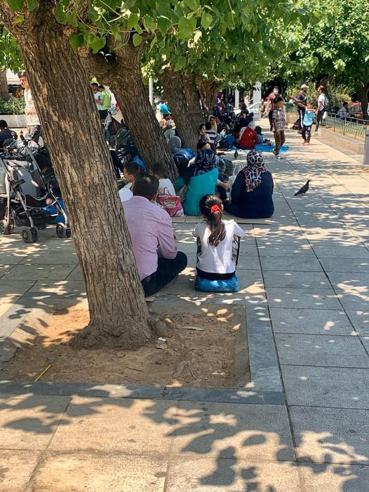

### AYS Daily Digest 27/07/20 Worrying asylum backlog and detention lengths in Sweden
#### Over 90 people rescued brought to Malta // person stabbed to death in Moria // continued documented violence in Croatia // and more…

](assets/ba27198ee92d/1*iAPa8UcrV0-6FM2MIFA0ow.jpeg)

Photo from 2016 of a unaccompanied 16 year old minor in their group home in Gothenburg, Sweden\. The asylum case backlog is so long that many people who applied in 2016 are still waiting for an answer\. — — — Photo by [Lydia Gall/HRW](https://www.hrw.org/report/2016/06/09/seeking-refuge/unaccompanied-children-sweden#)
### FEATURE: In Sweden backlogged cases, lengthy detention, and lower expected asylum cases due to COVID\-19

In the latest updates on Sweden’s asylum polices and response under COVID\-19, there remains little good news in regards to the number of cases backlogged, the length of time people are forced to stay in detention, and the number of new asylum cases for 2020\.

**In regards to the [backlog of cases](https://www.svt.se/nyheter/inrikes/allt-farre-migrationsmal-avgors-tusentals-fast-i-asylprocessen?fbclid=IwAR0OdEghomnzPJrk0AO1dKmfm6LbuAyhVVaLq0eokB0MfbER9Y7HwbMP-hA) , it has only increased and thousands of asylum seekers are stuck in the process because of COVID\-19\.** There are around 60 percent less cases being overseen by the four different Migration Courts this year compared to the three previous years\. This means that more than half of the proceedings pending before the Migration Courts have been postponed due to COVID\-19\. Many of the people whose cases are pending, after first being rejected by the Migration Agency, came to Sweden during the fall of 2015 — which means that they have been waiting for almost four years at this point, unable to get a real chance to actually restart their lives\.

Swedish media has also just covered [Mustafa Huseini’s story](https://www.svt.se/nyheter/inrikes/coronapandemin-forsvarar-utvisningar-mustafa-har-varit-inlast-i-fem-manader?fbclid=IwAR0HM3IO6s8pIMF-3ASqBK-EN5cvnQuleG-xNEaOxdWrb19AyXGXV-cGtqg) \(age 20\): he has been locked up in one of the Migration Agency’s detention facilities for more than five months, waiting to be deported back to Afghanistan\. Some people have been released from the facility, since the Migration agency decreased their total capacity in the detention facilities because of COVID\-19\. But Mustafa’s story is not unique — **Sweden is one of the countries in the EU that allows asylum seekers to be locked up during the longest period of time\.** 6, 7, 9 months — this is nothing unusual\.

Finally, news from [the Migration Agency](https://www.migrationsverket.se/Om-Migrationsverket/Pressrum/Nyhetsarkiv/Nyhetsarkiv-2020/2020-07-27-Tydliga-pandemieffekter-i-Migrationsverkets-verksamhet.html?fbclid=IwAR1flI4a_dsc57uTuXMJGRO-y5dTl_doYdWbyAbcGsH0App3J62rf8v0Law) states that **the overall number of applications in 2020 is expected to be 13,000** , down from an estimated 21,000 before the pandemic\. 13,000 asylum seekers/applications is a record low figure: there has not been that few people applying for asylum in Sweden in many, many years — 1999 the number was 11,000\.
#### ALGERIA

Update from UN official on expulsions:

■■■■■■■■■■■■■■ 
> **[vincent cochetel](https://twitter.com/cochetel) @ Twitter Says:** 

> > New mass expulsion from #Algeria to #Niger. Out of the 361 persons, only 17 are from Niger. The rest are migrants or refugees from Mali, Sudan, Nigeria, Burkina Faso. Expulsions without due process should stop &amp; adequate safeguards must be put in place. 

> **Tweeted at [2020-07-27 13:26:42](https://twitter.com/cochetel/status/1287741203614703616).** 

■■■■■■■■■■■■■■ 

#### SEA
### 95 rescued people were brought safely to Malta

[AlarmPhone](https://timesofmalta.com/articles/view/group-of-95-rescued-migrants-to-be-brought-to-malta.807759) first got the call of a sinking ship on Sunday morning\. The ship was denied rescue for 35 hours and the health condition of those on board is currently unknown\. AlarmPhone has warned that Maltese authorities are regularly dismissive of the hotline’s attempts to reach out and hang up their calls\. So the struggle continues…

■■■■■■■■■■■■■■ 
> **[Alarm Phone](https://twitter.com/alarm_phone) @ Twitter Says:** 

> > 🔴Two shipwrecks off #Tunisia yesterday!

Following news sources, a shipwreck occurred near #Melloulech - 1 body found, 13 people rescued, number of the missing unknown.

A 2nd shipwreck occurred between #Zarzis &amp; #Djerba - a man died, 6 people rescued, 4 missing. 

#BordersKill 

> **Tweeted at [2020-07-27 15:58:24](https://twitter.com/alarm_phone/status/1287779377716121600).** 

■■■■■■■■■■■■■■ 

](assets/ba27198ee92d/1*QHS0RXCPDQ-F7UpyKrNaYg.jpeg)

387 people were rescued at sea last week… Photo by [IOM](https://twitter.com/IOM_Libya/status/1287807190271696896?fbclid=IwAR1flI4a_dsc57uTuXMJGRO-y5dTl_doYdWbyAbcGsH0App3J62rf8v0Law)
#### GREECE

](assets/ba27198ee92d/1*BWrFZs7mINy2TO8zlcqm2w.jpeg)

Photos by [Kerrie Moor](https://www.facebook.com/kerrie.moor/posts/10158378231214544)

Update provided by [Kerrie Moor](https://www.facebook.com/kerrie.moor/posts/10158378231214544) about the concerning situation that is only growing in Victoria, Athens:

> “The majority of these families had their asylum cases accepted and were given residency in Greece\. Their cash card assistance were stopped and they were put out of their UNHCR homes\. The numbers are rising daily\. Just to serve them a croissant breakfast we would need €150 a day\. Plus €90 for bottles of water\. Organisations are breaking under the pressure here\. We need your support more than ever \. If you can support please inbox to talk about a plan\.” 

Unfortunately there has been another death in [Moria](https://www.kathimerini.gr/1089584/article/epikairothta/ellada/aimathrh-symplokh-me-enan-nekro-sth-moria) \. A 21 year old man was stabbed to death early on Monday morning over a disagreement\. Another young man has been arrested\. There have now been [6 cases of manslaughter](https://twitter.com/g_christides/status/1287819700592881670?fbclid=IwAR2cd5ZBMAbfc5oK3rOn71YCb_Cw98NxIwv2POrIlvpWU8kIsSDCyL2R8eM) in Moria so far in 2020\. When you put people in cages with little hope, it becomes a recipe for violence\. Free the people in Moria from this dehumanizing, killing cage\.

■■■■■■■■■■■■■■ 
> **[Daphne Tolis](https://twitter.com/daphnetoli) @ Twitter Says:** 

> > The 163 individuals that have been placed in quarantine at Megala Therma in northern #Lesvos since July 24 (after arriving from Turkey to Greece) have tested negative to #COVIDー19. 

> **Tweeted at [2020-07-27 19:53:40](https://twitter.com/daphnetoli/status/1287838588068036609).** 

■■■■■■■■■■■■■■ 

#### BOSNIA AND HERZEGOVINA

![Although not present in the mainstream media, thousands still roam around Bosnia and Herzegovina as the officials and international organisations have failed in providing the basic conditions to protect them from a wide range of life threatening circumstances they are forced to go through in a daily basis\. The few field teams and locals report of a large number of people in Velika Kladusa who are left alone in every possible way and sense of the word\. There are no new feasible solutions from any of the stake holders “in charge” of the situation… Photo by [CBA](https://www.facebook.com/CroatianBaptistAid/posts/1412507968944590)](assets/ba27198ee92d/1*xprXLPaLPI7ATcjpZ2du5w.jpeg)

Although not present in the mainstream media, thousands still roam around Bosnia and Herzegovina as the officials and international organisations have failed in providing the basic conditions to protect them from a wide range of life threatening circumstances they are forced to go through in a daily basis\. The few field teams and locals report of a large number of people in Velika Kladusa who are left alone in every possible way and sense of the word\. There are no new feasible solutions from any of the stake holders “in charge” of the situation… Photo by [CBA](https://www.facebook.com/CroatianBaptistAid/posts/1412507968944590)
#### CROATIA

The mainstream media is giving attention to some of the worrying practices along the Croatian border with Bosnia Herzegovina and Serbia, practices that AYS and other on the ground outlets have been reporting on for some time\. [This DW article](https://www.dw.com/hr/nasilje-nad-izbjeglicama-u-hrvatskoj-postaje-sve-raznovrsnije/a-54321929) is bringing to mainstream light important research and advocacy about the torture of refugee children, the increased number of deaths at the border, and other forms of abuse against refugees along Croatia that are no longer receiving much public attention\. Marijana Hameršak, an anthropologist from the Zagreb Institute of Ethnology and Folklore Research, and a researcher for “European Regime of Irregulated Migration on the Periphery of the EU” said:

> “Even before the corona\. This can be attributed to the fact that we are facing today, that our media are paying less and less attention to this topic\. It is already ‘chewed’ for them, \[refugees are\] no longer an attractive commodity on the market\.” 

While the general public is involved with other pressing matters in their day to day life, no one should ever turn their back on torture and police brutality\. We must continue bringing these issues to light, no matter the public “appetite” for such news…
#### GERMANY

NoBorder Assembly Berlin is trying to raise awareness to demand that Lufthansa stop facilitating deportations\! Learn about it [here](https://twitter.com/NoBorder_Berlin/status/1287685202039447553) :

■■■■■■■■■■■■■■ 
> **[No Border Assembly Berlin](https://twitter.com/NoBorder_Berlin) @ Twitter Says:** 

> > In 2019, 5,885 people were deported on aircrafts of @[Lufthansa_DE](https://twitter.com/Lufthansa_DE)
That is 5,885 too many! 

Join today's social media campaign to demand Lufthansa to #SayNoToDeportations!
#Abschiebefrei https://t.co/hZR2vjSk0F 

> **Tweeted at [2020-07-27 09:44:10](https://twitter.com/noborder_berlin/status/1287685202039447553).** 

■■■■■■■■■■■■■■ 

#### FRANCE

[Solidarité migrants Wilson](https://www.facebook.com/permalink.php?story_fbid=1494734317394002&id=598228360377940) just posted an update on needing volunteers for:

> “EVACUATIONS OF THE SAINT\-DENIS CANAL IN PARIS\-AUBERVILLIERS WEDNESDAY, JULY 29\! → NEED VOLUNTEERS ON\-SITE FROM 5 PM FOR:
 

>  → Helping to save material that can be restored once cleaned and disinfected\. And who without this will be destroyed by prefectures and cities\.
 

>  → Observing police operations and ensuring that things go smoothly and without violence\. Testify what’s going on by your words, in photos or video… Spread the info\.
 

>  → Trying to figure out \(where people are taken\) because the government is still so opaque\. As always, the authorities are preparing this \#EvacDeMerde in full opacity\. Can’t get a 100 % secure confirmation\. We don’t know where people will be taken\.” 

**Find daily updates and special reports on our [Medium page](https://medium.com/are-you-syrious) \.**

**If you wish to contribute, either by writing a report or a story, or by joining the info gathering team, please let us know\.**

**We strive to echo correct news from the ground through collaboration and fairness\. Every effort has been made to credit organisations and individuals with regard to the supply of information, video, and photo material \(in cases where the source wanted to be accredited\) \. Please notify us regarding corrections\.**

**If there’s anything you want to share or comment, contact us through Facebook, Twitter or write to: areyousyrious@gmail\.com**

_Converted [Medium Post](https://medium.com/are-you-syrious/ays-daily-digest-27-07-20-worrying-asylum-backlog-and-detention-lengths-in-sweden-ba27198ee92d) by [ZMediumToMarkdown](https://github.com/ZhgChgLi/ZMediumToMarkdown)._
