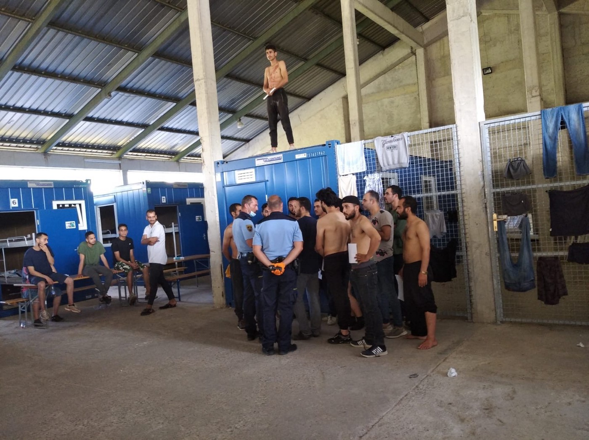
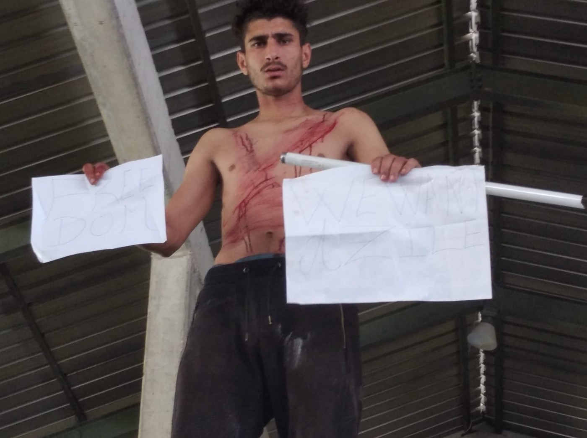

### AYS Daily Digest 31/07/2020: A last desperate attempt for asylum: inside the **‘Centre for Aliens” Slovenia\.**

Family separation and deportation in The Netherlands // Campaign for the _Iuventa 10 //_ Libyan authorities kill two Sudanese migrants // Croatia beat and pushed\-back a 15\-year\-old boy // English Channel crossings\.

### **Feature:**

**Protests by Those Deprived of Applying for Asylum in Postojna ‘Centre for Aliens’, Slovenia**

The _Centre for Aliens_ in Postojna is a prison\-like institution where foreigners who are ‘not welcome’ in Slovenia, are detained\.

At present, there are approximately 200 people being detained in the _Centre for Aliens\._ The detainees are both asylum seekers, as well as those who have recently arrived to Slovenia via the Balkan route, and were subsequently illegally denied the opportunity to apply for asylum\. The latter group are expected to be returned to Croatia and then further on to Bosnia & Herzegovina\.

Furthermore, Slovenia does not formally extradite people to a number of different countries\. Thus, the entire premise for this institution is that these ‘unwelcome’ people who were able to apply for asylum will cave under the prison\-like conditions in and eventually leave the country voluntarily\.

The protest on Tuesday was a demonstration of the plight of people who have risked everything to come to Europe, only to find that their fundamental rights are being ignored\.

Footage of the protest shows a detainee cutting his skin in the area of the upper body and neck to protest the humiliating treatment and the involuntary & illegal deportations\. [The protest also involved a number of detainees](https://www.facebook.com/ambasadarog/posts/1203048166696484?__xts__%5B0%5D=68.ARDmg3DiQo7Ea-HeDbCk4NdLVyq_8a2f0yXRZeRiS79tBpHYrS9Y5QDDgmp4clFvSCQjk87QgO3LMS5ZCDjJskVTKSuzmTcgmk4gCJZTlwo_T73A_G72K7yunYqXKOcQ_lXfNI2D6suBT4kCUl14-8UAtGqB-8EjAjA24UXbU93XtFH1pRpPK-b0vmwR-emY3tQgS-ZkXjU2evtBIYBF5x1XSkHd8-gMlOTxpy2NGh4hX67i_X-d5P7AujAuuxoCmsLiJ0GlMjRIOIhJ6sHak520MXPCiUye_YO_PJEo-0uFachYH3ftX8mrWinqIBVVfdC24s1eBJJ7ENOSemlEbKnQUg&__tn__=-R) showing white papers demanding their right to “freedom of movement”\.

The majority of people in the centre are housed in containers\. Food is distributed through a fence\. There is no provision of hygiene products or fresh clothes\.There has been a large increase in the number of asylum seekers who are detained within the centre in Postojna, which is a result of a new policy introduced during the COVID\-19 pandemic\. To facilitate this increase in asylum seekers and ‘would\-be’ asylum seekers, some ad hoc infrastructure has been constructed on the premises of the detention centre, similar to \(if not worse than\) those constructed in IOM run centres in Bosnia\. This centre in Slovenia has numerous parallels to the “Hungarian model” of detention centres, that were recently condemned by the [European court of Human Rights](https://www.amnesty.org/en/latest/news/2020/05/hungary-european-court-declares-authorities-broke-eu-law-by-detaining-asylum-seekers-in-transit-zone/) \.

Many of the people inside are faced with deportation to Croatia, where the authorities will deport them further to Bosnia & Herzegovina\. These deportations are happening under a readmission agreement\. In many cases those being deported do not know that they will be deported until the moment police arrive to take them to the border\. This kind of action by the police demonstrates a systemic violation of basic human rights\. With an increasing number of readmissions from Italy to Slovenia, the detention centre in Postojna can be viewed as part of infrastructure involved in chain pushback, starting in Italy and ending in Bosnia & Herzegovina\.

The protest was held only one week after a [Slovenian administrative court ruled in favour of a person from Cameroon](https://www.borderviolence.eu/wp-content/uploads/PRESS-KIT-FOR-INTERNATIONAL-MEDIA.pdf) , who had been [denied](https://balkaninsight.com/2020/07/28/slovenian-court-ruling-a-boost-in-battle-against-refugee-pushbacks/) the opportunity to apply for asylum, on the grounds that: “Republic of Slovenia has violated the Applicant’s right to asylum \(Article 18 of the EU Charter of Fundamental Rights\), the prohibition of collective expulsions \(Article 19 § 1\) and the principle of non\-refoulement”\. His case is identical to that of around 20 000 people, including the cases of those seen protesting in the videos and photos\.

This demonstration is their asylum application, as there seems to be no other way for them to apply\.

The above report was produced by volunteers Info Kolpa\. Additionally, the ongoing situation is being monitored closely by AYS, and an upcoming feature article will be published in the coming days\.
### Netherlands

[Eleven UN human rights experts](https://www.scoop.co.nz/stories/WO2007/S00246/the-netherlands-reunite-refugee-family-with-their-children-dont-deport-the-parents.htm?fbclid=IwAR2fS4fSS3TSLLdD-ZBxu0b_rhFMkOGKQvV_3-AiOxbx_Pr51IcSrhbHgdQ) , have called on the Netherlands to refrain from deporting two Ugandan refugee parents and their baby as it would separate them from their other children\. The Special Rapporteur on contemporary forms of racism, the Working Group of Experts on People of African Descent and the Working Group on discrimination against women and girls expressed serious concerns over the Dutch Immigration and Naturalisation Service’s intention to revoke the refugee status of Jude Kasangaki and Anita Mavita and deport them to Uganda, along with their youngest child, a one\-year\-old boy, while leaving their other seven children scattered across five foster homes in the Netherlands\.

> The experts stated that: “Deportation of the parents and the youngest child would irrevocably separate the seven children from their parents, disregarding their best interests,”\. They further stated that “The children remaining in the Netherlands might never again see their parents or their baby brother\. Such a move would violate the right to family life and unity as guaranteed by the Convention on the Rights of the Child,” 

These remaining children, all under the age of 12, were forcibly removed from their parents in 2018\. The circumstances of the removal have been challenged in the court by the parents and have received criticism from UN human rights experts\.

> The group of experts said: “The removal of the children from their parents appears to have been influenced by racial and cultural biases that resulted in discriminatory treatment,” “We urge the Netherlands to reconsider the deportation, set forth a family reunification plan, and do an independent assessment of this case to determine what solution is in the children’s best interests\.” 

### Tunisia

Local [Tunisian](https://www.repubblica.it/cronaca/2020/07/30/news/migranti_alarm_phone_naufragio_al_largo_tunisia_24_dispersi-263254246/?fbclid=IwAR1GetnK8yJjsKOCWTNnz6DtgdZodn5ej3jiQKR6rpqcTRU50TYL0v-eZ8s) media reported on Thursday about a shipwreck which occured off the coast of Mehdia, Tunisia\. One man was rescued after spending four days at sea\. 24 people are still missing\. This was the [third shipwreck](https://twitter.com/alarm_phone/status/1288729633106595840?s=20) found off the Tunisian coast this week\.

### Italy

In light of the increasing migration movements, Italy is setting up a ‘ [quarantine ship](https://www.stol.it/artikel/chronik/italien-richtet-quarantaeneschiff-vor-lampedusa-ein?fbclid=IwAR3X3PHz009kig8v6N9OZpF78m9sRBgIo2wb4wC0kXFGQOXXPCwOd0w_o8I) ’ for migrants who independently reach the southern Mediterranean island of Lampedusa\. The ship is scheduled to anchor between Lampedusa and Porto Empedocle in the next few days, the Italian Interior Ministry announced in Rome on Friday\. The ship has a capacity for 700 people on board\. The Ministry of the Interior also wants to set up a smaller quarantine ship that is to be anchored off Calabria\.

[_Amnesty International_](https://www.amnesty.org/en/latest/news/2020/07/italy-crew-of-rescue-ship-face-20-years-in-jail-on-third-anniversary-of-smuggling-investigation/?fbclid=IwAR2_zOxpk3kYssZFek2BQRsftINuUnqcnDHfvKuTeAtR55kJsjBdBT8EUPk) has launched a global solidarity campaign for ten crew members of the search and rescue ship _Iuventa\._ The campaign calls on the Italian prosecutor to drop the judicial investigation against the “Iuventa 10” who have been charged with “facilitating the irregular entry” of migrants into Italy, which may result in a prison sentence of up to 20 years\. In reality, what the “Iuventa 10" are responsible for is saving the lives of more than 14,000 people at sea\.

> “The criminalisation of rescue at sea has hampered vital lifesaving activities in the Central Mediterranean, and it is part of a wider crackdown on acts of solidarity across Europe\. Wrapped up with the fate of these ten men and women are the fates of hundreds of others and thousands of refugees and migrants they are helping\.” “Three years after the baseless criminal investigation began, the Iuventa 10 crew remain in limbo with the threat of long jail terms hanging over them said Maria Serrano, Amnesty campaigner on migration\.” 

Amnesty international report that prosecutors in the case allege that during three rescues that took place in 2016 and 2017 the _Iuventa_ crew arranged for a direct handover of refugees and migrants from the smugglers and then they returned the empty boats back to the smugglers\. The _Iuventa_ crew have denied all accusations\. A computerised reconstruction by Forensic Oceanography of the three rescue incidents has demonstrated the “Iuventa 10” were saving lives\.

> “Our forensic study aimed at assessing the allegations of the Italian authorities\. The results are clear: There is no evidence of collusion between the Iuventa’s crew and smugglers,” said Lorenzo Pezzani, a researcher at Goldsmiths University London, Forensic Oceanography\. 

It’s imperative to recognise that the _Iuventa_ case is not an isolated one\. Across Europe, a growing wave of repression and harassment has been launched at activist and solidarity organisations who assist refugees and migrants\. Authorities across Europe have been misusing and abusing anti\-smuggling laws to criminalise human rights defenders and punish solidarity\.

To read the full press release [visit the link](https://www.amnesty.org/en/latest/news/2020/07/italy-crew-of-rescue-ship-face-20-years-in-jail-on-third-anniversary-of-smuggling-investigation/?fbclid=IwAR2_zOxpk3kYssZFek2BQRsftINuUnqcnDHfvKuTeAtR55kJsjBdBT8EUPk) \.

To read a report on the criminalisation of human rights defenders in Europe:

To visit the website of the Iuventa 10:

### Bosnia and Herzegovina

](assets/a90a348021b2/1*T1240NCjxXeblZjXfg_71g.jpeg)

Photo Credit: [No Name Kitchen](https://www.facebook.com/NoNameKitchenBelgrade/posts/1037284673336483?hc_location=ufi)

[No Name Kitchen shared a moving story](https://www.facebook.com/NoNameKitchenBelgrade/posts/1037284673336483?hc_location=ufi) “that a volunteer picked up in Velika Kladuša two years ago”\. The protagonist now lives in France, where he has been approved for asylum, after managing to get there on foot by crossing through forests for weeks on end\. Ultimately, after having spent many years on the ground, we have seen that almost everyone we meet, reaches their destination at some point \(though sadly some die on the wild journeys they are forced to take\) \. They arrive to those places, but they arrive with huge and avoidable wounds to their souls\. They arrive with trauma often accompanied with physical health issues that developed along the way\.

> The story published two years ago is this: 

> “A few days ago I met this man on the street\. I asked him what had happened to him, though I already knew the answer: ‘Croatian police’\. The location of his injuries was the strange part\. A colleague from No Name Kitchen had been writing reports on these instances of violence for weeks, instances that are repeated daily when the police discover migrants in Croatia\. I liked that the man, and he, speaking very little English, asked me to do a ‘report’ about it\. I appreciate that the refugees do not forget their rights, even if people continue to step on those rights constantly\. 

> I liked the story much less\. The Slovenian police had found him and deported him to Croatia, where he was met by two other officers who forced him to kneel with his head on the ground and one of the policemen sat on his head for several minutes until he produced what is seen in the photo\. They also stole some shoes that we had given him\. 

> Do not forget that Croatia is a member of the European Union so it is therefore with our taxes \(in EU countries\) that these irregularities and illegalities are being paid at the borders\. 

> The man is almost 50 years old and was a member of the military in his country\. He was trained years ago by the Russian army and until ten months ago, his job was to train others in Afghanistan\. Daesh accused him of being an enemy for working with the official army rather than them, so they threatened him\. He had to escape\. He said that ultimately, the police on the road do not differ much from Daesh”\. 

The Head of the _OSCE_ Mission to Bosnia and Herzegovina \(BiH\), Kathleen Kavalec and the BiH Minister for Human Rights and Refugees, Milos Lucic today signed a Memorandum of Understanding on mutual co\-operation in promoting the freedom of expression and media in the country\.

Speaking on the Memorandum of Understanding between the two organisations, Kavalec said: 
“The Memorandum of Understanding, signed today will allow for the creation of a methodology for gathering and exchanging information on violations of freedom of expression and media, in line with international obligations and standards\. This should contribute in policy\-making that will safeguard this freedom and protect media professionals in BiH\.”
### Afghanistan

Since the beginning of the 2020, data from the _United Nations Agency for the Coordination of Humanitarian Aid_ \(OCHA\) has indicated that more than 100,000 people within the country have fled fighting from their villages and cities\. Around half of them had fled fighting from the northern provinces\.

Citing evidence from the UN, _Der Spiegel_ [report](https://www.spiegel.de/consent-a-?targetUrl=https%3A%2F%2Fwww.spiegel.de%2Fpolitik%2Fausland%2Fafghanistan-uno-registriert-100-000-kriegsvertriebene-seit-jahresbeginn-a-f01e69c6-d805-4de4-9864-d5ba8b40a7d2%3Ffbclid%3DIwAR26EjKDkuDGxJcf7HiqAWfUgy_mGBxw9fnRMv2oRAQAED0w_TakueCPDBs&ref=https%3A%2F%2Fl.facebook.com%2F) that there have been refugees from 30 of the 34 provinces in Afghanistan since January\. 59% of them are children under the age of 18\. Around 426,000 internally displaced people were registered last year\. According to the United Nations, it is difficult to determine whether all of the people recorded in the previous year were still without a home, partly due to the lack of access to many contested provinces\. Afghanistan has an estimated population of more than 30 million\.
### Libya

■■■■■■■■■■■■■■ 
> **[Sara Creta](https://twitter.com/saracreta) @ Twitter Says:** 

> > A local source in #Khoms reported  that following disembarkation (70 people) a shooting happened  — 5 people were shot, 2 died + other injured. Local IOM team was on the ground.

Survivors have been brought to Souq Al-Khamis detention centre, other escaped. 

> **Tweeted at [2020-07-28 09:35:47](https://twitter.com/saracreta/status/1288045476747587585).** 

■■■■■■■■■■■■■■ 

A [press statement](https://www.iom.int/news/iom-deplores-killing-two-migrants-returned-sea-libya) from the _IOM_ says that two Sudanese migrants were killed and three others injured in a shooting at the Khums disembarkation point last night in Libya, after being intercepted at sea and returned to shore by the coast guard\. The report further explains that local authorities started shooting when the migrants attempted to escape from the disembarkation point\. The injured migrants were transferred to local hospitals while survivors were moved to detention\.

> The statement concludes with: “IOM maintains that Libya is not a safe port and reiterates its appeal to the European Union and the international community for urgent action to end the return of vulnerable people to Libya\. An alternative scheme whereby people rescued or intercepted at sea are brought to safe ports must be established urgently\. A greater show of solidarity between European States and frontline Mediterranean states is also needed\.” 

### Spain

A [press release](https://www.statewatch.org/news/2020/july/spain-huge-funding-increase-for-migration-control-in-africa-challenged-in-court/?fbclid=IwAR1voH2ClTwB5PhM9LN6Bt5CM-YkCYtLzd9rcrf-OC7apLKFw9xV1NdViMc) by _Statewatch_ shows how “Spain’s government has massively stepped up funding for African states for migration control purposes in recent years\.” Now, civil society is challenging the € 30 million provided to Morocco by the Spanish government and has brought the case to court\. 
Their press release reads:

_Spanish government funding for African states to assist in migration control initiatives increased by 243% between 2017 and 2019, from €13\.3 million to €45\.9 million, according to a report in El País\. The expenditure is aimed at covering the costs, either in whole or in part, of coast guards and security forces in Morocco, Guinea, Mali, Ivory Coast, and the Gambia, with the aim of preventing people from reaching Spanish territory\._

_In 2019, Spanish funds for Morocco began to increase massively, reaching a total of over €32 million in 2019\. Now, that spending is being challenged in court by a coalition of civil society organisations who argue that it is “an improper use of the Contingency Fund, which is earmarked for ‘urgent and unforeseeable’ crises\.”_

> Access Info _[report that](https://www.access-info.org/blog/2020/07/21/legal-challenge-spain-supreme-court-granting-morocco-migration-control/) :_ 
 

> _“The organisations state that the reason for the litigation is to ensure that any spending on the control of migration is based on criteria of respect for human rights and is done with full transparency and in compliance with the rule of law\._ 

> _In this case accountability to the public is especially important as the funds will be used by the Moroccan authorities which have, on various occasions, been accused of abusive treatment of migrants, something that has been documented by a number of Spanish and international human rights and migration organisations, including one of the parties in this case, Andalucía Acoge\.”_ 

The court case will be heard by the Supreme Court next year\.

_“Rescued 53 people in the Alborán Sea\. Two more boats intercepted to Morocco with a total of six people_

_‘An operation team of \(the Spanish Sea Rescue Organization, Note\) [Salvamento Marítimo](https://www.facebook.com/salvamentomaritimo.es/?__tn__=K-R&eid=ARDcNmPMGLs5zmAKIRt_dwchgeI7epOviBfjY6xYKhwKxdHRmGEqg3GegioMjItYWqgcXNNRE6t7vhAW&fref=tag&__xts__%5B0%5D=68.ARC_uOY5u_pCXcXKThyOeZbpNYhqALs03xnXdh_cPp3sYGw3z3UieAzd0Jqva2y0FiAttEtYg2vpGFq-coIBhWBiQrMXMACLUxIbNNR1wLH8MPQyzgUHokcTm2tKYSm0_aH7FoN0ZIqw7ZLx8GCT0d9xfZAyxXx4otZxJCJlQKdzOkmpseYqm1V74y5zJ3tiSH1PL06Uxrb0BD-OsJbc35YBU6X7RUadzcHv4wY1DQzjpDG8m2c2OIOieGtUbcdPCkQi_EaawBBlqjd-XdoovVi94YrhTCn31EN0C1LytNkOvYesNpt2OoVwhhF3LzXUdtLf-un18X-7W7w5-VQJpr5mqw) rescued a total of 53 people travelling in a refugee boat in the waters of the Strait of Gibraltar today, Friday, reported sources of the facility to Europa Press …\. \._

_In fact, several refugee boats travelling in these waters were found on Friday afternoon, and one of them was sighted by a merchant ship south of Cape Trafalgar\. The helicopter Helimer 211 and the lifeboat Salvgamar Enif were mobilised there\. The crew rescued the 53 people in the refugee boat, 28 Maghreb men and 25 people from sub\-Saharan states, all of them of age and in good health\._

_While these people were taken to the port of Algeciras, boats from the Kingdom of Morocco intercepted two more refugee boats, in which a total of six people were on the way\.”_
### Serbia

[Info Park has published its weekly newsletter](https://us15.campaign-archive.com/?u=c7e9b46d2628a21e41a33163e&id=fb28c4122a&fbclid=IwAR2pSWKd8E3QQZceDr1z9SvYpC5mWYXojyTIRZo50RM566BMS13S2zih0NQ) \. The newsletter includes a brief summary of the recent news from Serbia, the activity of Info Park, legal updates from the region and a book recommendation\. The weekly newsletter reports:
- According to the latest official data from 27 July, a total of 4,343 refugees and other migrants were accommodated within the government\-run facilities of the Republic of Serbia\. Moreover, 588 asylum seekers were accommodated in the county’s asylum centres\.
- In a [regional video conference](https://www.novosti.rs/vesti/drustvo/904359/stefanovic-primetan-porast-iregularnih-migracija) organised on 23 July, the Serbian Minister of Interior Nebojsa Stefanovic reported on the increase of irregular migration and called on his Austrian and German counterparts to jointly improve information sharing and introduce stricter border control and migration management\. According to the Serbian MoI, Serbia has prevented over 8,500 irregular border crossings this year alone\.
- A 15\-year\-old boy from Afghanistan, a beneficiary of the _Superboys_ program in Bogovadja AC, came to Info Park’s Belgrade office with severe hand and forearm burns, which he had sustained during the ‘game’, at the Croatian border\. He stated that he walked to the Croatian border police and to ask for medical help, but the police beat him, took his money and mobile phone before pushing him back to Serbia\. Info Part contacted the Center for Social Work and accompanied the boy to The Institute for Mother and Child for urgent medical assistance\. They covered the costs of medicine and antibiotics needed for the boy’s therapy\.

### France

_Tag 24_ have [reported](https://www.tag24.de/thema/aus-aller-welt/calais-frankreich-58-menschen-im-aermelkanal-gerettet-1597658) that French forces brought 58 people to safety who were spotted crossing the English Channel\. The English Channel is considered one of the busiest sea routes in the world and thus is particularly dangerous to cross\. Among the 58 people, there were eight children

Citing the British Home Office, [the BBC reports](https://www.bbc.com/news/uk-england-kent-53600477?fbclid=IwAR26I5oQcQMM8yyUIzKN6Ks7tkRKhIkAL1ebCnhjWLHjg5ybDHm_8bGjIm0) that 202 migrants have crossed the English Channel in 20 boats, marking the highest ever recorded crossing in a single day\. According to BBC research, More than 3,400 migrants had reached the UK in about 256 small boats this year so far\.
### Sea

■■■■■■■■■■■■■■ 
> **[Sea-Watch International](https://twitter.com/seawatch_intl) @ Twitter Says:** 

> > #Moonbird spotted the drifting boat reported by @[alarm_phone](https://twitter.com/alarm_phone).

Italian authorities instructed Greek merchant vessel #BASSILEVOUSA to stay on scene. Now, however, they claim that #Libya is responsible for coordination.

You can't wait any longer, rescue them immediately! 

> **Tweeted at [2020-07-30 14:03:08](https://twitter.com/seawatch_intl/status/1288837534806663169).** 

■■■■■■■■■■■■■■ 

■■■■■■■■■■■■■■ 
> **[Sea-Watch International](https://twitter.com/seawatch_intl) @ Twitter Says:** 

> > @[alarm_phone](https://twitter.com/alarm_phone) After more than 80 hours, the #AssoVentinove rescued the people after 3 persons had already jumped in the water out of desperation. The rescued people must now be brought to #Italy as soon as possible! https://t.co/TQMSXIs5Cb 

> **Tweeted at [2020-07-31 17:15:18](https://twitter.com/seawatch_intl/status/1289248284154896385).** 

■■■■■■■■■■■■■■ 

### Greece

[Lesvos Solidarity\-Pikpa](https://www.facebook.com/pg/pikpalesvos/posts/?ref=page_internal) shared a powerful Facebook post following the announcement of an extension to the lockdown in Greece\.

> For the 7th time, the lockdown of refugee camps in Greece has been extended\. Not for 2 weeks — as before — but for the whole month of August\. At this point, this means almost 6 months of lockdown for thousands of women, men and children stuck in overcrowded camps across Greece\. 

> Once more, there is no public health justification for the lockdown\. There are no positive COVID\-19 cases in any of the camps in Greece\. 

> While the people in Moria camp turned to Europe for protection, they find exactly the opposite\. The lockdown exposes them to further harm\. No break from the sweltering August heat in the camp for the 6000 children stuck there, no going for a walk, no swimming in the sea next to the camp\. No basic safety\. No dignity\. No re\-assurances as to what will happen in case of an outbreak, now that the MSF COVID\-19 centre next to the camp is closing down\. 

> For the rest of society, life goes on\. People go on holiday\. Public officials will go on their august break\. Tourists are welcomed in Greece\. 

> But people fleeing their home countries in search of protection are pushed into more suffering, stuck in inhuman conditions in the camps, out of public sight, away from headlines\. This is what Europe stands for\. 

> And like this, with every extension, Moria camp is turning into a closed camp in front of our eyes\. 

In addition to the continuation of the lockdown, there have been further measures introduced to the refugee camp on Chios\. The new rules state that as of today, everyone must wear a mask at all times\. Failure to comply will result in denial of services and a fee of €150\. [Moria Lavelle](https://twitter.com/Alohamoira/status/1289238086312800256) , an independent reporter covering migration said:

> The camp has not provided masks\. Many of my sources in the camp do not have masks\. They don’t know how they will afford them or if they would be able to travel into town to buy them with the lockdown restrictions\. Many of my sources also worry about the €150 fine\. They live off a UNHCR stipend of only €90 a month\. 

Amnesty International report that the new regulations introduced by the Greek government on the functioning of civil society organizations risk undermining their independence and further shrink the space for civil society, particularly for organizations that act to defend the rights of migrants, refugees and asylum seekers\. They further state that in the midst of an increasingly hostile climate for asylum\-seekers, refugees and migrants, and those who try to assist them, Amnesty International is concerned that the new rules threaten the right to freedom of association in Greece\.

To read their full public statement please follow the link below:

Moria Corona Awareness Team was featured in a short documentry film by German media outlet ZDF\. To full film can be found below:

### General reading

Refugee\-related jobs and other opportunities:
[https://www\.amnesty\.org/en/documents/eur01/1828/2020/en/](https://www.amnesty.org/en/documents/eur01/1828/2020/en/)

Documentary from German/French ARTE with a focus on volunteers:
[https://www\.arte\.tv/de/videos/094279\-103\-A/fluechtlingslager\-moria\-der\-blick\-der\-freiwilligen/](https://www.arte.tv/de/videos/094279-103-A/fluechtlingslager-moria-der-blick-der-freiwilligen/)

**Find daily updates and special reports on our [Medium page](https://medium.com/are-you-syrious) \.**

**If you wish to contribute, either by writing a report or a story, or by joining the info gathering team, please let us know\.**

**We strive to echo correct news from the ground through collaboration and fairness\. Every effort has been made to credit organisations and individuals with regard to the supply of information, video, and photo material \(in cases where the source wanted to be accredited\) \. Please notify us regarding corrections\.**

**If there’s anything you want to share or comment, contact us through Facebook, Twitter or write to: areyousyrious@gmail\.com**

_Converted [Medium Post](https://medium.com/are-you-syrious/ays-daily-digest-31-07-2020-a-last-desperate-attempt-for-asylum-inside-the-centre-for-aliens-a90a348021b2) by [ZMediumToMarkdown](https://github.com/ZhgChgLi/ZMediumToMarkdown)._
