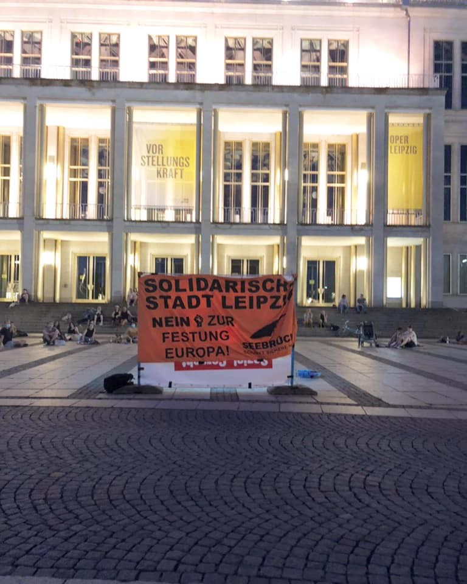
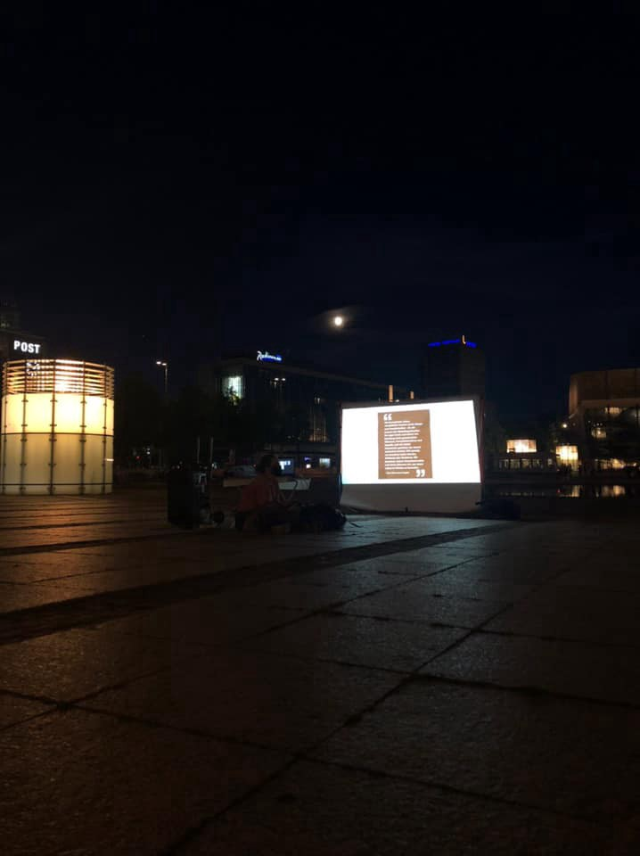

### AYS Weekend News Digest 1–2/8/20: Austria doubling down on detentions and surveillance
#### Austria: 300 people are now in limbo with no end in sight / Detention in Belgium / Lockdown continues in Greece / Video story from Victoria square in Athens / Lampedusa hotspot getting crowded, policies possibly changing / Germany refuses solidarity offers from Berlin / Recommended reads & more news

Photo: [Leipziger Seebrücke — Schafft sichere Häfen](https://www.facebook.com/seebrueckeleipzig/?tn-str=k%2AF&hc_location=group_dialog) , for more info see under ‘Germany’
### FEATURED

**Austria** — Despite the fact that deportations have been halted to most countries due to COVID\-19 concerns, Austria is still keeping refugees whose asylum claims have been denied in [detention](http://asyl.at/de/info/presseaussendungen/abschiebungwaehrendpandemie/) with no clear end in sight, our friends from Border Crossing Spielfeld \(BCS\) report\. The Council of Europe had called for authorities to release people in those cases as detention with a view to deport made no sense in times of widespread international travel bans\. Trying to deport people to countries where they would not find adequate medical support in case of infection and no chance to make a living in a lock\-down situation is also highly questionable\. About 300 people are detained though the numbers per country are not clear\. Around 300 people are now in limbo with no end in sight\.

Among those facing deportation are a number of Afghans who had undergone apprenticeships in the tourism sector which is chronically understaffed\. After their training companies won an initial victory at the end of 2019 when they were allowed to at least complete their training, those same people are now threatened again just as they qualify despite a majority of Austrians supporting their right to stay\.

At the same time, Austria’s Minister of the Interior Karl Nehammer has announced that he is launching a pilot programme on the Austrian border with Hungary and Slovenia in August replacing helicopters and ground\-level infrared cameras with drones to monitor the border area around the clock thus further expanding surveillance of intra\-European borders, BCS says\.

**Belgium** — Less than 200 people are kept in Detention Centres for Migrants in Belgium\. They have places for up to 600 people, but the Detention Centres are reportedly applying the COVID\-19 measures\.

> _They have been kept in these Centres for several months, some up to 9 months, with a view to being deported, even if these deportations are almost impossible to implement; either the flights are not insured or the countries of origin refuse to issue official travel documents\. They do not understand why they are kept locked up and classify their detention as torture\._ 

An overview of the situation and the struggles, on many levels, of those detained is reported [here\.](https://www.gettingthevoiceout.org/detention-and-pressure-versus-solidarity-and-resistance-in-the-detention-centres-for-migrants/?fbclid=IwAR21r1QM15p8HNKkopUlSbfFadRfwuhgvGbjezX73WW1xZJYNO9CLSKus5M)
### Search and Rescue

Today 3 years ago, the rescue boat IUVENTA was seized without reason & is still blocked today\. The 10 crew members are still under investigation — in the worst case they could face up to 20 years in prison\. As one of the activists working with Amnesty International posted, “across Europe people standing in solidarity or assisting refugees and migrants have been threatened, smeared, intimidated, harassed and dragged through the courts simply for helping others\.”
### TURKEY

Four people were killed and one went missing, after a boat carrying 9 people capsized outside Foça, Izmir\. The boat capsized south east of Foça around 4pm, when trying to reach Lesvos south\. Thrre boats from the Turkish coast guard, a helicopter, and a diving team were immediately dispatched to the area\. The boat was, after some more investigation, carrying Turkish nationals, and was not heading towards Lesvos, Aegean Boat Report \(ABR\) reported\. Sadly, 2 children drowned in this incident, one child aged 8 is still missing, while 4 people, two children, and two women were rescued\.
### GREECE
### As the lockdown continues

From their perspective on the lockdown, [Lesvos Solidarity — Pikpa](https://www.facebook.com/pikpalesvos/?__tn__=%2CdkCH-R-R&eid=ARDupVz5D6TzbfjMdADO_uxoQXVXPRpCFpoWAfphneEMmHamctWo-qj-h_ZzfBA63S4qO1sMg8v-t9Ba&hc_ref=ARTltb-c9To8RpA5whqNdEnn3vEOixpFDbVIxDjqtKm0Zr3C1FJmIpiOO-ukoRGIx4o&fref=nf&hc_location=group) writes:

> _For the 7th time, the lockdown of refugee camps in Greece has been extended\. Not for 2 weeks — as before — but for the whole month of August\. At this point, this means almost 6 months of lockdown for thousands of women, men and children stuck in overcrowded camps across Greece\._ 

> _Once more, there is no public health justification for the lockdown\. There are no positive COVID\-19 cases in any of the camps in Greece\._ 

> _While the people in Moria camp turned to Europe for protection, they find exactly the opposite\. The lockdown exposes them to further harm\. No break from the sweltering August heat in the camp for the 6000 children stuck there, no going for a walk, no swimming in the sea next to the camp\. No basic safety\. No dignity\. No re\-assurances as to what will happen in case of an outbreak, now that the MSF COVID\-19 centre next to the camp is closing down\._ 

> _For the rest of society, life goes on\. People go on holiday\. Public officials will go on their august break\. Tourists are welcomed in Greece\._ 

> _But people fleeing their home countries in search of protection are pushed into more suffering, stuck in inhuman conditions in the camps, out of public sight, away from headlines\. This is what Europe stands for\._ 

> _And like this, with every extension, Moria camp is turning into a closed camp in front of our eyes\._ 

> _Restrictions of movement are not implemented equally rigidly\. Neither do they affect equally all humans\. The vulnerabilities due to a certain social position were increased by the imposed immobility\. If mobility enhances identifications of ‘shared’ experiences, imposed immobility highlights the structural asymmetries that define the different options each one of us has\. —_ 
 

> _Chrysi Kyratsou_ 

— read more on what she had to say about it in [this text](https://www.routedmagazine.com/on-hold?fbclid=IwAR14Vz6sps2rSkcEMeZcjDvoCYU75LjswoS-cl3Jv-vMc2HWUTztMFL1oRM) ​
### Samos

[Glocal Roots](https://www.facebook.com/GlocalRoots/?tn-str=k%2AF) writes about the medical care in the times of COVID\-19 on Samos: “Since the first COVID\-19 case was announced, Samos’ medical grassroots NGO [Med’EqualiTeam](https://www.facebook.com/MedEqualiTeam/?__tn__=%2CdK%2AF-R&eid=ARDMwben02t54un90Wq6LEzxzRlnSfSjizkEB8JC5XrmSH_eU2mJkGdF41cZ5RbiW5In1gqFYHcTXm0Z) has been a constant, re\-assuring presence on the island\. They have designed easy\-to\-follow COVID\-19 protocols, advised us on how to travel and socialise safely, taken the time to answer all of our queries \(no matter how small or big\), supported us in implementing hygiene protocols designed to keep the women who use our center safe, and much, much more\.”
### Athens
### ITALY
### Lampedusa — The island’s hotspot is ten times over capacity\.

The situation on Lampedusa is extremely tense\. In recent months, almost 5500 people have reached the island independently\. That’s two, three boats a day, organisations report\.

> _After 250 people on board the eight boats had arrived on Saturday on the southern Italian Mediterranean island of Lampedusa, the mayor of Lampedusa is taking countermeasures\. The mayor closed the island reception centre, which currently accommodates 950 people\._ 

> _“You can’t put a thousand people in a structure where there is actually only room for 95”, protested Mayor Salvatore Martello, according to media information collected by News from the Med\._ 

Lampedusa’s local League representative, along with the centre\-right Forza Italia party, filed a complaint against Interior Minister Luciana Lamorgese, accusing her of destroying nascent tourism on the island, the [media reported\.](https://thearabweekly.com/italys-far-right-tries-exploit-fear-maghreb-migrants?fbclid=IwAR14Vz6sps2rSkcEMeZcjDvoCYU75LjswoS-cl3Jv-vMc2HWUTztMFL1oRM) 
The interior ministry reportedly said that the army would guard reception centres, while two ships of 600 places each would be available soon to hold migrants during the quarantine\.

**Fishermen who come across migrant boats beyond 12 nautical miles from Italy’s coasts complain that after calling for help authorities only ask them to “stand by”\.**

> _“But I can’t do that, I can’t\. Lives at sea should be saved\. Full stop,” one of them said\._ 

### EU

> _“This report analyses and interrogates the accountability and transparency regime of the European Union’s border agency Frontex\. Frontex was established as a European Union agency in the field of border, migration and asylum policies in 2004 and began operating in 2005\. Over the last 15 years, the mandate of the agency, originally tasked with coordinating the operational management of the European Union’s external border through support to the EU’s member states, has expanded significantly\. Through a series of reforms, most notably in 2007, and 2016 and 2019, the agency has become a pivotal actor in what is referred to as ‘European Integrated Border Management’\. Since the creation of the agency and its first operations, there has been significant concern, both from the European Parliament as well as NGOs and other civil society organisations that the executive mandate of the agency has not been counterbalanced by effective mechanisms for accountability, particularly with respect to fundamental rights\. To an extent, the Frontex monitoring and accountability regime has improved since 2011 through legislative change, thus strengthening the above mechanisms\. The findings of the report however show that despite the continued expansion and strengthening of monitoring and accountability mechanisms since 2016, these efforts have again not resulted in an effective system for monitoring, investigating, addressing, and preventing fundamental rights violations at Europe’s external borders\.”_ 

### [Fundamental Rights, Accountability and Transparency in European Governance of Migration: The Case…](https://www.respondmigration.com/wp-blog/fundamental-rights-accountability-transparency-european-governance-of-migration-the-case-european-border-coast-guard-agency-frontex?fbclid=IwAR3_RwvzuVY1rk2npPw-iow7CpkoVSjek_jwE0j-wwKQNcHGMi5MncttLJ0)
### [Lena Karamanidou — Glasgow Caledonian University \| Bernd Kasparek — Göttingen University This report analyses and…](https://www.respondmigration.com/wp-blog/fundamental-rights-accountability-transparency-european-governance-of-migration-the-case-european-border-coast-guard-agency-frontex?fbclid=IwAR3_RwvzuVY1rk2npPw-iow7CpkoVSjek_jwE0j-wwKQNcHGMi5MncttLJ0)
#### [www\.respondmigration\.com](https://www.respondmigration.com/wp-blog/fundamental-rights-accountability-transparency-european-governance-of-migration-the-case-european-border-coast-guard-agency-frontex?fbclid=IwAR3_RwvzuVY1rk2npPw-iow7CpkoVSjek_jwE0j-wwKQNcHGMi5MncttLJ0)
### GERMANY

[Leipziger Seebrücke — Schafft sichere Häfen](https://www.facebook.com/seebrueckeleipzig/?tn-str=k%2AF&hc_location=group_dialog) reported: “Last Friday we held our video screening at Augustusplatz for the second time\. We showed video by [LIFELINE](https://www.facebook.com/seenotrettung/?__tn__=%2CdKH-R-R&eid=ARAi9quXjbHAbWmcQe5bc6ITKCYZswknofAdt8sdbRs2Fap7sGLG0Ou1yUEjRpgcqZOlSuQg9Kw2pjb7&fref=mentions&hc_location=group) and [Moria Corona Awareness Team](https://www.facebook.com/MoriaCoronaAwarenessTeam/?__tn__=%2CdKH-R-R&eid=ARB4Wzyv3iarFrbeE5MXGWE7ln_KAzWXm5voWq2LO55yobFKL6jiecal3CMLHDeEKpHLRnQZCcoRlypz&fref=mentions&hc_location=group) who held interviews with refugees\. We are exited for the opportunity to bring different perspectives on this topic to German cities\! The donations collected on Friday will be going to mission lifeline and Moria Corona Awareness Team\.”

Photo: [Leipziger Seebrücke — Schafft sichere Häfen](https://www.facebook.com/seebrueckeleipzig/?tn-str=k%2AF&hc_location=group_dialog)
### Berlin’s solidarity rejected

German Interior Minister Horst Seehofer has rejected a petition by the state of Berlin to take in 300 vulnerable refugees from Greece\.

19 children in need of medical treatment and three teenagers with their core families arrived in Berlin\. The total of 22 families had between two and eight members, as [InfoMigrants](https://www.infomigrants.net/en/post/26379/germany-s-interior-minister-rejects-state-relocation-of-migrants-from-greece?ref=tw&fbclid=IwAR1m46UFPFeZJFsPqwfJ-004Zqorlx8CH1_Vwti0y6JTKPmytLq_9pGlBfA) writes\. That is what Seehofer refers to, among others, as a valid point for not going into this solidarity action as the federal government is the only one who can run the migration policies in the country\. His reaction was called scandalous in Berlin:
### UK

A well\-known Yemeni political commentator has been separated from his family for almost 1 year because the Home Office won’t make a decision on his asylum claim, here is his story:
### FOR FURTHER READING

**Left stranded in unfamiliar places, living on the verge of poverty and statelessness** 
In Morocco, the people on the move have to rely on host residents and welfare associations for support and access to necessary services\.
### [Narratives of immigrants in Morocco amid the pandemic \| Routed Magazine](https://www.routedmagazine.com/immigrants-morocco-pandemic?fbclid=IwAR2lG0xdQAPVxmtwkCOoP3-9DQJpj_2rn4jwrsfsui4G7atlDL3Q9ObD33M)
### [The novel pandemic, COVID\-19, has acutely affected the lives of countless people worldwide, particularly people with…](https://www.routedmagazine.com/immigrants-morocco-pandemic?fbclid=IwAR2lG0xdQAPVxmtwkCOoP3-9DQJpj_2rn4jwrsfsui4G7atlDL3Q9ObD33M)
#### [www\.routedmagazine\.com](https://www.routedmagazine.com/immigrants-morocco-pandemic?fbclid=IwAR2lG0xdQAPVxmtwkCOoP3-9DQJpj_2rn4jwrsfsui4G7atlDL3Q9ObD33M)

> _“To me, being a refugee means that someone is in a specific phase of their life\. A time during which they need help to be able to come and stay in a safe zone\. Now that I am here and comfortable here — **why do people still call me a refugee?** ”_ 

Read the entire story:
### [When does a refugee stop being a refugee? \| Guiti News](https://guitinews.fr/around-the-world/2020/07/30/when-does-a-refugee-stop-being-a-refugee/?fbclid=IwAR2OEak4hT4T4ul0Mwl9sKUrrT3sQq4xKqoWThVMfvkVtZ5UlkYRrgu_GZM)
### [“ I had to leave my country, Lebanon, and suddenly became a refugee\. Since then, I carry this “label” every day with me…](https://guitinews.fr/around-the-world/2020/07/30/when-does-a-refugee-stop-being-a-refugee/?fbclid=IwAR2OEak4hT4T4ul0Mwl9sKUrrT3sQq4xKqoWThVMfvkVtZ5UlkYRrgu_GZM)
#### [guitinews\.fr](https://guitinews.fr/around-the-world/2020/07/30/when-does-a-refugee-stop-being-a-refugee/?fbclid=IwAR2OEak4hT4T4ul0Mwl9sKUrrT3sQq4xKqoWThVMfvkVtZ5UlkYRrgu_GZM)

An interview with the founder of the NGO Open Arms:
### [Òscar Camps \(Open Arms\): “La ignorancia es el peor racismo que hay”](https://www.elplural.com/sociedad/entrevista-oscar-camps-open-arms-ignorancia-peor-racismo_245223102?fbclid=IwAR2NjRoliP2J1G0CZGIKcUGKMQnPzd7YnegfhB9RUSo_vhTWYAahzTQyv2s)
### [Con el Open Arms atracado en Burriana \(Castellón\) y la agenda apretada después de estrenar Origen, un documental que…](https://www.elplural.com/sociedad/entrevista-oscar-camps-open-arms-ignorancia-peor-racismo_245223102?fbclid=IwAR2NjRoliP2J1G0CZGIKcUGKMQnPzd7YnegfhB9RUSo_vhTWYAahzTQyv2s)
#### [www\.elplural\.com](https://www.elplural.com/sociedad/entrevista-oscar-camps-open-arms-ignorancia-peor-racismo_245223102?fbclid=IwAR2NjRoliP2J1G0CZGIKcUGKMQnPzd7YnegfhB9RUSo_vhTWYAahzTQyv2s)

**Find daily updates and special reports on our [Medium page](https://medium.com/are-you-syrious) \.**

**If you wish to contribute, either by writing a report or a story, or by joining the info gathering team, please let us know\.**

**We strive to echo correct news from the ground through collaboration and fairness\. Every effort has been made to credit organisations and individuals with regard to the supply of information, video, and photo material \(in cases where the source wanted to be accredited\) \. Please notify us regarding corrections\.**

**If there’s anything you want to share or comment, contact us through Facebook, Twitter or write to: areyousyrious@gmail\.com**

Daily news digests from the field, for volunteers, people on the move, journalists, and the general public [Take a look](https://medium.com/are-you-syrious/newsletters/ays-daily-newsletter?source=newsletter_v3_promo--------------------------newsletter_v3_promo-)
- [Digest](https://medium.com/tag/digest)
- [Refugees](https://medium.com/tag/refugees)
- [Detention](https://medium.com/tag/detention)
- [Europe](https://medium.com/tag/europe)
- [Migration](https://medium.com/tag/migration)

_Converted [Medium Post](https://medium.com/are-you-syrious/ays-weekend-news-digest-1-2-8-20-austria-doubling-down-on-detentions-and-surveillance-508f9ca81ffd) by [ZMediumToMarkdown](https://github.com/ZhgChgLi/ZMediumToMarkdown)._
