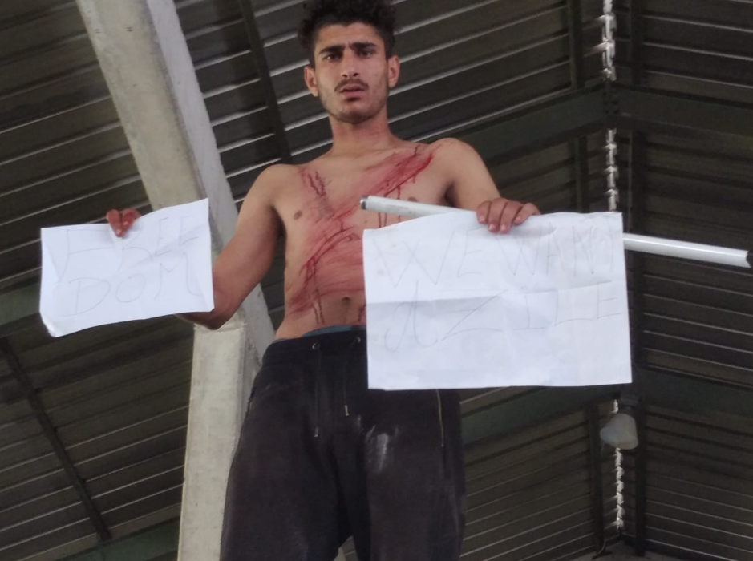
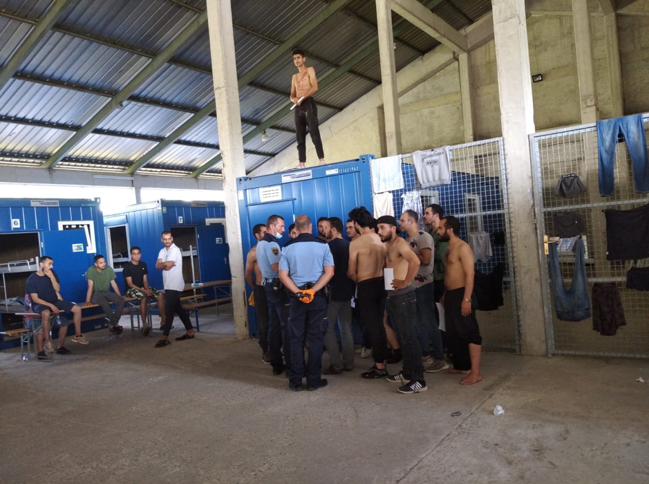
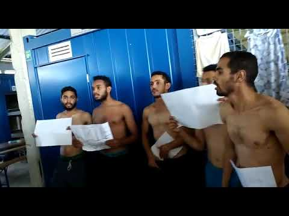
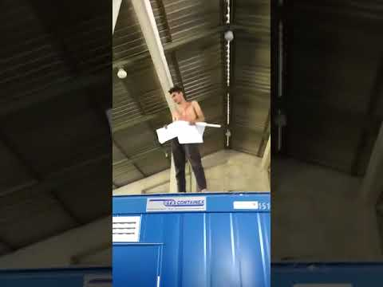
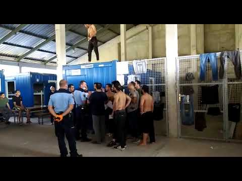

### AYS Slovenia Special: P **rotest breaks out in detention centre Postojna a week after court decision in favour of an asylum seeker**

The detention centre in Postojna \(Centre za tujce\), Slovenia, is a prison\-like institution used for detaining foreigners who are, for various reasons, deemed not welcome in the country\. People can be detained in Postojna for months, let go and detained again and again\. Slovenia does not extradite to a number of countries, so the underlying assumption of this institution is that “unwelcome” people would give in under such prison\-like conditions and leave the country voluntarily\. The detention centre had already been used in the past when the number of asylum seekers who arrived via the Balkan route grew beyond the official capacity, as well as a place for temporary detention of people predestined to be returned to Croatia and then further to Bosnia\. In late spring 2020 an _ad hoc_ infrastructure was constructed on the premises of the detention centre in order to facilitate detainment of an increased number of asylum seekers in a manner similar to, if not worse than, IOM\-run centres in Bosnia\. Last Tuesday’s protest in the detention centre highlights the plight that these people have faced\. They risked everything to come to Europe, they searched for safety and security\. What they found was a detention centre where they are being held, and in many cases the fundamental right to apply for asylum has been ignored by the authorities\.

The protest was held only one week after the Slovenian Administrative court ruled in favour of a person from Cameroon who was denied the right to apply for asylum\. The court decided that “ [The Republic of Slovenia has violated the Applicant’s right to asylum](https://www.borderviolence.eu/wp-content/uploads/PRESS-KIT-FOR-INTERNATIONAL-MEDIA.pdf) \(Article 18 of the EU Charter of Fundamental Rights\), t [he prohibition of collective expulsions](https://www.borderviolence.eu/wp-content/uploads/PRESS-KIT-FOR-INTERNATIONAL-MEDIA.pdf) \(Article 19 § 1\), [and the prohibition of torture](https://www.borderviolence.eu/wp-content/uploads/PRESS-KIT-FOR-INTERNATIONAL-MEDIA.pdf) \(Article 19 § 2\)”\. His case is identical to that of the approximately 20000 people who have been “informally returned” to Bosnia in the last two years and of those seen protesting in the photos\. This demonstration in the detention centre was a desperate act and a struggle for the right to apply for international protection, as in the absence of information, communication and legal assistance they have been given no way to apply for asylum in Slovenia\.

Conditions within the detention centre in Postojna are appalling: around 80 people are housed in containers inside a hall, surrounded by a fence through which food is given\. There has been no provision of hygiene products or clean clothes\. Many of the people in detention are scheduled to be illegally deported \(subjected to a “pushback”\) to Croatia without being given a chance to seek asylum in Slovenia\. These deportations are happening under the Readmission agreement and in many cases the person does not know that they will be deported until the exact moment when the police come and take them\. These kind of actions by police mean systemic violation of basic rights such as prohibition of torture, non\-refoulement, the right to asylum procedure, the right of legal representation and the right of protection against collective expulsion\.

Among the people detained are a number of asylum seekers, who had already initiated their asylum procedure\. This presents a new policy, introduced during the COVID\-19 pandemic: detainment of asylum seekers in Slovenia is the beginning of the very same “Hungarian model” of detention centres for asylum seekers that was just [recently condemned by the European court of Human Rights](https://www.amnesty.org/en/latest/news/2020/05/hungary-european-court-declares-authorities-broke-eu-law-by-detaining-asylum-seekers-in-transit-zone/) \.

### Degrading treatment of migrants in detention centre in Postojna

State violence against migrants traveling on the Balkan Route is not only prevalent in the border areas, where collective expulsions, mental and physical abuse as well as theft on behalf of police officers are a daily reality\. Violent, humiliating and degrading treatment have also become common practice within state institutions such as asylum camps and detention centres\.

The detention centre in Postojna is located about 50 kilometres southwest of Ljubljana and is about a 10 minutes\-drive down the highway in the industrial zone of Veliki Otok\. It was built in 2000 as part of needed infrastructure meant to deal with regulation of migration in time of the accession process of Slovenia to European Union\.

The building is an administrative detention centre for foreigners, where they go before their removal from the country\. People who do not have legal residence in Slovenia, such as migrant workers working without contract, _sans papier_ or rejected refugees, can face up to one year of administrative detention in Postojna while the deportation procedure takes place\. Because of the continuous lack of accommodation facilities for asylum seekers in Slovenia the detention centre is also being used as temporary housing for people who are waiting to start an asylum procedure or are already waiting for their decision as asylum seekers\. This is a disturbing new policy from the Slovenian Ministry for interior, it introduces a deprivation of liberty for asylum seekers for the time while their request is being processed\.

Inside the detention centre there are also those who have been waiting to officially file their intention to seek asylum for more than a month\. Some of them have even received the decision to be deported to Croatia, despite the fact that they are still waiting to start their asylum procedure\. Considering the sudden increase in numbers of unlawful detentions in the last few months, it seems that the Slovenian government is testing grounds for a policy to fast\-track decision making regarding asylum requests and detention of asylum seekers for the duration of their procedure\. These kinds of procedures were first introduced in Hungary on the border with Serbia and the Slovenian government appears to be too eager to follow its model\.

Postojna Detention Centre has, throughout the years, been a place of many protests in forms of self\-harm, burning of beds and hunger strikes, but since people are contained and isolated within the centre, the protests rarely make any outside impact\. Additionally, any violent expression of protest is sanctioned with tranquilizers and relocation to the psychiatric hospital in Idrija, where a person is sedated and in some cases even chained to a bed\.

Such unbearable conditions, no provision of hygiene products, no freedom of movement, cramped living spaces and daily illegal deportations to Croatia have led to a spontaneous protest of migrants who have been detained in a detention centre in Postojna\. Leaked protest footage shows a detainee cutting his skin in the area of the upper body and neck in a sign of desperate protest against humiliating treatment and danger of deportation to Croatia and then Bosnia and Herzegovina\. [The protest](https://www.facebook.com/ambasadarog/posts/1203048166696484?__tn__=-R) also involved a number of [detainees showing white papers](https://www.youtube.com/watch?v=tB2xn99Cmao&feature=emb_title) demanding “freedom of movement”\.

### Unlawful detention of asylum seekers under the directives of general police command

After the protest one of the major media outlets in Slovenia, POP TV, published parts from the general police command directive given to police officers, instructing unlawful detention of asylum seekers within the detention centre in [Postojna](https://www.24ur.com/novice/slovenija/slovenska-policija-prosilce-za-azil-nelegalno-vraca-v-pekel-na-balkanu.html) \. The directive explicitly states that when a person begins their asylum procedure they should immediately be detained and be held in detention until they receive a decision about their asylum request\. The Police are attempting to justify this unlawful practice by claiming that this way asylum seekers will not be able to leave Slovenia during their ongoing asylum procedure and that the practice of detaining asylum seekers will deter migrants from using Slovenian territory as a migratory route\. These instructions were meant to be used for a testing period from 3 June to 3 July, but it seems that the practice is continuing\. In the month and a half since the issue of the directives there have been 75 appeals regarding detention of asylum seekers to the administrative court and only in the 22 cases the court approved the order for detention, the remaining 53 were considered to be [unlawful](https://www.mladina.si/200338/z-azilanti-po-novem-brez-milosti/) \.

There are no laws that would allow the Ministry to take away the freedom of movement for an asylum seeker, so it seems that it is using measures against COVID\-19 pandemic as an excuse to unlawfully restrict freedom of movement for migrants\.

Tuesday’s protest in the detention centre in Postojna is a justified act of resistance against the inhumane treatment of migrants by repressive state institutions and policies, something which has consistently been reported on across the Balkan states over the past number of years, and acts as a call to all to openly oppose state sanctioned violence against migrants and advocate for freedom of movement for all\.

The people involved in the protest were told that they were to be deported to Croatia — and so they rebelled\. After the protest they were promised a meeting with a lawyer accompanied by a translator, although, as of now, there has been no confirmation that this meeting indeed took place\.
### Administrative court condemns illegal pushbacks from Slovenia to Croatia

In this month the Administrative court in Slovenia made a landmark judgement in the case of a Cameroonian refugee J\.D\. in which it found that Republic of Slovenia has violated the applicant’s right to asylum, the prohibition of collective expulsion and the principle of non\-refoulement\. Among other things in its 176\-page judgement, the Court stated that the Ministry of Interior Affairs cannot blindly follow _the principle of mutual trust between EU member states_ when it comes to readmissions to neighbouring member states\. Further, as there are plenty of reports which have shown the cruel and inhumane acts of Croatian police and chain pushbacks to Bosnia and Herzegovina, the police should have been aware of the high risk of torture and inhumane treatment the applicant would likely face in Croatia, if deported to there\. The court found that Slovenia is responsible for people, even after they have been readmitted \(in this case to Croatia\), as it is Slovenia’s responsibility to acknowledge and monitor the conditions in its membering states\. By simply deporting the applicant to Croatia, Slovenia violated the prohibition of torture, included in the principle of non\-refoulement, by which a person cannot be deported to a country where he or she faces a real risk of being subjected to torture or inhuman treatment\. The court also found breach of prohibition of collective expulsion, as it did not follow from the police documentation that the applicant had been processed individually\.

> **“Well I went into the lawsuit because even though I know I have a little chance, I know and believe that the judgement will help those that come after me\. I may not have a direct solution for me, but I know that we are creating awareness and you give more trust to the law of the country\. Slovenia was always a country I have admired, ever since I first read about it\.” — J\. D\., Bosnia, 17th July 2020** 

The court ruling came almost one year after J\.D\. was pushed back from Slovenia to Croatia and then to Bosnia and Herzegovina\. As a member of and an activist for the anglophone minority he was persecuted in Cameroon\. He tried to seek protection in Slovenia but after a two\-day stay in the country, despite explaining his life\-threatening situation and several times clearly communicating his intention to seek international protection — he was put into a bus, along with many others, to the border to be readmitted to Croatia\. During the time in Slovenia, he was not informed of his rights and had no idea what would be happening with him, he was misled that he could seek asylum in Slovenia and only figured out he would be deported while on the way, sitting on a bus with 30 other migrants\.

After being handed over to Croatian police he was then driven to the green border with Bosnia and Herzegovina and forced to walk across\.

The case of J\.D\. is the first successful court case of a person who was unlawfully deported from Slovenia to Croatia in a collective expulsion done under the so\-called “informal” procedure of Readmission\. It should be noted that J\.D\. is merely one of almost 20 000 people whose basic rights have been denied by Slovenian police, which has been now for more than two years systematically denying the right to asylum\. This is done by falsifying official procedures at police stations and conducting daily collective expulsions to Croatia, thus willingly collaborating in the violent push\-backs executed by Croatian police\.

> **“The importance of this ruling of the administrative court is that it does not establish human rights violations in some excessive, individual conduct of border police officers, but in conduct that is part of the systematic and routine treatment of asylum seekers who, instead of legal proceedings, receive collective expulsions and chain returns to Bosnia and Herzegovina\.” — Statement of the applicant’s lawyer Dino Bauk, 17th July 2020** 

Another important gain from the court ruling is the recognition that readmission procedures must be formal in relation to the person\-in\-procedure\. It cannot be done informally on this level: the so\-called “informal” procedure may apply only in the relation between two states \(in this case Slovenia and Croatia\), whereas the persons in procedure must formally be informed of their right to seek international protection, if it follows from the circumstances that they could be in need of it\. They have to be given the right to a statement and a chance to explain any possible reasons why they could face a real risk of being subject to torture if expelled, they have to be informed of their rights that stem from being arrested \(right to translator, legal representative, appeal against deprivation of liberty\) and in case of deportation they must be provided with an official paper, confirming this decision\. The decision has to explain the reasons for their deportation and state their right to appeal against the decision\. Currently the readmission of persons who crossed the border irregularly is being done by Slovenian police without any formal procedure, except the one in which the police tries to gather information on the actual crossing of the border\. The Slovenian police, by way of this “informal” procedure, avoid giving any decision about persons deportation to Croatia, and thus do not allow the person in the readmission procedure any access to legal remedies\.

In the landmark judgement the Court ordered Slovenia to provide the Applicant with access to the territory of Slovenia, allow him access to seek asylum and pay him € 5 000 in just satisfaction, after the ruling becomes final\. The Ministry for Interior announced it will appeal the decision\. This positive decision from the Court represents an important step forward in legal struggles to secure the protection of basic rights of all people on the move\.

**Article was written by Iza Thaler and Jošt Žagar and edited by Saša Hajzler, Miha Turk and Beja Protner from civil initiative [Infokolpa](https://www.facebook.com/infokolpa/) \.**

_Converted [Medium Post](https://medium.com/are-you-syrious/ays-slovenia-special-protest-breaks-out-in-detention-centre-postojna-a-week-after-court-decision-e86065481fcb) by [ZMediumToMarkdown](https://github.com/ZhgChgLi/ZMediumToMarkdown)._
