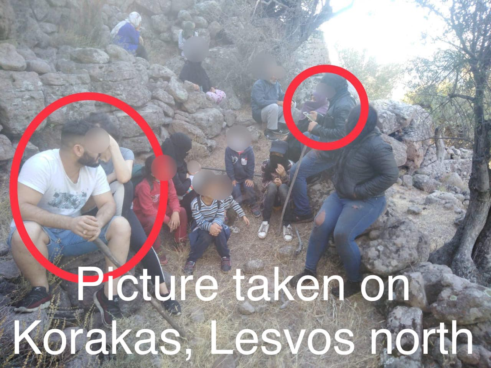
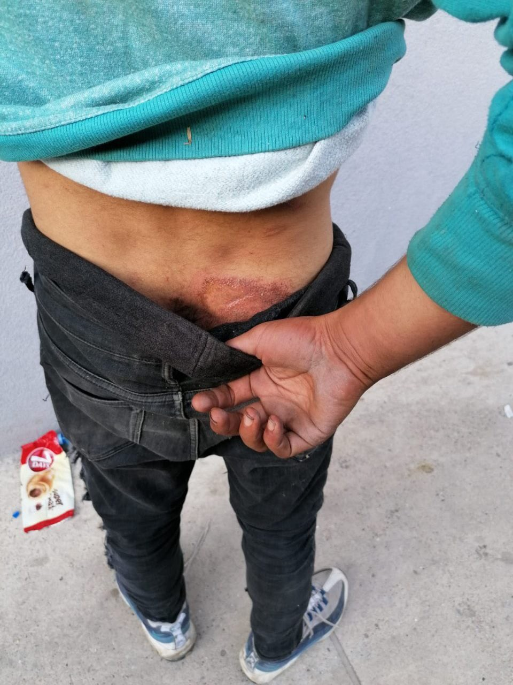
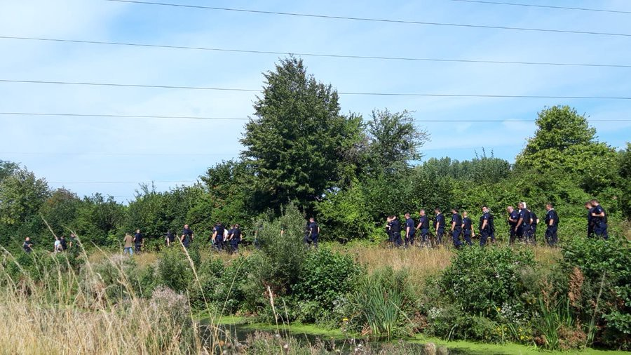

### AYS Daily Digest 12/08/20 Proof that 57 people arrived on Lesvos then were pushed back to Turkey by Greece

_More of the English Channel undue hysteria // crews sent to Lebanon // from Tunisia to Italy increases // terrorism charges in Malta // and more…_
### FEATURE: Aegean Boat Report has proof that 57 people arrived on Lesvos then were pushed back to Turkey by Greece

](assets/d4d68cda06ca/1*btSf6UejF5DK23iDGVsvYw.jpeg)

“57 people that arrived on two boats on Lesvos north yesterday seems to have disappeared, port police on Lesvos claims there was no arrivals\.” Photos by [ABR](https://www.facebook.com/AegeanBoatReport/posts/895342667655505)

The authorities on Lesvos are claiming that there haven’t been any new arrivals to Lesvos in the past two days, but there is evidence otherwise\. Not only did two boats arrive with 57 people in total, but the Turkish Coast Guard picked up 57 people later on\. [Aegean Boat Report](https://www.facebook.com/AegeanBoatReport/posts/895342667655505) is explaining that:

> “Yesterday before sundown Turkish Coast Guard picked up 57 people from two life rafts drifting outside Bademli, Turkey\. From pictures posted by TCG, Aegean Boat Report has identified four people that also are in pictures and videos that ABR received from Korakas yesterday morning, the identification is 100%\. 

> There is no doubt that the people from the two boats that landed on Lesvos north yesterday was illegal deported by the Greek Coast Guard\. They where taken from safety on land on Lesvos, and put back in the sea in life rafts, helplessly drifting, what kind of people would put children adrift at sea, how can they sleep at night\. \. This is not human behavior, not even animals would be this cruel\!” 

Aegean Boat report is not going to stand by and let this happen\. ABR is encouraging you to:

> “Aegean Boat Report call’s upon all followers to participate, to make your voice heard, together this voice can make a difference\! Pick up your phone and call the port authority of Mytilíni, Lesvos, and demand answers\! They will deny any involvement in illegal activities, but we know they are lying\!” 

Contact here: Port police Mytilini: **\+30 2251 040827** \(Number is open 24/7\)

In related news, German Undersecretary of Defense Peter Tauber “has informed in writing that he has information from the German naval forces operating on the Aegean of at least two illegal operations of the Greek port\.” That means they also have proof of Greece carrying out pushbacks to Turkey\. [Ef\.Syn](https://www.efsyn.gr/ellada/koinonia/255532_germaniki-epibebaiosi-gia-tis-epanaproothiseis) reports that:

> “Tauber noted that the crew of the Berlin supply ship, which leads NATO’s Permanent Naval Force 2 in the Aegean, monitored the Greek ship on 19 June \(and\) returned a boat with refugees to Turkish waters\. 

> He also notes that the German navy witnessed an operation to repatriate refugees from Chios on 30 April, an incident that had been revealed by “Ef\.Syn\.” and the informative website of Chios Astapari\. In addition, Mr\. Tauber points out that on 4 June, Berlin was forced to rescue 32 refugees and migrants who were aboard a boat in the Aegean and were in danger of drowning, as apparently the Greek authorities had not carried out a rescue operation\.” 

](assets/d4d68cda06ca/1*jMChL1pLjIWPnPCKGltUXg.jpeg)

Photo by [ABR](https://www.facebook.com/AegeanBoatReport/posts/895342667655505)

Greek pushbacks across to Turkey are not new and what happened this week needs to be condemned full heartily in order to stand behind international law\. Greece must stop the pushbacks and other EU countries must help Greece relieve the island camps\.
#### LEBANON

An an update from Aid Belgrade: \(donate [here](https://www.facebook.com/migreatorg/posts/3183521868423447) \)

> “ **Our rockstar volunteers João and Jasper decided to go to Beirut and help rebuild the city after the horrible explosion on Tuesday\.** João founded Aid Brigade and worked in Sarajevo for over a year, driving around in his beat\-up old van to deliver bags of rice to the kitchen, serve hundreds of meals, build shelters and distribute firewood\. Jasper can build basically everything, he rocked the squat team and provided hundreds of people with a warm place to sleep\. We’ve seen many amazing people pass through Sarajevo, but we can’t imagine anyone more fit to improve conditions in Beirut quickly and cheaply\. 

> These guys gave their all in Sarajevo and we are SO happy they will now help out in Beirut\. But they need your support\! Please consider donating so they can buy building materials and rebuild Beirut\.” 

#### LIBYA

In an update from a reliable source on [Libyan evictions](https://www.facebook.com/rastajuly/posts/10157942317468621) :

> “Rumours are circulating in Tripoli that the Libyan authorities would have allegedly ordered all landlords renting to migrants and refugees in the poor and violent area of Gergarish to kick them out in the streets in 10 days\. It is not clear whether this horrific news is true and whether it will be implemented, but it has caused panic among refugees in Tripoli, who are now contacting us terrified of ending up homeless, of being kidnapped or detained, tortured or sold again\. 

> \(There is\) a horrible notice that seems to try to also blame refugees for COVID\-19, while pushing them in the streets is what would put them at risk of getting infected\. We ask all UN Agencies to look into this issue and try to advocate with the Libyan authorities against this horrific plan\. In the Libyan hell of widespread and systematic human rights abuses, the only solution is to Evacuate Refugees From Libya, to have Europe stop funding the Libyan authorities, while opening Humanitarian corridors NOW\.” 

#### SEA

](assets/d4d68cda06ca/1*nIVlEO8E-flaVAlxVOdMzg.jpeg)

“What’s the first thing you’d think of to bring, when embarking on a mission in Corona times? Of course\! We have good reason for stockpiling toilet paper: a crew of 29 on \# SeaWatch4 and quite an unclear mission timeframe, thanks to the EU’s years\-long habit: denial of assistance\.” Photo by [Sea Watch International](https://twitter.com/seawatch_intl/status/1293597464407269377)
### The Mare Liberum is returning to monitoring and facilitating sea rescue in the Aegean next week\!

As more than [5,000 people](https://www.facebook.com/NewsfromtheMed/posts/1009707169482879) were pushed back to Turkey since March, their presence is 100% needed\. We must continue to support their mission\.

Around 27 people still remain on an oil tanker outside of Malta, after being rescued at sea on 5 August\. They are still being refused the ability to apply for asylum\. None of the Maltese authorities have explained their reason for waiting to let them disembark\. More [here](https://timesofmalta.com/articles/view/six-days-of-uncertainty-for-migrants-on-oil-tanker.811161?fbclid=IwAR3wxdt_A5wlpLcjLC0MHycrFAxvJyAvNk1zuyOaopJor-Rspfxw11WHEAA) \.
#### MALTA

[Human Rights Watch](https://www.hrw.org/news/2020/08/12/migrants-face-trial-after-resisting-return-libya-children?fbclid=IwAR1rJWO32DoCaho5RCT_ZdAWJLf2IebTMoXsP3AjtQbmCG01E1EZQIzqrNE) has an update on three young refugees facing terrorism charges in Malta:

> “Three young people are facing terrorism charges in Malta for refusing to be returned to almost certain detention and abuse in Libya\. The ‘El Hiblu 3,’ as they are known, appeared in a preliminary court hearing in Valetta on 30 July; their trial is yet to begin\. 

> The youths, from Guinea and Côte d’Ivoire, were arrested in March 2019 after they were rescued from a rubber boat in distress in the Mediterranean\. At that time they were aged 15, 16, and 19\. They are accused of hijacking the El Hiblu 1, the merchant vessel that rescued them and 105 other migrants, and forcing the crew to take them to Malta instead of returning them to Libya\. Amnesty International notes that the charges are ‘disproportionate … and do not reflect the risks to their lives they would have faced if returned to Libya\.’ Amnesty International also said that there is no evidence of any violence against the ship’s crew\.” 

#### GREECE

■■■■■■■■■■■■■■ 
> **[Alarm Phone](https://twitter.com/alarm_phone) @ Twitter Says:** 

> > SOS in the AEGEAN - 45 ppl in distress off Lesvos just called the Alarmphone. Their last position is in Greek waters: 39°14'19.2"N 26°30'10.2"E. The boat is adrift and the people are asking for immediate help. @[HCoastGuard](https://twitter.com/HCoastGuard) is informed - don't let them drown, rescue them now. https://t.co/LDnf6CJtDT 

> **Tweeted at [2020-08-12 00:13:38](https://twitter.com/alarm_phone/status/1293339825660211201).** 

■■■■■■■■■■■■■■ 

[An update](https://twitter.com/f_grillmeier/status/1293520971022966792) on Lesvos’ recent numbers:

> “In the first week of August **118 people** arrived on Lesvos\. This is an increase from the previous week’s **63 arrivals** but a decrease from last year’s **518 arrivals** during the same period\. 

> According to UNHCR: **16,406 refugees & asylum\-seekers** reside on Lesvos\. Women account for **23%** of the population & children for **40%** \(of whom more than **7 out of 10** are younger than **12 years old** \) \. Approximately **10%** of the children are unaccompanied or separated\.” 

■■■■■■■■■■■■■■ 
> **[Franziska Grillmeier](https://twitter.com/f_grillmeier) @ Twitter Says:** 

> > Reminder: Refugee camps in #Greece are still under lockdown. 

That includes ~ 32,000 women, men &amp; children only on the Aegean islands. 

#Refugeesgr 

> **Tweeted at [2020-08-12 14:57:01](https://twitter.com/f_grillmeier/status/1293562138066325505).** 

■■■■■■■■■■■■■■ 

Greek officials arrested 63 people on Tuesday for trying to fly from Crete with forged travel documents\. There were trying to fly to a variety of destinations in the EU\. Learn more [here](https://www.infomigrants.net/en/post/26584/63-migrants-arrested-in-greece-after-trying-to-fly-on-fake-ids?fbclid=IwAR1ZVovSlUVQyn9uvhHSXHHY9IIBzSdFOsw21rFBiIw3-NyUP64mJEpp6EQ) \.

A man in Chios was arrested for hate speech, the first arrest ever under Greek law for “flagrante delicto\.” He was calling for migrants and refugees to be found “dead or alive” and brought to him on social media\. More [here\.](https://astraparis.gr/prokatarktiki-se-varos-42chronoy-chioti-gia-ratsistiki-anartisi/?fbclid=IwAR2wNprI0Evbep52Xnkee1xwnqN2e0sh5UO8L8EPrqYDg1oFFk7KoWiG3Us)

■■■■■■■■■■■■■■ 
> **[NoBorders](https://twitter.com/Refugees_Gr) @ Twitter Says:** 

> > #refugeesgr send us a video of fire inside Elaionas camp in #Athens yesterday. 
Fire seems to be a dangerous "normality" inside overpopulated - quarantined for #covid19 - detention centres in #Greece. 
Can you imagine how these people fleeing war and violence feel ? 
#antireport https://t.co/X51LVNmNcF 

> **Tweeted at [2020-08-12 09:17:27](https://twitter.com/refugees_gr/status/1293476682318467077).** 

■■■■■■■■■■■■■■ 

More people than ever are stuck in living in Viktoria Square, with scenes that remind us of 2015 during the initial surge in new arrivals\. Stavroula Pabst just wrote an excellent piece for Athens Live entitled **“Waiting for the Next Chapter to Begin: Everyday Life for Refugees at Viktoria Square\.”** Pabst elaborates on how the new conservative government is in many ways making it harder for refugees now than it was in 2015:

> “Since Kyriakos Mitsotakis has been in power, he has made a point to argue that it is now time for the European Union to shoulder more of the burden of the continent’s refugee crisis\. Such goals of the New Democracy government, therefore, include limiting asylum to only true “refugees,” and therefore deporting those Mitsotakis and other conservatives argue have only come to Greece for economic opportunity\. As has been demonstrated by the new refugee housing scheme, ESTIA II, having about thirty percent less funding than its older counterpart, ESTIA, such plans also include providing less support for migrants who already call Europe home\.” 

Read the full piece on Athens Live [here](https://medium.com/athenslivegr/waiting-for-the-next-chapter-to-begin-everyday-life-for-refugees-at-viktoria-square-25fff4fc7401) \.
#### ITALY

Whole families are arriving [in Italy from Tunisia](https://www.theguardian.com/global-development/2020/aug/12/entire-families-are-arriving-at-our-shores-covid-drives-tunisian-exodus?fbclid=IwAR3RH9wC5JJ7Q8b7iiJT1Afvizsz2_HxVDw27KKec_MW5-FfLuTmKFzme7s) , trying to escape from the worsening economic crisis there\. Their economy relied upon tourism, and since COVID\-19 too many jobs have been lost\. According to the Guardian:

> “ **Tunisians are now the largest group of nationals arriving in Italy** , according to figures from the interior ministry, testing its reception centres to the limit\. In the first six months of 2019, 1,277 arrivals from Tunisia were intercepted by Italian authorities\. This year, that number rose to 6,628\.” 

Here is a [helpful resource](https://stradasicura.squarespace.com/materiale?fbclid=IwAR13WhR0TjZ66NlovAYQ3nqqnVm6RvnvtQV7OQjmmnctOyhTzQ0MHFJ8CBE) , available in Italian, for street medicine and treating people in insecure living conditions\. This might come particularly handing in the time of COVID\-19\.
#### SERBIA

](assets/d4d68cda06ca/1*i1mD4-3pCeyIZsKo0r-Udw.jpeg)

“This is a person from Algeria, who was found lying on the street in a conscious state\. According to him, since he was found in the truck, he was brutally beaten\. The citizens called the police and the ambulance in vain, but they did not react\. We intervened and promised to go out on the field\. Worries about passivity …” Update and pictures from [Azil u Srbiji Asylum Protection in Serbia](https://twitter.com/APC_CZA/status/1293609473718857728)
#### GERMANY

Here is Integration Senator [Elke Breitenbach’s](https://www.sueddeutsche.de/politik/migration-berlin-breitenbach-appelliert-an-spd-druck-machen-auf-seehofer-dpa.urn-newsml-dpa-com-20090101-200812-99-143100?fbclid=IwAR0iYxiS8to0YLhEZCBHe8ozLoMRrhiJ2N8jNdCNj8rnFeYu3J7h2eDZZQE) response to Federal Interior Minister Horst Seehofer \(CSU\) rejecting an admission program for refugees from the Greek camps under Berlin:

> “I would be very happy if the SPD would raise their voice at the federal level and put pressure on their coalition partner there that we have a responsibility…I expect the SPD to follow up on what it has to say and at this point to publicly oppose its coalition partner or to ask him to take action\. 

> I am not prepared to accept that we will be forced by a federal minister to look at the miserable conditions in which people have to live, even though there is an alternative…That is not acceptable \(and\) is why it is important to keep this political debate open and loud\.” 

#### FRANCE

](assets/d4d68cda06ca/1*WGXzHpWtLweAAEb4E_H8Iw.jpeg)

“This Wednesday 12 August, expulsions of informal living spaces took place simultaneously, from Grande Synthe and to Calais\. Seizure and destruction of personal effects, arbitrary arrests; exiles face daily moral and physical harassment\.” Photo by [Human Rights Observers](https://twitter.com/HumanRightsObs/status/1293594268959944714)

[Utopia 56 Rennes](https://www.facebook.com/utopia56Rennes/posts/1702072839943990) report that “eight of the 15 people detained at the Rennes Administrative Retention Centre start a hunger strike to denounce the inhumane conditions they live in:”

> “At the Rennes Retention Center, we have no rights here, they are being flouted\. We’re hard on ourselves\. Here’s how a day goes at the Retention Center: The cops wake us up every morning without a hello\. They slam the doors and turn on the light\. Sometimes they come into our rooms at night for nothing\. There is no respect and we hear ‘I’m the boss, I do what I want\.’
 

> Then from 9 am to 11 pm we’re out\. So\-called housework so they close the rooms but they are still dirty after\. There are mice and cockroaches\. Sometimes we’ll ask for things at the reception desk but they tell us to wait or want to give us nothing\. There are no human relationships\. If we had the spirits, we would do a little sport but we don’t\. Then from noon they call us like animals to go eat\. There’s a squad that lets us all eat together and we sit where we want the other one to do groups of five and place us\. Sometimes we have pork while some don’t eat it and the police tell us ‘you eat what we give you here\.’ We are also forced to eat meat when we know that for some of us it is not halal\.” 

#### UK

](assets/d4d68cda06ca/1*BUs0gWvI1w4zyERFpntg0A.jpeg)

Photo by the [New Humanitarian](https://www.thenewhumanitarian.org/maps-and-graphics/2020/08/12/cartoon-British-TV-media-migrant-boat-coverage?fbclid=IwAR0Xz0KwbmmN_KTqGsuiJIhjvl3I3LsbvkNw3F97TxgaRW6RMNAzy9DXAgs)
### With increasing hysterical concern about the boats crossing from France to the UK, both are seeking to “completely gut” the migration route along the English Channel

It is unclear as of now what this [“comprehensive plan”](https://www.channel4.com/news/uk-and-france-seek-to-completely-cut-migrant-boat-route-across-english-channel?fbclid=IwAR205JiX9O560pAanetKXcm48OMehYM8uf1_grdU7kUTdRn3k6bjHwEqfd8) will entail, but the fear mongering is unwarranted\. The number of people actually crossing is so small compared to the number of people at risk world wide\. The media is having a field day, however, and is using some very ethically questionable practices to cover it\. [The New Humanitarian](https://www.thenewhumanitarian.org/maps-and-graphics/2020/08/12/cartoon-British-TV-media-migrant-boat-coverage?fbclid=IwAR0Xz0KwbmmN_KTqGsuiJIhjvl3I3LsbvkNw3F97TxgaRW6RMNAzy9DXAgs) reports:

> “MPs, analysts, and activists have said the coverage was dehumanising, reckless, and feeds into an alarmist narrative that is not justified\. 

> Both Sky TV and BBC have chartered boats to search for and intercept small dinghies, and shout questions and film them, in some cases live\.” 

[Free Movement](https://www.freemovement.org.uk/refugee-rights-under-threat-from-channel-boat-hysteria-and-brexit/?utm_source=Free%20Movement&utm_medium=email&utm_campaign=8e28312379-Asylum%20updates&utm_term=0_792133aa40-8e28312379-116349993&mc_cid=8e28312379&mc_eid=69190fbdf4&fbclid=IwAR1w1loLCi0RDPb3PcLuYk5mlX4ypaL6zdwBHmgsgcEmfDkWI8d5ESWKJa0) also indicates that the ‘fair borders bill’ to be introduced by the Home Secretary later this year correlates to the coverage of people crossing and is due to make asylum more hostile in the UK:

> “The idea is to require a person applying for asylum to include all the reasons for doing so in their application immediately and prevent them from introducing further information as their application progresses\. 

> It’s unclear whether the Home Secretary intends this to apply to the initial asylum application — for example, by requiring all asylum grounds to be disclosed at first screening — or is taking aim at further submissions\. Further submissions is the process where a person who has failed in their first asylum application may make a fresh application when further information or reasons for protection have materialised\. 

> Either way, it is immensely difficult to turn the asylum application process into a restrictive, strictly rules\-based process like the rest of the UK immigration system\. Previous attempts to do so have failed — often being found unlawful in light of the UK’s international legal obligations\.” 

In regards to [the future of UK asylum](https://yorkshirebylines.co.uk/boats-brexit-and-dublin-iii-how-policy-is-driving-the-rise-in-refugees-crossing-the-channel/?fbclid=IwAR3-Rtbh0ebYfu671ryQyB7T5JTOG7y6vAFnEVFL7jAMv-_mzfiZQhZJKYg) and Dublin\-agreement relations after Brexit, Dr\. Perrott gives this analysis in **“Boats, Brexit and Dublin III: how policy is driving the rise in refugees crossing the channel:”**

> “Following Brexit, the UK will no longer be part of the CEAS or adhere to the Dublin Regulation\. We will no longer have access to the Eurodac database of registered asylum applicants and, in any case, a new agreement would need to be reached with the EU to be able to send asylum seekers back to their first point of entry to the EU\. At present, the UK operates its channel ‘borders’ in France and Belgium\. This has been enormously unpopular in the towns there, which have seen informal refugee camps develop\. These arrangements have been agreed with the countries concerned and are not EU agreements\. But once we have left the bloc, there may be less motivation for France and Belgium to put themselves to such inconvenience for a non\-EU member, particularly one that left to ‘regain control over its borders’\. And from a British perspective, it would not make sense to ‘take back control’ of our borders but expect them to be managed in and by a foreign country\.” 

■■■■■■■■■■■■■■ 
> **[Damon Evans](https://twitter.com/damocrat) @ Twitter Says:** 

> > Great video from @[Care4Calais](https://twitter.com/Care4Calais), showing destinations of 100 refugees.

‘What do we see from the UK side? We see 5 people, knocking on the door, and not the other 95 dispersed around Europe, and so we ask, “Why does *everyone* want to come here?”’ 

 https://t.co/6hanwQuM40 

> **Tweeted at [2020-08-12 12:33:28](https://twitter.com/damocrat/status/1293526012677038082).** 

■■■■■■■■■■■■■■ 

**Find daily updates and special reports on our [Medium page](https://medium.com/are-you-syrious) \.**

**If you wish to contribute, either by writing a report or a story, or by joining the info gathering team, please let us know\.**

**We strive to echo correct news from the ground through collaboration and fairness\. Every effort has been made to credit organisations and individuals with regard to the supply of information, video, and photo material \(in cases where the source wanted to be accredited\) \. Please notify us regarding corrections\.**

**If there’s anything you want to share or comment, contact us through Facebook, Twitter or write to: areyousyrious@gmail\.com**

_Converted [Medium Post](https://medium.com/are-you-syrious/ays-daily-digest-12-08-20-proof-that-57-people-arrived-on-lesvos-then-were-pushed-back-to-turkey-d4d68cda06ca) by [ZMediumToMarkdown](https://github.com/ZhgChgLi/ZMediumToMarkdown)._
