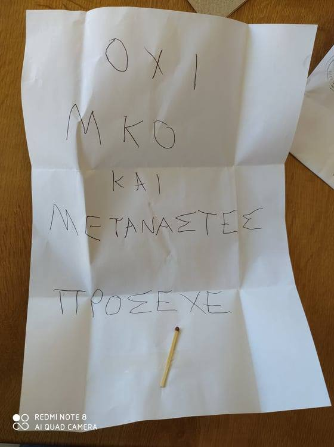
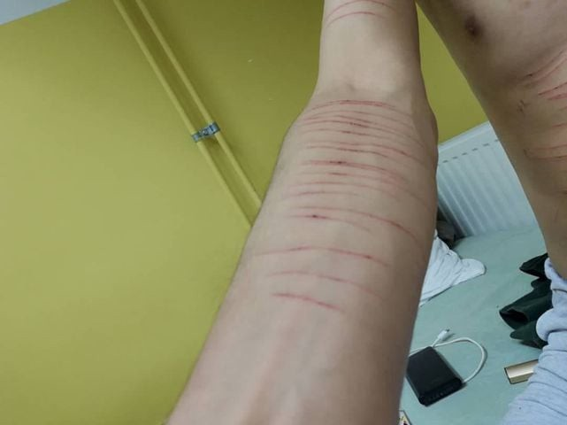
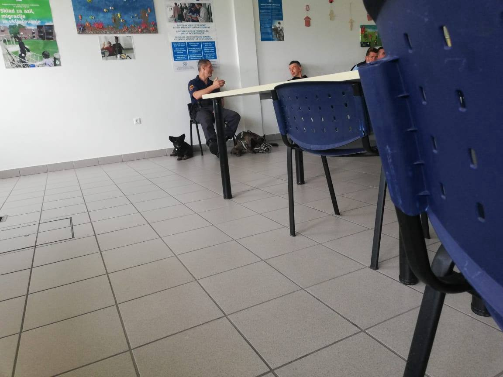
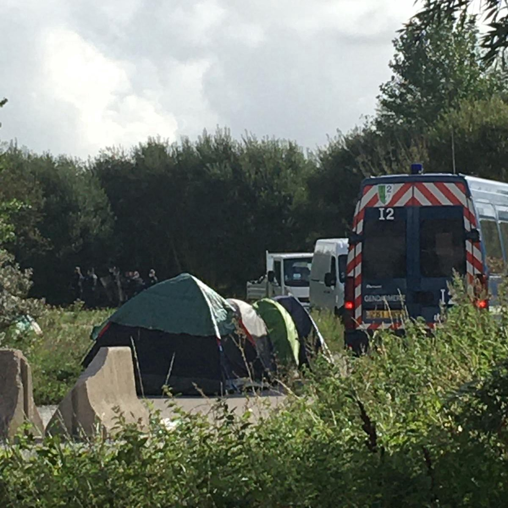

### AYS Daily Digest 27/8/20 — Melilla: The impossible system

[Are You Syrious?](@AreYouSyrious?source=post_page-----7150137ff895----------------------)

[Aug 28](ays-daily-digest-27-8-20-melilla-the-impossible-system-7150137ff895?source=post_page-----7150137ff895----------------------) · 14 min read

“Homemade” Rescue Vessel brings 89 people to safety / No safe port for more than 300 people / Death threats for hoteliers on Lesvos / Human rights violation in the Canaries / Britain First members harass people on the move housed in hotels

 \)](assets/aa35d049dfe0/0*MiKAnqTiiTfJG5nZ.jpeg)

Melilla \(Photo by [Solidary Wheels](https://twitter.com/SolidaryW/status/1299044507330240514/photo/1) \)
### FEATURED — Melilla: The impossible system

An unaccompanied minor [died](https://www.diariosur.es/sucesos/muere-melilla-menor-20200827132542-nt.html#ns_campaign=jcbt&ns_mchannel=diariosur&ns_source=tw&ns_linkname=ltl&1598538454&ref=https:%2F%2Fwww.diariosur.es%2Fsucesos%2Fmuere-melilla-menor-20200827132542-nt.html) on Wednesday night while trying to swim towards a passenger ship en route to mainland Spain\.

As [Solidary Wheels commented](https://twitter.com/SolidaryW/status/1299044507330240514) , this is not just a death, this is a “direct consequence of a system that makes it impossible for unaccompanied minors to obtain the documentation that allows them to leave Melilla legally,” pushing them towards dangerous attempts to reach the mainland, which too many times leads to them getting hurt or paying with their lives\.

Also, this last death comes after [days of protests and riots inside the CETI in Melilla](https://twitter.com/SolidaryW/status/1299087123186933760) , which led to several arrests, injuries and no solution for the people stuck in the enclave\. Protests ensued following a new spike in COVID\-19 cases recorded within the CETI, as people on the move sought to draw attention to overcrowding and their fear of further spread of the contagion

It has becoming a routine practice in several countries to use COVID\-19 in order to ignore their duties and laws\. Since April, the Spanish minister of the interior has been [ignoring](https://www.eldiario.es/desalambre/interior-ignora-abril-peticion-defensor-pueblo-trasladar-migrantes-saturado-ceti-melilla-peninsula-riesgo-contagio_1_6182986.html) recommendations from Ombudsman to facilitate transfers to the mainland\. **In a perfect vicious circle, such recommendations were put in place to prevent a further spread of the virus, the same argument that the government is now using to justify its action and halt transfers\.**

SEA
### “Home\-made emergency vehicle” Louise Michel rescues 89 people

We reported on the arrival of the independent rescue vessel Louise Michel in the Central Mediterranean over the weekend\. The vessel has since been involved in joint rescue missions with Sea Watch 4; yesterday alone it rescued 89 people\.

You can support them on their [website](https://mvlouisemichel.org/) or read more about them [HERE](https://www.theguardian.com/world/2020/aug/27/banksy-funds-refugee-rescue-boat-operating-in-mediterranean) \.

GREECE
### Arrivals and returns

[Aegean Boat Report](https://www.facebook.com/AegeanBoatReport/photos/a.285312485325196/907028496486922) and media outlets have reported two rescues carried out between Tuesday and Thursday off the island of Rhodes\. On Tuesday night, a total of 96 people were rescued after the shipwreck of one boat near the small island of Halki, north\-west of Rhodes\. Media [report](https://abcnews.go.com/International/wireStory/greece-man-child-missing-migrant-boat-sinking-72646971) s state that 72 people were transported to Rhodes, five to the island of Karpathos and 19 were picked up from a cargo ship by the Turkish coast guard\. A father and a child are reportedly still missing\.

On Thursday night, rescue operations were ongoing for a sailboat that was reportedly carrying 55 people and in distress southeast of Rhodes\.

> _Initially it was reported that there was a fire in the engine room — this has not been confirmed\. A passenger on the boat called 112 and asked for help\. Two boats from HCG, a navy ship, three commercial vessels and a helicopter participated in the rescue operation\. \( [ABR](https://www.facebook.com/AegeanBoatReport) \)_ 

A sailboat carrying 145 people was drifting outside Babakale, Turkey on Wednesday morning, [ABR report](https://www.facebook.com/AegeanBoatReport/posts/907078613148577) s\. After calling for help, they were picked up by TCG\. The destination of the boat is unknown, but Babakale is 8 miles from North Lesvos \. Two smugglers driving the boat was arrested\. Also on Wednesday, 41 people were [picked up](https://www.facebook.com/AegeanBoatReport/posts/907089869814118) from three life rafts drifting outside Kusadasi, Aydin, Turkey by TCG\. People from the boats claimed to have been placed in these rafts by the Greek coast guard, after trying to reach Samos, and left adrift at sea\. This is one of the many illegal pushbacks that Prime Minister Mitsotakis continues to publicly deny, despite the huge amount of proof and testimonies provided by people on the move, activists, human rights observers and media outlets\.
### Updates from Lesvos

 \)](assets/aa35d049dfe0/0*ltEvOrWBJ_SbXJ7a.png)

Moria camp \(Photo by [MCAT](https://www.facebook.com/MoriaCoronaAwarenessTeam/photos/pcb.170982827864229/170982721197573) \)

Media [report](https://www.stonisi.gr/post/10965/epishmh-anakoinwsh-gia-22-kroysmata-shmera-sth-mytilhnh-realtime) that on Thursday 22 new cases of COVID\-19 were detected on the island\. This brings the total cases reported on Lesvos since August 12 to 81\. None have yet been reported in the camp\. The Moria Corona Awareness Team is carrying on with their work, “but every day we get more scared, because it just seems a question of time until the virus reaches Moria camp\.”
### More threats to hoteliers in the Molyvos\-Petra area, north of Lesvos

Stefanos Michiotis [reported](https://www.facebook.com/notes/%CF%83%CF%84%CE%AD%CF%86%CE%B1%CE%BD%CE%BF%CF%82-%CE%BC%CE%B9%CF%87%CE%B9%CF%8E%CF%84%CE%B7%CF%82/%CE%B7-%CE%B5%CF%85%CE%B8%CF%8D%CE%BD%CE%B7-%CE%B3%CE%B9%CE%B1-%CF%84%CE%B7%CE%BD-%CE%BA%CE%BB%CE%B7%CF%81%CE%BF%CE%BD%CE%BF%CE%BC%CE%B9%CE%AC-%CF%80%CE%BF%CF%85-%CE%B1%CF%86%CE%AE%CE%BD%CE%BF%CF%85%CE%BC%CE%B5-%CF%80%CE%AF%CF%83%CF%89-%CE%BC%CE%B1%CF%82/994175274026124/) that new threats have been sent to his house because he is willing to host people on the move in his hotel\.

“No NGOs or immigrants\. Be careful” \(Photo by [Stefanos Michiotis](https://www.facebook.com/notes/%CF%83%CF%84%CE%AD%CF%86%CE%B1%CE%BD%CE%BF%CF%82-%CE%BC%CE%B9%CF%87%CE%B9%CF%8E%CF%84%CE%B7%CF%82/%CE%B7-%CE%B5%CF%85%CE%B8%CF%8D%CE%BD%CE%B7-%CE%B3%CE%B9%CE%B1-%CF%84%CE%B7%CE%BD-%CE%BA%CE%BB%CE%B7%CF%81%CE%BF%CE%BD%CE%BF%CE%BC%CE%B9%CE%AC-%CF%80%CE%BF%CF%85-%CE%B1%CF%86%CE%AE%CE%BD%CE%BF%CF%85%CE%BC%CE%B5-%CF%80%CE%AF%CF%83%CF%89-%CE%BC%CE%B1%CF%82/994175274026124/) \)

> _A few days ago, my minor son found in the mailbox of our family hotel, in Petra, Lesvos, an envelope that contained a piece of paper with only five words: “NO NGOs AND IMMIGRANTS\. BE CAREFUL”\. And below, a match stuck\. The message is clear: we will burn you if you put immigrants\._ 
 

> _According to police, identical threatening messages were sent “anonymously” to several hoteliers and tourism professionals, who have recently been targeted by “known strangers”, who are sowing fear and division on the island\._ 
 

> _Death threats are the latest escalation of a large series of acts of intimidation and blackmail against some, who do not accept the unfounded risk surrounding immigration, nor do they let unhistorical slanderers decide about their property\. It was preceded by “spontaneous” rallies outside hotels, damage to the property of “traitors”, red paint on the walls of their homes and incitements to boycott their businesses\. It was also preceded by the attempted arson of a hotel in Molyvos, the false stay for \(allegedly\) urban planning violations of another hotel in Petra and of course, the well\-known “well\-intentioned” advice to hoteliers, such as “go back, because you will eat your head” or “Just make a statement that you are not interested\.”_ 

> _\[…\] I therefore address the Prosecutor’s Office and the Police Directorate of the island and ask for their decisive intervention, for the dissolution of this local Ku\-Klux\-Klan, before it is too late\._ 
 

> _I also address the Regional Governor Konstantinos Moutzouris, the man who, after many positions, returned to his place promising a “leap of progress”\. And I only ask him this:_ 
 

> _Is division and obscurantism the political legacy he wants to leave on the island where he was born?_ 
 

> _August 26, 2020_ 
 

> _Stefanos Michiotis_ 

Read the full statement \(in Greek\) [HERE](https://www.facebook.com/notes/%CF%83%CF%84%CE%AD%CF%86%CE%B1%CE%BD%CE%BF%CF%82-%CE%BC%CE%B9%CF%87%CE%B9%CF%8E%CF%84%CE%B7%CF%82/%CE%B7-%CE%B5%CF%85%CE%B8%CF%8D%CE%BD%CE%B7-%CE%B3%CE%B9%CE%B1-%CF%84%CE%B7%CE%BD-%CE%BA%CE%BB%CE%B7%CF%81%CE%BF%CE%BD%CE%BF%CE%BC%CE%B9%CE%AC-%CF%80%CE%BF%CF%85-%CE%B1%CF%86%CE%AE%CE%BD%CE%BF%CF%85%CE%BC%CE%B5-%CF%80%CE%AF%CF%83%CF%89-%CE%BC%CE%B1%CF%82/994175274026124/) \.
### Updates from Chios

Chios Solidarity published a statement on the situation in Vial camp and on the whole island\. Here are some excerpts:

> _An announcement — handwritten — in Vial on 31/7/20 imposes the use of a mask everywhere\. However, without providing masks to the “guests”\. They are asked to follow the protection measures, such as distances, while every day hundreds of people wait in line for hours for food\. They are asked to wash “thoroughly” while the soap in the toilets is rare, the antiseptic is rarer\. Vial does not provide these items but does not allow them to leave the camp to buy them\._ 

> _The medical care is basic\! A doctor for 4500 people\. A volunteer medical team is trying to fill the gaps with a few volunteers\. Coronavirus\-positive patients live in medieval conditions without adequate medical care, without running water\. There is no plan if more people get sick\. Third world conditions, conditions of shame for the country\._ 

> _Vial workers are prevented from taking the Korona test, sometimes indirectly threatened, and EODY is virtually non\-existent, as is the Ministry of Immigration, which only knows how to do direct assignments\._ 

> _And it’s not that there was no time or money to organize and improve all of those\. It is that the whole issue of creating Vial was problematic from the beginning\. And no brave action was taken all these years to stop it\! And that’s where we got to this point\. A health bomb for which only refugees are NOT responsible\._ 

### Updates from Samos

[Glocal Roots](https://www.facebook.com/GlocalRoots/posts/1783738128456019) is conducting a collection campaign for their ‘We are One’ women’s centre\.

They need:
- Wool
- Fabric \(leftovers\)
- Sewing patterns
- Sewing machines
- Baby dresses: size 50 to 68
- Nail polish

If you are interested, please contact them at: meier\.linda@gmx\.ch
### Updates from Patras

MALTA
### Authorities denies safe harbour to Sea Watch 4 and Etienne

The commercial vessel Etienne rescued 27 people on the 5th of August and has been anchored off Malta since then\. Maltese authorities are refusing to provide safe harbour for people on board and are instead using the vessel as a floating prison, despite calls to transfer people on the mainland from civil society and the captain of the Etienne\. On Thursday, the Sea Watch 4 sailed by the Etienne and transmitted a solidarity message to the crew and the people stuck on the ship\. Maltese authorities has denied safe harbour to them as well\. Sea Watch 4 is carrying 200 people after 3 different rescues over the weekend\. Italian authorities have yet to respond to the request to disembark\.

ITALY
### Arrivals and quarantine ships

Over the past week, we reported on the dispute between the region of Sicily and the government in Rome over the ongoing closure of refugee facilities, and the various failures to provide safe measures against the spread of the virus within these facilities\. At the same time, 700 people on the move who were on the Mediterranean island of Lampedusa were [transferred](https://orf.at/stories/3179059/) to the quarantine ship ‘Azzurra’ yesterday, which is anchored off Lampedusa\. Another quarantine ship, the ‘Aurelia,’ with 220 refugees on board, is located off Lampedusa\. The quarantine ships are meant to relieve the Lampedusa hotspot, which until recently housed 1,200 people\.

On Thursday, a group of Tunisians landed directly in the port of the island\. They were identified by security forces and taken to the hotspot, where they were subjected to coronavirus tests\.
### A story from the CPR in Gradisca d’Isonzo

[NoFrontiereFVG](https://nofrontierefvg.noblogs.org/post/2020/08/27/intervista-ad-hossin-fratello-gemello-di-hassan/) published an interview with the brother of a young man detained in the CPR in Gradisca\. On the 14th of July, he was taken to the hospital, while his cell mate died in unclear circumstances\.

Interview with Hossin \(in Italian\)

Since then, official accounts from the management of the CPR have described the death as the consequence of a fight, as a murder, and as a drug overdose, painting contrasting pictures in which the actions of the guards were never questioned\.

As NoFrontiereFVG [comments](https://nofrontierefvg.noblogs.org/post/2020/08/27/intervista-ad-hossin-fratello-gemello-di-hassan/) :

> _Instead, CPRs are concentration camps where the state locks up people who have loved ones, lives and dreams in Italy, for not having a document in order\. Although it is no mystery that many inmates are given psychiatric drugs, who decide to take them often to survive the horror, and that tranquillisers are administered to calm the most restless souls, Hassan took neither methadone nor heroin and anyone dying in CPRs is murdered by the state\._ 

SPAIN
### Arrivals

60 people were [rescued](https://www.canarias7.es/canarias/fuerteventura/rescatan-patera-ocupantes-20200827201049-nt.html?fbclid=IwAR0jzAdW4gyoVkmD0h9dUnoWmBTPFBnNErNOmwB6-rmAlJy0Zc_wZxvC0g8&ref=https%3A%2F%2Fwww.canarias7.es%2Fcanarias%2Ffuerteventura%2Frescatan-patera-ocupantes-20200827201049-nt.html) 57km from the Canary Islands on Thursday\. The alarm was given by [Caminando Fronteras](https://twitter.com/walkingborders) \. They were adrift due to lack of fuel and have been taken to Fuerteventura\.
### Human rights violations in the Canary islands

Spanish media [report](https://cadenaser.com/emisora/2020/08/27/ser_lanzarote/1598530693_700999.html) that the organisation [Caminando Fronteras](https://twitter.com/walkingborders) has collected several testimonies from people who arrived in the Canary islands in recent months, in which they claim that their rights have been violated in the reception centres of the archipelago\. Specifically, the complaints verified by the group have to do with expulsions of people on the move from reception centres without any provision of alternative housing\.

Women living in a centre in Lanzarote have lived “for two months without running water \(only in the showers\)”; they share a single bathroom with approximately a hundred people\. They are without an Internet connection to communicate with their families, and they are “forced to look for clothes in the garbage” in order to clothe themselves\.

Caminando Fronteras have “documented expulsions of pregnant women who see their physical and emotional health and that of their baby at risk due to the stress of not having a place to go\.”

SLOVENIA
### Statement from Postojna Centre

\(Photo Credit: [Tukaj smo](https://web.facebook.com/Tukajsmo/?__cft__[0]=AZXbEMAIa1dGwgVhDdtiT4ozXea0PJVJa_wUt3kH3RzD6gRmjqO3IOYC4DTgg9ffo0yPM8N8gahbpNixsQ0oLjNDa5VB5Krc4by1u5wCKfwyNABME7F4v9vB7RinMUw_v7fLV8fnNsD6X3fQUi5V1EaO6PBjerxLKAT5kKOnkBAApQ&__tn__=-UC%2CP-R) \)

> _We are immigrants, we asked for asylum in the Republic of Slovenia\. We have been imprisoned in the Postojna center\. The conditions are very miserable and the food is not appropriate for a person at all, and the police is threatening us with dogs even in the eating hall\._ 

> _Personally, they used violence with me, and I was held in an isolation room for three days, and my psychological state is very bad because they treat us like animals\._ 

> _I’m imprisoned here because they want to deport me to Croatia and from Croatia to Bosnia, like they want to do with all other people\. My lawyer ‘forgot’ to appeal to my decision, so now it’s too late\._ 

> _The photos below are the photos of my body\. And the eating experience in Postojna — enjoy the meal while a bunch of police and dogs are watching you\._ 

> _xx, Algeria_ 

GERMANY
### First families arrive in Thuringia

Three families with eight children, a teenager, and a mother with a young child [came](https://www.mdr.de/thueringen/sued-thueringen/suhl/fluechtlinge-aus-camps-in-griechenland-jetzt-in-suhl-100.html) to Thuringia from refugee camps in Greece on Wednesday\. As a spokesman for the Ministry of Migration said, the 15 people had been checked for coronavirus in Greece\. The people — from Somalia, Iran and Afghanistan — came to Germany as part of the federal program; they are accommodated in the initial reception facility in Suhl\.
### “When human rights no longer apply”, event in Berlin, 30/8/20, h\.17\.00

[vdää Berlin and solidarity health care organised an event](https://www.vdaeae.de/index.php/themen/europeanhealthpolicy/1101-veranstaltung-des-vdaeae-berlin) for Sunday 30th of August on the human rights situation in the Aegean\. **Charlotte from the Association of Democratic Doctors,** who has just worked there as a doctor for 3 months, reports on the specific situation at the EU border using the example of Moria camp\. **Flo from Mare Liberum** has been to the Aegean Sea to monitor human rights and will shed light on deterrence strategies and practices\. In addition, **Barbara Wessel, asylum lawyer,** will inform us about the current status of the so\-called ‘Migration pact’\.

FRANCE
### Evictions in Calais continue

From [Human Rights Observers](https://twitter.com/HumanRightsObs) :

Calais, 27 Agugust 2020 \(Photo by [Human Rights Observers](https://twitter.com/HumanRightsObs/status/1299037344608157697) \)

> _On this Thursday, August 27, the police continue their expulsion operations in Calais \. Each place of life is evicted every 48 hours\. Many exiles got up at dawn in anticipation of the expulsion; many testify to the exhaustion caused by this harassment\._ 

DENMARK
### First city council to join the ‘Evacuate the Kids from Moria’ campaign

Media [report](https://jv.dk/artikel/s-flertal-send-flere-flygtningeb%C3%B8rn-til-s%C3%B8nderborg) that a majority in the Sønderborg City Council in Southern Jutland sent a letter to Minister of Immigration and Integration Matthias Tesfaye, in which they write that the municipality would like to receive unaccompanied refugee children from Greece\.

The municipal request for taking in refugee children from Greece is the first result of the campaign [Evacuate the kids from Moria](https://www.facebook.com/evakuermoria/) , whcih has been calling for citizens to contact the country’s 98 city councils to request that the government take in these children — and to sponsor or guarantee their stay in Denmark\.

UK
### Britain First harass people in emergency shelters

Far\-right members of the group Britain First have attempted to gain entrance to a number of hotels housing asylum seekers in London, Birmingham and Essex\. Media [reported](https://www.thelondoneconomic.com/news/britain-first-is-raiding-homeless-hotels-to-harass-asylum-seekers/27/08/) that the group managed to force its way into an hotel in Birmingham and harassed its residents\.
### The Law Society condemns Home Office for referring to ‘activist’ lawyers

Such ‘activist’ lawyers [managed to halt](https://www.theguardian.com/politics/2020/aug/27/home-office-wrong-to-refer-to-activist-lawyers-top-official-admits) a deportation flight to Spain on Thursday, due to the unprecedented high volume of legal challenges\.

While the Home Office’s statement on the cancellation did not make any reference to ‘activist lawyers’, it suggests that without the last\-minute challenges the flight could have gone ahead\.

The ‘Cancel the flights’ petition is close to reaching its target\. Help them [HERE](https://you.38degrees.org.uk/petitions/cancel-the-charter-flights-2) \.

Also, The Stylist published a list of charities and grassroots organisation you can support in the UK, check it out [HERE](https://www.stylist.co.uk/life/refugee-charities-organisations-how-to-help-crisis-uk/417163) \.

GENERAL

**A little too early to pat oneself on the back about the relocation of unaccompanied children?**

So far this year, and by [UNHCRs own admission, only 207](https://www.unhcr.org/news/stories/2020/8/5f07127d4/happiness-faces.html) children have actually been relocated\. 49 to France, 12 to Luxemburg, 53 to Germany, 50 to Finland, 25 to Portugal and 18 to Belgium\.

This leaves over 4000 children still in precarious living conditions\! Less than half of these children are in long term accommodation, while the rest remain in camps, police detention and other inappropriate short\-term structures\. What sort of EU solidarity allows for children to be held for unknown lengths of time in police cells?

Further info on the programme can be found [HERE](https://www.unhcr.org/5f0842ad4?fbclid=IwAR1rttQNQnRLtl4G0hLgpQr1qJZ5d9Dd6_yeZHMuo9tPS7jftRTdCUXDOz4) \.
### WORTH READING
- [**Greece has a deadly new migration policy — and all of Europe is to blame**](https://www.theguardian.com/commentisfree/2020/aug/27/greece-migration-europe-athens-refugees) **by the Guardian**

> _A vital part of international refugee law is the principle of non\-refoulement: the idea that states should not push people seeking asylum back to unsafe countries\. In a country like the UK, which does not sit next to a war zone, advocates of “tougher” policies to deter asylum seekers will claim that the principle does not apply, since people who reach Britain’s shores will have passed through several peaceful countries before they get there\._ 

- [**RSA and Pro Asyl legal framework \(or lack there of\) for asylum procedure in Greece\.**](https://search.coe.int/cm/Pages/result_details.aspx?ObjectId=09000016809f5507&fbclid=IwAR2NXHmlxPaoooRt90IPfjGhLLCNHUxJsPD6FIheLIO8uLyg3Lvaarvv6kI)

> _According to the Government observations to this Committee, Greece is dealing with “new challenges” and a “new crisis” stemming from increased numbers of arrivals over the past year\. In its recent ruling in N\.H\. v\. France, however, the Court stressed that a consistent increase in arrivals and strain on a country’s reception system differs from an exceptional crisis\. 2 The Court’s case law in any event maintains that, given the absolute nature of Article 3 of the European Convention on Human Rights \(ECHR\), states may not rely on the existence of a large influx of arrivals to justify noncompliance with their obligations\.3 RSA and Stiftung PRO ASYL stress that the Greek asylum system has been operating in a declared crisis mode for more than four consecutive years, as illustrated by the trigger of the fast\-track border procedure in April 2016 and its uninterrupted implementation until the end of 2020\. 4 The response of the Greek State to all aspects of refugee protection \(accommodation, health care, interpretation, legal aid\) largely remains project\-based and dependent upon timelimited EU funding which does not guarantee continuity and sustainability of support\._ 

- [**Aegean Grassroots Report**](https://www.europemustact.org/) **\.**

> _This new report published by Europe Must Act and 21 grassroots partners on the Aegean Islands, provides an overview of the humanitarian crisis in the Aegean and offers pragmatic and rights\-based solutions based on the expertise of grassroots organisations working with asylum\-seekers there\. The organisations are urging European leaders and governments to immediately evacuate the Aegean camps and exchange deterrence strategies for a more humane approach which puts the human rights of refugees and asylum\-seekers at its core\._ 

- [**When the criminalization of solidarity risks being criminalized: the case of Matteo Salvini**](https://rli.blogs.sas.ac.uk/2020/08/27/when-the-criminalization-of-solidarity-risks-being-criminalized-the-case-of-matteo-salvini/)

> _As every summer it is boiling hot in Italy and while people flock to tourist beaches, irregular migrants crossing the Mediterranean Sea are making headlines again fuelling a rhetoric that blames them for the ills of the country, currently the spread of Covid\-19, and humanitarian ships for aiding their arrival\. What is new this summer is that on July 30 Italy’s upper house voted 149 to 141 to strip the head of the anti\-immigrant League Party Matteo Salvini of his parliamentary immunity, paving the way for his trial on charges of kidnapping and illegally detaining migrants at sea off the coast of Lampedusa, south of Italy\._ 

_Converted [Medium Post](https://medium.com/are-you-syrious/ays-daily-digest-27-8-20-melilla-the-impossible-system-aa35d049dfe0) by [ZMediumToMarkdown](https://github.com/ZhgChgLi/ZMediumToMarkdown)._
