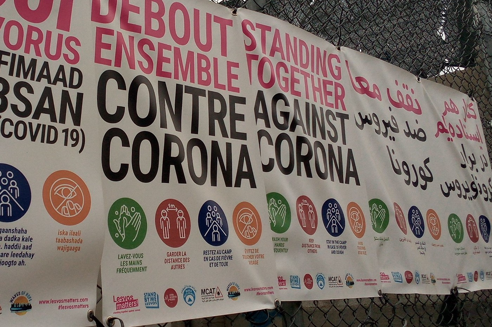
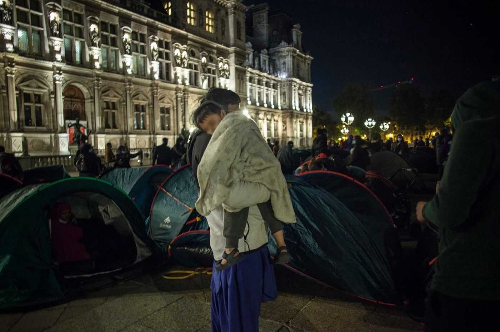

### AYS Daily Digest 02/09/2020: Coronavirus reaches Moria
#### Quarantine imposed over Moria after first positive case // 5th death anniversary of Alan Kurdi\. New rescue ship will carry his brother’s name // People stranded in Bosnia and Herzegovina // Port of Palermo allows disembarkation for people on SeaWatch 4

Info signs in Moria\. Copyright: Stand by me Lesvos
### FEATURE: First infection reported from Moria Camp

We all knew that this day would come, and here we are: COVID\-19 reached Moria camp\. A 40\-year old man tested positive on Tuesday night after falling sick on Monday\.

About 13,000 people currently live in Moria\. That is 10,000 above the camp’s original capacity\. A lockdown was first imposed on 22 March, when the whole country went into lockdown\. But while the rest of the country slowly went back to normal and even started to receive tourists on the islands, the lockdown for the camps was prolonged, time and again\. To date the camp has been in lockdown for about 160 days\. This means that only one member of a family is allowed to leave the camp at a time\. NGOs on the ground are only allowed after authorization from the camp management\. Access especially to legal aid is limited\. And the opportunities to escape the constant smells and noises of a completely overcrowded camp were taken away from the people\. Under the pretext of prevention, refugee’s rights have further been restricted\.

According to MSF about 300 to 400 high\-risk patients are among the residents\. One of them is the man from Somalia who has tested positive for COVID\-19\. According to local media he has underlying health issues\. He has been transferred to Mytilin hospital\. The man is a recognized refugee and went to Athens because he received an exit decision, meaning he had to leave the camp and find accommodation and income without governmental support\. But the situation in Athens is hopeless\. For about three months we have been reporting about people stranded at Victoria Square in Athens, sleeping rough and without sanitary infrastructure\. The Somali man seems to have encountered a similar situation, as he decided to return to Moria camp\. Apparently he set up his tent in the Olive Grove, the unofficial part of Moria next to the official structure\. It is not clear yet whether he was infected in Athens or at the camp\.

A team of the Public Health Organization \(EODY\) was sent to Moria in order to trace his contacts\. Meanwhile quarantine has been imposed on the whole camp\. According to the announcement of the Greek Ministry of Migration and Asylum:

> “For the period, until 15 September 2020, entry and exit from the hosting structure will be explicitly prohibited, while EL\.AS\. will have an enhanced presence in the area around the structure, to comply with the traffic ban 24 hours a day\.” \(GT\) 

Only security personnel is allowed to enter the camp, but only after a temperature check\.

The world has had time to learn how to live with the virus for half a year now\. During that time, countless refugees, activists and NGOs have constantly warned about the immense health risk that 13,000 people will face when the virus reaches Moria\. Also during this time, MSF has been forced by local authorities to close down an isolation centre for suspected cases of coronavirus infection\. Apparently a new facility, financed by Dutch money, is not yet running, even though an opening ceremony was held some weeks ago\.

During a time when everybody was calling for social distancing, regular hand washing and staying at home, little was done to protect the people in Moria\. They, still, had to line up by the thousands to receive food; they share toilets and have no continuous access to running water\. These are the perfect conditions for the virus to spread\.

Given these living conditions it seems a wonder that the virus did not reach the camp much earlier\. This must be attributed in large part to the tireless work of refugee\-led organizations in the camp like Moria White Helmets and especially the Moria Corona Awareness Team\. From the first news of the virus reaching Europe, the Moria Corona Awareness Team formed and started various campaigns in order to inform the people in the camp about the virus and how to protect oneself and others\.

**We can only hope this is not the beginning of a new tragedy for Moria\.**

This article gives a good overview over the medical situation in Moria and the situation on the streets of Athens after the government’s decision to cut housing and financial support for recognized refugees:

### GENERAL: 5th anniversary of Alan Kurdi’s death

Five years ago today, Alan Kurdi died in the Aegean Sea\. His tiny body was washed ashore in Bodrum, Turkey\. The three\-year\-old boy died with his mother and his older brother when trying to reach Europe\. The picture of the boy’s body lying lifeless at the beach reached global attention\. For a little while it seemed like the world understood that nobody should have to climb onto an overloaded rubber boat together with small children in order to seek safety\.

Five years later European politicians are praising themselves for ‘protecting borders’ which means nothing less than intentionally putting peoples lives at risk while at the same time ignoring obligations to protect human rights\.

According to Save the Children, in the five years since Alan Kurdi’s death:

**“more than 700 children, including babies, lost their lives trying to reach European shores, during perilous journeys by sea\.”**

The director of Save the Children Europe, Anita Bay Bundegaard, said:

> “The way Europe has treated the most vulnerable children in their hour of need is unacceptable\. On any given day since August 2019, an average of 10,000 children were stranded on the Greek islands, 60% of them are under 12 years old\. While some efforts were made to relocate children out of Greece, thousands have been abandoned due to the unwillingness of some European countries to take in and care for some of the most vulnerable children in the world\. Children continue to die on the EU’s doorstep while European leaders look the other way”\. 

The German NGO Sea\-Eye announced on Tuesday that is about to equip a new ship to conduct rescue missions in the Mediterranean Sea\. The NGOs first ship is named the ALAN KURDI\. The new ship will be named the GHALIB KURDI, after Alan Kurdi’s brother\.

■■■■■■■■■■■■■■ 
> **[sea-eye](https://twitter.com/seaeyeorg) @ Twitter Says:** 

> > #Breaking Wir kaufen ein Schiff! 
Es wird den Namen von Alans verstorbenem, älteren Bruder #GhalibKurdi tragen. Die Vorfälle der letzten Tage auf dem Mittelmeer haben gezeigt, dass dringend mehr einsatzbereite Rettungsschiffe gebraucht werden!
[sea-eye.org/ghalib-kurdi-i…](https://sea-eye.org/ghalib-kurdi-ist-unser-neues-rettungsschiff/) 

> **Tweeted at [2020-09-01 12:10:14](https://twitter.com/seaeyeorg/status/1300767924513316866).** 

■■■■■■■■■■■■■■ 

A book written by the two brothers’ aunt Tima Kurdi with the title “The Boy on the Beach” will soon be published in German\.

This article explains how in the UK, the lesson of Alan Kurdi’s death has been forgotten five years later\.

This article takes a more general glance at what changed in migration politics after Alan Kurdi’s death\.

### SERBIA

The NGO Asylum Protection in Serbia reported an increase of pushbacks to North Macedonia, committed by Serbian police\. Apparently violent methods like dogs and batons are often being used\.

The group also reported that one person from Morocco drowned in the river Tisza when trying to cross the border into Hungary\. This is the fourth case of a person drowning reported to the group within one week\.
### Bosnia and Herzegovina

Recently, media attention on the situation in BH has risen\. More than 10,000 refugees are stuck in this small country, as the Croatian police are using massive violence in order to reinforce the borders\. New restrictions in the Una\-Sana Canton close to the border allow police to round up people on the move who are not registered with the official camps and bring them to the demarcation line with Republika Srpska, one of the two BH entities\. Republika Srpska is even more restrictive and won’t let people enter in the first place\. People on the move end up being stuck between the two BH entities, while the official camps are already over their capacity and won’t allow more people in\. Many try to find irregular shelter in the forest surrounding Lipa camp close to Bihać\.

This article gives a good overview of the situation:

### SEA

> Finally\! 

■■■■■■■■■■■■■■ 
> **[Sea-Watch International](https://twitter.com/seawatch_intl) @ Twitter Says:** 

> > We are happy for the 353 survivors who were able to disembark in #Palermo. The past weeks show once more: states do not act and civil rescue ships are desperately needed in the central Mediterranean! The #SeaWatch4 will return to Europe's deadliest sea border as soon as possible. https://t.co/5IC4XOku8U 

> **Tweeted at [2020-09-02 15:06:03](https://twitter.com/seawatch_intl/status/1301174554761596928).** 

■■■■■■■■■■■■■■ 

The people who were now allowed to disembark have in part been saved by the Louise Michel, a new rescue boat financed by street artist Banksy\. The ship was so overloaded with rescued people that it was unable to maneuver\. Last Saturday the people were transferred to the SeaWatch 4 vessel that was now allowed to enter Palermo’s port\.
### AUSTRIA

The Austrian leader Sebastian Kurz presented once again his anti\-humanitarian attitude towards refugees\. In an interview with the German news agency dpa he expressed his happiness about the fact that five years after the summer 2015, migration politics have changed completely\. Admitting large numbers of refugees was a mistake in the first place\. We would like to remind our readers here that the people who came to central Europe in 2015 went through an asylum procedure, as intended by European migration laws\. Kurz went on to praise the Greek Prime Minister for protecting the country’s external borders\. We also want to remind our readers that by doing this, Greece is breaching its obligation under the European Convention on Human Rights\. Kurz finally attributed anti\-Jewish sentiments to people from majority\-Muslim countries and said that part of the antisemitism in Austria is imported\. This is an often used narrative for anti\-Muslim racism\.

At least in Germany, antisemitism is a well\-integrated feature in the non\-Muslim part of society\. This was vividly demonstrated last weekend, when tens of thousands of people marched through Berlin and even climbed the stairs to the German parliament\. The protesters presented a wide spectrum: extreme right\-wing; people who believe in a conspiracy theory that claims that the Federal Republic of Germany does not exist; members of the right\-wing populist party AfD and people who present themselves as one\-love hippies without any political agenda\. Antisemitic symbols and narratives are a popular feature among these people who see themselves as fighters against a corona\-dictatorship\. The number of muslims amongst them can be assumed to have been relatively small\.

For an article by InfoMigrants on Kurz’s statements, see:

### FRANCE

More than 200 people on the move pitched their tents in front of Paris City Hall in the heart of the city\. The aim of this action was to bring attention to the situation faced by these people\. The event was facilitated by the NGO Utopia56\. One member of the group told InfoMigrants:

> “The authorities want to make them invisible by preventing them from settling on the pavements of Paris and its suburbs\. Many lived in tents towards \[the northern suburb of\] Aubervilliers, but were regularly chased away by the police, and they must be accommodated in a dignified and unconditional way\.” 

On Tuesday morning the people were evicted by the police by force\. After negotiations with the prefecture and Paris City Hall the people were given a room within the City Hall building, while others were transferred to hotels\.

Copyright: Utopia 56

Find more information here:

The Utopia 56 team Lille is looking for new team members\. Please refer to their Facebook page for more information\.

Solidarité Migrants Wilson published a video that was apparently taken at the HUDA Ozoir\-la\-Ferrière, a shelter for asylum seekers run by Coallia\. It shows a small kitchen with cockroaches running around everywhere\.

On Saturday, 5 September, SOlidarité Migrants Wilson will collect donations from 11 to 12 am at the Saint\-Denis Porte de Paris metro station \(line 13\) \.
### WORTH READING

This very interesting article looks at the way media, politicians and scientists use maps in the context of migration\. Its key message is that maps, in contrast to what they are often seen as, are far from being neutral\.

**Find daily updates and special reports on our [Medium page](https://medium.com/are-you-syrious) \.**

**If you wish to contribute, either by writing a report or a story, or by joining the info gathering team, please let us know\.**

**We strive to echo correct news from the ground through collaboration and fairness\. Every effort has been made to credit organisations and individuals with regard to the supply of information, video, and photo material \(in cases where the source wanted to be accredited\) \. Please notify us regarding corrections\.**

**If there’s anything you want to share or comment, contact us through Facebook, Twitter or write to: areyousyrious@gmail\.com**

_Converted [Medium Post](https://medium.com/are-you-syrious/ays-daily-digest-02-09-2020-coronavirus-reaches-moria-c9cad5e9abf1) by [ZMediumToMarkdown](https://github.com/ZhgChgLi/ZMediumToMarkdown)._
