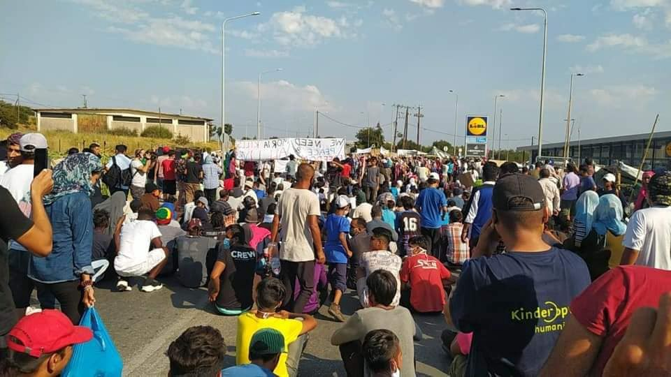

### AYS Daily Digest: Weekend 12–13/09/2020: Protests Of Former Moria Residents Are Met With Tear Gas
#### All the weekend updates on the situation on Lesvos // People rescued by Etienne are finally allowed to disembark // Chain pushback reported from Austria to Bosnia and Herzegovina // Joint statement by NGOs against ban of food distribution in Calais

Protest of former residents of Moria, Copyright: Elena Depi di Piccoli
### FEATURE

What means good news these days? Good news means that 25 people are allowed to disembark after 40 days at sea, in European waters, and all the while Europe was watching and doing nothing\. 
The group of people was rescued by the commercial vessel Etienne in early August\. The ship then lay off the coast of Malta, waiting for an allowance to enter the port, but that allowance never came\. On Friday the people were transferred to the NGO ship the Mare Jonio that is better equipped in medical terms\. Many of the people were in serious psycho\-physical conditions\. Three of them have tried to jump overboard the Etienne and swim to the shore\. On Friday night a four\-month pregnant woman was evacuated from the Mare Jonio together with her husband, as her situation has worsened\. 
On Saturday the Italian authorities finally assigned Pozzallo, Sicily as port for disembarkation\. On Sunday night the people could finally set foot ashore, after the longest stand\-off in European maritime history\.

■■■■■■■■■■■■■■ 
> **[Mediterranea Saving Humans](https://twitter.com/RescueMed) @ Twitter Says:** 

> > 🔵 At 22.40 today the 25 people that were transferred from the @maersktankers #Etienne to the #MareJonio landed in #Pozzallo. 
This puts an end to the longest and most shameful stand-off in European maritime history. https://t.co/tsEufBv5ho 

> **Tweeted at [2020-09-12 22:25:35](https://twitter.com/rescuemed/status/1304909048735764480).** 

■■■■■■■■■■■■■■ 

The Danish company Maersk to which the Etienne belongs, is calling on the responsible governments to find a solution for future similar cases\. But the chief technical officer of Maersk Tankers, Tommy Thomassen, also stated that his company would always provide help for people in distress, if needed\.

> “Those instructions are the ones we have had for 100 years,” he said in an interview\. “When people are in need of help, we will step in\. We have always done that\. It is the duty of every seafarer\. It is so deeply ingrained in our DNA and our values\. And that is what the captain of Maersk Etienne did\.”

For more information, see:

### UPDATES FROM MORIA

We try to sum up the fast\-evolving events on Lesvos during the first weekend after a fire destroyed Moria camp\. 
Most of the former residents of Moria are still trapped on the road between Moria and Mytelini, in the area of the Kara Tepe camp and Lidl supermarket\.

■■■■■■■■■■■■■■ 
> **[MSF Sea](https://twitter.com/MSF_Sea) @ Twitter Says:** 

> > This baby is 10 days old. 

Since #Moria fire she inhaled smoke, tear gas & has slept on the street without a tent for 4 days. She's been vomiting at night. 

Is it right for babies, elderly & sick people to be left like this? #EU states, where are you? https://t.co/FMQocBGA1e 

> **Tweeted at [2020-09-12 14:32:46](https://twitter.com/msf_sea/status/1304790059275739137).** 

■■■■■■■■■■■■■■ 

On both Saturday and Sunday, there were **demonstrations** held\. The people are afraid of a new Moria and no change to their situation\. A scenario that seems to be quite accurate, taking into account the current developments on Lesvos and at the European level\.

■■■■■■■■■■■■■■ 
> **[Moira Lavelle](https://twitter.com/Alohamoira) @ Twitter Says:** 

> > “No camp. Freedom.”

More demos in the confined area near the former #Moria today. https://t.co/AhGPx99UJY 

> **Tweeted at [2020-09-13 12:25:51](https://twitter.com/alohamoira/status/1305120505561841664).** 

■■■■■■■■■■■■■■ 

During the protest, **tear gas** was repeatedly shot at the people by the police, even at children\. People were chased, makeshift tents destroyed\. We have seen videos of children crying and trying to wash the tear gas out of their eyes\. For reasons of child protection we decided to not embed these videos here\. Nevertheless the accounts of children being wounded after being shot at with teargas have been given by various NGOs\. **Journalists** have repeatedly been blocked from entering the area during the protests\.

The police are heavily equipped\. On Sunday morning five more **riot police** squats arrived to the island, together with special armed vehicles
\(See [here](https://www.stonisi.gr/post/11391/kai-eidika-tethwrakismena-oxhmata-sth-mytilhnh?fbclid=IwAR2oyqR6w5At8gVdP4RrDyqD4cqdWJW9TBKj1RxnuTzqIEgA79IGDc-cs58) \) \.

At the same time, people are in fear of being attacked by local **fascists** \. It has been reported that the police would allow fascists to cross the street blockade and does nothing to stop them from threatening the former residents of Moria\. As on similar occasions before, far right ‘activists’ from Germany and Austria have also made their way to Greece, in this specific case, for example, Rebecca Sommer from Germany\.

The **food and water situation** is still highly problematic\. NGOs tried to take over the state’s assignment of providing basic needs, causing long lines and tumult at the point of distribution\. It seems that on Sunday some official food distribution started once a day, but that was not enough for all the people\.

This video shows a line of people waiting for food:

■■■■■■■■■■■■■■ 
> **[DunyaCollective](https://twitter.com/DunyaCollective) @ Twitter Says:** 

> > Finally a food distribution takes place. Police decided to end the siege for this moment. The foodline is long. People are very hungry. Still it is not allowed for press to enter #LeaveNoOneBehind #NoMoreMoria #Moria #moriaevakuieren #EU https://t.co/yVoZxSUEib 

> **Tweeted at [2020-09-13 13:28:35](https://twitter.com/dunyacollective/status/1305136295157657600).** 

■■■■■■■■■■■■■■ 

Meanwhile, a **new camp** has been set up, north of Kara Tepe at an old shooting range\. According to a statement by the Greek Minister of Migration and Asylum, Notis Mitarachi, 5000 beds should be ready by Sunday night\. However, as Aegean Boat Report pointed out, there are only about 200 tents set up, each with an official capacity of hosting six people\. It seems that there is no more space to set up more tents\. Even if the tents host four more people than they are designed for, the camp will only have a total capacity of 2000 people\. That means that more than 10,000 people will still be without shelter\. 
It has been reported that there are only few hygiene facilities and not enough mattresses and blankets\. The tents are set up very close to each other, increasing the risk of spreading a fire\.

The new camp structure\. Copyright: Giogos Moutafis

Until now, about 500 people decided to enter the camp\. They all were tested for Coronavirus, and apparently 14 of them positive\. \(See [here](https://www.stonisi.gr/post/11405/14-kroysmata-koronoioy-ston-kara-tepe?fbclid=IwAR1kIG1DnqcKnPMoOEvtjowgq7nTDyiSMPekAW_cX1uVbrZhe7C1TYykjy4)) \) \.
Many people are afraid to enter the camp, as it seems to be a closed camp\. It is already fenced in and according to different sources people are not allowed to leave\. The Greek Ministry of Migration & Asylum started a campaign to motivate people to move into the new structure\. However, only families or people belonging to a vulnerable group will be allowed\.

**António Guterres,** UN\-Secretary\-Gerneral called on the European Union to receive refugees from Moira\.

> “It is a great tragedy\. \(…\) In my opinion, the only solution is to transfer these refugees to the continent and I hope that there will be European solidarity ”\.
 

> He further said: “This lack of coordination created this chaos, that refugees are the most tragic victims and that populism and the extreme right were the main beneficiaries,” said Guterres\. 

Here you can find a report by No Border Kitchen Lesvos on the current situation\.

### BALKAN

A group of people on the move has been chain\-pushed back from Austria to Bosnia and Herzegovina\. According to the testimony of one of the victims that NoNameKitchen collected, the group was apprehended in Laafeld, an Austrian border village\. After being held in a police station for a while they were brought across the border with Slovenia and handed over to Slovenian and then Croatian authorities, and in the end they were forced to walk back from Croatia to BH\.

Chain\-push backs are, like ‘normal’ push backs, illegal under the European Convention on Human Rights\. People have a right to ask for asylum and to have their application processed\. Collective expulsions of foreigners are forbidden\.
### LIBYA

At the latest UN Security Council meeting on Libya, Stephanie Williams, deputy head of the UN Mission in Libya \(UNSMIL\), gave a briefing on the situation in Libya\. She said that

> “It is becoming a regrettable cliché to appear before you and warn that Libya is at a critical juncture but yet I am compelled to pronounce these same words again today\.”

With regard to the situation of refugees in Libya and the Mediterranean, she expressed her grief over the loss of over 300 lives in the sea so far this year\. She calls on the European countries to find a better approach to the situation and a more humane disembarkation mechanism, in line with international human rights law\.

> “Libya cannot be considered as a safe port for disembarkation\. Many migrants and refugees that have been intercepted at sea have been returned to Libya and placed into detention\.”

She further said that as of 21 August almost 2,400 refugees are held in official detention centres in Libya, and many more in unofficial ones\. While the official sites are routinely subjected to grave human rights violations, the UN does not even have access to the unofficial sites\.
### TUNISIA

Two attempts to cross from Tunisia to Europe have been apprehended by the Tunisian Coast Guard this weekend\. In the first attempt that took place on Saturday, 54 Tunisians including three minors were detained\. They now face charges for “participation in an agreed intent to cross the maritime border illegally”\. The second attempt took place on Sunday early morning, when a group of 13 Tunisians including one woman and one child tried to leave the country\.
### FRANCE

According to the Human Rights Observers NGO, four evictions from informal living spaces occurred this week in Grande Synthe\. During these events, a large number of arbitrary arrests were conducted\. In 2020, 62 evictions took place in total\. 
Utopia56 together with nine other NGOs published a statement denouncing a new decree that bans food distribution in Calais\. The decree was published on 11 September\. It prohibits the distribution of food in the city centre of Calais in order to prevent health risks\. In the joint statement the NGOs highlight that it is not their distribution of food but the absence of care for exiled people by the authorities that is causing the health risks\. They also emphasize that by hampering the solidarity efforts, the decree contravenes the principle of fraternity, which has constitutional value\. 
Together with the never\-ending evictions and arrests, this is another shameful attempt by French authorities to worsen the lives of people on the move\.
### SPAIN

In Melilla, some children are not able to go to school because they are not registered in the Spanish enclave although they were born there\. Apparently there is a kind of bureaucratic boycott: Moroccans who are allowed to register in order to receive papers are not being processed properly\. This leads to children who are not able to attend school and people hiding in trucks that board a ferry to the mainland in order to leave the enclave\. The UN denounced Spain for breaching children’s rights for the case of an 11\-year old girl\.

For more Information, see:

### DENMARK

Denmark invented the new position of special envoy on migration\. The aim of this position is to push the idea of installing receptions centres for refugees outside EU borders\. The Danish government is running a strict anti\-migration policy\. The plan foresees that people will not enter EU territory but instead will have their asylum claims processed in reception centres outside of the EU\. 
We all know that this would lead to even more abuses and horrendous living conditions than what we see within Europe\.

For more information see [here](https://www.thelocal.dk/20200910/what-is-denmarks-controversial-new-migration-ambassador?fbclid=IwAR2oyqR6w5At8gVdP4RrDyqD4cqdWJW9TBKj1RxnuTzqIEgA79IGDc-cs58) \.

Tomorrow, Tuesday 15 September at 4 pm a demonstration will be held in front of Christiansborg, Copenhagen in order to call on the Danish government to receive the most vulnerable children from Moria camp\.
### SWEDEN

Sweden is not among the 10 EU countries who decided on the shameful idea of relocating at least 400 minors from Moria\. 
The Swedish Minister of Justice and Migration, Morgan Johansson, now explained that receiving refugees is not at his discretion\. Instead the Swedish Migration Board has the authority to decide\. The Swedish Migration Board, however, claims it cannot decide to receive people anyway else than via Dublin requests\. Since most of the children from the camp do not already have family in Sweden, this route is not an option for them\. 
Johansson’s press secretary said it would harm the constitution if one were to receive people beyond the Dublin regulation\. The Ministry could only take action if the European Commission forced Sweden to receive more people\. However we have seen the European Commission searching for a ‘European Solution’ for years now, yet no central/northern European countries are willing to participate in a reasonable way\. 
Anna Lundberg, a professor of welfare law, rejects this argumentation\. According to her, in a serious situation like the one the people on the Greek islands are facing, Sweden could act\.

> “If it is for strong humanitarian reasons, applications for asylum can be moved between different countries\. For example, Sweden can take over application processes from Greece\. As far as I can see, there are no obstacles for the Swedish Migration Board to create a process for taking over asylum applications from Greece, she says\.”

For more information, see:

### UK

Some of the children who are now worst affected by the fire in Moria camp should already have been reunited with their families in the UK\. According to The Independent, some children have been waiting to be relocated since May, but Greek and UK authorities did not manage to arrange the transfer\. Now they lost the little they had in the fire\. Especially when documents are lost, this could cause a further delay\. In the current situation of chaos and tension on the island it is very unlikely that they will be transferred any time soon\. It is important to stress that we are not talking about humanitarian relocation here, but the right of children under the Dublin regulation\. Even this is being denied them\.

For more information, see:

### GENERAL

IOM is recruiting people with disabilities:

■■■■■■■■■■■■■■ 
> **[IOM - UN Migration 🇺🇳](https://twitter.com/UNmigration) @ Twitter Says:** 

> > We are recruiting talent with disabilities for opportunities around the world!

Tune in next 14 October to join our online event and speak to IOM recruiters. 

Register here 👉 [gcfjobs.com/2QS2yRG](http://gcfjobs.com/2QS2yRG) https://t.co/n8vzns5lKa 

> **Tweeted at [2020-09-09 16:45:00](https://twitter.com/unmigration/status/1303736171684487168).** 

■■■■■■■■■■■■■■ 

**Find daily updates and special reports on our [Medium page](https://medium.com/are-you-syrious) \.**

**If you wish to contribute, either by writing a report or a story, or by joining the info gathering team, please let us know\.**

**We strive to echo correct news from the ground through collaboration and fairness\. Every effort has been made to credit organisations and individuals with regard to the supply of information, video, and photo material \(in cases where the source wanted to be accredited\) \. Please notify us regarding corrections\.**

**If there’s anything you want to share or comment, contact us through Facebook, Twitter or write to: areyousyrious@gmail\.com**

_Converted [Medium Post](https://medium.com/are-you-syrious/ays-daily-digest-weekend-12-13-09-2020-protests-of-former-moria-residents-are-met-with-tear-gas-347f42bfebd1) by [ZMediumToMarkdown](https://github.com/ZhgChgLi/ZMediumToMarkdown)._
