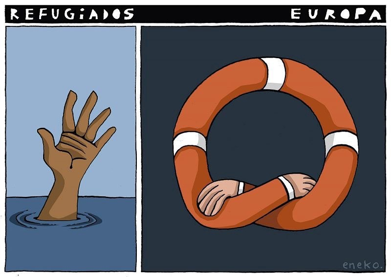
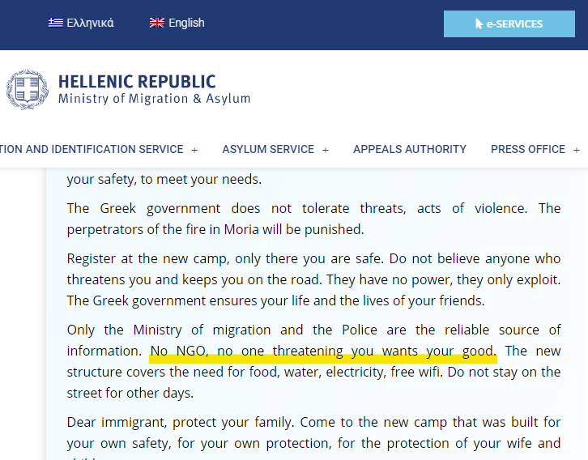
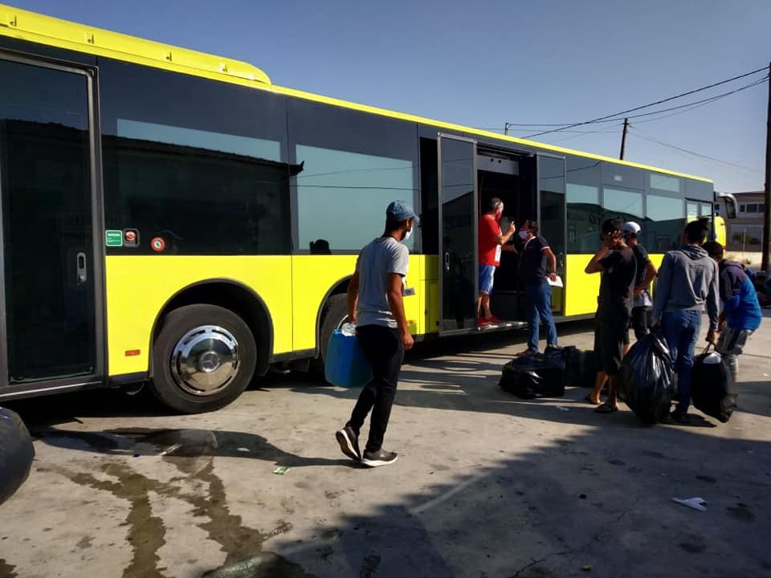
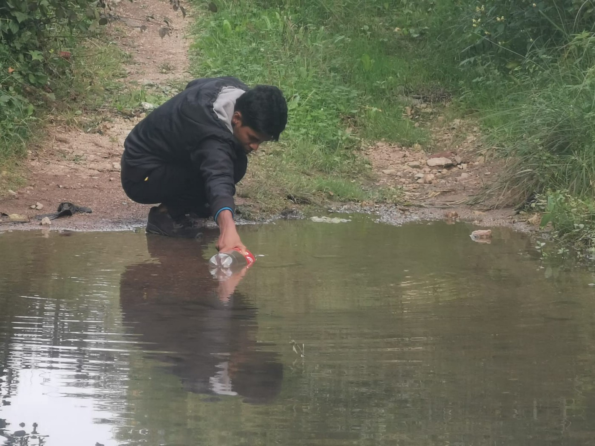

### AYS Daily Digest 18/09/2020 — Greek Government Publishes Lies, Vilifies NGOs in Statement to Asylum Seekers

[Are You Syrious?](@AreYouSyrious?source=post_page-----eef0253e8f08--------------------------------)

[Sep 19](ays-daily-digest-18-09-2020-greek-government-publishes-lies-vilifies-ngos-in-statement-to-asylum-eef0253e8f08?source=post_page-----eef0253e8f08--------------------------------) · 11 min read

People Aboard Open Arms Finally Allowed to Disembark///50 People in Distress Because of Medicane///New Monthly Report From BVMN///&More

FEATURE
### Greek Government Lies About State in Kara Tepe, Vilifies NGOs

The Ministry of Migration & Asylum has published a positively Orwellian statement, ironically titled “ [Respect and Solidarity](https://migration.gov.gr/respect-and-solidarity/?fbclid=IwAR1rRjndP4bGVa6lfKb6Zd6A4FrdosNfS4r2he8SUOFm179shF0k_yia8so) ”\. The statement aims to encourage people to go to the new Kara Tepe camp, but it contains blatant lies as well as vilification of NGOs\.

The Ministry eventually deleted the sentence vilifying NGOs, but several organizations were able to capture screenshots\. This is part of the government’s larger strategy of preventing nonprofits from operating and blaming them in the media for everything wrong with the asylum system\. Today alone, the authorities [stopped NGOs from distributing food](https://www.facebook.com/RefugeesFoundationSfRotR/posts/1713649972127592) and water in a cynical move to force people into camps, threatening them [with fines](https://twitter.com/daphnetoli/status/1306950043845492736?fbclid=IwAR2x2Mfr5qr7GxE6Aj_rji19unNP1Rq2FkhYi4HPmuFXgUp4NzgKFflbKuM) \. All year, the government has been trying to [impose further restrictions](https://reliefweb.int/report/greece/greece-regulation-ngos-working-migration-and-asylum-threatens-civic-space') on their ability to operate and associate freely, even though it [often depends on NGOs](https://twitter.com/joelhdz/status/1307034231407890436?fbclid=IwAR27TnTDzvTKHdfzANOlsgaxie61C4QrU2D0UJRDGI8t9-YWkEJEyEHsXcs) to provide services it cannot \(or will not\) provide itself\. Attacking nonprofits has been a favorite tactic of the government for a while and it has found fertile ground among certain segments of the Greek population\. There were [scores of attacks](https://rsaegean.org/en/timeline-of-attacks-against-solidarity/) on solidarity workers in February and March, and the threat of violence has never fully gone away\. An inflammatory statement like this that equates NGOs with threatening people could lead to more violence\.

Even though the sentence about NGOs was deleted, the statement still reads like an excerpt from _1984_ \. It begins like this:

> _Dear migrant, if you are in Lesvos, the only safe place for you and your family is in the new camp\. There, the Greek State guarantees your safety and provides you with electricity, water, medical care, wifi etc\._ 

Even though the government has attempted to limit media access, reports have been pouring out about the horrendous conditions in the new camp\. There is still [no running water](https://twitter.com/DunyaCollective/status/1306953119327309830?fbclid=IwAR2KX6GBALUfteqzLSFEU3hW33bhiol4nlNsNW7hIberpR-uLaRTrQT7grM) , limited food, and the tents do not even have flooring\. There are [not enough tents for everyone](https://twitter.com/Elpida_Hoffnung/status/1307044700399063041?fbclid=IwAR08nd8bqmw43YnWd84JwL7w0BrjJLvBsD6klNfMRAeBaXq9ehp1wWptpBw) and families with small children are sleeping exposed to the elements\. Thus, the government is using blatant lies to lure people into the camp\.

The statement “the Greek State guarantees your safety” is especially ironic considering the police [teargassed people](https://twitter.com/DunyaCollective/status/1306945605537861632) just a few days ago and stopped them from getting food and water\.

The government also promised asylum proceedings would restart next Monday\. However, many legal observers are calling for a [temporary suspension](https://www.facebook.com/EuropeanLawyersInLesvos/posts/2726473321006742) of asylum decisions for many reasons, including a lack of information about legal representatives’ access to the camp\. Interviews will proceed, but when will people still waiting on their asylum decisions, [including unaccompanied minors](https://www.infomigrants.net/en/post/27335/afghan-minor-in-lesbos-when-i-received-proof-of-my-underage-status-it-was-already-too-late?fbclid=IwAR3X_a_czRxq_3_j0E9Mwv_RM62XIWAk8lfu6cH1mitlXu_yS3ehjm4e7_E) , receive the papers that they need to rebuild their lives? It’s clear that the priority is not actually helping asylum seekers but speeding up the “efficiency” of the system\.

For a government agency to blatantly lie in its communication to vulnerable people and use an official communication to demonize NGOs is a new low\.
### SEA
### People Aboard Open Arms Finally Allowed to Disembark

A total of 276 people spent 10 days on board a crowded rescue ship\. Now, finally, the Open Arms will be [allowed to dock in Palermo](https://www.facebook.com/proactivaservice/posts/3528472470516912) where people will be transferred to the quarantine ship Allegra\. This standoff should never have lasted this long\!

Another ship entering Palermo, but under far less happy circumstances, was the Sea\-Watch 4\. The Italian authorities [ordered the rescue ship](https://www.facebook.com/NewsfromtheMed/posts/1039152693204993) to enter the harbour\. Although the ship plans to [continue to Burriana](https://twitter.com/seawatch_intl/status/1306993853375885313?fbclid=IwAR3gNHKjRLr_fQd6GBnG5PfQYyIJn4aJiL7v_nX20TA0-ydqNbzXVGTNPXY) , they fear this is another attempt by the Italian government to tie up rescue ships in administrative detention\.

The work of these rescue ships is vital, because people continue to suffer and die while crossing the Mediterranean\. [Four people died](https://www.infomigrants.net/en/post/27388/at-least-4-dead-in-shipwreck-off-algeria?fbclid=IwAR2qUo2Ff2whHNa0SB8oErh62BS5YJEhH5xVDmnuw2l3NxW7L5OweZktPck) after their raft capsized off the coast of Algeria\. It is easy to become desensitized to almost daily news of deadly shipwrecks, but behind each number was a life, a life that could have been saved if rescue ships were allowed to operate freely or if people had legal pathways to cross borders\.
### MORIA
### More People Herded into Kara Tepe Camp in Horrible Conditions

More and more people are moving into the Kara Tepe camp, whether willingly or because the government gave them no other choice\. Of the new residents, at least 150 have already [tested positive for COVID\-19](https://www.rnd.de/politik/un-150-moria-fluchtlinge-positiv-auf-covid-19-getestet-S3JVFBUAEBD7T3R47D7TTMVBFA.html?fbclid=IwAR0QK4tyGXA9WKlOC9_UW94cFVkE7Az8Ai3rjM3PvBWfw0IqDEzS2iRnaiM) \.

Organizations like [Moria White Helmets](https://www.facebook.com/MoriaWhiteHelmets/posts/186680232975044) and Stand By Me Lesvos did their best to organize an efficient, comfortable transfer from Mytilene by bus\. The White Helmets also [organized a cleanup](https://www.facebook.com/MoriaWhiteHelmets/posts/186766532966414) of the area they were staying at before the transfer\.

Even in the midst of such tragedy and confusion on Lesvos, Stand By Me Lesvos also helped [Leros Refugee Youth Group](https://www.facebook.com/www.standbymelesvos.gr/posts/718614012064957) buy food for people in quarantine\. This is the work solidarity groups do, despite their villainization by the government\!

The picture that we have of life in Kara Tepe is limited by the Greek government’s crackdown on journalists\. Authorities are using the “ongoing military operation” and the pandemic to justify denying access\. Journalists are [denied access](https://www.facebook.com/reporterohnegrenzen/posts/10158553027159536) and at least one [was brutally arrested](https://www.reporter-ohne-grenzen.de/pressemitteilungen/meldung/polizei-behindert-berichterstattung-aus-moria?fbclid=IwAR3Kn8bScf7qKFFmfonOVfMuG9Bq2TPUsdJnwcSpcj-i22A72h3XvzLnb1Y) , prompting an outcry from organizations including Reporters Without Borders\. If the camp is as wonderful as the statement we unpacked in the feature made it seem, why can’t the media observe freely? What is there to hide?

The new, closed camp was created not because it is the obvious humanitarian solution but because it fits into the agenda of the Greek government, where a humanitarian crisis is weaponized to justify forceful security measures\. The deputy migration minister even s [aid on the radio](https://twitter.com/daphnetoli/status/1306878538608529408?fbclid=IwAR0Yyx-La_jc8UvL74r7miuLJykGe97dAivcyCpCUF67JiZhhnzc19QFcAU) , “the burning of the Moria camp marked the end of an era…we need tightly controlled centers and overall policy change in the EU\.” The authorities are going as far as to refuse alternative solutions\. The tour operator Phoenix Reisen offered up its [cruise ship “Amadea”](https://www.rnd.de/politik/fluchtlinge-von-lesbos-auf-kreuzfahrtschiff-umsiedeln-griechische-behorde-konnten-einsatz-blockieren-YFUNVKK6MZYZOX4G546F3NQJA4.html?fbclid=IwAR1bPOhimMtpkGNbr5_lWKWeakC9ccNSxaDm95xfACdBnRYUkBWQcxdxkU0) as a temporary shelter and offered to cover the charter costs, but there’s little chance the government will accept it \(they rejected a previous offer at the beginning of the pandemic\) \.

Despite the horrible conditions and repression of dissenting voices, the European Union has not stepped up to resettle the people of Moria\. Instead, they are [discussing an EU\-Greece collaboration](https://twitter.com/g_christides/status/1306931555387035649?fbclid=IwAR0Yyx-La_jc8UvL74r7miuLJykGe97dAivcyCpCUF67JiZhhnzc19QFcAU) on the camp’s replacement\. Ursula von der Leyen even urged [other national leaders to step up](https://www.politico.eu/article/merkel-von-der-leyen-mitsotakis-discuss-lesvos-asylum-project/?fbclid=IwAR3IR_7cCppKSgOd6xVWlkKK5mC2RmsIN9UWtLu0mCpNmgo6Y-VKEui2mtw) and support the new “reception and processing center” on Lesvos, instead of urging them to step up and help people find dignified housing\. What happened to “ [no more Morias](https://www.ecre.org/editorial-no-more-morias-except-this-one-that-were-building/?fbclid=IwAR1oLRU8aXSyxcaY1UsuktyprFIy24IZIcHTtC9VTGip0-fXy9W6Fji4xq4) ”?

For context on how we got here, check out [Solomon’s latest newsletter\.](https://wearesolomon.com/mag/newsletters/the-moria-chronicle-connecting-the-dots/?fbclid=IwAR2YPNfxogki68DfLsY1Z8BOHABGJGyASFUtvyYZzcIa-TF38w9sCoOHGOY) [This interview](https://www.belltower.news/nach-dem-brand-im-gefluechtetenlager-moria-interview-mit-mare-liberum-104415/?fbclid=IwAR35s9Hu21GR-ZZ2I_z_UqO2bZdXk66bjPBsYm9RE7W01WoYY5-pJgYnDjM) with “Mare Liberum” \(in German\) is also worth checking out\.
### GREECE
### Medicane Endangers Lives of People on the Move

A boat [carrying about 50 people](https://www.keeptalkinggreece.com/2020/09/18/migrants-boat-distress-medicane-greece/) made a distress call off the Western Peloponnese\. The Coast Guard attempted a rescue, but harsh conditions as a result of Medicane Ianos made a rescue impossible\. We will update with more information as we learn more; hopefully the people are safe\.
### Evros Farmer Who Held Asylum Seekers at Gunpoint Sentenced to Prison

The Evros farmer that held two families at gunpoint on Wednesday made his [court appearance today](https://twitter.com/lk2015r/status/1306927464942272514?fbclid=IwAR3OzKU6IQ-aN_hftunLjSsnAIaIPAClNso3UJmwy5vP9IB6qU4PzF9Ahcc) \. He was found guilty of assault, but not guilty of racial motivation\. However, even though this man will face 26 months in prison, he is just one cog in a larger problem where civilians are increasingly emboldened to act as vigilantes\. Farmers have come to see themselves as helpers of the police and border guard and often have the tacit or outright approval of authorities\. This man was widely supported by the local farmers’ association, some of whom protested in front of the court house\. The media also portrayed him as a local hero unfairly persecuted by NGOs and Turks\. This also raises the question [if the militias formed in March ever disbanded](https://www.efsyn.gr/ellada/koinonia/260284_klima-patriotikis-exarsis-prin-apo-ti-diki) \.

His conviction will not be enough to stop racist vigilante violence when the government itself acts outside of the law\. The Greek authorities illegally [deported four Kurdish families](https://twitter.com/lk2015r/status/1307016690719502337?fbclid=IwAR0QK4tyGXA9WKlOC9_UW94cFVkE7Az8Ai3rjM3PvBWfw0IqDEzS2iRnaiM) to Turkey\. The families were [already staying in the refugee structure at Lagadikia](https://www.efsyn.gr/node/260364) and were waiting to receive their Certificate of International Protection\. Instead, they were snatched and taken to Turkey\. By conducting illegal pushbacks, the government is sending a message that laws do not have to be respected and that people on the move must be expelled from Greece by any means necessary\.
### Aggressive Raid On People Staying in Abandoned Factories

From No Name Kitchen’s [Facebook page](https://www.facebook.com/NoNameKitchenBelgrade/posts/1075143252883958) :

> _Witnesses report that a few commando police raided the factories, waking up those present and after placing them on the ground next to each other, they proceeded to confiscate most of their cell phones for the duration of the search\._ 

> _Subsequently, a document check was carried out, which led to the arrest and imprisonment of those who did not have them\._ 

> _The inhabitants of the factories told us that police acted without discernment, screaming and shouting at the migrants for the whole duration of the operation\._ 

### Situation in Samos

The number of confirmed coronavirus cases in Samos has [risen to ten](https://www.facebook.com/samosvolunteers/posts/1700174153494071) \. The camp is now on lockdown and the activity of solidarity workers is restricted\. However, there is no way to socially distance or properly sanitize in the camp\. Refugees in all Aegean camps are “ [at the mercy of the pandemic](https://rsaegean.org/en/refugees-on-the-aegean-islands-at-the-mercy-of-the-pandemic/?fbclid=IwAR1rRjndP4bGVa6lfKb6Zd6A4FrdosNfS4r2he8SUOFm179shF0k_yia8so) ” due to crowded conditions and inadequate sanitation measures, as this report from Refugee Support Aegean reminds us\.
### School’s Back, but Access May Vary

School is starting again for children in Greece, but some may not attend solely because of their immigration status\. A total of [845 school\-aged children](https://twitter.com/parwana_amiri/status/1306864161733906438?fbclid=IwAR3ZFr0qzNaeFIvGa9xZANrwF5FmPxYRR-awg0ocD-LICwHKIIwVNwnXZTk) in Ritsona are not registered for school and are unable to continue the education that they have a right to access\. However, in Tilos, [children are able to attend school](https://www.facebook.com/UNHCRGREECE/posts/4968826776475874) with their Greek peers and study and play as all children should\. Hopefully, more areas will follow Tilos’ example\.
### BALKANS
### New Monthly Report from Border Violence Monitoring Network is Here

In August, a whopping 692 people were victims of border violence across the region\. Many stories focused on violence conducted by third\-party nationals who are increasingly present in pushbacks at the North Macedonia\-Greece border and Greece\-Turkey border\. The reliance on third\-party nationals is especially troubling as there is no mechanism for holding them accountable for illegal pushbacks or even identifying them\.

You can read more about this practice and other incidents of border violence in the August report, available [here](https://www.borderviolence.eu/wp-content/uploads/Working-Doc-August-Report-BVMN-2.pdf) \.

More and more people are arriving in Trieste, many bearing the traces of police encounters in the form of bruises and wounds all over their bodies\. Volunteers are doing their best to help [by buying food](https://www.facebook.com/lorena.fornasir/posts/3256942137756194) and distributing warm sweatshirts\.

Meanwhile, the Romanian\-Serbian border is looking to be the next [‘hot frontier](https://it.euronews.com/2020/09/18/polizia-di-frontiera-rumena-violenze-contro-migranti?fbclid=IwAR2YPNfxogki68DfLsY1Z8BOHABGJGyASFUtvyYZzcIa-TF38w9sCoOHGOY) ’ along the Balkan route\. The Romanian police are severely beating people and damaging or stealing their phones\. The Romanian police of course denied everything and the EU has characteristically remained silent\.
### LIBYA
### 380 People Stuck in Torturous Zintan Camp

[About 380 people](https://www.facebook.com/rastajuly/posts/10158034188878621) have been stuck in Zintan camp since 2017\. They are subject to physical torture, starvation, diseases such as TB, and now armed attacks as the civil war in Libya rages\. Many are Eritreans fleeing a repressive dictatorship notorious for its human rights violations, as detailed in [this report](https://www.ohchr.org/en/hrbodies/hrc/coieritrea/pages/reportcoieritrea.aspx?fbclid=IwAR2KYnKTxnjvdn3jXwR0dbXd2umRMIWe42DNR2DSo5nT4KhQMSppMcVS1BQ) by the UN Human Rights Council\. They must be evacuated immediately\!
### SPAIN
### Neo\-colonialist Bureaucratic Boycott in Melilla Enclave

Bureaucrats in Melilla, the Spanish enclave on the North African coast, have apparently been carrying out a “ [bureaucratic boycott](https://cadenaser.com/programa/2020/09/12/a_vivir_que_son_dos_dias/1599896942_250647.html?fbclid=IwAR3anIO8c2az77KRWtkvojykAAfggYDoTXNHXDqK0xTZgCDBAFSQxyNXj0k) ” and refusing to register Moroccan people living in the city\. They refuse to do so out of a fear of the “Moroccanization” of the city if the Moroccan population grows, an excuse that feels more appropriate for the seventeenth century than the twenty\-first\. Due to their irregular status, people cannot leave Melilla unless they take risky irregular routes, and children cannot access basic services such as school\.
### Statement of Concern From Medical Professionals In CETI

Nurses, physicians and psychologists [signed a joint statement](https://www.melillahoy.es/noticia/134504/sanidad/enfermeros-medicos-y-psicologos-suscriben-un-comunicado-conjunto-de-preocupacion-por-la-situacion-del-ceti.html?fbclid=IwAR1Mk0VOZtYlnjzApFPbmhmIi-GjjpytuxEZjZ2cWQGmicdOir9u-SyAKFs) denouncing the conditions in the CETI in Melilla\. The number of positive cases in the centre is growing, but there is no space for people to self\-isolate\. They also denounced the toll that the high workload is taking on workers in the CETI\. While it is important to remember the effect these conditions have on people forced to live in the CETI, the inhumane conditions take a toll on workers as well\.
### FRANCE
### French Authorities Continue Violent Actions in Calais

There were [more evictions today](https://twitter.com/HumanRightsObs/status/1307014541872685061?fbclid=IwAR3ZFr0qzNaeFIvGa9xZANrwF5FmPxYRR-awg0ocD-LICwHKIIwVNwnXZTk) at Calais and Grand Synthe\. The police also conducted arbitrary arrests in a clear violation of human rights\.

The French authorities are also depriving people of food by banning NGOs from distributing food in certain parts of Calais\. The authorities claim that their aid is enough, but they [do not provide enough food](https://twitter.com/Care4Calais/status/1306974250444697602?fbclid=IwAR3-9BR3uriHiebb5WmePmnj0xsIcyzbEyT7-3cYuK3rVCs3YCotgp7rhfk) for everyone\. Deprivation of basic needs such as food is also an act of violence and must end immediately\.

There are real people harmed by the state’s callousness\. One of those people is Mohamed, a writer and dreamer featured in [this video by Care4Calais](https://www.facebook.com/care4calais/posts/3648063175226613) \.
### EU
### The State of EU Solidarity

Something is rotten in the state of the union, as there is still no common agreement on refugee resettlement\. Once again, German politicians, including conservative Seehofer, are frustrated by the lack of solidarity from other nations, including France and Austria, when it comes to resettlement\. Chancellor Merkel complained of “ [the entire wretchedness of European asylum policy](https://www.spiegel.de/international/germany/europe-s-refugee-disaster-merkel-losing-her-patience-with-lack-of-eu-solidarity-a-2a13fc6c-3fc3-4d86-9eb7-70f9c1b49ef0?fbclid=IwAR03LPgoXsGX7PC2S6h59-Rz4fthHntKPo7O6Q-Hy8hwMkXH7BkwCXqbcAI#ref=rss) \.”

Things are not likely to get much better as the Visegrad Four will [probably reject](https://www.euractiv.com/section/justice-home-affairs/news/poland-rejects-southern-europes-push-for-mandatory-relocation-of-migrants/?fbclid=IwAR2x2Mfr5qr7GxE6Aj_rji19unNP1Rq2FkhYi4HPmuFXgUp4NzgKFflbKuM) any mandatory resettlement efforts southern European nations are asking for\.

One collective mechanism of the EU that has faced no trouble is Frontex, the border agency\. Frontex released [a report](https://www.statewatch.org/media/1346/eu-council-frontex-standing-corps-progress-report-10361-20-3.pdf?fbclid=IwAR2_igoL5g8YcXunZlQZ8QTmb5uxrgfnjm6Lnr860GF9ZqrQrMq_l2ypdXM) detailing its plan to continue recruiting a “standing corps\.” The report details [continuing recruitment and training processes](https://www.statewatch.org/news/2020/september/internal-frontex-report-agency-moves-forward-with-standing-corps-recruitment-despite-covid-19-delays/?fbclid=IwAR28B2cqEaUSXW3ziuREuBow35jFAmyWiRI-4Pq8dV_yvY9t06LJxGhyUjc) for border guards, uniforms and more\.

The European Commission is looking for applicants for an expert group on “the views of migrants in the field of migration, asylum and integration policies\.” You can find more information and application instructions [here](https://ec.europa.eu/migrant-integration/news/ec-expert-group-on-the-views-of-migrants-useful-information-for-applicants?fbclid=IwAR364O7mNnFY3AMe_zYaJGuJko6qmRwnZOAuBtQ-1Ctj9Im2T0Kk1DRXQuU) \.
### FUTURE EVENTS

Mass demonstrations are planned for this Sunday across Europe\! Check out the full list [here](https://www.facebook.com/europemustact/posts/174392180840151) \.

Statewatch and Transnational Institute are hosting a three\-part webinar series on “Deportation Union: Rights, accountability, and the EU’s push to increase forced removals\.” The first one is on September 28th, learn more and sign up [here](https://www.statewatch.org/publications/events/deportation-union-revamped-return-policies-and-reckless-forced-removals/?fbclid=IwAR1npGbmnTBBnGx5GgPRZk75vhQLQRLvbQ232RfL022dhupXOPrF45TRWL8) \.
### WORTH READING

Last month, the Banksy\-funded rescue ship, the _Louise Michel,_ embarked on her maiden voyage and immediately was the victim of a standoff with European authorities\. Read an interview with Lea Reisner, the head of mission for the ship, [here](https://thecivilfleet.wordpress.com/2020/09/18/this-would-not-have-happened-if-the-people-we-found-were-white/?fbclid=IwAR35s9Hu21GR-ZZ2I_z_UqO2bZdXk66bjPBsYm9RE7W01WoYY5-pJgYnDjM) \.

[This article](https://www.infomigrants.net/en/post/27398/france-to-uk-why-do-migrants-risk-the-channel-crossing?fbclid=IwAR0gzI7ykPwOJvV2V3_L0fXnOrsSd2TVwwM1FKqEFJ_iOAFBqGg9EBVi980) from InfoMigrants traces the motivation of people crossing the Channel as well as the dangers they face, both at sea and once they land\.

**Find daily updates and special reports on our [Medium page](https://medium.com/are-you-syrious) \.**

**If you wish to contribute, either by writing a report or a story, or by joining the info gathering team, please let us know\.**

**We strive to echo correct news from the ground through collaboration and fairness\. Every effort has been made to credit organisations and individuals with regard to the supply of information, video, and photo material \(in cases where the source wanted to be accredited\) \. Please notify us regarding corrections\.**

**If there’s anything you want to share or comment, contact us through Facebook, Twitter or write to: areyousyrious@gmail\.com**
### Sign up for AYS Daily Newsletter
### By Are You Syrious?

Daily news digests from the field, for volunteers, people on the move, journalists, and the general public [Take a look](/are-you-syrious/newsletters/ays-daily-newsletter?source=newsletter_v3_promo--------------------------newsletter_v3_promo-----------)

_Converted [Medium Post](https://medium.com/are-you-syrious/ays-daily-digest-18-09-2020-greek-government-publishes-lies-vilifies-ngos-in-statement-to-3984e59344c1) by [ZMediumToMarkdown](https://github.com/ZhgChgLi/ZMediumToMarkdown)._
